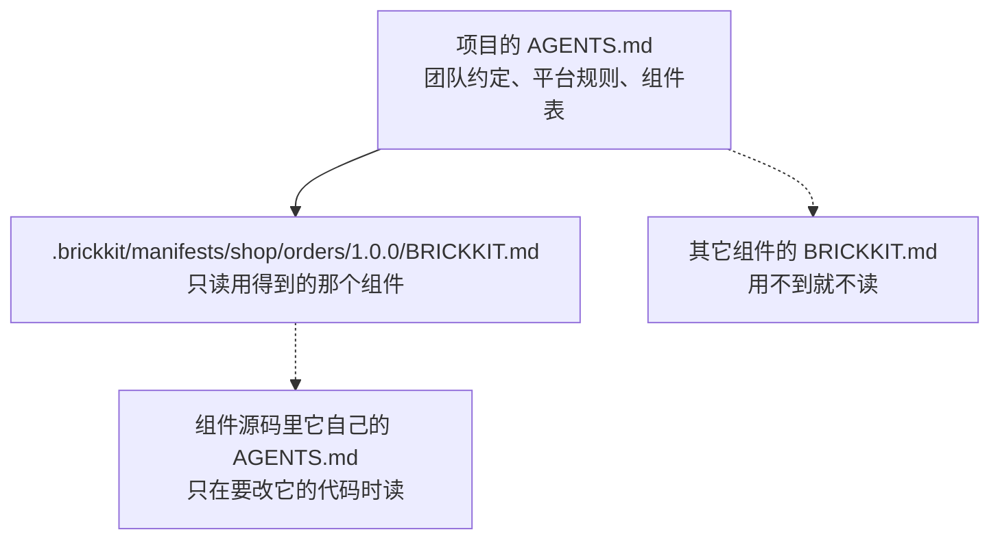

# 分形架构（套娃机制）

"分形"指的是同一个形状在不同尺度上重复出现。BrickKit 的规范就是这样：一个项目由组件组成，而一个组件在
开发它的人手里，**本身又是一个完整的项目**。

## 核心概念

- **开发态（项目视角）：** 组件作者在组件仓库里可以放一套自己的三层文件（`brickkit.yaml`、`deploy.yaml`、
  `config/`），用来在本地拉起这个组件的依赖、联调。这时组件仓库就是一个普通的 BrickKit 项目。
- **消费态（组件视角）：** 别的项目 `brickkit add` 这个组件时，只读它的 `component.yaml`（契约）和
  `BRICKKIT.md`（文档）。组件仓库里那套三层文件、它为联调拉来的依赖，对使用者来说**不存在**。
- **物理不套娃，规范套娃：** 使用者的项目里不会嵌进一个组件的项目；嵌套的只是规范——每一层都用同样的三层文件、
  同样的命令、同样的文档结构。

这样做的好处：组件作者联调时用的工具和使用者装配时用的工具是同一套，不用学两遍；而作者本地为联调临时加的东西
（一个 mock、一个调试开关）永远不会泄漏到使用者那里。代价是：组件的依赖关系只能写在 `component.yaml` 的
`dependencies` 里——作者工作台 `brickkit.yaml` 里多装的组件，使用者看不见，也不该看见。

## 开发态：组件仓库里的本地工作台

在组件仓库的根目录运行不带名字的 `brickkit init`（补全式：缺什么补什么，已有的一个字节都不动）。
下面用 `brickkit new` 先生成一个组件，再在它的目录里补全：

```bash
brickkit new shop/orders --path orders
```

```text
✅ 已生成组件骨架：shop/orders
   📄 orders/component.yaml
   📄 orders/BRICKKIT.md
   📄 orders/AGENTS.md
   📄 orders/CLAUDE.md
   📄 orders/README.md

下一步：
  把 component.yaml 和文档里的 TODO 填完（brickkit lint 会列出剩下的每一处）
  cd orders && brickkit init    给它建本地联调工作台（补全式：已有的文件不动）
  brickkit lint                 检查 component.yaml 和文档
```

```bash
cd orders
git init
brickkit init --yes
```

```text
当前目录已有文件，brickkit init 将：
   ✅ 创建  brickkit.yaml
   ✅ 创建  deploy.yaml
   ✅ 创建  config/vars.yaml
   ✅ 创建  config/.gitkeep
   ✅ 创建  .gitignore
✅ 项目已补全：orders
   📁 .claude/skills/      AI 助手技能（5 个）
   🪝 .git/hooks/pre-commit 提交前检查组件结构
   ✅ 收尾校验通过：项目可以装载
```

几点值得注意：

- 组件仓库里的 `init` 不建 `components/` 与 `shell/`，也不声明那两个本地源——那是装配型项目的目录约定，
  组件仓库用不上。
- 组件自己的文档（`BRICKKIT.md`、`AGENTS.md`、`CLAUDE.md`、`README.md`）一个字节都不动；只改写 `AGENTS.md` 末尾那段由 CLI
  维护的区块，这时它除了组件规则，还多了工作台的组件表。工作台只有一份 `AGENTS.md`，不是两份。
- 之后用 `brickkit add` 把这个组件的依赖加进工作台，`brickkit up` 就能在本地拉起完整的依赖树联调。
  这时 `brickkit.yaml` 是作者的**本地工作台**，要不要提交由作者决定。

项目里的本地源放着好几个组件、想给每个都建好工作台时，用 `brickkit add --local --init`：
它先给每个还没有 `brickkit.yaml` 的本地组件补好工作台，再把它们都加进项目。

## 消费态：只读契约和文档

使用者 `add` 这个组件时，CLI 从组件的 Git tag 里只取契约和文档，永久缓存到项目的 `.brickkit/manifests/` 下：

```text
.brickkit/manifests/shop/orders/1.0.0/
├── component.yaml    契约：依赖、端口、配置项、健康检查、镜像
├── BRICKKIT.md       文档：这个组件怎么用
└── BRICKKIT.zh.md    译本，组件带着才有（BRICKKIT.<语言>.md）
```

组件的 `AGENTS.md` 和 `README.md` 留在它自己的仓库里：一份写给开发它的人，一份写给在 GitHub 上逛仓库的人，
使用它的项目用不上。

依赖树只从 `component.yaml` 的 `dependencies` 解析。组件仓库里的 `brickkit.yaml`、`deploy.yaml`、`config/`
一概不看。`.brickkit/` 本身不进 Git：克隆项目之后第一次 `add` 或 `up` 时，CLI 会按需重新取回，就像
`node_modules` 不进 Git 而 `package.json` 进。

## 同一个目录里既有 `component.yaml` 又有 `brickkit.yaml`

这正是组件仓库带着工作台时的样子。CLI 这样认：

| 命令 | 以谁为准 |
| --- | --- |
| `up`、`add`、`status` 等装配命令 | 当作**项目**：操作的是本地工作台 |
| `lint` | 当作项目检查三层文件，同时也检查这份 `component.yaml` |
| `release` | 只认 **`component.yaml`**：版本号、校验都来自它，`brickkit.yaml` 完全不看 |

`release` 只认 `component.yaml` 保证了发布的纯粹：作者联调时临时加进工作台的组件，不会被带进发布的版本。

## 组件的文档：`BRICKKIT.md`、`AGENTS.md`、`README.md`

组件仓库带三份文档，各有各的读者，外加一份 `CLAUDE.md`（只有一行 `@AGENTS.md`）：

| 文件 | 谁读 | 会不会带进使用它的项目 |
| --- | --- | --- |
| `BRICKKIT.md` | 使用这个组件的人和 AI | 会：缓存在 `component.yaml` 旁边，脱离仓库单独被读 |
| `AGENTS.md` | 开发这个组件的 AI（和人） | 不会 |
| `README.md` | 在 GitHub 上逛仓库的人；主要是指向另外两份的路标 | 不会 |

`brickkit new` 生成的 `BRICKKIT.md` 骨架有六节：

```markdown
# shop/orders

## 组件定位

<!-- TODO: 一两句话说解决什么问题，再两张短表：负责、不负责（每条写明归谁） -->

## 部署前准备

<!-- TODO: brickkit up 之前要准备好的东西——数据库及其 schema 和角色、账号、证书——每样由谁准备、怎么确认好了；没有就写"除下面的配置外无需准备。" -->

## 依赖说明

<!-- TODO: 每条依赖写 ID（不写版本）、拿来做什么；可选依赖写缺席时会怎样 -->

## 配置指南

| 变量名 | 必填 | 说明 |
|---|---|---|
| <!-- TODO: configSchema 里的一个 key --> | | <!-- TODO: 它的业务含义，尤其是默认值说不清的部分 --> |

## 契约索引

<!-- TODO: artifacts 下的每个文件与它描述的主要接口；发布的事件；消费的事件 -->

## 外壳声明

不是外壳。
```

文档本身也是分形的，出现在三个层级：

| 层级 | 文件 | 职责 | 谁写 |
| --- | --- | --- | --- |
| 定义层（平台） | BrickKit 仓库根目录的 `AGENTS.md` / `AGENTS.zh.md` | 规定文档的结构和 AI 的读取路线 | 平台维护 |
| 实例层（项目） | 项目根目录的 `AGENTS.md` | 团队约定、查找路由、易错点；末尾是平台规则摘要和项目组件表，写明各自的文档和契约在哪 | 各节由作者写；组件表由 `init`、`add`、`remove`、`upgrade` 改写 |
| 内容层（组件） | 组件仓库根目录的 `BRICKKIT.md` 与 `AGENTS.md` | `BRICKKIT.md`：定位、部署前准备、依赖、配置含义、契约；`AGENTS.md`：代码地图、构建与测试、设计取舍 | `new` 生成骨架，作者填写 |

写法细则见 [组件的文档](../03-component-guide/08-component-doc-spec.md)。

## AI 的套娃读取路径



AI 先读项目的 `AGENTS.md`，再按需读某一个组件的文档，要改某个组件的代码时才打开它自己的 `AGENTS.md`：
不翻组件源码，不读组件仓库里的三层文件，一次只装进当前问题需要的那一点上下文。详见 [分形架构下的读取策略](../08-ai-guide/05-fractal-reading.md)。
