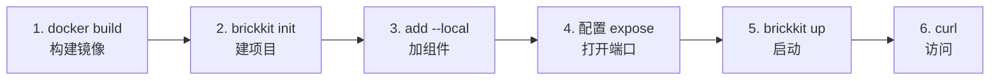

# Quick Start（5 分钟）

用仓库自带的测试夹具 [`demo/hello`](../../tests/components/demo-hello/) 走一遍最短的真实路径：从空目录到一个可以用 HTTP 访问的容器。每一条命令和每一段输出都是真跑出来的，不是编的。

**前置条件：** BrickKit CLI 已经构建好（`make build-cli`，或者装了发行版），Docker 在运行。

六步，从空目录到能 curl 通：



## 1. 构建测试夹具镜像

`demo/hello` 是这个仓库自己的测试夹具，没有发布到任何镜像仓库，先在仓库根目录本地构建一次：

```bash
docker build -t brickkit-demo/hello:1.0.0 tests/components/demo-hello
```

真实场景里，组件镜像在你 `brickkit add` 它的时候早就已经在某个镜像仓库里了——Manifest 的 `deployment.image` 永远是指向一个已经构建好的东西，CLI 从不替你构建。这里只是因为 `demo/hello` 没有发布到任何地方，才需要这一步。

## 2. 创建项目

```bash
mkdir hello && cd hello
brickkit init hello
```

```
✅ 项目已初始化：hello
   📁 brickkit.yaml        项目配置
   📁 components/          组件源码（已配为本地安装源 local-dev）
   📁 .brickkit/           CLI 工作目录
   📁 .claude/skills/      AI 助手技能（4 个）
   📁 AGENTS.md            AI 助手项目导读

下一步：
  brickkit add --local               把 components/ 下的组件全加进来
  brickkit add people/basic@1.0.0    从安装源添加组件
  brickkit up                        一键启动
```

`init` 已经把 `components/` 配成了一个 `local` 类型的安装源——下一步就是往这里放东西。

输出里的 `.claude/skills/` 和 `AGENTS.md` 是给 AI 助手看的：`init` 默认会装上，让 AI 一开始就知道平台里那些"凭常识会猜错"的规则。它们描述的是**当前这个版本的 CLI**，所以以后升级了 CLI，在项目里跑一次 `brickkit skills update` 就能刷新——你手改过的文件不会被覆盖；只想看有没有过期，用 `brickkit skills`，它只读不改。不想要，`init` 时加 `--no-skills`。

## 3. 添加组件

把组件的 Manifest 和 artifacts 复制进本地安装源，按 `<scope>/<name>/component.yaml` 的目录结构摆放：

```bash
mkdir -p components/demo/hello
cp ../tests/components/demo-hello/component.yaml components/demo/hello/
cp ../tests/components/demo-hello/openapi.json components/demo/hello/
brickkit add --local
```

```
🔍 从本地安装源 local-dev 扫到 1 个组件
📦 添加 demo/hello@1.0.0
   ├── Manifest ✅
   └── artifacts ✅（1 个文件）
✅ 已写入 brickkit.yaml（1 个组件）
```

`--local` 不接组件 ID，它的语义是"把本地安装源里的组件一次全部添加"，不是"以本地调试模式添加某个组件"——这是最容易记错的一个地方。

## 4. 打开端口暴露

默认不暴露任何端口是刻意的安全默认（AGENTS.md §4），不是漏了配置。打开 `brickkit.yaml`，给 `demo/hello` 这一条加两行：

```yaml
components:
  - id: demo/hello
    version: 1.0.0
    expose: true
    exposePort: 8080
```

## 5. 启动

```bash
brickkit up
```

```
🚀 启动项目 hello（deploy.target: docker）
📋 组件状态计算：
   ✅ demo/hello@1.0.0  启动（顶层）

📋 启动顺序（拓扑排序）：
   1. demo-hello-1-0-0  无依赖

可独立启动：demo-hello-1-0-0（无依赖）
📄 已生成：.brickkit/generated/docker-compose.yaml

🔍 检测镜像拉取权限... ✅ 全部通过

🐳 正在启动（docker）...
   demo-hello-1-0-0             running（healthy）
✅ 全部组件已启动（1 个）

💡 查看状态：brickkit status
   查看日志：docker compose -p brickkit-hello logs -f
```

## 6. 访问

```bash
curl http://localhost:8080/api/v1/hello
```

```json
{"component":"demo/hello","greeting":"你好","message":"你好，我是 demo/hello@1.0.0","version":"1.0.0"}
```

**完成！** 你的第一个组件已经跑起来了，而且是通过标准 HTTP 访问的——不是 CLI 内部的什么特殊通道。

## 收尾

```bash
brickkit down
```

```
🛑 停止项目 hello
✅ 已停止全部组件

💡 数据卷未删除，数据库数据仍然保留
   需要彻底清理时手动执行：docker volume rm <卷名>
   重新启动：brickkit up
```

## 给编辑器接上自动补全

可选，花一分钟就行。`brickkit.yaml` 和每个组件的 `component.yaml` 都有一份 **JSON Schema**：一份机器可读的说明，写清每个字段的类型、是不是必填、能取哪些值。认识 YAML schema 的编辑器会把它变成你敲字时的帮助：

- 补全字段名和取值；
- 把不存在的键画上红线——比如拼错的 `dependancies`；
- 标出类型不对、或者在封闭取值之外的值（`deploy.target` 只能是 `docker` 或 `k8s`）；
- 认得两条最容易踩的规则：版本必须是精确的（`metadata.version` 和 `brickkit.yaml` 里的 `components[].version` 写成 `^1.0.0` 会被标红），`deployment.port` 必须在 1–65535 之间。

这两份文件是 [`schemas/component.schema.json`](../../schemas/component.schema.json) 和 [`schemas/brickkit.schema.json`](../../schemas/brickkit.schema.json)，由 CLI 解析这两种文件时用的同一批 Go 结构体生成，仓库里有一条测试让它们始终同步。`brickkit lint` 是它的离线搭档：在终端里报同一批结构上的问题。

有一个理由让你别跳过这一步。没有接上 BrickKit 的 schema 时，YAML language server 会退回去用 SchemaStore（一个公开的 schema 目录）。截至 yaml-language-server 1.24.0 和写这篇时的 SchemaStore 目录，那份目录把 `component.yaml` 这个文件名对应到了 Kubeflow Pipelines 的 schema——两者都是第三方的东西，会变，以后你的编辑器里看到的可能不一样。我们实测时，一份完全合法的 BrickKit `component.yaml` 几乎处处被画红线（`Property apiVersion is not allowed.`、`Missing property "implementation".`）。用下面任何一种方式接上 BrickKit 的 schema，就会换掉它猜的那份。

**两种接法。** 读 schema 的是 YAML language server（`yaml-language-server`）；VS Code 的 Red Hat "YAML" 扩展自带它，别的编辑器只要跑的是同一个 server，用法也一样。

1. **文件第一行写一行注释。** 它跟着文件走，谁打开这份文件都直接得到 schema，不用配置任何东西：

   ```yaml
   # yaml-language-server: $schema=https://raw.githubusercontent.com/brickKit/brickKit/main/schemas/component.schema.json
   apiVersion: brickkit/v1
   kind: Component
   ```

   `brickkit.yaml` 里这一行写的是 `brickkit.schema.json`。`brickkit init` 和 `brickkit new` 不会替你写这一行，每份文件自己加一次。

2. **一条 VS Code 设置**，不想动文件时用——写在项目的 `.vscode/settings.json` 里，或者你的用户设置里：

   ```json
   {
     "yaml.schemas": {
       "https://raw.githubusercontent.com/brickKit/brickKit/main/schemas/component.schema.json": "component.yaml",
       "https://raw.githubusercontent.com/brickKit/brickKit/main/schemas/brickkit.schema.json": "brickkit*.yaml"
     }
   }
   ```

   `component.yaml` 匹配任意目录下叫这个名字的文件，所以 `components/` 下的每个组件都覆盖到了；`brickkit*.yaml` 匹配 `brickkit.yaml`，也匹配 `brickkit.prod.yaml` 这样的多环境文件。

这个 URL 跟着 `main` 走，所以 schema 和仓库一样新。如果你的 CLI 比较旧，编辑器可能放过一个 CLI 还不认识的字段：你手上这版 CLI 到底接受什么，以 `brickkit lint` 为准。

留空的小节没问题：`dependencies:` 下面的条目全被注释掉时会读成 `null`，CLI 接受，schema 也接受。必填字段不能留空——`deployment.port:` 后面什么都不写会被标红，CLI 也会报它缺失。

**这些 schema 不覆盖什么。** 它们描述的是一份文件自己的字段：名字、类型、哪些必填、封闭取值、格式、范围。另外两类规则刻意不在里面：

- **需要逻辑判断的规则**——大多数不能同时写的组合（比如 `local` 与 `servedBy`）、`configSchema` 的键撞上平台保留的环境变量、组件目录名必须和 `metadata.id` 对得上——归 `brickkit lint`。少数组合规则要到生成部署文件时才检查，比如 `local: true` 配 `deploy.target: k8s`：`lint` 会放过这样的文件，要到 `brickkit up --dry-run` 才被拒绝。
- **需要别的文件、或者联网的规则**——依赖图能不能解析、`servedBy` 指向的组件在不在——归 `brickkit up --dry-run`。`brickkit lint` 同样不做这些：它从不解析依赖。

**编辑器比 CLI 更严的地方。** 一共三处，都是有意的：宁可给几乎肯定是笔误的写法画上红线，也不保持沉默，哪怕 CLI 本来是接受的。

1. **`${VAR}` 写进封闭取值的字段。** `brickkit.yaml` 会**先**从环境变量展开 `${VAR}` 再校验，所以 `TARGET` 设了的话，`deploy.target: ${TARGET}` 是被接受的。schema 校验的是字面文本 `${TARGET}`，它既不是 `docker` 也不是 `k8s`，于是被标红。`sources[].type`、`resources[].kind` 也一样：这些字段请写字面值。
2. **CLI 读得很宽松的 YAML。** 字符串字段里不加引号的数字（`project: 2024`、`password: 123456`）会被悄悄转成文本；该写 true/false 的地方写了 `yes` 或 `on`（`expose: yes`）会被读成 true；列表里的 `null` 元素（`tags:` 下面一个空的 `-`）或 map 里的 `null` 值会照样通过；整数字段里写小数（`port: 5432.5`）会被截成 `5432`。schema 把这些全部标红——它们几乎都是笔误，或者本该加引号的值。
3. **`configSchema` 配置项声明里的多余键。** 那里每个配置项只认固定的几个键（`type`、`default`、`description`、`enum`、`minimum`……）。CLI 的解析并不拒绝多出来的键——比如拼错的 `defualt`，或者写 JSON Schema 的人习惯写的 `format`——只是忽略它，并在 `brickkit lint`、`brickkit publish`、`brickkit add --local` 时警告"这个键不会生效"。schema 把它标红：同一件事，由编辑器来说。

这两份 schema 用真实的 `yaml-language-server`（1.24.0）核对过：未知字段的红线、封闭取值、格式与范围、`deploy.target` 的补全，以及上面两种接法。

## 接下来？

- 想理解刚才发生了什么？→ [核心概念](01-concepts.md)
- 想跟着更完整的教程动手做？→ [教程系列](03-guide/README.md)（这个 Quick Start 走的就是 [第一篇](03-guide/01-first-project.md) 的核心路径，教程里还讲了依赖、配置修改、K8s 部署等更多内容）
- 想查某个命令怎么用？→ [命令一览](06-architecture/09-cli-reference.md#命令一览)
- 遇到问题了？→ [故障排除](08-troubleshooting.md)
