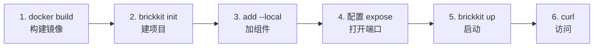

# Quick Start（5 分钟）

用仓库自带的测试夹具 [`demo/hello`](../../tests/components/demo-hello/) 走一遍最短的真实路径：从空目录到一个可以用 HTTP 访问的容器。每一条命令和每一段输出都是真跑出来的，不是编的。

**前置条件：** BrickKit CLI 已经构建好（`make build-cli`，或者装了发行版），Docker 在运行。

六步，从空目录到能 curl 通：



## 1. 构建测试夹具镜像

`demo/hello` 是这个仓库自己的测试夹具，没有发布到任何镜像仓库，先在仓库根目录本地构建一次：

```bash
docker build -t brickkit-demo/hello:1.0.0 tests/components/demo-hello
```

真实场景里，组件镜像在你 `brickkit add` 它的时候早就已经在某个镜像仓库里了——Manifest 的 `deployment.image` 永远是指向一个已经构建好的东西，CLI 从不替你构建。这里只是因为 `demo/hello` 没有发布到任何地方，才需要这一步。

## 2. 创建项目

```bash
mkdir hello && cd hello
brickkit init hello
```

```
✅ 项目已初始化：hello
   📁 brickkit.yaml        项目配置
   📁 components/          组件源码（已配为本地安装源 local-dev）
   📁 .brickkit/           CLI 工作目录
   📁 .claude/skills/      AI 助手技能（4 个）
   📁 AGENTS.md            AI 助手项目导读

下一步：
  brickkit add --local               把 components/ 下的组件全加进来
  brickkit add people/basic@1.0.0    从安装源添加组件
  brickkit up                        一键启动
```

`init` 已经把 `components/` 配成了一个 `local` 类型的安装源——下一步就是往这里放东西。

输出里的 `.claude/skills/` 和 `AGENTS.md` 是给 AI 助手看的：`init` 默认会装上，让 AI 一开始就知道平台里那些"凭常识会猜错"的规则。它们描述的是**当前这个版本的 CLI**，所以以后升级了 CLI，在项目里跑一次 `brickkit skills update` 就能刷新——你手改过的文件不会被覆盖；只想看有没有过期，用 `brickkit skills`，它只读不改。不想要，`init` 时加 `--no-skills`。

## 3. 添加组件

把组件的 Manifest 和 artifacts 复制进本地安装源，按 `<scope>/<name>/component.yaml` 的目录结构摆放：

```bash
mkdir -p components/demo/hello
cp ../tests/components/demo-hello/component.yaml components/demo/hello/
cp ../tests/components/demo-hello/openapi.json components/demo/hello/
brickkit add --local
```

```
🔍 从本地安装源 local-dev 扫到 1 个组件
📦 添加 demo/hello@1.0.0
   ├── Manifest ✅
   └── artifacts ✅（1 个文件）
✅ 已写入 brickkit.yaml（1 个组件）
```

`--local` 不接组件 ID，它的语义是"把本地安装源里的组件一次全部添加"，不是"以本地调试模式添加某个组件"——这是最容易记错的一个地方。

## 4. 打开端口暴露

默认不暴露任何端口是刻意的安全默认（AGENTS.md §4），不是漏了配置。打开 `brickkit.yaml`，给 `demo/hello` 这一条加两行：

```yaml
components:
  - id: demo/hello
    version: 1.0.0
    expose: true
    exposePort: 8080
```

## 5. 启动

```bash
brickkit up
```

```
🚀 启动项目 hello（deploy.target: docker）
📋 组件状态计算：
   ✅ demo/hello@1.0.0  启动（顶层）

📋 启动顺序（拓扑排序）：
   1. demo-hello-1-0-0  无依赖

可独立启动：demo-hello-1-0-0（无依赖）
📄 已生成：.brickkit/generated/docker-compose.yaml

🔍 检测镜像拉取权限... ✅ 全部通过

🐳 正在启动（docker）...
   demo-hello-1-0-0             running（healthy）
✅ 全部组件已启动（1 个）

💡 查看状态：brickkit status
   查看日志：docker compose -p brickkit-hello logs -f
```

## 6. 访问

```bash
curl http://localhost:8080/api/v1/hello
```

```json
{"component":"demo/hello","greeting":"你好","message":"你好，我是 demo/hello@1.0.0","version":"1.0.0"}
```

**完成！** 你的第一个组件已经跑起来了，而且是通过标准 HTTP 访问的——不是 CLI 内部的什么特殊通道。

## 收尾

```bash
brickkit down
```

```
🛑 停止项目 hello
✅ 已停止全部组件

💡 数据卷未删除，数据库数据仍然保留
   需要彻底清理时手动执行：docker volume rm <卷名>
   重新启动：brickkit up
```

## 接下来？

- 想理解刚才发生了什么？→ [核心概念](01-concepts.md)
- 想跟着更完整的教程动手做？→ [教程系列](03-guide/README.md)（这个 Quick Start 走的就是 [第一篇](03-guide/01-first-project.md) 的核心路径，教程里还讲了依赖、配置修改、K8s 部署等更多内容）
- 想查某个命令怎么用？→ [命令一览](06-architecture/09-cli-reference.md#命令一览)
- 遇到问题了？→ [故障排除](08-troubleshooting.md)
