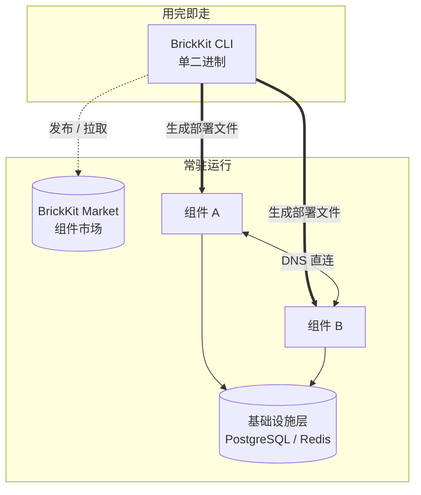
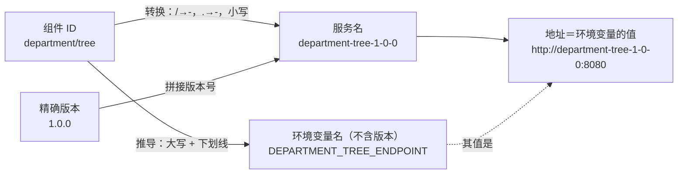

# 核心概念

如果你只想花五分钟弄懂 BrickKit 的骨架、看文档和错误提示时不至于被术语绊住，看这一页就够了。更完整的定义在 [AGENTS.zh.md](../../AGENTS.zh.md) 的术语表里，十二条设计原则背后的论证在[设计原则与取舍](06-architecture/01-design-principles.md)，这里只是一个更快的入口。

## 四个部分

| 部分 | 形态 | 是否常驻 | 职责 |
| --- | --- | --- | --- |
| **BrickKit CLI** | 本地单二进制 | ❌ 用完即走 | 拉取、解析、生成、调用、发布、源码工作区管理 |
| **BrickKit Market** | 独立的在线服务（可自己部署一套） | ✅ | 组件发布与发现、版本/可见性/签名、产物存储 |
| **组件层** | Docker 容器 / K8s Pod | ✅ | 业务本体，组件之间直接走 DNS 互相调用 |
| **基础设施层** | PostgreSQL / Redis 等 | ✅ | 运维手动部署，在 `brickkit.yaml` 里声明绑定关系 |

图里故意只给 CLI 画了虚线、画在"用完即走"那个框里——没有第五个部分，没有常驻的"主系统"。`brickkit up` 跑完就退出，真正跑着的只有你的组件容器和基础设施。

## 关键术语

| 术语 | 英文 | 定义 |
| --- | --- | --- |
| 组件 | Component | 最基本的安装和运行单元：一个可以单独运行的业务程序，**一律打包成容器（Docker 镜像）**，前端也不例外 |
| Manifest | component.yaml | 组件的"自我介绍"文件：它依赖谁、监听哪个端口、有哪些配置项、怎么检查它是否健康 |
| 项目配置 | brickkit.yaml | 你的项目的"订单"：要哪些组件、启用哪些、要不要对外开放、配置怎么覆盖、数据库等资源在哪、部署到哪 |
| 强依赖 | Required Dependency | 没有它组件就没法工作；缺失时 CLI **报错并阻断启动** |
| 弱依赖 | Optional Dependency | 有它更好、没有也能凑合（写 `optional: true`）；缺失时只警告，且**这个环境变量完全不会被注入**（不是注入空字符串） |
| 版本化服务名 | Versioned Service Name | 带精确版本号的服务名，如 `people-basic-1-0-0`：两个版本就是两个不同的名字，可以并排运行 |
| 本地调试模式 | Local Debug Mode | `local: true`：让一个组件跑在你自己的电脑上（比如在 IDE 里打断点调试），容器里的其它组件照样能找到它 |
| 安装源 | Source | 组件来源：市场（HTTP）/ Git 仓库 / 本地目录 |
| 基础资源 | Resource | 组件依赖的外部系统（数据库、Redis 等）：由运维部署好，在 `brickkit.yaml` 里声明并绑定 |
| 环境变量注入 | Env Injection | CLI 生成部署文件时，把依赖地址、资源连接和组件自己的配置写成环境变量，交给组件 |
| 部署目标 | Deploy Target | `docker` 或 `k8s`：决定 CLI 生成哪种部署文件（Docker Compose 或 Kubernetes 清单） |
| servedBy | servedBy | 为了省内存，把几个组件合并进一个进程里运行时用：被合并的组件不再有自己的容器，改由一个"外壳"组件承载 |

## 一条贯穿始终的规则：服务名怎么来的，环境变量怎么分名字和值

**服务名 = 组件 ID 转换 + 精确版本号。** 转换规则：`/` → `-`，`.` → `-`，全部小写。**环境变量名只从组件 ID 推导，从不带版本；变量的值才指向具体版本。** 这一条规则拆开看是两句话，合起来看其实是同一个设计：

| 组件 ID | 版本 | 服务名 |
| --- | --- | --- |
| `people/basic` | 1.0.0 | `people-basic-1-0-0` |
| `erp/backend` | 2.1.3 | `erp-backend-2-1-3` |

地址格式在本地（Docker）和生产（K8s）下**完全一样**：`http://<版本化服务名>:<端口>`。这一条规则单独就解释了两件事：多版本共存不需要额外机制（两个版本就是两个不冲突的 DNS 名字），调用方永远知道自己在跟哪个版本说话（没有隐式升级）。

而变量**名**不带版本，正是上图右侧那条推导路径决定的——`DEPARTMENT_TREE_ENDPOINT` 只从 `department/tree` 这个 ID 推出来，跟具体连的是哪个版本无关。这样一个组件 ID 在同一份 `component.yaml` 的 `dependencies` 里只能出现一次——两个版本会在变量名上撞车，值互相覆盖，所以 CLI 在解析 Manifest 时就会直接拒绝。多版本共存因此是一个**项目级**能力（`brickkit.yaml` 可以并排列两个版本条目给不同调用方各自使用），不是组件级能力。

## 启停规则：跟着上层走

| 写法 | 含义 | 行为 |
| --- | --- | --- |
| **不写** `enabled` 字段 | 跟着上层走 | 顶层组件（没人依赖它）默认跑；下层组件只要还有上游需要它，就跟着跑 |
| `enabled: true` | 一定跑 | 不看上层。如果它的强依赖被关掉了，直接报错（两个互相矛盾的意图） |
| `enabled: false` | 一定不跑 | 依赖它的组件跟着一起不跑 |

被多个上游共享的下层组件，只要至少有一个上游还在跑，它就不会被误关掉。这也是为什么 `brickkit add` 自动写入的依赖从不带 `enabled` 字段——留白就是"跟着上层走"。

## 深入阅读

- [架构总览](06-architecture/00-overview.md)
- [设计原则与取舍](06-architecture/01-design-principles.md)
- [依赖解析与启动顺序](06-architecture/02-dependency-resolution.md)
- [部署文件生成](06-architecture/03-deployment-generation.md)
- [AGENTS.md](../../AGENTS.md) — 完整术语表、十二条设计原则、二十三条"为什么"
