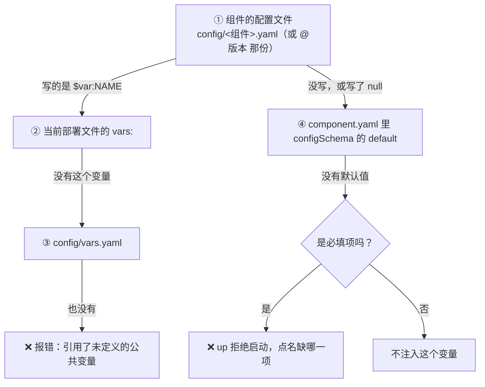

# 配置解析优先级

一个组件的一个配置项，最终拿到哪个值？规则只有一条链，从上往下，第一个"给了值"的算数：



## 逐级说明

**① 组件的配置文件。** 默认版本用 `config/<组件>.yaml`，因依赖而保留的版本用 `config/<组件>@<版本>.yaml`
（见 [config/ 目录](05-config-directory.md)）。你写下的值就是组件拿到的值。

**② ③ 如果写的是 `$var:NAME`**，去找这个公共变量：先看**当前部署文件**的 `vars:`，再看 `config/vars.yaml`。
都没有就报错。部署文件的 `vars:` **只影响 `$var:` 的查找**：它不会覆盖你在组件配置里直接写下的值。

**④ 没写（或写了 `null` / `~`）**，用组件 `configSchema` 里声明的默认值，按作者写下的原文注入：`default: 1.10`
拿到的是 `1.10`，不是 `1.1`。

**都没有**：可选项就不注入——组件读到的是"没有这个环境变量"，而不是一个空字符串，走它自己的"未配置"分支；
必填项则让 `up` 停下来，点名缺哪几项。

## "当前部署文件"是哪一份

| 情况 | 读哪份 |
| --- | --- |
| 命令带了 `-f deploy.prod.yaml` | 就是它 |
| 本地模式开着（且没加 `--no-local`） | `deploy.local.yaml` |
| 其它 | `deploy.yaml` |

所以同一份 `config/`，配上不同的部署文件，`$var:` 引到的值可以不同——这正是多环境的做法。

## 例子

组件 `demo/hello` 的 `configSchema` 里 `GREETING` 默认是 `Hello`。

| 你写的 | 组件拿到的 |
| --- | --- |
| 什么都不写（骨架里那行保持注释） | `GREETING=Hello`（④ 默认值） |
| `GREETING: 你好` | `GREETING=你好`（①） |
| `GREETING: $var:GREETING_TEXT`，`config/vars.yaml` 里 `GREETING_TEXT: 你好` | `GREETING=你好`（③） |
| 同上，而当前部署文件写了 `vars: {GREETING_TEXT: Bonjour}` | `GREETING=Bonjour`（②） |
| `GREETING: ""` | `GREETING=`（可选项上的空串是一个明确的值，照样注入） |

最后一行值得多说一句：在**可选**项上写空串，意思是"我就要空串"；在**必填**项上留空串（骨架留下的那个 `""`），
意思是"还没填"，算缺失。

## 同一级里重复写了同一个键

同一个文件里一个键出现两次，不是"后面的覆盖前面的"，而是**大声失败**：

```text
❌ 错误：检测到未解决的配置冲突
   文件：config/demo-hello.yaml
   配置项：GREETING
   第 1 行：hi
   第 2 行：hello
   建议：
   1. 保留你要的那一行、删掉另一行，然后重新执行命令
   2. 不要对这个文件用 yq 或编辑器的"格式化文档"：它们会悄悄丢掉其中一个重复键，冲突没解决就消失了
   💡 编辑器可能把这个文件标成非法 YAML——这是正常的：BrickKit 故意写了重复键，让冲突不可能被忽略
```

`upgrade` 在迁移配置时遇到"你改过、组件作者也改了默认值"的键，正是故意写出这样两行，逼你做决定，
见 [升级与配置迁移](../02-project-guide/07-upgrade-and-migration.md)。

## 不参与这条链的东西

- **进程环境变量**：只在你显式写了 `${VAR}` 的地方参与，不会悄悄覆盖任何值（见 [敏感值](07-sensitive-values.md)）。
  `mode: local` 的进程确实从你终端的环境出发（它要用你的 `PATH` 和工具链），但平台负责的名字——`COMPONENT_ID`、
  `PORT`、各个 `*_ENDPOINT` 地址、组件自己 `configSchema` 里的键等——会先从中去掉，所以它们只会来自平台，见
  [`mode: local` 进程继承什么](../06-architecture/03-env-injection-contract.md#mode-local-进程继承什么)。
- **平台自己注入的变量**：`COMPONENT_ID`、`COMPONENT_VERSION`、依赖的 `*_ENDPOINT` 等由平台决定；配置项和它们重名时，
  平台的值胜出并给出警告。完整的变量字典见 [环境变量注入契约](../06-architecture/03-env-injection-contract.md)。
- **`configSchema` 里没有的键**：不注入，并警告"不会生效"。
