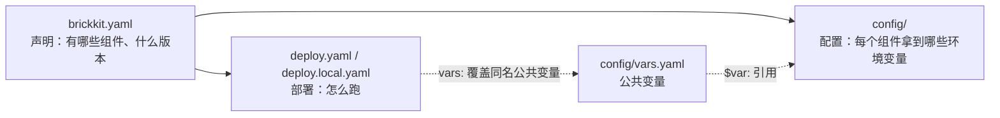

# 三层架构详解

一个 BrickKit 项目由三层文件描述。这一块讲清楚每一层管什么、能写什么、值按什么顺序取。

| 篇 | 读完你会得到什么 |
| --- | --- |
| [01 总览](01-overview.md) | 目录结构、每类信息归哪个文件、什么进 Git |
| [02 brickkit.yaml](02-brickkit-yaml.md) | 组件声明、精确版本、安装源、`add` 怎么定版本 |
| [03 deploy.yaml](03-deploy-yaml.md) | 部署目标、`mode`、端口暴露、外壳成员、K8s 设置、`vars:` |
| [04 deploy.local.yaml](04-deploy-local-yaml.md) | 个人的部署文件：完整替换、严格一致、`brickkit local` |
| [05 config/ 目录](05-config-directory.md) | 配置文件的命名、骨架、归档 |
| [06 公共变量与 $var:](06-vars-and-var-ref.md) | 多个组件共用一个值的唯一方式 |
| [07 敏感值](07-sensitive-values.md) | `${VAR}`、`file://`、`existingSecret`，以及它们在 Docker / K8s 上各落在哪 |
| [08 解析优先级](08-resolution-priority.md) | 一个配置项最终取哪个值 |
| [09 字段速查](09-field-reference.md) | 三个文件的字段一览与常见错误写法 |

**阅读顺序：** 01 必读；然后按你手上的文件挑 02、03、05；要本地调试读 04；碰到密钥读 07。
每个字段的完整规格（类型、校验规则）在 [参考手册](../11-reference/README.md)。
