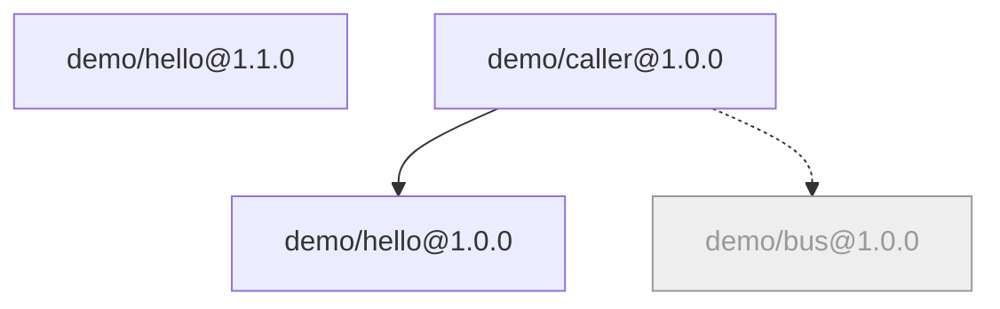

# 状态与依赖拓扑

三条只读的命令，分别回答三个问题：现在跑着什么（`status`）、谁依赖谁（`deps`）、整张图长什么样（`graph`）。

## `brickkit status`

CLI 自己不存运行状态——没有后台进程替它记着。`status` 每次都直接问引擎（`docker compose ps`，或 `kubectl get deployments`）：

```text
📊 项目状态：my-shop（target: docker）

✅ 运行中（3 个组件）
 ┌─────────────┬───────┬───────────────────┬───────────────────────────────────────────────┐
 │ 组件        │ 版本  │ 状态              │ 端口                                          │
 ├─────────────┼───────┼───────────────────┼───────────────────────────────────────────────┤
 │ demo/hello  │ 1.0.0 │ 运行中（healthy） │ 8080/tcp                                      │
 │ demo/caller │ 1.0.0 │ 运行中（healthy） │ 0.0.0.0:18080->8080/tcp, [::]:18080->8080/tcp │
 │ demo/hello  │ 1.1.0 │ 运行中（healthy） │ 8080/tcp                                      │
 └─────────────┴───────┴───────────────────┴───────────────────────────────────────────────┘

⬜ 未启动（1 个组件）
 ┌──────────┬───────┬───────────────────────────┐
 │ 组件     │ 版本  │ 原因                      │
 ├──────────┼───────┼───────────────────────────┤
 │ demo/bus │ 1.0.0 │ 显式禁用（mode: disable） │
 └──────────┴───────┴───────────────────────────┘
```

- 同一个组件的两个版本各占一行（这里的 `demo/hello` 1.0.0 与 1.1.0）。
- 这次不启动的组件也列出来，带着原因；原因来自 `deploy.local.yaml` 时会标出来。
- 端口一栏里 `0.0.0.0:18080->8080` 表示对宿主机开放了；只有 `8080/tcp` 的只在容器网络里可达。
- `mode: debug` 的组件单独一张表（见 [本地调试](03-local-debug-workflow.md)）。`mode: local` 的组件是另一个终端里 `up` 看护的进程，
  不在表里；有这样的会话在跑时，会提示是哪个进程。

`down` 之后，本该运行的组件都列在"未在运行"里，并提示去哪看日志（被关掉的 `demo/bus` 仍在"未启动"那张表里）：

```text
❌ 未在运行（3 个组件）
 ┌─────────────┬───────┬────────┐
 │ 组件        │ 版本  │ 状态   │
 ├─────────────┼───────┼────────┤
 │ demo/hello  │ 1.0.0 │ 未创建 │
 │ demo/caller │ 1.0.0 │ 未创建 │
 │ demo/hello  │ 1.1.0 │ 未创建 │
 └─────────────┴───────┴────────┘
   看日志定位：docker compose -p brickkit-my-shop logs <服务名>

📋 没有正在运行的组件（可能已经 brickkit down 过）
   重新启动：brickkit up
```

## `brickkit deps`

`brickkit.yaml` 只锁版本，不写谁依赖谁——依赖关系是每个组件自己在 `component.yaml` 里声明的，项目文件里再抄一遍只会不同步。
`deps` 把它们读出来，打印成树：

```bash
brickkit deps
```

```text
demo/hello@1.1.0

demo/caller@1.0.0
├── demo/hello@1.0.0
└── demo/bus@1.0.0（弱依赖）
```

每个顶层组件（项目里没有谁依赖它）一棵树。一个组件版本在一次输出里只展开一次，再出现时标"（见上）"；项目里没有的弱依赖标
"（弱依赖，未安装）"。

看一个组件：它的每个版本各一棵树，外加谁依赖它：

```bash
brickkit deps demo/hello
```

```text
demo/hello@1.0.0

被依赖：demo/caller@1.0.0

demo/hello@1.1.0

被依赖：无（顶层组件）
```

`brickkit deps demo/hello@1.0.0` 只看那一个版本。

## `brickkit graph`

同一张依赖图，画成 Mermaid：

```bash
brickkit graph
```

```text
graph TD
    demo_hello_1_1_0["demo/hello@1.1.0"]
    demo_bus_1_0_0["demo/bus@1.0.0"]
    demo_hello_1_0_0["demo/hello@1.0.0"]
    demo_caller_1_0_0["demo/caller@1.0.0"]
    demo_caller_1_0_0 --> demo_hello_1_0_0
    demo_caller_1_0_0 -.-> demo_bus_1_0_0
    classDef disabled fill:#eee,stroke:#999,color:#999;
    class demo_bus_1_0_0 disabled
```

渲染出来是这样：



| 图上 | 意思 |
| --- | --- |
| 实线 | 强依赖 |
| 虚线 | 弱依赖；项目里没有的弱依赖画成"未安装"节点 |
| 带 `$endpoint` 标签的虚线 | 配置用 `$endpoint:` 引用了它的地址（项目填的，不是组件声明的依赖；不进启动顺序） |
| 置灰 | 这次不会启动（这里 `demo/bus` 被 `mode: disable` 关掉了） |
| 分组框 | 被外壳承载的成员画在外壳的框里；`--ignore-shells` 看每个组件独立时的样子 |
| 特殊标注 | `mode: local` 的组件标"托管本地" |

边总是画出来，不管对方这次跑不跑：图展示的是声明的结构，"跑不跑"用节点样式表达。

**存成文件。** stdout 里只有 Mermaid，所以：

```bash
brickkit graph > graph.mmd
```

GitHub 会直接渲染 `.mmd` 文件；放进 Markdown 时围在 `mermaid` 代码块里。依赖解析的警告写到 stderr，不会混进文件。

**它从不读本地模式。** `graph` 读 `deploy.yaml`（或 `-f` 指定的文件），不读 `deploy.local.yaml`——生成的图可以提交、分享，
不会因为是谁生成的而不同。

`deps` 和 `graph` 都要完整的依赖图：还没缓存的组件会从安装源取 `component.yaml`，所以可能联网。
