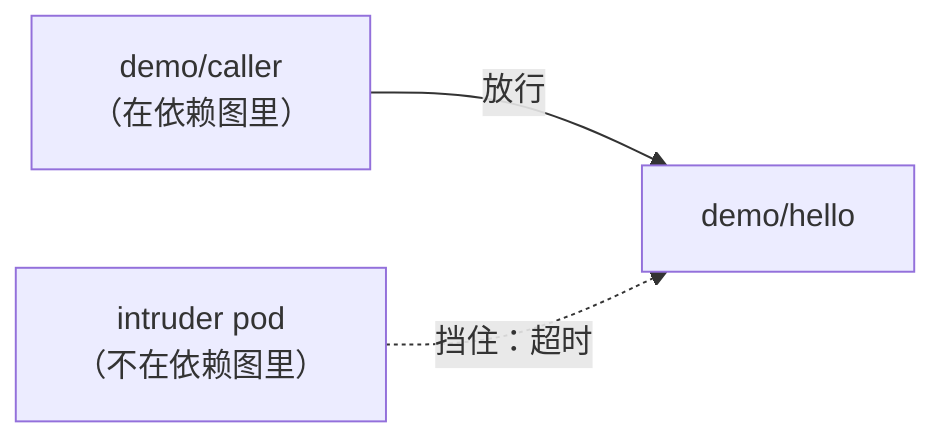

# 12. 网络策略与最小权限

`deploy.networkPolicy.enabled: true` 会打开 Kubernetes `NetworkPolicy` 生成，直接从依赖图算出来（AGENTS.zh.md §7）——不需要另外手工维护一份访问控制列表。这一篇给 `demo/hello` + `demo/caller` 打开它，并且真正证明它挡住了什么，不只是生成了一份看起来说得通的 YAML。

**前置条件，而且这一点比听起来更重要：** 一个真正会执行 `NetworkPolicy` 的集群 CNI。很多集群接受这些对象却完全不执行——`kubectl apply` 会成功，`kubectl get networkpolicy` 也看得见，但每一次连接照样毫无阻碍地通过，而且不会有任何报错。`brickkit up` 自己就会警告这件事：

```
🔒 已生成 2 份 NetworkPolicy（deploy.networkPolicy.enabled: true）
   ⚠️ 它们只在集群的 CNI 支持执行时才有效。不支持时：apply 会成功、
      kubectl get networkpolicy 看得见、而流量完全不受限制——没有任何报错。
      minikube / kind 的**默认** CNI 就属于这一类。
   平台测不出来（K8s 没有这个 API），只能你自己验一次
```

minikube 自己的默认 CNI 被直接点名是这类"不执行"的一员——这篇用的 minikube 是专门用 `minikube start --cni=calico` 启动的，好让下面的验证是真实的，不是演戏。

## 打开它

```yaml
deploy:
  target: k8s
  networkPolicy:
    enabled: true
```

除此之外什么都不用写——不需要手写一条点名 `demo/caller` 的 `allowFrom`。给 `demo/hello` 生成出来的策略：

```yaml
apiVersion: networking.k8s.io/v1
kind: NetworkPolicy
spec:
  ingress:
    - from:
        - podSelector:
            matchLabels:
              app: demo-caller-1-0-0
      ports:
        - port: 8080
          protocol: TCP
  podSelector:
    matchLabels:
      app: demo-hello-1-0-0
  policyTypes:
    - Ingress
```

`demo/caller` 是这个项目里 `demo/hello` 唯一的调用方，所以生成出来的 ingress 规则里 pod selector 也只有它这一个，端口正是 `demo/hello` 自己真正监听的那个——平台早就从[依赖解析与启动顺序](../06-architecture/02-dependency-resolution.md)深入讲过的那同一张依赖图里知道这件事了。`allowFrom`（AGENTS.zh.md §7）是给这个机制覆盖不到的情况准备的：这个项目自己依赖图之外的东西——一个 Ingress 控制器、另一个团队的命名空间——它们没有以任何声明依赖的形式出现，却真的需要访问权限。

## 证明授权路径照常能用

```bash
kubectl -n brickkit-hello-world exec deploy/demo-caller-1-0-0 -- \
  wget -qO- --timeout=3 http://demo-hello-1-0-0:8080/api/v1/hello
```
```json
{"component":"demo/hello","greeting":"Hello","message":"Hello, I'm demo/hello@1.0.0","version":"1.0.0"}
```

立刻响应，完全不受影响——刚生成的这份策略，宽松程度正好够这个项目里唯一真实存在的调用方使用。

## 证明未授权路径真的被挡住了



一个普通的 pod，在同一个命名空间里，不匹配 `demo/hello` 策略允许的任何东西：

```bash
kubectl -n brickkit-hello-world run intruder --image=busybox:1.36 --restart=Never --command -- sleep 3600
kubectl -n brickkit-hello-world exec intruder -- \
  wget -qO- --timeout=5 http://demo-hello-1-0-0:8080/api/v1/hello
```
```
wget: download timed out
command terminated with exit code 1
```

不是连接被拒绝，也不是 HTTP 错误——是超时。这个包根本没得到任何响应；Calico 在它到达 `demo/hello` 的容器之前就把它丢掉了。跟它同一个命名空间、同一个集群，甚至还能解析同一个 DNS 名字（`demo-hello-1-0-0` 照样能解析出来——`NetworkPolicy` 限制的是流量，不是域名解析），这些对这个 pod 一点用都没有。策略真正认的是"在不在依赖图里"。

---

下一篇：[多项目共享](13-multi-project-sharing.md)，这个系列的最后一篇——故意跨项目共享组件，真跑一遍第 7 篇用过的 `brickkit fetch`，这次是在两个真正独立的项目之间。
