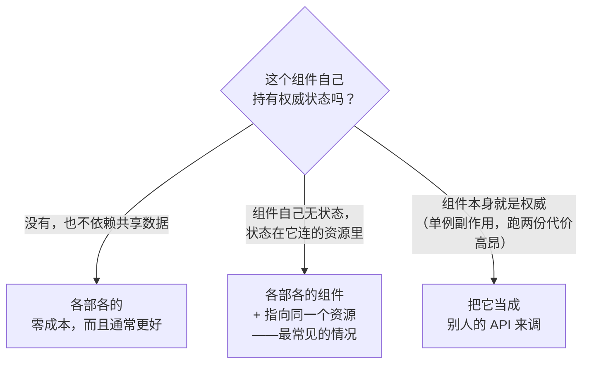

# 14. 多项目共享

两个团队，两个完全独立的 BrickKit 项目，一个真实的问题：它们到底需不需要共享什么？这一篇把唯一真正要紧的问题——状态在哪——走一遍，以及从它推出来的三种形态，全部对着两个真正独立的项目和一个共享的 Redis 验证过，不是一个项目假装成两个。

## 唯一真正要紧的问题



中间那一档最容易被跳过。组件自治原则（AGENTS.zh.md §4）本来就把每个组件往无状态推——配置来自环境变量，状态放在绑定的资源里——所以"这个组件真的持有权威状态"的情况比听起来要少得多。`infra/redis-event-bus` 看上去理所当然该是个必须共享的中枢；它自己一点状态都不存。一切都在 Redis Streams 里。两个项目各跑一份、指向同一个 Redis，**就是**一条共享的事件流。

## 共享资源，各自独立的组件

先起一个两个项目都能连到的 Redis，再建两个真正独立的项目——不同的目录、不同的 `brickkit.yaml`，从来不互相引用：

```bash
docker run -d --name shared-redis -p 16399:6379 redis:7-alpine
```

```yaml
# team-a/brickkit.yaml 和 team-b/brickkit.yaml —— 形状一样，只有 exposePort 不同
components:
  - id: infra/redis-event-bus
    version: 1.0.0
    expose: true
    exposePort: 18201   # team-b 是 18202

resources:
  - kind: cache
    engine: redis
    id: redis
    host: host.docker.internal   # 宿主机——共享的 Redis 真正在这儿
    port: 16399
    bindings:
      - componentId: infra/redis-event-bus
```

```bash
cd team-a && brickkit up   # ✅ 全部组件已启动（1 个）
cd team-b && brickkit up   # ✅ 全部组件已启动（1 个）
```

`host.docker.internal` 在这里干的是真事：每个项目都是自己独立的 Compose 项目，各有各的网络，设计上就互相到不了——写对方的容器名根本解析不出任何东西。共享的 Redis 活在两个项目本来就都能看到的那个地方——宿主机。换到 Kubernetes 上，同样的关系只需要换一个 `host`——Service DNS 名默认就能跨命名空间访问，不用额外配置。

```bash
curl -X POST http://localhost:18201/api/v1/events \
  -H 'Content-Type: application/json' \
  -d '{"type":"order.approved","actor":"alice","subject":"ORD-42"}'

curl "http://localhost:18202/api/v1/events?count=5"
```
```json
{"events":[{"type":"order.approved","actor":"alice","subject":"ORD-42","time":"...","id":"1789402628553-0"}],"total":1}
```

在 `team-a` 的实例上发布的一条事件，出现在了 `team-b` 的实例上——两个从没听说过彼此的组件，共享了一条事件流，完全靠的是它们恰好指向了同一个资源。这里没有任何针对具体项目的特殊处理。

## 一个配置字段就能把共享变成隔离

`streamName` 正是决定这两个项目是不是在看同一条流的那个字段：

```yaml
# team-b/brickkit.yaml
components:
  - id: infra/redis-event-bus
    version: 1.0.0
    expose: true
    exposePort: 18202
    config:
      streamName: "team-b:events"
```

```bash
brickkit up
curl "http://localhost:18202/api/v1/events?count=5"
```
```json
{"events":[],"total":0}
```

`team-b` 再也看不到 `team-a` 发布的那条事件——而 `team-a` 自己的视图完全不受影响，那条事件照样在。同一个 Redis、同一个组件、同一套底层基础设施——共享还是隔离在这里从来不是一次性锁定的架构决定，它是一行随时可以改的配置。

## 把一个组件当成别人的 API 来对待

当一个组件真的就是权威的时候——单例副作用（一个定时任务、一个通知发送器：跑两份就是发两遍）、跑两份代价高昂、或者归属完全不同的团队自己运维——这段关系该长得跟调用任何第三方 API 完全一样：你只需要知道它的地址，它什么时候启动、升级、扩容都不是你的事，它挂了你自己的组件按自己代码里的降级逻辑处理。

组件声明它需要一个自己猜不出来的地址：

```yaml
# component.yaml
configSchema:
  type: object
  required:
    - notifierBaseUrl
  properties:
    notifierBaseUrl:
      type: string
      description: 共用通知服务的地址，由部署它的那个项目提供
```

`required` 加没有 `default`，意味着平台没法替你编一个值——部署这个组件的项目必须自己提供。不填直接跑一次试试：

```bash
brickkit up --dry-run
```
```
❌ 错误：必填的组件配置没有值
   缺少配置：demo/hello@1.0.0 → notifierBaseUrl（注入为 NOTIFIER_BASE_URL）
   原因：组件在 configSchema.required 里声明了它，又没有给默认值——
   这一项平台推导不出来，只能由项目提供
```

这是整套写法真正的地基：没有这一拦，忘了填地址不会让任何东西崩溃——环境变量根本不会出现，组件悄悄走进它自己"未配置"那条分支，没有任何东西告诉你这次调用其实一直在悄悄地打空。填上之后，这个值就跟任何别的配置项一样正常流转：

```yaml
components:
  - id: demo/hello
    version: 1.0.0
    config:
      notifierBaseUrl: http://host.docker.internal:18080
```
```bash
brickkit up
docker exec brickkit-shop-project-demo-hello-1-0-0-1 env | grep NOTIFIER
```
```
NOTIFIER_BASE_URL=http://host.docker.internal:18080
```

有一条命名规则在这里很重要：别把这个字段起名成以 `Endpoint` 结尾的东西——`*_ENDPOINT` 是平台自己保留给它注入的依赖地址用的后缀，跟它撞车的配置键会被悄悄覆盖并给出警告（AGENTS.zh.md §5.2）。用 `notifierBaseUrl`/`xxxAddr` 就完全避开了这个碰撞。

## 为什么平台没有一个自动做这件事的功能

这个平台早先真有过一个：一个 `external: {project: X}` 字段，写上它平台就替你推导出跨项目地址——钻进对方的 Docker 网络，或者把对方的 Kubernetes 命名空间拼进地址里。它被删掉了，因为它悄悄编码了错误的关系——不是"调别人的 API"，而是"共享别人的内部网络"。这意味着调用方项目得能从自己的安装源里解析出对方的 Manifest，得等对方真的先跑起来自己才能启动，而且——一声不响、哪里都不报错——只要任何一边打开 `mode: debug` 或者 `networkPolicy.egress`，它就直接坏掉。去掉它付出的代价只有一件事：对方组件的产物（`.proto`、`openapi.json`）不再自动下载，需要手动要一次——第 8 篇的 [`brickkit fetch`](08-consuming-artifacts.md) 正是干这件事的工具，这段关系的哪一边都能用它。

---

下一篇：[用 Podman 代替 Docker 部署](15-podman.md)——同一份声明，这次换成真实的 Podman 引擎重新部署一遍，包括那个让这篇文章得以存在的真实坑。
