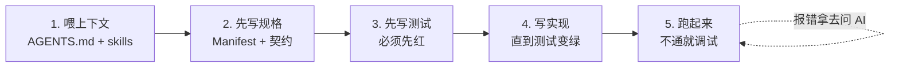

# AI 辅助开发指南

BrickKit 的组件模型天然适合 AI 辅助开发。这篇讲清楚为什么，以及具体怎么用。

还不熟悉组件契约本身？[从零开发第一个组件](03-guide/11-build-your-own.md) 走一遍
AI 生成的组件同样要遵守的那几条基础规则（Manifest、环境变量、健康检查）——
建议先读一遍再把活交给 AI，这样才判断得出它写的东西到底对不对。

## 为什么 BrickKit 适合 AI 写代码

### 1. 组件粒度匹配 AI 的上下文窗口

实测项目自带的 10 个真实组件（`tests/components/`），代码行数在 200 到 3500 行之间。这种规模，加上 `component.yaml` 划出的明确契约边界，意味着 AI 可以一次性完整读取并理解一个组件，不需要在一个动辄几十万行的单体代码库里连蒙带猜。

### 2. 契约先行，AI 有明确的"边界"

每个组件的 `component.yaml` 声明了：

- 它依赖哪些组件（精确版本，强依赖/弱依赖）
- 它提供哪些端口（HTTP/gRPC）
- 它需要哪些配置（`configSchema`）
- 它需要哪些资源（数据库、Redis 等）

AI 不需要理解整个系统——只要读当前组件的 `component.yaml`，加上它依赖的组件对外发布的 API 契约（`artifacts` 里的 `api-contract`，通常是 `openapi.json`），就能写出一个完整、可独立运行的组件。

### 3. 环境变量注入，AI 不用处理配置复杂性

AI 生成的组件代码只需要这样读配置：

```python
import os

# 强依赖
dep_endpoint = os.environ.get("DEP_ENDPOINT")

# 弱依赖：必须用安全的读取方式
optional_endpoint = os.environ.get("OPTIONAL_ENDPOINT")
if not optional_endpoint:
    # 降级逻辑——弱依赖缺失时这个变量根本不会被注入，
    # 用 os.environ["OPTIONAL_ENDPOINT"] 会直接 KeyError 崩溃
    pass

# 自身配置
page_size = int(os.environ.get("PAGE_SIZE", "20"))
```

AI 完全不用理解服务发现、配置中心、注册 SDK 这些概念——这些平台已经用环境变量注入解决了。

### 4. 精确版本 + 多版本共存，AI 的"破坏性修改"变得安全

AI 生成的 v2 可以直接和 v1 并存：

- `my-component-1-0-0` 和 `my-component-2-0-0` 是两个独立的容器/服务名
- 依赖 v1 的其他组件不受影响
- 可以慢慢把调用方迁移过去，不需要一次性切换

## 怎么用 AI 辅助开发组件

五步一个循环，每一步都有真实反馈，不是让 AI 一口气把组件全写完：



### 步骤 1：让 AI 理解你的项目

`brickkit init` 会自动在项目里生成 `.claude/skills/` 目录，装好几个 AI 助手技能文件。把项目根目录的 `AGENTS.md` 也喂给 AI——它压缩了整个平台的定位、术语、设计原则，AI 读完就有了判断力，不用你每次都重新解释一遍"BrickKit 是什么"。如果你是在独立的组件仓库里（有 `component.yaml`、没有 `brickkit.yaml`）开发，在那个目录里执行 `brickkit skills update`，会把 `brickkit-component` 这个技能装进 `.claude/skills/`——组件作者最需要的那一份。

### 步骤 2：让 AI 先写规格——Manifest 和 API 契约，不写实现

`brickkit new my-scope/user-profile` 会生成一份 AI 动手之前就已经能通过
校验的 `component.yaml`——想让它填一份保证合法的骨架，而不是从空白页
开始写整份文件，这条命令更省心。两条路最终写出来的是同一份文件，从哪
一头起步只是习惯问题。

Prompt 示例：

```
我要开发一个 BrickKit 组件：
- ID: my-scope/user-profile
- 版本: 1.0.0
- 语言: Python (FastAPI)
- 依赖: people/basic@1.0.0（强依赖）、infra/redis@1.0.0（弱依赖）
- 配置: page_size (integer, 默认 20)
- 端口: 8080 (HTTP)
- 健康检查: /healthz
- 对外接口: 按用户 ID 查询、更新用户资料（这里写你自己的接口描述）

先只生成两份规格，不要写任何实现代码：
1. component.yaml
2. openapi.json（OpenAPI 3.0，覆盖每个端点的请求/响应 schema）
```

契约是从需求写出来的，不是从代码里反推的——依赖这个组件的其他组件（不管是 AI 写的还是人写的）从这一刻起就可以对着它开发，既不用等 `user-profile` 的实现，也不用读它的源码。写完之后把它加进项目（`brickkit add --local`）跑一次 `brickkit up --dry-run`：配置键写错、必填配置缺值这类问题在这一步就会暴露，不需要起任何容器（真实输出见[分层测试](07-patterns/01-testing.md#让-ai-写组件先立规格再写实现)）。

### 步骤 3：让 AI 先写测试，并确认它们是红的

```
根据 openapi.json 和上面的需求，生成：
1. 契约测试（验证每个端点的请求/响应符合 openapi.json）
2. 业务规则测试（先把每条规则写成一句"给定……当……则……"，再翻成测试）
3. 集成测试（至少覆盖 /healthz）

先不要写实现——我要先看到这些测试因为"接口还没实现"而失败。
```

一个第一次运行就通过的测试什么都没测到。这一步放在实现之前，是因为从实现里反推出来的契约和测试只会复述实现：契约是照着代码生成的，"验证实现和契约对得上"就成了自己跟自己对账。

### 步骤 4：让 AI 写实现，直到测试变绿

```
根据 component.yaml、openapi.json 和上面这些测试，生成：
1. main.py
2. Dockerfile
3. migrations/001_init.sql

然后运行测试，直到全部通过。
```

### 步骤 5：让 AI 帮你调试

```
我的 user-profile 组件启动后报错：
KeyError: 'PEOPLE_BASIC_ENDPOINT'

请帮我分析可能的原因。
```

（这条错误的真正原因大概率是弱依赖没起来、或者组件代码用了 `os.environ[]` 而不是 `os.environ.get()`——见 [故障排除](08-troubleshooting.md)。）

## 最佳实践

### 一次只让 AI 写一个组件

不要让 AI 同时写多个互相依赖的组件——每写完一个、跑通了，再写下一个。这样每一步都有真实反馈，而不是堆出一堆互相印证不了的代码。

### 让 AI 读 API 契约，而不是读依赖方的源码

当你让 AI 写一个依赖 `people/basic` 的组件时，让它读 `people/basic` 的 `openapi.json`，不要让它去翻 `people/basic` 的实现代码。这样 AI 生成的代码只依赖契约本身，符合组件自治原则——`people/basic` 内部怎么重构都不会波及它。

### 让测试先于实现

测试是验证 AI 生成的代码是否真的对的最直接方式，而且**顺序**比"写没写"更重要：先写测试、看着它们变红，再让 AI 写实现，测试才真的约束了实现；反过来从实现里反推测试，测的只是"代码做了它做的事"。完整的顺序和理由见[分层测试](07-patterns/01-testing.md#让-ai-写组件先立规格再写实现)。

## 局限性

### AI 替代不了的

- **领域模型设计：** 一个功能到底该拆成几个组件、边界画在哪，这需要你（和领域专家）判断，AI 没有这个业务上下文
- **数据一致性决策：** 哪些操作需要事务、哪些可以最终一致，这是业务判断，不是代码风格问题
- **性能调优：** AI 生成的代码通常"正确但不是最优"，真实负载下的调优需要你自己来

### AI 容易踩的坑

- **过度设计：** 给一个简单功能堆出很多层抽象，需要你主动要求简化
- **错误处理只覆盖 happy path：** 弱依赖缺失、迁移失败这类边界情况容易被漏掉
- **测试覆盖不全：** AI 生成的测试经常只测正常场景，边界场景需要你自己补

## 深入阅读

- [组件设计准则](07-patterns/00-component-design.md) — 动手写组件之前先做的领域研究
- [分层测试](07-patterns/01-testing.md) — AI 生成测试时该覆盖哪几层
- [认识这些想法](06-architecture/01-design-principles.md#认识这些想法) — 每个工程想法对应用 AI 写代码时的什么痛点、BrickKit 怎么做、AI 又该怎么应对
- [AGENTS.md](../../AGENTS.md) — 喂给 AI 的全平台压缩件
