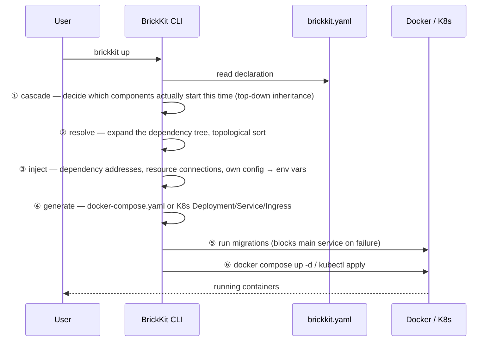

# 架构总览

BrickKit 是一个**声明式的组件管理与拼装平台**：像搭积木一样构建系统，每块积木（组件）独立开发、独立部署、独立调用。你声明有哪些组件、它们依赖什么，CLI 负责派生其余一切——顺序、地址、图纸（部署文件）——再交给 Docker 或 K8s 装好（背后的想法见[设计原则与取舍](01-design-principles.md)）。它**不是**操作系统，不是 ERP，也不是任何一个具体的业务软件——它是让你渐进式长出架构的工具。

## 四个部分

| 部分 | 形态 | 是否常驻 | 职责 |
| --- | --- | --- | --- |
| **BrickKit CLI** | 本地单二进制 | ❌ 用完即走 | 拉取、解析、生成、调用、发布、源码工作区管理 |
| **BrickKit Market** | 独立 SaaS（可私有化） | ✅ | 组件发布与发现、版本/可见性/签名、产物存储 |
| **组件层** | Docker 容器 / K8s Pod | ✅ | 业务本体，组件间 DNS 直连 |
| **基础设施层** | PostgreSQL / Redis 等 | ✅ | **运维手动部署**，在 `brickkit.yaml` 中声明绑定 |

四个部分里只有 CLI 不常驻——它执行完一条命令就退出，期望状态留在 `brickkit.yaml` 里，实际状态留在 Docker / K8s 里，CLI 自己不持有任何状态。

## 执行 `brickkit up` 时发生了什么



用一个仓库里真实存在的例子把这六步具体化。`erp/backend` 实际有三个强依赖（`people/basic`、`auth/password-login`、`authorization/rbac`）外加一个弱依赖，执行 `brickkit add erp/backend@1.0.0` 会把它们全部递归拉下来；为了让示例聚焦，这里只顺着其中一条依赖链往下看：[`tests/components/people-basic/`](../../../tests/components/people-basic/) 是直接依赖，[`tests/components/department-tree/`](../../../tests/components/department-tree/) 是 `people/basic` 自己的强依赖，随之一并被拉入项目（这也是——在其它依赖之外——[`tests/components/erp-backend/`](../../../tests/components/erp-backend/)、`department-tree`、`people-basic` 会一起出现在同一个 `brickkit.yaml` 里的原因）。接下来跑 `brickkit up`：

- **① cascade** 判定这三个组件都没写 `enabled`，且都处于依赖链顶端或被顶端组件需要，三个都启动；
- **② resolve** 展开依赖树、拓扑排序，得出启动顺序必须是 `department-tree` → `people-basic` → `erp-backend`（被依赖的先起）；
- **③ inject** 给 `people/basic` 写入 `DEPARTMENT_TREE_ENDPOINT=http://department-tree-1-0-0:8080`，给 `erp/backend` 写入指向 `people-basic` 的地址；
- **④ generate** 把这几个组件各自的 `component.yaml` 翻译成 `docker-compose.yaml` 里各自的 service——这只是 `erp/backend` 完整依赖树对应的那批 service 里的一部分（这一步到底翻译出了什么、两个部署目标逐字节对照，见[部署文件是怎么生成出来的](03-deployment-generation.md)）；
- **⑤ run migrations** 先跑 `department-tree` 和 `people-basic` 各自声明的迁移命令（`erp/backend` 没有 `migration` 字段，跳过）——`auth/password-login` 与 `authorization/rbac` 也各自声明了迁移，同样会被执行；
- **⑥** 最后 `docker compose up -d` 把这几个容器拉起来（`erp/backend` 剩下的依赖也一并起来）。

**为什么三个都启动这件事值得展开讲——背后这条规则其实有三种状态,不是一种。** 一个组件完全不写 `enabled`,意味着它"跟着上层走"：没人依赖的顶层组件默认启动,更下层的组件只要它上面有任何一个正在跑的组件需要它,就跟着启动——这正是 `department-tree` 在这里会启动的原因,哪怕这份 `brickkit.yaml` 里没有任何一行字直接提到它:只是因为 `people-basic` 需要它,而 `people-basic` 本身又被顶层的 `erp-backend` 需要。另外两种状态是显式的,会整个盖过这条"跟着走"的默认规则：`enabled: true` 把一个组件钉死成"始终启动",不管它上面发生了什么(如果它自己需要的某个强依赖被关掉了,会直接报错——两个互相矛盾的意图不可能同时成立);`enabled: false` 把它钉死成"永不启动",连带把所有依赖它的组件也一起停掉。如果这份 `brickkit.yaml` 把 `department-tree` 显式写成 `enabled: false`,而不是什么都不写,那么依赖它的 `people-basic` 在解析阶段就会直接失败——CLI 会点名报错,不会生成一份看似正常、实际会在容器启动那一刻才失败的部署清单。真实的 CLI 输出里,每一行启动决定都会带上这三种理由中的哪一种(`starting (top-level)` / `starting (enabled: true)` / `starting (X needs it)`)，因为"这行到底是哪种情况"从来不该是读者要自己从配置反推出来的东西。

其中的服务名包括 `erp-backend-1-0-0`、`department-tree-1-0-0`、`people-basic-1-0-0`——下一节说明这个名字是怎么算出来的。想看①②两个阶段更难的版本——一个真实的菱形依赖、一个真实的循环依赖、关掉一个组件会发生什么——见[依赖解析与启动顺序](02-dependency-resolution.md)。

## 项目目录里都有什么

`brickkit init` 在**当前目录**里生成下面这些东西。真正属于"期望状态"的只有 `brickkit.yaml` 一个文件；`.brickkit/` 是 CLI 自己的工作目录，里面每一项要么是可以重新拿回来的缓存，要么是每次 `up` 重新生成的产物，要么是登录凭据。

```
my-shop/                          ← 项目根目录
├── brickkit.yaml                 ← 项目配置：唯一的"期望状态"
├── components/                   ← 组件源码工作区（默认不提交：每个组件是独立的 Git 仓库）
│   └── .archived/                ← brickkit sync 归档的、这次不启动的组件源码
├── .brickkit/                    ← CLI 工作目录
│   ├── manifests/                ← Manifest 缓存：<组件ID>-<版本>.yaml，如 people-basic-1.0.0.yaml
│   ├── artifacts/                ← 组件附带的契约、文档等产物：<版本化服务名>/<type>/…
│   ├── generated/                ← up 生成的部署文件（勿手改，不提交）
│   ├── credentials               ← brickkit login 存下的 Token（权限 0600，不提交）
│   └── skills.lock               ← 记录 AI 助手技能文件上次是谁写的（提交）
├── .claude/skills/               ← AI 助手技能（init 装入，提交）
├── AGENTS.md                     ← AI 助手项目导读（init 装入，提交）
└── .gitignore                    ← init 追加的忽略规则
```

- **`manifests/` 与 `artifacts/` 是缓存，默认提交、团队共享同一份。** `up` 读的是 `manifests/` 里的 Manifest，不依赖 `components/` 下的源码；缺失或损坏时会从安装源重新拉取。产物由 `add` / `fetch` 下载。`init` 追加的 `.gitignore` 里对应的两行默认是注释掉的，想忽略它们就取消注释。
- **`generated/` 每次 `up` 都会重写，别手改。** 里面是 `docker-compose.yaml`（`deploy.target: k8s` 时是 `k8s/` 目录），以及 `local: true` 组件的 `local-debug.<版本化服务名>.env`。默认被 `.gitignore` 忽略——后一种文件里可能带着解析后的配置值。
- **`credentials` 只有 `brickkit login` 之后才存在**，默认被 `.gitignore` 忽略。
- **`skills.lock` 要提交**：它让别人的 CLI 分得清"你手改过这个技能文件"和"CLI 升级让它过期了"。


## 版本化服务名与统一地址格式

**服务名 = 组件 ID 转换 + 精确版本号。** 转换规则只有三条：`/` → `-`，`.` → `-`，全部小写。`erp/backend` 的 `1.0.0` 版就是 `erp-backend-1-0-0`。

地址格式在 Docker 和 K8s 下**完全一样**：`http://<版本化服务名>:<端口>`。本地是 `http://department-tree-1-0-0:8080`，换到 K8s 集群里还是这一串，组件代码不用感知自己跑在哪种环境。这条规则带来两个直接后果：**多版本天然共存**（`people-basic-1-0-0` 和 `people-basic-2-0-0` 是两个互不冲突的 DNS 名），以及**调用方永远明确知道自己调的是哪个版本**，不存在隐式升级。

真实例子胜过转换公式本身。下面是 [`tests/components/erp-backend/component.yaml`](../../../tests/components/erp-backend/component.yaml) 里 `dependencies.components` 的原文：

```yaml
dependencies:
  components:
    # 强依赖：注入 PEOPLE_BASIC_ENDPOINT（HTTP，8080）
    # 与 PEOPLE_BASIC_GRPC_ENDPOINT（gRPC，来自它声明的 extraPorts，9090）。
    # 本组件用的是后者
    - people/basic@1.0.0
    # 强依赖：注入 AUTH_PASSWORD_LOGIN_ENDPOINT
    - auth/password-login@1.0.0
    # 强依赖：注入 AUTHORIZATION_RBAC_ENDPOINT（gRPC 与 HTTP 共用主端口）
    - authorization/rbac@1.0.0
    # **弱依赖**：没装它时平台完全不注入 INFRA_REDIS_EVENT_BUS_ENDPOINT，
    # 本组件据此降级——审批照常成功，只是不发事件
    - id: infra/redis-event-bus@1.0.0
      optional: true
```

四行依赖对应四个环境变量名，全部**从组件 ID 直接算出来**（`/` 和 `-` 换成 `_`，转大写，加 `_ENDPOINT`），不需要另外声明变量名——这也是为什么 BrickKit 不支持依赖别名：变量名与组件 ID 的这条双向对应关系一旦断开，看到 `IAM_ENDPOINT` 就再也查不出它指向哪个组件了。

### 外部工具直接连组件端口

这条转换规则不只是给平台内部注入 `*_ENDPOINT` 用的。写一段独立跑的脚本或
工具（本地调试脚本、运维工具、一次性排查，不是另一个 BrickKit 组件）时，
如果要绕过某个组件自己的业务 API、直接打它的 gRPC/HTTP 端口，地址算法跟
平台内部用的是同一条：`http://<版本化服务名>:<该组件自己声明的端口>`——不
管这个组件现在是独立部署还是被 `servedBy`（见[造壳指南](../07-patterns/07-shell-implementers-guide.md)）
合并进了某个外壳都一样，因为外壳容器的网络别名用的正是这条规则算出来的
名字。外部工具完全不需要关心"这个组件现在有没有被合并""它有没有自己的
容器"。

前提是这段代码要跑在 BrickKit 管理的那个 Docker 网络内部——比如
`docker run --rm --network <项目网络名> <镜像> ...` 临时加入进去。不能假设
组件把端口发布到了宿主机：`expose: true` 只对独立部署的组件生效，
`servedBy` 成员完全不受它影响，压根不会有一个 `localhost:<端口>` 可以打。

## 平台刻意不做的事，以及为什么

这份清单和平台的能力同样重要：下面每一项都不是"还没做"，而是被认真论证过、然后拒绝的。BrickKit 只做"连接器"和"翻译官"，不越界去做业务逻辑，也不重复底层基础设施已经做好的事。

**怎么读：** 先看下面五张总表（按主题分组）；点第一列的名字，跳到对应编号的详细说明。

### A. 运行时与通信

| 不做什么 | 为什么 | 替代做法 |
| --- | --- | --- |
| [1. 常驻服务与控制面](#1-常驻服务与控制面)<br>一个一直在后台运行、统一管理所有组件的程序 | 用完即走，就没有单点故障、不占资源、不开端口 | CLI 跑完就退出；状态放在 `brickkit.yaml` 和底层引擎里 |
| [2. 注册中心](#2-注册中心)<br>一本记录"哪个服务在哪儿"的地址簿 | Docker 和 Kubernetes 自带的 DNS 已经免费提供了服务发现 | 直接用 DNS：`http://<版本化服务名>:<端口>` |
| [3. API 网关、服务网格与负载均衡](#3-api-网关服务网格与负载均衡)<br>统一的入口、服务间通信的管理层、把请求分给多个实例 | 组件之间走 DNS 直连；网关的路由规则因业务而异 | K8s Service 自带负载均衡；需要网关就用 `labels` 透传 |
| [4. 通信治理](#4-通信治理)<br>熔断、限流、失败重试 | 阈值和退避策略因业务而异，平台给不出一个通用的答案 | 写在组件自己的代码里 |
| [5. 健康检查轮询](#5-健康检查轮询)<br>由平台定期去问每个组件"你还活着吗" | Compose 和 Kubernetes 已经原生解决了 | 组件提供 `/healthz`，探测交给底层引擎 |
| [6. 配置中心与动态热更新](#6-配置中心与动态热更新)<br>集中保存配置、并把改动实时推给运行中的程序 | 那是一整套重机制，而多数基础配置本来就必须重启才能安全生效 | 环境变量注入；改配置后 `brickkit up` 重启 |

### B. 配置与版本

| 不做什么 | 为什么 | 替代做法 |
| --- | --- | --- |
| [7. 版本范围解析](#7-版本范围解析)<br>把依赖写成 `^1.0.0`，由工具挑一个最新的 | 范围是"我机器上能跑、生产上炸"的常见原因 | 只认精确版本，`add` 时解析一次并写死 |
| [8. 多环境 overlay 与继承合并](#8-多环境-overlay-与继承合并)<br>基础配置加每个环境的"覆盖层"，运行时合并 | 得先在脑子里拼出继承链才看得懂最终配置 | 每个环境一份完整、自包含的 `brickkit.yaml` |
| [9. 配置值的类型校验](#9-配置值的类型校验)<br>检查你填的配置值对不对、在不在范围内 | 一开始校验就停不下来，JSON Schema 的复杂度会长进 CLI | `configSchema` 只是说明书；只检查键名，不检查值 |
| [10. 依赖别名](#10-依赖别名)<br>给依赖起个别名，让变量名不再由组件 ID 决定 | 变量名和组件 ID 是双向可推的，别名只保住一半 | "一个能力多个实现"走 `kind` 资源或 `configSchema` 里的地址项 |

### C. 组件内部

| 不做什么 | 为什么 | 替代做法 |
| --- | --- | --- |
| [11. 弱依赖的降级逻辑](#11-弱依赖的降级逻辑)<br>弱依赖不可用时，组件该怎么办 | 是查数据库、返回空列表还是写文件重试，是纯业务判断 | 写在组件自己的业务代码里；平台只是不注入对应变量 |
| [12. 多租户](#12-多租户)<br>一套系统同时服务多个互相隔离的客户 | 怎么隔离（共享表、每租户一个 schema 还是一个库）是业务判断 | 每个组件自己决定隔离策略 |

### D. 安全与分发

| 不做什么 | 为什么 | 替代做法 |
| --- | --- | --- |
| [13. 第三方组件的安全审查](#13-第三方组件的安全审查)<br>发布前由平台扫描、审核组件是不是安全 | 事前扫描要么误报太多，要么漏掉精心伪装的恶意代码 | 签名验证，加事后把恶意组件标成 `blocked` |
| [14. monorepo 子目录组件](#14-monorepo-子目录组件)<br>把多个组件放在同一个仓库的不同子目录里 | 组件是独立的发布单位、搬动单位和权限单位 | 一个组件一个 Git 仓库 |

### E. 部署形态与范围

| 不做什么 | 为什么 | 替代做法 |
| --- | --- | --- |
| [15. 合并部署的整套命令](#15-合并部署的整套命令)<br>为省内存，把很多组件合并进一个进程，并由平台整套管起来 | 那意味着平台要开始理解"外壳"里面有什么 | 只提供一小块结构性支撑：`servedBy` |
| [16. Podman 作为部署目标](#16-podman-作为部署目标)<br>用 Podman 代替 Docker 部署 | 跑通过，但 `down` 在 rootless Podman 上会失败，一个停不掉的项目比不支持更糟 | 用 Docker |
| [17. 低代码、BI 与 DevOps 流水线](#17-低代码bi-与-devops-流水线) | 不在平台的范围内 | —— |

---

### 1. 常驻服务与控制面

- **它是什么：** 一个一直在后台运行、统一管理所有组件的程序。
- **为什么不做：** CLI 用完即走，状态放在 `brickkit.yaml` 和底层引擎（Docker、Kubernetes）里。没有后台进程，就没有单点故障、不占资源、不监听端口，也没有攻击面。
- **替代做法：** CLI 跑完就退出。如果将来真需要一个可视化的控制台，它也该是一个普通的前端组件加 API 组件，而不是写进平台内核。
- **硬造一个会看到什么：** 想解决"没人记得跑 `up`"这类问题，而自建一个常驻的编排守护进程，你就重新造出了 BrickKit 刻意躲开的那个单点故障和攻击面。

---

### 2. 注册中心

- **它是什么：** 一本记录"哪个服务在哪儿"的地址簿：服务上线时登记，调用别人时去查。
- **为什么不做：** Docker Compose 和 Kubernetes 自带的 DNS 已经免费提供了服务发现，平台不用再自建一套还要保证高可用的注册中心。组件也因此不需要任何注册 SDK。
- **替代做法：** 直接用 DNS：`http://<版本化服务名>:<端口>`，Docker 和 Kubernetes 上完全一样。
- **硬造一个会看到什么：** 组件代码里接入一个自制的服务发现 SDK 之后，组件就不再是"零侵入"部署了——它多依赖了一个必须自己保证在线的东西，而免费的 DNS 反而被绕开了。

---

### 3. API 网关、服务网格与负载均衡

- **它是什么：** 网关是外部请求进来时的统一入口，负责路由；服务网格是专门管"服务之间怎么通信"的一层基础设施；负载均衡是把请求分给同一个服务的多个实例。
- **为什么不做：** 组件之间走 DNS 直连，Kubernetes Service 自带负载均衡；网关的路由规则因业务而异，平台强行统一只会削足适履。
- **替代做法：** 需要外部网关（比如 Traefik）时，用 `labels` 把标签原样透传给它：平台不理解标签的含义，只负责传。
- **硬造一个会看到什么：** 绕开 `labels` 透传，自己手写一份包含版本化服务名的 Traefik file-provider 配置，组件一升版本，这份配置就悄悄过期，平台不会提醒你。

---

### 4. 通信治理

- **它是什么：** 保护服务之间调用的一整套策略：熔断（对方一直出错时先停止调用）、限流、失败后的重试和退避。
- **为什么不做：** 重试的退避策略、熔断的阈值都因业务而异；平台统一给一个默认值，既很难对所有场景都合适，也会限制某个组件真正需要的灵活度。
- **替代做法：** 写在组件自己的代码里。
- **硬造一个会看到什么：** 等着平台替某个组件的失败调用自动重试，什么都不会发生：一次瞬时的网络抖动，会直接以未处理异常的形式冒出来，因为重试和退避从来就不是平台的职责。

---

### 5. 健康检查轮询

- **它是什么：** 由平台定期去问每个组件"你还活着吗"。
- **为什么不做：** Kubernetes Probes 和 Docker Compose 自带的 `healthcheck` 加重启策略，已经原生解决了这件事。平台自己做，要么得有一个后台进程（回到第 1 条的问题），要么得让每个组件都嵌入一份客户端库。
- **替代做法：** 组件提供 `/healthz`（只检查进程自己），探测和重启交给底层引擎。
- **硬造一个会看到什么：** 让某个组件在自己的健康检查里"保险起见"顺手探一下依赖的 `/healthz`，你就复刻出了平台自己的健康检查规则本来要防的那种雪崩：一个依赖一抖，所有上游瞬间集体被判定不健康、一起重启。

---

### 6. 配置中心与动态热更新

- **它是什么：** 一个集中保存配置、并能把改动实时推给运行中程序的服务。
- **为什么不做：** 那是长连接、配置推送、版本比对的一整套重机制；而对绝大多数基础配置（连接池大小、超时），重启本来就是让它安全生效的唯一办法。
- **替代做法：** 环境变量注入。改配置就改 `brickkit.yaml`，再 `brickkit up` 重启。真要毫秒级热更新的业务开关，组件自己去轮询 Redis 就行。

---

### 7. 版本范围解析

- **它是什么：** 依赖的版本写成 `^1.0.0` 这样的"范围"，由工具在安装时挑一个最新的。
- **为什么不做：** 范围是"我机器上能跑，生产上炸"的常见原因；精确版本还能让版本号直接拼进服务名，多版本共存就零成本。
- **替代做法：** 只认精确版本。`brickkit add` 不写版本时，只在那一刻解析一次，并把结果写死。
- **硬造一个会看到什么：** 在 `dependencies` 或 `brickkit.yaml` 里写 `^1.0.0`、`~1.0.0` 或 `latest`，CLI 在解析阶段就直接报错拒绝，问题不会拖到运行时才暴露。

---

### 8. 多环境 overlay 与继承合并

- **它是什么：** 先写一份基础配置，再为每个环境写一层"覆盖"，运行时把两层合并成最终配置。
- **为什么不做：** overlay 要求你先在脑子里拼出"基础层、覆盖层、合并规则"，才看得懂最终配置；Git diff 也看不出对基础层的改动会不会波及其它环境。
- **替代做法：** 每个环境一份完整、自包含的 `brickkit.yaml`，用 `brickkit up --config brickkit.prod.yaml` 选择。
- **硬造一个会看到什么：** 想用 `base.yaml` 加 `prod-overlay.yaml` 来复用配置，省下的只是少打几行字，代价是改基础层时，无法一眼确认哪些环境被悄悄影响了，而 CLI 也不提供合并这类文件的命令。

---

### 9. 配置值的类型校验

- **它是什么：** 检查你填的配置值是不是对的类型、在不在允许的范围内。
- **为什么不做：** 一旦允许校验值，问题就没完没了：要不要校验 `enum`？`minimum`？`pattern`？JSON Schema 的全部复杂度都会长进 CLI。而值不对时该报错还是回退到默认值，也该由组件自己决定。
- **替代做法：** `configSchema` 只是说明书。CLI 只检查配置项的**名字**是否存在（写错会警告），从不检查**值**。详见[设计原则里的对应一条](01-design-principles.md#10-configschema-是说明书不是安检机)。
- **硬造一个会看到什么：** 在 `configSchema` 里声明 `type: integer` 的项被填成了字符串，CLI 不会拦；组件代码拿到字符串去 `int()` 时才崩溃——发现的时间点是运行时，而不是 `brickkit up` 那一刻。

---

### 10. 依赖别名

- **它是什么：** 给依赖起一个别名（比如 `as: iam`），让环境变量名不再由组件 ID 决定。
- **为什么不做：** 现在变量名由组件 ID 算出，是**双向**可推的：看到 `people/basic` 能算出 `PEOPLE_BASIC_ENDPOINT`，看到 `PEOPLE_BASIC_ENDPOINT` 也确切知道它指向谁。别名只保住了一半：`IAM_ENDPOINT` 没法追溯到它指向哪个组件，而排查"地址指错了"恰恰从这里开始。它还得把保留变量保护和依赖去重从头重做一遍，而这两者今天都建立在"名字由 ID 算出"之上。
- **替代做法：** "一个能力、多个实现"走 `kind` 资源（改一个 `engine` 字段就换了实现）；只需要一个地址、不构成依赖边的服务（比如 IAM），用 `configSchema` 里的一个非保留键。对于真正在依赖边上的东西，实现的名字出现在变量名里不是缺陷，那正是这条依赖的事实。

---

### 11. 弱依赖的降级逻辑

- **它是什么：** 弱依赖不可用时，组件该怎么办。
- **为什么不做：** Redis 挂了，是改查数据库、返回空列表，还是写本地文件稍后重试，是纯业务判断，不同组件的正确答案完全不同。
- **替代做法：** 写在组件自己的业务代码里。平台唯一的动作，是完全不注入对应的 `*_ENDPOINT`。
- **硬造一个会看到什么：** 指望平台"自动"处理弱依赖故障，什么都不会发生。组件代码若用 `os.environ["X"]` 直接读，会立刻抛 `KeyError` 崩溃——这是刻意的，比静默注入一个空字符串更安全。

---

### 12. 多租户

- **它是什么：** 一套系统同时服务多个互相隔离的客户。
- **为什么不做：** 用"共享表加租户列"、"每租户一个 schema"，还是"每租户一个数据库"来隔离，是业务和领域判断，不存在一个适合所有组件数据模型的通用答案。
- **替代做法：** 每个组件自己决定隔离策略。
- **硬造一个会看到什么：** 在 `brickkit.yaml` 或某个组件的 Manifest 里找 `tenant_id` 之类的隔离开关，是找不到的：租户隔离完全是每个组件自己 schema 和业务逻辑内部的事。

---

### 13. 第三方组件的安全审查

- **它是什么：** 组件发布之前，由平台先扫描、审核它是不是安全。
- **为什么不做：** 和 npm、VS Code 插件市场、GitHub 是同一套信任模型：安装就是信任。事前扫描不是漏报太多（放过精心伪装的恶意代码），就是误报太多（拦下正常的组件）。
- **替代做法：** 签名验证（信任的公钥配在你自己项目里），加事后把恶意组件标成 `blocked`。见[签名与信任模型](06-signing-and-trust.md)。
- **硬造一个会看到什么：** 以为市场上的每个组件发布前都经过了某种安全审计，其实没有：`brickkit add` 本身不做任何扫描；真正的执行手段只有事后，确认某个组件确实是恶意的之后，把它标成 `blocked`。

---

### 14. monorepo 子目录组件

- **它是什么：** 把多个组件放在同一个 Git 仓库的不同子目录里。
- **为什么不做：** 一个组件是独立的**发布单位**（它有自己的版本，在 monorepo 里你要怎么给它打标签？）、独立的**搬动单位**（`brickkit sync` 归档时搬的是整个仓库目录，连 `.git` 一起）、独立的**权限单位**（各自的可见性和发布者）。
- **替代做法：** 一个组件一个 Git 仓库。同一块业务的几个部分——proto、后端代码、迁移脚本——属于**同一个**组件，不需要拆开。

---

### 15. 合并部署的整套命令

- **它是什么：** 为了省内存，把很多组件合并进同一个进程（同一个容器）里运行，并由平台整套管起来。
- **为什么不做：** 平台不会、也不打算自己提供外壳脚手架或进程管理器。那意味着平台得开始理解"外壳"里面有什么、哪些东西能合并、用什么监管进程、某个框架怎么起多个监听——正是这个平台一直在避免的事。
- **替代做法：** 一小块**结构性支撑**已经落地：`servedBy` 让一个组件声明"我的工作负载由另一个组件提供"，平台在 Docker 和 Kubernetes 下都会把 `*_ENDPOINT` 地址正确接到它身上，全程不需要理解外壳里面是什么。其余的——避免端口冲突、接管健康检查和迁移、隔离各模块的配置——都是外壳作者自己的代码。见[声明 servedBy 的部署检查清单](../07-patterns/06-servedby-deployment-checklist.md)和[合格外壳该满足什么](../07-patterns/07-shell-implementers-guide.md)。
- **先想想是不是真需要：** 内存压力主要由语言决定：Go 的组件 8–20MB，JVM 的 200–450MB。别为了省内存就合并，那多半是在解决错误的问题：换运行时，或用 `enabled: false` 少跑几个。

---

### 16. Podman 作为部署目标

- **它是什么：** 用 Podman（另一种容器引擎）代替 Docker 来部署。
- **为什么不做：** 支持写过，也跑通过——`up`、`status`、真实请求、幂等重跑全部正常——但 `down` 在 rootless Podman 上失败，报 `rootless netns: kill network process: permission denied`，纯 `podman rm -f` 都能复现，问题完全在 BrickKit 自己的代码之外。一个停不掉的项目比根本不支持更糟：容器会一直占着端口和卷，而 CLI 却报告成功。所以整个撤回，不留一个跑到一半的支持。
- **替代做法：** 用 Docker。只装了 Podman、没装 Docker 的机器上，`up` / `status` 会明确点出这个具体原因，并指向装 Docker，而不是笼统地报"找不到引擎"。
- **什么时候会恢复：** 要先有一台 `podman compose down` 本身就能干净跑通的机器，在那台机器上验证完整的生命周期，再加一条可重复的检查，防止它悄悄再次坏掉。

---

### 17. 低代码、BI 与 DevOps 流水线

- **为什么不做：** 不在平台的范围内。BrickKit 是拼装组件的平台：它不是操作系统，不是 ERP，也不是任何一个具体的业务软件。

---

想了解这些决策背后的原则、以及每一条的论证，看[设计原则与取舍](01-design-principles.md)；二十三个"为什么"在 [`AGENTS.zh.md`](../../../AGENTS.zh.md) 第 9 节。想查某个字段或命令的完整参考，看 [component.yaml 字段完整参考](07-component-yaml-reference.md)、[brickkit.yaml 字段完整参考](08-brickkit-yaml-reference.md)与 [CLI 命令完整参考](09-cli-reference.md)。
