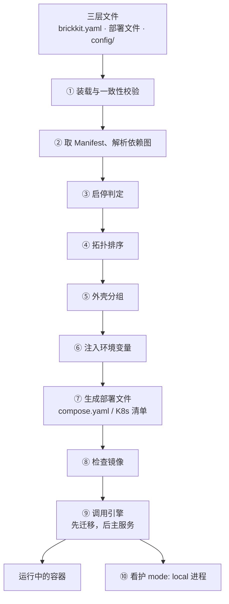

# 架构总览

## 四个部分

| 部分 | 形态 | 常驻吗 | 做什么 |
| --- | --- | --- | --- |
| BrickKit CLI | 一个本地的可执行文件 | ❌ 跑完就退出 | 读声明、解析、生成、调用引擎、发布 |
| 组件 | Docker 容器 / Kubernetes Pod | ✅ | 业务本身；彼此按 DNS 名字直接调用 |
| 底层引擎 | Docker / Podman / Kubernetes | ✅ | 真正运行容器、做健康检查、重启、负载均衡 |
| 安装源 | Git 仓库、本地目录、组件市场（可选） | 看情况 | 存放组件的 `component.yaml`、契约和代码 |

"该是什么样"写在三层文件里；"实际是什么样"在底层引擎里。两次运行之间，CLI 不记任何东西——没有后台进程、没有监听端口、没有需要运维的服务。

## 一次 `brickkit up` 的流水线

## 各站在做什么

**① 装载与一致性校验。** 读 `brickkit.yaml`、这次用的部署文件（`deploy.yaml`；本地模式下 `deploy.local.yaml`；或 `-f` 指定的那份）和 `config/`。
三层要对得上：每个组件版本在部署文件里恰好一个条目，外壳成员写在外壳下面，`$var:` 都有定义，没有未解决的配置冲突。
对不上就停下——后面每一站都以这三份文件为输入，输入错了，后面算出来的一切都是错的。

**② 取 Manifest、解析依赖图。** 按 `brickkit.yaml` 的组件与版本，从缓存或安装源取每个组件的 `component.yaml`，按其中的 `dependencies` 连成一张图。
强依赖缺了，这里就报错；弱依赖缺了，记一条警告。见 [依赖解析](02-dependency-resolution.md)。

**③ 启停判定。** 决定这次谁跑：顶层组件（没有谁依赖它）默认跑，下层组件只要上面有需要它的在跑就跑；部署文件里显式写的 `mode` 优先。
每个组件都带一句理由（"顶层"、"demo/caller 需要"、"mode: debug"）。

**④ 拓扑排序。** 在这次要跑的组件里排出启动顺序：依赖先于依赖方。

**⑤ 外壳分组。** 算出这次每个外壳承载哪些成员，核对它们的版本与外壳编进的版本一致，把成员的配置打包成 JSON。见 [外壳机制](../04-shell/README.md)。

**⑥ 注入环境变量。** 为每个组件算出它拿到的全部环境变量：`COMPONENT_ID`、`COMPONENT_VERSION`、每个依赖的 `*_ENDPOINT`、`config/` 解析出的配置值。
必填项没有值，这里拦下。见 [环境变量注入契约](03-env-injection-contract.md)。

**⑦ 生成部署文件。** 按部署文件的 `target` 生成 `.brickkit/generated/compose.yaml`（`docker`、`podman`）或一组 Kubernetes 清单（`k8s`）。
每次都重新生成，组件自己从不携带部署文件。`--dry-run` 到这里就停。见 [部署文件生成](04-deploy-file-generation.md)。

**⑧ 检查镜像。** 需要本机构建的镜像必须已经存在（`up` 从不构建）；拉取的镜像要取得到。所有缺的一次列全。

**⑨ 调用引擎。** `docker compose up`（或 `podman compose`、`kubectl apply`）。声明了迁移的组件先跑迁移，迁移成功结束后才启动主服务；
然后等每个组件的健康检查通过。部署目标是 `k8s` 时，动手之前先确认 `kubectl` 连着的是部署文件指定的集群。

**⑩ 看护本机进程。** 有 `mode: local` 的组件时，`up` 留在前台，启动并看护这些本机进程，直到 `Ctrl+C`。

## 同一条流水线，不同的出口

| 命令 | 走到哪一站 |
| --- | --- |
| `brickkit lint` | ①，外加对盘上已有 Manifest 的组件做配置与外壳声明检查；不联网，不建依赖图 |
| `brickkit deps`、`brickkit graph` | ①②③，打印依赖图 |
| `brickkit up --dry-run` | ①—⑦，生成部署文件后停下 |
| `brickkit up` | 全程 |
| `brickkit sync` | ①②③，按启停判定的结果整理源码目录 |

它们用的是同一份代码：同一个项目、同一份部署文件，`graph` 画出来的、`sync` 归档的、`up` 启动的，一定是同一个判定结果。
（本地模式开着时，`sync` 与 `up` 读 `deploy.local.yaml`，`graph` 始终读 `deploy.yaml`；要画本地的判定，用 `graph --file deploy.local.yaml`。）

## 平台刻意不做的事

- **不常驻。** 没有控制平面、没有守护进程：状态在三层文件和底层引擎里。
- **不做服务发现、不轮询健康。** DNS 和引擎自带的健康检查已经做了。
- **不做网关、网格、熔断限流、配置中心。** 这些因业务而异，属于组件自己，或者由外部工具经 `labels` 透传接入。
- **不猜。** 版本范围、未知字段、没写的端口暴露，一律不替你决定。

每一条背后的理由见 [设计原则与取舍](05-design-principles.md)。
