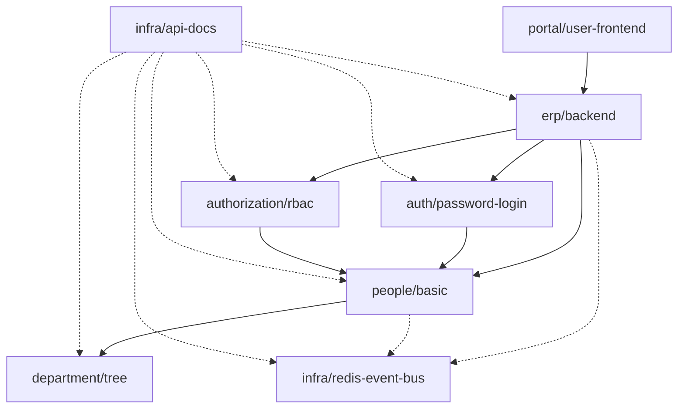

# 依赖解析与启动顺序

架构总览把 `brickkit up` 六个阶段完整走了一遍，全程都是"正常开着"的状态。这篇回过头深挖①②两个阶段——**级联**（这次到底谁会跑）和**解析**（会跑的那些按什么顺序启动）——把每一个都往难处推一把：关掉一个东西会发生什么、两条路径汇到同一个依赖上会怎样、以及为什么八个组件启动不等于八步串行。

下面每一个例子都是对着 [`tests/components/`](../../../tests/components/) 里真实存在的组件跑出来的真实 `brickkit up --dry-run` 结果，不是手写的示意图。CLI 没有英文输出模式，下面引用的命令输出就是原样的中文，跟你自己跑一遍看到的一字不差。

## 这些例子共用的依赖图



实线是强依赖，虚线是弱依赖。这张图值得反复用有两个原因：`people/basic` 是一个真实的菱形——三条路径（`erp/backend` 直接依赖，加上经过 `auth/password-login` 和 `authorization/rbac` 各一条）全都汇到它身上；而 `infra/api-docs` 弱依赖了图里几乎所有其它组件，下一节会看到这一点分量有多重。

## 阶段①：级联——这次到底谁会跑

完整的规则表在 AGENTS.zh.md §5.4，这一节不重复那张表，只展示它对着一张真实的图跑出来长什么样。给这个项目写上 `erp/backend: enabled: false`，别的都不动，跑一次 `brickkit up --dry-run`：

```
📋 组件状态计算：
   ✅ department/tree@1.0.0        启动（infra/api-docs 需要）
   ✅ infra/redis-event-bus@1.0.0  启动（infra/api-docs 需要）
   ✅ people/basic@1.0.0           启动（auth/password-login 需要）
   ✅ auth/password-login@1.0.0    启动（infra/api-docs 需要）
   ✅ authorization/rbac@1.0.0     启动（infra/api-docs 需要）
   ⬜ erp/backend@1.0.0            显式禁用（enabled: false）
   ⬜ portal/user-frontend@1.0.0   不启动（强依赖 erp/backend 不启动）
   ✅ infra/api-docs@1.0.0         启动（顶层）
```

这里有两件事，光靠抽象地记规则很容易想岔：

- **关掉 `erp/backend` 并不会带着它自己那棵依赖子树一起关掉。** `people/basic`、`auth/password-login`、`authorization/rbac`、`department/tree` 全都照常启动，因为 `infra/api-docs`——一个完全独立、始终默认开启的顶层组件——直接弱依赖了它们每一个。级联问的是"这次跑着的**任何**上层还需不需要它"，不是"我心里想着的那个上层还需不需要它"。一个共享的底层组件因为一个你压根没想到的调用方而活下来，是这里的常态，不是特例。
- **传导是双向的，从一个显式的 `enabled: false` 出发。** `portal/user-frontend` 自己根本没写 `enabled`——单看它自己，作为顶层组件默认就该跑。但它照样停了，因为它的**强依赖**（`erp/backend`）被显式关掉了，"依赖方跟着不启动"（AGENTS.zh.md §5.4）这条规则不管依赖方自己的 `enabled` 写了什么都照样生效。只有给 `portal/user-frontend` 也显式写上 `enabled: true`，才会把这个"悄悄停掉"变成一个硬报错——两条互相矛盾的显式意图同时摆在配置里。

## 阶段②：解析——展开依赖图，但不重复展开菱形

把 `erp/backend` 重新打开，再跑一次同样的命令。这次组件状态计算显示全部八个组件都会启动，每一行都带着真实的理由：

```
📋 组件状态计算：
   ✅ department/tree@1.0.0        启动（infra/api-docs 需要）
   ✅ infra/redis-event-bus@1.0.0  启动（erp/backend 需要）
   ✅ people/basic@1.0.0           启动（auth/password-login 需要）
   ✅ auth/password-login@1.0.0    启动（erp/backend 需要）
   ✅ authorization/rbac@1.0.0     启动（erp/backend 需要）
   ✅ erp/backend@1.0.0            启动（infra/api-docs 需要）
   ✅ portal/user-frontend@1.0.0   启动（顶层）
   ✅ infra/api-docs@1.0.0         启动（顶层）
```

遍历这张图的过程中，`people/basic` 被走到了三次——一次从 `erp/backend` 直接过来，另外两次分别从 `auth/password-login` 和 `authorization/rbac` 过来——最终解析成**一个**节点，在计划里只出现一次。判定同一性的规则是"组件 ID + 精确版本"这一对：任何一条路径只要指向 `people/basic@1.0.0`，最终都会落到同一个节点上，不管有多少个不同的调用方走到了它。这也正是版本共存完全不需要任何特殊处理的原因——`people/basic@1.0.0` 和假设存在的 `people/basic@2.0.0` 是两个不同的身份，会是两个完全独立的节点，永远不会被合并，也永远不会冲突（AGENTS.zh.md §5.1）。

**一个找不到的强依赖会立刻挡住生成**，而且会精确点名是哪个组件要它，而不是只说"缺了点什么"：

```
❌ 错误：强依赖缺失
   组件：people/basic@1.0.0
   缺失依赖：department/tree@1.0.0
   原因：该组件在所有安装源中均未找到
```

一个找不到的弱依赖只会给出警告，解析照常继续——那个找不到的组件的 `*_ENDPOINT` 就是不会被注入到把它声明为弱依赖的那个组件里。

## 循环：有一条弱边就放行，全是强依赖就硬拒绝

把 `department/tree` 也反过来**强依赖** `people/basic`（在 `people/basic` 自己已经强依赖 `department/tree` 的基础上），解析会直接拒绝：

```
❌ 错误：检测到循环依赖
   循环路径：department/tree@1.0.0 → people/basic@1.0.0 → department/tree@1.0.0
   原因：这几个组件互相强依赖，谁都要等对方先起来，启动顺序无解
   建议：
   1. 检查 Manifest 中的依赖声明（dependencies.components）
   2. 其中一方改成弱依赖（optional: true）即可——弱依赖不约束启动顺序，环上有一条弱边就不再是死结
```

把这同一条边改成**弱依赖**——`department/tree` 弱依赖 `people/basic`，而 `people/basic` 仍然强依赖 `department/tree`——一模一样的这个环就干干净净地解析通过了，不报任何错，依赖图输出里两个方向都能看到（`department/tree@1.0.0 → people/basic@1.0.0（弱）`，另一边 `people/basic@1.0.0 → department/tree@1.0.0` 没有这个标记）。

一个环只在"每一条边都是强依赖"时才是错误，只要有一条弱边就不算——原因是：**环之所以是问题，是因为它让启动顺序无解，而启动顺序从来只由强依赖约束**——产生阶段②那份输出的拓扑排序压根不看弱依赖边，正因为一条弱依赖可能根本就没在跑。所以一个完全由强依赖组成的环是真的无解——A 等 B，B 等 A，永远等下去。一个带了一条弱边的环则有明显可行的顺序：先启动环上那些没有强依赖前驱的组件，弱边本身根本不构成任何阻挡。两个组件"有对方就调用，没有就算了"地互相调用——比如一个通知组件可选地调用一个审计组件，审计组件又可选地回调通知组件记一笔——对两个协作的组件来说是完全正常的形状，不该仅仅因为它在图上恰好构成一个环就被拒绝。

## 启动顺序：拓扑排序，以及为什么组件多不等于串行步骤多

回到全部八个组件都开着的状态，真实的启动顺序是：

```
📋 启动顺序（拓扑排序）：
   1. department-tree-1-0-0        无依赖
   2. infra-api-docs-1-0-0         无依赖
   3. infra-redis-event-bus-1-0-0  无依赖
   4. people-basic-1-0-0           ← 依赖 1
   5. auth-password-login-1-0-0    ← 依赖 4
   6. authorization-rbac-1-0-0     ← 依赖 4
   7. erp-backend-1-0-0            ← 依赖 4, 5, 6
   8. portal-user-frontend-1-0-0   ← 依赖 7

可独立启动：department-tree-1-0-0、infra-api-docs-1-0-0、infra-redis-event-bus-1-0-0（无依赖）
最长依赖链（5 层）：department-tree-1-0-0 → people-basic-1-0-0 → auth-password-login-1-0-0 → erp-backend-1-0-0 → portal-user-frontend-1-0-0
   不在这条链上的组件与它并行启动
```

八个组件，但真正决定 `up` 跑到全部就绪要花多久的，是**最长那条强依赖链的长度**——这里是 5，不是 8。`department-tree`、`infra-api-docs`、`infra-redis-event-bus` 完全没有强依赖，立刻启动，跟别的一切并行。`authorization-rbac` 跟 `auth-password-login` 处在同一深度（两者都只等 `people-basic`），但不在**最长**那条链上，因为恰好是经过 `auth-password-login` 的那条链继续延伸到了 `erp-backend` 和 `portal-user-frontend`——所以 `authorization-rbac` 是跟这整条延伸并行启动的，不是排在它前面串行等待。

这个区分不是咬文嚼字——它是对这个平台自己文档里曾经真实出现过的一个错误的纠正。旧设计书曾经用一个组件的拓扑序号（把整张图压平成一条直线之后的位置），而不是它真实的强依赖深度，来描述它要等多久，得出类似"必须等前 4 个组件就绪"这样的结论——而那个组件自己的依赖图，就画在那句话旁边，明明白白显示它只强依赖了一个东西。把依赖图压平成一条有效的启动顺序列表是必要的，但把这份列表里的位置读成"这个组件要等多少个东西"，会悄悄地把图本身从来没有过的串行心智模型带回来。想知道一次真实的 `up`要跑多久，看最长那条链的长度，不要数计划里一共列了几个组件。

---

这一节建立在的完整字段级规则——精确版本锁定、为什么 `people/basic` 在同一个 Manifest 的 `dependencies` 里只能出现一次、两层保留变量防护——见 AGENTS.zh.md §5.1、§5.2、§9.2/§9.3。
