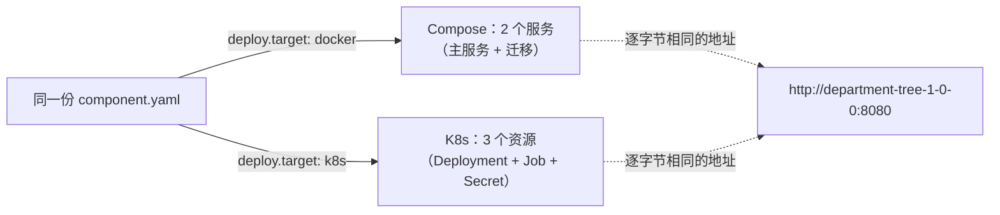

# 部署文件是怎么生成出来的

组件的仓库从来不会自带任何部署文件——CLI 读一份 `component.yaml`，根据 `deploy.target` 这一个字段，生成 `docker-compose.yaml` 或者一整套 Kubernetes 清单（AGENTS.zh.md §5.5）。这篇文档把生成这一步另一头到底吐出了什么，逐行摊开给两个目标各看一遍——同一份 Manifest 生成出不同部署文件，不该只是一句抽象的说法，而是能一行一行对着看的东西。

下面引用的每一份文件都是对着 [`tests/components/department-tree/`](../../../tests/components/department-tree/) 和 [`tests/components/people-basic/`](../../../tests/components/people-basic/) 真跑 `brickkit up --dry-run` 得到的原始输出，只删掉了重复的样板内容（标签、生成时间戳这类）。`department/tree` 声明了一个 `database` 资源、一条 `migration.command`、一个 `logLevel` 配置项，而且只写了 `requests` 没写 `limits`——特意选它是因为它一次性把资源绑定、迁移、配置覆盖、配额换算全都用上了。项目配置只覆盖了 `department/tree` 的 `logLevel` 为 `debug`，`people/basic` 的配置完全没动——这一点下面会看到它的意义。



## Docker Compose：一个组件变成两个服务

```yaml
services:
  department-tree-1-0-0:
    depends_on:
      department-tree-1-0-0-migration:
        condition: service_completed_successfully
    deploy:
      resources:
        reservations:
          cpus: "0.05"
          memory: 32M
    environment:
      - COMPONENT_ID=department/tree
      - COMPONENT_VERSION=1.0.0
      - DATABASE_HOST=postgres.internal
      - DATABASE_NAME=department
      - DATABASE_PASSWORD=s3cret
      - DATABASE_PORT=5432
      - DATABASE_USER=brickkit_app
      - LOG_LEVEL=debug
    healthcheck:
      interval: 10s
      retries: 3
      start_period: 60s
      test: [CMD-SHELL, "wget -q --spider http://localhost:8080/healthz || curl -fsS http://localhost:8080/healthz || exit 1"]
      timeout: 3s
    image: brickkit-demo/department-tree:1.0.0
    restart: unless-stopped
  department-tree-1-0-0-migration:
    command: [migrate]
    entrypoint: [/app/department-tree]
    environment: [... 跟上面一样 ...]
    image: brickkit-demo/department-tree:1.0.0
    restart: "no"
  people-basic-1-0-0:
    depends_on:
      department-tree-1-0-0: { condition: service_healthy }
      people-basic-1-0-0-migration: { condition: service_completed_successfully }
    environment:
      - DATABASE_NAME=people
      - DEPARTMENT_TREE_ENDPOINT=http://department-tree-1-0-0:8080
      - LOG_LEVEL=info
      - ...
```

有几个地方值得停下来看看：

- **迁移是一个真实的、独立的服务，不是挂在主服务上的一个步骤。** `department-tree-1-0-0-migration` 跑的是 Manifest 里的 `migration.command`，`restart: "no"`（它就该跑一次就退出），主服务 `depends_on` 它用的条件是 `service_completed_successfully`，不是 `service_healthy`——一个一次性容器永远不会变成"健康"，它只会变成"退出码 0"。主服务在这个退出码变成成功之前，物理上就是起不来。
- **`people-basic-1-0-0` 对 `department-tree-1-0-0` 的依赖用的是另一种条件**：`service_healthy`。同一份文件里，两种不同的 `depends_on` 条件各自干着不同的事——一种等一个一次性任务跑完，另一种等一个长期运行的服务健康检查通过。
- **资源配额是换算过的，不是原样照抄。** Manifest 里写的是 `requests: { cpu: "50m", memory: "32Mi" }`；Compose 没有 Kubernetes 那套毫核/MiB 记法，所以换算成了 `cpus: "0.05"`（50m = 0.05 个核）和 `memory: 32M`。没写 `limits`，也就没生成任何 `limits`——没写就是没有，跟 AGENTS.zh.md"只有 `requests` 有默认值"这条规则完全对得上。
- **健康检查故意同时试两个工具。** `wget -q --spider ... || curl -fsS ... || exit 1` 不是为了好看才写两遍——Compose 的健康检查是跑在**容器内部**的，用的是容器里实际装了什么，而 `python:slim` 或者各种 distroless 基础镜像经常两个都不带，或者只带其中一个。只写 `wget` 会造出一个明明跑得很好、却被判定为 unhealthy 的组件，而容器自己的日志里完全看不出原因。两个都试一遍是平台对这件事的防线——如果一个镜像真的两个都没有，这条防线也帮不上忙，这一点还是得自己确认（AGENTS.zh.md §10 点名过这个坑）。
- **`department/tree` 的配置覆盖真的生效了（`LOG_LEVEL=debug`），`people/basic` 的没动（还是它自己 Manifest 里的默认值）。** 项目配置只给 `department/tree` 写了 `config:` 覆盖——这正是 `configSchema` 覆盖注入该有的作用范围：一次只影响写了它的那一个组件，不是全项目生效的开关。

## Kubernetes：变成三种独立资源，而不是两个服务

同一个项目、同样的组件，只改了 `deploy.target: k8s`——`department/tree` 的 Deployment，截取最有代表性的部分：

```yaml
apiVersion: apps/v1
kind: Deployment
spec:
  template:
    spec:
      containers:
        - env:
            - { name: DATABASE_PASSWORD, valueFrom: { secretKeyRef: { name: main-db-secret, key: password } } }
            - { name: LOG_LEVEL, value: debug }
          image: brickkit-demo/department-tree:1.0.0
          livenessProbe:    { httpGet: {path: /healthz, port: 8080}, initialDelaySeconds: 10, periodSeconds: 10, timeoutSeconds: 3, failureThreshold: 3 }
          readinessProbe:   { httpGet: {path: /healthz, port: 8080}, initialDelaySeconds: 5,  periodSeconds: 5,  timeoutSeconds: 3, failureThreshold: 3 }
          startupProbe:     { httpGet: {path: /healthz, port: 8080}, periodSeconds: 5, timeoutSeconds: 3, failureThreshold: 12 }
          resources:
            requests: { cpu: 50m, memory: 32Mi }
```

- **数据库密码是一个 Kubernetes Secret 引用，不是明文值**——`valueFrom.secretKeyRef` 指向一个单独生成的 `Secret/main-db-secret`，而不是像 Compose 那样直接写一行明文 `DATABASE_PASSWORD=s3cret`。这是两个部署目标之间真正超出"语法差异"的一处分歧：**地址格式**在任何地方都完全一样（AGENTS.zh.md 说的"环境一致性"讲的就是地址），**密钥的传递方式**却不一样，因为只有其中一个目标原生有一个 Secret 对象可以委托。
- **组件声明了 `secret: true` 的配置项也是同一套待遇，只是落到另一份文件里。** 这两个组件都没声明这样的配置项，但如果 `department/tree` 的 `configSchema` 里有一项写了 `secret: true`，它的值会落进另一份单独生成的 `secrets/config-secrets.yaml`（权限同样是 0600），而不是资源用的那份 `secrets/resource-secrets.yaml`——一类一份文件，从不混在一起，所以一个只有资源密码、没有密钥配置项的项目，磁盘上根本不会出现 `config-secrets.yaml` 这份文件。
- **写了 `existingSecret` 就完全不生成了。** 给数据库资源写 `resources[].existingSecret`，或者给一个 `secret: true` 的配置值写成 `{ existingSecret, key }`，两份生成物里都不会出现这一条——Deployment 里的 `secretKeyRef.name` 直接指向你给的那个名字，因为那份 Secret 从来就不该由平台生成；它已经存在，是别的什么东西建出来的。
- **这次资源配额原样传过去了，没有做任何换算**——`50m`/`32Mi` 直接来自 Manifest，因为 Kubernetes 本来就说毫核和 MiB 这套语言。Compose 需要换算，Kubernetes 不需要。
- **三个独立的探针分别干三件不同的事——这是"K8s Probes"这四个字背后真正的深度，别处只提了个名字。** `livenessProbe`（初始延迟 10 秒，每 10 秒探一次，连续 3 次失败 ≈ 40 秒判死）是唯一会真正把 Pod 杀掉重启的那个。`readinessProbe`（5 秒/5 秒/3 次失败）决定 Service 到底给不给它转流量——而且**在 `startupProbe` 通过之前，readiness 是完全禁用的**，这样一个还在启动中的 Pod 不会仅仅因为凑巧提前通过了一次就绪检查，就被派去接请求。`startupProbe` 存在的唯一目的，就是不让一次缓慢的冷启动被误判成崩溃：它的 `failureThreshold` 不像另外两个探针那样是固定常数，而是按 `向上取整(startPeriodSeconds ÷ 5)` 算出来的，向上取整保证声明的宽限期不会因为除不尽而被悄悄缩水。这份 Manifest 根本没写 `startPeriodSeconds`，所以取了这个字段自己的默认值 60 秒，正好对应 `periodSeconds: 5, failureThreshold: 12`（5 × 12 = 60）。
- **没有启动探针的话，正是这同一个平台默认值（10 秒 + 10 秒×3 ≈ 40 秒）会把一个明明健康、只是启动慢的组件送进 CrashLoopBackOff**——Spring Boot、预加载很重的 Django、.NET 的首次 JIT，都是反复出现的真实肇事者（AGENTS.zh.md 里 `startPeriodSeconds` 那条警告说的就是这个）。真正兑现 `startPeriodSeconds` 这份承诺的是启动探针；如果改成调大 `livenessProbe` 自己的 `initialDelaySeconds`，等于是为了"修好"一个慢组件，让所有组件的故障发现都跟着变慢——这正是平台把这两个探针在结构上分开、而不是合并成一个的原因。
- **迁移是一个独立生成的 `batch/v1` Job 文件，完全没有揉进 Deployment 里**——`restartPolicy: Never`，`backoffLimit: 0`，迁移失败就是明明白白地失败一次，没有静默重试把它藏起来。为什么用 Job 而不是 InitContainer 是另一个早就有答案的问题——见 AGENTS.zh.md §9.6（简单说：InitContainer 是 Pod 级别的，`replicas: 3` 会导致同一段迁移并发跑三遍；Job 是集群级别的，能保证全集群只跑一次）。

## 两个目标之间真正不变的东西

`people/basic` 对 `department/tree` 的依赖，在两个目标上生成的是完全同一个字符串：

```
DEPARTMENT_TREE_ENDPOINT=http://department-tree-1-0-0:8080
```

不是"等价的地址"，是一字不差的同一串字节，因为一个 Compose 服务名和一个 Kubernetes Service 名，在 DNS 上解析的是同一个版本化服务名字符串。这篇文档从头到尾讲的那些差异——探针 vs. 单一健康检查、Secret 引用 vs. 明文值、换算过的配额 vs. 原生单位——全都是叠在这一个从不改变的地址之上的、生成目标层面的细节。组件自己的代码永远不需要知道、也永远无从分辨，到底是这两个目标里的哪一个生成了启动它的那份文件。
