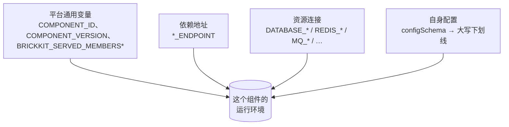

# 环境变量注入契约

AGENTS.zh.md §5.2 讲的是每一类注入变量的"形状"——命名规则、优先级顺序、两层保留变量防线。这篇文档要做的是把它变成一本真正的**字典**：平台可能写进组件容器的每一个变量名，逐条列出，覆盖每一种资源 `kind`，精确到每个变量的值到底是什么、在什么条件下它是"不存在"而不是"空字符串"。下面每一个变量名、每一段报错文案，都核对过 `internal/inject/inject.go` 与 `internal/shell/shell.go` 的源码；每一段生成结果，都是照着 CLI 自己测试套件搭夹具的同一套方法、真跑 `brickkit up --dry-run` 得到的，不是手打的示例。



下面每一节都要用到的同一条规则，先在这里说一遍，不在四处各说一遍：**一个没有值的变量绝不会被注入成空字符串——它就是根本不存在。** 弱依赖缺席、资源某个字段没配、配置项没给默认值也没被覆盖，这三种情况的结果完全一样："这个变量不存在"，绝不是 `VAR=""`。组件代码必须用防御性的方式读每一个变量（`os.environ.get()`，不是 `os.environ[...]`），原因正在这里——AGENTS.zh.md §9.13 有完整的论证，讲的是为什么空字符串反而更危险。

## 一、平台通用变量

| 变量名 | 什么时候有 | 值是什么 |
| --- | --- | --- |
| `COMPONENT_ID` | 每个组件都有 | 组件自己的 ID，如 `shop/checkout` |
| `COMPONENT_VERSION` | 每个组件都有 | 组件自己的精确版本，如 `1.0.0` |
| `BRICKKIT_SERVED_MEMBERS` | 只有 `servedBy` 外壳有 | 外壳当前收编成员的版本化服务名，逗号分隔、按字典序；零个成员时是 `""`（存在，只是空）——绝不是"变量不存在"，因为外壳必须分得清"零个成员"和"这个平台版本还没有这个变量" |
| `BRICKKIT_SERVED_MEMBERS_CONFIG` | 只有 `servedBy` 外壳有 | 一个 JSON 数组，每个收编成员一条；零个成员时是 `[]` —— 见第四节 |

真实生成结果，来自一个没有任何依赖、没有绑定任何资源的普通组件：

```
COMPONENT_ID=shop/checkout
COMPONENT_VERSION=1.0.0
```

这四个名字，加上下面第二节的 `*_ENDPOINT` 后缀、第三节的六个资源前缀，就是平台完整的保留变量清单——第五节细说。

## 二、依赖地址变量

**命名规则**（`internal/manifest/envvar.go`）：把依赖组件的 ID 里所有 `/` 和 `-` 都换成 `_`，再整体转大写——这就是 `EnvPrefix`。主端口的变量名是 `{EnvPrefix}_ENDPOINT`；一个叫 `x` 的额外端口是 `{EnvPrefix}_{X}_ENDPOINT`（额外端口自己声明的 `name` 字段，转大写）。**变量名**永远不带版本号；**变量值**永远指向它当前解析到的那个版本化服务名。

```
people/basic            → EnvPrefix 是 PEOPLE_BASIC
  deployment.port: 8080  → PEOPLE_BASIC_ENDPOINT=http://people-basic-1-0-0:8080
  extraPorts: [grpc:9090] → PEOPLE_BASIC_GRPC_ENDPOINT=http://people-basic-1-0-0:9090
```

这不是编出来的例子——[`tests/components/people-basic/`](../../../tests/components/people-basic/) 真的声明了这一个主端口和这一个额外端口，[`tests/components/erp-backend/`](../../../tests/components/erp-backend/) 真的依赖它、而且专门用的是 gRPC 那一个（它自己 `component.yaml` 的注释就是这么写的，`internal/inject/inject_test.go`、`internal/compose/compose_test.go` 也真的断言过这个精确字符串）。

**强依赖缺席会让 `up` 直接拒绝生成任何东西**（依赖解析这一步就失败了，走不到注入这一步）。**弱依赖（`optional: true`）缺席或者没在跑，会让这条变量整个不出现**——不是 `PEOPLE_BASIC_ENDPOINT=`，是环境里压根没有一个叫 `PEOPLE_BASIC_ENDPOINT` 的变量。完整的强/弱依赖对照表见 AGENTS.zh.md §5.3，为什么故意不用空字符串见 §9.13。

一个变量名只能指向一个版本：`dependencies.components` 不能把同一个组件 ID 写两遍（AGENTS.zh.md §5.1）——变量**名字**根本没有版本这个槽位，写第二条也没地方能把它区分开。

## 三、资源连接变量

每绑定一个资源，就会贡献一组固定的变量——只有那一个资源真正所属的那个 `kind` 对应的一组，绝不是六种都注入。哪个字段解析出来是空字符串（host 没填、没配用户名……），那个字段就整条从这组变量里消失，跟全篇同一条"不存在，不是空"的规则一样。下表里除了槽位字段之外的值，都直接来自 `brickkit.yaml` 里这个资源自己的 `host`/`port`/`username`/`password`；槽位字段（`DATABASE_NAME`、`MQ_VHOST`、`STORAGE_BUCKET`、`SEARCH_INDEX`）来自绑定自己的槽位字段（就是 AGENTS.zh.md §7"同一个槽位"那张表）。

| 资源 `kind` | 变量 | 备注 |
| --- | --- | --- |
| `database` | `DATABASE_HOST`、`DATABASE_PORT`、`DATABASE_NAME`、`DATABASE_USER`、`DATABASE_PASSWORD` 🔒 | `DATABASE_NAME` 就是绑定的 `database:` 槽位 |
| `cache` | `REDIS_HOST`、`REDIS_PORT`、`REDIS_PASSWORD` 🔒 | 没有 `REDIS_USER`，没有 DB 编号变量，也没有槽位字段——`kind: cache` 本来就没有槽位（AGENTS.zh.md §7） |
| `mq` | `MQ_HOST`、`MQ_PORT`、`MQ_USER`、`MQ_PASSWORD` 🔒、`MQ_VHOST` | `MQ_VHOST` 是绑定的 `vhost:` 槽位 |
| `storage` | `STORAGE_ENDPOINT`、`STORAGE_BUCKET`、`STORAGE_ACCESS_KEY`、`STORAGE_SECRET_KEY` 🔒 | `STORAGE_ENDPOINT` 是 `host:port` 拼起来的完整地址，不只是 `host`——只给 host、端口悄悄丢掉正是这个字段当年被改掉要修的那个坑（MinIO 默认的 `9000` 最容易被漏填）；`STORAGE_BUCKET` 是 `bucket:` 槽位，`STORAGE_ACCESS_KEY`/`STORAGE_SECRET_KEY` 就是 `username`/`password` 换了个 S3 语境更熟悉的名字 |
| `search` | `SEARCH_HOST`、`SEARCH_PORT`、`SEARCH_INDEX` | 完全没有认证变量——`kind: search` 资源上的 `username`/`password` 从来不会被注入；`SEARCH_INDEX` 是 `index:` 槽位 |
| `smtp` | `SMTP_HOST`、`SMTP_PORT`、`SMTP_USER`、`SMTP_PASSWORD` 🔒 | 没有槽位字段——`kind: smtp` 本来就没有槽位 |

🔒 标的是敏感字段：`deploy.target: k8s` 下这条变量会生成成 `valueFrom.secretKeyRef`，指向一个专门生成的 `Secret`，不是明文值（详见 [03-deployment-generation.md](03-deployment-generation.md)）；Docker 下它跟其它变量一样是明文值，因为 Compose 根本没有原生的密钥对象可以委托。

真实生成结果——一个组件同时绑定了全部六种 `kind`（`database`/`cache`/`mq`/`storage`/`search`/`smtp`，都没写 `envPrefix`）：

```
DATABASE_HOST=postgres.internal
DATABASE_NAME=checkout
DATABASE_PASSWORD=s3cret
DATABASE_PORT=5432
DATABASE_USER=app
MQ_HOST=mq.internal
MQ_PASSWORD=mqpass
MQ_PORT=5672
MQ_USER=mquser
MQ_VHOST=checkout
REDIS_HOST=redis.internal
REDIS_PASSWORD=cachepass
REDIS_PORT=6379
SEARCH_HOST=search.internal
SEARCH_INDEX=checkout-products
SEARCH_PORT=9200
SMTP_HOST=smtp.internal
SMTP_PASSWORD=mailpass
SMTP_PORT=587
SMTP_USER=mailer
STORAGE_ACCESS_KEY=minioadmin
STORAGE_BUCKET=checkout-media
STORAGE_ENDPOINT=minio.internal:9000
STORAGE_SECRET_KEY=miniosecret
```

**`envPrefix`是把整组变量名一起平移，不是只改一个字段。** 一个 `database` 资源绑定时写了 `envPrefix: ARCHIVE`，生成的是 `ARCHIVE_DATABASE_HOST`/`ARCHIVE_DATABASE_PORT`/`ARCHIVE_DATABASE_NAME`/`ARCHIVE_DATABASE_USER`/`ARCHIVE_DATABASE_PASSWORD`——就是上表那五个名字，各自加了前缀，没有哪个被改名或丢掉：

```
ARCHIVE_DATABASE_HOST=archive.internal
ARCHIVE_DATABASE_NAME=checkout_archive
ARCHIVE_DATABASE_PASSWORD=s3cret
ARCHIVE_DATABASE_PORT=5432
ARCHIVE_DATABASE_USER=app
```

这正是 [05-resource-binding.md](05-resource-binding.md) 里讲的"一个组件同时绑两个同类资源不撞车"用的那个机制——撞车判定的完整逻辑在那篇文档里，这里只负责把变量名本身列全。

## 四、组件自身的配置

**命名规则**（`internal/inject/reserved.go` 的 `EnvVarName`，跟市场发布校验用的是完全同一套算法，一字不差——这样才不会出现"发布时说没冲突、装的时候却冲突"的怪事）：一个驼峰或者短横线命名的 `configSchema` 属性名会变成全大写下划线形式——词边界要么是显式的 `-`/`.`/空格，要么是"小写字母或数字后面紧跟一个大写字母"。

```
defaultPageSize → DEFAULT_PAGE_SIZE
enableV2Api     → ENABLE_V2_API
kebab-case-key  → KEBAB_CASE_KEY
```

这个转换是**单向的**——只看到 `DEFAULT_PAGE_SIZE` 这个名字，没法反推出原来的 key 是 `defaultPageSize` 还是 `default_page_size`。`servedBy` 的 `BRICKKIT_SERVED_MEMBERS_CONFIG`（第六节）之所以存在，一部分原因就在这——外壳作者需要有人明确把"原始 key → 生成的变量名"这份映射交给他，而不是指望自己事后反推。

**值是怎么格式化的**（`formatValue`）取决于这个值实际的类型，不是 `configSchema` 里声明的 `type`：

| 值的类型 | 渲染成什么 | 例子 |
| --- | --- | --- |
| 字符串 | 原样不变 | `"info"` → `info` |
| 布尔值 | `true` 或 `false` | `true` → `true` |
| 恰好是整数的浮点数（YAML/JSON 里的整数解析出来就是 `float64`） | 不带小数点 | `20` → `20`，不是 `20.000000` |
| 非整数的浮点数 | Go 的 `%g` 格式 | `1.5` → `1.5` |
| **数组或对象** | Go 默认的 `fmt.Sprint` 字符串形式——**不是 JSON** | `["cn-east", "cn-north"]` → `[cn-east cn-north]`；`{beta: true, legacy: false}` → `map[beta:true legacy:false]` |

最后一行是真实核实过的坑，不是猜的：一个声明成 `array` 或 `object` 的 `configSchema` 属性，到了容器里**不会**是 JSON。它是 Go 用空格分隔、方括号包起来的字符串形式——`json.loads`/`JSON.parse` 直接解析不了，除非专门为 Go 自己的 `fmt` 语法写一个解析器，而这完全不该是任何人该做的事。如果组件真的需要通过这条通道拿到结构化配置，正确做法是声明成一个 `type: string` 属性、值是一段 JSON 字符串字面量（`'["cn-east","cn-north"]'`），在组件自己代码里解析它——不要指望声明 `type: array`/`type: object` 就能在另一头拿到 JSON。

**值从哪来**——`component.yaml` 自己 `configSchema.properties.<key>.default`，或者 `brickkit.yaml` 的 `components[].config.<key>`（有覆盖就用覆盖）。两者都不做类型校验（AGENTS.zh.md §4、§9.12——"说明书已经交到你手上了"）。一个既没默认值又没被覆盖的属性不会注入任何东西，**除非**它同时被列进了 `configSchema.required`——见第五节第三条。

## 五、除了"什么都不注入"之外的两种失败方式

一个写错了的 `config` 条目实际上有三种截然不同的结局，只有一种是完全沉默的：

**5.1 —— `config` 某个 key 算出来的变量名撞上了保留模式。** 保留集合精确到就是：第一节那四个精确名字、`*_ENDPOINT` 后缀、第三节那六个资源前缀（`DATABASE_`/`REDIS_`/`MQ_`/`STORAGE_`/`SEARCH_`/`SMTP_`），再加上**项目**给某个绑定资源定义的任何 `envPrefix`。最后这一条正是为什么这个检查放在注入阶段、而不是发布阶段——组件自己的 Manifest 根本没法知道将来绑定它的某个项目会取什么 `envPrefix`。**这是警告，不是阻断错误**——这个配置项被丢弃，平台自己的值（如果有的话）优先，`up` 继续往下走：

```
⚠️ 配置冲突：组件 shop/checkout 的配置项已被忽略
   组件：shop/checkout
   配置项：databaseFlavor
   环境变量名：DATABASE_FLAVOR
   冲突的保留模式：DATABASE_*
   处理：该配置项已被忽略，平台注入的值优先
   建议：
   1. 修改 configSchema 中的配置项名称，避开平台保留变量
   2. 例如改为 customDatabaseFlavor
```

改名建议会根据撞上哪种模式而不同——撞前缀（`DATABASE_*`）建议在 **key** 前面加 `custom`；撞后缀（`*_ENDPOINT`）建议把 key 结尾的 `Endpoint` 换成 `BaseUrl`，因为给一个已经以 `Endpoint` 结尾的 key 加前缀显然解决不了后缀撞车的问题：

```
⚠️ 配置冲突：组件 shop/checkout 的配置项已被忽略
   组件：shop/checkout
   配置项：upstreamEndpoint
   环境变量名：UPSTREAM_ENDPOINT
   冲突的保留模式：*_ENDPOINT
   建议：
   2. 例如改为 upstreamBaseUrl
```

**5.2 —— `brickkit.yaml` 里写的 `config` key，组件的 `configSchema` 里压根没有**（笔误，或者组件升级后删掉了这一项、覆盖却还留着）。同样是警告，同样不阻断，还会用编辑距离猜一下你想写的是哪个：

```
⚠️ config 里有配置项不会生效：组件 shop/checkout 的 typoLogLevel
   配置项：typoLogLevel
   原因：组件的 configSchema 里没有这一项
   影响：这一项不会被注入任何环境变量；组件会使用它自己的默认值
   组件声明的配置项：databaseFlavor、logLevel、upstreamEndpoint
```

组件**根本没声明 `configSchema`**、项目却还是写了 `config:` 块时，同一句警告会原样出现——这次是整块都不生效，不只是没认出来的那几个 key：

```
⚠️ config 整块不会生效：组件 shop/cart 没有声明 configSchema
   被忽略的配置项：maxItems（共 1 项）
   影响：一项都不会被注入任何环境变量
   建议：要让它可配置，先在组件的 component.yaml 里加 configSchema
```

**5.3 —— `configSchema.required` 里的某个 key，既没有默认值，也没有任何地方覆盖它。** 这是全篇唯一一种**阻断错误，不是警告**——`brickkit up` 直接拒绝生成任何东西，不管是哪个组件，并且把缺的那个 key、是哪个组件声明它必填的都点出来：

```
❌ 错误：必填的组件配置没有值
   缺少配置：shop/pricing@1.0.0 → pricingServiceUrl（注入为 PRICING_SERVICE_URL）
   原因：组件在 configSchema.required 里声明了它，又没有给默认值——这一项平台推导不出来，只能由项目提供
   建议：
   1. 在 brickkit.yaml 里给它一个值：
    components:
      - id: shop/pricing
        config:
          pricingServiceUrl: <值>
   2. 值里可以写 ${ENV_VAR}，真值放 .env
```

为什么只有这一条能阻断启动：一个必填又没默认值的 key，说的正是组件作者在说"这个我是真的猜不出来，只能项目告诉我"——跨项目服务地址是最典型的场景（AGENTS.zh.md §5.2——平台没有任何办法推导出另一个项目自己的服务跑在哪）。放行的后果是组件正常启动、看起来完全健康，只是有一条调用路径永远走不通——在真正有人踩到那条路径之前，跟"配置对了"没有任何区别。跟 5.1/5.2 比一下就清楚了：那两种是笔误，背后还有一个能跑（虽然不对）的兜底行为；这一种是"根本没有兜底"，所以平台不能用同一套宽容处理它。

## 六、`servedBy`：成员的变量怎么落到外壳身上

一个 `servedBy` 成员自己不产生容器，也没有自己的运行环境——它的变量会合并进**外壳**的容器（AGENTS.zh.md §5.7）。三类不同的变量走三条不同的合并规则：

- **`*_ENDPOINT` 类变量**（成员自己的依赖，第二节）不带前缀直接合并进去——组件 ID 本身已经保证这些名字全局唯一，一个调用方读 `DEPARTMENT_TREE_ENDPOINT` 不应该还要关心它背后的组件到底是独立部署的还是被收编进了某个外壳。
- **成员自己的 `configSchema` 配置**（第四节）合并进去时**会加一个 `{EnvPrefix(成员ID)}_` 前缀**——跟 `*_ENDPOINT` 用的是同一套前缀算法——专门用来防止两个互不知情的模块碰巧用了同一个通用配置 key（比如都叫 `pageSize`）时，在外壳这一份共享进程环境里撞车。
- **完全不参与合并的**：`COMPONENT_ID`/`COMPONENT_VERSION`（外壳只保留自己那唯一一对——一个成员没有自己的容器，也就谈不上是"这个容器"对应的组件），资源连接变量（第三节——成员的资源绑定只要外壳自己的 componentId 绑上了那个资源就算满足，详见 AGENTS.zh.md §5.7），以及 `labels`（真实多组件场景测出"同名不同值"几乎是常态之后，被整个从合并规则里拿掉了——完整来龙去脉见 AGENTS.zh.md §5.7）。

真实生成结果——一个外壳（`infra/shell-go-core`）收编了两个成员：`mdm/customer`（`pageSize` 默认 `20`，自己声明端口 `8081`）和 `mdm/product`（`pageSize` 在 `brickkit.yaml` 里被覆盖成 `100`，自己声明端口 `8082`）：

```
BRICKKIT_SERVED_MEMBERS=mdm-customer-1-0-0,mdm-product-1-0-0
BRICKKIT_SERVED_MEMBERS_CONFIG=[{"componentId":"mdm/customer","version":"1.0.0","httpPort":8081,"extraPorts":[],"configEnvVars":{"pageSize":"MDM_CUSTOMER_PAGE_SIZE"}},{"componentId":"mdm/product","version":"1.0.0","httpPort":8082,"extraPorts":[],"configEnvVars":{"pageSize":"MDM_PRODUCT_PAGE_SIZE"}}]
COMPONENT_ID=infra/shell-go-core
COMPONENT_VERSION=1.0.0
MDM_CUSTOMER_PAGE_SIZE=20
MDM_PRODUCT_PAGE_SIZE=100
```

这段输出里有两处值得细看：**`BRICKKIT_SERVED_MEMBERS_CONFIG` 里 `pageSize` 对应的是 `"MDM_CUSTOMER_PAGE_SIZE"`——一个变量**名字**，绝不是值 `20` 本身。** 真正的值在下面那一行、外壳自己的环境里；外壳的实现代码读这份 JSON，是为了知道某个成员的某个配置 key 对应的值到底落在哪个变量上，再去读那个变量本身。这层间接是刻意的：成员的配置值经常是一个还没展开的 `${VAR}` 密钥占位符，如果把这个占位符将来展开后的值直接塞进 JSON 字符串内部，`docker compose` 自己那套不理解结构、只认文本的 `${VAR}` 替换，一旦这个值里带了引号或反斜杠，就会把 JSON 结构撑坏（AGENTS.zh.md §5.7 记着这个真实踩过的坑）。以及 **`MDM_PRODUCT_PAGE_SIZE=100`，不是 `50`**——项目在 `mdm/product` 上写的 `config: { pageSize: 100 }` 覆盖照常生效，跟一个独立部署的组件完全一样；`servedBy` 只改变变量**落在哪里**，从不改变第四节那条"覆盖优先于默认值"的规则本身。

`BRICKKIT_SERVED_MEMBERS` 和 `BRICKKIT_SERVED_MEMBERS_CONFIG` 本身也在保留变量清单里（第五节第一条）——任何组件的 `configSchema` 都不能声明出一个算出来正好是这两个名字的属性。

## 延伸阅读

- AGENTS.zh.md §5.2——这篇文档把它展开成完整字典的那套命名规则，以及一段话讲完的两层保留变量防线
- AGENTS.zh.md §9.13——"不存在，从不是空"这条设计背后完整的论证
- [05-resource-binding.md](05-resource-binding.md)——绑定写错、两个绑定撞车会发生什么，以及配额链（另一套合并逻辑，本文不涉及）怎么逐字段合并三层
- [03-deployment-generation.md](03-deployment-generation.md)——一条被标记为敏感的变量，是怎么变成 Kubernetes 的 `Secret` 引用而不是明文值的
- [07-shell-implementers-guide.md](../07-patterns/07-shell-implementers-guide.md)——`BRICKKIT_SERVED_MEMBERS`/`BRICKKIT_SERVED_MEMBERS_CONFIG` 落进进程之后，`servedBy` 外壳作者具体该拿它们做什么
- [03-service-addressing.md](../07-patterns/03-service-addressing.md)——一条 `*_ENDPOINT` 变量到了你的运行环境之后，它背后的容器被换掉时，一条已经建好的连接实际会发生什么——Go/Python/Node 真测出来的结果，不是猜的
