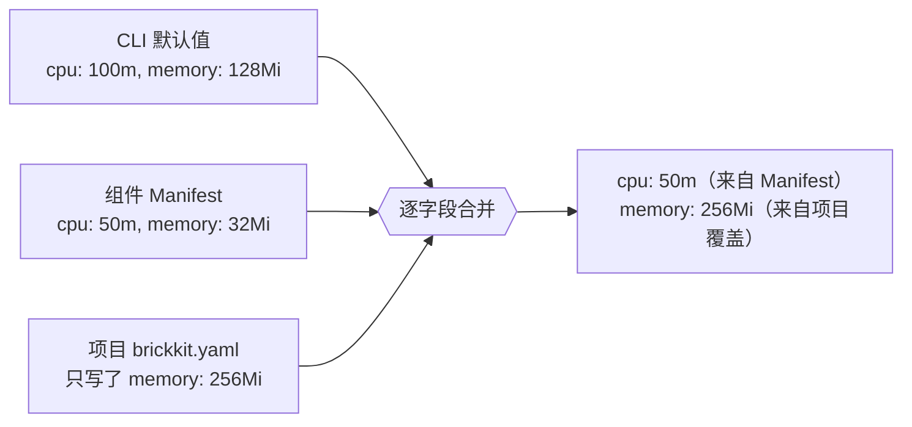

# 资源绑定的实际机制

一个资源——数据库、缓存、对象存储——是运维部署的，不是 BrickKit 部署的；项目只负责声明一个资源、把组件绑定上去（AGENTS.zh.md §2.1、§7）。声明该怎么写，AGENTS.zh.md 的字段骨架已经写得很完整了；这篇文档讲的是**真写下去之后实际会发生什么**——一个绑定跟另一个绑定撞车会怎样，以及一份资源配额到底怎么从三个不同的地方合并成容器真正拿到手的那一个数字。下面每一条报错、每一个生成出来的值，都是对着 [`tests/components/department-tree/`](../../../tests/components/department-tree/) 和 [`tests/components/demo-hello/`](../../../tests/components/demo-hello/) 真跑 `brickkit up --dry-run` 得到的真实结果。

## 绑定的槽位名写错了是一个校验错误，不是悄悄没反应

每种资源 `kind` 只对应一个绑定字段——`kind: database` 对应 `database`，`kind: mq` 对应 `vhost`，`kind: storage` 对应 `bucket`，`kind: search` 对应 `index`（`kind: cache` 和 `kind: smtp` 根本没有这一格）。写错了，`brickkit up` 会直接拒绝生成任何东西，并且把你真正该写的那个字段名点出来：

```
❌ 错误：brickkit.yaml 校验失败
   文件：brickkit.yaml
   resources[0].bindings[0].vhost：kind: database 下这一格叫 database，不是 vhost（注入为 DATABASE_NAME）
```

这是校验阶段就抓住的问题，不是留到运行时才变成一桩悬案——你是从 `brickkit up` 自己嘴里得到答案的，而且它直接把正确的字段名递给你，不用等到跑起来的容器里发现少了个 `DATABASE_NAME` 才回头查。

## 一个组件绑两个同类资源：一次真实的冲突，在生成之前就被拦下

把 `department/tree` 同时绑定到两个独立的 `kind: database` 资源上——比如一个主库、一个报表库——两边都不做区分，`brickkit up` 会直接拒绝，而不是让后一个悄悄覆盖前一个：

```
❌ 错误：brickkit.yaml 校验失败
   resources[1].bindings[0]：与 resources[0].bindings[0] 抢同一批连接变量：组件 department/tree 同时绑定了 main-db 与 reporting-db（都是 database，都没写 envPrefix），两者都注入 DATABASE_HOST / DATABASE_PORT / … —— 后者覆盖前者，而组件不会察觉自己连错了地方。给其中一个加 envPrefix 区分开（如 envPrefix: ARCHIVE，注入为 ARCHIVE_DATABASE_HOST）
```

给报表库那条绑定加上 `envPrefix: REPORT`，同样这两条绑定就干干净净地都生效了——两组变量同时完整出现在环境里，一组不带前缀，一组带：

```
DATABASE_HOST=postgres.internal
DATABASE_NAME=department
DATABASE_PASSWORD=s3cret
DATABASE_PORT=5432
DATABASE_USER=brickkit_app
REPORT_DATABASE_HOST=reporting.internal
REPORT_DATABASE_NAME=department_reporting
REPORT_DATABASE_PASSWORD=r3port
REPORT_DATABASE_PORT=5432
REPORT_DATABASE_USER=brickkit_report
```

这条校验只在真正存在冲突时才会触发——一个组件绑了两个同类资源、又没办法区分它们的变量。一个项目可以有任意多个 `kind: database` 资源，完全不碰 `envPrefix` 也没问题，只要没有**同一个**组件同时绑到其中不止一个。

## 配额链是真实的三层、逐字段合并——不是三层整体二选一

AGENTS.zh.md 给出了优先级顺序（`brickkit.yaml` > `component.yaml` > CLI 默认值），也说了这是逐字段合并、不是整块替换；下面是这三层各自单独生效时真正会生成出什么、以及它们合在一起时会怎样，全部来自真实生成的 Compose 输出（`deploy.resources.reservations`，从 Kubernetes 风格的毫核/MiB 记法换算成 Compose 的普通数字）。



**第三层——哪里都没声明。** 把 [`demo/hello`](../../../tests/components/demo-hello/) 自己的 `deployment.resources` 删掉，`brickkit.yaml` 里也不写覆盖：

```yaml
deploy:
  resources:
    reservations:
      cpus: "0.10"      # CLI 自己的默认值：100m
      memory: 128M      # CLI 自己的默认值：128Mi
```

**第二层——组件自己推荐的值，项目没有覆盖任何东西。** `department/tree` 在 Manifest 里声明了 `requests: { cpu: "50m", memory: "32Mi" }`，项目配置没碰它：

```yaml
deploy:
  resources:
    reservations:
      cpus: "0.05"
      memory: 32M
```

**第一层——项目只覆盖了其中一个字段，另一个没动。** 同一个组件，`brickkit.yaml` 只加了 `resources: { requests: { memory: "256Mi" } }`——覆盖内容里完全没提 `cpu`：

```yaml
deploy:
  resources:
    reservations:
      cpus: "0.05"      # 仍然是组件自己 Manifest 里的值——覆盖内容压根没提过 cpu
      memory: 256M      # 项目的覆盖在这里生效了
```

`cpu` 来自 Manifest，`memory` 来自项目配置，两者出现在**同一个**生成出来的配置块里。这是真正的逐字段合并，不是"更具体的那一层整体替换掉前一层"——写一条内存覆盖，不需要连同你根本不想动的 `cpu` 一起重新声明一遍，也不会因为没提到某个字段就把它意外重置掉。

## 为什么 `up` 从不预先检查绑定的资源是否真的连得上

`brickkit up` 不会在生成、启动任何东西之前先去拨一下数据库、探一下 Redis，或者以其他方式探测 `resources:` 里的某一项。资源没真起来的话，报错来自**组件自己**（或它的迁移容器，那通常是第一个连库的东西）——就是一句普通的 `dial tcp 172.17.0.1:5432: connect: connection refused`，不是平台层面的检查。

早先的 CLI 版本确实有过一模一样的功能（`brickkit up --check-resources`，对 `host:port` 拨一次纯 TCP），后来被**故意删除**。理由不是"还没做"——预先探测这件事实际上是双向都会误导人：

| 场景 | TCP 拨号说什么 | 实际情况 |
| --- | --- | --- |
| `host: localhost`，绑了它的组件跑在容器里 | ✅ 可达 | ❌ 容器内部的 `localhost` 解析成容器自己，根本连不到宿主机 |
| `host` 是一个真实的容器网络内服务名（对容器化组件来说这才是对的） | ❌ 不可达 | ✅ 组件自己完全能正常解析、正常连上 |

CLI 跑在宿主机上，在任何容器网络之外，用的是使用者手动敲的那套凭据；组件跑在容器网络里面，用的是它自己绑定的那套凭据。从宿主机拨号成功，证明不了组件自己连得上；拨号失败，也完全可能只是"从错误的网络拨号"这个假象，而不是资源真的挂了。更糟的是，一次通过的检查是一盏**没有任何承诺的绿灯**——而绿灯最大的作用恰恰是让人从此不再往那个方向查。上面两行已经说明它在两个方向上都会错得很有说服力，不只是"查得不够细"。让组件自己报告连接失败，反而白得一个更准确的错误信息——它本来就是用对的凭据、从对的网络去连的——所以 `up` 只把话说在前面，提前列出哪些资源需要已经跑起来（AGENTS.md §2.1），至于连不连得上，交给真正要建立那个连接的一方去验证。
