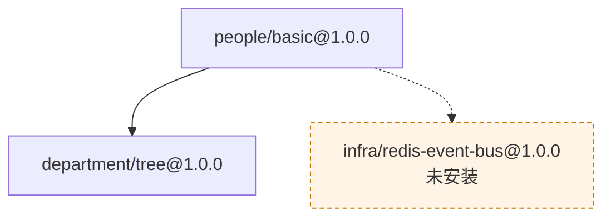
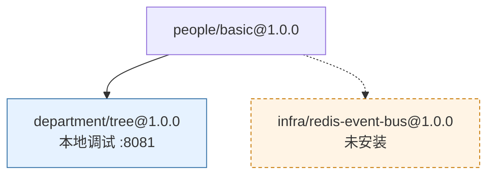

# CLI 命令完整参考

AGENTS.zh.md §8 给每个命令一句话概括，加一小撮精选的参数示例——够把整个
命令集装进脑子里。这份文档是另外一半：每个命令、每个参数、真实生成的输
出都在这。想知道整个 CLI 长什么样，看 AGENTS.zh.md；想知道某一个命令到
底干什么、某一个参数到底改变了什么，看这份。

这份文档里出现的每一个命令名、参数名，都会被 `scripts/check-cli-docs.py`
（`make check-cli-docs`）拿真实二进制核对——改名或删掉的参数会让构建直接
报错，不会悄悄过期。

下面的示例，除非特别注明，都是对着一个真实项目跑出来的（`tests/components/`
里两个真实组件，一条真实的依赖边）。

---

## 命令一览

点命令名，跳到它的完整说明。

| 分组 | 命令 | 一句话 | 什么时候用 |
| --- | --- | --- | --- |
| 项目与组件 | [`brickkit init`](#brickkit-init) | 创建项目：生成 `brickkit.yaml` 骨架和 `.brickkit/` 目录，并安装 AI 助手技能 | 从零开始一个新项目 |
| | [`brickkit skills`](#brickkit-skills) | 查看或刷新项目里安装的 AI 助手技能 | 升级 CLI 之后想更新技能文件 |
| | [`brickkit graph`](#brickkit-graph) | 把依赖拓扑画成 Mermaid 文本，打印到 stdout | 想在 `up` 之前看清谁需要谁、这次谁会（不会）启动 |
| | [`brickkit lint`](#brickkit-lint) | 离线、只读地检查 `brickkit.yaml` 与 `component.yaml` 的结构 | 刚写完或改完 YAML，不用联网、不用 Docker |
| | [`brickkit new`](#brickkit-new) | 生成一个新组件的最小骨架：一份能通过校验的 `component.yaml` | 要自己开发一个新组件 |
| | [`brickkit add`](#brickkit-add) | 拉取组件及其整棵依赖树，下载产物，写进 `brickkit.yaml` | 想用某个组件 |
| | [`brickkit remove`](#brickkit-remove) | 移除组件，并删除它的源码目录 | 不再需要某个组件 |
| | [`brickkit fetch`](#brickkit-fetch) | 只下载组件的产物，不写配置、不部署 | 跨项目调用别人的服务，需要它的接口契约 |
| 运行 | [`brickkit up`](#brickkit-up) | 判定谁该跑，生成部署文件，跑迁移，调用底层引擎 | 把项目真正跑起来（或先 `--dry-run` 看计划） |
| | [`brickkit down`](#brickkit-down) | 停止全部组件（不删卷，数据保留） | 收工 |
| | [`brickkit status`](#brickkit-status) | 显示运行状态表 | 看现在跑着什么 |
| 源码工作区 | [`brickkit sync`](#brickkit-sync) | 按"谁该跑"的结果，把不启动的组件源码归档、要跑的还原 | 想让 `components/` 里只留当前关心的 |
| | [`brickkit restore`](#brickkit-restore) | 把 `enabled` 和源码布局恢复到上一次提交 | `sync` 之后想撤回 |
| 市场 | [`brickkit login`](#brickkit-login) | 交互式登录市场 | 发布或安装私有组件之前 |
| | [`brickkit logout`](#brickkit-logout) | 撤销令牌并删除本地凭据 | 退出登录 |
| | [`brickkit publish`](#brickkit-publish) | 把 Manifest、镜像引用和产物上传到市场 | 发布自己的组件 |
| 其他 | [`brickkit version`](#brickkit-version) | 打印版本 | 确认装的是哪一版 |
| | [`brickkit completion`](#brickkit-completion) | 生成 shell 的自动补全脚本 | 想在终端里按 Tab 补全命令名和参数名 |

另外还有[两个全局参数](#两个全局参数每个命令都有)，每个命令都能用。

---

## brickkit init

**用法：** `brickkit init <项目名称> [flags]`

在当前目录生成 `brickkit.yaml`、`components/`、`.brickkit/`，把平台自己
那份规则追加进 `.gitignore`，并装入 AI 助手技能
（`.claude/skills/`、`AGENTS.md`）。项目名称必须显式指定，没有默认值，
只能是小写字母/数字/中划线，且以字母或数字开头结尾（要喂给 Docker 网络
名和 K8s namespace）。

装入的技能只覆盖"照常识会猜错"的那些东西——保留变量、健康检查禁令、启
停跟着上层走——从不复刻某个参数的具体写法，那部分一律指向 `--help`。它
们跟着项目一起提交、团队共享；CLI 升级后用 `brickkit skills update` 刷
新。`init` 绝不碰你自己的 `CLAUDE.md`——那是你自己的文件。

如果项目还把组件源码一起纳入版本控制（把 `components/` 从 `.gitignore`
里去掉），`init` 会额外装一个 pre-commit hook，拦住"归档状态变了、
`enabled` 却没跟着改"这个失误——但只有当项目根目录**就是**
Git 仓库根目录时才会自动装；嵌套在别人仓库里的项目，需要用 `--hooks` 显
式补装。

**参数**

| 参数 | 默认值 | 作用 |
| --- | --- | --- |
| `--no-skills` | 关闭 | 不装 AI 助手技能 |
| `--hooks` | 关闭 | 只装 pre-commit hook（给已有项目、或嵌套在别的仓库里的项目补装用） |

**示例**

```
$ brickkit init demo-shop
✅ 项目已初始化：demo-shop
   📁 brickkit.yaml        项目配置
   📁 components/          组件源码（已配为本地安装源 local-dev）
   📁 .brickkit/           CLI 工作目录
   📁 .claude/skills/      AI 助手技能（4 个）
   📁 AGENTS.md            AI 助手项目导读
   💡 组件源码要跟项目一起进 Git 的话：brickkit init --hooks 装上提交前检查

下一步：
  brickkit add --local               把 components/ 下的组件全加进来
  brickkit add people/basic@1.0.0    从安装源添加组件
  brickkit up                        一键启动
```

```bash
brickkit init demo-shop --config brickkit.prod.yaml   # 初始化非默认环境的配置文件
brickkit init demo-shop --no-skills                   # 不装 AI 助手技能
brickkit init --hooks                                 # 给已有项目单独补装 pre-commit hook
```

---

## brickkit skills

**用法：** `brickkit skills [flags]` / `brickkit skills <status|update> [flags]`

管理项目 `init` 时装入的 AI 助手技能。它们描述的是**当前这个 CLI 版本**
的行为，所以 CLI 升级后需要刷新一次。裸的 `brickkit skills` 和
`brickkit skills status` 是只读的，效果一样；`brickkit skills update` 把
缺的装上、把旧的刷新。

**手改过的文件绝不会被覆盖。** `update` 会把它们列出来并跳过。想放弃本
地修改，删掉那个文件再跑一次 `update` 就行——刻意不提供 `--force`：删文
件这个动作本身已经足够明确，多一个开关只会多一条误伤路径。跟 `init` 一
样，`skills` 也绝不碰你自己的 `CLAUDE.md`。

**在独立的组件仓库里也能用。** 目录里有 `component.yaml`、没有 `brickkit.yaml` 时（平台要求"一个组件一个仓库"，组件作者通常就在这样的目录里干活），`skills` 只管理 `brickkit-component` 这一个技能——项目导读和拼装、部署、排障三个技能在那里讲不通，所以不装；仓库自己的 `AGENTS.md` 一个字都不碰。判定顺序是：先看有没有 `brickkit.yaml`（有就按项目处理，跟以前一样），再看有没有 `component.yaml`，两样都没有就报错，不会往别人的目录里写文件。它同样会在仓库里建一个 `.brickkit/skills.lock`，记录"这个文件上次是谁写的"，跟技能文件一起提交。

```
$ brickkit skills update
📦 组件仓库（有 component.yaml、没有 brickkit.yaml）：只管理 brickkit-component 技能
✅ AI 助手技能已更新
   已写入 1 个：
     .claude/skills/brickkit-component/SKILL.md
```

**子命令**

| 子命令 | 作用 |
| --- | --- |
| `status` | 看每个技能文件的状态（已装、缺失、过期、手改过）——只读 |
| `update` | 缺的装上、旧的刷新、手改过的跳过 |

**示例**

```bash
brickkit skills           # 看装了什么、有没有过期
brickkit skills update    # 刷新到当前 CLI 版本
```

---

## brickkit graph

**用法：** `brickkit graph [flags]`

把项目的依赖拓扑——谁需要谁——画成一张图，让你直接看到 `brickkit.yaml` 和各组件的 Manifest 合起来是什么样，不用再对着十几份 `component.yaml` 自己拼。图是用 Mermaid 写的，Mermaid 是一种画图用的纯文本写法：命令只打印文本，由 GitHub 把这段文本变成图（见下面的"怎么看它"）。

它读的和 `up --dry-run` 读的一样——`brickkit.yaml` 和每个组件的 Manifest——也走同样的两步：解析依赖图，再判定谁启动（AGENTS.zh.md §5.4）。然后就停了：不检测镜像拉取权限，不跑迁移，不注入环境变量，不生成部署文件，也不碰 Docker 或 Kubernetes。跟 `up --dry-run` 一样，市场或 Git 组件的 Manifest 还没缓存时会联网去取，所以 `graph` 不承诺离线可用（承诺离线的是 `lint`）。依赖图解析不出来时——比如某个强依赖在所有安装源里都找不到——报的就是 `up` 会报的那个错，不另发明一套说法。

**图上有什么**

| 图上的东西 | 意思 |
| --- | --- |
| 标着 `id@版本` 的方框 | 一个组件。如果它是 `local: true`，标签会多一行 `本地调试`；`brickkit.yaml` 里写了 `localPort` 的话，后面再带 `:<端口>`。没写 `localPort` 时端口要等 `up` 才会选定，图上就不画端口，不编一个 |
| 实线箭头 `A --> B` | A **强依赖** B |
| 虚线箭头 `A -.-> B` | A **弱依赖** B。如果所有安装源里都没有 B，它照样会被画出来：一个橙色虚线框，标签是 `id@版本` 加 `未安装`——这正是 `up --dry-run` 里写作 `（弱，未安装）` 的那件事，也是"为什么这个地址没被注入"的答案 |
| 灰色方框 | 这次不会启动的组件：被 `enabled: false` 关掉了，或者上面没有任何在跑的组件需要它（AGENTS.zh.md §5.4） |
| 浅蓝色方框 | 会启动的 `local: true` 组件 |
| 带标题 `外壳：id@版本` 的大框，框住一些组件 | 这些组件用 `servedBy` 并进了另一个组件的进程里（AGENTS.zh.md §5.7），标题写的就是那个外壳。外壳自己是框外一个普通方框。`servedBy` 指向的外壳不在项目里时，这个分组照样画出来——目标不存在由 `up` 去报 |

箭头总是画出来，不管另一头这次有没有启动：图展示的是你**声明**的结构，"启动与否"用颜色表达，两件事不混在一起。

**输出是纯 Mermaid。** 标准输出里只有这张图，一个多余的字符都没有，所以把它重定向到 `graph.mmd` 得到的就是合法文件。不是图的东西都去了别处：解析依赖图时的警告（比如弱依赖取不到）写到 stderr；`--ignore-served-by` 生效的提示是一行 Mermaid 注释（`%% …`），渲染器会跳过它；项目里没有组件时只输出 `graph TD` 和一行注释（`%% 当前项目没有组件`）。同一份配置每次画出的文本逐字节相同，被依赖的排在依赖它的前面，所以存下来的 `.mmd` 文件放进 Git 里看 diff 很干净。（文本里每个节点的 ID 是组件的版本化服务名，把 `-` 换成 `_`——`demo-hello-1-0-0` 变成 `demo_hello_1_0_0`；给人看的是标签，不是 ID。）

**怎么看它。** GitHub 直接渲染 `.mmd`（或 `.mermaid`）文件，也渲染 Markdown 里语言写成 `mermaid` 的围栏代码块。把图直接粘进 Markdown 而**不加**这层围栏，它就只是一段文字。

**刻意不做的事。** 没有 `--output` 参数，没有 HTML 或 SVG，也没有"只画某个组件周围一圈"的过滤。GitHub 本来就免费渲染 Mermaid，自己再造一个渲染器等于多背一份永远要维护的东西（AGENTS.zh.md §4.1）；写文件用 shell 重定向就够了，不需要为它多开一个参数。

**参数**

| 参数 | 默认值 | 作用 |
| --- | --- | --- |
| `--ignore-served-by` | 关闭 | 在内存里清空全部 `servedBy` 声明再画一次：原本被外壳收编的组件会作为独立的普通方框出现，各画各的、就像它们各自单独启动时的样子。含义与 `up --ignore-served-by` 相同，也同样从不写回 `brickkit.yaml`。输出里会多一行 `%%` 注释，说明这个参数生效了 |

**示例**（就是[后面 `up --dry-run` 示例](#brickkit-up)的那个项目：`people/basic` 需要 `department/tree`，还有一个没有任何安装源提供的弱依赖）

```
$ brickkit graph > graph.mmd
⚠️ 警告：弱依赖缺失：infra/redis-event-bus@1.0.0
   影响组件：people/basic@1.0.0
   原因：该组件在所有安装源中均未找到
   影响：该组件的环境变量 INFRA_REDIS_EVENT_BUS_ENDPOINT 不会被注入
   💡 弱依赖降级由组件自行处理；如需启用，请确认该组件已发布并可从安装源获取
```

警告写在 stderr，所以它留在屏幕上，图则进了文件。下面就是 `graph.mmd` 的内容——GitHub 会渲染 `mermaid` 围栏，所以它同时也是那张图：



实线是强依赖；虚线、指向橙色框的那条，是没有任何东西提供的弱依赖。现在在 `brickkit.yaml` 里给 `department/tree` 写上 `local: true` 和 `localPort: 8081`：

```yaml
components:
  - id: department/tree
    version: 1.0.0
    local: true
    localPort: 8081
  - id: people/basic
    version: 1.0.0
```

它的方框就多了第二行，并套上浅蓝色样式：



```bash
brickkit graph > graph.mmd                   # 存下来——GitHub 会渲染 .mmd 文件
brickkit graph --ignore-served-by            # 把每个组件都当成单独启动来画
brickkit graph --config brickkit.prod.yaml   # 对非默认环境的配置文件生效
```

---

## brickkit lint

**用法：** `brickkit lint [flags]`

检查你写的 YAML 文件"形状"对不对——必填字段在不在、值的类型对不对、有没有拼错的键、版本是不是 `major.minor.patch`、端口在不在范围内——而且什么都不启动：不联网，不需要 Docker 或 Kubernetes，也不写任何文件。它大约一秒就回答"这份文件我写对了吗"，不用等到 `add` 或 `up` 才发现。

它没有任何自己的新规则：每一条检查都是平台读这些文件时本来就会在别处做的——在 `add`、`up`、`publish` 或者市场里。以前缺的是一个能单独跑它们的入口，尤其是有两样东西没有任何命令能单独检查：组件仓库（有 `component.yaml`、没有 `brickkit.yaml`），以及你已经加进项目的本地组件——`add --local` 对已经写在 `brickkit.yaml` 里的同版本组件是直接跳过的，所以之后手改引入的笔误，要等 `up` 读到这份文件、走完整个启停判定之后才会发现——拿它来找笔误太慢了。

**两种模式**，看当前目录里有什么来定（与 `brickkit skills` 是同一条规则；两个文件都有时按项目算）：

- **项目**——有 `brickkit.yaml`（或 `--config` 指定的那份）。先检查 `brickkit.yaml`，再检查项目的本地安装源（`type: local`）下的每一份 `component.yaml`，也就是 `<scope>/<name>/component.yaml`，不管你有没有 `add` 过那个组件。`.archived/` 不检查：那是 `sync` 收起来的副本。每一份还会拿目录名和里面的 `metadata.id` 比一下——`add --local` 也靠这一条来认组件。`brickkit.yaml` 自己没通过时，会跳过第二步并说明：配置都坏了，本地安装源在哪儿就没法确定。
- **独立的组件仓库**——有 `component.yaml`、没有 `brickkit.yaml`。只检查这一份文件。

**查什么。** 上面那些命令本来就会套用的结构规则：必填字段、类型、未知字段（拼错的键会被直接拒绝，提示里还会猜你想写哪个）、版本格式、端口范围。另外有两类**警告**：`configSchema` 的某个配置项声明里拼错了键（比如把 `default` 写成 `defualt`），它永远不会生效；以及某个 `configSchema` 的键变成环境变量之后撞上了平台保留变量（AGENTS.zh.md §5.2）。后一类比 `up` 查得更全：`up` 只在这个键有默认值、或被 `config` 覆盖时才会碰到它，`lint` 则把 schema 里声明的每个键都查一遍——与市场发布时是同一个范围。`envPrefix` 它看不到（那是项目在 `brickkit.yaml` 里定的，组件仓库里没有这份文件），所以取决于 `envPrefix` 的撞名仍然留给 `up`。

**不查什么，以及为什么**

- 依赖能不能在某个安装源里找到，`servedBy` 指向的组件在不在。这两样都要用到项目里其余组件的 Manifest——市场和 Git 组件还得联网——就不是"离线、一秒回"了。它们归 `brickkit up --dry-run`，反正它本来就要解析依赖图。
- `configSchema` 里的**值**——`enum`、`minimum` 之类。平台把它们写出来是给读的人看的，从不强制执行（AGENTS.zh.md §9.12：那是说明书，不是安全闸）。
- 市场或 Git 组件的 Manifest。它们在你 `add` 的时候已经校验过一次；`lint` 只看你自己能编辑的文件，也就是本地安装源。

**退出码，以及输出去哪儿。** 报告写到 stdout，因为它是这条命令的产出：每个干净的文件一行 `✅ <路径>`，有问题的文件打印它的错误和警告块，最后一行汇总 `📋 检查了 N 个文件：M 个有错误，K 条警告`。没有问题、或者只有警告时退出码为 `0`；任何一个文件有错误就是 `1`；加了 `--strict`，警告也算失败，这正是 CI 门禁想要的。失败的运行会在 stderr 上再以一条汇总错误收尾，错误码是 `LINT_FAILED`（在紧跟着它的那行 JSON 日志里）——见[错误码](10-error-codes.md#lint_failed)。

编辑器可以在你敲字的时候就抓出其中结构上的问题：见[给编辑器接上自动补全](../00-quick-start.md#给编辑器接上自动补全)。

**参数**

| 参数 | 默认值 | 作用 |
| --- | --- | --- |
| `--strict` | 关闭 | 警告也算失败（退出码 `1`），给 CI 门禁用 |

**示例**（就是[后面 `add` 示例](#brickkit-add)的那个项目：`components/` 里有 `department/tree` 和 `people/basic`）

干净的一次：

```
$ brickkit lint
✅ brickkit.yaml
✅ components/department/tree/component.yaml
✅ components/people/basic/component.yaml

📋 检查了 3 个文件：0 个有错误，0 条警告
```

现在把 `components/people/basic/component.yaml` 里的 `dependencies` 拼成 `dependancies`：

```
$ brickkit lint
✅ brickkit.yaml
✅ components/department/tree/component.yaml
❌ 错误：component.yaml 校验失败
   文件：components/people/basic/component.yaml
   dependancies：未知字段（第 35 行），是不是想写 dependencies？
   建议：完整字段参考见 docs/zh/06-architecture/07-component-yaml-reference.md（英文版把 zh 换 en）

📋 检查了 3 个文件：1 个有错误，0 条警告
❌ 错误：结构检查未通过
   已检查：3 个文件
   有错误：1 个文件
   建议：按上面逐条列出的位置修改，再执行 brickkit lint
```

到 `📋` 那一行为止都是报告，写在 stdout；最后那一块是 stderr 上的汇总错误，退出码为 `1`。报告里点了文件、点了行号，还猜了你想写的键。

在独立的组件仓库里（这里是 `demo/hello` 的 `component.yaml` 拷贝），它会先说自己在哪种模式，再检查这一份文件：

```
$ brickkit lint
📦 组件仓库（有 component.yaml、没有 brickkit.yaml）：只检查 component.yaml
✅ component.yaml

📋 检查了 1 个文件：0 个有错误，0 条警告
```

只有警告不会让运行失败。把 `configSchema` 里 `greeting` 那一项的 `default` 拼成 `defualt`，`brickkit lint` 会打印下面这一块然后退出 `0`；加上 `--strict` 就退出 `1`：

```
$ brickkit lint --strict
📦 组件仓库（有 component.yaml、没有 brickkit.yaml）：只检查 component.yaml
⚠️ 警告：configSchema 里有配置项声明的键不会生效
   来源：component.yaml
   configSchema.properties.greeting.defualt：未知字段（第 31 行），是不是想写 default？
   影响：这些键会被解析器静默丢弃——比如 default 拼错，组件就拿不到默认值
   💡 configSchema 是说明书，每个配置项只认固定的几个键（清单见 component.yaml 字段参考）；JSON Schema 里别的关键字（format、examples……）写了也没有任何效果

📋 检查了 1 个文件：0 个有错误，1 条警告
❌ 错误：结构检查未通过
   已检查：1 个文件
   警告：1 条（--strict：警告也算失败）
   建议：按上面逐条列出的位置修改，再执行 brickkit lint
```

```bash
brickkit lint                                # 把这个目录里能检查的都检查一遍
brickkit lint --strict                       # 警告也算失败（CI 门禁）
brickkit lint --config brickkit.prod.yaml    # 对非默认环境的配置文件生效
```

---

## brickkit new

**语法：** `brickkit new <scope>/<name> [参数]`

生成一个组件的最小骨架：一份已经能通过 `Parse` + `Validate` 的
`component.yaml`（第一次 `brickkit up --dry-run` 不会撞上"不是合法 YAML"
这种意外），带 `--contract` 时还会生成一份契约占位文件并登记进
`artifacts`。仅此而已——不生成 Dockerfile，不生成任何语言的源码。平台
语言无关，不替你选语言；想看一个真实的完整例子，看
[用 Go 写一个 BrickKit 组件](../04-go-component-template.md) 或
[从零开发自己的第一个组件](../03-guide/11-build-your-own.md)。

默认写到 `components/<scope>/<name>/`——这正是 `local` 类型安装源本来就
扫描的布局（`<scope>/<name>/component.yaml`），`brickkit add --repo`
克隆已有组件的源码也放在这里。`--path` 写到别的地方，不再套
`<scope>/<name>` 这层——那个目录本身就成了组件的仓库根（"一个组件一个
仓库"）。不管哪种情况，目标目录都不能已经存在；`new` 从不覆盖。

它不会替你执行 `brickkit add`——写进 `brickkit.yaml` 是一次单独、可审阅
的动作——也不会碰 `.claude/skills/`：项目内的技能早就由 `init` 装好了；
独立仓库场景，等有了 `component.yaml` 之后自己执行一次
`brickkit skills update`。

**参数**

| 参数 | 默认值 | 作用 |
| --- | --- | --- |
| `--path <目录>` | `components/<scope>/<name>/` | 写到这里，不再额外套一层 |
| `--contract <格式>` | （不生成） | `openapi` 或 `proto`：顺带生成一份契约占位文件并登记进 `artifacts` |

**示例**

```
$ brickkit new demo/widget
✅ 已生成组件骨架：demo/widget
   📄 components/demo/widget/component.yaml

下一步：
  改完骨架里的 TODO
  brickkit add --local               把它加进 brickkit.yaml（本地安装源里能扫到它的话）
  brickkit up --dry-run               校验能不能通过
```

```yaml
# component.yaml
# demo/widget —— 由 brickkit new 生成的骨架
# 下面每一处 TODO 都要改成真的；结构本身已经能通过 brickkit up --dry-run 的校验
apiVersion: brickkit/v1
kind: Component

metadata:
  id: demo/widget
  name: widget # TODO：改成人看的展示名
  version: 0.1.0
  description: TODO：一句话说清楚这个组件做什么

deployment:
  type: container
  image: demo/widget:0.1.0 # TODO：换成真实构建出来的镜像（本地开发前先 docker build）
  port: 8080 # TODO：换成组件实际监听的端口

healthCheck:
  type: http
  path: /healthz
  # 冷启动超过默认的 60 秒（很重的 Spring Boot / Django 预加载 / .NET 首次 JIT 等）
  # 要写 startPeriodSeconds，否则 K8s 下会永久 CrashLoopBackOff
```

`--contract openapi` 还会写一份 `api/openapi.yaml`：

```yaml
openapi: 3.0.3
info:
  title: demo/gadget
  version: 0.1.0
  description: TODO：这个组件对外提供的 API
paths: {}
```

……并把它登记进 Manifest：

```yaml
artifacts:
  - type: api-contract
    format: openapi
    files:
      - api/openapi.yaml
```

`--contract proto` 写的是 `api/service.proto`，登记成 `format: proto`，
`files: [api/service.proto]`。

目标目录已经存在时会拒绝，而不是覆盖：

```
$ brickkit new demo/widget
❌ 错误：目标目录已存在
   目录：components/demo/widget
   建议：
   1. 如果是误操作，请先删除或重命名该目录
   2. 想写到别的地方，用 --path 指定
```

```bash
brickkit new demo/widget --contract openapi        # 顺带生成一份 OpenAPI 契约占位文件
brickkit new demo/widget --contract proto          # 顺带生成一份 proto 契约占位文件
brickkit new demo/widget --path ../widget-repo     # 写到别的目录——那个目录就是组件仓库根
```

---

## brickkit add

**用法：** `brickkit add [<组件ID>[@精确版本]] [flags]`

递归解析并安装一个组件及其依赖树：按 `sources:` 声明的顺序从第一个有它
的安装源取 Manifest，递归进 `dependencies.components`，强依赖取不到就报
错终止（弱依赖取不到只警告并继续），把 `artifacts` 下载到
`.brickkit/artifacts/<版本化服务名>/`，把结果写进 `brickkit.yaml`——**不
写** `enabled` 字段，所以这个组件默认按"跟着上层走"（AGENTS.zh.md §5.4）
的规则决定启停。

不写版本号时 CLI 会替你解析出一个：`local`/`git` 安装源目录里只有一份
`component.yaml`，那份定义上就是"这个源上的最新版"；`market` 安装源会
先排除不可安装的状态（`draft`、`blocked`），再取剩下里版本号最大的。安
装源按声明顺序依次尝试，第一个有这个组件的源说了算，不跨源比大小。落到
盘上的永远是精确版本；CLI 从不接受（也从不写）`^1.0.0` 这种范围写法——
能省略的只是版本号参数本身，不是配置里最终写下的精度（AGENTS.zh.md
§9.2）。

给一个已装组件添加第二个版本时，会先弹出确认再让两者共存（非交互模式用
`--yes` 跳过）。

克隆组件源码（`--repo` / `--repo-all`）怎么用、克隆之后怎么管，见上手教程：[管理组件源码](../03-guide/08-component-source.md)。

**参数**

| 参数 | 默认值 | 作用 |
| --- | --- | --- |
| `--local` | 关闭 | 把本项目 `local` 类型安装源里的组件一次全部添加。不接组件 ID，也不能与 `--repo`/`--repo-all` 同用。已经在配置里的会跳过；同 ID 但版本不同的会单独提示并跳过（不替你决定要不要多起一个容器）。任一组件解析失败就整体中止，`brickkit.yaml` 一个字节不动，不是部分写入 |
| `--repo` | 关闭 | 额外 clone 该组件的完整 Git 仓库到 `components/`（仅开源组件） |
| `--repo-all` | 关闭 | clone 解析出的依赖树中每一个开源组件的 Git 仓库（闭源组件会被点名并跳过） |
| `-y`, `--yes` | 关闭 | 非交互模式：自动回答所有确认提示（供 CI/CD 用） |

**示例**

```
$ brickkit add people/basic@1.0.0 --yes
📦 添加 people/basic@1.0.0
   ├── Manifest ✅
   ├── 依赖 department/tree@1.0.0 ✅ 已拉取（artifacts 2 个文件）
   └── artifacts ✅（2 个文件）
⚠️ 警告：弱依赖缺失：infra/redis-event-bus@1.0.0
   影响组件：people/basic@1.0.0
   原因：该组件在所有安装源中均未找到
   影响：该组件的环境变量 INFRA_REDIS_EVENT_BUS_ENDPOINT 不会被注入
   💡 弱依赖降级由组件自行处理；如需启用，请确认该组件已发布并可从安装源获取
✅ 已写入 brickkit.yaml（2 个组件）
📁 已下载 artifacts 到 .brickkit/artifacts/（4 个文件）
```

留意这次真实运行展示的对比：一个缺失的**强**依赖（`department/tree`）静
默解析成功；一个缺失的**弱**依赖（`infra/redis-event-bus`）只警告，而且
警告里直接点名了哪个环境变量不会被注入——这正是 AGENTS.zh.md §5.3、§9.13
论证的"不注入，而不是注入空字符串"，在它真正生效的那一刻被看见。

```bash
brickkit add erp/backend@1.0.0 --repo-all   # clone 所有开源依赖的源码
brickkit add --local                        # 把本地安装源声明的组件一次全部添加
```

---

## brickkit remove

**用法：** `brickkit remove <组件ID>[@版本] [flags]`

移除一个组件：如果还有其他组件把它声明为**强依赖**就拒绝移除（并点名调
用方），否则删掉它在 `brickkit.yaml` 里的条目、解除所有指向它的
`resources[].bindings`、清掉它的 Manifest/产物缓存，并删除它的源码目
录——`components/<scope>/<name>/` 以及归档中的
`components/.archived/<scope>/<name>/`——除非同 ID 还有其他已装版本仍然
需要那份源码。多个版本共存时必须显式指定版本。

带真实输出的上手教程：[管理组件源码](../03-guide/08-component-source.md)——被依赖挡住、源码删了找不回来、git submodule 这几道拦截，每一种都真的触发了一遍。

**参数**

| 参数 | 默认值 | 作用 |
| --- | --- | --- |
| `--force` | 关闭 | 即使源码目录不是 Git 仓库、有未提交的改动、或有从没推送过的提交，也照样删——这三种情况正常情况下都会阻止删除，因为一旦删了就找不回来 |

**示例**

```
$ brickkit remove department/tree
❌ 无法移除 department/tree
   版本：1.0.0
   以下组件强依赖它：people/basic@1.0.0
   建议：请先移除依赖方
```

```bash
brickkit remove people/basic@1.0.0            # 多版本共存时指定版本
brickkit remove people/basic@1.0.0 --force    # 有未提交/未推送的改动也照样删源码
```

---

## brickkit fetch

**用法：** `brickkit fetch <组件ID>[@版本] [flags]`

下载一个组件声明的产物（`.proto`、一份 OpenAPI 文档、一个 SDK——
Manifest 的 `artifacts` 段里列的东西），但**不把它装进本项目**——不写
`brickkit.yaml`，不参与部署，不进依赖图。这是跨项目场景：你需要另一个
团队的契约去生成客户端，但那个服务是他们的项目部署的，不是你的，把它写
成依赖会让平台在你这边再部署一份。

产物落在 `.brickkit/artifacts/<版本化服务名>/<type>/...`——跟
`brickkit add` 下载的完全同一个位置，默认同样跟着项目提交、团队共享。
不写版本号时按 `add` 同样的规则取最新版本。

**示例**

```bash
brickkit fetch infra/notifier@1.0.0   # 取指定版本的产物
brickkit fetch infra/notifier         # 取最新版本的产物
```

---

## brickkit up

**用法：** `brickkit up [flags]`

一次性把声明变成运行中的容器：读取 `brickkit.yaml` 和每个组件的
Manifest → 启停判定（跟着上层走：顶层组件没写 `enabled` 就默认跑，下层
跟着上层里需要它的那个走，AGENTS.zh.md §5.4）→ 检查强依赖（缺失报错）和
弱依赖（缺失警告，且完全不注入那个依赖的 `*_ENDPOINT`）→ 拓扑排序得出启
动顺序 → 生成 `docker-compose.yaml`（或 K8s 清单），注入环境变量、合并
资源配额 → 给任何 `local: true` 组件生成
`local-debug.<版本化服务名>.env` → 检测镜像拉取权限（未授权时提示
`docker login`）→ 调用底层引擎，先跑一次性容器执行声明的迁移，失败则阻
断主服务。

改 `brickkit.yaml` 里某个组件的版本号**就是**升级——`up` 会拉新的
Manifest 和产物，跑一遍跟全新安装一样的兼容性检查。

**参数**

| 参数 | 默认值 | 作用 |
| --- | --- | --- |
| `--dry-run` | 关闭 | 只生成部署文件并打印计划（启停判定、启动顺序、资源绑定警告、依赖图），不启动任何东西。升级场景下还会额外打印一份变更摘要 |
| `--context` | （取 `deploy.context`） | 本次运行覆盖要部署到哪个 kubeconfig 上下文。仅 k8s 有意义——`deploy.target: docker` 下写这个参数会被拒绝 |
| `--ignore-served-by` | 关闭 | 内存里清空全部 `servedBy` 声明再跑一次，原本被收编的成员这次当独立组件生成、启动——用来机器化验证"每个组件必须能独立 `brickkit up` 起来"这条设计原则。从不写回 `brickkit.yaml`，可以跟 `--dry-run` 叠加（只看生成结果）也可以单独用（真实启动一遍）|

**示例**（真实项目：`people/basic` 依赖 `department/tree`，有一个缺失的
弱依赖，还没绑定任何 `resources:`）

```
$ brickkit up --dry-run
🚀 启动项目 demo-shop（deploy.target: docker）
⚠️ 警告：弱依赖缺失：infra/redis-event-bus@1.0.0
   影响组件：people/basic@1.0.0
   原因：该组件在所有安装源中均未找到
   影响：该组件的环境变量 INFRA_REDIS_EVENT_BUS_ENDPOINT 不会被注入
   💡 弱依赖降级由组件自行处理；如需启用，请确认该组件已发布并可从安装源获取
📋 组件状态计算：
   ✅ department/tree@1.0.0  启动（people/basic 需要）
   ✅ people/basic@1.0.0     启动（顶层）

⚠️ 警告：资源依赖未满足（--dry-run 不阻断）
   department/tree@1.0.0：需要 kind: database、engine: postgresql（brickkit.yaml 的 resources 中未声明）
   people/basic@1.0.0：需要 kind: database、engine: postgresql（brickkit.yaml 的 resources 中未声明）
   建议：
   1. 生成的部署文件里**不会有**这些组件的资源连接变量（DATABASE_* 等）
   2. 在 brickkit.yaml → resources 中声明并绑定后再 up；不加 --dry-run 时这里会直接阻断
📋 启动顺序（拓扑排序）：
   1. department-tree-1-0-0  无依赖
   2. people-basic-1-0-0     ← 依赖 1

可独立启动：department-tree-1-0-0（无依赖）
最长依赖链（2 层）：department-tree-1-0-0 → people-basic-1-0-0

依赖图：
   people/basic@1.0.0 → department/tree@1.0.0
                      → infra/redis-event-bus@1.0.0（弱，未安装）
📄 已生成：.brickkit/generated/docker-compose.yaml

🔧 启动前会执行的数据库迁移（失败则该组件不会启动）：
   department/tree@1.0.0  /app/department-tree migrate
   people/basic@1.0.0  python -m app.main migrate

💡 --dry-run 只生成文件，未启动任何组件
```

这份输出里每一行都带着自己的理由——`department/tree` 写着
`（people/basic 需要）`，`people/basic` 写着`（顶层）`——正是
AGENTS.zh.md §5.4 说的"每一条启停决定都带着理由"这条性质。也留意一下：
资源绑定没满足，在 `--dry-run` 下只是**警告**；真跑一次 `up` 会直接阻
断——这正是建议第二行想说的那件事。

```bash
brickkit up --config brickkit.prod.yaml   # 对非默认环境的配置文件生效
brickkit up --context prod-cluster        # 本次运行指定某个 kubeconfig 上下文（仅 k8s）
brickkit up --ignore-served-by --dry-run  # 验证：去掉 servedBy 之后这些组件还能不能各自独立生成部署文件
```

---

## brickkit down

**用法：** `brickkit down [flags]`

停止所有组件。停止顺序与启动顺序相反（依赖方先停，被依赖方后停），交给
底层引擎处理，CLI 自己不管这件事。只想停其中几个：在 `brickkit.yaml`
里给它们写 `enabled: false`，再跑一次 `brickkit up`——它们会从生成的部
署文件里消失，引擎会把对应容器一并移除，效果跟"只停这几个"一样，而且意
图被记录进了 `brickkit.yaml`，下次 `up` 不会意外把它们又拉起来。

**`down` 从不删除 volume——数据库数据永远保留。** 真想清掉，手动
`docker volume rm` 或 `docker compose down -v`。

**参数**

| 参数 | 默认值 | 作用 |
| --- | --- | --- |
| `--context` | （取 `deploy.context`） | 跟 `up --context` 一样的覆盖——本次运行指定某个 kubeconfig 上下文（仅 k8s） |

**示例**

```bash
brickkit down
brickkit down --context prod-cluster   # 针对指定集群关停
```

---

## brickkit status

**用法：** `brickkit status [flags]`

查看每个组件的运行状态。CLI 自己不存运行状态——每次都直接问底层引擎
（Docker 下是 `docker compose ps --format json`）。输出覆盖运行中的组
件、未启动的组件（附带原因）、`local: true` 的组件、基础资源可达性。

**示例**

```
$ brickkit status
📊 项目状态：demo-shop（deploy.target: docker）

❌ 未在运行（2 个组件）
 ┌─────────────────┬───────┬────────┐
 │ 组件            │ 版本  │ 状态   │
 ├─────────────────┼───────┼────────┤
 │ department/tree │ 1.0.0 │ 未创建 │
 │ people/basic    │ 1.0.0 │ 未创建 │
 └─────────────────┴───────┴────────┘
   看日志定位：docker compose -p brickkit-demo-shop logs <服务名>

📋 没有正在运行的组件（可能已经 brickkit down 过）
   重新启动：brickkit up
```

---

## brickkit sync

**用法：** `brickkit sync [flags]`

在 `components/` 和 `components/.archived/` 之间双向搬运组件源码，判据
**跟 `up` 完全一样**：这次会启动的留在（或搬回）活跃目录，不会启动的搬
进归档。它从不碰运行中的容器，也从不改变 `up` 会启动谁——只搬目录。想
收窄范围就在 `brickkit.yaml` 里改 `enabled`（跟着上层走，AGENTS.zh.md
§5.4），`sync` 会跟着走。搬的时候整个目录一起走，连 `.git` 都不例外，
所以归档后的组件照样能正常用 Git 命令。只处理已经写进
`brickkit.yaml`、且已有源码的组件。没有 `--dry-run`——搞错了再跑一次就
换回来了。

带真实输出、一步一步走的上手教程：[管理组件源码](../03-guide/08-component-source.md)——归档、激活、和它与 `enabled` 的配合都在里面。

**示例**

```
$ brickkit sync
📂 工作区无需整理
   components 下没有需要归档或激活的组件源码
```

---

## brickkit restore

**用法：** `brickkit restore [flags]`

把 `brickkit.yaml` 里每个组件的 `enabled` 字段还原到最后一次提交时的值
（提交里没写就把这个字段整个删掉），再让源码目录结构跟着这次还原走，走
的是跟 `sync` 一样的判据。这是为那些把组件源码跟项目一起提交的项目准备
的（`components/` 从 `.gitignore` 里去掉）：这类项目里 `sync` 的目录搬
运会进 diff，"本地关掉几个顶层组件、跑了 sync、干完活忘了改回来就提交"
是个反复出现的失误，这条命令专门堵住它。

它只动 `enabled` 这一个字段，逐条处理：

- 工作区和最后一次提交都有的条目 → 还原成提交里的值
- 工作区新增的条目（刚 `add` 的，或改了版本号的）→ 一个字不动
- 提交里有、但工作区没有的 → 绝不加回来——这不是 `git revert`

要覆盖的旧值会在真正改动之前先打印出来。

带真实输出的上手教程：[管理组件源码](../03-guide/08-component-source.md)最后一节，从制造那个失误、被钩子拦下，一直走到 `restore` 把它修好。

**参数**

| 参数 | 默认值 | 作用 |
| --- | --- | --- |
| `--check` | 关闭 | 只检查、不改任何东西：即将提交的 yaml 与目录结构是否自洽，不自洽就非零退出。pre-commit hook（`brickkit init --hooks` 装的那个）调的就是这个 |

**示例**

```bash
brickkit restore           # 把 enabled 和源码结构还原到最后一次提交
brickkit restore --check   # 只检查；非零退出码表示这次提交不自洽
```

---

## brickkit login

**用法：** `brickkit login [flags]`

登录市场：提示输入用户名，提示输入密码（隐藏输入），调用市场的认证
API，成功后把 Token 写进 `.brickkit/credentials`（权限 `0600`）。市场地
址取自 `sources:` 里 `type: market` 的那一条；配了多个时用 `--market`
指定。Token 优先级是 `.brickkit/credentials` 高于 `sources.authToken`。
CLI 每次使用 Token 前都会检查 `expiresAt`，过期就提示重新登录——不会自
动刷新。

**参数**

| 参数 | 默认值 | 作用 |
| --- | --- | --- |
| `--market` | （配置里的 market 安装源） | 配了多个市场安装源时，指定登录哪一个 |
| `--username` | （交互式输入） | 非交互地指定用户名 |
| `--password-stdin` | 关闭 | 从标准输入读密码，不走交互提示（供 CI 用——不回显、不进历史） |

**示例**

```bash
brickkit login
brickkit login --market https://market.example.com/api/v1
echo "$PASSWORD" | brickkit login --username ci-bot --password-stdin
```

---

## brickkit logout

**用法：** `brickkit logout [flags]`

分两步：先调市场的 `POST /auth/logout` 作废这个 Token（服务端那一
侧），再删掉本地的 `.brickkit/credentials`。**本地那一份一定会删，即使
市场连不上**——否则一次网络抖动就会让人以为自己已经退出，而凭据其实还
躺在盘上；市场不可达时只会警告一句，并说明那个 Token 仍然有效到自然过
期为止。本来就没登录？`logout` 什么都不做，也不算失败。

**参数**

| 参数 | 默认值 | 作用 |
| --- | --- | --- |
| `--keep-remote` | 关闭 | 只删本地凭据——跳过调用市场（离线工作时用） |

**示例**

```bash
brickkit logout
brickkit logout --keep-remote   # 只删本地，供离线使用
```

---

## brickkit publish

**用法：** `brickkit publish [flags]`

把组件发布到市场：先确认已登录（`.brickkit/credentials` 或
`sources.authToken`），读取并校验 `--path` 下的 `component.yaml`，确认
镜像引用能解析、`artifacts` 声明的每个文件都真实存在，把这个版本建成
`draft`，上传产物，再转成 `stable`，最后（如果给了）应用
`--visibility`。draft → 上传 → stable 这三步是刻意设计的：市场在转
stable 的那一刻会校验"声明的每个产物文件是不是真的都传齐了"，先建
draft 正是为了保证绝不会出现一个已经 stable、却文件没传全的半成品。
`--path` 也接受归档目录，比如 `./components/.archived/erp/backend`。

**参数**

| 参数 | 默认值 | 作用 |
| --- | --- | --- |
| `--path` | `.` | 组件源码目录（含 `component.yaml`） |
| `--market` | （配置里的 market 安装源） | 发布到哪个市场 |
| `--visibility` | （沿用市场侧已有设置） | `public` 或 `private` |
| `--changelog` | （无） | 这个版本的自由文本更新说明 |
| `--git-url` | （目录自己的 `origin` remote） | 开源组件的 Git 仓库地址 |
| `--source-type` | （按目录的 `git remote` 推断） | `git`（开源）或 `registry`（闭源） |
| `--sign` | 关闭 | 发布前用 cosign 对组件签名 |
| `--key` | `cosign.key` | 用来签名的 cosign 私钥（只有配合 `--sign` 才有意义） |
| `--signed-by` | （无） | 人类可读的签名者标识，如 `release-bot@example.com` |
| `--public-key-ref` | （按 `--key` 的 `.key` → `.pub` 推导） | 跟签名一起记录的公钥 ref |
| `--no-pin-digest` | 关闭（默认会把镜像钉成 digest） | 发布时保留镜像引用为可变 tag，不先解析成 digest——具体这样做会放弃什么保证，见 AGENTS.zh.md 的闭源加固指南 |

**示例**

```bash
brickkit publish --path ./components/people/basic
brickkit publish --path ./components/people/basic --visibility private
brickkit publish --path ./components/people/basic --changelog "给人员记录加了状态字段"
brickkit publish --path ./components/people/basic --market https://market.example.com/api/v1 --visibility private --changelog "新增 X"
brickkit publish --path ./components/people/basic --git-url https://github.com/org/people-basic --sign --key cosign.key --signed-by release-bot@example.com --public-key-ref keys/vendor.pub
```

---

## brickkit version

**用法：** `brickkit version [flags]`

打印 CLI 版本、支持的 Manifest `apiVersion`、支持的部署目标。

**参数**

| 参数 | 默认值 | 作用 |
| --- | --- | --- |
| `-v`, `--verbose` | 关闭 | 额外打印 Git commit 哈希与构建时间 |

**示例**

```
$ brickkit version
BrickKit CLI v0.1.0
Supported manifest version: brickkit/v1
Supported deploy targets: docker, k8s
```

```bash
brickkit version --verbose   # 额外输出 git commit 与构建时间
```

---

## brickkit completion

**用法：** `brickkit completion <shell>`——`<shell>` 是 `bash`、`zsh`、`fish`、`powershell` 之一

把对应 shell 的自动补全脚本打印到标准输出。装好之后，在终端里按 Tab 就能补全命令名和参数名，候选后面还带一句说明：敲 `brickkit up --` 再按 Tab，会列出 `--dry-run`、`--context` 这些参数。它**不**补全组件 ID——`brickkit remove` 后面按 Tab，不会列出项目里的组件。

这是 cobra 框架自带的命令，不是平台的能力：它不读 `brickkit.yaml`、不联网、不改任何文件，只把脚本打印出来，所以在任何目录里都能跑。它也不算在 AGENTS.zh.md §8 数的那些命令里。

**参数**

| 参数 | 默认值 | 作用 |
| --- | --- | --- |
| `--no-descriptions` | 关闭 | 补全候选里不带那句说明（每种 shell 的子命令上都有这个参数） |

**装法**

每种 shell 有两种装法：先在当前终端里试一试，或者一次装好、以后每个新终端都生效。两种都是装完之后，新开的终端才会带上补全。

先在当前终端里试：

```bash
source <(brickkit completion bash)                                  # bash
source <(brickkit completion zsh)                                   # zsh
brickkit completion fish | source                                   # fish
brickkit completion powershell | Out-String | Invoke-Expression     # PowerShell
```

每个新终端都生效（每种 shell 只做一次）：

```bash
# bash：需要先装 bash-completion 这个包
brickkit completion bash > /etc/bash_completion.d/brickkit          # Linux
prefix=$(brew --prefix)                                             # macOS，用 Homebrew
brickkit completion bash > "$prefix/etc/bash_completion.d/brickkit"

# zsh：如果 zsh 还没启用补全，先执行一次  echo "autoload -U compinit; compinit" >> ~/.zshrc
brickkit completion zsh > "${fpath[1]}/_brickkit"                   # Linux
prefix=$(brew --prefix)                                             # macOS，用 Homebrew
brickkit completion zsh > "$prefix/share/zsh/site-functions/_brickkit"

# fish
brickkit completion fish > ~/.config/fish/completions/brickkit.fish

# PowerShell：把上面"先试一试"那条命令的输出，加进你的 PowerShell profile
```

---

## 两个全局参数，每个命令都有

| 参数 | 默认值 | 作用 |
| --- | --- | --- |
| `-c`, `--config` | `brickkit.yaml` | 对哪份项目配置文件生效——这是多环境机制（`brickkit up --config brickkit.prod.yaml`），不是合并或覆盖层（AGENTS.zh.md §9.9） |
| `--log-level` | `info` | CLI 写到 stderr 的结构化 JSON 日志级别（`debug`/`info`/`warn`/`error`/`off`）。这些是诊断信息，不是命令的实际结果——正常输出不受这个参数影响，`off` 只是让 JSON 日志行完全消失，不会改变命令报告的内容 |
