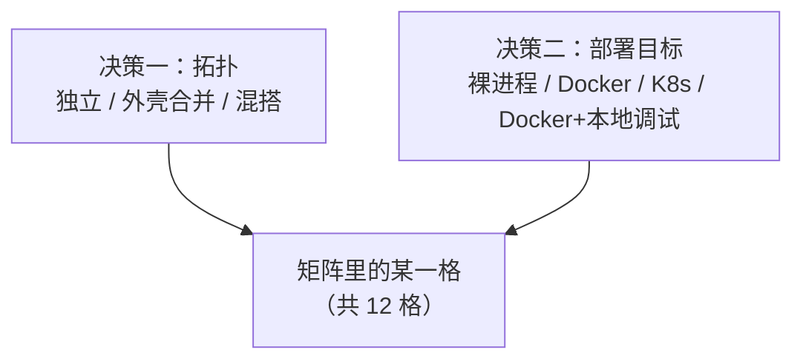

# 怎么选部署形态

> 前置阅读：先看[架构总览](../06-architecture/00-overview.md)——本文假定你已经理解版本化服务名与环境变量注入这两个机制。
>
> **这份文档只回答一个问题：一个有 N 个组件的真实项目，到底该跑成什么样、怎么跑。** 它不教你怎么造一个外壳（那是[外壳该怎么造才合格](07-shell-implementers-guide.md)），也不带你走一遍把某一个具体组件收编进壳的完整过程（那是[怎么声明 servedBy：部署方检查清单](06-servedby-deployment-checklist.md)）。如果你还没决定这个项目整体该长什么样，先看这一篇；决定完之后，另外两篇才是"具体怎么做"。

## 两个决策 + 一个开关

跑一个 brickKit 项目要做两个互相独立的决定，外加一个只有在前两个决定都定下来之后才有意义的、按组件粒度的开关：

**决定一：拓扑——你的组件最终收拢成几个容器？**

- **纯独立组件**——每个组件各自一个容器/Pod。什么都不多写，得到的就是这个形态——字面意义上的默认：不给某个组件写 `servedBy`，它就留在这一档。
- **纯外壳合并**（`servedBy`，AGENTS.zh.md §5.7）——尽量把能合并的组件都收编进少数几个外壳容器。
- **组件+外壳混搭**——一部分合并、一部分独立。实际场景里这通常是常态，不是妥协：有些组件**结构上**就没法合并（一个用 nginx 直接提供服务的纯前端，压根没有可以被收编的后端进程；一个无状态的网关型组件常常是故意保持独立，让它能按自己的曲线单独伸缩），跟资源宽不宽裕没关系。

**决定二：部署目标——`docker` 还是 `k8s`**（`brickkit.yaml` 里的 `deploy.target`，AGENTS.zh.md §5.5）。这几乎完全是一个基础设施问题，不是性能问题：你有没有 K8s 集群可以部署、需不需要跨机器的弹性伸缩和自愈能力？没有的话，`docker` 会在单机上用 `docker compose` 生成并驱动一切——运维上更简单，适合本地开发、演示，以及小规模或单点的生产部署。有的话，`k8s` 改成生成 Deployment/Service/Ingress——拓扑这条决定完全不受影响、原样适用，换目标只是改一个字段，不是重写（AGENTS.zh.md §5.5/§9.4）。

**开关——`local: true`（AGENTS.zh.md §5.6）：把一个或几个组件拉到宿主机变成可调试的进程，其余部分照常真实运行。** 这个开关**只在 `deploy.target: docker` 下存在**——`deploy.target: k8s` 时平台会在生成阶段直接拒绝（见下方矩阵后的旁注）。它能跟任意一种拓扑组合：一个 `local: true` 组件可以依赖一个普通独立组件、一个外壳，或者一个 `servedBy` 成员（这种情况下它的 `*_ENDPOINT` 会解析成 `localhost:<端口>`，走的是外壳自己的 compose service——具体机制见 servedby-deployment-checklist.md 的"声明之后，哪些事平台会自动帮你做好"）。它不能跟 `servedBy` 写在**同一个组件条目**上——`local: true` 和 `servedBy` 是两个互相矛盾的字段，因为它们各自声称的"这段代码到底跑在物理上的哪里"是相反的。

这两个决策是真正独立的两根轴——这才是它变成一张 3×4 矩阵、而不是几个预设名字可以简单列完的原因：



## 一个不被上面任何机制管辖、但真实存在的选项：手动跑起来

项目日常真实运作里还有第四种方式，值得直接说清楚，而不是含糊不提：没有任何东西阻止你把每个组件当成宿主机上的普通进程启动（`go run`、`uvicorn`，或者你的语言对应的那个东西），完全不碰 `brickkit.yaml`，也完全不经过 `brickkit up`。

**先把这件事的边界说清楚：这不是一种被平台管理、检查，甚至知晓的部署形态。** `brickkit up` 整套合同——依赖解析、环境变量注入、健康检查、迁移排序、服务发现——统统不会跑，因为你压根没调用它。这些事全部要靠你自己手工还原：每个进程听哪个端口你自己定，真实部署本该注入的每一条环境变量你自己算好喂进去，启动顺序也要自己保证不会因为某个依赖还没起来而崩掉。这不是 brickKit 特有的谨慎提示——它是 AGENTS.zh.md §2.2"没有一个长期运行的主系统服务"这条事实的直接推论：CLI 的合同只在你真正跑一条命令的那段时间里存在。

这仍然是完全正当、非常常见的一种工作方式——它通常是最快的开发循环（不用先构建镜像，IDE 断点直接挂上去），对一个还没有外壳的组件来说，这往往就是合并拓扑出现之前的日常默认。平台对这件事的沉默不代表平台在说它不存在，只是它是唯一一种完全活在 `brickkit.yaml` 描述范围之外的形态——所以这份文档该做的是在这里把它点名交代清楚,而不是塞进下面的矩阵里。

**有一个具体的技巧值得知道,正因为平台在这里帮不上别的忙：** 可以把 `brickkit up --dry-run` 当成一份"平台原本会注入什么"的参考答案,而不是真的照它部署。临时把你打算手动跑的那个组件改成 `local: true`,跑一次 `brickkit up --dry-run`,读它生成的 `local-debug.<版本化服务名>.env` 文件——那正是一次真实部署会喂给这个组件的完整环境变量集合(依赖地址、资源连接、你自己的 config)。抄下你需要的部分,然后把这次临时改动还原(`git checkout -- brickkit.yaml`)——你是在借 CLI 的手算一个答案,不是真的要用它部署。这个技巧覆盖不到两件事:一是手写字面量配置值(不是平台算出来的地址,比如一个 `http://host.docker.internal:...` 形状的地址)本来就假设了容器网络,裸进程下同样需要手动纠正成 `localhost`,跟 `local: true` 本身遇到的限制一样(AGENTS.zh.md §5.6);二是如果你想预览的这个组件本身就是一个 `servedBy` 成员,它没有属于自己的独立端口或环境可以这样预览——要看的应该是它所在外壳那条条目。

## 矩阵

|  | 裸进程 | Docker | K8s | Docker+本地调试 |
| --- | --- | --- | --- | --- |
| **纯独立组件** | [外壳出现之前，日常开发的起点](#1-纯独立组件--裸进程) | [组件数量单机完全装得下时的标准形态](#2-纯独立组件--docker) | [云原生谱系里资源最充裕的一端](#3-纯独立组件--k8s) | [调试一个组件，其余部分保持真实](#4-纯独立组件--docker本地调试) |
| **纯外壳合并（`servedBy`）** | [脱离编排层单独测外壳自己的内部编排](#5-纯外壳合并--裸进程) | [纯独立装不下之后，用来解决内存底线问题](#6-纯外壳合并--docker) | [云原生谱系里最紧的一端](#7-纯外壳合并--k8s) | [调试一个组件，合并进壳的其余部分保持真实](#8-纯外壳合并--docker本地调试) |
| **组件+外壳混搭** | [项目真实拓扑已经用上外壳之后，日常开发的默认](#9-混搭--裸进程) | [大多数真实项目最终会落到的结构性形态](#10-混搭--docker) | [云原生谱系的中间点](#11-混搭--k8s) | [整份指南里最贴近真实开发场景的组合](#12-混搭--docker本地调试) |

矩阵故意没有第 13 格"K8s+本地调试"。`local: true` 一旦碰上 `deploy.target: k8s`，会在生成阶段直接拒绝——不是警告，也不是先生成一份有问题的清单再等到之后才失败。CLI 自己的报错会点名具体是哪个组件，理由讲的是物理约束：集群里的 Pod 访问不到开发者自己机器上跑着的进程。这不是这份文档绕不开的一个缺口，是平台从一开始就不让这个组合以一份可部署配置的形式存在。

### 1. 纯独立组件 × 裸进程

**这是什么：** 你手头要用到的每个组件都是宿主机上的普通进程——`go run`、`uvicorn`，或者你的语言对应的那个东西——没有 Docker 容器、没有 K8s Pod，`brickkit.yaml` 里也没有任何一条条目描述这次部署。每个进程听哪个端口你自己定，真实部署本该注入的每一条环境变量（依赖地址、资源连接、你自己的 config）你自己拼好喂进去。

**什么时候用：** 单组件开发最常见的起点，尤其是项目里还没出现任何外壳的阶段。只要你想要最快的改代码-看效果循环、不需要真的用上平台自己那套生成/注入机制，这就是对的选择。

**好处：**
- 迭代速度最快——改代码和看到效果之间没有构建镜像这一步，IDE 调试器直接挂到真实进程上。
- 排查问题时心智负担最低——"这个进程"和"它连的那个地址"之间没有容器层、没有编排层。出问题只有两个变量要查。
- 完全不需要装 Docker 或 K8s 集群。

**代价 / 局限：**
- 完全不是一种被平台管理的形态：没有依赖注入、没有健康检查、没有服务发现、没有迁移排序。这些事情要么根本不会发生，要么你得为你手动跑的这几个组件自己一件件还原出来。
- 手写字面量配置值如果假设了容器网络（比如一个 `http://host.docker.internal:...` 形状的地址），裸进程下解析不出来，需要你自己改成 `localhost`——跟下面本地调试叠加需要的纠正是同一件事、同一个原因。
- 撑不住太多组件——一次手动拼十几个组件各自的环境变量,是真实存在的、繁琐又容易出错的体力活。

**值得知道的事：**
- 可以借平台的手算一个答案,而不是真的部署:把这个组件临时改成 `local: true`,跑一次 `brickkit up --dry-run`,读生成的 `local-debug.<版本化服务名>.env`——那正是一次真实部署会喂给这个组件的完整环境变量集合。抄完需要的部分,再把这次改动还原（`git checkout -- brickkit.yaml`）。
- 如果你想这样预览的组件本身就是一个 `servedBy` 成员,它没有属于自己的独立端口或环境可以这样看——你看到的会是它所在外壳那条条目,混着其它全部被收编成员的数据。

### 2. 纯独立组件 × Docker

**这是什么：** 每个组件各自生成一个独立的 Docker Compose 服务,由 `brickkit up` 端到端驱动——网络别名（DNS 解析每个版本化服务名）、环境变量注入（依赖地址、资源连接、你自己的 config）、健康检查、拓扑启动顺序、以及任何声明好的迁移,全部不需要手工介入。

**什么时候用：** 组件数量单机完全装得下这个阶段的默认形态。"装得下"是个真实的数字,不是感觉:每个跑着的进程都有一个几乎完全由语言运行时决定的内存底线——Go/Rust 8–20MB,Python/Node 40–90MB,JVM 200–450MB。20 个空闲的 Go 组件加起来连半个 G 都不到；20 个空闲的 Spring Boot 组件,一个单位的活都还没干,就已经是 4–9G。留在这一档——这覆盖项目早期、大多数演示、大多数小规模本地化交付——直到这笔账真的在你要部署的机器上算不过来,才值得把一部分或全部组件合并进外壳。

**好处：**
- 最贴合平台核心设计铁律的形态：每个组件都能独立 `brickkit up`,爆炸半径正好是一——重启或升级一个组件永远不会碰到另一个。
- 地址注入、健康检查、启动顺序完全不需要手工关注——平台的生成逻辑单靠 Manifest 就能全部推算出来。
- 排查问题在这里最简单：一个组件对应一个容器、一份日志、一个健康状态,没有任何共享的东西要考虑。

**代价 / 局限：**
- 每个组件独立承担自己那份运行时内存底线——这正是把组件合并进外壳这件事存在的直接原因,组件数量涨起来之后才需要绕开这个代价。
- 结构上就是单机形态——不需要 K8s 集群,但也拿不到 K8s 跨机器调度和自愈的任何好处。

**值得知道的事：**
- 在假设"装不下了"之前,先量一遍真实占用（`docker stats` 看实际在跑的东西）,别照着表拍数字——一个 50 组件的项目本地可能只跑几个容器,因为大部分组件这次部署根本没 `enabled`。
- `expose: true` 在 Docker 下直接把组件端口映射到宿主机,可以用 `exposePort` 自定义；端口撞车时 CLI 会报错,不会悄悄选一个别的端口。

### 3. 纯独立组件 × K8s

**这是什么：** 每个组件变成自己的 Kubernetes Deployment + Service；`brickkit up --context <集群>` 对接真实集群,每一条依赖地址都靠原生的 K8s Service + CoreDNS 解析——没有独立的注册表,没有轮询式的健康检查器,只有集群自己的原生机制。

**什么时候用：** 这份指南里"纯外壳合并上 K8s"、"混搭上 K8s"也共享的三点资源谱系里,资源最充裕的一端。当集群资源已经宽裕到不需要再用颗粒度换更低的内存底线时选它：每个组件保留自己独立可调的副本数、自己的 `resources.requests`/`limits`,不会被别的组件的负载抢占同一个容器的配额。

**好处：**
- 真正的独立水平伸缩——一个组件负载高了就多给它几个副本,完全不影响任何别的组件的资源配置。
- 跨机器调度和故障恢复是 K8s 原生行为,而且是逐组件独立生效的。
- 跟纯独立组件跑 Docker 一样的爆炸半径为一,只是这次背后是一整个集群,不是单台机器。

**代价 / 局限：**
- 这一行里运维复杂度最高的一格——需要真正的集群管理能力,不只是"装个 Docker"。
- `kubectl` 必须在执行 `brickkit up` 的机器上单独装好——CLI 是真的去 `PATH` 里找一个叫 `kubectl` 的二进制来调用,找不到就直接按名字报错;它不会用类似 `minikube kubectl --` 的方式代替它。
- 组件数量还是意味着 Deployment/Service 对象数量——想压下去要靠合并进外壳,不是靠这一格本身。

**值得知道的事：**
- `deploy.target: k8s` 下 `expose: true` 必须配 `hostname`——Docker 专属的 `exposePort` 在这里什么都不做,因为 K8s 是靠 Ingress + 域名路由对外暴露,不是映射宿主机端口。漏配的话 `brickkit up --dry-run` 在生成阶段就会拦下来,不会等到真的部署才失败。
- 假设了单机 Docker 网络的资源地址字面量（比如 `host.docker.internal`）需要换成 K8s 场景对应的地址（比如 minikube 下的 `host.minikube.internal`）——换编排器不会帮你自动改写手写字面量。

### 4. 纯独立组件 × Docker+本地调试

**这是什么：** 除了你标了 `local: true` 的那一个（或几个）组件之外,整套拓扑都是真实 Docker 容器——那几个组件转而以宿主机上的普通进程运行。平台这里不是做字面量替换：它给*其它每一个*容器改写 `extra_hosts`,让这个组件的版本化服务名在它们的网络里解析到 `host-gateway`（也就是你的机器）——调用方拿到的地址字符串形状完全不变,变的只是这个名字实际解析到哪里。

**什么时候用：** 当你同时需要两件本来互相冲突的事情时——"系统其余部分是真实的"（真实容器、真实健康检查、真实地址注入）和"改这一个组件的代码不想为它重新构建镜像"。它纯粹是开发期的叠加手段；它本身从不决定你的生产拓扑是纯独立、纯外壳还是混搭,开关它也不会改变这件事。

**好处：**
- 零组件代码改动——不管是不是 `local: true`,组件读环境变量的方式完全一样。
- 可以同时本地调试好几个组件,各自用自己的 `localPort`,不影响拓扑其余部分。
- 一个 `local: true` 组件依赖的一切仍然拿到真实、平台生成的地址——不像全部裸进程跑起来那样,你不需要手工模拟任何东西。

**代价 / 局限：**
- 需要你真的理解 `extra_hosts` 这套机制——地址"连不上"时,通常该问的是"这个名字解析到了我的机器还是某个容器",不是一般意义上的网络问题。
- 手写的、假设了容器网络的配置字面量（同样是 `http://host.docker.internal:...` 这类值）同样不会被这套机制改写——brickKit 从不解析 config 字符串的内容,所以切成 `local: true` 不会让它自动改指向；要改也是你自己动手,通常改成 `localhost`。
- `local: true` 组件不会拿到属于自己的迁移容器——如果它的 schema 还没到最新,你要自己手动跑一次它的迁移。

**值得知道的事：**
- CLI 给每个 `local: true` 组件生成一份 `local-debug.<版本化服务名>.env` 供 IDE 加载（`set -a && source ... && set +a`）；里面多行或含特殊字符的值都做了 shell 转义,一份多行 PEM 密钥或一份 `|` 分隔的列表能完整存活,不会被截断或解析出错。
- `local: true` 和 `servedBy` 永远不能写在同一个组件条目上——它们对"这段代码物理上到底跑在哪"给出的是相反的说法,平台会拒绝同时声明两者。

### 5. 纯外壳合并 × 裸进程

**这是什么：** 外壳自己的二进制直接以宿主机进程形态启动,不经过任何编排层——你测的是外壳自己的多模块编排逻辑,不是在部署什么。这里也没有任何平台会注入 `BRICKKIT_SERVED_MEMBERS`/`BRICKKIT_SERVED_MEMBERS_CONFIG`；跑这个的人要手工拼出（或者为了测试直接写死）这份数据,跟裸进程跑一个普通组件时要手工拼出它的环境是同一个道理。

**什么时候用：** 几乎不是普通壳的使用者会需要的一格——它是专门给正在*造壳或测壳*的人用的：在完全脱离容器/K8s 层的情况下,独立验证外壳自己的启动顺序（哪些被收编的模块要初始化、按什么顺序、迁移之间的先后关系对不对）、健康检查行为、模块之间的故障隔离,然后再放心交给真实的 Docker 或 K8s 部署去用。

**好处：**
- 外壳内部开发最快的迭代循环——没有构建镜像这一步,调试器直接挂到外壳自己的进程上。
- 能把"这是外壳编排逻辑本身的 bug"和"这是容器/编排层的问题"彻底分开,因为这里压根没有编排层可以怀疑。

**代价 / 局限：**
- 平台自己的任何保证在这里都不存在——这一格只能证明外壳内部逻辑在你自己拼的数据下表现正确,不能证明它真部署之后会拿到正确的数据。
- 外壳作者要完全自己想清楚一份真实的 `BRICKKIT_SERVED_MEMBERS`/`BRICKKIT_SERVED_MEMBERS_CONFIG` 长什么样——[外壳该怎么造才合格](07-shell-implementers-guide.md)里有两者精确的字段形状。

**值得知道的事：**
- 外壳编译进去的模块注册表,必须按完整的版本化服务名（`mdm-customer-1-0-7`,不是裸组件 ID `mdm-customer`）做键,才能在真实的合并部署（Docker 或 K8s）下正确收编同一组件的两个版本——这个坑要真的同时喂两个版本进去才会暴露,哪怕在这个孤立的一格里,也值得故意练一遍。

### 6. 纯外壳合并 × Docker

**这是什么：** 尽量多能合并的组件被收编进少数几个外壳容器；`brickkit up` 给每个外壳生成一个 Compose 服务,被收编的成员一个都不生成——调用方对一个被收编成员的 `*_ENDPOINT`,直接解析到外壳自己的地址和端口,调用方那一侧完全不需要改代码。

**什么时候用：** 当"纯独立组件跑 Docker"那笔账（每个独立组件各付自己那份运行时内存底线）在你要部署的机器上真的算不过来的时候——不要提前用。在动它之前先试便宜的选项：给贵的组件换一个更轻的运行时（一个 JVM 组件编成 GraalVM 原生镜像,内存底线从 200–450MB 掉到几十 MB,部署形态完全不变）,再确认这次部署里拉高数字的组件是不是已经能靠 `enabled: false` 关掉。只有这些便宜的选项都用不上、内存经济账对这一组具体组件确实划算时,合并才是对的选择。

**好处：**
- 核心价值：一个外壳容器只背一份 Web 框架运行时底线、一份连接池,不是 N 份——这才是真正把总内存底线压下去的地方。
- 容器少了,整体启动更快,日常运维要盯的东西也更少——更少的日志要看,更少的东西要重启。
- 写在被收编成员自己条目上的 `expose`/`exposePort`/`resources` 等字段只是被忽略、给个警告,不是硬报错——迁移一个组件进壳时忘了删这些字段,不会悄悄炸掉什么。

**代价 / 局限：**
- 爆炸半径不再是"一个组件"：共用一个壳的组件共享故障域（一个 panic 可能拖垮其它模块,除非壳造得足够小心）,也共享伸缩单元（没法单独调大某一个被收编成员的副本数）。
- 壳不会给任何被收编成员生成属于自己的迁移容器——每个成员的迁移,按正确的先后顺序,要靠壳自己的启动代码手工跑。
- 壳声明的版本号跟它镜像里实际编译进去的内容是不是真的对得上,没有任何平台机制能从外部验证——这是造壳、发布壳的人自己永久的纪律问题。

**值得知道的事：**
- 壳本身是配置里一条普通的 `components:` 条目,有自己的 `id`、`version`、镜像、`deployment.port`、`healthCheck`——`servedBy` 指向的是*这条条目*,不是某种特殊的容器类型。
- 被收编进同一个壳的两个成员,永远不能通过这个壳依赖第三个共享组件的两个不同精确版本——合并会需要同一个 `*_ENDPOINT` 变量同时代表两个不同地址,平台会直接拒绝生成,不会悄悄替你选一个。

### 7. 纯外壳合并 × K8s

**这是什么：** 跟上面"纯外壳合并 × Docker"同样的合并方式,换成对接真实集群：每个壳是一个 Deployment,每个被收编的成员各自拿到一个 Service,`selector` 指向壳的 Pod、`targetPort` 用成员自己声明的端口——不为成员本身生成任何 Deployment 或迁移 Job。

**什么时候用：** 云原生资源谱系里最紧的一端,跟"纯独立组件上 K8s"（资源充裕,不合并）、"混搭上 K8s"（资源适中,合并大部分）构成同一条谱系。当集群资源真的紧张、把整体开销压到最低比给某个被收编组件单独伸缩更重要时,选它。

**好处：**
- 同一次部署里同时拿到"合并省内存底线"和"K8s 自己的自愈/跨机器调度"两边的好处,不需要二选一。
- NetworkPolicy 的 ingress/egress 规则（如果配置了）会自动把被收编成员自己的调用方和依赖方带进壳的规则里——不会因为壳现在多收编了一个组件,就要你单独补一条规则。

**代价 / 局限：**
- "纯外壳合并 × Docker"的每一条代价（共享故障域、共享伸缩单元、手工编排的迁移顺序）原样成立——换了目标不会让合并变得更便宜。
- "纯独立组件 × K8s"的每一条 K8s 专属代价也原样成立：需要真正的集群管理能力、`kubectl` 要单独装、暴露要用 `hostname` 不是 `exposePort`——合并组件不会降低 K8s 本身的要求。

**值得知道的事：**
- K8s 下没有 Docker 那种 `depends_on`,但等价的替换照样发生：一条原本指向 `servedBy` 成员的依赖边,在两种目标下都会自动改成指向壳。
- 资源绑定校验把一个成员自己 `dependencies.resources` 声明的依赖,视为已经满足——只要*壳*自己的 componentId 绑定了同一个 `kind`+`engine` 的资源,不需要在成员自己的 componentId 下重复写一份来满足校验。

### 8. 纯外壳合并 × Docker+本地调试

**这是什么：** 跟上面"纯独立组件 × Docker+本地调试"一样的 `local: true` 叠加,只是这次真实运行的"拓扑其余部分"是一个或多个外壳,不是独立容器。用这种方式拉出来调试的组件,可以像依赖任何普通组件一样依赖一个 `servedBy` 成员：它的 `*_ENDPOINT` 会解析成一个真实、宿主机可达的 `localhost:<端口>`——CLI 把这条映射开在*外壳自己*的 Compose service 上（成员没有自己的可以开）,用的是成员自己声明的端口,正是壳本来就必须监听的那个端口。

**什么时候用：** 你正在改动并验证的这一个组件,要么本来就不在任何壳里,要么被你临时从某个壳里拿出来调试——同时你想让它跟当前真实的、已经合并的拓扑其余部分（包括壳内部的东西）对话,又不想重新构建任何镜像。

**好处：**
- 一个容易被误以为不通的方向——`local: true` 组件反过来*伸进*一个壳去访问某个被收编成员——完全支持,不需要你额外知道这个成员具体活在哪个壳里。
- 拓扑其余部分（别的壳、别的独立容器）保持完整真实性,跟独立组件那一档一样。

**代价 / 局限：**
- 没法用这种方式把一个本身就被外壳收编的成员单独拉出来——它没有独立容器可以变成；调试壳内部的代码,只能在壳自己的进程里调,或者临时去掉它的 `servedBy`、临时还给它一个独立容器。
- 独立组件那一档的每条局限（手写字面量不会自动改写、`local: true` 组件没有属于自己的迁移容器）原样适用。

**值得知道的事：**
- 这条映射的前提是壳本来就被要求监听被收编成员的声明端口——这一点平台在生成阶段就会替你校验（端口撞车会让 `brickkit up` 直接失败,不会悄悄路由错）。
- 反方向——一个普通容器依赖某个被你标成 `local: true` 的组件——同样开箱可用,走的是上面描述的同一套 `extra_hosts` 机制；两个方向里没有哪一个是"特例"。

### 9. 混搭 × 裸进程

**这是什么：** 不管是独立部署还是被外壳收编,只要是你这次真正需要用到的组件,都按各自的注意事项——独立组件按"纯独立组件裸进程"、外壳形状的按"纯外壳裸进程"——以宿主机进程形态跑起来。

**什么时候用：** 一旦项目真实的生产拓扑已经用上了至少一个外壳,这就是日常本地开发的默认状态。不用为改一个组件把整套拓扑搭起来——只按各自真实的部署形态,起你需要改动的那几个组件,本地跑出来的结果依然反映真实部署会用到的地址解析和跨进程调用,因为你没有在模拟一套跟生产不一样的拓扑。

**好处：**
- 项目规模过了"全部独立"这个阶段之后,依然保留裸进程那种快速的迭代循环。
- 因为你是刻意按每个组件*真实*的形状（独立还是外壳形状）去还原,而不是永远当成独立组件处理,能在本地就撞上形状相关的 bug（比如壳的模块注册表键错了）,而不是等到真实部署才发现。

**代价 / 局限：**
- 这份指南里手工准备工作最重的一格——要为混着两种不同形状的拓扑手工还原环境数据,不只是一种形状。
- 没有任何东西检查你手工搭的"谁在哪儿"是不是真的跟真实 `brickkit.yaml` 对得上——这份一致性完全靠你自己保证。

**值得知道的事：**
- 前面那个"`local: true` + `--dry-run` 抄作业"的技巧,对一个独立组件在这里同样管用；对一个在生产里真的是外壳形状的组件,没有等价的捷径——你要么手工拼出它的 `BRICKKIT_SERVED_MEMBERS` 形状的数据,要么干脆跳过建模这一部分,只跑你真正需要验证的那段业务逻辑。

### 10. 混搭 × Docker

**这是什么：** 一部分组件是独立的 Docker 容器,一部分被收编进一个或多个外壳——`brickkit up` 一次性生成并驱动整套混合拓扑,不需要任何额外参数:谁去哪儿,完全从每个组件自己在 `brickkit.yaml` 里有没有 `servedBy` 声明读出来。

**什么时候用：** 这通常是一个真实、成熟的项目最终会落到的形态——而且值得说清楚,这通常是*结构性*的形态,不是"全部独立"和"全部合并进壳"之间的资源折中。有些组件不管拓扑其余部分资源多宽裕,本来就不该合并、也没法合并：一个用 nginx 之类提供服务的纯前端,压根没有可以被收编的后端进程；一个无状态的网关型组件,常常是故意保持独立,让它能按自己的曲线单独伸缩,不受壳内部发生什么的影响。如果你在犹豫一次典型的本地化交付该选哪个组合,这通常就是正确答案。

**好处：**
- 在结构上真正需要独立的地方拿到纯独立组件的独立性,在其余地方拿到纯外壳合并的省内存——同一次部署里两者都要,不需要为整个项目二选一。
- 混合两种形状不需要 `brickkit.yaml` 里任何特殊处理——独立组件的条目长得跟普通独立条目一样,合并的条目长得跟普通 `servedBy` 条目一样,并排写在同一份文件里。

**代价 / 局限：**
- 这一行三个 Docker 目标格子里认知负担最重的一个：排查问题要同时держ两套心智模型——合并的组件要想"这个成员到底在哪个壳里",独立的组件按普通逐容器方式推理。
- 合并专属的每条代价对合并的一半原样成立,独立专属的每条代价对独立的一半原样成立——混搭不会把代价平均掉,只是让你能刻意分配它们。

**值得知道的事：**
- 一个老的、仍然独立部署的版本,和同一个组件 ID 新的、合并进壳的版本,可以在调用方之间零协调地共存——这不是混搭拓扑专属的机制,是版本化服务名本来就该有的推论（见下面"贯穿全部 12 格的一条共同结论"）。
- 把一个原本独立部署的组件迁进壳里,正是它的 `resources:` 块（以及 `expose`/`exposePort`/`replicas` 等）悄悄失效的那一刻——这些字段要挪到壳自己的条目上,不然壳就会在你以为继承过来的配额之外悄悄跑起来。

### 11. 混搭 × K8s

**这是什么：** 跟上面"混搭 × Docker"同样的混合拓扑,对接真实集群：独立组件各自拿到自己的 Deployment + Service,被收编的拿到一个指向所在壳 Pod 的 Service,不生成自己的 Deployment 或迁移 Job——从同一批 `servedBy` 声明一次性生成,混搭本身不需要任何额外配置。

**什么时候用：** 云原生资源谱系的中间点,在"纯外壳合并 × K8s"（资源紧张,尽量合并）和"纯独立组件 × K8s"（资源充裕,完全不合并）之间——集群资源不紧张也不算特别充裕时用它:大部分组件留在壳里压住总开销,只把真正需要独立副本数或资源配额的那几个挑出来,刻意单独部署。跟上面 Docker 版本那种结构性混搭不同,这里的混搭决定常常是资源调优决定——一个本来完全可以合并的组件,在这里可能就是因为需要单独伸缩而被主动拆出来独立部署,即使结构上完全没有阻碍它合并。

**好处：**
- 单一格子里资源配置的灵活度最高——任何一个组件都能按自己真实的负载曲线,落在谱系上合适的那一点,不用逼整个项目走一个极端。
- 地址解析、NetworkPolicy、资源绑定校验这些机制原生就处理混搭,不需要在普通 `servedBy` 声明之外配任何"混合模式"。

**代价 / 局限：**
- 同时背上纯独立组件那份完整的 K8s 运维代价和纯外壳合并那份完整的合并代价——混搭不会让任何一边变便宜。
- 出问题时要考虑的活动部件最多：这个组件是独立还是合并的,问题出在 K8s 本身、壳内部编排,还是普通容器——混搭意味着三种可能都要查,不能预设是哪一种。

**值得知道的事：**
- "纯独立组件 × K8s"的每条注意事项（`expose` 要配 `hostname`、`kubectl` 单独装）适用于这次部署里独立的那部分组件；"纯外壳合并 × K8s"的每条注意事项（共享故障域、壳内部手工编排迁移顺序）适用于合并的那部分——排查一个混搭部署、还不确定问题在哪一半时,两份都值得翻一下。

### 12. 混搭 × Docker+本地调试

**这是什么：** 一个真实的混合拓扑（独立组件和外壳并存）跑在 Docker 里,再用 `local: true` 拉出一个组件做实时调试——整份指南里最贴近真实开发场景的组合,因为"系统其余部分"就是项目真实的生产形状本身,不是一个简化过的替身。

**什么时候用：** 你正在改动并验证的这一个组件,要对照的是项目真实生产会用的那套混合拓扑——通常你拉出来调试的是那些结构性独立的组件（前端、网关这一类),因为一个被外壳收编的成员,跟前面纯外壳合并那一档描述的一样,同样没法用这种方式单独拉出来。

**好处：**
- 在不真的碰生产环境的前提下,最接近"对着生产调试"的体验——不管是独立组件还是合并进壳的组件,其余每一个都跟真实情况下表现完全一样。
- 不管对面是哪一类组件,两个方向的地址解析都能用：你的 `local: true` 组件可以依赖一个独立容器或者一个壳成员,一个独立容器或者壳也能反过来依赖你的 `local: true` 组件——走的都是前面描述的同一套 `extra_hosts` 机制。

**代价 / 局限：**
- 需要同时理解这份指南讲到的全部机制：外壳合并、`local: true` 的 `extra_hosts` 技巧、普通独立容器的行为——这里没有更简单的心智模型可以退回去用。
- 跟前面纯外壳合并那一档一样的硬边界：没法用这种方式把一个被外壳收编的成员单独拉出来调试。

**值得知道的事：**
- 这一格不会因为合并组件和独立组件的比例变化而改变——拉出一个组件、其余全部真实,就是全部机制本身,跟"其余部分"内部具体怎么组织无关。

## 贯穿全部 12 格的一条共同结论:多版本共存不用额外操心

上面十二格里没有一格会改变同一组件多个版本共存的行为——这不是这份矩阵需要额外开一条维度去覆盖的变量,因为版本化服务名（AGENTS.zh.md §5.1）本来就让版本共存这件事跟拓扑、跟部署目标都无关:一个老调用方和一个新调用方、一个独立部署的版本和一个合并进壳的版本、或者被收编进同一个壳的两个不同精确版本,都可以在同一次部署里零协调地共存——平台侧从不检查老调用方和新依赖方（或反过来）之间是不是真的能正确协作,守住这份契约兼容性完全是组件作者自己的责任,这是刻意的设计（AGENTS.zh.md §9.2/§9.3）。造壳指南的["多版本共存、部署形态还能不一样"](07-shell-implementers-guide.md#多版本共存部署形态还能不一样)已经把具体场景、以及唯一一个真实存在的语言级坑（Go 的构建系统在不采用语义化导入版本的前提下没法把同一个模块路径的两个版本静态链进一个二进制）讲透了,这里不重复——因为不管你实际部署在上面哪一格,这部分内容都完全一样。

## 决定之后去哪看

- 有组件要合并进外壳:每往一个壳里路由一个组件,看一遍[怎么声明 servedBy：部署方检查清单](06-servedby-deployment-checklist.md)；如果你是造那个壳的人,再看[外壳该怎么造才合格](07-shell-implementers-guide.md)。
- 目标是 K8s:[`brickkit up --context <集群>`](../06-architecture/09-cli-reference.md#brickkit-up)；想看清楚同一份 Manifest 在两种目标下到底各自生成出什么,看[真实生成的 Docker Compose 与 Kubernetes 文件对照](../06-architecture/03-deployment-generation.md)。
- 多环境（比如默认配置之外再有一份 `brickkit.prod.yaml`）:每一份都是完全自包含的——`brickkit up --config brickkit.prod.yaml`——彼此之间没有覆盖或继承关系（AGENTS.zh.md §9.9）。

### 对比两份环境配置

因为每份环境配置都是完全自包含的，对比两份配置用不着任何专门命令——两次普通的 `diff` 就够了：

1. `diff -u brickkit.dev.yaml brickkit.prod.yaml` 看**你写了什么不同**。
2. `diff <(brickkit up --dry-run --config brickkit.dev.yaml 2>&1 | grep -v '^{') <(brickkit up --dry-run --config brickkit.prod.yaml 2>&1 | grep -v '^{')` 看**这些不同带来的后果**——哪些组件因此不启动、为什么。

下面是真实输出：项目里 `acme/web` 依赖 `erp/backend`，`brickkit.prod.yaml` 把 `deploy.target` 改成了 `k8s`、并且关掉了 `erp/backend`：

```
$ diff -u brickkit.dev.yaml brickkit.prod.yaml
--- brickkit.dev.yaml
+++ brickkit.prod.yaml
@@ -3,7 +3,7 @@
 project: shop

 deploy:
-  target: docker # docker | k8s
+  target: k8s # docker | k8s

 # sources: ...
 components:
   - id: erp/backend
     version: 0.1.0
+    enabled: false
   - id: acme/web
     version: 0.1.0
 resources: []
```

```
$ diff <(brickkit up --dry-run --config brickkit.dev.yaml 2>&1 | grep -v '^{') \
       <(brickkit up --dry-run --config brickkit.prod.yaml 2>&1 | grep -v '^{')
1c1
< 🚀 启动项目 shop（deploy.target: docker）
---
> 🚀 启动项目 shop（deploy.target: k8s）
3,4c3,4
<    ✅ erp/backend@0.1.0  启动（acme/web 需要）
<    ✅ acme/web@0.1.0     启动（顶层）
---
>    ⬜ erp/backend@0.1.0  显式禁用（enabled: false）
>    ⬜ acme/web@0.1.0     不启动（强依赖 erp/backend 不启动）
6,18c6,10
< 📋 启动顺序（拓扑排序）：
<    1. erp-backend-0-1-0  无依赖
<    2. acme-web-0-1-0     ← 依赖 1
<
< 可独立启动：erp-backend-0-1-0（无依赖）
< 最长依赖链（2 层）：erp-backend-0-1-0 → acme-web-0-1-0
<
< 依赖图：
<    acme/web@0.1.0 → erp/backend@0.1.0
< 📄 已生成：.brickkit/generated/docker-compose.yaml
<
< 💡 --dry-run 只生成文件，未启动任何组件
<    查看：cat .brickkit/generated/docker-compose.yaml
---
> 📋 本次没有组件会启动
>    顶层组件（没有别的组件依赖它们）这次都不跑：
>       acme/web@0.1.0  不启动（强依赖 erp/backend 不启动）
>    顶层自己都没被关掉——要放开的是上面那行理由里点名的组件
> 💡 有 2 个组件本次不启动，brickkit sync 可以把它们的源码收进 components/.archived/
```

第二条 `diff` 直接看到的是后果本身，而不只是那一行导致后果的配置：不是只有 `erp/backend` 不启动，`acme/web` 也跟着不启动，那一行还点了名：`不启动（强依赖 erp/backend 不启动）`。只看第一条 `diff`（某个组件多了一行 `enabled: false`）是推不出这个后果的。

两点提醒，都是实测出来的：

- `--dry-run` 每次都会覆盖 `.brickkit/generated/`，想留下某一份环境生成出来的文件，就把那份配置的 `up --dry-run` 放到最后跑。
- `grep -v '^{'` 是为了滤掉 CLI 写在 stderr 上的 JSON 日志行——不滤掉的话，它们会跟上面人读的输出混在一起，`diff` 出来一堆噪音。

一句诚实的话：这里比的只是**启动决策**——哪些组件会跑、为什么——比的是文本，不是渲染出来的部署文件本身；dev 是 `docker`、prod 是 `k8s` 时，两边本来就不是同一种东西（一份 `docker-compose.yaml` 对一组 Kubernetes 清单），没法比。这里没有一个专门对比生成的部署文件的命令，这是有意的暂缓，不是遗漏。
