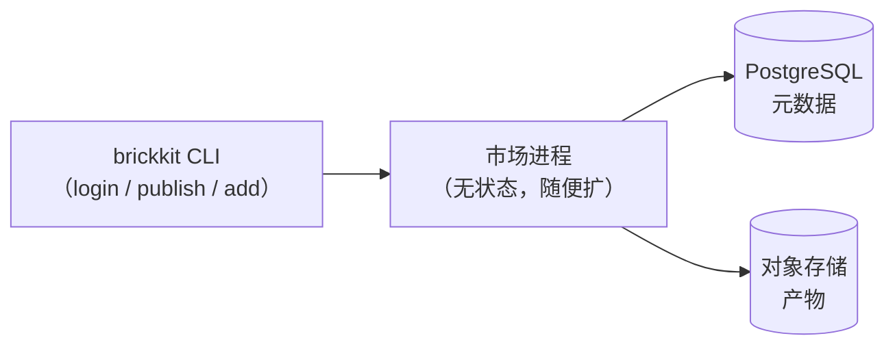

# 自己搭一套 BrickKit Market

这篇讲的是部署**组件市场**——那个独立的 SaaS 服务，负责回答"有什么可以装、
谁有权装"（AGENTS.zh.md §5.9）。这跟部署**你自己拼装出来的项目**（用
`brickkit` 装好组件之后跑起来的那套业务系统）完全是两件事，后者由平台自己
的 `deploy.target: docker | k8s` 覆盖（AGENTS.zh.md §5.5），不需要单独的文
档——那就是一句 `brickkit up`。市场是由某个团队或公司的运维**部署一次**；
项目是**每个使用者、每个项目部署一次**。

## 三种跑法，同一个镜像

| 模式 | 跑在哪 | 适合谁 | 数据在哪 |
| --- | --- | --- | --- |
| 本地开发 | 自己的笔记本 | 试用平台、开发市场本身、离线演示 | 本机目录 |
| 单机自托管 | 内网一台服务器 | 大多数团队——私有组件不出内网 | 那台机器的磁盘 |
| 云端 | 云主机/容器平台 + 托管数据库 + 对象存储 | 多地协作、需要高可用 | 云端托管 |

三种模式跑的是**同一个镜像、同一套配置项**，唯一的区别是 PostgreSQL 和对
象存储是自己起的容器，还是指向托管服务。市场进程本身不存状态——元数据在
PostgreSQL，产物在对象存储，所以它可以随时重建、随时横向扩容，不用担心丢
东西。



## 把单机部署跑起来

编排文件已经在仓库里：`deploy/market/docker-compose.yaml`，配套的
`deploy/market/.env.example`——直接复制两份，不要手抄：

```bash
cd deploy/market
cp .env.example .env
vi .env                      # 至少要改掉 POSTGRES_PASSWORD / RUSTFS_SECRET_KEY / ADMIN_PASSWORD
chmod 600 .env

docker compose up -d --build   # 首次会从源码构建市场镜像
```

或者用仓库根目录的快捷方式：`make market-up` / `make market-logs` /
`make market-down`（`down` 会保留数据）。

起来之后是四个服务，其中两个是踩过真实的坑之后专门加的，别删：

| 服务 | 作用 | 是否对外暴露 |
| --- | --- | --- |
| `postgres` | 元数据：组件、版本、用户、访问策略 | 否——只在 compose 内网可见 |
| `rustfs-init` | 一次性容器，在真正的 RustFS 起来之前把 `./data/rustfs` 的属主改成 10001。**不加这个，RustFS 会反复 `Permission denied (os error 13)` 崩溃重启**——它在容器内以非 root 身份运行，而 bind mount 出来的目录默认属 root | 否——跑完就退出 |
| `rustfs` | S3 兼容对象存储，存产物（proto 文件、OpenAPI 规范、SDK）。可以换成任何 S3 兼容服务，市场只依赖 S3 协议本身 | 只有 Console 可选暴露 |
| `market-api` | 市场本体。健康检查通过 `wget --spider` 发一个 `HEAD`；`start_period: 30s` 给首次启动建表建桶留足时间 | 是，走 `MARKET_PORT` |

没有单独的 bucket 初始化步骤——建表、建桶、引导管理员账号这三件事都在启动
时自动完成，而且都是幂等的，重启永远安全。

**第一次 `up` 之前先把镜像准备好。** `.env.example` 里的 `MARKET_IMAGE`
默认是 `brickkit/market-server:dev`——纯本地标签，任何公共仓库里都没有这
个镜像。在一台干净机器上不先构建直接 `docker compose up -d`，会得到
`pull access denied`。两条路：

- **从源码构建（自己用最省事）：** 要在**仓库根目录**执行构建，不是在你复
  制编排文件去的那个目录——编排文件的 `build.context`
  （`../../market-server`）是相对于**编排文件自身位置**的路径，复制到别
  处之后这条相对路径就不成立了。
  ```bash
  docker build -t brickkit/market-server:dev --build-arg VERSION=dev market-server/
  ```
- **推到自己的镜像仓库（部署到不止一台机器时用这条）：** 用真实版本号构
  建、推上去，把 `MARKET_IMAGE` 指向那个地址。`:dev` 这种可变标签在两台机
  器上可能悄悄指向两个不同的镜像——超过一台机器就别再依赖它。
  ```bash
  docker build -t harbor.mycompany.com/brickkit/market-server:1.0.0 --build-arg VERSION=1.0.0 market-server/
  docker push harbor.mycompany.com/brickkit/market-server:1.0.0
  ```

确认它真的起来了：

```bash
curl http://localhost:8080/api/v1/health
# {"success":true,"data":{"status":"ok","version":"1.0.0","time":"..."}}
```

## 开始之前最值得知道的一个环境变量坑

**`docker compose` 里，宿主机 shell 里已经 export 过的同名环境变量，优先
级高于 `.env` 文件里的值——而且是静默的，不报任何错。** 如果
`~/.bashrc` 里因为别的原因 export 过 `POSTGRES_PASSWORD`，它会盖掉你在
`.env` 里精心设置的值。这不是理论上的风险，写这篇指南时真实踩过一次：
`.env` 里配的是一个强口令，宿主机 shell 恰好 export 过
`POSTGRES_PASSWORD=q`，结果所有容器全部 `Up (healthy)`，健康检查全部通
过，注册登录发布一路走通——数据库口令却悄悄变成了 `q`。没有任何一处会提
醒你这件事。

信任之前先确认真正生效的值：

```bash
docker compose config | grep -E "POSTGRES_(USER|PASSWORD)|RUSTFS_(ACCESS|SECRET)"
```

这条命令打印出来的才是真正生效的值。跟 `.env` 对不上，就把宿主机那个同
名变量 `unset` 掉再重来——再改一遍 `.env` 没用，宿主机环境的优先级更高。

## 管理员账号的引导逻辑

管理员账号在**每次启动**时都会根据 `ADMIN_USERNAME`/`ADMIN_PASSWORD` 重
新走一遍引导逻辑，这个逻辑是幂等且保守的：

| 状态 | 会发生什么 |
| --- | --- |
| 账号不存在 | 按 `ADMIN_PASSWORD` 创建，标记为管理员 |
| 账号存在，不是管理员 | 只补上管理员权限，其它不变 |
| 账号存在，已是管理员 | 什么都不做 |

**引导逻辑永远不会覆盖已有账号的口令。** 运维很可能早就在市场里把密码改
掉了；如果每次重启都悄悄把它改回 `.env` 里的旧值，会变成一个极难排查的
问题。真要改口令，走下面这条显式的重置流程：

```bash
# 1. 在 .env 里：设置新口令，并把重置开关打开
#    ADMIN_PASSWORD=<新的强口令>
#    ADMIN_PASSWORD_RESET=true

docker compose up -d market-api

# 2. 确认重置真的发生了
docker compose logs market-api | grep -i 重置

# 3. 把开关改回去，再重启一次
sed -i 's/^ADMIN_PASSWORD_RESET=true/ADMIN_PASSWORD_RESET=false/' .env
docker compose up -d market-api
```

这次重置会顺带吊销该账号已经签发的全部令牌——走到这一步通常意味着旧凭据
已经不可信了，留着旧 Token 等于没改。用这个账号登录过的开发机都需要重新
`brickkit login`。

## RustFS 起不来：`Permission denied (os error 13)`

RustFS 在容器内以 uid 10001 运行，而一个刚 bind mount 出来的宿主机目录默
认属 root。`rustfs-init` 就是专门在 RustFS 启动之前把这件事修好的，默认
布局下不应该遇到这个问题——如果你把 volume 路径改到了别处才会碰上：

```bash
docker run --rm -v /your/new/path:/data busybox chown -R 10001:10001 /data
docker compose up -d rustfs
```

清理时也是同样的属主问题：`data/` 下的目录由容器创建，属主是容器内的用
户，宿主机上直接 `rm -rf` 会提示没权限，要这样清：

```bash
docker run --rm -v "$PWD/data:/data" busybox rm -rf /data/postgres /data/rustfs
```

## 升级

```bash
docker pull brickkit/market-server:1.1.0
sed -i 's/brickkit\/market-server:1.0.0/brickkit\/market-server:1.1.0/' docker-compose.yaml
docker compose up -d market-api      # 数据库迁移在启动时自动执行
docker compose logs -f market-api    # 确认迁移成功
```

建议逐版本升级，不要跳版本。单机部署重启期间市场会短暂不可用（通常小于
30 秒）；已发布的组件和它们的产物不受市场升级影响。回滚就是把版本号倒过
来走一遍同样的流程——先停 `market-api`，把编排文件指回旧版本，再重启。

## 搬到云上

市场镜像对运行环境没有任何假设——它只需要一个 PostgreSQL 地址和一个 S3
兼容端点，所以把编排文件里的 `postgres`、`rustfs` 两个服务删掉，把同样这
些环境变量指向托管服务，就能跑在任何云上，不需要改任何代码：

```bash
DATABASE_HOST=your-db.rds.amazonaws.com   # 或任何托管 PostgreSQL
DATABASE_SSLMODE=require                   # 真实网络上必须开，compose 默认的 disable 只适合容器内网

RUSTFS_ENDPOINT=https://s3.ap-east-1.amazonaws.com   # 或任何 S3 兼容端点，必须带 scheme
RUSTFS_ACCESS_KEY=<...>
RUSTFS_SECRET_KEY=<...>
```

市场故意不替你做的三件事，都要在这一层自己补上：

| 事项 | 为什么是你的事 | 现状 |
| --- | --- | --- |
| **HTTPS** | 市场只监听明文 HTTP。公网暴露却不在前面挂 TLS 卸载（网关、nginx、ALB），Bearer Token 就是明文传输的 | 你的入口层的事 |
| **备份** | 托管数据库的自动备份 + 对象存储的版本化/跨区复制 | 你的云服务商的事 |
| **多副本** | 市场进程不存本地状态，设计上直接起多份挂在负载均衡后面是安全的 | 设计上支持，但 brickKit 自己没帮你压测过 |

**kustomize 清单和 Helm chart 都已就绪，都在真实集群上验证过**——
`deploy/market/k8s/`（带一个 `in-cluster-deps` overlay，可以把
PostgreSQL 和对象存储一起部署进集群）与
`deploy/market/helm/brickkit-market/`。自己用推荐 kustomize，不用多装工
具；把市场当产品交付给第三方运维时用 chart——它多给的是
`values.schema.json`（写错的值在 install 之前就拦下）和
`helm rollback`。

## 备份与搬机器

真正有价值的东西全在两个目录里：

```
deploy/market/data/
├── postgres/     # 组件元数据、版本、用户、访问策略
└── rustfs/       # 产物文件
```

备份就是 `docker compose down`（数据保留，不会删）加上把这个目录打包。搬
到新机器就是把整个 `deploy/market/` 目录复制过去，再 `docker compose up
-d`——没有单独的迁移步骤。

## 安全检查清单

| 事项 | 要求 |
| --- | --- |
| `.env` 文件权限 | `chmod 600`，永远不提交 Git |
| PostgreSQL | 永远不要把它的端口发布到宿主机——编排文件默认就没这么做 |
| 对象存储 API | 只有 Console 端口会被可选暴露，S3 API 端口不暴露 |
| Market API 端口 | 可以暴露，但仍然建议放在防火墙或反向代理后面 |
| 密码 | 至少 16 位，大小写字母、数字、特殊字符都要有 |
