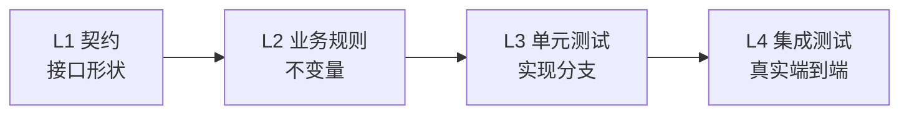
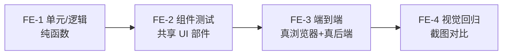

# 测试策略

这一篇是**推荐做法**。平台不管组件内部怎么测试：语言、框架、测试工具都由组件自己定，
平台只要求 `component.yaml`、健康检查、环境变量这三件事。
下面的分层方法来自一次真实生产部署（14 个组件、含前端，覆盖一条完整业务闭环）的复盘。
前端组件在平台眼里和其他组件一样——一个带端口、带健康检查的容器——所以这套方法两边都覆盖：先讲后端四层，再讲前端四层。

## 后端：四层测试



| 层 | 检验什么 | 具体内容 |
| --- | --- | --- |
| L1 契约测试 | 接口对外的形状 | 契约没有破坏性变更；每个接口在跨进程调用下真能调通——走真实协议、真实序列化，不是本地函数调用能过就算数 |
| L2 业务规则测试 | 这个功能该有的性质 | 不变量（余额不能为负）、合法的状态迁移、幂等性、边界情况 |
| L3 单元测试 | 这一版实现的分支 | 当前代码实际走的每条分支、每个条件、每条异常路径 |
| L4 集成测试 | 真实的端到端链路 | 接真实数据库、真实消息队列，从请求进来到落库或发消息，全程跑一遍 |

另有两个**贯穿每一层**的维度——不是第五层，而是写每一层时都要顺带覆盖：

| 维度 | 覆盖什么 |
| --- | --- |
| 权限与数据范围 | 不同身份、不同归属范围下能看到的数据边界。每一层都要带上，不是单独测一次就完事 |
| 跨组件调用 | 调用其他组件时走的是真实依赖而不是替身，见下文"组件测试与集成测试" |

### 区分 L2 与 L3

L2 和 L3 最容易混：两者都像在测"功能对不对"。一条判据就够：

> 把这个功能的实现整个删掉，换一种语言重写，这条测试还该成立吗？该成立 → L2；不该 → L3。

"同一个幂等键的两次请求只留下一条记录"——换 Go、换 Python 都必须成立，是 L2。
"金额字段被解析成 `Decimal` 而不是 `float`"——只对当前实现有意义，是 L3。

### 两个真实踩过的陷阱

**陷阱一：幂等性只测"重放一次"。**

| 不要 | 症状 | 该怎么做 |
| --- | --- | --- |
| 只测串行重放：发一次，再发一次，断言结果一致 | "先 `SELECT` 查有没有、没有再 `INSERT`"的实现，两个并发请求同时落进"还没查到"的窗口时各插一次，留下两条记录。串行重放永远撞不进这个窗口，测试稳定全绿 | 换成原子写入（如 `INSERT ... ON CONFLICT DO NOTHING`）；测试必须包含"多个带同一幂等键的请求同时到达，只有一个真正执行" |

**陷阱二：权限只测两端。**

| 不要 | 症状 | 该怎么做 |
| --- | --- | --- |
| 只测"有权限的人能看到该看的"和"零权限的人什么都看不到" | 权限分支写错、直接返回整张表：零权限用户在更早的地方就被拦了，有权限用户看到的行本身也没错（只是顺带看到了别人的）——两条测试都稳定通过 | 构造两条归属不同范围的数据（不同的 owner、部门、仓库），用其中一个身份查，断言结果里**完全不包含**另一个身份的数据，而不是只断言"非空"或"为空" |

## 组件测试与集成测试

### 组件自己的测试：独立运行

L1–L3 在组件自己的仓库里跑，不起其他组件，不需要 BrickKit。依赖组件的地址来自环境变量，测试里自己设就行；
弱依赖的变量可能根本不存在，把"变量不存在"也当成一个要测的输入——组件在这种情况下的降级行为是它自己的业务逻辑。

**替身（mock）可以用，但要知道它证明不了什么**：mock 只能证明"调用发生了"（参数对不对、调了几次），
永远证明不了"调用之后的结果对不对"。

### 集成测试：真实容器、跨组件调用

L4 用 BrickKit 把真实依赖拉起来。判断一个跨组件测试写得对不对，看三条：

1. **通过依赖组件的真实接口现场产出数据**，而不是绕过接口直接读写它的存储。
2. **依赖组件的契约里没有产出这份数据的能力，先把能力补进它的契约**——不绕开契约，不拿 SQL 直接写它的库。
3. **结果对不对，只有真实拉起依赖才能验证**——这正是 mock 做不到的那一半。

在组件自己的仓库里，用工作台把依赖拉起来（见 [分形的本地开发](../03-component-guide/05-local-dev-fractal.md)）：
依赖跑在容器里，被测组件用 `mode: debug` 在本机跑，测试直接打它。

## 先立规格，再写实现（让 AI 写组件时尤其要紧）

这一节是**推荐的工作顺序**，没有上面那样的实战复盘背书。

**为什么顺序重要。** 先写实现、再补测试，测试就变成对已写代码的复述——它验证"代码做了它做的事"，而不是"代码该做什么"。
想让测试真有约束力，得先有一份不依赖实现的规格。组件恰好有三份，都在 `component.yaml` 里，不读一行实现就能拿到：

| 规格 | 在哪 | 约束什么 |
| --- | --- | --- |
| 配置说明书 | `configSchema` | 组件读哪些环境变量、默认值、哪些必填 |
| 依赖声明 | `dependencies` | 组件会收到哪些 `*_ENDPOINT`（弱依赖没在跑时**不会**注入，见 [环境变量注入契约](../06-architecture/03-env-injection-contract.md)） |
| 接口契约 | `artifacts` 里的契约文件 | 组件对外承诺了什么（见 [契约与产物](../03-component-guide/06-artifacts-and-contracts.md)） |

推荐顺序：

| 步 | 做什么 | 怎么知道这一步对了 | 要起容器吗 |
| --- | --- | --- | --- |
| 1 | 把 `component.yaml` 写完整：`dependencies`、`configSchema`（键、默认值、`required`）、契约文件 | `brickkit lint`，再在工作台里 `brickkit up --dry-run`（见下） | 否 |
| 2 | 照契约写 L1 | 此时必须全红，而且红得有理由（接口还没实现）。第一次就绿，说明它什么都没测到 | 否 |
| 3 | 把 L2 的每条业务规则先写成一句话，再翻成测试 | 同样必须先红 | 否 |
| 4 | 写实现，直到 L1、L2 全绿 | 测试就是验收 | 否 |
| 5 | 补 L3：这一版实现的分支 | 分支都走到 | 否 |
| 6 | 跑 L4：`brickkit up` 起真实依赖，走一遍真实链路 | 端到端跑通 | 是 |

**第 1 步的检查是 BrickKit 给的。** `brickkit up --dry-run` 不启动任何东西，但注入阶段的检查照常跑，
`component.yaml` 与 `config/` 对不上的地方在这里就暴露。下面是把 `demo/hello` 的配置键 `GREETING` 写成 `GREETTING` 时的真实输出（节选）：

```
⚠️ demo/hello@1.0.0：GREETTING 不在组件的 configSchema 里，不会生效
   文件：config/demo-hello.yaml
   已声明的配置项：GREETING
   建议：是不是想写 GREETING？
```

同一步还会拦下：配置项名撞上平台保留变量（警告）；`required` 里的键既没默认值、项目也没填（**阻断**，`--dry-run` 同样以退出码 1 停下）。

**第 3 步的写法。** 先写成"给定……当……则……"一句话，再翻成测试。陷阱一那条幂等规则写出来是：

> 给定一个还没处理过的幂等键；当两个带同一幂等键的请求同时到达；则只有一个真正执行，另一个拿到同一份结果。

这句话本身就是给 AI 最精确的提示，而且直接指向串行重放测不到的那个并发窗口。

## 前端：自己的四层

同一套思路——规格与实现分开、共享的东西优先于专属的、真实环境优于模拟——只是工具和边界不同：



| 层 | 检验什么 | 具体内容 |
| --- | --- | --- |
| FE-1 单元/逻辑 | 逻辑算得对不对 | 纯函数、组合式函数、状态管理；网络请求全部 mock，不管渲染 |
| FE-2 组件测试 | 共享 UI 部件本身 | 被多个页面复用的表格、表单模板、通用卡片——改坏一个等于改坏所有引用它的页面，优先级天然高于某个页面专属的部件 |
| FE-3 端到端 | 完整业务流程 | 真浏览器 + 真后端（整套拼装跑起来）。按"验证的业务流程"命名，不按"点了哪个按钮" |
| FE-4 视觉回归 | 页面之间间距、密度、用法是否一致 | 在 FE-3 走到关键页面时顺手截图对比，不单独再起一遍浏览器。基线随有意的界面改动一起更新 |

**FE-3/FE-4 什么时候写**：页面交互基本稳定之后再批量补。页面还在大改时，每次改动都要连带改选择器和断言，性价比很低。
骨架和目录约定可以提前定好。

**让 AI 跑 FE-3 或 FE-4 之前，先征得用户同意。** 贵的不是工具，而是"AI 真实驱动浏览器、靠截图或读 DOM 来调试选择器"这件事。
动手前说清这次测哪条流程、覆盖哪些页面，等用户确认。成本主要在写和调试阶段；已经稳定的套件跑一遍、出文本报告，和单元测试差不多。
降低首次编写成本：优先用无障碍树快照（结构化文本）确认元素，而不是每次截整页图；失败先看文本堆栈，查不出再截图；关键路径尽量由人录制。

**一个真实踩过的陷阱：没接住"后端拒绝了"。**

| 不要 | 症状 | 该怎么做 |
| --- | --- | --- |
| 数据加载写成 `try { await load() } finally { ... }`，不带 `catch`——因为 FE-1 里 mock 的后端永远成功 | 真实后端合法地拒绝（403、校验错误、连接中断）时，这次 reject 成了没人接住的异常：控制台一条框架警告，页面停在空白或加载态，用户看不到任何提示 | 每个加载/刷新函数都有明确的 `catch`，展示看得见的错误状态。这也是 FE-3 必须打真实后端的原因：mock 测不出"真实拒绝有没有被处理" |

**前端类型与后端契约漂移：靠机制杜绝，不靠多写测试。** 手写的前端类型注释里写着"对应后端契约"，却没有任何机制保证。
从后端契约（OpenAPI 文件、GraphQL schema）直接生成前端类型和请求函数，类型检查在编译阶段就拦下所有漂移，之后每加一个接口零额外成本。

---

种子数据与测试数据怎么规划，见 [种子数据设计](03-seed-data.md)。
