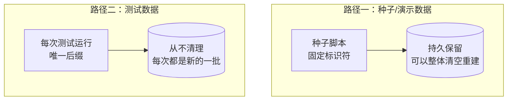

# 种子数据设计

这一篇是**推荐做法**，是 [测试策略](02-testing-strategy.md) 的后续：那一篇讲怎么分层测，这一篇讲那些测试——以及一个人手动探索整套系统时——
真正跑在什么数据上。组件怎么管理自己的数据，平台不管；下面的方法来自同一次真实生产部署（14 个组件，一条完整业务链路）。

先说两个词：

- **种子数据**（也叫演示数据）：给人本地探索系统、做演示用的一批假数据，由脚本造出来，持久保留。
- **测试数据**：自动化测试在每次运行时现场造的数据，只服务那一条测试的断言。

## 两条路径



| | 种子/演示数据 | 测试数据 |
| --- | --- | --- |
| 用途 | 人本地探索、演示 | 各层自动化测试 |
| 怎么产生 | 固定标识符，幂等——重跑脚本不重建已存在的东西 | 测试每次运行时现场造，用时间戳或随机数做唯一后缀 |
| 生命周期 | 持久，可以整体清空 | 从不清理——行数堆积没关系，下一次运行有自己的新后缀 |
| 能不能共用 | 组件之间可以互相查找、复用（见下文） | 绝对不行——任何测试都不该依赖"这一行是别的测试留下的" |

**为什么"从不清理"反而更好。** 测试结束时清理，意味着测试中途失败就留下半截数据，下一次运行可能撞上它；
并发跑的两批测试还会互相删掉对方的数据。每次都用新后缀、从不清理，这两种问题一起消失——代价只是库里多几行没人看的数据。

## 物理隔离：永不共用存储

清空种子数据不该让任何测试变红；一次测试运行也不该弄脏一个人正在手动探索的数据。
两条路径混在一起，"这东西为什么突然坏了"就没有单一的排查方向——可能是有人清空了种子数据，也可能是别的测试并发跑了——两种原因的查法完全不同。

所以要**物理隔离**，而不只是逻辑上约定：测试连的是另一个数据库实例（至少是另一个库），不是同一个库里分两个命名空间。
一条集成测试往一行基线数据（默认仓库、默认成本中心）上写，而这一行恰好是演示时会读到的——只要共用物理存储，这个风险就一直在。

**在 BrickKit 里怎么做**：数据库地址本来就是组件的配置项，值由 `$var:` 引用公共变量。给测试单独一份部署文件，在它的 `vars:` 里指向测试库：

```yaml
# config/vars.yaml —— 平常（探索、演示）用的库
PG_HOST: pg.dev.internal
PG_PASSWORD: ${PG_PASSWORD}
```

```yaml
# config/people-basic.yaml
DB_HOST: $var:PG_HOST
DB_PASSWORD: $var:PG_PASSWORD
DB_NAME: people
```

```yaml
# deploy.test.yaml —— 跑集成测试时用：brickkit up -f deploy.test.yaml
target: docker
vars:
  PG_HOST: pg.test.internal
components:
  - id: people/basic
  # ……其余组件的条目照 deploy.yaml 抄过来：每份部署文件都要列全 brickkit.yaml 里的组件
```

`-f deploy.test.yaml` 那一次，所有 `$var:PG_HOST` 都得到测试库；平常仍是开发库。组件代码不需要知道自己连的是哪一个。

**别为了快换成内存数据库。** 你的数据库用到了内嵌替代品复现不了的特性（分区表、`SET LOCAL ROLE` 这类会话级设置）时，
换成一次性的替代品恰好牺牲了集成测试要证明的那件事——真实基础设施确实按预期工作。
"重建数据慢、测试互相污染"真正的解法是让**数据本身**一次性，也就是上面的"唯一后缀、从不清理"，而不是换一个数据库。

## 同一条覆盖底线，两种落地方式

两条路径共用一条底线：**任何组件都不该只有"一切正常"这一种数据。** 状态机的每条分支、每条失败路径、每个数据范围维度，
都要有真能触发它的数据。但达到底线的方式不同：

- **种子数据追求又多又全。** 它还要服务"一个人能不能完整体验这套系统"，数量和多样性本身就是目标。
- **测试数据追求少而准。** 每个测试只造恰好够验证自己那条断言的数据。唯一例外是针对核心不变量的属性测试（余额永不为负、
  状态机不跳到非法状态）：它需要数量，是为了让随机输入更可能撞上边界，和"体验完整"是两码事。

它们不是同一份数据的丰富版和精简版——目的不同，本来就该长得不一样。

## 种子数据怎样才算"够了"

这要刻意设计，不是单纯堆数量：

- **数据范围要真的有多个值。** 按部门、按 owner、按仓库的权限边界，只有数据里真存在多个值时，人才能点开验证。
  种子数据全挂在一个全能管理员名下，范围机制即使实现得对，在体验里也等于不存在。
- **数量要能撑出分页。** 列表做了游标分页，5 行数据永远只有一页——分页这份契约在体验里从来没存在过。
- **时间要分散**，不能全是刚创建的，"最近 N 天"、趋势图、按时间分区的逻辑才有东西可验。
- **负面和边界数据要真实存在**：一条禁用记录、一笔零余额、一张逾期未结的账、一次被拒绝的申请。只存在于脑子里的失败路径没法点开。
- **数据要能被查到。** 数据一多，就需要一个地方查"这个固定标识符代表什么"——否则新组件想复用无处可查，还可能撞上已被占用的标识符。
  一份统一维护的清单（组件、数据、数量、归属方）比每个组件各记一份划算。

## 组件之间数据重复没关系

这些数据全是假的，不存在污染真数据的顾虑。两个组件各自造了概念上类似的东西（各造了一个"示例客户"），不值得花协调成本去重。
一个组件需要和另一个类似的数据时，直接复用现成的，比商量"该归谁维护"便宜得多。

## 归属：每个组件自己造，先造依赖的

把种子数据集中到项目层，一旦有人只把某个组件连同它的依赖单独跑起来（这是很常见的用法），集中脚本就失效了——它只在所有组件一起跑时才管用。所以：

- **每个组件拥有、维护自己的种子数据。**
- **造自己那部分之前，先把每个声明过的依赖的种子数据造好**——强依赖和弱依赖一视同仁：开发和演示环境里，声明过的依赖通常本来都在跑；
  强弱之分服务的是真实部署时"这个可选模块要不要装"，不是种子数据的顺序。某个依赖在当前环境确实连不上，就跳过它、继续造自己的——
  依赖缺失让种子流程降级，而不是直接失败。
- **用组件自己的幂等机制交接，不另发明协议。** 下游需要依赖种子数据里的某个 id，就按双方约定的固定标识符去查那个依赖，拿到对应的行。

## 固定标识符被引用后就是一份契约

别的组件一旦查过某个固定的种子标识符，它就不能再删掉或改指别的含义——只能新增。像对待已发布契约里的字段一样对待它：
新增可以，破坏性改动需要和真正的契约变更同样的协调。

## 只增不减的表只能整体重置

一张表天生只增不减（流水账、已锁定的会计期间、审计日志），就不该有按行删除的种子清理——序列不会因为删了几行就回退，
硬删等于悄悄违反这张表自己的设计。正确的工具是完整的迁移重置（倒回全部迁移再重跑）；副作用是迁移自己灌的基线数据也会回来，
因为它属于重建的 schema，不是种子脚本的职责。

**经验法则**：只增不减的表只有整体重置；可以安全按行删除的表两种都行，日常优先用更轻的按行清理。

## 不能破的底线：种子机制绝不能进生产

任何造种子数据的机制，都绝不能有能力在真实客户的部署里种下一个真实凭据。一个测试账号或共享密码一旦混进"每次部署都会跑"的东西里
（比如打进镜像的数据库初始化脚本），就等于在每一次安装里都埋了一道后门。没有例外：

- **每次部署都真正需要的基线数据**（默认仓库、基础会计科目、标准计量单位）走迁移，不走种子脚本——它不是测试数据，是产品的一部分。
  组件的 `migration.command` 在主服务启动前、每次部署都跑，正是这类数据需要的"到处都跑、不可选"（见 [迁移服务](../05-migration/01-migration-service.md)）。
- **真实部署里"第一个管理员怎么进来"是配置驱动的引导问题，不是种子数据。** 把第一个真实操作者的身份写进一个配置项，
  组件启动时读到它、幂等地给它授予管理员角色——没人手写 SQL，没有账号硬编码在任何地方。
  这和本地开发需要的"拥有全部权限的测试角色"是两个问题，两套机制不要互相替代。

## 测试数据还需要什么

- **事件或消息测试要有自己私有的 subject 或 topic**——和同一台机器上别的东西共用，真实消费者会和测试抢消息。
- **验证幂等消费（按唯一键去重）的测试，每次运行用不同的标识符**——用固定字符串，第二次运行在去重逻辑看来就是一次合法重放，
  会被悄悄吞掉，根本没走到被测代码。
- **测试数据不需要种子数据那些维度**——分页量、时间分散、可发现性。为和这条测试无关的目标多造数据，纯属浪费。
