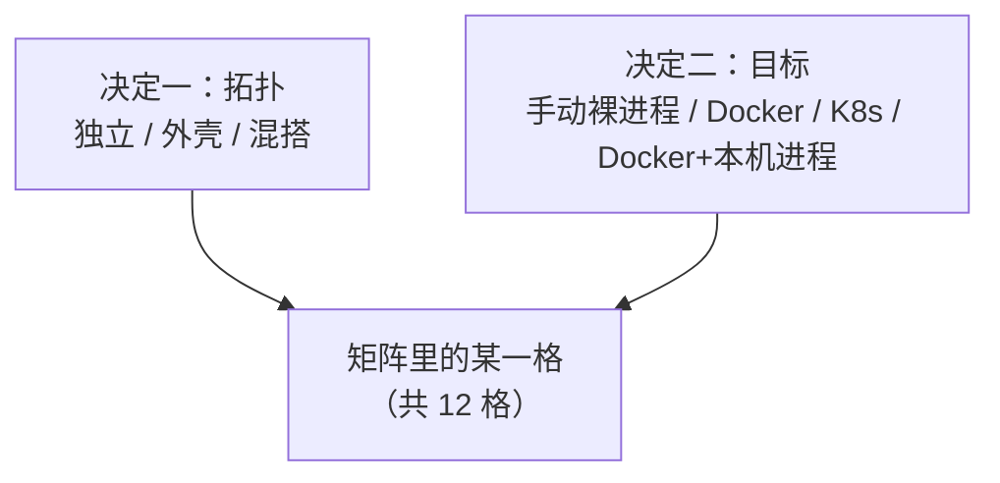

# 部署形态选择

这一篇只回答一个问题：**一个有 N 个组件的项目，到底该跑成什么样。** 它不教你怎么造外壳（见 [外壳开发指南](../04-shell/05-shell-development.md)），
也不讲把一个组件放进外壳的具体步骤（见 [成员管理](../04-shell/04-members-management.md)）。还没决定项目整体长什么样时，先读这一篇。

## 两个决定，外加一个开关

**决定一：拓扑——组件最终收拢成几个容器？**

- **全部独立**：每个组件各自一个容器（或 Pod）。什么都不多写就是这个形态。
- **全部进外壳**：能合并的组件尽量编进少数几个外壳，一个外壳一个容器。
- **混搭**：一部分进外壳，一部分独立。这通常是常态，不是妥协：有些组件**结构上**就进不了外壳——一个由 nginx 提供服务的纯前端没有可以编进去的后端进程；
  一个无状态的网关常常故意保持独立，好按自己的负载单独扩缩容。

外壳自己是一个普通组件（`brickkit.yaml` 里标着 `kind: shell`），它能承载哪些成员写在它的 `component.yaml` 的 `shell.members` 里；
**这一次承载哪些**写在部署文件里——成员条目嵌在外壳条目的 `members` 下面。所以拓扑是**按部署文件**决定的：
开发机的 `deploy.yaml` 可以全部独立，生产的 `deploy.prod.yaml` 可以把几个成员收进外壳，`config/` 一个字都不用改。

**决定二：部署目标——`docker`（或 `podman`）还是 `k8s`**，写在部署文件的 `target` 里。这几乎完全是基础设施问题，不是性能问题：
你有没有 Kubernetes 集群、需不需要跨机器调度和自愈？没有的话，`docker` 在单机上用 `docker compose` 驱动一切，运维最简单，
适合本地开发、演示、小规模或单机的生产。有的话，`k8s` 生成 Deployment / Service / Ingress。拓扑的决定原样适用，换目标只是换一份部署文件。

**开关：`mode: debug` / `mode: local`——把一两个组件拉到你的机器上以本机进程运行，其余照常在容器里跑。**

- `mode: debug`：进程由你在 IDE 里启动，平台只负责让别人找到它。只能写在个人的 `deploy.local.yaml` 里。
- `mode: local`：平台自己识别启动命令、启动并看管这个进程。

两者都**只在 Docker / Podman 下存在**，部署目标是 `k8s` 时被拒绝——集群里的 Pod 到不了你的笔记本。
它们能和任何一种拓扑组合：本机进程可以依赖独立组件、外壳，或者外壳里的某个成员；外壳里的成员自己也可以被单独拉出来调试。

两个决定是真正独立的两根轴，所以是一张矩阵，而不是几个预设名字：



## 平台之外的一种方式：手动跑起来

没有任何东西阻止你把每个组件当成普通进程启动（`go run`、`uvicorn`，或者你的语言对应的命令），完全不经过 `brickkit up`。

**先说清边界：这不是平台管理的形态，平台甚至不知道它存在。** 依赖解析、环境变量注入、健康检查、迁移顺序、服务发现统统不会发生，因为你没调用它。
每个进程听哪个端口、真实部署会注入的每一个变量、启动顺序，全部要你自己还原。这是"CLI 跑完就退出、没有常驻服务"的直接结果：平台只在命令运行的那一刻存在。

它仍然完全正当、非常常见——通常是最快的开发循环（不用构建镜像，断点直接挂上去）。

**一个值得知道的技巧：让 CLI 替你算出环境变量。** 在 `deploy.local.yaml` 里临时把要手动跑的组件标成 `mode: debug`，跑一次 `brickkit up --dry-run`，
读生成的 `.brickkit/generated/local-debug.<版本化服务名>.env`——那正是一次真实部署会喂给它的完整变量。比如 `shop/order` 依赖外壳里的成员 `shop/stock`：

```text
COMPONENT_ID=shop/order
COMPONENT_VERSION=0.1.0
SHOP_STOCK_ENDPOINT=http://localhost:18082
```

抄下需要的部分，再把那一行删掉（或 `brickkit local off`）。`deploy.local.yaml` 本来就不提交，不会影响任何人。
这个技巧覆盖不到一件事：你在 `config/` 里手写的、指向别的容器服务名的地址——平台不解析配置值的内容，不会替你改写，
这一点和 `mode: debug` 本身一样。只有 `host.docker.internal` 例外：在本机跑的进程拿到的是 `localhost`。

## 矩阵

|  | 手动裸进程 | Docker | K8s | Docker + 本机进程 |
| --- | --- | --- | --- | --- |
| **全部独立** | [1. 外壳出现之前的开发起点](#1-全部独立--手动裸进程) | [2. 单机装得下时的标准形态](#2-全部独立--docker) | [3. 资源最充裕的一端](#3-全部独立--k8s) | [4. 调一个组件，其余保持真实](#4-全部独立--docker--本机进程) |
| **全部进外壳** | [5. 单独测外壳自己的编排](#5-全部进外壳--手动裸进程) | [6. 单机装不下时压内存](#6-全部进外壳--docker) | [7. 资源最紧的一端](#7-全部进外壳--k8s) | [8. 调一个组件，外壳保持真实](#8-全部进外壳--docker--本机进程) |
| **混搭** | [9. 用上外壳之后的日常开发](#9-混搭--手动裸进程) | [10. 大多数真实项目的归宿](#10-混搭--docker) | [11. 资源适中的中间点](#11-混搭--k8s) | [12. 最贴近真实开发的组合](#12-混搭--docker--本机进程) |

没有第 13 格"K8s + 本机进程"：部署文件里 `mode: debug` / `mode: local` 碰上 `target: k8s`，装载阶段就被拒绝，报错指出是哪个条目（`components[N].mode`）。

### 1. 全部独立 × 手动裸进程

**是什么**：用到的每个组件都是你手动启动的普通进程，没有容器，也不经过 `brickkit up`。

**什么时候用**：单组件开发最常见的起点，尤其项目里还没有外壳时。想要最快的"改代码—看效果"循环。

**好处**：没有构建镜像这一步；进程和它连的地址之间没有容器层，出问题只有两个变量要查；不需要装 Docker。

**代价**：注入、健康检查、服务发现、迁移顺序都要自己还原；组件一多，手动拼十几份环境变量是真实的体力活，也容易错。上面那个 `--dry-run` 技巧能省掉大半。

### 2. 全部独立 × Docker

**是什么**：每个组件一个 Compose 服务，`brickkit up` 端到端驱动：地址注入、健康检查、按依赖顺序启动、迁移。

**什么时候用**：组件数量单机装得下时的默认形态。"装得下"是个真实的数字：每个进程的内存底线几乎完全由语言运行时决定——
Go / Rust 8–20MB，Python / Node 40–90MB，JVM 200–450MB（这是各语言运行时的一般量级，你的组件以实测为准）。20 个空闲的 Go 组件加起来不到半个 G；20 个空闲的 Spring Boot 组件，一件事都没做就已经 4–9G。
留在这一格，直到这笔账在你要部署的机器上真的算不过来。

**好处**：每个组件能单独启停，出事只影响它自己；一个组件对应一个容器、一份日志、一个健康状态，排查最简单。

**代价**：每个组件各付一份运行时内存底线——这正是外壳存在的原因；单机形态，没有跨机器调度与自愈。

**值得知道**：觉得"装不下"之前先量（`docker stats`），别照着表拍数字——50 个组件的项目本地可能只跑几个，因为大部分这次 `mode: disable` 了，或者没有谁需要它们。

### 3. 全部独立 × K8s

**是什么**：每个组件一个 Deployment + Service，地址由集群原生的 Service DNS 解析。

**什么时候用**：集群资源宽裕，不需要用合并去换更低的内存底线。每个组件保留自己的 `replicas`、自己的 `resources`。

**好处**：真正独立的水平扩缩容；跨机器调度与故障恢复按组件生效。

**代价**：运维复杂度最高——需要真正的集群管理能力；执行 `up` 的机器上要装 `kubectl`；组件多就意味着 Deployment / Service 对象多。

**值得知道**：K8s 下 `expose: true` 必须配 `hostname`（Ingress 按域名路由），Docker 专属的 `exposePort` 不起作用；漏配 `hostname`，`up --dry-run` 就会拦下。
`config/` 里假设了单机 Docker 网络的地址，换到 K8s 要自己改——用部署文件的 `vars:` 按环境给不同的值最省事。

### 4. 全部独立 × Docker + 本机进程

**是什么**：除了你标成 `mode: debug` 或 `mode: local` 的组件，其余都是真实容器。平台让其他容器把这个组件的版本化服务名解析到你的机器（`extra_hosts` 指向 `host-gateway`）；
调用方拿到的服务名不变——`extra_hosts` 只改变它解析到哪里；端口换成你的 `localPort`，缺省就是组件声明的端口，所以地址常常一个字都不变。

**什么时候用**：既要"其余部分是真实的"，又要"改这一个组件不想重新构建镜像"。它只是开发期的叠加手段，不决定生产拓扑。

**好处**：组件代码零改动；可以同时拉出好几个组件，各用各的 `localPort`；本机进程依赖的一切拿到的仍是平台算好的真实地址。

**代价**：连不上时要先问"这个名字解析到了我的机器还是某个容器"，而不是泛泛地查网络；`config/` 里手写的容器网络地址不会被改写。

**值得知道**：`mode: debug` 的组件有一份 `local-debug.<服务名>.env` 供 IDE 加载，多行值、含特殊字符的值都已按 shell 规则转义。
它**不跑数据库迁移**——迁移步骤跟着它的容器一起没了，组件有迁移时第一次要自己手动跑（见 [本地调试工作流](../02-project-guide/03-local-debug-workflow.md)）。

### 5. 全部进外壳 × 手动裸进程

**是什么**：外壳自己的程序直接在你机器上启动，不经过任何编排。你测的是外壳自己的多模块编排逻辑。
平台不在场，`BRICKKIT_SERVED_MEMBERS` / `BRICKKIT_SERVED_MEMBERS_CONFIG` 要你自己拼（或为测试写死）。

**什么时候用**：几乎只有造外壳、测外壳的人需要：脱离容器层验证外壳的启动顺序、健康检查、模块之间的故障隔离，再交给真实部署。

**好处**：外壳开发最快的循环；能把"外壳编排的 bug"和"容器层的问题"彻底分开。

**代价**：平台的保证在这里都不存在——只能证明外壳在你自己拼的数据下表现正确。两个变量的精确形状见 [JSON 注入](../04-shell/02-json-injection.md)。

**值得知道**：外壳里的模块注册表要按**完整的组件 ID 加版本**做键，才能在真实部署里同时承载一个组件的两个版本——这个坑只有真的喂两个版本进去才会暴露，值得在这一格故意练一遍。

### 6. 全部进外壳 × Docker

**是什么**：尽量多的组件编进少数几个外壳；每个外壳一个 Compose 服务，成员不生成自己的服务容器。
调用方拿到的成员 `*_ENDPOINT` 指向外壳：`http://<外壳的服务名>:<成员自己的端口>`。成员自己的版本化服务名也保留着，是外壳容器的网络别名；
调用方代码本来就读变量，不用改。

**什么时候用**：第 2 格那笔内存账真的算不过来时——不要提前用。动手之前先试更便宜的办法：给贵的组件换更轻的运行时
（JVM 组件编成 GraalVM 原生镜像，内存底线从几百 MB 掉到几十 MB，部署形态不变）；确认拉高数字的组件是不是这次本来就可以 `mode: disable`。

**好处**：一个外壳只背一份运行时底线、一份连接池，而不是 N 份；容器少，启动快，要盯的日志和重启对象也少。

**代价**：共用一个外壳的成员共享故障域（一处崩溃可能拖垮其他模块，除非外壳造得足够小心），也共享扩缩容单位（没法单独给某个成员加副本）。

**值得知道**：
- 成员的迁移**仍由平台跑**：用成员自己的镜像、自己的配置，外壳等它成功才启动（见 [与外壳的交互](../05-migration/04-shell-interaction.md)）。所以每个成员都必须有自己的镜像。
- 本机构建的外壳镜像，`brickkit build` 会在标签里记下编进了哪些成员版本，`up` 拿它对照外壳 `component.yaml` 的 `shell.members`：
  对不上就停下（`IMAGE_STALE`），而不是让一个少编了成员的外壳悄悄跑起来。没有这个标签的镜像（手工构建的）只警告（`IMAGE_UNVERIFIED`）；
  拉取的镜像不查——发布出去的版本，镜像与 `component.yaml` 天然一致。
- 成员条目上描述"自己容器怎么部署"的字段（`expose`、`replicas`、`resources` 等）在外壳里不生效；它们留着是为了成员回落成独立组件时生效。
- 放进外壳之后可能出现启动等待环，`up` 会拦下并给出三条出路（见 [成员管理](../04-shell/04-members-management.md#合并造成的启动环与-skipwaitfor)）。

### 7. 全部进外壳 × K8s

**是什么**：同样的合并，对接集群：每个外壳一个 Deployment；每个成员一个 Service，`selector` 选中外壳的 Pod、端口用成员自己声明的端口；成员不生成自己的 Deployment。

**什么时候用**：集群资源真的紧张，把总开销压到最低比单独扩缩容某个成员更重要。

**好处**：同时拿到"合并省内存"和"K8s 自愈、跨机器调度"两边的好处。开了网络策略时，成员的调用方和依赖方会自动算进外壳的规则。

**代价**：第 6 格的每条代价原样成立；第 3 格的每条 K8s 代价也原样成立——合并不会降低 K8s 本身的要求。

**值得知道**：K8s 下 Pod 之间没有启动顺序，所以合并造成的等待环在这里不拦，`skipWaitFor` 写了也只警告、不生效；成员的迁移照样是它自己的 Job。

### 8. 全部进外壳 × Docker + 本机进程

**是什么**：第 4 格的叠加，只是"其余部分"是外壳。两个方向都通：

- 本机进程依赖某个成员：它拿到的地址是真实的 `http://localhost:<端口>`——映射开在**外壳**的 Compose 服务上（成员没有自己的服务），端口是成员自己声明的、外壳本来就必须监听的那个。
- 某个成员本身被拉出来：在 `deploy.local.yaml` 里给外壳条目 `members` 下的那个成员写 `mode: debug` 和 `localPort`，外壳这次就不承载它，它在你的机器上运行。

**什么时候用**：你正在改的那个组件，要对着真实的、已经合并的其余部分说话，又不想重新构建任何镜像。

**好处**：不需要知道某个成员具体在哪个外壳里；其余部分保持完整真实。

**代价**：第 4 格的每条局限原样适用。把成员拉出来调试之后，外壳这次少承载一个模块——外壳对 `BRICKKIT_SERVED_MEMBERS` 里少了一项的处理要正确。

### 9. 混搭 × 手动裸进程

**是什么**：这次用到的组件，按各自真实的形态手动启动——独立组件照第 1 格，外壳照第 5 格。

**什么时候用**：项目的生产拓扑已经用上外壳之后的日常开发。只起你要改的那几个，本地结果依然反映真实的地址解析和跨进程调用。

**好处**：规模过了"全部独立"之后仍保留最快的循环；按真实形态还原，能在本地就撞上形态相关的 bug（比如外壳注册表键错了）。

**代价**：手工准备最重的一格；没有任何东西检查你手工搭的"谁在哪"是不是和部署文件对得上。

### 10. 混搭 × Docker

**是什么**：一部分独立容器，一部分在外壳里，`brickkit up` 一次驱动整套。谁在哪，完全由部署文件里条目的位置决定（顶层，还是某个外壳的 `members` 下）。

**什么时候用**：一个成熟项目通常的归宿，而且通常是**结构性**的，不是资源折中——前端、网关这类组件本来就不该进外壳。拿不准一次本地化交付该选哪一格时，这通常是答案。

**好处**：需要独立的地方独立，其余地方省内存；两种条目并排写在同一份部署文件里，不需要特殊处理。

**代价**：排查时要同时带着两套心智模型；合并那一半的代价和独立那一半的代价各自原样成立，混搭不会把它们平均掉。

**值得知道**：同一个组件的老版本独立运行、新版本在外壳里，可以零协调共存（见文末）。

### 11. 混搭 × K8s

**是什么**：第 10 格的混合拓扑对接集群：独立组件各自 Deployment + Service，成员的 Service 指向外壳 Pod。

**什么时候用**：资源不紧也不宽裕：大部分组件留在外壳里压住总开销，把真正需要独立副本数或资源配额的几个挑出来单独部署。
和第 10 格不同，这里的混搭常常是**资源调优**决定——一个结构上完全可以合并的组件，因为要单独扩缩容而被主动拆出来。

**好处**：资源分配最灵活；地址解析、网络策略原生支持混搭，不需要额外配置。

**代价**：同时背上完整的 K8s 运维代价和完整的合并代价；出问题时要查的地方最多：K8s 本身、外壳内部编排、普通容器。

### 12. 混搭 × Docker + 本机进程

**是什么**：真实的混合拓扑跑在 Docker 里，再拉一个组件到你的机器上。最贴近真实开发的组合，因为"其余部分"就是项目的真实生产形状。

**什么时候用**：你正在改的组件，要对照项目真正会用的那套拓扑。

**好处**：不碰生产，却最接近"对着生产调试"；两个方向的地址解析都通（见第 4、8 格）。

**代价**：要同时理解外壳合并、本机进程的地址解析、普通容器的行为——没有更简单的心智模型可以退回去。

## 贯穿 12 格的一条结论：多版本共存不用额外操心

哪一格都不改变同一组件多个版本共存的行为。版本化服务名让共存与拓扑、与部署目标都无关：老调用方和新调用方、独立运行的版本和外壳里的版本，
都能在同一次部署里共存。平台不检查新老版本之间能不能正确协作——守住契约兼容是组件作者的责任（见 [多版本共存](../03-component-guide/09-multi-version-coexistence.md)）。

## 对比两个环境

每个环境一份完整的部署文件，所以对比两个环境用不着专门的命令，两次普通的 `diff` 就够：

1. `diff -u deploy.yaml deploy.prod.yaml` 看**你写了什么不同**。
2. 两次 `up --dry-run` 的输出做 `diff`，看**这些不同带来的后果**——哪些组件因此不启动、为什么。

下面是真实输出：`demo/caller` 强依赖 `demo/hello`、弱依赖 `demo/bus`；生产文件换成了 `k8s`，并关掉了 `demo/hello`：

```text
$ diff -u deploy.yaml deploy.prod.yaml
--- deploy.yaml
+++ deploy.prod.yaml
@@ -1,10 +1,8 @@
-# deploy.yaml —— 这个项目怎么部署：部署目标，以及哪些组件运行、怎么运行。
-# 团队文件：请提交它。个人的那份是 deploy.local.yaml（brickkit local on）。
-target: docker # docker | podman | k8s
-
+target: k8s
 components:
   - id: demo/hello
+    mode: disable
   - id: demo/bus
   - id: demo/caller
     expose: true
-    exposePort: 18080
+    hostname: shop.example.com
```

```text
$ diff <(brickkit up --dry-run 2>&1 | grep -v '^{') \
       <(brickkit up --dry-run -f deploy.prod.yaml 2>&1 | grep -v '^{')
1c1,2
< 🚀 启动项目 my-shop（target: docker）
---
> 使用 deploy.prod.yaml（--file）
> 🚀 启动项目 my-shop（target: k8s）
3,5c4,6
<    ✅ demo/hello@1.0.0   启动（demo/caller 需要）
<    ✅ demo/bus@1.0.0     启动（demo/caller 需要）
<    ✅ demo/caller@1.0.0  启动（顶层）
---
>    ⬜ demo/hello@1.0.0   显式禁用（mode: disable）
>    ⬜ demo/bus@1.0.0     不启动（上层都不启动）
>    ⬜ demo/caller@1.0.0  不启动（强依赖 demo/hello 不启动）
```

（第二段 `diff` 后面还有启动顺序与生成文件的差异，这里截掉了。）

第二段直接给出后果：不只 `demo/hello` 不启动，`demo/caller` 也跟着不启动（它强依赖 `demo/hello`），`demo/bus` 没有上层需要它，也不启动。
只看第一段的 `mode: disable` 那一行，推不出这些。

- `grep -v '^{'` 滤掉 CLI 写在 stderr 上的 JSON 日志行，否则它们混进人读的输出，`diff` 出一堆噪音。
- 这里比的是**启动决策**，不是生成的部署文件本身：一边是 `compose.yaml`，一边是一组 Kubernetes 清单，本来就没法逐行比。
