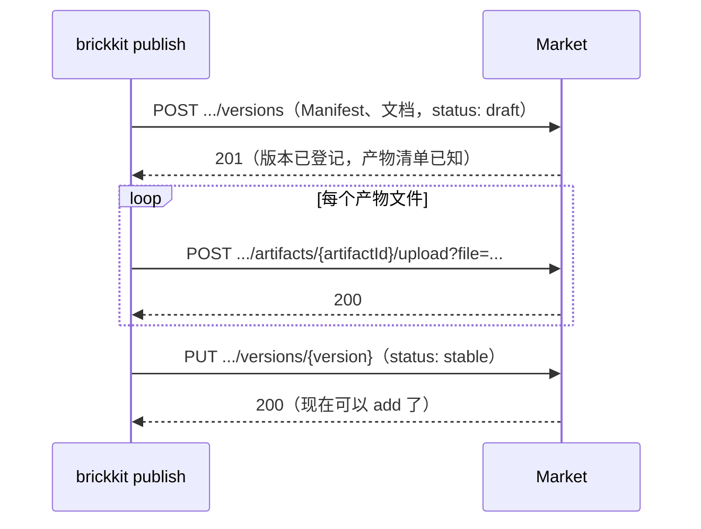

# Market API 参考

BrickKit Market（组件市场）的 HTTP 接口。这里列的是**已经实现的端点**，与服务端的路由注册表逐条对应——`market-server` 里有测试守着：这张表多写一个不存在的端点、或者漏写一个存在的端点，测试都会失败。

平常用不着直接调这些接口：`brickkit login`、`publish`、`add`、`fetch` 已经把它们包好了。这篇写给要自己写市场客户端、或者想弄清市场某个行为细节的人。

## 市场是可选的

市场是一种**安装源**，不是 BrickKit 运行所必需的东西。一个项目只用本地源和 git 源，就能装组件、部署、升级：

- **git 源**：组件仓库打上版本 tag 就算发布了。组件在仓库根目录时 tag 就是版本号（`1.2.0`）；组件在仓库的子目录 `<scope>-<name>/` 里时，tag 是 `<scope>-<name>/1.2.0`。`brickkit release` 替你检查工作区并打 tag、推送。
- **本地源**：直接读磁盘上的组件目录，开发时用。

市场在这之上多给了几样 git 做不到、或做起来很别扭的东西：

| 市场提供的 | 为什么 git 源给不了 |
| --- | --- |
| 搜索、按标签浏览 | git 只能按仓库地址取，不知道"有哪些组件" |
| 私有组件与按用户、组织授权 | git 的权限是整个仓库级别的，与组件无关 |
| 闭源分发：只交镜像和接口契约，不交源码 | git 源装组件要读仓库本身 |
| 发布者签名的存放与转交 | git tag 上没有地方挂 BrickKit 的签名 |
| 事后下架（`blocked`）：已发布的坏版本不能再被安装 | 删掉 git tag 挡不住已经克隆过的人，也没人会收到说明 |

没有市场时一切照常；需要上面这些时再自己部署一套（或者用团队已经在跑的那套）。BrickKit 没有官方运营的公共市场。

## 基础约定

**地址：** 你所用市场实例的地址，所有路径都以 `/api/v1` 开头。

**认证：** 需要认证的接口在请求头里带令牌：

```
Authorization: Bearer <令牌>
```

令牌由 `POST /api/v1/auth/login` 给出，也就是 `brickkit login` 存进 `.brickkit/credentials` 的那个值。public 组件的查询不需要认证；private 组件的一切操作、以及发布，都需要。

**响应信封：** 除了下面单独说明的文档端点，所有响应都是同一个形状：

```json
{"success": true, "data": { "...": "..." }}
```

```json
{"success": false, "error": {"code": "MANIFEST_INVALID", "message": "the Manifest failed validation", "details": { "...": "..." }}}
```

`error.details` 是结构化的补充信息（逐条的校验问题、冲突详情等），不是每个错误都有。市场的文字说明一律是英文；要按错误分流就看 `code`，它是稳定的。

## 错误码

| 错误码 | HTTP 状态 | 含义 |
| --- | --- | --- |
| `INVALID_REQUEST` | 400 | 请求体不是合法 JSON、超过 8 MiB（`details.limitBytes`），或者请求字段（来源、版本号、可见性、文档……）不合法 |
| `MANIFEST_INVALID` | 400 | 发布时提交的 Manifest 没通过校验；`details.problems` 逐条列出 |
| `CONFIG_SCHEMA_RESERVED_VARIABLE_CONFLICT` | 400 | `configSchema` 里的配置项与平台保留的环境变量同名 |
| `CLOSED_SOURCE_MISSING_API_CONTRACT` | 400 | 闭源组件没有声明 `api-contract` 产物 |
| `UNAUTHORIZED` | 401 | 没带令牌，或者令牌无效、过期 |
| `FORBIDDEN` | 403 | 令牌有效，但这个身份没有权限做这件事 |
| `COMPONENT_BLOCKED` | 403 | 组件或版本已被市场管理员下架 |
| `NOT_FOUND` | 404 | 组件、版本、组织或文档不存在 |
| `CONFLICT` | 409 | 状态冲突（比如把已在别的组织里的用户拉进来） |
| `VERSION_ALREADY_EXISTS` | 409 | 这个版本号已经用过；版本号不能重复发布，软删除的版本也继续占着号 |
| `INTERNAL` | 500 | 市场内部错误；具体原因只写进服务端日志，不对外透露 |

## 端点

### 运维与审计

| 方法 | 路径 | 认证 | 说明 |
| --- | --- | --- | --- |
| GET | `/api/v1/health` | 否 | 健康检查，返回 `status`、服务端版本号与当前时间。自托管时容器的 healthcheck 探的就是它 |
| GET | `/api/v1/audit` | 是 | 审计日志，按时间倒序。查询参数：`componentId`、`action`、`limit`。管理员看全部；其他人只看自己名下组件上的条目（包括别人的下载），以及自己做过的操作 |

### 账号

| 方法 | 路径 | 认证 | 说明 |
| --- | --- | --- | --- |
| POST | `/api/v1/auth/register` | 否 | 注册。请求体：`username`、`password`、`email`（可选） |
| POST | `/api/v1/auth/login` | 否 | 登录。请求体：`username`、`password`；响应里有 `token` 与 `expiresAt` |
| POST | `/api/v1/auth/logout` | 是 | 作废本次请求带的这个令牌（不影响同一账号的其他令牌）。重复调用不报错 |

⚠️ 注册请求里即使带了 `orgId` 也会被忽略。组织成员身份就是读取组织私有组件的凭据，能自报组织就等于谁都能读别人的私有组件。加入组织只有一条路：由组织所有者或市场管理员调下面的"添加成员"。

### 组织

| 方法 | 路径 | 认证 | 说明 |
| --- | --- | --- | --- |
| GET | `/api/v1/organizations` | 是 | 组织列表。普通用户只看得到自己所在的那个，管理员看得到全部 |
| POST | `/api/v1/organizations` | 是 | 创建组织，创建者成为所有者并自动入组 |
| POST | `/api/v1/organizations/{orgId}/members` | 是（组织所有者或管理员） | 添加成员 |

一个用户最多属于一个组织。把已在别的组织里的人加进来会返回 `CONFLICT`，而不是悄悄把他挪走——那样他原来组织的私有组件会突然读不到。重复添加同一个人不报错。

### 组件

| 方法 | 路径 | 认证 | 说明 |
| --- | --- | --- | --- |
| GET | `/api/v1/components` | 视可见性 | 搜索。查询参数：`keyword`、`page`、`pageSize`、`tags`（逗号分隔，也可以重复传）。只返回没被下架、且调用者看得到的组件 |
| GET | `/api/v1/components/{scope}/{name}` | 视可见性 | 组件详情与它的版本号列表 |
| PUT | `/api/v1/components/{scope}/{name}/visibility` | 是（所有者） | 设置可见性：`public` 或 `private` |
| GET | `/api/v1/components/{scope}/{name}/access` | 是（所有者） | 查看 private 组件授权给了哪些用户、组织 |
| PUT | `/api/v1/components/{scope}/{name}/access` | 是（所有者） | 替换访问策略 |

组件 ID 是两段式的 `scope/name`，路径里就是两段：`/api/v1/components/people/basic`。

组件在第一次发布时创建，发布者成为所有者；命名空间先到先得，只有 `brickkit/` 与 `infra/` 两个保留给市场管理员。

### 版本

| 方法 | 路径 | 认证 | 说明 |
| --- | --- | --- | --- |
| GET | `/api/v1/components/{scope}/{name}/versions` | 视可见性 | 版本列表（不含 Manifest 正文）。`draft` 只有所有者看得到，已删除的版本不列出 |
| POST | `/api/v1/components/{scope}/{name}/versions` | 是（已有组件只有所有者能发） | 发布新版本，见下面"发布" |
| PUT | `/api/v1/components/{scope}/{name}/versions/{version}` | 是（所有者；下架仅管理员） | 改版本状态：`draft`、`stable`、`deprecated`；`blocked`（下架）只有管理员能设。转 `stable` 前清单里的产物文件必须都已上传 |
| DELETE | `/api/v1/components/{scope}/{name}/versions/{version}` | 是（所有者） | 软删除：对外视同不存在，版本号继续占用 |
| GET | `/api/v1/components/{scope}/{name}/versions/{version}/manifest` | 视可见性 | 这个版本的 Manifest，`brickkit add` 就从这里取 |
| GET | `/api/v1/components/{scope}/{name}/versions/{version}/doc` | 视可见性 | 这个版本的 `BRICKKIT.md`，见下面"组件文档" |

`/manifest` 的 `data` 里有：`manifest`（`component.yaml` 转成的 JSON）、`status`、`sourceType`（`git` 开源 / `registry` 闭源）、`gitUrl`（开源组件的仓库地址，`add --repo` 靠它克隆源码）、`signature`（发布时附带的签名，没签名时没有这个字段）。

能不能取到某个版本：`draft` 只对所有者可见，`blocked` 返回 `COMPONENT_BLOCKED`，已删除的返回 `NOT_FOUND`，private 组件对没有授权的调用者返回 `FORBIDDEN`。`/doc` 的判断与 `/manifest` 一模一样。

### 产物

| 方法 | 路径 | 认证 | 说明 |
| --- | --- | --- | --- |
| GET | `/api/v1/components/{scope}/{name}/versions/{version}/artifacts` | 视可见性 | 这个版本登记的产物清单：每项有 `id`、`type`、`format`、`files` |
| POST | `/api/v1/components/{scope}/{name}/versions/{version}/artifacts/{artifactId}/upload` | 是（所有者） | 上传清单里某个产物的一个文件，查询参数 `file` 是它在组件里的相对路径，请求体是文件内容。单个文件最大 64 MiB |
| GET | `/api/v1/components/{scope}/{name}/versions/{version}/artifacts/{artifactId}/download` | 视可见性 | 下载一个产物文件，查询参数 `file` 同上 |

产物**清单**（有哪些产物、每个包含哪些文件）是发布时随 Manifest 的 `artifacts` 一起登记的；上传只能传清单里声明过的文件。

## 发布

`POST /api/v1/components/{scope}/{name}/versions` 的请求体：

```json
{
  "version": "1.2.0",
  "status": "draft",
  "manifest": { "apiVersion": "brickkit/v1", "kind": "Component", "metadata": { "id": "people/basic", "version": "1.2.0" } },
  "sourceType": "git",
  "gitUrl": "https://github.com/example/people-basic",
  "changelog": "新增人员状态字段",
  "visibility": "public",
  "doc": "# people/basic\n\n怎么调用……\n",
  "docTranslations": { "en": "# people/basic\n\nHow to call it…\n" },
  "signature": {
    "algorithm": "cosign",
    "publicKeyRef": "keys/vendor.pub",
    "value": "<base64 签名值>",
    "signedBy": "release-bot@example.com"
  }
}
```

| 字段 | 必填 | 说明 |
| --- | --- | --- |
| `version` | 是 | 必须与 `manifest.metadata.version` 一致 |
| `status` | 否 | 不写时是 `draft` |
| `manifest` | 是 | `component.yaml` 转成的 JSON，原样存下 |
| `sourceType` | 是 | `git`（开源，必须同时给 `gitUrl`）或 `registry`（闭源） |
| `gitUrl` | 开源时 | 组件的 git 仓库地址 |
| `changelog` | 否 | 这个版本改了什么 |
| `visibility` | 否 | `public` 或 `private`。写了就把组件设成这个可见性（已有的组件也会跟着改）；不写时新组件是 `public`，已有组件保持原样 |
| `doc` | 否 | 组件仓库根目录 `BRICKKIT.md` 的全文，UTF-8，最大 256 KiB |
| `docTranslations` | 否 | `BRICKKIT.md` 的译本（组件仓库根目录的 `BRICKKIT.<语言>.md`），键是小写的语言代码（`zh`、`pt-br`）：最多 16 份，每份最大 256 KiB，所有文档合计最大 1 MiB |
| `signature` | 否 | 发布者对 Manifest 的签名。市场只检查结构（算法认不认识、必填项在不在、`value` 是不是合法 base64），不做密码学验证：市场手里没有任何可信的公钥，真正的验签发生在安装方，用项目自己配置的公钥 |

### 发布时市场检查什么

**Manifest 的规则与 CLI 是同一份代码。** `brickkit lint` 在组件仓库里通过的 `component.yaml`，Manifest 规则这一关在市场上也一定通过；CLI 拒收的，市场同样拒收——包括写错的字段名（未知字段一律拒绝，不会悄悄忽略）、版本范围写法（`^1.0.0`）、外壳成员没写精确版本。绕过 CLI 直接调这个接口，也是同样的检查。

每个问题单独一条，放在 `details.problems` 里：

```json
{
  "success": false,
  "error": {
    "code": "MANIFEST_INVALID",
    "message": "the Manifest failed validation",
    "details": {
      "problems": [
        {"field": "dependencies.components[0]", "reason": "..."},
        {"field": "futureField", "reason": "..."}
      ]
    }
  }
}
```

Manifest 的问题与请求字段的问题（`version`、`sourceType`、`visibility`……）一次一起报，改一轮就能改完。

**在这之上，市场还多查几条"发布到市场"才有的规则：**

1. **必须有 `deployment.image`。** 从市场装组件的人手上没有源码，没法自己构建镜像。只写了 `deployment.build`（只能从源码构建）的组件用 git 源分发。
2. **配置项不能与平台保留的环境变量同名。** `configSchema` 的键就是注入给组件的环境变量名；撞上平台自己要注入的名字，组件永远拿不到自己的值。保留的名字是 `COMPONENT_ID`、`COMPONENT_VERSION`、`BRICKKIT_SERVED_MEMBERS`、`BRICKKIT_SERVED_MEMBERS_CONFIG`、`PORT`，以及所有以 `_ENDPOINT` 结尾的名字。CLI 部署时遇到这种组件只是警告并跳过那一项（组件可能来自不经过市场的安装源）；市场在发布时直接拒收，返回 `CONFIG_SCHEMA_RESERVED_VARIABLE_CONFLICT`，`details.conflicts` 里每项有 `configKey`、`conflictPattern` 和一个避得开的新名字 `suggestion`。
3. **闭源组件必须带接口契约。** `sourceType: registry` 的组件至少要声明一个 `type: api-contract` 的产物：代码可以不公开，调用它的接口不能不公开。
4. **`doc` 不超过 256 KiB。** 它是 JSON 字符串，本身就是文本；`brickkit publish` 在建版本之前先查一遍大小，并拒绝不是 UTF-8 的文件。这一条与 Manifest、请求字段的问题一起报。

5. **`docTranslations` 的键是语言代码**，最多 16 份，每份不超过 256 KiB，`doc` 连同全部译本合计不超过 1 MiB——限的是合计，请求体的大小上限就不用跟着译本份数涨。问题报在字段 `docTranslations` 上。

### 发布分三步

`brickkit publish` 把三次请求包成一条命令：



停在 `draft` 的版本不能被安装。中途失败时重跑 `brickkit publish`，它会认出同一个没发完的 `draft` 接着上传；但如果这期间 `component.yaml` 或 `BRICKKIT.md` 改过（哪怕版本号没变），CLI 拒绝续传并要你换一个版本号——已登记的那份改不了，续下去只会把旧的 Manifest 或文档配上新的产物。

## 组件文档

`GET /api/v1/components/{scope}/{name}/versions/{version}/doc` 返回这个版本发布时带上的 `BRICKKIT.md`：

- 成功时是文件原文，`Content-Type: text/markdown; charset=utf-8`，**不包**响应信封——它就是一个文件。
- 这个版本没带文档时返回 `404`、错误码 `NOT_FOUND`（照常是 JSON 信封）。市场支持文档之前发布的版本都是这样。
- 谁能看、看得到哪些版本，与 `/manifest` 完全一样。
- 早于这个端点的市场会忽略发布请求里的 `doc`，对 `/doc` 一律回 404。`brickkit publish` 建完版本会核实一次，文档没被存下就明确提示；版本照常发布，只是不带文档。
- `/doc?lang=<代码>` 以同样的方式返回那种语言的译本（`BRICKKIT.<代码>.md`），这个版本没有该语言的译本时回 `404`。有哪些语言，写在 `/manifest` 响应的 `docLanguages` 数组里（没有译本时不出现），客户端照着逐个取，不用猜。

`BRICKKIT.md` 是组件写给调用方的说明：怎么调、怎么配、有什么要注意的——给人读，也给 AI 助手读。`brickkit add` 与 `fetch` 取 Manifest 时会一并取文档和每份译本，缓存到 `.brickkit/manifests/<scope>/<name>/<version>/BRICKKIT.md`（以及 `BRICKKIT.<语言>.md`），和本地源、git 源一样。没有文档不算错，组件照样装、照样跑。

**文档不在签名范围内。** 签名保护的是会被执行的东西：Manifest 决定部署什么、注入什么、跑什么迁移，镜像是实际运行的代码。文档只是说明文字，改了它改不了任何运行中的东西；最坏的情况是一个被攻破的市场给出误导人的说明，而不是一次被篡改的部署。

## 故意没有的端点

| 没有的端点 | 为什么 |
| --- | --- |
| `POST /api/v1/components`（单独创建组件） | 第一次发布时市场自动建组件，单独的创建接口没有调用方 |
| `PUT /api/v1/components/{scope}/{name}`（改组件信息） | 名称、描述、厂商跟着 Manifest 走，发新版本时一起更新；能单独改，市场上的描述就会和 Manifest 对不上 |
| `DELETE /api/v1/components/{scope}/{name}`（物理删除） | 已发布的东西可能已经被别人装进项目；要让它不能再被安装，用下架（`blocked`） |
| `GET /api/v1/components/{scope}/{name}/versions/{version}`（单个版本详情） | 版本列表里已经有全部信息 |
