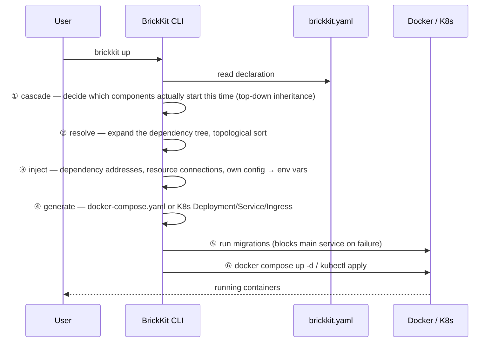

# 架构总览

BrickKit 是一个**声明式的组件管理与拼装平台**：像搭积木一样构建系统，每块积木（组件）独立开发、独立部署、独立调用。你声明有哪些组件、它们依赖什么，CLI 负责派生其余一切——顺序、地址、图纸（部署文件）——再交给 Docker 或 K8s 装好（背后的想法见[设计原则与取舍](design-principles.md)）。它**不是**操作系统，不是 ERP，也不是任何一个具体的业务软件——它是让你渐进式长出架构的工具。

## 四个部分

| 部分 | 形态 | 是否常驻 | 职责 |
| --- | --- | --- | --- |
| **BrickKit CLI** | 本地单二进制 | ❌ 用完即走 | 拉取、解析、生成、调用、发布、源码工作区管理 |
| **BrickKit Market** | 独立 SaaS（可私有化） | ✅ | 组件发布与发现、版本/可见性/签名、产物存储 |
| **组件层** | Docker 容器 / K8s Pod | ✅ | 业务本体，组件间 DNS 直连 |
| **基础设施层** | PostgreSQL / Redis 等 | ✅ | **运维手动部署**，在 `brickkit.yaml` 中声明绑定 |

四个部分里只有 CLI 不常驻——它执行完一条命令就退出，期望状态留在 `brickkit.yaml` 里，实际状态留在 Docker / K8s 里，CLI 自己不持有任何状态。

## 执行 `brickkit up` 时发生了什么



用一个仓库里真实存在的例子把这六步具体化。`erp/backend` 实际有三个强依赖（`people/basic`、`auth/password-login`、`authorization/rbac`）外加一个弱依赖，执行 `brickkit add erp/backend@1.0.0` 会把它们全部递归拉下来；为了让示例聚焦，这里只顺着其中一条依赖链往下看：[`tests/components/people-basic/`](../../../tests/components/people-basic/) 是直接依赖，[`tests/components/department-tree/`](../../../tests/components/department-tree/) 是 `people/basic` 自己的强依赖，随之一并被拉入项目（这也是——在其它依赖之外——[`tests/components/erp-backend/`](../../../tests/components/erp-backend/)、`department-tree`、`people-basic` 会一起出现在同一个 `brickkit.yaml` 里的原因）。接下来跑 `brickkit up`：

- **① cascade** 判定这三个组件都没写 `enabled`，且都处于依赖链顶端或被顶端组件需要，三个都启动；
- **② resolve** 展开依赖树、拓扑排序，得出启动顺序必须是 `department-tree` → `people-basic` → `erp-backend`（被依赖的先起）；
- **③ inject** 给 `people/basic` 写入 `DEPARTMENT_TREE_ENDPOINT=http://department-tree-1-0-0:8080`，给 `erp/backend` 写入指向 `people-basic` 的地址；
- **④ generate** 把这几个组件各自的 `component.yaml` 翻译成 `docker-compose.yaml` 里各自的 service——这只是 `erp/backend` 完整依赖树对应的那批 service 里的一部分（这一步到底翻译出了什么、两个部署目标逐字节对照，见[部署文件是怎么生成出来的](deployment-generation.md)）；
- **⑤ run migrations** 先跑 `department-tree` 和 `people-basic` 各自声明的迁移命令（`erp/backend` 没有 `migration` 字段，跳过）——`auth/password-login` 与 `authorization/rbac` 也各自声明了迁移，同样会被执行；
- **⑥** 最后 `docker compose up -d` 把这几个容器拉起来（`erp/backend` 剩下的依赖也一并起来）。

**为什么三个都启动这件事值得展开讲——背后这条规则其实有三种状态,不是一种。** 一个组件完全不写 `enabled`,意味着它"跟着上层走"：没人依赖的顶层组件默认启动,更下层的组件只要它上面有任何一个正在跑的组件需要它,就跟着启动——这正是 `department-tree` 在这里会启动的原因,哪怕这份 `brickkit.yaml` 里没有任何一行字直接提到它:只是因为 `people-basic` 需要它,而 `people-basic` 本身又被顶层的 `erp-backend` 需要。另外两种状态是显式的,会整个盖过这条"跟着走"的默认规则：`enabled: true` 把一个组件钉死成"始终启动",不管它上面发生了什么(如果它自己需要的某个强依赖被关掉了,会直接报错——两个互相矛盾的意图不可能同时成立);`enabled: false` 把它钉死成"永不启动",连带把所有依赖它的组件也一起停掉。如果这份 `brickkit.yaml` 把 `department-tree` 显式写成 `enabled: false`,而不是什么都不写,那么依赖它的 `people-basic` 在解析阶段就会直接失败——CLI 会点名报错,不会生成一份看似正常、实际会在容器启动那一刻才失败的部署清单。真实的 CLI 输出里,每一行启动决定都会带上这三种理由中的哪一种(`starting (top-level)` / `starting (enabled: true)` / `starting (X needs it)`)，因为"这行到底是哪种情况"从来不该是读者要自己从配置反推出来的东西。

其中的服务名包括 `erp-backend-1-0-0`、`department-tree-1-0-0`、`people-basic-1-0-0`——下一节说明这个名字是怎么算出来的。想看①②两个阶段更难的版本——一个真实的菱形依赖、一个真实的循环依赖、关掉一个组件会发生什么——见[依赖解析与启动顺序](dependency-resolution.md)。

## 项目目录里都有什么

`brickkit init` 在**当前目录**里生成下面这些东西。真正属于"期望状态"的只有 `brickkit.yaml` 一个文件；`.brickkit/` 是 CLI 自己的工作目录，里面每一项要么是可以重新拿回来的缓存，要么是每次 `up` 重新生成的产物，要么是登录凭据。

```
my-shop/                          ← 项目根目录
├── brickkit.yaml                 ← 项目配置：唯一的"期望状态"
├── components/                   ← 组件源码工作区（默认不提交：每个组件是独立的 Git 仓库）
│   └── .archived/                ← brickkit sync 归档的、这次不启动的组件源码
├── .brickkit/                    ← CLI 工作目录
│   ├── manifests/                ← Manifest 缓存：<组件ID>-<版本>.yaml，如 people-basic-1.0.0.yaml
│   ├── artifacts/                ← 组件附带的契约、文档等产物：<版本化服务名>/<type>/…
│   ├── generated/                ← up 生成的部署文件（勿手改，不提交）
│   ├── credentials               ← brickkit login 存下的 Token（权限 0600，不提交）
│   └── skills.lock               ← 记录 AI 助手技能文件上次是谁写的（提交）
├── .claude/skills/               ← AI 助手技能（init 装入，提交）
├── AGENTS.md                     ← AI 助手项目导读（init 装入，提交）
└── .gitignore                    ← init 追加的忽略规则
```

- **`manifests/` 与 `artifacts/` 是缓存，默认提交、团队共享同一份。** `up` 读的是 `manifests/` 里的 Manifest，不依赖 `components/` 下的源码；缺失或损坏时会从安装源重新拉取。产物由 `add` / `fetch` 下载。`init` 追加的 `.gitignore` 里对应的两行默认是注释掉的，想忽略它们就取消注释。
- **`generated/` 每次 `up` 都会重写，别手改。** 里面是 `docker-compose.yaml`（`deploy.target: k8s` 时是 `k8s/` 目录），以及 `local: true` 组件的 `local-debug.<版本化服务名>.env`。默认被 `.gitignore` 忽略——后一种文件里可能带着解析后的配置值。
- **`credentials` 只有 `brickkit login` 之后才存在**，默认被 `.gitignore` 忽略。
- **`skills.lock` 要提交**：它让别人的 CLI 分得清"你手改过这个技能文件"和"CLI 升级让它过期了"。


## 版本化服务名与统一地址格式

**服务名 = 组件 ID 转换 + 精确版本号。** 转换规则只有三条：`/` → `-`，`.` → `-`，全部小写。`erp/backend` 的 `1.0.0` 版就是 `erp-backend-1-0-0`。

地址格式在 Docker 和 K8s 下**完全一样**：`http://<版本化服务名>:<端口>`。本地是 `http://department-tree-1-0-0:8080`，换到 K8s 集群里还是这一串，组件代码不用感知自己跑在哪种环境。这条规则带来两个直接后果：**多版本天然共存**（`people-basic-1-0-0` 和 `people-basic-2-0-0` 是两个互不冲突的 DNS 名），以及**调用方永远明确知道自己调的是哪个版本**，不存在隐式升级。

真实例子胜过转换公式本身。下面是 [`tests/components/erp-backend/component.yaml`](../../../tests/components/erp-backend/component.yaml) 里 `dependencies.components` 的原文：

```yaml
dependencies:
  components:
    # 强依赖：注入 PEOPLE_BASIC_ENDPOINT（HTTP，8080）
    # 与 PEOPLE_BASIC_GRPC_ENDPOINT（gRPC，来自它声明的 extraPorts，9090）。
    # 本组件用的是后者
    - people/basic@1.0.0
    # 强依赖：注入 AUTH_PASSWORD_LOGIN_ENDPOINT
    - auth/password-login@1.0.0
    # 强依赖：注入 AUTHORIZATION_RBAC_ENDPOINT（gRPC 与 HTTP 共用主端口）
    - authorization/rbac@1.0.0
    # **弱依赖**：没装它时平台完全不注入 INFRA_REDIS_EVENT_BUS_ENDPOINT，
    # 本组件据此降级——审批照常成功，只是不发事件（003 §4.3）
    - id: infra/redis-event-bus@1.0.0
      optional: true
```

四行依赖对应四个环境变量名，全部**从组件 ID 直接算出来**（`/` 和 `-` 换成 `_`，转大写，加 `_ENDPOINT`），不需要另外声明变量名——这也是为什么 BrickKit 不支持依赖别名：变量名与组件 ID 的这条双向对应关系一旦断开，看到 `IAM_ENDPOINT` 就再也查不出它指向哪个组件了。

### 外部工具直接连组件端口

这条转换规则不只是给平台内部注入 `*_ENDPOINT` 用的。写一段独立跑的脚本或
工具（本地调试脚本、运维工具、一次性排查，不是另一个 BrickKit 组件）时，
如果要绕过某个组件自己的业务 API、直接打它的 gRPC/HTTP 端口，地址算法跟
平台内部用的是同一条：`http://<版本化服务名>:<该组件自己声明的端口>`——不
管这个组件现在是独立部署还是被 `servedBy`（见[造壳指南](../patterns/shell-implementers-guide.md)）
合并进了某个外壳都一样，因为外壳容器的网络别名用的正是这条规则算出来的
名字。外部工具完全不需要关心"这个组件现在有没有被合并""它有没有自己的
容器"。

前提是这段代码要跑在 BrickKit 管理的那个 Docker 网络内部——比如
`docker run --rm --network <项目网络名> <镜像> ...` 临时加入进去。不能假设
组件把端口发布到了宿主机：`expose: true` 只对独立部署的组件生效，
`servedBy` 成员完全不受它影响，压根不会有一个 `localhost:<端口>` 可以打。

## 平台刻意不做的事，以及为什么

| 不做 | 为什么 | 症状（绕开会看到什么） |
| --- | --- | --- |
| 常驻服务 / 控制面 | CLI 用完即走，状态外置到 `brickkit.yaml` + 底层引擎；没有后台进程就没有单点故障、不占资源、不监听端口 | 想解决"没人记得跑 `up`"这类问题而自建一个常驻编排守护进程，你就重新造出了 BrickKit 刻意躲开的那个单点故障和攻击面 |
| 注册中心 / 地址簿 | Docker Compose service DNS / K8s Service DNS 已经免费提供服务发现，不需要平台自建一套还要保证高可用的注册中心 | 组件代码里接入自制的服务发现 SDK 后，组件就不再是"零侵入"部署——它现在多依赖了一个必须自己保证在线的东西，而免费的 DNS 反而被绕开了 |
| API 网关 / 服务网格 / 负载均衡 | 组件间走 DNS 直连，K8s Service 自带负载均衡；网关路由规则因业务而异，平台强行统一只会削足适履 | 绕开平台自带的 `labels` 透传、自己手写一份包含版本化服务名的 Traefik file-provider 配置，组件一升级版本这份配置就静默过期——平台不会提醒你 |
| 版本范围解析（`^1.0.0`） | 范围版本是"我机器上能跑，生产上炸"的常见原因；精确版本还能让版本号直接拼进服务名，多版本共存零成本 | 在 `dependencies` 或 `brickkit.yaml` 里写 `^1.0.0` / `~1.0.0` / `latest`，CLI 在解析阶段就直接报错拒绝——不会拖到运行时才暴露 |
| 多环境 overlay / 继承合并 | overlay 要求先脑补"基础层 / 覆盖层 / 合并规则"才看得懂最终配置，Git diff 也看不出改动会不会波及其它环境 | 想用 `base.yaml` + `prod-overlay.yaml` 复用配置，省下的只是少打几行字，代价是改 base 层时无法一眼确认哪些环境被静默影响——CLI 也不提供合并这类文件的命令 |
| config 值类型校验 | 一旦开始校验值就要一路问下去要不要校验 `enum`、`minimum`、`pattern`；组件自治，报错还是用默认值该由组件自己决定 | `configSchema` 里声明 `type: integer` 的项被填成字符串，CLI 不会拦；组件代码拿到字符串去 `int()` 才崩溃——发现的时间点是运行时，不是 `brickkit up` 那一刻 |
| 弱依赖降级逻辑 | Redis 挂了是查数据库、返回空列表还是写本地文件重试，是纯业务判断，不同组件的正确答案完全不同 | 指望平台"自动"处理弱依赖故障什么都不会发生——平台唯一的动作是完全不注入对应的 `*_ENDPOINT`；组件代码若用 `os.environ["X"]` 直接读会立刻抛 `KeyError` 崩溃（这是刻意的，比静默注入空字符串更安全） |
| 健康检查轮询 | K8s Probes 和 Docker Compose 自带的 `healthcheck` + 重启策略已经原生解决了这件事；平台自己实现一套轮询要么得有一个后台进程（回到这份清单开头那个"常驻服务"问题），要么得让每个组件都嵌入一份客户端库 | 让某个组件在自己的健康检查里顺手也去探一下某个依赖的 `/healthz`——你就复刻出了平台自己那条"健康检查只能反映自己、绝不能反映下游依赖"规则本来要防的那种雪崩：一个依赖一抖，所有上游瞬间集体被判定不健康、一起重启 |
| 通信治理（熔断/限流/重试） | 重试的退避策略、熔断阈值因业务而异，平台统一给一个默认值既很难对所有场景都合适，也会限制某个组件真正需要的灵活度 | 等着平台替某个组件的失败调用自动重试，什么都不会发生——一次瞬时网络抖动会直接以未处理异常的形式冒出来，因为重试/退避逻辑从来就不是平台的职责 |
| 多租户 | 到底用"共享表+租户列"、"每租户一个 schema"还是"每租户一个数据库"隔离，是业务/领域判断，不存在一个适合所有组件数据模型的通用答案 | 在 `brickkit.yaml` 或某个组件的 Manifest 里找 `tenant_id` 之类的隔离开关，找不到——租户隔离完全是每个组件自己 schema 和业务逻辑内部的事 |
| 第三方组件安全审查 | 跟 npm、VS Code 插件市场、GitHub 同一套信任模型：安装就是信任。事前扫描不是漏报太多（放过精心伪装的恶意代码）就是误报太多（拦下正常组件） | 以为市场上的每个组件发布前都经过了某种安全审计，其实没有——`brickkit add` 本身不做任何扫描；真正的执行手段只有事后：确认某个组件确实是恶意的之后把它标成 `blocked` |

---

想了解这些决策背后的原则、以及每一条的论证，看[设计原则与取舍](design-principles.md)；二十三个"为什么"在 [`AGENTS.zh.md`](../../../AGENTS.zh.md) 第 9 节。想查某个字段或命令的完整参考，看 [component.yaml 字段完整参考](component-yaml-reference.md)、[brickkit.yaml 字段完整参考](brickkit-yaml-reference.md)与 [CLI 命令完整参考](cli-reference.md)。
