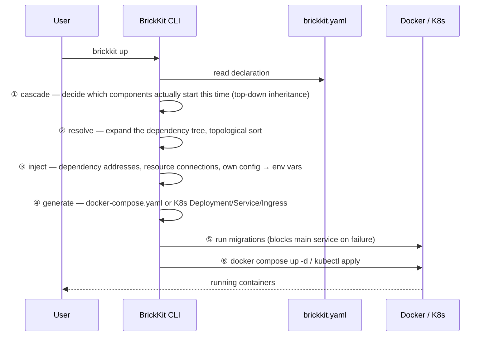

# 架构总览

BrickKit 是一个**组件管理与拼装平台**：像搭积木一样构建系统，每块积木（组件）独立开发、独立部署、独立调用，CLI 只负责把它们拉来、排好顺序、生成图纸、交给 Docker 或 K8s 装好。它**不是**操作系统，不是 ERP，也不是任何一个具体的业务软件——它是让你渐进式长出架构的工具。

## 四个部分

| 部分 | 形态 | 是否常驻 | 职责 |
| --- | --- | --- | --- |
| **BrickKit CLI** | 本地单二进制 | ❌ 用完即走 | 拉取、解析、生成、调用、发布、源码工作区管理 |
| **BrickKit Market** | 独立 SaaS（可私有化） | ✅ | 组件发布与发现、版本/可见性/签名、产物存储 |
| **组件层** | Docker 容器 / K8s Pod | ✅ | 业务本体，组件间 DNS 直连 |
| **基础设施层** | PostgreSQL / Redis 等 | ✅ | **运维手动部署**，在 `brickkit.yaml` 中声明绑定 |

四个部分里只有 CLI 不常驻——它执行完一条命令就退出，期望状态留在 `brickkit.yaml` 里，实际状态留在 Docker / K8s 里，CLI 自己不持有任何状态。

## 执行 `brickkit up` 时发生了什么



用一个仓库里真实存在的例子把这六步具体化。`erp/backend` 实际有三个强依赖（`people/basic`、`auth/password-login`、`authorization/rbac`）外加一个弱依赖，执行 `brickkit add erp/backend@1.0.0` 会把它们全部递归拉下来；为了让示例聚焦，这里只顺着其中一条依赖链往下看：[`tests/components/people-basic/`](../../../tests/components/people-basic/) 是直接依赖，[`tests/components/department-tree/`](../../../tests/components/department-tree/) 是 `people/basic` 自己的强依赖，随之一并被拉入项目（这也是——在其它依赖之外——[`tests/components/erp-backend/`](../../../tests/components/erp-backend/)、`department-tree`、`people-basic` 会一起出现在同一个 `brickkit.yaml` 里的原因）。接下来跑 `brickkit up`：

- **① cascade** 判定这三个组件都没写 `enabled`，且都处于依赖链顶端或被顶端组件需要，三个都启动；
- **② resolve** 展开依赖树、拓扑排序，得出启动顺序必须是 `department-tree` → `people-basic` → `erp-backend`（被依赖的先起）；
- **③ inject** 给 `people/basic` 写入 `DEPARTMENT_TREE_ENDPOINT=http://department-tree-1-0-0:8080`，给 `erp/backend` 写入指向 `people-basic` 的地址；
- **④ generate** 把三个组件各自的 `component.yaml` 翻译成 `docker-compose.yaml` 里的三个 service；
- **⑤ run migrations** 先跑 `department-tree` 和 `people-basic` 各自声明的迁移命令（`erp/backend` 没有 `migration` 字段，跳过）；
- **⑥** 最后 `docker compose up -d` 把这几个容器拉起来（`erp/backend` 剩下的依赖也一并起来）。

服务名分别是 `erp-backend-1-0-0`、`department-tree-1-0-0`、`people-basic-1-0-0`——下一节说明这个名字是怎么算出来的。

## 版本化服务名与统一地址格式

**服务名 = 组件 ID 转换 + 精确版本号。** 转换规则只有三条：`/` → `-`，`.` → `-`，全部小写。`erp/backend` 的 `1.0.0` 版就是 `erp-backend-1-0-0`。

地址格式在 Docker 和 K8s 下**完全一样**：`http://<版本化服务名>:<端口>`。本地是 `http://department-tree-1-0-0:8080`，换到 K8s 集群里还是这一串，组件代码不用感知自己跑在哪种环境。这条规则带来两个直接后果：**多版本天然共存**（`people-basic-1-0-0` 和 `people-basic-2-0-0` 是两个互不冲突的 DNS 名），以及**调用方永远明确知道自己调的是哪个版本**，不存在隐式升级。

真实例子胜过转换公式本身。下面是 [`tests/components/erp-backend/component.yaml`](../../../tests/components/erp-backend/component.yaml) 里 `dependencies.components` 的原文：

```yaml
dependencies:
  components:
    # 强依赖：注入 PEOPLE_BASIC_ENDPOINT（HTTP，8080）
    # 与 PEOPLE_BASIC_GRPC_ENDPOINT（gRPC，来自它声明的 extraPorts，9090）。
    # 本组件用的是后者
    - people/basic@1.0.0
    # 强依赖：注入 AUTH_PASSWORD_LOGIN_ENDPOINT
    - auth/password-login@1.0.0
    # 强依赖：注入 AUTHORIZATION_RBAC_ENDPOINT（gRPC 与 HTTP 共用主端口）
    - authorization/rbac@1.0.0
    # **弱依赖**：没装它时平台完全不注入 INFRA_REDIS_EVENT_BUS_ENDPOINT，
    # 本组件据此降级——审批照常成功，只是不发事件（003 §4.3）
    - id: infra/redis-event-bus@1.0.0
      optional: true
```

四行依赖对应四个环境变量名，全部**从组件 ID 直接算出来**（`/` 和 `-` 换成 `_`，转大写，加 `_ENDPOINT`），不需要另外声明变量名——这也是为什么 BrickKit 不支持依赖别名：变量名与组件 ID 的这条双向对应关系一旦断开，看到 `IAM_ENDPOINT` 就再也查不出它指向哪个组件了。

## 平台刻意不做的事，以及为什么

| 不做 | 为什么 | 症状（绕开会看到什么） |
| --- | --- | --- |
| 常驻服务 / 控制面 | CLI 用完即走，状态外置到 `brickkit.yaml` + 底层引擎；没有后台进程就没有单点故障、不占资源、不监听端口 | 想解决"没人记得跑 `up`"这类问题而自建一个常驻编排守护进程，你就重新造出了 BrickKit 刻意躲开的那个单点故障和攻击面 |
| 注册中心 / 地址簿 | Docker Compose service DNS / K8s Service DNS 已经免费提供服务发现，不需要平台自建一套还要保证高可用的注册中心 | 组件代码里接入自制的服务发现 SDK 后，组件就不再是"零侵入"部署——它现在多依赖了一个必须自己保证在线的东西，而免费的 DNS 反而被绕开了 |
| API 网关 / 服务网格 / 负载均衡 | 组件间走 DNS 直连，K8s Service 自带负载均衡；网关路由规则因业务而异，平台强行统一只会削足适履 | 绕开平台自带的 `labels` 透传、自己手写一份包含版本化服务名的 Traefik file-provider 配置，组件一升级版本这份配置就静默过期——平台不会提醒你 |
| 版本范围解析（`^1.0.0`） | 范围版本是"我机器上能跑，生产上炸"的常见原因；精确版本还能让版本号直接拼进服务名，多版本共存零成本 | 在 `dependencies` 或 `brickkit.yaml` 里写 `^1.0.0` / `~1.0.0` / `latest`，CLI 在解析阶段就直接报错拒绝——不会拖到运行时才暴露 |
| 多环境 overlay / 继承合并 | overlay 要求先脑补"基础层 / 覆盖层 / 合并规则"才看得懂最终配置，Git diff 也看不出改动会不会波及其它环境 | 想用 `base.yaml` + `prod-overlay.yaml` 复用配置，省下的只是少打几行字，代价是改 base 层时无法一眼确认哪些环境被静默影响——CLI 也不提供合并这类文件的命令 |
| config 值类型校验 | 一旦开始校验值就要一路问下去要不要校验 `enum`、`minimum`、`pattern`；组件自治，报错还是用默认值该由组件自己决定 | `configSchema` 里声明 `type: integer` 的项被填成字符串，CLI 不会拦；组件代码拿到字符串去 `int()` 才崩溃——发现的时间点是运行时，不是 `brickkit up` 那一刻 |
| 弱依赖降级逻辑 | Redis 挂了是查数据库、返回空列表还是写本地文件重试，是纯业务判断，不同组件的正确答案完全不同 | 指望平台"自动"处理弱依赖故障什么都不会发生——平台唯一的动作是完全不注入对应的 `*_ENDPOINT`；组件代码若用 `os.environ["X"]` 直接读会立刻抛 `KeyError` 崩溃（这是刻意的，比静默注入空字符串更安全） |

---

想深挖某条设计决策当初的完整论证，看 [`docs/archive/design/012-架构设计原理与考量.md`](../../archive/design/012-架构设计原理与考量.md)（历史记录）；想查某个字段或命令的完整参考，看 `AGENTS.md` 第 6、7、8 节（`component.yaml` 骨架、`brickkit.yaml` 骨架、CLI 命令集）。
