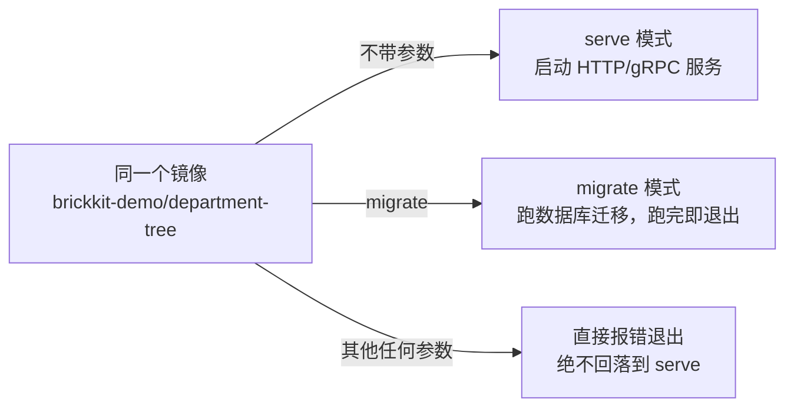

# 用 Go 写一个 BrickKit 组件：完整走一遍

这篇不是从零编一个玩具组件，而是逐段拆解仓库里已经真实存在、被自己的测试套件（`component_test.go`、`migrate_test.go`）和 `make test-components-integration` 覆盖的 [`tests/components/department-tree/`](../../tests/components/department-tree/)——一个依赖 PostgreSQL、带数据库迁移的真实 Go 组件。看完这篇，你会知道一个"规规矩矩"的 Go 组件长什么样、为什么每一处都是那样写的，以及怎么把它改成你自己的组件。

下面所有命令和输出都是真跑出来的（构建镜像、起数据库、`brickkit up`、curl、看日志），不是凭记忆写的。

## 组件长什么样

```
department-tree/
├── component.yaml       # Manifest
├── Dockerfile            # 多阶段构建
├── go.mod / go.sum
├── main.go               # 入口：serve / migrate 两种模式
├── config.go              # 只从环境变量读配置
├── server.go / service.go / store.go   # HTTP 层 / 业务层 / 数据访问层
├── migrate.go             # 迁移引擎（go:embed 打包 SQL）
├── migrations/
│   ├── 0001_init.up.sql / .down.sql
│   └── 0002_seed_departments.up.sql / .down.sql
├── openapi.json           # HTTP 接口文档（作为 artifacts 发布）
├── proto/department/v1/department.proto   # gRPC 契约（同上）
└── *_test.go
```

这个组件同时演示了单端口 HTTP+gRPC、迁移、api-contract/api-docs 产物——你自己的组件不需要全都要，挑用得上的部分抄就行。

## component.yaml：先声明"我是什么"

```yaml
apiVersion: brickkit/v1
kind: Component

metadata:
  id: department/tree
  name: 部门树
  version: 1.0.0
  description: 提供组织架构（部门树）的查询能力，HTTP 与 gRPC 双协议共用同一端口

dependencies:
  resources:
    - kind: database
      engine: postgresql

configSchema:
  type: object
  properties:
    logLevel:
      type: string
      default: "info"
      description: 日志级别，注入为环境变量 LOG_LEVEL

migration:
  command: ["/app/department-tree", "migrate"]

deployment:
  type: container
  image: brickkit-demo/department-tree:1.0.0
  port: 8080
  resources:
    requests: { cpu: "50m", memory: "32Mi" }   # 只写 requests，不写 limits——见 AGENTS.md §6 的资源配额说明

healthCheck:
  type: http
  path: /healthz
```

这是一个**叶子组件**：`dependencies.components` 完全没写，只声明了一个 `database` 资源。`configSchema` 只有一个字段——不需要为了显得完整而堆配置项，用得上多少写多少。

## main.go：一个二进制，两种模式

```go
const (
	modeServe   = "serve"
	modeMigrate = "migrate"
)

func parseArgs(args []string) (mode string, rest []string, err error) {
	if len(args) == 0 {
		return modeServe, nil, nil
	}
	if args[0] == modeMigrate {
		return modeMigrate, args[1:], nil
	}
	return "", nil, errors.New(
		"未知的参数：" + args[0] + "（可用：不带参数启动服务 | migrate [down [n] | reset]）")
}
```



`component.yaml` 的 `migration.command` 和主服务用的是**同一个镜像**，靠这个命令行参数区分。这里最容易踩的坑，也是这段代码专门要防住的：**不认识的参数必须直接报错，绝不能回落到"那就启动服务吧"。** 一个拼错的迁移命令如果被静默当成启动服务处理，迁移容器就会变成一个永不退出的服务容器——主服务永远等不到"迁移完成"，整个项目卡在 `Created` 状态，而这个容器自己的日志还写着"组件已就绪"，看起来一切正常。`parseArgs` 是个纯函数，不读环境变量、不连数据库：**先确认参数写对了，再去连一个可能根本连不上的数据库**，不要在报错信息里把"参数错了"和"数据库连不上"混在一起。

## 配置：只从环境变量读

```go
type config struct {
	ComponentID string
	Version     string
	LogLevel    string
	Database    databaseConfig
}
```

组件不读配置文件、不接受命令行参数配置数据库（`migrate`/`down`/`reset` 是操作模式，不是配置）、不知道也不该知道自己被部署在哪。`DATABASE_HOST`/`DATABASE_NAME`/`DATABASE_USER` 缺失时**启动即失败**并列出缺了哪几个，不会静默退化到 `localhost`——退化到一个看似合理的默认值，是让人在生产环境里对着一个连错库的组件排查半天的经典原因。

## 迁移：go:embed + 每组件独立的主键

```go
//go:embed migrations/*.sql
var migrationFiles embed.FS

const schemaMigrationsTable = `
CREATE TABLE IF NOT EXISTS schema_migrations (
	component_id TEXT NOT NULL,
	version      TEXT NOT NULL,
	applied_at   TIMESTAMPTZ NOT NULL DEFAULT NOW(),
	PRIMARY KEY (component_id, version)
)`
```

两处值得抄的设计：

1. **`go:embed` 把 SQL 文件打进二进制**，而不是在运行时读磁盘上的目录——迁移脚本和业务代码永远是同一个版本，不可能出现"镜像里漏了一个 SQL 文件"。
2. **`schema_migrations` 的主键是 `(component_id, version)`，不是单独的 `version`。** 这是真的在多组件共用一个数据库时测出来的问题：如果主键只有 `version`，两个组件都有一个 `0001_init`，先跑的那个会把后跑的顶掉，后者的表根本建不出来。

三条不变量（`migrate_test.go` 锁死）：**幂等**（容器每次重启都会重跑一遍迁移命令，已经执行过的版本必须什么都不做）、**原子**（每条迁移和它的版本记录在同一个事务里，失败整条回滚）、**有序**（向上按版本递增，失败就中止，不允许跳过继续）。

## Dockerfile：多阶段构建，非 root 运行

```dockerfile
FROM golang:1.22-alpine AS build
WORKDIR /src
COPY go.mod go.sum ./
RUN go mod download
COPY . .
RUN CGO_ENABLED=0 go build -trimpath -ldflags="-s -w" -o /out/department-tree .

FROM alpine:3.20
RUN adduser -D -u 10001 brickkit
COPY --from=build /out/department-tree /app/department-tree
USER 10001
EXPOSE 8080
ENTRYPOINT ["/app/department-tree"]
```

编译期用完整的 `golang` 镜像，运行期只留一个静态二进制——运行时镜像里没有 Go 工具链、没有源码。`USER 10001` 不是可选项：组件容器不能以 root 运行。

## 健康检查：只查自己，不查数据库

```yaml
healthCheck:
  type: http
  path: /healthz
```

`/healthz` 的 handler 只返回"这个进程还活着"，**不会**去 ping 数据库。这是刻意的：如果健康检查连带检查数据库，数据库一抖动，所有依赖它的组件会同时被判定为不健康、同时被重启——一次下游故障变成一次级联故障。数据库连不上应该让业务接口报错，不应该让健康检查报错。

## 真跑一遍

**1. 构建镜像**

```bash
docker build -t brickkit-demo/department-tree:1.0.0 tests/components/department-tree
```

**2. 起一套本地开发用的 PostgreSQL**（仓库自带这份栈，不用自己拼 compose 文件）：

```bash
PG_PORT=55432 PG_USER=demo docker compose -f deploy/dev-resources/docker-compose.yaml up -d postgres
docker exec brickkit-dev-resources-postgres-1 psql -U demo -c "CREATE DATABASE brickkit_department"
```

**3. 配置 `brickkit.yaml`**（起本地开发资源栈时，资源要走 `host.docker.internal`，不是容器名——原因和 `deploy/dev-resources/docker-compose.yaml` 顶部注释解释的一样：这套资源栈和你的 BrickKit 项目不在同一张 Docker 网络上）：

```yaml
components:
  - id: department/tree
    version: 1.0.0
    expose: true
    exposePort: 8080

resources:
  - kind: database
    engine: postgresql
    id: postgres-main
    host: host.docker.internal
    port: 55432
    username: demo
    password: ${PG_PASSWORD}
    bindings:
      - componentId: department/tree
        database: brickkit_department
```

配错的话 `brickkit up --dry-run` 会在生成阶段就提醒你（这是真实报出来的警告，不是编的）：

```
⚠️ 基础资源的 host 看起来是个服务名，容器里可能解析不了
   资源：postgres-main
   host：brickkit-template-pg
   原因：平台不部署基础资源（006 §9.1），compose 里不会有叫这个名字的 service
   建议：
   1. 资源跑在本机时写 host: host.docker.internal（平台会自动补 extra_hosts）
   2. 资源跑在别处时写它的 IP 或域名
   3. 确实已经手工把该容器接进了本项目网络的话，这条提醒可以忽略
```

**4. 启动**

```bash
brickkit up
```

```
🚀 启动项目 dept-demo（deploy.target: docker）
📋 组件状态计算：
   ✅ department/tree@1.0.0  启动（顶层）

📋 启动顺序（拓扑排序）：
   1. department-tree-1-0-0  无依赖

📌 以下基础资源需要先跑起来（平台不代为部署，见 006 §9.1）：
   postgres-main postgresql   host.docker.internal:55432  供 department/tree 使用
      需要库 brickkit_department（供 department/tree 使用）：CREATE DATABASE "brickkit_department";

🔧 启动前会执行的数据库迁移（失败则该组件不会启动）：
   department/tree@1.0.0  /app/department-tree migrate

🔍 检测镜像拉取权限... ✅ 全部通过

🐳 正在启动（docker）...
   department-tree-1-0-0        running（healthy）
✅ 全部组件已启动（1 个）
```

迁移容器的真实日志（结构化 JSON，写到 stdout）：

```
{"time":"...","level":"INFO","msg":"开始执行数据库迁移","componentId":"department/tree","config":"component=department/tree@1.0.0 database=host.docker.internal:55432/brickkit_department user=demo logLevel=info"}
{"time":"...","level":"INFO","msg":"迁移完成","componentId":"department/tree"}
```

**5. 访问**（`0002_seed_departments.up.sql` 已经写了几条初始数据）：

```bash
curl -s http://localhost:8080/api/v1/departments
```

```json
{
  "departments": [
    {"id": "d-backend", "name": "后端组", "parentId": "d-tech", "level": 3},
    {"id": "d-hr", "name": "人力资源部", "parentId": "d-root", "level": 2},
    {"id": "d-root", "name": "总公司", "parentId": "", "level": 1},
    {"id": "d-tech", "name": "技术中心", "parentId": "d-root", "level": 2}
  ],
  "total": 4
}
```

**6. 验证幂等**：再跑一次 `brickkit up`，迁移容器会重新执行 `migrate`，日志里还是那两行"开始执行"/"迁移完成"，`schema_migrations` 表里不会多出重复记录——这就是上面说的"幂等"在真实运行时的样子。

**7. 收尾**

```bash
brickkit down
docker compose -f deploy/dev-resources/docker-compose.yaml down -v
```

## 改成你自己的组件

1. `component.yaml`：换 `metadata.id`/`version`，按需增删 `dependencies`/`configSchema`
2. `main.go` 的 `parseArgs`：保留"不认识的参数直接报错"这条，其余随意
3. `config.go`：只从环境变量读，缺必需项就启动失败，不要退化到默认值
4. `migrations/`：文件名 `<版本>.up.sql`/`<版本>.down.sql` 成对，`schema_migrations` 的主键带上组件 ID
5. `Dockerfile`：多阶段构建、非 root 用户、`ENTRYPOINT` 直接指向二进制
6. `healthCheck`：只检查进程自己，不查数据库/依赖组件

## 深入阅读

- [组件设计准则](patterns/component-design.md) —— 动手写之前先做的领域研究
- [分层测试](patterns/testing.md) —— `component_test.go`/`migrate_test.go` 对应哪几层
- [部署文件生成](architecture/deployment-generation.md) —— `component.yaml` 怎么变成上面看到的那份 compose 文件
- [核心概念](concepts.md) —— 服务名、环境变量注入这些贯穿全平台的规则
