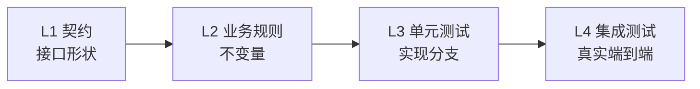
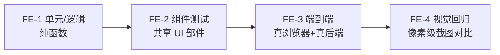

# 基于 BrickKit 的组件该怎么分层测试

这是一份**推荐实践**，不是 BrickKit 平台的强制规范。BrickKit 本身不管一个组件内部怎么测试——组件自治是 [`AGENTS.md`](../../../AGENTS.md) 十二条设计原则之一，语言、框架、API、事务、日志格式都由组件自己定，平台只要求 Manifest、健康检查、环境变量这三件事，测试策略从来不在平台的管辖范围内。这份文档整理的是一个真实生产部署——14 个组件（含前端应用）、覆盖一条完整业务闭环——在实践中验证过、并反馈回来的测试分层方法论，供任何"基于 BrickKit 拼装项目"的团队参考；用不用、怎么用，由你自己判断。BrickKit 对前端组件跟其它组件一视同仁（AGENTS.md §9.10——前端也是一个带端口、带健康检查的容器，没有区别对待），所以这份方法论也覆盖两边：下面先是后端组件的四层，再往后是前端组件自己的四层。

## 后端：四层测试，加两个跨领域类别



| 层 | 检验对象 | 具体内容 |
| --- | --- | --- |
| **L1 契约测试** | 接口对外的形状 | 契约本身没有产生破坏性变更；每一个接口在跨进程调用下真的能被调通——走真实协议、真实序列化，不是本地函数直接调用能过就算数 |
| **L2 业务规则测试** | 这个功能应该具备的性质 | 不变量（例如余额不能为负）、合法的状态迁移路径、幂等性、边界情况 |
| **L3 单元测试** | 这一版实现的分支 | 当前代码实际走过的每条分支、每个条件判断、每条异常路径 |
| **L4 集成测试** | 端到端的真实链路 | 接真实数据库、真实消息队列，从请求进来到最终落库或发消息，全程跑一遍 |

除了这四层，还有两个**跨领域类别**——它们不是排在 L4 后面的"第五层"，而是要求在四层的每一层写测试时都顺带覆盖到：

| 跨领域类别 | 覆盖什么 |
| --- | --- |
| **权限/数据范围边界测试** | 不同身份、不同归属范围下应该看到的数据边界——写契约测试、业务规则测试、单元测试、集成测试的任何一层时都要带上这个维度，而不是单独关起来测一次就算完事 |
| **跨组件测试** | 调用其它组件时验证走的是真实依赖而不是替身——具体判据见下文"跨组件测试：打真实依赖，而不是 mock"一节 |

## 区分 L2 与 L3 的判据

L2 和 L3 最容易混淆——两者看起来都在测"这个功能对不对"。区分它们只需要一条判据：

> 把这个功能的实现整个删掉，换一种语言从头重写，这条测试还应该成立吗？应该成立 → L2；不应该成立 → L3。

举例："同一个幂等键的两次请求只会留下一条记录"这条断言，换 Go 写、换 Python 写，都必须继续成立——它测的是业务规则本身，是 L2。而"金额字段被解析成 `Decimal` 而不是 `float`"这条断言，只对当前这一版具体实现有意义，换一种语言、换一种数据类型选择，这条测试可能连提法都不再成立——它是 L3。

## 一个真实生产部署踩过的两个陷阱

**陷阱一：幂等性测试只测"重放一次"**

| 不许 | 症状 | 正确做法 |
| --- | --- | --- |
| 只测试单个请求的串行重放（发一次，再重发一次，断言两次结果一致） | 一个"先 `SELECT` 判断是否存在、不存在再 `INSERT`"的实现，在两个并发请求恰好都落进"还没查到"这段窗口期时，会各自执行一次插入，产生两条重复记录。串行重放的测试永远不会撞进这个时间窗口，所以永远抓不到这个 bug，测试稳定全绿 | 换成一条原子操作，例如 `INSERT ... ON CONFLICT DO NOTHING`（或数据库对应的原子写入方式）；测试用例里必须包含"多个并发请求带着同一个幂等键同时到达，只有一个真正执行"这个场景，而不是只测串行重放 |

**陷阱二：权限边界测试只测两端**

| 不许 | 症状 | 正确做法 |
| --- | --- | --- |
| 只测试"有权限的人能看到该看的数据"和"零权限的人完全看不到任何数据"这两个极端 | 假设某段实现的权限校验分支写错了，直接返回了整张表的数据：零权限用户根本走不到这段代码（在更早的地方就被拦下了），有权限用户看到的数据本身也没错（他确实应该看到这些行，只是顺带看到了不该看的别人的行）——于是这两条极端测试都稳定通过，bug 完全没暴露 | 真实构造两条归属不同范围的数据（例如分别属于不同的 `owner`/`department`/`warehouse`），用其中一个身份去查询，断言返回结果里完全不包含另一个身份归属的数据行——而不是只断言"返回非空"或"返回为空" |

## 跨组件测试：打真实依赖，而不是 mock

判断一个跨组件测试写得对不对，只看三条：

1. **优先通过依赖组件的真实接口现场产出数据**，而不是绕开接口直接读写依赖组件的存储；
2. **依赖组件的契约里如果没有产出这份数据所需的能力，先把这个能力补进依赖组件的契约里**——不是绕开契约，也不是拿原生 SQL 直接写依赖组件的数据库；
3. **mock 最多能证明"调用确实发生了"**（参数对不对、被调用了几次），永远证明不了"调用之后的结果对不对"——这一点只有真实拉起依赖组件才能验证。

## 让 AI 写组件：先立规格，再写实现

这一节和上面几节不一样：上面每一节都来自一次真实生产部署的复盘，这一节是**推荐的工作顺序**，没有同样的实战背书。它只做一件事——把上面的四层测试，和 BrickKit 自己提供的一个不用起容器就能跑的检查，按"规格先于实现"的次序串起来。用不用、怎么调整，由你判断。

**为什么顺序重要。** 让 AI 先写实现、再回头补测试，测试就会变成对已经写好的代码的复述：它验证的是"代码做了它做的事"，而不是"代码该做什么"。想让测试真的有约束力，得先有一份**不依赖实现**的规格。BrickKit 的组件恰好有三份，都写在 `component.yaml` 里，不用读一行实现代码就能拿到：

| 规格 | 在哪 | 约束什么 |
| --- | --- | --- |
| 配置说明书 | `configSchema` | 组件会从环境变量里读哪些键、默认值是什么、哪些必填 |
| 依赖声明 | `dependencies` | 组件会收到哪些 `*_ENDPOINT`（弱依赖没在跑时**不会**注入，见[环境变量注入契约](../architecture/environment-variables.md)） |
| 接口契约 | `artifacts` 里的契约文件（OpenAPI、protobuf 等，见[消费别人的组件](../guide/07-consuming-artifacts.md)） | 组件对外说了什么 |

推荐的顺序：

| 步 | 做什么 | 怎么知道这一步对了 | 要起容器吗 |
| --- | --- | --- | --- |
| 1 | 先把 `component.yaml` 写完整：`dependencies`、`configSchema`（键名、默认值、`required`）、契约文件 | `brickkit up --dry-run`（见下） | 否 |
| 2 | 照契约文件写 L1 契约测试 | 此时必须全红——红得有理由（接口还没实现）。第一次运行就绿，说明这条测试什么都没测到 | 否 |
| 3 | 把 L2 的每条业务规则先写成一句话，再翻成测试（示例见下） | 同样必须先红 | 否 |
| 4 | 让 AI 写实现，直到 L1、L2 全绿 | 测试就是验收，不需要人逐行读实现 | 否 |
| 5 | 补 L3：当前这版实现的各条分支 | 分支都走到 | 否 |
| 6 | 跑 L4：`brickkit up` 起真实依赖，走一遍真实链路 | 端到端跑通 | 是 |

**第 1 步的检查是 BrickKit 独有的。** `brickkit up --dry-run` 不启动任何东西，但注入阶段的检查照常运行，`component.yaml` 与 `brickkit.yaml` 对不上的地方在这里就会暴露。下面是对着 `demo/hello` 夹具、故意把配置键 `greeting` 写成 `greetting` 时的真实输出（节选）：

```
⚠️ config 里有配置项不会生效：组件 demo/hello 的 greetting
   配置项：greetting
   原因：组件的 configSchema 里没有这一项，是不是想写 greeting？
   影响：这一项不会被注入任何环境变量；组件会使用它自己的默认值
```

同一条路上还会拦下：配置项名撞上平台保留变量（警告）；`configSchema.required` 里的键既没有默认值、也没被项目覆盖（**阻断**——`--dry-run` 也一样以退出码 1 拒绝往下走）。完整的报错文案见[环境变量注入契约](../architecture/environment-variables.md)第五节。

**第 3 步的写法示例。** 把规则先写成"给定……当……则……"的一句话，再翻成测试。上面"陷阱一"里那条幂等性规则，写出来是这样：

> 给定一个还没处理过的幂等键；当两个带着同一个幂等键的请求同时到达；则只有一个真正执行，另一个拿到同一份结果。

这句话本身就是给 AI 最精确的提示，而且它直接指向串行重放测不到的那个并发窗口。

其余各步在任何带测试的项目里都成立，不是 BrickKit 特有的；这一节真正给 BrickKit 加上的只有一处：第 1 步那个不用起容器、也不用写一行实现就能跑的检查。

## 前端：自己的四层

跟上面后端四层同一套思路——规格与实现分开、共享的东西比业务专属的东西优先级更高、真实环境优于模拟环境——只是工具和边界不一样：



| 层 | 检验对象 | 具体内容 |
| --- | --- | --- |
| **FE-1 单元/逻辑测试** | 逻辑本身算得对不对 | 纯函数、组合式函数（composable）、状态管理（store）——网络请求全部 mock 掉，不关心真实网络往返、不关心界面渲染 |
| **FE-2 组件测试** | 单个共享组件本身 | 被多个业务页面复用的共享 UI 组件（表格、表单模板、通用卡片这一类）——改坏一个共享组件等于同时改坏所有引用它的页面，这类组件的优先级天然高于某个业务页面自己专属的一次性组件 |
| **FE-3 端到端测试** | 完整业务流程，真跑一遍 | 真浏览器 + 真后端（完整装配跑起来），不是某个孤立的界面交互。按"验证的业务流程"命名测试，不按"点了哪个按钮"命名，这样才能按流程筛选 |
| **FE-4 视觉回归测试** | 不同页面之间间距、密度、组件用法是否一致 | 端到端测试流程走到关键页面时顺手做一次像素级截图对比，不是另外起一遍浏览器单独跑一套"纯截图"测试。基线随有意的界面改动一起更新 |

**FE-3/FE-4 何时开始写**：等页面的交互形态基本稳定下来再批量补。页面还在被大幅调整的阶段，每一次界面改动都要连带改一遍选择器和断言，这时候投入的性价比很低。骨架和目录约定提前定好，真正开始写的时候直接往里填，不用重新设计。

**⚠️ 执行 FE-3 或 FE-4 之前必须先获得用户明确同意，不能自作主张直接跑。** 这条判据不针对某个具体工具（Playwright/Cypress/Selenium/Puppeteer 成本量级都差不多）——贵的是"AI 需要真实驱动浏览器、通过截图或读取渲染后 DOM 来调试选择器、排查失败原因"这件事本身。动手之前先告诉用户这次打算测试的具体范围（哪条业务流程、覆盖哪些页面/断言），再等用户确认要不要现在就跑、跑多大范围。成本主要来自"写/调试"阶段而不是"运行"阶段：已经写好、稳定的测试套件跑一遍，走文本形式的测试报告，成本跟普通单元测试相近。降低首次编写成本的做法：优先用无障碍树快照（结构化文本）确认页面元素，而不是每次都截整页图去"看"；失败时先看纯文本错误堆栈，排查不出来才动用截图；关键操作路径尽量由人录制，减少 AI 盲猜选择器反复试错的轮次。视觉回归的比对环节本身是自动化像素级 diff，产出"通过/不通过 + 差异百分比"这种文本结果；真正需要动用视觉理解能力的，只有比对失败之后判断"这处差异是真 bug 还是预期的界面调整"这一步。

**一个真实生产部署踩过的陷阱——正常的"后端拒绝了"路径没接住导致的未捕获异常：**

| 不许 | 症状 | 正确做法 |
| --- | --- | --- |
| 把页面的数据加载函数写成 `try { await load() } finally { ... }`，不带 `catch`——理由是 FE-1 里 mock 的后端永远成功，好像"正常路径"就是唯一路径 | 面对一个真的会合法拒绝请求的真实后端（真实权限校验返回 403、一个校验错误、连接中断），这次 reject 就变成一条没人接住的未捕获异常——控制台报出一条框架级警告，页面停在空白或加载态，用户看不到任何提示。FE-1 里 mock 的后端从来不会真的失败，永远触发不到这条路径 | 给每个页面的加载/刷新函数补上明确的 `catch`，展示一个看得见的错误状态——弹窗提示、行内错误信息、或一个兜底界面。后端拒绝是前端本该处理的正常结果，不是可以跳过不管的例外情况——这正是为什么 FE-3 必须打真实后端：再怎么 mock 也测不出"真实拒绝到底有没有被正确处理"这类 bug |

**前端契约漂移：靠机制杜绝，不靠多写测试。** 手写的前端类型定义，注释里写着"逐字对应后端契约"，但没有任何机制真正保证这一点——不该靠反复补测试去发现漂移，那是把一个本可以从根源消除的问题，变成一项永远交不完的维护税。正确做法是从后端契约（`.openapi.yaml` 或 GraphQL schema）直接生成前端类型与请求函数：类型检查工具本身在编译阶段就会拦下所有漂移，装好之后每新增一个接口零额外成本。

---

种子数据与测试数据该怎么规划——哪些数据该固化进迁移脚本、哪些该在测试运行时现场构造——是独立的一个问题，见[怎么规划种子数据与测试数据](data-construction.md)。
