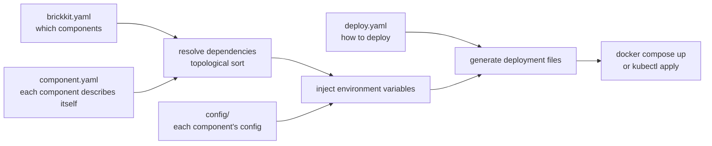
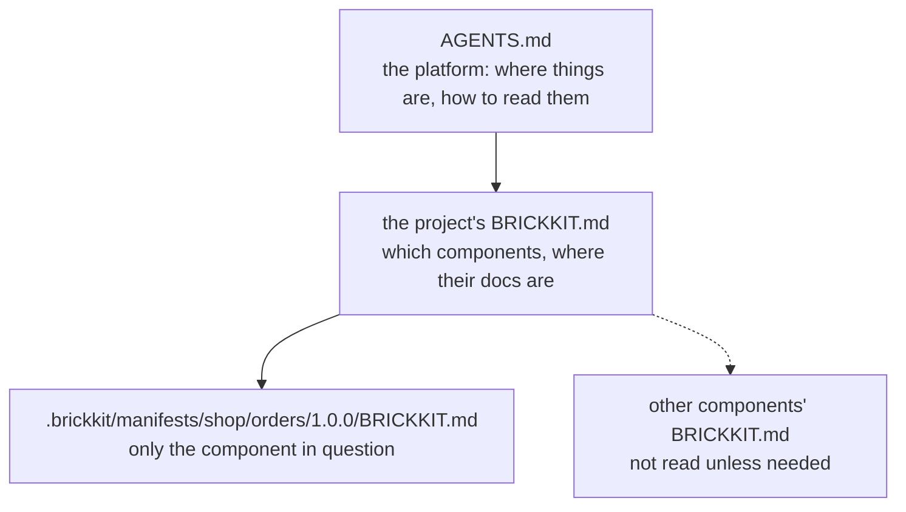
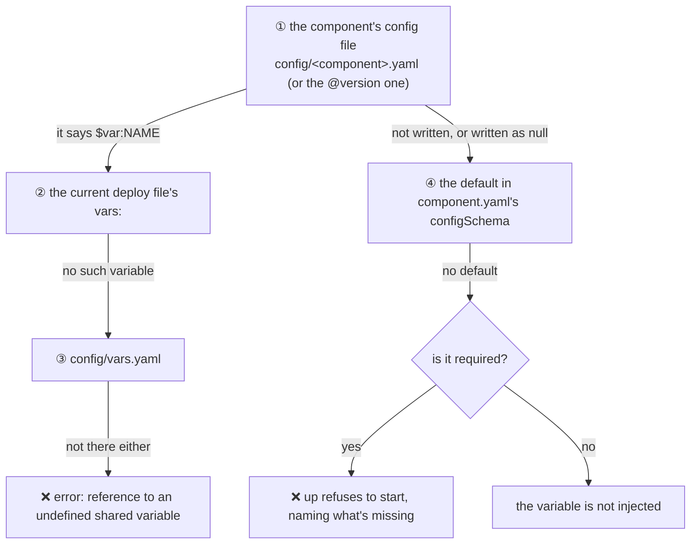

# BrickKit — core — read this first (English)

Contains: AGENTS.md, docs/en/00-intro/01-what-is-brickkit.md, docs/en/00-intro/02-quick-start.md, docs/en/00-intro/04-core-concepts.md, docs/en/00-intro/06-fractal-architecture.md, docs/en/01-three-layers/01-overview.md, docs/en/01-three-layers/08-resolution-priority.md, docs/en/01-three-layers/09-field-reference.md

Paths below are relative to the repository root: https://raw.githubusercontent.com/brickKit/brickKit/main/

Next: The rest of the documentation, every page once, in reading order: https://raw.githubusercontent.com/brickKit/brickKit/main/llms/en/01.md … 08.md

---

> File: AGENTS.md

# BrickKit

> If you are an AI assistant, this is the one file to read first. After it you know how the platform is
> shaped, where each kind of answer lives, what not to read, and where the design deliberately stops.
>
> If the user is asking in Chinese, read [`AGENTS.zh.md`](../../AGENTS.zh.md) instead — an equivalent, independently
> written Chinese version, not a translation.
>
> Paths in this file are relative to the repository root. On the web, prefix them with
> https://raw.githubusercontent.com/brickKit/brickKit/main/ . To read all the documentation in a few fetches, start
> with [`llms/en/00-core.md`](00-core.md) and follow its "Next" line.

## §1 What BrickKit is

BrickKit is a declarative component assembly platform. You declare which components a project uses and what
they depend on; the CLI derives everything else — start order, service addresses, environment variables,
deployment files — hands the result to Docker (or Podman) or Kubernetes, and exits.

A project is described by three layers of files, each owning one thing:

| Layer | Files | Owns |
| --- | --- | --- |
| Declaration | `brickkit.yaml` | Which components, at which exact versions, and which one is a shell. It is the lock file |
| Deployment | `deploy.yaml` (team) / `deploy.local.yaml` (personal, never committed) | How things run: target, ports, modes, shell members, Kubernetes settings |
| Configuration | `config/<component>.yaml`, `config/vars.yaml` | The environment variables each component receives |

There is no registry, no config server, no gateway and no long-running process: the CLI runs and exits, and
service discovery is Docker's or Kubernetes' own DNS.

## §2 Design principles (ten)

1. **Fail loudly**: config conflicts, missing required values, duplicate keys, failed pushes — each is reported the moment it happens, never left to surface at runtime.
2. **Minimal platform**: the platform does mechanical work and never guesses meaning — no rename detection, no type conversion, no deciding how a component degrades.
3. **What you see is what runs**: there are no hidden overrides; the file you open is the configuration in effect.
4. **Component autonomy**: what a component needs, how it degrades and what its logs look like are its own decisions; the platform asks only for a manifest, a health check and environment variables.
5. **One job per file**: each of the three layers owns one thing, and every fact is written in exactly one place.
6. **Atomic operations**: `add`, `remove`, `upgrade` and `release` either succeed completely or leave everything as it was.
7. **Explicit over implicit**: exact versions, explicit `$var:` references, explicit port exposure; nothing is auto-guessed.
8. **One model at every size**: a one-component project and a fifty-component project use the same three layers; there is no single-file mode.
9. **Build is separate from deploy**: building an image is your explicit step (`brickkit build`); `brickkit up` never builds.
10. **Read on demand, don't merge everything**: there is no command that folds the three layers into one view; to learn something, read the layer that owns it.

Each principle's argument — what it is, what it buys, what it costs, what it turned down — is in
[`docs/en/06-architecture/05-design-principles.md`](../../docs/en/06-architecture/05-design-principles.md).

## §3 The three layers

### 3.1 Where each answer lives

| To find out | Read |
| --- | --- |
| Which components the project uses, and their versions | `brickkit.yaml` |
| How a component is deployed (target, ports, mode, shell members) | `deploy.local.yaml` when local mode is on, otherwise `deploy.yaml` (a file named with `-f` wins over both) |
| The environment variables a component gets (connection details, secrets, switches) | `config/<component ID with / replaced by ->.yaml`; a versioned `config/<…>@<version>.yaml` wins for that version |
| Shared variables | `config/vars.yaml` (a deploy file's `vars:` overrides entries of the same name) |
| A component's dependencies, capabilities and `configSchema` | `.brickkit/manifests/<scope>/<name>/<version>/component.yaml`; for a component from a local source, the `component.yaml` in its source directory |
| How to use a dependency and what its config items mean | `.brickkit/manifests/<scope>/<name>/<version>/BRICKKIT.md` |
| Which components the project has and where their docs are | `BRICKKIT.md` at the project root |

### 3.2 Rules that matter

- `brickkit.yaml` is the lock file: every component version in use is written there. An undeclared required dependency is an error (the error shows the `add` to run); an undeclared optional dependency simply does not exist.
- `deploy.local.yaml` **replaces** `deploy.yaml` as a whole; it does not override fields. With local mode on, the commands that run or check the deployment (`up`, `down`, `status`, `sync`, `lint`, `build`) read it and not `deploy.yaml`; `graph` and `deps` always read `deploy.yaml`, so their output is the same for everyone. It must match `brickkit.yaml` entry for entry, so after the team adds a component you run `brickkit local refresh`.
- `mode: debug` is written only in `deploy.local.yaml`: "I'm debugging this on my machine right now" is a personal fact and never goes into Git.
- `focus: <id>` is written only in `deploy.local.yaml` — `brickkit up` in a component's directory or `up --focus <id>` writes it, `up --all` removes it. While it is set, only that component (from its source) and what it needs start; `sync` ignores it, and it doesn't work with `target: k8s`.
- Project commands work from any subdirectory: they walk up to the nearest `brickkit.yaml` (like `git`, not stopping at `.git`) and say `📁 Project: …` when they did; paths they print are relative to where you are. `release`, `publish`, `init` and `skills` act on the current directory.
- `$var:NAME` takes its value from `config/vars.yaml` (or the deploy file's `vars:`); `${NAME}` from the process environment, then `.env`; `file://path` reads a file. The environment never overrides a value implicitly.
- `brickkit up` never builds an image: when an image that has to be built locally is missing, it stops and tells you to run `brickkit build`.
- `brickkit init <name>` creates a new directory; `brickkit init` without a name completes the current directory, adding only what is missing and never touching an existing byte, and warns loudly when `.gitignore` lacks a required entry.

### 3.3 Fractal structure

- **While you develop it**, a component's repository can itself be a complete BrickKit project, with its own three layers for local integration work.
- **When a project uses it**, the project reads only its `component.yaml` (the contract) and its `BRICKKIT.md` (the documentation).
- **The spec nests, the files don't**: a component's own three layers never travel into the project that uses it; only the contract and the docs do.
- `brickkit add` caches each component's `BRICKKIT.md` permanently under `.brickkit/manifests/`.
- **Inside a project, a focus run; for a standalone component, a workbench.** A focus run needs no files of its own; a workbench is the component repository's own `brickkit.yaml`, and the nearest `brickkit.yaml` always wins.
- **One `components/`**: component source lives only in the project's `components/`. A component nested inside another component's directory is refused by `up`, `lint` and `sync` and never moved for you; `add --repo` always clones into the project's `components/`. Git submodules are never fetched.

### 3.4 How an AI should read a project

1. This file: the rules and where things live.
2. The project's root `BRICKKIT.md`: which components exist and where each one's documentation is.
3. On demand, one component's `BRICKKIT.md` (under `.brickkit/manifests/`) to understand that component.

Don't load every component's documentation at once: read only the components the question is about.

## §4 Shells at a glance

- A shell is an ordinary component that compiles several member components into **one process** (1:N), to save memory and CPU.
- Members are listed under the shell's entry in the deploy file (`members`) — the only place membership is written. The shell's line in `brickkit.yaml` carries `kind: shell`, maintained by the CLI.
- The shell's `component.yaml` lists, in `shell.members`, the **exact versions** it compiles in. If the project hosts a different version, the CLI stops with three ways out.
- Members' configuration reaches the shell as `BRICKKIT_SERVED_MEMBERS_CONFIG`, a JSON value the CLI evaluates in advance; multi-line secrets (PEM), quotes and `$` encode fine, and a value that isn't valid UTF-8 (binary) fails loudly.
- Callers' `*_ENDPOINT` addresses are pointed at the shell by the platform; the shell author only routes each request to the right member inside the process.
- Members' migrations still run on their own, with each member's own image and config — so every member needs its own image (`image` or `build`).
- A shell is a component too: it has its own `configSchema` and its own `config/` file.

## §5 Commands (21, plus version, lang and completion)

| Command | What it does |
| --- | --- |
| `init` | With a name: create a directory with the three-layer skeleton. Without: complete the current directory |
| `skills` | Show or refresh the AI assistant skills installed in the project (`status` / `update`) |
| `graph` | Dependency topology as Mermaid |
| `lint` | Offline, read-only check of the three layers and `component.yaml` files |
| `new` | Component skeleton (`--shell` for a shell) |
| `add` | Fetch a component and its dependencies, write the three layers |
| `remove` | Remove a component; its config moves to `config/.archive/` |
| `fetch` | Download only a component's artifacts (contracts), without adding it to the project |
| `upgrade` | Move to another version and migrate config between the old and new `configSchema`; a conflict becomes a duplicate key that stops `up` |
| `up` | Generate deployment files → run migrations → start containers (never builds); in a component's directory or with `--focus`, only that component and what it needs |
| `down` | Stop containers (volumes are kept) |
| `status` | Running-state table |
| `sync` | Tidy the component source workspace: sources not used this run go to `.archived/`, the ones needed come back |
| `local` | Local mode: `on` / `off` / `status` / `refresh` |
| `restore` | Put `mode` and the source layout back to the last commit |
| `deps` | Dependency tree |
| `build` | Build the images that are built locally, explicitly (`--force`) |
| `release` | Check → Git tag → push; a failed push deletes the tag. `--local` releases every component in local sources |
| `publish` | Publish to a component market (optional infrastructure) |
| `login` | Log in to a component market |
| `logout` | Log out of a component market (revokes the token, deletes local credentials) |

`version` prints the version; `lang` shows or sets the language the CLI speaks (`lang set en|zh`); `completion` prints the TAB-completion script for a shell (`install.sh` installs it for bash, zsh and fish).

### Flags

- The only global flag is `--log-level` (level of the JSON log lines on stderr, default `warn`).
- `-f, --file <path>`: the commands that read a deploy file (`up`, `down`, `status`, `sync`, `lint`, `graph`) use it to pick one deploy file, ignoring `deploy.local.yaml` and the local-mode switch entirely.
- `--no-local`: `up`, `down`, `status`, `sync` and `lint` ignore `deploy.local.yaml` for this run, without changing the local-mode switch.
- `--dry-run`: `up` generates the deployment files without running them; `upgrade` works everything out without writing.
- `--focus <id>` / `--all`: `up` sets or removes the focus in `deploy.local.yaml`; neither goes with `-f` or `--no-local`.
- No argument, in a component's directory: `build` and `deps` mean that component.

Every command's full flag list is in [`docs/en/07-cli-reference/README.md`](../../docs/en/07-cli-reference/README.md).

### Removed commands and flags

| Removed | What to do instead |
| --- | --- |
| The `override` command and `override.yaml` | `deploy.local.yaml` + `brickkit local` |
| `resources`, `servedBy`, `deploy:` in `brickkit.yaml` | Connection details go into `config/`, shell members into the deploy file's `members`, deployment settings into `deploy.yaml` |
| `--config` | One deploy file per environment, chosen with `-f` |
| `up --context` | Write `k8s.context` in the deploy file; one deploy file per cluster |

## §6 What the platform won't do

| Won't do | Why |
| --- | --- |
| Service registry / discovery | Docker's and Kubernetes' DNS already are service discovery |
| A long-running daemon | The CLI runs and exits; state lives in files and in the engine |
| Health-check polling | Kubernetes probes and Compose healthchecks do it natively |
| API gateway, service mesh | Components call each other by DNS; an external gateway hooks in through `labels` passthrough |
| Config server / hot reload | Change `config/` or the deploy file, then `up` |
| Circuit breaking, rate limiting, retries, degradation | The component's own business logic |
| Version ranges (`^1.0.0`) | Only an exact version is a contract |
| Multi-environment overlays and inheritance | One complete deploy file per environment |
| Building images automatically | Building is your explicit step |
| A merged-view command | Read on demand instead |
| A single-file mode | One model at every size: always three layers |
| Implicit config overrides | What you see is what runs |
| Git authentication | Your machine's own Git setup is used; its errors are passed through verbatim |
| Validating config value types and ranges | `configSchema` is a spec sheet: key names are checked, values are not |

## §7 Config migration and conflicts

- An upgrade compares the old and new versions' `configSchema` and migrates your config mechanically, key by key.
- A key you changed whose default the author also changed becomes a duplicate key with a comment; `up` refuses to start until you resolve it (fail loudly).
- `remove` archives the config into `config/.archive/`; adding the component again restores it through the same migration.
- No rename detection, no type conversion, no semantic analysis.

## §8 Distribution without a market

- A component is a Git repository; a version is a Git tag (a component in a monorepo subdirectory uses `<scope>-<name>/<version>`).
- Fetching goes through a user-level bare-repository cache (`<user cache dir>/brickkit/repos`, shared by every project on the machine), fetched incrementally as needed.
- A manifest is read from, in order: the project's permanent cache `.brickkit/manifests/` → the local bare repository → an incremental fetch → a first clone.
- The CLI does no authentication of its own; `git`'s errors are passed through verbatim.
- `brickkit release`: check → tag → push, deleting the tag if the push fails; `--local` releases the components in local sources, stopping at the first failure.
- A component market (`publish` / `login` / `logout`, `sources[].type: market`) is optional infrastructure that works alongside Git sources.

## §9 Doc map

To find out → read. The page-by-page list, one line per page, is [`llms.txt`](../../llms.txt).

| To find out | Read |
| --- | --- |
| The platform in one read | [`llms/en/00-core.md`](00-core.md): this file plus the core pages |
| Getting it running | [`docs/en/00-intro/02-quick-start.md`](../../docs/en/00-intro/02-quick-start.md) |
| Words and concepts | [`docs/en/00-intro/04-core-concepts.md`](../../docs/en/00-intro/04-core-concepts.md) |
| The three files, every field | [`docs/en/01-three-layers/README.md`](../../docs/en/01-three-layers/README.md), [`docs/en/01-three-layers/09-field-reference.md`](../../docs/en/01-three-layers/09-field-reference.md), [`docs/en/11-reference/README.md`](../../docs/en/11-reference/README.md) |
| Where a config value comes from | [`docs/en/01-three-layers/08-resolution-priority.md`](../../docs/en/01-three-layers/08-resolution-priority.md) |
| Running a project: init, add, local, up, upgrade … | [`docs/en/02-project-guide/README.md`](../../docs/en/02-project-guide/README.md) |
| Working on one component inside a project | [`docs/en/02-project-guide/04-focus-run.md`](../../docs/en/02-project-guide/04-focus-run.md) |
| Writing a component | [`docs/en/03-component-guide/README.md`](../../docs/en/03-component-guide/README.md) |
| Shells | [`docs/en/04-shell/README.md`](../../docs/en/04-shell/README.md) |
| Database migrations | [`docs/en/05-migration/README.md`](../../docs/en/05-migration/README.md) |
| Architecture, principles, the env contract, error codes | [`docs/en/06-architecture/README.md`](../../docs/en/06-architecture/README.md), [`docs/en/06-architecture/05-design-principles.md`](../../docs/en/06-architecture/05-design-principles.md), [`docs/en/06-architecture/03-env-injection-contract.md`](../../docs/en/06-architecture/03-env-injection-contract.md), [`docs/en/06-architecture/09-error-codes.md`](../../docs/en/06-architecture/09-error-codes.md) |
| Every command and flag | [`docs/en/07-cli-reference/README.md`](../../docs/en/07-cli-reference/README.md) |
| How an AI works with BrickKit | [`docs/en/08-ai-guide/README.md`](../../docs/en/08-ai-guide/README.md) |
| Recommended practices | [`docs/en/09-patterns/README.md`](../../docs/en/09-patterns/README.md) |
| Something failed | [`docs/en/10-troubleshooting/README.md`](../../docs/en/10-troubleshooting/README.md) |
| Building, testing, conventions for contributors | [`CONTRIBUTING.md`](../../CONTRIBUTING.md) |
| Where a feature lives in the code | §10 below |

## §10 Code map

One Go module, `github.com/brickkit/brickkit`. The CLI starts in `cmd/brickkit/`; every command is one file,
`internal/cli/<command>.go`.

### Packages

| Package | Owns |
| --- | --- |
| `internal/cli/` | The command tree: one file per command, flags, output; errors shown relative to where you stand (`shown.go`); TAB completion candidates (`complete.go`) |
| `internal/project/` | Loading a project (brickkit.yaml + deploy file + config/) into one `Project`; finding the root upward (`findroot.go`); consistency checks; the project map `BRICKKIT.md` |
| `internal/projfile/` | `brickkit.yaml`: sources, components, versions, `kind: shell` |
| `internal/deployfile/` | Deploy files (`deploy.yaml`, `deploy.local.yaml`, `-f`): fields, validation, `focus`, the local-change diff |
| `internal/configdir/` | `config/`: per-component env files, `vars.yaml`, value resolution, skeletons, migration on upgrade |
| `internal/manifest/` | `component.yaml`: parsing, validation, the scaffolds `brickkit new` writes |
| `internal/resolver/` | Dependency resolution into a graph; start order |
| `internal/cascade/` | What runs this time: `mode`, "follows the layer above", focus reachability, shell hosting |
| `internal/inject/` | Each component's environment variables: dependency addresses, config, resources |
| `internal/shell/` | Shell grouping and the members' JSON config |
| `internal/compose/` | Rendering `compose.yaml` for docker / podman |
| `internal/k8s/` | Rendering Kubernetes manifests |
| `internal/deploy/` | Naming rules and file headers shared by both targets |
| `internal/engine/` | Docker, Podman and kubectl: detection and invocation |
| `internal/procsup/` | Supervising `mode: local` processes in the foreground |
| `internal/runcmd/` | Working out how to start a component from its source |
| `internal/sessionlock/` | One foreground local session per project |
| `internal/install/` | What `add` / `remove` / `upgrade` change in the three layers |
| `internal/source/` | Install sources (local / git / market), the manifest and artifact caches, the bare-repository cache, offline versions |
| `internal/gitrepo/` | Read-only git queries (status, submodules) |
| `internal/workspace/` | Component source under `components/`: archive, activate, deletion risk |
| `internal/release/` | `brickkit release`: checks, tag, push, rollback |
| `internal/market/` | Market client: login and publish |
| `internal/security/` | Component signatures: signing and verification |
| `internal/skills/` | AI-assistant skills installed into user projects (`assets/`) |
| `internal/clierr/` | The error type, error codes and how errors render |
| `internal/i18n/` | Message catalogs (`locales/en.yaml`, `locales/zh.yaml`) and language resolution |
| `internal/msgid/` | Message keys (`messages_gen.go` is generated) |
| `internal/logging/` | JSON log lines on stderr |
| `internal/suggest/` | "Did you mean" suggestions |
| `internal/envref/` | `${VAR}` references |
| `internal/yamlfile/` | The read / parse / decode pipeline the three layers share |
| `internal/yamlcheck/` | Misspelled or unknown YAML fields |
| `internal/yamlcomment/` | Comment blocks in generated YAML, `.env`, `.gitignore` |
| `internal/schemagen/` | JSON Schemas generated from the Go structs into `schemas/` |
| `internal/userconfig/` | Machine-level preferences (the CLI's language) |
| `internal/version/` | Version and capability constants |
| `internal/llmsgen/` | The documentation bundles in `llms/` and the bundle list in `llms*.txt` |
| `cmd/brickkit/` | The CLI's `main` |
| `cmd/gen-msgid/` | Generates `internal/msgid/messages_gen.go` |
| `cmd/gen-schemas/` | Generates `schemas/*.json` |
| `cmd/gen-llms/` | Generates `llms/` |

Elsewhere: `market-server/` (the optional component market, its own Go module), `tools/i18n/` (one-off i18n
migration scripts), `scripts/` (lint checks, install checks, release), `install.sh`.

### Features → code

| Feature | Start here | Then |
| --- | --- | --- |
| `up` | `internal/cli/up.go` (`up_local.go`, `up_k8s.go`, `up_upgrade.go`) | `cascade`, `inject`, `compose`, `k8s`, `engine`, `procsup` |
| `down`, `status` | `internal/cli/down.go`, `internal/cli/status.go`, `internal/cli/lifecycle.go` | `engine`, `sessionlock` |
| `add`, `remove`, `upgrade` | `internal/cli/add.go`, `internal/cli/remove.go`, `internal/cli/upgrade.go`, `internal/cli/install_apply.go` | `install`, `configdir`, `source` |
| `fetch` | `internal/cli/fetch.go`, `internal/cli/artifacts.go` | `source` |
| `build` | `internal/cli/build.go` | `source`, `engine`, `gitrepo` |
| `lint` | `internal/cli/lint.go`, `internal/cli/lint_config.go` | `project`, `yamlcheck` |
| `graph`, `deps` | `internal/cli/graph.go`, `internal/cli/deps.go`, `internal/cli/topology.go` | `resolver`, `cascade` |
| `sync`, `restore` | `internal/cli/sync.go`, `internal/cli/restore.go`, `internal/cli/restore_check.go` | `workspace` |
| `local` | `internal/cli/local.go` | `deployfile` |
| `init`, `new` | `internal/cli/init.go`, `internal/cli/new.go`, `internal/cli/hooks.go` | `project`, `manifest`, `skills` |
| `release`, `publish`, `login`, `logout` | `internal/cli/release.go`, `internal/cli/publish*.go`, `internal/cli/login.go`, `internal/cli/logout.go` | `release`, `market`, `security` |
| `skills`, `lang`, `version` | `internal/cli/skills.go`, `internal/cli/lang.go`, `internal/cli/version.go` | `skills`, `i18n`, `userconfig` |
| Finding the project upward | `internal/project/findroot.go`, `internal/cli/root.go` | |
| Focus run | `internal/cli/focus.go` | `internal/cascade/cascade.go`, `internal/deployfile/focus.go` |
| One `components/` (nested copies) | `internal/cli/nested.go` | `internal/project/nested.go` |
| TAB completion | `internal/cli/complete.go` | `internal/source/cached.go`, `install.sh` |
| "Did you mean" | `internal/cli/didyoumean.go` | `suggest` |
| How errors look | `internal/clierr/clierr.go`, `internal/cli/shown.go` | |
| Adding a message | `internal/i18n/locales/en.yaml`, `internal/i18n/locales/zh.yaml`, then `make generate-msgid` | `msgid` |
| Documentation bundles | `cmd/gen-llms/`, `internal/llmsgen/` | `make generate-llms` |

### Tests and checks

- Unit tests sit next to the code (`*_test.go`); CLI tests run commands in-process against `internal/cli/testdata/`.
- `tests/components/`: real components (Go, Python, nginx) used as fixtures; `tests/checklist/`: the regression
  list `make test-all` runs; `tests/docfields/`: guards that the docs match the code.
- `make lint` (every static check, `scripts/check-*.py`) and `make test-all`; `make hooks` once per clone.

---

> File: docs/en/00-intro/01-what-is-brickkit.md

# What BrickKit is

## In one sentence

BrickKit is a **declarative component assembly platform**: you write down which components you want and what they
depend on, and everything else — start order, service addresses, environment variables, deployment files — is derived
by BrickKit and handed to Docker, Podman or Kubernetes to run.

"Declarative" means you describe **the result you want** ("I want `erp/backend` 1.0.0, and it has to reach a
database"), not **the steps that get you there** ("start the database, wait until it's healthy, put its address in this
variable, start the backend…"). The platform works out the steps.

## The core ideas

**1. Declare the components; the CLI derives the rest.** A component's own `component.yaml` says what it depends on,
which port it listens on and what configuration it needs. Your project declares only which components, at which
versions. The CLI puts the two together, works out the dependency tree, the start order and the environment variables
each component should get, generates `compose.yaml` or Kubernetes manifests, calls `docker compose` or `kubectl`, and
exits.

**2. The platform doesn't stay running.** No registry (service discovery is Docker's or Kubernetes' DNS), no config
server (configuration lives in files; change it and `up` again), no gateway (components call each other directly by
DNS), no daemon (the CLI exits when it's done). Each of those would buy some convenience, at the price of
infrastructure that has to be operated for as long as it exists, that fails, and that becomes a bottleneck — BrickKit
chooses not to have it.

**3. A component is a self-contained domain unit, and its boundary is a contract.** Each component is developed,
tested and released on its own, with its own versions. Other components depend only on its manifest
(`component.yaml`) and its published contract (OpenAPI, Protobuf and so on), never on its code. So the implementation
behind the contract can be rewritten wholesale, in another language, without changing a line anywhere else.

## The three layers

A BrickKit project is described by three layers of files, each owning one thing:

```text
my-shop/
├── brickkit.yaml        declaration: which components, at which exact versions (it is the lock file)
├── deploy.yaml          deployment: target (docker / podman / k8s), ports, modes, shell members
├── config/
│   ├── vars.yaml        values several components share
│   └── demo-hello.yaml  the environment variables each component gets
└── .brickkit/           the CLI's caches and generated files (not in Git)
```

From declaration to running containers, the pipeline looks like this:



Why three layers rather than one file: the three things change at different rates and belong to different people.
Component versions are decided by whoever assembles the system, and get reviewed; how things are deployed varies by
environment, often with temporary "only on my machine" changes (those go into `deploy.local.yaml`, which stays out of
Git); configuration holds secrets and has to be managed apart from the rest. One file holding all three ends up
edited by everyone and understood by no one. See [The three layers at a glance](../../docs/en/01-three-layers/01-overview.md).

## The fractal structure

**While you develop it**, a component is itself a complete BrickKit project — it can have its own three layers to
bring up its dependencies locally for integration work. **When another project uses it**, it's a black box: the
project reads only its `component.yaml` and `BRICKKIT.md`. The specification nests; the files don't. See
[The fractal structure](../../docs/en/00-intro/06-fractal-architecture.md).

## Friendly to AI

- **A component is small enough for an AI to read in one go.** It is one piece of the business, a few hundred to a few
  thousand lines, so there's no hunting for context in a giant monolith.
- **The boundary is a contract file, not a guess.** When an AI writes a caller, it reads the dependency's contract and
  `BRICKKIT.md`, not the dependency's implementation.
- **The easy-to-get-wrong parts are derived by the platform.** Service addresses, variable names and deployment files
  aren't invented by the AI; assembly mistakes surface at `brickkit up --dry-run`.
- **There is a clear reading path.** `AGENTS.md` at the repository root tells an AI which file holds which
  information, so it reads only what it needs.

See [For AI assistants](../../docs/en/08-ai-guide/README.md).

## In terms of tools you already know

| BrickKit | Roughly |
| --- | --- |
| BrickKit CLI | `npm` + `helm` + `docker compose` + `git clone`, but for **business components that run on their own** |
| Component | an npm package plus its Docker image |
| `component.yaml` | `package.json` |
| `brickkit.yaml` | `package-lock.json`: every component locked to an exact version |
| `deploy.yaml` | the "how it runs" half of a `compose.yaml` |
| `brickkit add` | `npm install` |
| `brickkit up` | `docker compose up -d` / `kubectl apply` |
| `brickkit release` | tagging a version in the component's repository and pushing it |

The difference: npm installs a code library; BrickKit installs **a service that runs on its own**, so it also handles
dependency resolution, address injection, database migrations and start order. A closer comparison is in
[Comparison](../../docs/en/00-intro/05-comparison.md).

Next: [Quick start](../../docs/en/00-intro/02-quick-start.md).

---

> File: docs/en/00-intro/02-quick-start.md

# Quick start (five minutes)

Start from an empty directory: create a project, put a component in it, build its image, start it, reach it with
`curl`, change a setting and watch it take effect, then stop everything. Every command and every piece of output below
comes from a real run.

The component is the repository's own test fixture `demo/hello`: a minimal HTTP service that answers with a greeting.
It isn't a business component — and because it is so small, it's the right one for seeing clearly what the platform
does.

## Before you begin

- `brickkit` is installed (see [Install in the README](../../README.md#install)) and `brickkit version` prints a version
  (TAB completes commands and component IDs — see [Shell completion](../../docs/en/00-intro/03-shell-completion.md));
- Docker 20.10+ (with Compose V2) is running;
- port 8080 on your machine is free (if it isn't, step 4 says how to use another port).

Also clone the BrickKit repository — the fixture components live in its `tests/components/`:

```bash
git clone https://github.com/brickKit/brickKit.git
```

## Step 1: create a project

```bash
brickkit init my-shop
```

```text
✅ Project initialized: my-shop
   📄 brickkit.yaml        Project config
   📄 deploy.yaml          How it is deployed (team file, committed)
   📁 config/              Component configuration and shared vars
   📁 components/          Component source (configured as the local install source local-dev)
   📁 shell/               Shells (kind: shell), project code (the local install source local-shells)
   📁 .brickkit/           CLI working directory
   📄 BRICKKIT.md          Project map: components and where their docs are
   📁 .claude/skills/      AI assistant skills (4)
   📄 AGENTS.md            AI assistant project guide
   💡 If component source goes into Git with the project: brickkit init --hooks installs the pre-commit check

Next steps:
  cd my-shop
  brickkit add --local                     add every component under components/
  brickkit add <scope>/<name>@<version>    add a component from an install source (enable one under sources: in brickkit.yaml first)
  brickkit up                              start everything in one go
```

`init <name>` creates a directory of that name holding the skeleton of the three layers:

```text
my-shop/
├── brickkit.yaml     which components (empty for now)
├── deploy.yaml       how to deploy: target: docker
├── config/
│   └── vars.yaml     shared variables (empty for now)
├── components/       a local install source: your own components' source goes here
├── shell/            a local install source: shell components
├── BRICKKIT.md       the project map
├── .brickkit/        the CLI's caches and generated files (not in Git)
└── .gitignore
```

`brickkit.yaml` already declares two **local install sources**, `./components` and `./shell`. An install source is
"where to look for components"; a local source is a directory on your machine, and the other kinds are Git repositories
and a component market.

## Step 2: add a component

Copy the fixture into the project's local source (components in a local source sit at
`<scope>/<name>/component.yaml`), then add it:

```bash
cd my-shop
mkdir -p components/demo
cp -r ../brickKit/tests/components/demo-hello components/demo/hello
brickkit add demo/hello
```

```text
🔎 No version given for demo/hello; the latest is 1.0.0 (install source local-dev)
➕ Adding demo/hello@1.0.0
   ✅ demo/hello@1.0.0
📝 Written: brickkit.yaml, deploy.yaml
📝 Config skeletons: config/demo-hello.yaml
📦 Artifacts: 1 file, in .brickkit/artifacts/
```

One `add` changed all three layers:

- `brickkit.yaml` gained a line with an exact version — that is the lock:

  ```yaml
  components:
    - id: demo/hello
      version: 1.0.0
  ```

- `deploy.yaml` gained a deployment entry for the component (nothing in it yet, meaning "run it the default way"):

  ```yaml
  components:
    - id: demo/hello
  ```

- `config/demo-hello.yaml` is a config skeleton generated from the component's `configSchema`. Optional items with a
  default are written as comments:

  ```yaml
  # === Optional: commented keys use the component's default; uncomment to override ===
  # GREETING: Hello  # string | The greeting the component answers with (default)
  ```

The component's API contract (an `openapi.json` here) was downloaded to `.brickkit/artifacts/` too; it's what you'd
read when writing a caller.

## Step 3: build the image

Try starting it straight away:

```bash
brickkit up
```

```text
🚀 Starting project my-shop (target: docker)
📋 Component state calculation:
   ✅ demo/hello@1.0.0  starting (top-level)

📋 Start order (topological sort):
   1. demo-hello-1-0-0  no dependencies

Can start on their own: demo-hello-1-0-0 (no dependencies)
📄 Generated: .brickkit/generated/compose.yaml
❌ Error: these images are built locally and have not been built yet
   demo/hello@1.0.0: brickkit-demo/hello:1.0.0
   Suggestion: up never builds on its own (building and deploying are separate): run brickkit build demo/hello@1.0.0 first
```

It fails, and it says exactly why: a component in a local source is **code you're developing**, so its image has to be
built from it — and `brickkit up` **never builds**. Building is your explicit step; deploying is the platform's
mechanical one. That way `up` can never quietly bake code you didn't mean to ship into an image.

```bash
brickkit build
```

```text
🔨 Building demo/hello@1.0.0 → brickkit-demo/hello:1.0.0
✅ Built demo/hello@1.0.0 → brickkit-demo/hello:1.0.0
```

When you need `build`: the component comes from a local source, or its `component.yaml` doesn't name a
`deployment.image` (it only says how to build one). A component added from a Git repository or a market that does
name an `image` is pulled, not built. An image's tag always equals the component's version.

## Step 4: start it

By default a component **doesn't open a port on the host** — what isn't declared isn't reachable. To `curl` it from
your machine, open it in `deploy.yaml`:

```yaml
components:
  - id: demo/hello
    expose: true        # map it to port 8080 on the host
```

If 8080 is taken, add `exposePort: 18080` as well and use 18080 in the `curl` below.

```bash
brickkit up
```

```text
🚀 Starting project my-shop (target: docker)
📋 Component state calculation:
   ✅ demo/hello@1.0.0  starting (top-level)

📋 Start order (topological sort):
   1. demo-hello-1-0-0  no dependencies

Can start on their own: demo-hello-1-0-0 (no dependencies)
📄 Generated: .brickkit/generated/compose.yaml

🐳 Starting (docker)...
   demo-hello-1-0-0             running (healthy)
✅ All components started (1)

💡 View the status: brickkit status
   View the logs: docker compose -p brickkit-my-shop logs -f
```

`demo-hello-1-0-0` is the component's **versioned service name**: the component ID with `/` and `.` turned into `-`,
followed by the exact version. Another component calling it gets the address `http://demo-hello-1-0-0:8080` — exactly
the same on local Docker and on Kubernetes.

## Step 5: check it

```bash
curl http://localhost:8080/api/v1/hello
```

```json
{"component":"demo/hello","greeting":"Hello","message":"Hello, I'm demo/hello@1.0.0","version":"1.0.0"}
```

```bash
brickkit status
```

```text
📊 Project status: my-shop (target: docker)

✅ Running (1 component)
 ┌────────────┬─────────┬───────────────────┬─────────────────────────────────────────────┐
 │ Component  │ Version │ Status            │ Port                                        │
 ├────────────┼─────────┼───────────────────┼─────────────────────────────────────────────┤
 │ demo/hello │ 1.0.0   │ running (healthy) │ 0.0.0.0:8080->8080/tcp, [::]:8080->8080/tcp │
 └────────────┴─────────┴───────────────────┴─────────────────────────────────────────────┘
```

## Step 6: change a setting and watch it take effect

In `config/demo-hello.yaml`, uncomment that line and give it another value:

```yaml
GREETING: Howdy
```

A key in the config file is the name of the environment variable the component receives, injected as-is. `up` again:

```bash
brickkit up
```

```text
🐳 Starting (docker)...
   demo-hello-1-0-0             running (healthy)
✅ All components started (1)
```

(The earlier sections are the same as last time and are left out here.)

```bash
curl http://localhost:8080/api/v1/hello
```

```json
{"component":"demo/hello","greeting":"Howdy","message":"Howdy, I'm demo/hello@1.0.0","version":"1.0.0"}
```

No config server, no hot reload: change the file, `up` again, and the container is recreated with the new environment.

## Step 7: stop it

```bash
brickkit down
```

```text
🛑 Stopping project my-shop
✅ All components stopped

💡 Data volumes were not deleted; database data is still there
   For a full cleanup, run by hand: docker volume rm <volume-name>
   Start again with: brickkit up
```

`down` never deletes data volumes: deleting data by mistake costs too much, so a real cleanup is yours to do by hand.

## Where next

- What each of these files owns and what else you can write in it: [The three layers](../../docs/en/01-three-layers/README.md)
- More components, local debugging, several environments: [Running a project](../../docs/en/02-project-guide/README.md)
- Writing your own component: [Writing components](../../docs/en/03-component-guide/README.md)
- Every flag of every command: [CLI reference](../../docs/en/07-cli-reference/README.md)

---

> File: docs/en/00-intro/04-core-concepts.md

# Core concepts

If you only want a few minutes on BrickKit's skeleton — enough not to trip over the terms in the docs and in error
messages — this page is enough. Every term points to the page that explains it fully.

## The one-page glossary

| Term | What it is |
| --- | --- |
| **Component** | The basic unit you install and run: a program that runs on its own, **always a container** — a frontend (nginx serving static files) included |
| **Manifest** (`component.yaml`) | A component describing itself: what it depends on, which port it listens on, what config it needs, how to tell it's alive, where its image comes from |
| **Project** | A set of components described by the three layers — the system you're assembling |
| **The three layers** | `brickkit.yaml` (what there is), `deploy.yaml` / `deploy.local.yaml` (how it runs), `config/` (what config each component gets); see [The three layers at a glance](../../docs/en/01-three-layers/01-overview.md) |
| **Lock file** | The role of `brickkit.yaml`: every component in use is locked to an exact version, and a component not written there doesn't exist |
| **Install source** | Where to look for components: a Git repository (the default; a version is a Git tag), a directory on your machine (a local source), a component market (optional) |
| **Local source** | A directory on your machine holding component source at `<scope>/<name>/component.yaml`; their images are built by `brickkit build` |
| **Required / optional dependency** | A missing required dependency is an error and nothing starts; a missing optional one (`optional: true`) only means its address variable is **not injected** — not injected as an empty string |
| **Contract** (artifacts) | The API description a component publishes (OpenAPI, Protobuf, …), declared under `artifacts` in `component.yaml` and downloaded by `add` / `fetch` |
| **Shell** | A component that compiles several components into **one process**, to save memory and CPU; see [Shells](../../docs/en/04-shell/README.md) |
| **Member** | A component hosted by a shell; it has no container of its own but still has its own config and migrations |
| **Fractal structure** | A component is a project while you develop it and a black box when someone uses it; see [The fractal structure](../../docs/en/00-intro/06-fractal-architecture.md) |
| **`BRICKKIT.md`** | Documentation for people and AIs: the one in a component repository explains how to use that component; the one at the project root lists the project's components and where their docs are |
| **Local mode** | After `brickkit local on`, every command reads the personal `deploy.local.yaml` instead; see [Local debugging](../../docs/en/02-project-guide/03-local-debug-workflow.md) |

## The naming rules everything builds on

Once you know these rules, you can work out every name you meet in the docs, in errors and in generated files.

| Name | Rule | Example |
| --- | --- | --- |
| Component ID | `scope/name`, all lowercase | `people/basic` |
| Version | An exact `major.minor.patch`; ranges like `^1.0.0` are not accepted | `1.0.0` |
| Versioned service name | The component ID and version with `/` and `.` turned into `-` | `people-basic-1-0-0` |
| Dependency address variable | The component ID uppercased, `/` and `-` turned into `_`, plus `_ENDPOINT` | `PEOPLE_BASIC_ENDPOINT=http://people-basic-1-0-0:8080` |
| Config file name | The component ID with `/` turned into `-`; one meant for a single version adds `@version` | `config/people-basic.yaml`, `config/people-basic@2.0.0.yaml` |
| Config item | A key in `configSchema` **is** the environment variable name, injected as-is | `DB_HOST` |
| Image tag | Always exactly the component's `metadata.version` | `registry.example.com/people/basic:1.0.0` |
| Release tag | The version when the component sits at the repository root; prefixed with the component when it sits in a subdirectory | `1.0.0`, `people-basic/1.0.0` |

A variable's **name** is derived from the component ID alone and never carries a version; its **value** is what points
at a specific version. So two versions of the same component can run side by side (`people-basic-1-0-0` and
`people-basic-2-0-0` are two DNS names that don't clash), while a caller's code only ever reads the one name
`PEOPLE_BASIC_ENDPOINT`.

## What runs: follow the ones above

Each component in a deploy file can have a `mode`. Without one, it **follows the components above it**: a top-level
component (nothing depends on it) runs by default, and a component others depend on runs as long as at least one of
them does.

| Written | Meaning |
| --- | --- |
| nothing | Follow the ones above |
| `mode: enabled` | Always runs, whatever is above it; an error if one of its required dependencies is turned off (two conflicting intents) |
| `mode: disable` | Never runs; whatever depends on it stops too |
| `mode: local` | Always runs, but not in a container: BrickKit works out the start command, launches the process on your machine and watches it |
| `mode: debug` | Always runs, as a process you start yourself in your IDE; **written only in the personal `deploy.local.yaml`** |

`local` and `debug` only make sense on the Docker / Podman targets: a Pod in a cluster can't reach a process on your
laptop.

## The key verbs

| Command | What it does |
| --- | --- |
| `brickkit add` | Fetch a component and its dependencies, write them into the three layers, generate config skeletons, download contracts |
| `brickkit build` | Build the images that are built locally |
| `brickkit up` | Generate deployment files → run database migrations → start containers (never builds) |
| `brickkit upgrade` | Change a version and migrate your config between the old and new `configSchema` |
| `brickkit local` | Turn the personal local mode on or off |
| `brickkit release` | Check the component → tag it in Git → push, leaving no tag behind if anything fails |

Every command is in the [CLI reference](../../docs/en/07-cli-reference/README.md).

---

> File: docs/en/00-intro/06-fractal-architecture.md

# The fractal structure

"Fractal" means the same shape repeating at different scales. BrickKit's specification works that way: a project is
made of components, and a component, in the hands of whoever is developing it, **is itself a complete project**.

## The idea

- **While you develop it (the project view):** a component's author can keep a set of three-layer files in the
  component's repository (`brickkit.yaml`, `deploy.yaml`, `config/`) to bring up the component's dependencies locally
  and integrate against them. The component repository is then an ordinary BrickKit project.
- **When someone uses it (the component view):** when another project runs `brickkit add` on the component, it reads
  only the component's `component.yaml` (the contract) and `BRICKKIT.md` (the documentation). The three layers in the
  component's repository, and whatever dependencies they pulled in for integration, **don't exist** for the user.
- **The spec nests, the files don't:** a user's project never embeds a component's project; only the specification
  nests — every level uses the same three layers, the same commands, the same documentation structure.

What this buys: the author integrates with the same tools the user assembles with, so there's nothing to learn twice;
and whatever the author adds locally for integration (a mock, a debug switch) can never leak to users. What it costs:
a component's dependencies can only be written in the `dependencies` of its `component.yaml` — extra components in the
author's workbench `brickkit.yaml` are invisible to users, as they should be.

## While you develop it: a workbench inside the component repository

Run `brickkit init` without a name at the component repository's root (completion mode: it adds what's missing and
leaves every existing byte alone). Below, `brickkit new` creates a component first, then its directory is completed:

```bash
brickkit new shop/orders --path orders
```

```text
✅ Component skeleton generated: shop/orders
   📄 orders/component.yaml
   📄 orders/BRICKKIT.md

Next steps:
  Finish the TODOs in the skeleton
  cd orders && brickkit init    give it a local workbench (completion mode: existing files are left alone)
  brickkit lint                 check that component.yaml passes validation
```

```bash
cd orders
git init
brickkit init --yes
```

```text
This directory already has files; brickkit init will:
   ✅ create  brickkit.yaml
   ✅ create  deploy.yaml
   ✅ create  config/vars.yaml
   ✅ create  config/.gitkeep
   ✅ create  .gitignore
✅ Project completed: orders
   📁 .claude/skills/      AI assistant skills (4)
   📄 AGENTS.md            AI assistant project guide
   🪝 .git/hooks/pre-commit Check the component layout before committing
   ✅ closing check passed: the project loads
```

A few things worth noticing:

- `init` in a component repository creates neither `components/` nor `shell/`, and declares neither local source —
  that's the directory convention of an assembling project, which a component repository has no use for.
- The component's own `BRICKKIT.md` is kept as is; `init` doesn't overwrite it with a project document.
- From here, `brickkit add` brings the component's dependencies into the workbench, and `brickkit up` brings the whole
  dependency tree up locally for integration. At this point `brickkit.yaml` is the author's **local workbench**;
  whether to commit it is the author's call.

When a project's local source holds several components and you want a workbench for each, use
`brickkit add --local --init`: it first gives every local component without a `brickkit.yaml` a workbench, then adds
them all to the project.

## When someone uses it: only the contract and the docs

When a user `add`s the component, the CLI takes just two things from the component's Git tag and caches them
permanently under the project's `.brickkit/manifests/`:

```text
.brickkit/manifests/shop/orders/1.0.0/
├── component.yaml    the contract: dependencies, ports, config items, health check, image
└── BRICKKIT.md       the docs: how to use this component
```

The dependency tree is resolved only from the `dependencies` in `component.yaml`. The `brickkit.yaml`, `deploy.yaml`
and `config/` in the component's repository are never read. `.brickkit/` itself isn't committed: after cloning a
project, the first `add` or `up` fetches what's needed again — the way `node_modules` stays out of Git while
`package.json` goes in.

## A directory with both `component.yaml` and `brickkit.yaml`

That's exactly what a component repository with a workbench looks like. The CLI treats it like this:

| Command | Goes by |
| --- | --- |
| `up`, `add`, `status` and the other assembling commands | The **project**: they work on the local workbench |
| `lint` | Checks the three layers as a project, and this `component.yaml` too |
| `release` | Only **`component.yaml`**: the version and the checks come from it; `brickkit.yaml` is not read at all |

`release` going by `component.yaml` alone keeps a release clean: components the author added to the workbench for
integration never end up in the released version.

## Component documentation: `BRICKKIT.md`

Every component carries a `BRICKKIT.md` at its repository root, for the people and AIs who use it. The skeleton from
`brickkit new` has five sections:

```markdown
# shop/orders

## Purpose

<!-- one sentence: the business problem this component solves -->

## Dependencies

<!-- the components it needs (required or optional) and what it uses each one for -->

## Configuration

| Variable | Required | Meaning |
|---|---|---|
| <!-- a key from configSchema --> | | <!-- what it means for the business, especially what the default cannot say --> |

## Contracts

<!-- the files listed under artifacts (OpenAPI, proto, …) -->

## Shell declaration

Not a shell.
```

The documentation spec is fractal too, appearing at three levels:

| Level | File | Job | Written by |
| --- | --- | --- | --- |
| Definition (the platform) | `AGENTS.md` / `AGENTS.zh.md` at the repository root | Sets the document structure and the AI's reading path | Maintained with the platform |
| Instance (the project) | `BRICKKIT.md` at the project root | Lists the project's components and where their docs and contracts are | Generated by `init`, refreshed by `add` / `remove` / `upgrade` |
| Content (the component) | `BRICKKIT.md` at the component repository root | The component's purpose, dependencies, what its config means, its contracts | Skeleton from `new`, filled in by the author |

How to write one: [The component's BRICKKIT.md](../../docs/en/03-component-guide/08-component-doc-spec.md).

## How an AI reads a nested project



An AI reads from the platform's routing to the project's map, then only the documentation of the component it needs:
no digging through component source, no reading the three layers inside a component repository, only the context the
current question calls for. See [Reading a fractal project](../../docs/en/08-ai-guide/04-fractal-reading.md).

---

> File: docs/en/01-three-layers/01-overview.md

# The three layers at a glance

## Directory layout

Every file in a project, and what each one does:

```text
my-shop/
├── brickkit.yaml          declaration: install sources, components and exact versions (the lock file, in Git)
├── deploy.yaml            the team's deploy file: target, how each component runs (in Git)
├── deploy.local.yaml      your personal deploy file (created by brickkit local on, not in Git)
├── deploy.prod.yaml       another environment's deploy file (optional, chosen with -f, in Git)
├── config/
│   ├── vars.yaml          shared variables: values several components use (in Git)
│   ├── erp-backend.yaml   config for the default version of erp/backend (in Git)
│   ├── erp-backend@1.0.0.yaml   config used only by version 1.0.0 (when versions coexist)
│   └── .archive/          config archived by remove, restored by a later add (not in Git by default)
├── components/            a local install source: component source (each its own Git repository, not in the project's Git by default)
├── shell/                 a local install source: shell components
├── BRICKKIT.md            the project map: which components, where each one's docs are
├── .env                   this machine's environment values, where ${VAR} is looked up (not in Git)
├── .secrets/              secret files referenced with file:// (not in Git)
└── .brickkit/             the CLI's caches and generated files (not in Git)
    ├── manifests/         each component version's component.yaml and BRICKKIT.md (permanent cache)
    ├── artifacts/         downloaded contract files
    ├── generated/         the generated compose.yaml / Kubernetes manifests / 0600 env files
    ├── local-mode         the state of the local-mode switch
    └── skills.lock        which versions of the AI assistant skills are installed in the project
```

## Which file each kind of information belongs in

| What you're writing | Belongs in | Example |
| --- | --- | --- |
| Which components the project uses, at which versions | `brickkit.yaml` | `components: [{id: erp/backend, version: 1.2.0}]` |
| Where to look for components | `brickkit.yaml` | `sources: [{name: org, type: git, baseUrl: …}]` |
| Where to deploy (Docker / Podman / Kubernetes) | the deploy file | `target: k8s` |
| Whether a component runs, and how | the deploy file | `mode: disable`, `expose: true`, `replicas: 3` |
| Which component is a shell and which members it hosts | the deploy file (`members`); `brickkit.yaml` only carries the `kind: shell` marker the CLI maintains | `members: [{id: erp/api}]` |
| Kubernetes namespace, network policies | the deploy file's `k8s:` block | `k8s: {namespace: shop}` |
| The environment variables a component gets | `config/<component>.yaml` | `DB_HOST: pg.internal` |
| A value several components share | `config/vars.yaml` | `PG_HOST: pg.internal` |
| A shared value that differs in one environment | that environment's deploy file, under `vars:` | `vars: {PG_HOST: pg.prod}` |

## Four questions to place a field

1. Does it say **what this project is made of**? → `brickkit.yaml`
2. Does it say **how to deploy and orchestrate**? → the deploy file
3. Is it **an environment variable the component's process reads**? → `config/<component>.yaml`
4. Is it **one value several components need**? → `config/vars.yaml`, referenced from each with `$var:`

When it's unclear, think about who changes it and how often: component versions are changed by whoever assembles the
system, and get reviewed; how things are deployed varies by environment; configuration holds secrets. Put all three in
one file and in the end everyone edits it and no one can read it — that's the "one job per file" principle.

## Which file to read

| To find out | Read |
| --- | --- |
| Which components the project has, and their versions | `brickkit.yaml` |
| How a component is deployed this time | `deploy.local.yaml` when local mode is on, otherwise `deploy.yaml`; if the command was given `-f`, that file |
| Which environment variables a component gets | `config/<component>.yaml`; values its `$var:` references point to are in `config/vars.yaml` or the deploy file's `vars:` |
| What config a component needs and what it depends on | Its `component.yaml`: under `.brickkit/manifests/<scope>/<name>/<version>/`, or in the source directory for a local-source component |
| How to use a component | Its `BRICKKIT.md`, in the same place |

**Why there is no "merged view" command** (one command folding the three layers into one for you to look at): it would
be a fourth thing to understand and to trust, and one day it would disagree with the files that actually take effect.
Each question has exactly one file responsible for answering it; read that one when you need it — "read on demand,
don't merge everything". What really gets generated (`compose.yaml`, Kubernetes manifests) is in
`.brickkit/generated/`; `brickkit up --dry-run` generates without running, so that's where to look for the final result.

## What goes into Git and what doesn't

| File | In Git | Why |
| --- | --- | --- |
| `brickkit.yaml` | ✅ | What the project is made of is a decision to review |
| `deploy.yaml`, `deploy.<env>.yaml` | ✅ | How the team deploys is a shared decision |
| `config/` (including `vars.yaml`) | ✅ | Configuration is part of the project; don't write secrets into it directly — use `${VAR}` or `file://` |
| `config/.archive/` | ❌ | Old config of removed components, kept only to restore on a later `add`; it belongs to this machine |
| `components/` | ❌ (by default) | Each component in it is its own Git repository with its own history; to commit source with the project, `brickkit init --hooks` installs a pre-commit check |
| `BRICKKIT.md` | ✅ | The project map, for people and AIs |
| `deploy.local.yaml` | ❌ | Your temporary personal way of deploying ("I'm debugging this component"), not a team decision |
| `.env`, `.secrets/` | ❌ | This machine's secrets and environment values, and the secret files `file://` refers to |
| `.brickkit/` | ❌ | Caches and generated files, which the CLI can fetch or regenerate at any time |

The `.gitignore` that `brickkit init` generates already has these entries; when `init` completes an existing directory
and its `.gitignore` lacks a required entry, it warns loudly — without them, personal files and secrets get committed.

---

> File: docs/en/01-three-layers/08-resolution-priority.md

# Where a value comes from

Which value does one config item of one component finally get? There is a single chain, read from the top; the first
level that "gives a value" wins:



## Level by level

**① The component's config file.** The default version uses `config/<component>.yaml`; a version kept for a dependency
uses `config/<component>@<version>.yaml` (see [The config/ directory](../../docs/en/01-three-layers/05-config-directory.md)). The value you write is
the value the component gets.

**② ③ If what's written is `$var:NAME`**, the shared variable is looked up: first in the **current deploy file**'s
`vars:`, then in `config/vars.yaml`. Neither has it — an error. A deploy file's `vars:` **only affects `$var:` lookups**:
it never overrides a value you wrote directly in a component's config.

**④ Not written (or written as `null` / `~`)**: the default declared in the component's `configSchema` is used.

**Nothing at all**: an optional item isn't injected — the component sees "no such environment variable", not an empty
string, and takes its own "not configured" path; a required item makes `up` stop and name what's missing.

## Which deploy file is "current"

| Situation | Read |
| --- | --- |
| The command was given `-f deploy.prod.yaml` | That one |
| Local mode is on (and no `--no-local`) | `deploy.local.yaml` |
| Otherwise | `deploy.yaml` |

So the same `config/`, paired with different deploy files, can resolve `$var:` to different values — that is how
several environments work.

## Examples

In `demo/hello`'s `configSchema`, `GREETING` defaults to `Hello`.

| You write | The component gets |
| --- | --- |
| Nothing (the skeleton line stays commented) | `GREETING=Hello` (④ the default) |
| `GREETING: Howdy` | `GREETING=Howdy` (①) |
| `GREETING: $var:GREETING_TEXT`, with `GREETING_TEXT: Howdy` in `config/vars.yaml` | `GREETING=Howdy` (③) |
| The same, while the current deploy file says `vars: {GREETING_TEXT: Bonjour}` | `GREETING=Bonjour` (②) |
| `GREETING: ""` | `GREETING=` (an empty string on an optional item is a deliberate value, and is injected) |

The last row deserves a word: an empty string on an **optional** item means "I want an empty string"; an empty string
left on a **required** item (the `""` the skeleton leaves) means "not filled in yet", and counts as missing.

## The same key twice at one level

A key appearing twice in one file isn't "the later one wins" — it **fails loudly**:

```text
❌ Error: unresolved configuration conflicts
   File: config/demo-hello.yaml
   Config item: GREETING
   Line 1: hi
   Line 2: hello
   Suggestions:
   1. Keep the line you want, delete the other one, then run the command again
   2. Do not run yq or your editor's Format Document on this file: they silently drop one of the duplicate keys, and the conflict disappears without being resolved
   💡 Your editor may mark this file as invalid YAML. That is expected: BrickKit wrote the duplicate key on purpose so the conflict cannot be missed
```

When `upgrade` migrates config and meets a key "you changed and the component's author also changed the default of",
it writes exactly two such lines on purpose, to make you decide; see
[Upgrading and config migration](../../docs/en/02-project-guide/07-upgrade-and-migration.md).

## What isn't part of this chain

- **Process environment variables**: they take part only where you explicitly wrote `${VAR}`, and never quietly
  override anything (see [Secrets](../../docs/en/01-three-layers/07-sensitive-values.md)).
- **Variables the platform injects itself**: `COMPONENT_ID`, `COMPONENT_VERSION`, dependencies' `*_ENDPOINT` and so on
  are the platform's call; when a config item has the same name, the platform's value wins and you get a warning. The
  full dictionary of variables is the [environment-variable contract](../../docs/en/06-architecture/03-env-injection-contract.md).
- **Keys that aren't in `configSchema`**: not injected, with a warning that they have no effect.

---

> File: docs/en/01-three-layers/09-field-reference.md

# Quick field reference

Every field you can write in the three files (plus a component's `component.yaml`), on one page. Each field's exact
type and validation rules are in the [Reference](../../docs/en/11-reference/README.md); for editor completion, use the JSON Schemas
in `schemas/` — see [JSON Schemas](../../docs/en/11-reference/05-json-schemas.md).

## brickkit.yaml

| Field | Required | Notes |
| --- | --- | --- |
| `project` | ✅ | Project name: lowercase letters, digits, hyphens |
| `sources[].name` | ✅ | The install source's name |
| `sources[].type` | ✅ | `git` / `local` / `market` |
| `sources[].baseUrl` | for git | Component `a/b`'s repository is `<baseUrl>a-b` |
| `sources[].path` | for local | A directory on this machine |
| `sources[].url` | for market | The component market's API address |
| `sources[].authToken` | | A market token (usually `${VAR}`, or use `brickkit login`) |
| `sources[].enabled` | | Default `true` |
| `components[].id` | ✅ | `scope/name` |
| `components[].version` | ✅ | An exact version |
| `components[].kind` | | `shell` (maintained by the CLI) |
| `components[].requiredBy` | | Which components this version is here for |
| `components[].source` | | A source for this one component: `type` (`git` / `local`), `repo`, `path` |
| `installer.requireSignature` | | Market components must be signed; default `true` |
| `installer.publicKeys` | | Trusted publisher keys: name → public key file path |

## deploy.yaml / deploy.local.yaml

| Field | Required | Notes |
| --- | --- | --- |
| `target` | ✅ | `docker` / `podman` / `k8s` |
| `focus` | | Only in `deploy.local.yaml`: run just this component (from source) and what it needs — see [Developing inside the project](../../docs/en/02-project-guide/04-focus-run.md) |
| `vars` | | Overrides shared variables of the same name in `config/vars.yaml` |
| `k8s.context` / `k8s.namespace` / `k8s.createNamespace` | | Which cluster and namespace to deploy to |
| `k8s.podSecurity` | | `restricted`: generate for the Pod Security "restricted" level |
| `k8s.imagePullSecrets` | | Names of the Secrets used to pull images |
| `k8s.ingressClass` / `k8s.ingressAnnotations` | | The Ingress class and annotations |
| `k8s.networkPolicy.*` | | NetworkPolicies generated from the dependency graph: `enabled`, `ingressController`, `allowFrom[]`, `egress` |
| `k8s.serviceAccount.enabled` | | One ServiceAccount per component, with no token mounted |
| `components[].id` | ✅ | The bare ID (default version) or `id@version` |
| `components[].mode` | | `enabled` / `disable` / `local` / `debug` (`debug` only in `deploy.local.yaml`) |
| `components[].localPort` | | With `local` / `debug`, the port of the process on your machine |
| `components[].expose` / `exposePort` | | Open it to the outside; the host port on Docker |
| `components[].hostname` / `tlsSecret` | | The Kubernetes Ingress host name and certificate |
| `components[].replicas` | | Kubernetes replicas |
| `components[].resources` | | `cpu` and `memory` for `requests` / `limits` |
| `components[].serviceAccountName` | | Use an existing ServiceAccount on Kubernetes |
| `components[].labels` | | Labels passed through as-is |
| `components[].skipWaitFor` | | Required dependencies not to wait for at start |
| `components[].members[]` | | The members a shell hosts, each a full entry (the fields above, but no nested `members`) |

## config/*.yaml

No fixed fields: the keys are the config items declared in the component's `configSchema`, which are also the
environment variable names in the container. A value can be a literal, `$var:NAME`, a string with `${VAR}` in it,
`file://path`, or `{ existingSecret: name, key: key }`. In `config/vars.yaml` you choose the keys, and a value can't be
`$var:`.

## component.yaml

| Field | Required | Notes |
| --- | --- | --- |
| `apiVersion`, `kind` | ✅ | `brickkit/v1`, `Component` |
| `metadata.id` / `name` / `version` / `description` | ✅ | Component ID, name, exact version, description |
| `metadata.vendor` / `license` / `apiDocs` | | Publisher, licence, API docs address |
| `tags` | | Tags for search |
| `artifacts[]` | | Contracts: `type`, `format`, `description`, `files` |
| `dependencies.components[]` | | Dependencies: `id@version`; an optional one says `optional: true` |
| `configSchema` | | The config spec sheet: `type`, `default`, `description`, `secret`, `enum`, `minimum`, `maximum`, `pattern`, `items` under `properties.<key>`; `required` |
| `deployment.type` | ✅ | Always `container` |
| `deployment.image` / `deployment.build` | one or both | The image to pull, or the `context` and `dockerfile` to build locally |
| `deployment.port` | ✅ | The main port |
| `deployment.extraPorts[]` | | Extra ports: `name`, `port` |
| `deployment.resources` | | Recommended resources |
| `deployment.labels` | | Labels passed through |
| `migration.command` | | The database migration command (an array) |
| `healthCheck.type` | ✅ | `http` / `tcp` / `none` |
| `healthCheck.path` / `startPeriodSeconds` | | The HTTP path, the startup grace period in seconds (default 60) |
| `shell.members` | | The members a shell compiles in, as exact `id@version` |
| `local.language` / `local.runCommand` | | For `mode: local`, the language, or the start command given outright |

How to write it and design choices: the [component.yaml field guide](../../docs/en/03-component-guide/02-component-yaml-reference.md).

## Common mistakes

| Wrong | Why it doesn't work | Right |
| --- | --- | --- |
| `version: ^1.2.0` / `latest` | Only exact versions are accepted | `version: 1.2.0` |
| `version: local` | A local source also states its real version, or exact dependency matching fails | The version from `component.yaml` |
| `expose` or `mode` in `brickkit.yaml` | That's how things are deployed | On this component's entry in the deploy file |
| `mode: debug` in `deploy.yaml` | It's a personal fact, not for Git | In `deploy.local.yaml` |
| `localPort` without `mode` | `localPort` only means something for a process on your machine | With `mode: local` or `mode: debug` |
| A config key `dbHost` while the component reads `DB_HOST` | The key is the environment variable name, injected as-is | Exactly the key in `configSchema` |
| `DATABASE_URL: $var:PG_HOST:5432` | `$var:` must be the whole value | `jdbc:…://${PG_HOST}:5432`, or reference the pieces separately |
| A secret in plain text | `config/` goes into Git | `${VAR}` or `file://` |
| Two entries for the same component version in a deploy file | Each version has exactly one entry | Delete the extra one |
| Shell members at the top level plus a separate list of member IDs | Membership has one source | Member entries nested under the shell's entry, as `members` |
