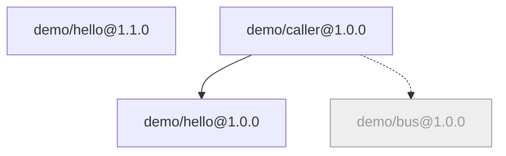

# BrickKit — part 2 of 9 (English)

Contains: docs/en/02-project-guide/03-local-debug-workflow.md, docs/en/02-project-guide/04-focus-run.md, docs/en/02-project-guide/05-multi-env-switch.md, docs/en/02-project-guide/06-up-and-down.md, docs/en/02-project-guide/07-upgrade-and-migration.md, docs/en/02-project-guide/08-remove-and-archive.md, docs/en/02-project-guide/09-status-and-graph.md, docs/en/02-project-guide/10-lint-and-checks.md, docs/en/02-project-guide/11-sync-and-restore.md, docs/en/02-project-guide/12-build-and-images.md, docs/en/03-component-guide/README.md, docs/en/03-component-guide/01-component-anatomy.md, docs/en/03-component-guide/02-component-yaml-reference.md, docs/en/03-component-guide/03-config-schema-design.md

Paths below are relative to the repository root: https://raw.githubusercontent.com/brickKit/brickKit/main/

Next: https://raw.githubusercontent.com/brickKit/brickKit/main/llms/en/03.md

---

> File: docs/en/02-project-guide/03-local-debug-workflow.md

# Local debugging

You're changing `demo/hello` and want to run it in your IDE with breakpoints, while the project's other components keep
running in containers and can still call your process. This page walks through it from the start.

Background: what your personal deploy file `deploy.local.yaml` is, and why it "replaces the whole file rather than
merging", is in [deploy.local.yaml](../../docs/en/01-three-layers/04-deploy-local-yaml.md).

In a large project where you only need this component and what it depends on, start with a focus run instead:
`brickkit up` in the component's directory runs just those, and `mode: debug` on the focus still gives you breakpoints —
see [Developing inside the project](../../docs/en/02-project-guide/04-focus-run.md).

## The whole flow

### 1. Turn local mode on

```bash
brickkit local on
```

```text
✅ Local mode is on: commands now read deploy.local.yaml
   deploy.local.yaml was copied from deploy.yaml — change it as you like, it is not committed
```

From then on the commands that run or check the deployment (`up`, `down`, `status`, `sync`, `lint`, `build`) read
`deploy.local.yaml`, and each run starts with a reminder (`graph` and `deps` keep reading `deploy.yaml`):

```text
Local mode is on: using deploy.local.yaml (brickkit local off switches back to deploy.yaml)
```

### 2. Mark the component you're debugging `mode: debug`

```yaml
# deploy.local.yaml
components:
  - id: demo/hello
    mode: debug
    localPort: 8080
  - id: demo/caller
    expose: true
    exposePort: 18080
```

`mode: debug` means "I start this component on my machine myself": the platform generates no container for it, but
still counts it as running, and the other components still get its address. `localPort` is the port your process
**actually listens on**. `demo/hello` listens on 8080 in its code, so 8080 goes here; if they differ, callers only get
connection refused. The process must also listen on **all interfaces** (`0.0.0.0`): containers come in through the host's
bridge address, and a process listening only on `127.0.0.1` never receives them (see
[Local debugging problems](../../docs/en/10-troubleshooting/02-local-debug-issues.md#containers-cant-reach-your-process)).

`mode: debug` can only be written in `deploy.local.yaml` — "I'm debugging this on my machine" is a personal fact, and
has no place in a file the team reviews.

### 3. Start the other components

```bash
brickkit up
```

```text
📋 Component state calculation:
   ✅ demo/hello@1.0.0   starting (mode: debug)
   ✅ demo/caller@1.0.0  starting (top-level)
```

```text
🔧 Local debugging (mode: debug):
   demo/hello@1.0.0
      No container is generated; start it in your IDE, listening on port 8080 on all interfaces (0.0.0.0) — containers cannot reach a process that listens on 127.0.0.1 only
      Environment variables: .brickkit/generated/local-debug.demo-hello-1-0-0.env
      VS Code: set "envFile": "${workspaceFolder}/.brickkit/generated/local-debug.demo-hello-1-0-0.env" in launch.json
```

```text
🐳 Starting (docker)...
   demo-caller-1-0-0            running (healthy)
✅ All components started (1)
```

`up` generated an environment file for `demo/hello`: every variable it would have got in its container, none missing.

```text
COMPONENT_ID=demo/hello
COMPONENT_VERSION=1.0.0
GREETING='Hi from the host process'
```

(`GREETING` comes from `config/demo-hello.yaml` — to try another value while debugging, change the config file and `up`
again as usual.)

### 4. Start it in your IDE

In VS Code, put that `envFile` line into `launch.json`; from a shell:

```bash
cd components/demo/hello
set -a && source ../../../.brickkit/generated/local-debug.demo-hello-1-0-0.env && set +a
go run .
```

Where the source comes from: `brickkit add demo/hello@1.0.0 --repo` clones it into `components/` (see
[Adding components](../../docs/en/02-project-guide/02-add-and-component-install.md#cloning-source---repo---repo-all)).

### 5. Check the container reaches you

```bash
curl http://localhost:18080/api/v1/call
```

```json
{"component":"demo/caller","endpoint":"http://demo-hello-1-0-0:8080","upstream":{"component":"demo/hello","greeting":"Hi from the host process","message":"Hi from the host process, I'm demo/hello@1.0.0","version":"1.0.0"},"version":"1.0.0"}
```

`demo/caller` in its container still calls `http://demo-hello-1-0-0:8080` — the address didn't change, and not a line of
component code did. Inside its container the platform resolves that service name to the host (Docker's
`extra_hosts: demo-hello-1-0-0:host-gateway`) and swaps the port for your `localPort`.

`status` lists it separately:

```text
🔧 Local debugging (mode: debug, not started by the platform)
 ┌────────────┬─────────┬─────────────────────────────────┐
 │ Component  │ Version │ Local address                   │
 ├────────────┼─────────┼─────────────────────────────────┤
 │ demo/hello │ 1.0.0   │ localhost:8080 (IDE debug mode) │
 └────────────┴─────────┴─────────────────────────────────┘
```

A few limits to know:

- **Docker / Podman only.** A Pod in a Kubernetes cluster can't reach your laptop; with the `k8s` target, `mode: debug`
  is rejected.
- **The debugged component runs no database migration.** The migration step went away with the container; if the
  component has migrations, run them by hand the first time.
- **Strings hard-coded in config aren't rewritten.** If you wrote an address pointing into the container network in
  `config/` (such as `http://host.docker.internal:8000`), it reaches your process as is; on your machine, change it to
  `localhost` yourself. The platform only rewrites the dependency addresses it computes.

## After the team changes files: the strict consistency check

You have local mode on, and a teammate adds a component and pushes. You pull:

```bash
git pull
brickkit up
```

```text
❌ Error: deploy.local.yaml is out of date: it does not match the components in brickkit.yaml
   File: deploy.local.yaml
   No entry for: demo/bus
   Reason: Local mode is on and brickkit.yaml changed, but your deploy.local.yaml was not updated
   Suggestions:
   1. Option A (recommended): brickkit local refresh regenerates deploy.local.yaml from deploy.yaml and keeps the old one as deploy.local.yaml.bak
   2. Option B: add or remove the listed entries in deploy.local.yaml by hand
   3. Option C: brickkit local off switches back to the team's deploy.yaml
```

Why an error rather than quietly adding the new component: the local file replaces `deploy.yaml` as a whole, and the CLI
doesn't know how the new component should run on your machine — the team's way, or do you have other plans? A wrong
guess means running something you didn't mean to, without knowing. So it stops and lists the three ways forward.

## `brickkit local refresh`

```bash
brickkit local refresh
```

```text
✅ Generated a fresh deploy.local.yaml from deploy.yaml. The old one is backed up at deploy.local.yaml.bak.
ℹ️ The old file had 2 local changes; merge the ones you still need into the new deploy.local.yaml by hand:
   - [demo/hello] mode: debug (now unset)
   - [demo/hello] localPort: 8080 (now unset)
```

`refresh` does three things:

1. keeps the old file as is in `deploy.local.yaml.bak` (overwriting the previous backup);
2. copies a complete new file from `deploy.yaml` — **no merging**: the new file is a copy of the team file;
3. compares the old file with the copy it was made from, and lists every local change you had that differs from the team
   file now: `mode`, `localPort`, `vars` values, a changed `target`, entries you moved, fields you deleted.

You just go down that list and copy back the lines you still want, instead of comparing two YAML files end to end. Once
copied back:

```yaml
components:
  - id: demo/hello
    mode: debug
    localPort: 8080
  - id: demo/caller
    expose: true
    exposePort: 18080
  - id: demo/bus
```

Why no automatic merge: however clever the merge rules, sometimes they guess wrong, and a wrong guess means "what the
file says isn't what runs". A whole-file replacement plus a list keeps the result visible at a glance.

## Debugging a shell member

A member hosted by a shell can be debugged on its own too: in `deploy.local.yaml`, write `mode: debug` and `localPort` on
that member under the shell's `members`. This time you start it on your machine, the shell **no longer hosts it** (it
isn't in the member list the shell receives), the other members stay in the shell, and other components get an address
pointing at your process. How shells work: [Shells](../../docs/en/04-shell/README.md).

## Turning local mode off

```bash
brickkit local off
```

```text
✅ Local mode is off: commands now read deploy.yaml
   deploy.local.yaml is kept; brickkit local on uses it again
```

The file stays, and the next `local on` picks it up as it is. To have a single run ignore it, you don't need to turn it
off: `brickkit up --no-local`.

---

> File: docs/en/02-project-guide/04-focus-run.md

# Developing inside the project

In a big project you rarely work on one component in isolation. You change `demo/caller`, you want to see it run
against the real `demo/hello` it calls, and the other forty components can stay off. This page is about doing that
**inside the project**: you stand in a component's directory, type `brickkit up`, and the project runs just that
component — from its source — plus what it needs.

That is a **focus run**. The component you are working on is the *focus*; everything the focus doesn't need stays off.

## Focus run or workbench

There are two ways to run a component while you develop it. They answer different questions:

| | Focus run (this page) | Workbench ([Developing inside a component](../../docs/en/03-component-guide/05-local-dev-fractal.md)) |
| --- | --- | --- |
| Where you work | Inside the project, in `components/<scope>/<name>/` | In the component's own repository, which has its own `brickkit.yaml` |
| What runs | The focus and what it needs, **at the versions the project uses** | Whatever the workbench declares — often the component plus stand-ins |
| Setup | None: the project already knows everything | A small project of its own, written once |
| Good for | "Does my change work in *this* system?" | Developing a component many projects use, on its own terms |

If the component lives in a project's `components/`, start with a focus run. A workbench is for components that have
a life outside one project.

## `up` in a component's directory

```bash
cd components/demo/caller
brickkit up
```

```text
📁 Project: ../../.. (my-shop)
✅ Local mode is on: commands now read deploy.local.yaml
   deploy.local.yaml was copied from deploy.yaml — change it as you like, it is not committed
🎯 Focus: demo/caller (written to deploy.local.yaml; brickkit up --all runs every component again)
Local mode is on: using deploy.local.yaml (brickkit local off switches back to deploy.yaml)
🚀 Starting project my-shop (target: docker)
📋 Component state calculation:
   ✅ demo/bus@1.0.0     starting (demo/caller needs it)
   ✅ demo/hello@1.0.0   starting (demo/caller needs it)
   ✅ demo/caller@1.0.0  starting (focus)
```

Line by line:

- **`📁 Project`** — there is no `brickkit.yaml` here, so `brickkit` looked upward, like `git` does, and found the
  project three levels up. Every project command works from any subdirectory; paths it prints are relative to where
  you are.
- **Local mode** — the focus is a personal setting, so it lives in your personal deploy file. If local mode was off,
  `up` turns it on first (the same as `brickkit local on`).
- **`🎯 Focus`** — the directory you are in belongs to `demo/caller`, so that is the focus.
- **The reasons** — each component says why it starts: `(focus)`, or `(demo/caller needs it)`.

The focus runs **from its source**, as a process on your machine (as if it were `mode: local`); what it needs runs in
containers, each given a port on your machine so your process can reach it:

```text
🐳 Starting (docker)...
   demo-bus-1-0-0               running (healthy)
   demo-hello-1-0-0             running (healthy)
✅ All components started (2)
```

```text
Starting 1 local component(s) — press Ctrl+C to stop
demo-caller-1-0-0  listening on port 8080
```

The process runs in the foreground; Ctrl+C stops it, and the containers keep running. To use breakpoints, write
`mode: debug` on the focus in `deploy.local.yaml` and start it from your IDE — see
[Local debugging](../../docs/en/02-project-guide/03-local-debug-workflow.md). The focus keeps a `mode: debug` you wrote.

## Where the focus lives

One line in `deploy.local.yaml`:

```yaml
# deploy.local.yaml
target: docker # docker | podman | k8s
focus: demo/caller

components:
  - id: demo/bus
  - id: demo/hello
  - id: demo/caller
```

It stays there until you change it: the next `up` runs the same focus, unless you run it in another component's
directory — that moves the focus there. `deploy.yaml`, the team's file, is never touched. Every command that reads the deploy file reminds you:

```text
🎯 Focus: demo/caller
```

## `--focus` and `--all`

From anywhere in the project, `--focus` sets the focus without changing directory:

```bash
brickkit up --focus demo/hello
```

```text
🎯 Focus: demo/hello (written to deploy.local.yaml; brickkit up --all runs every component again)
Local mode is on: using deploy.local.yaml (brickkit local off switches back to deploy.yaml)
🚀 Starting project my-shop (target: docker)
📋 Component state calculation:
   ⬜ demo/bus@1.0.0     not starting (outside the focus)
   ✅ demo/hello@1.0.0   starting (focus)
   ⬜ demo/caller@1.0.0  not starting (outside the focus)
```

`demo/hello` needs nothing, so it runs alone. `--all` removes the focus and runs every component again:

```bash
brickkit up --all
```

```text
📋 Component state calculation:
   ✅ demo/bus@1.0.0     starting (demo/caller needs it)
   ✅ demo/hello@1.0.0   starting (demo/caller needs it)
   ✅ demo/caller@1.0.0  starting (top-level)
```

`--focus` and `--all` only exist on `up`, and they can't be combined with `-f` or `--no-local`: those two mean "don't
read my personal file", and the focus is in it.

Which components start is worked out the same way as always, only from a different starting point: without a focus,
every top-level component starts; with one, only the focus and the components whose `mode` says they always run
(`enabled`, `local`, `debug`). What they need follows, as usual. Shells count too: a focused shell runs with its members (`starting (hosted by …)`), and
when the focus needs a component a shell hosts, that shell starts to host it (`starting (hosts …)`) rather than the
member running on its own. A focus can't be a component that is `mode: disable` — that is a contradiction, and `up`
refuses it without changing any file.

## What the other commands do with it

| Command | With a focus |
| --- | --- |
| `status`, `down`, `lint`, `build` | Show the `🎯 Focus` line. `down` stops the whole project, focus or not |
| `lint` | Also checks that the focus has source to run from |
| `sync` | **Ignores the focus**: it keeps the source of every component the project runs without one, so switching focus never moves directories around |
| `local refresh` | Lists the focus as one of your local changes, so you can put it back in the new file |
| `remove` | Removing the focused component removes the focus with it, and says so |
| `graph`, `deps` | Unaffected — they read `deploy.yaml` |
| `build`, `deps` without an argument | Use the component whose directory you are in |

`sync` with a focus on `demo/hello` still keeps all three:

```text
📂 Workspace tidying:
   ✅ components/demo/bus/                 active
   ✅ components/demo/caller/              active
   ✅ components/demo/hello/               active
✅ Workspace tidied (3 active, 0 archived, 0 activated)
```

`local refresh` copies `deploy.yaml` again, and the focus is one of the things it tells you to carry over:

```text
✅ Generated a fresh deploy.local.yaml from deploy.yaml. The old one is backed up at deploy.local.yaml.bak.
ℹ️ The old file had 1 local change; merge the ones you still need into the new deploy.local.yaml by hand:
   - [deploy] focus: demo/hello (now unset)
```

A focus run needs a process on your machine that the other components reach, so it works with `target: docker` and
`podman`. With `target: k8s`, nothing is written and `up` stops:

```text
❌ Error: deploy.local.yaml failed validation
   File: deploy.local.yaml
   focus: a focus run starts a process on your machine, which a cluster cannot reach; use target docker or podman
   Suggestion: Full field reference: docs/en/11-reference/03-deploy-yaml-schema.md (swap en for zh for the Chinese version)
```

## Moving versions forward

The focus runs the code in its directory, so that code has to be the version the project declares. When you bump
`demo/hello` to `1.1.0` in its `component.yaml` while `brickkit.yaml` still says `1.0.0`, `up` stops rather than run a
version the project doesn't know about:

```text
❌ Code that runs from a local repository does not match this run
   File: deploy.local.yaml
   components[1]: demo/hello@1.0.0 runs from the local repository components/demo/hello, which holds 1.1.0
   Suggestions:
   1. To run the version in the repository: brickkit upgrade demo/hello@1.1.0
   2. To run the version in the project: git -C components/demo/hello checkout 1.0.0
```

`brickkit upgrade demo/hello@1.1.0` moves the whole project to the new version — config migration included (see
[Upgrading and config migration](../../docs/en/02-project-guide/07-upgrade-and-migration.md)) — and a component that still requires `1.0.0` keeps that
version alongside. The project moves forward one explicit `upgrade` at a time; nothing moves because a directory
changed.

## One `components/`

Component source lives in exactly one place: the project's `components/`. When a component's repository is itself a
workbench, it can have a `components/` of its own — and if that ends up inside the project, the same component can
exist twice, and nobody can tell which copy runs. `up`, `lint` and `sync` refuse:

```text
❌ Error: component source is nested inside another component's directory
   components/demo/caller/components/demo/hello: demo/hello, inside demo/caller; the project's components/ has demo/hello too
   Before you move or delete it: It is not a Git repository — these files have no other copy
   Suggestions:
   1. The project's components/ already has demo/hello at components/demo/hello: carry over the changes you still need, then rm -rf components/demo/caller/components/demo/hello
   2. A component's source lives in one place, the project's components/; move or delete the nested copy yourself — BrickKit moves nothing
```

BrickKit never moves or deletes the nested copy for you: it may hold changes that exist nowhere else — the
"Before you move or delete it" line says whether it does. The suggestion gives the command for each copy: delete it
when the project already has the component (after carrying over what you still need), or move it into the project's
`components/` when the project doesn't. For the same reason, `brickkit add --repo` refuses to run inside a
workbench that sits in another project's `components/`: it would clone a second copy.

## Git submodules

BrickKit never fetches git submodules. `add --repo` clones without them and names the ones it skipped; `build` warns
when a component's source has submodules that are empty directories. Fetch them yourself with
`git submodule update --init` when you really need them — or, better, have the component publish an image so building
it needs nothing extra.

Every flag of `up` is in the [CLI reference](../../docs/en/07-cli-reference/README.md#brickkit-up).

---

> File: docs/en/02-project-guide/05-multi-env-switch.md

# Several environments

Docker on the development machines, Kubernetes for staging and production, a different database address in each.
BrickKit has exactly one way to do this: **one complete deploy file per environment**, chosen with `-f`.

## `-f` / `--file`

```bash
brickkit up -f deploy.prod.yaml
```

`-f` names the deploy file to read this time (relative to the project root). It's binding: even with local mode on,
`deploy.local.yaml` isn't read, and a missing file is an error rather than a fallback to the default. `up`, `down`,
`status`, `sync`, `lint` and `graph` all accept it.

```text
Using deploy.prod.yaml (--file)
🚀 Starting project my-shop (target: k8s)
```

When local mode is on, the first line adds a note, so you don't think your personal settings apply as well:

```text
Using deploy.prod.yaml (--file); local mode is ignored for this run
```

There's one `brickkit.yaml` and one `config/`, shared by every environment: which components, which versions, and what
the business config is are the same everywhere. Only "how it's deployed" differs.

## A production deploy file

```yaml
# deploy.prod.yaml
target: k8s

k8s:
  context: prod-cluster
  namespace: my-shop

vars:
  DB_HOST: pg.prod.internal

components:
  - id: demo/hello
    replicas: 2
  - id: demo/caller
    expose: true
    hostname: shop.example.com
  - id: demo/hello@1.0.0
  - id: demo/bus
```

Its entries must match every component version in `brickkit.yaml`, one for one, just like `deploy.yaml`; the difference
is that they describe how production runs: two replicas, opened to the outside through an Ingress with a host name,
deployed to a given namespace of a given cluster.

## `vars:` gives the same `config/` different values per environment

`demo/caller` connects to a database. On the development machine the address is `localhost`; in production it's
`pg.prod.internal`. The config file is written once, referencing a shared variable with `$var:`:

```yaml
# config/demo-caller.yaml
DATABASE_HOST: $var:DB_HOST
```

```yaml
# config/vars.yaml
DB_HOST: localhost
```

The production deploy file overrides it under `vars:` (see `deploy.prod.yaml` above). `$var:` looks in the current deploy
file's `vars:` first, then in `config/vars.yaml`:

```bash
brickkit up -f deploy.prod.yaml --dry-run
```

```text
📄 Generated 12 manifests: .brickkit/generated/k8s/
   Namespace: my-shop
```

In the generated Deployment:

```yaml
            - name: DATABASE_HOST
              value: pg.prod.internal
```

Without `-f` (on the development machine, reading `deploy.yaml`), the generated `compose.yaml` has:

```text
      - DATABASE_HOST=localhost
```

The production database password works the same way: write `PG_PASSWORD: ${PG_PASSWORD}` in `config/vars.yaml` and keep
the real value in the deploy machine's environment; on Kubernetes the CLI evaluates it when generating the manifests and
puts it into the generated Secret (see [Secrets](../../docs/en/01-three-layers/07-sensitive-values.md)).

On Kubernetes, `--dry-run` only generates manifests and doesn't connect to the cluster. For a real deployment, `up` first
confirms that `kubectl`'s current context is the deploy file's `k8s.context`, and only then acts — deploying to the wrong
cluster can't be undone.

## `-f` vs. `--no-local`

| | `--no-local` | `-f <file>` |
| --- | --- | --- |
| Reads | `deploy.yaml` | The file you name |
| Local mode | Ignored this time, the switch unchanged | Ignored this time, the switch unchanged |
| When | Local mode is on and you want one run with the team's config | Deploying to another environment |

## Recommendations

- **One complete, self-contained file per environment.** No inheritance, no "base file + overlay" merging: open
  `deploy.prod.yaml` and you see everything production runs. The cost is some repeated entries across files; in exchange,
  no file ever changes quietly because something elsewhere did.
- **Changes to the production file go through code review.** The Git diff is the review: which environment changed, and
  how, at a glance.
- **One file per cluster.** To deploy to another cluster, copy the file and change `k8s.context`; there is no flag for
  switching clusters on the command line.
- **Changes to the component list start in `brickkit.yaml`.** `add` / `remove` / `upgrade` maintain `deploy.yaml` (and
  `deploy.local.yaml` when it exists) as well; other deploy files are yours to bring along — the commands name the ones
  that haven't caught up at the end of their output, and `lint -f <file>` reports them too.

---

> File: docs/en/02-project-guide/06-up-and-down.md

# Starting and stopping

## What `brickkit up` does

```bash
brickkit up
```

```text
🚀 Starting project my-shop (target: docker)
⚠️ Warning: optional dependency missing: demo/bus@1.0.0
   Affected component: demo/caller@1.0.0
   Reason: demo/bus@1.0.0 is not declared in brickkit.yaml
   Impact: This component's environment variable DEMO_BUS_ENDPOINT will not be injected
   💡 Degrading gracefully for a missing optional dependency is the component's own responsibility; to enable it, confirm it has been published and is available from an install source
📋 Component state calculation:
   ✅ demo/hello@1.0.0   starting (demo/caller needs it)
   ✅ demo/caller@1.0.0  starting (top-level)

📋 Start order (topological sort):
   1. demo-hello-1-0-0   no dependencies
   2. demo-caller-1-0-0  ← depends on 1

Can start on their own: demo-hello-1-0-0 (no dependencies)
Longest dependency chain (2 levels): demo-hello-1-0-0 → demo-caller-1-0-0

Dependency graph:
   demo/caller@1.0.0 → demo/hello@1.0.0
                     → demo/bus@1.0.0 (optional, not installed)
📄 Generated: .brickkit/generated/compose.yaml

🔧 Database migrations that run before startup (on failure that component won't start):
   demo/caller@1.0.0  /app/caller migrate

🐳 Starting (docker)...
   demo-hello-1-0-0             running (healthy)
   demo-caller-1-0-0            running (healthy)
✅ All components started (2)

💡 View the status: brickkit status
   View the logs: docker compose -p brickkit-my-shop logs -f
```

In order:

1. **Load and check consistency.** Read `brickkit.yaml`, the deploy file, `config/`, and every component's
   `component.yaml`. If the three layers don't agree (the deploy file lacks a component, a config file holds a conflict
   block, a `$var:` references something undefined), stop.
2. **Decide what runs.** Who starts this time: a top-level component (nothing depends on it) without a `mode` starts, and
   a component further down starts as long as something above it runs and needs it. Every line states its reason —
   "top-level", "demo/caller needs it", "mode: debug".
3. **Check dependencies and sort.** A missing required dependency is an error; a missing optional one is a warning, and
   its address isn't injected. The dependencies give the start order.
4. **Generate the deployment files.** Resolve config, inject environment variables (dependency addresses, the
   component's own config), write `.brickkit/generated/compose.yaml` (a set of Kubernetes manifests when the target is
   `k8s`). It's a generated file, rewritten every time — don't edit it by hand.
5. **Check images.** See the next section.
6. **Run database migrations.** A component that declares `migration.command` first runs its migration with the same
   image; if the migration fails, that component doesn't start.
7. **Call the engine.** `docker compose up` (or `podman compose`, `kubectl apply`), waiting for every component's health
   check to pass.

`up` is idempotent: run it again with nothing changed, and the engine finds everything in place and touches nothing.
Change the config and run it again, and only the affected containers are recreated.

## The image check: `up` never builds

```text
❌ Error: these images are built locally and have not been built yet
   demo/hello@1.0.0: demo-hello:1.0.0
   demo/caller@1.0.0: demo-caller:1.0.0
   Suggestions:
   1. up never builds on its own (building and deploying are separate): run brickkit build first
   2. Or build just one of them: brickkit build demo/hello@1.0.0
   3. Or build just one of them: brickkit build demo/caller@1.0.0
```

| Component | How `up` checks it |
| --- | --- |
| From a local source (code being developed), or its `component.yaml` says only how to build and names no `image` | The image must already be on this machine (built by `brickkit build`); otherwise it's an error |
| A Git / market component that names an `image` | The image is on this machine or can be pulled from the registry; otherwise it's an error, with a note that you can build locally instead |

Every problem is listed at once, rather than one at a time. Why it doesn't just build: see [Building and images](../../docs/en/02-project-guide/12-build-and-images.md).

## `--dry-run`: generate, don't start

```bash
brickkit up --dry-run
```

It goes through the first four steps, writes the deployment files, and stops:

```text
📄 Generated: .brickkit/generated/compose.yaml

🔧 Database migrations that run before startup (on failure that component won't start):
   demo/caller@1.0.0  /app/caller migrate

💡 --dry-run only generates the files and starts no component
   View it: cat .brickkit/generated/compose.yaml
```

It's for reviewing before you act: which components will start, what environment variables each one gets, which
databases will be touched. It's also the most complete check short of running — dependency resolution and the checks on
shells and members happen here, while `lint` deliberately doesn't do them (see [Offline checks](../../docs/en/02-project-guide/10-lint-and-checks.md)).
`--ignore-shells` together with `--dry-run` verifies that every component can still start on its own, outside its shell.

## `brickkit down`

```bash
brickkit down
```

```text
🛑 Stopping project my-shop
✅ All components stopped

💡 Data volumes were not deleted; database data is still there
   For a full cleanup, run by hand: docker volume rm <volume-name>
   Start again with: brickkit up
```

- **Volumes aren't deleted.** The database's data stays, and the next `up` uses it. To wipe it, run `docker volume rm`
  yourself — deleting data by mistake costs too much, so that step is left to a person.
- **To stop only some components:** write `mode: disable` on their deploy entries and `up`. Their containers are removed,
  components further down that ran only for them stop too, and the deploy file keeps a record, so the next `up` doesn't
  bring them back.
- **`mode: local` components** are processes watched in the foreground by the terminal that ran `up`; they can only be
  stopped there with `Ctrl+C`. `down` can't reach them and only names that session's process ID.

## Common start failures

**A required config item has no value.**

```text
❌ Error: a required component config item has no value
   Missing config: demo/widget@0.1.0 → API_URL
   Reason: The component declares it in configSchema.required without a default — the platform can't derive this one, so the project has to supply it
   Suggestions:
   1. Give it a value in config/demo-widget.yaml:
    API_URL: <value>
   2. The value may be ${ENV_VAR} (real value in .env), $var:NAME (shared, from config/vars.yaml) or file://path
```

The platform would rather stop before starting than let a component run without an address it needs, looking healthy,
with one call path that never works.

**An image doesn't exist.** See the image check above: `brickkit build` first.

**A host port conflict.** Two components opened on the same host port are caught when the deploy file is validated:

```text
❌ Error: deploy.yaml failed validation
   File: deploy.yaml
   components[1].exposePort: conflicts with components[0].exposePort (host port 18080 is already taken)
   Suggestion: Full field reference: docs/en/11-reference/03-deploy-yaml-schema.md (swap en for zh for the Chinese version)
```

When another program on the machine holds the port, Docker reports it when starting the container — pick another
`exposePort`.

**A component doesn't come up, its health check never passes.** Look at its logs first:
`docker compose -p brickkit-my-shop logs <service>` (the `-p` matters: it names this project). More cases are in
[Troubleshooting](../../docs/en/10-troubleshooting/01-up-down-issues.md).

---

> File: docs/en/02-project-guide/07-upgrade-and-migration.md

# Upgrading and config migration

A component's author released a new version. Upgrading is more than changing a version number: the new version may add
config items, drop some, or change defaults, and the values you wrote in `config/` have to move with it.
`brickkit upgrade` does all of that in one go.

## Three ways to write it

| Written | What it does |
| --- | --- |
| `brickkit upgrade` | Every component with a newer version moves to its latest — all of them, or none |
| `brickkit upgrade demo/hello` | Only this one, to its latest |
| `brickkit upgrade demo/hello@2.0.0` | Up (or down) to a given version |

Without a version it only moves forward: if the latest in the install source is older than the project's, the project
counts as up to date — never a quiet downgrade.

## Preview first: `--dry-run`

```bash
brickkit upgrade --dry-run
```

```text
📋 upgrade would do this:
   ⬆️  demo/hello: 1.0.0 → 1.1.0
   ✅ demo/hello@1.0.0 (requiredBy: demo/caller)
📝 config/demo-hello.yaml
   ⚠️  Conflict GREETING: your value Howdy, new default Hi
📝 Would write: brickkit.yaml, deploy.yaml, deploy.local.yaml

⚠️  These config files would get conflict blocks: config/demo-hello.yaml. A real upgrade asks you about each one in the terminal; with --yes or no terminal input it writes the blocks, and up refuses to start until they are resolved

💡 --dry-run: no file was changed
```

The preview really does the whole thing on a copy of the project's files, so an upgrade that would fail fails in the
preview too. Three things can be read from it:

1. `demo/hello`'s default version moves from 1.0.0 to 1.1.0;
2. `demo/caller@1.0.0` still depends on `demo/hello@1.0.0`, so 1.0.0 **stays**, marked with who needs it;
3. you changed `GREETING` to "Howdy", and 1.1.0 changed its default from Hello to Hi — that's a conflict.

## The real upgrade

```bash
brickkit upgrade
```

```text
GREETING of demo/hello: your value Howdy (1.0.0), new default Hi (1.1.0) — [m] keep yours / [n] take the new one / Enter keeps both as a conflict to resolve later: 

   ⬆️  demo/hello: 1.0.0 → 1.1.0
   ✅ demo/hello@1.0.0 (requiredBy: demo/caller)
📝 config/demo-hello.yaml
   ⚠️  Conflict GREETING: your value Howdy, new default Hi
📝 Written: brickkit.yaml, deploy.yaml, deploy.local.yaml

⚠️  These config files contain conflict blocks, and up refuses to start until they are resolved: config/demo-hello.yaml. Open them in a plain text editor, keep one line and delete the other and the comment
```

Each conflict is asked about in the terminal: `m` keeps your value, `n` takes the new default, and plain Enter keeps both
lines for you to choose later (that's what happened above). With `--yes` or no terminal input (scripts, CI), both lines
are always kept.

The upgrade changed these files:

```yaml
# brickkit.yaml
components:
  - id: demo/hello
    version: 1.1.0
  - id: demo/bus
    version: 1.0.0
  - id: demo/caller
    version: 1.0.0
  - id: demo/hello
    version: 1.0.0
    requiredBy: [demo/caller]
```

The deploy files (`deploy.yaml`, and `deploy.local.yaml` when it exists) gained an entry for the version that stayed:

```yaml
  - id: demo/hello@1.0.0
```

`config/demo-hello.yaml` belongs to the default version (1.1.0) and was migrated; the 1.0.0 that stayed gets a config
file with the version in its name, `config/demo-hello@1.0.0.yaml`, holding your original values, not a character changed:

```yaml
# Component: demo/hello@1.0.0
# Environment variables for this component; every key is injected as-is.
# Shared variable: $var:NAME (config/vars.yaml) · environment variable: ${NAME} · local file: file://path

# === Optional: commented keys use the component's default; uncomment to override ===
GREETING: Howdy
```

When no component depends on the old version any more, it doesn't stay, and its config moves into `config/.archive/`.

## How config is migrated

Each config item is decided mechanically by the table below — no rename guessing, no type conversion:

| Situation | Result |
| --- | --- |
| You didn't write it (still a comment in the skeleton) | Written as the new version's skeleton line, following the new default |
| You wrote it, and the new version's default didn't change | Your text copied as is — `$var:`, `${VAR}`, `file://`, quotes, the comment above it, not a character touched |
| You wrote it, and your value happens to equal the old default | Evidently you never changed it: it follows the new default |
| You wrote a value other than the old default, and the new version changed the default | **A conflict**: you changed it, the author changed it, and only you know which is right |
| The new version dropped the item | Not written into the new file; the value stays in the archive, and the report lists it |
| An item the new version added | Written as a skeleton line; a required one without a default becomes `KEY: ""`, and `up` stops until you fill it in |

Comments you wrote move along with what they're about: those at the top of the file stay at the top, those above an item
stay above it (whether you wrote a value for the item or it's still a commented-out skeleton line), and those after the
last item stay at the end. A comment above an item the new version dropped goes with it. The skeleton's own notes and
section headings are regenerated for the new version, so they don't appear twice. Block scalars (`|`, `|+`, `>` and other
multi-line forms) are carried over as written, parsing back to exactly the same value.

When the old version doesn't stay, its whole config file is kept in `config/.archive/<component>@<old version>.yaml`, to
compare against whenever you like.

## Resolving a conflict

A conflict is written as two lines with the same key:

```yaml
# ⚠️ Config conflict: upgrading to 1.1.0 changed the suggested value of this key.
# Keep one line, delete the other and this comment; until then brickkit refuses to start.
GREETING: Howdy  # brickkit:conflict current 1.0.0
GREETING: Hi  # brickkit:conflict proposed 1.1.0
```

Until then, `up` refuses to start:

```text
❌ Error: unresolved configuration conflicts
   File: config/demo-hello.yaml
   Config item: GREETING
   Line 8: Howdy (your previous value, 1.0.0)
   Line 9: Hi (suggested by 1.1.0)
   Suggestions:
   1. Open the file in a plain text editor, keep the line you want, delete the other one and the comment above them, then run the command again
   2. Do not run yq or your editor's Format Document on this file: they silently drop one of the duplicate keys, and the conflict disappears without being resolved
   💡 Your editor may mark this file as invalid YAML. That is expected: BrickKit wrote the duplicate key on purpose so the conflict cannot be missed
```

Why use "broken YAML" with duplicate keys: it makes a conflict **impossible to overlook**. A comment would leave a file
that still runs — possibly with the wrong value. In a plain text editor, keep the line you want (the
`# brickkit:conflict …` marker at its end can go too), and delete the other line and the two lines of explanation:

```yaml
GREETING: Howdy
```

Then `build` (the new version's image) and `up` as usual. Both versions run at once:

```text
📋 Component state calculation:
   ✅ demo/hello@1.1.0   starting (top-level)
   ✅ demo/bus@1.0.0     starting (demo/caller needs it)
   ✅ demo/hello@1.0.0   starting (demo/caller needs it)
   ✅ demo/caller@1.0.0  starting (top-level)
```

## When a component comes from a local source

After `add --repo` clones a component's source into `components/`, the component is provided by the local source — the
local source comes first, and the first source that has a component decides. Its "latest version" is then **the version
in the working copy's `component.yaml`**; newer tags on Git don't count:

```text
✅ Every component is up to date
ℹ️ These components come from a local source, so "latest" is the version in their working copy's component.yaml — newer tags on a remote don't count:
   demo/hello@1.0.0 (local source local-dev)
   💡 To move one: check out that version in its source directory (git checkout <version>), then brickkit upgrade
```

That's on purpose: you cloned the source because you want to run the code in your hands. To upgrade, check out the new
version in the source directory:

```bash
git -C components/demo/hello checkout 1.1.0
brickkit upgrade
```

## Shells

Upgrading a shell switches its members to **the set of versions the new shell declares** — the shell's image compiles in
exactly those versions, so members can't be upgraded on their own. How member compatibility is checked after an upgrade,
and the ways out when member versions don't match: [Upgrading a shell](../../docs/en/04-shell/07-shell-upgrade.md).

## After upgrading

- Components built locally need `brickkit build` again (the new version's image doesn't exist yet; `up` will say so).
- Deploy files for other environments used with `-f` aren't changed by `upgrade` — the end of its output names them;
  bring the new entries over yourself.
- Commit the changes to `brickkit.yaml`, the deploy files and `config/` together: those files, together, describe this
  upgrade.

---

> File: docs/en/02-project-guide/08-remove-and-archive.md

# Removing and archiving

## What `brickkit remove` checks first

**With several versions, you must name the one to remove:**

```text
❌ Error: demo/hello has several versions (1.1.0, 1.0.0); name the one to remove
   Suggestion: For example brickkit remove demo/hello@1.1.0
```

**While another component still requires it, it isn't removed:**

```text
❌ Error: demo/hello@1.0.0 is still required by: demo/caller@1.0.0
   Suggestion: Remove (or upgrade) the components that depend on it first, then remove it
```

Remove it, and the component depending on it can't start — better to stop now than to find out at the next `up`.

**When only optional dependencies point at it, it goes, and you're told the effect:**

```bash
brickkit remove demo/bus
```

```text
➖ Removed demo/bus@1.0.0
ℹ️  demo/caller@1.0.0 optionally depends on demo/bus@1.0.0: it keeps running, without the address of demo/bus@1.0.0
🗄️  Config archived: config/demo-bus.yaml → config/.archive/demo-bus@1.0.0.yaml
📝 Written: brickkit.yaml, deploy.yaml, deploy.local.yaml
```

## What removing does

- the declaration in `brickkit.yaml` goes;
- its deploy entries go (`deploy.yaml`, and `deploy.local.yaml` when it exists; other deploy files used with `-f` are
  named in the output for you to bring along);
- its config is **not** deleted but moved to `config/.archive/<component>@<version>.yaml`;
- compatibility versions kept only for it (those whose `requiredBy` names only it) go with it;
- when it's a shell, the members it hosted move back to the top level of the deploy file and run on their own.

**A version is promoted to default.** When the default version is removed and one version of the component is left,
that one becomes the new default, and its config file goes back to the name without a version:

```bash
brickkit remove demo/hello@1.1.0
```

```text
➖ Removed demo/hello@1.1.0
   ⭐ demo/hello@1.0.0 is now the default version
🗄️  Config archived: config/demo-hello.yaml → config/.archive/demo-hello@1.1.0.yaml
📝 Written: brickkit.yaml, deploy.yaml, deploy.local.yaml
```

## Archiving and restoring

`config/.archive/` is this machine's undo button (not in Git). When you later `add` the same component again, its config
comes back from the archive instead of a blank skeleton:

```bash
brickkit add demo/bus
```

```text
🔎 No version given for demo/bus; the latest is 1.0.0 (install source company-git)
➕ Adding demo/bus@1.0.0
   ✅ demo/bus@1.0.0
📝 Written: brickkit.yaml, deploy.yaml, deploy.local.yaml
♻️  config/demo-bus.yaml restored from the archive (config/.archive/demo-bus@1.0.0.yaml, migrated to this version)
📝 config/demo-bus.yaml
   Kept as written: GREETING
📦 Artifacts: 1 file, in .brickkit/artifacts/
```

Restoring uses the same [migration rules](../../docs/en/02-project-guide/07-upgrade-and-migration.md#how-config-is-migrated) as an upgrade rather than a
plain copy: what you add back may be another version, and items the new version dropped, added or gave a new default are
handled by that table. When the archive holds several versions, the one for the same version is taken; failing that, the
highest one not above this version; failing that, the highest one.

## The source directory

When a component's **last version** is removed, its source directory under `components/` (and any archived copy under
`components/.archived/`) is deleted too — otherwise it would become a directory nobody claims and `sync` no longer
manages.

But first it checks that what's deleted could be recovered:

```text
❌ Error: the source directory could not be recovered once deleted, so nothing was removed
   Component: demo/hello
   Directory: components/demo/hello/
   Reason: It has uncommitted changes (untracked files included)
   Suggestions:
   1. Save it first: commit and push to a remote, or move the directory elsewhere
   2. If you are sure you do not need it: brickkit remove demo/hello --force
```

Uncommitted changes, or commits not pushed to a remote, stop it. If you're sure you don't need them, add `--force`:

```text
➖ Removed demo/hello@1.0.0
🗄️  Config archived: config/demo-hello.yaml → config/.archive/demo-hello@1.0.0.yaml
📝 Written: brickkit.yaml, deploy.yaml, deploy.local.yaml
🗑️  Source directory deleted: components/demo/hello/
```

`remove` means "remove completely": the declaration, the deploy entries and the source all go; only the config stays in
the archive, because it may hold values you spent time tuning.

---

> File: docs/en/02-project-guide/09-status-and-graph.md

# Status and topology

Three read-only commands, each answering one question: what's running now (`status`), who depends on whom (`deps`), and
what the whole graph looks like (`graph`).

## `brickkit status`

The CLI stores no running state — there's no background process keeping it. `status` asks the engine directly every time
(`docker compose ps`, or `kubectl get deployments`):

```text
📊 Project status: my-shop (target: docker)

✅ Running (3 components)
 ┌─────────────┬─────────┬───────────────────┬───────────────────────────────────────────────┐
 │ Component   │ Version │ Status            │ Port                                          │
 ├─────────────┼─────────┼───────────────────┼───────────────────────────────────────────────┤
 │ demo/hello  │ 1.0.0   │ running (healthy) │ 8080/tcp                                      │
 │ demo/caller │ 1.0.0   │ running (healthy) │ 0.0.0.0:18080->8080/tcp, [::]:18080->8080/tcp │
 │ demo/hello  │ 1.1.0   │ running (healthy) │ 8080/tcp                                      │
 └─────────────┴─────────┴───────────────────┴───────────────────────────────────────────────┘

⬜ Not started (1 component)
 ┌───────────┬─────────┬─────────────────────────────────────┐
 │ Component │ Version │ Reason                              │
 ├───────────┼─────────┼─────────────────────────────────────┤
 │ demo/bus  │ 1.0.0   │ disabled explicitly (mode: disable) │
 └───────────┴─────────┴─────────────────────────────────────┘
```

- Two versions of the same component get a row each (`demo/hello` 1.0.0 and 1.1.0 here).
- Components not started this time are listed too, with the reason; a reason that comes from `deploy.local.yaml` is
  marked as such.
- In the Port column, `0.0.0.0:18080->8080` means it's open on the host; a bare `8080/tcp` is reachable only on the
  container network.
- `mode: debug` components get a table of their own (see [Local debugging](../../docs/en/02-project-guide/03-local-debug-workflow.md)). `mode: local`
  components are processes watched by `up` in another terminal, so they aren't in the table; when such a session is
  running, it says which process.

After `down`, the components that should run are listed as not running, with a pointer to the logs (the disabled `demo/bus` stays in the "not started" table):

```text
❌ Not running (3 components)
 ┌─────────────┬─────────┬─────────────┐
 │ Component   │ Version │ Status      │
 ├─────────────┼─────────┼─────────────┤
 │ demo/hello  │ 1.0.0   │ not created │
 │ demo/caller │ 1.0.0   │ not created │
 │ demo/hello  │ 1.1.0   │ not created │
 └─────────────┴─────────┴─────────────┘
   View the logs to find out why: docker compose -p brickkit-my-shop logs <service-name>

📋 No components are running (perhaps brickkit down was already run)
   Start again with: brickkit up
```

## `brickkit deps`

`brickkit.yaml` only locks versions; it doesn't say who depends on whom — each component declares its own dependencies in
its `component.yaml`, and copying them into the project file would only let the two drift apart. `deps` reads them and
prints a tree:

```bash
brickkit deps
```

```text
demo/hello@1.1.0

demo/caller@1.0.0
├── demo/hello@1.0.0
└── demo/bus@1.0.0 (optional)
```

One tree per top-level component (nothing in the project depends on it). Within one output a component version is
expanded only once; later appearances are marked "(see above)"; an optional dependency missing from the project is marked
"(optional, not installed)".

For one component: a tree per version, plus who depends on it:

```bash
brickkit deps demo/hello
```

```text
demo/hello@1.0.0

Required by: demo/caller@1.0.0

demo/hello@1.1.0

Required by: nothing (top-level)
```

`brickkit deps demo/hello@1.0.0` shows only that version.

## `brickkit graph`

The same dependency graph, drawn as Mermaid:

```bash
brickkit graph
```

```text
graph TD
    demo_hello_1_1_0["demo/hello@1.1.0"]
    demo_bus_1_0_0["demo/bus@1.0.0"]
    demo_hello_1_0_0["demo/hello@1.0.0"]
    demo_caller_1_0_0["demo/caller@1.0.0"]
    demo_caller_1_0_0 --> demo_hello_1_0_0
    demo_caller_1_0_0 -.-> demo_bus_1_0_0
    classDef disabled fill:#eee,stroke:#999,color:#999;
    class demo_bus_1_0_0 disabled
```

Rendered, it looks like this:



| In the diagram | Means |
| --- | --- |
| Solid line | Required dependency |
| Dashed line | Optional dependency; one missing from the project is drawn as a "not installed" node |
| Greyed out | Won't start this time (here `demo/bus` is turned off with `mode: disable`) |
| Group box | Members a shell hosts are drawn inside the shell's box; `--ignore-shells` shows each component on its own |
| Special label | `mode: local` components are marked "managed locally" |

Edges are always drawn, whether or not the other end runs this time: the diagram shows the declared structure, and
"does it run" is expressed by the node's style.

**Save it as a file.** Stdout carries nothing but Mermaid, so:

```bash
brickkit graph > graph.mmd
```

GitHub renders a `.mmd` file directly; in Markdown, put it in a `mermaid` code fence. Warnings from dependency resolution
go to stderr and never end up in the file.

**It never reads local mode.** `graph` reads `deploy.yaml` (or the file named with `-f`), never `deploy.local.yaml` — the
diagram can be committed and shared, and doesn't depend on who generated it.

`deps` and `graph` both need the complete dependency graph: components not yet cached have their `component.yaml`
fetched from the install sources, so they may go to the network.

---

> File: docs/en/02-project-guide/10-lint-and-checks.md

# Offline checks

## `brickkit lint`

No network, no Docker or Kubernetes, no file changed: it checks the project's YAML in seconds:

```bash
brickkit lint
```

```text
✅ brickkit.yaml
✅ deploy.yaml
✅ deploy.local.yaml
✅ cross-file: brickkit.yaml ↔ deploy.yaml ↔ config/
✅ cross-file: brickkit.yaml ↔ deploy.local.yaml ↔ config/
✅ components/demo/hello/component.yaml

📋 Checked 6 files: 0 with errors, 0 warnings
```

In a project directory (with a `brickkit.yaml`), it checks in turn:

| What | Examples |
| --- | --- |
| The structure of `brickkit.yaml` | Required fields, types, versions only exact |
| The structure of the deploy files | Unknown fields (typos), `mode: debug` in `deploy.yaml`, `localPort` without `mode`, host port conflicts |
| Whether the three layers agree | Exactly one deploy entry per component version; shell members nested under their shell; `config/` files matching components |
| References in `config/` | Every `$var:` defined; no conflict blocks (duplicate keys) left by an upgrade |
| Config against `configSchema` | Required items have values; written keys are in the schema (a mistyped key has no effect); shell members' values can go into the shell |
| Shell declarations | `kind: shell` in `brickkit.yaml` agrees with the component's `shell` block; members nested under a shell are really compiled into it |
| `component.yaml` files in local sources | Every one, added or not (`.archived/` excluded) |

When `deploy.local.yaml` exists it's checked too — whether local mode is on or not, it must agree with `brickkit.yaml`.
With `-f`, only that deploy file is checked. When `brickkit.yaml` itself fails, nothing after it can be trusted; the rest
is skipped, and it says why.

In a component repository (a `component.yaml`, no `brickkit.yaml`), only that `component.yaml` is checked.

A typical error:

```text
✅ brickkit.yaml
❌ Error: deploy.yaml failed validation
   File: deploy.yaml
   components[1].exposed: unknown field (line 8), did you mean expose?
   Suggestion: Full field reference: docs/en/11-reference/03-deploy-yaml-schema.md (swap en for zh for the Chinese version)
✅ deploy.local.yaml
✅ components/demo/hello/component.yaml

📋 Checked 4 files: 1 with errors, 0 warnings
❌ Error: the structure check did not pass
   Checked: 4 files
   With errors: 1 file
   Suggestion: Fix them at the locations listed above, then run brickkit lint again
```

An unknown field is an error, not a warning: with `exposed: true` mistyped, the component simply isn't opened to the
outside, and nothing else would ever tell you.

## `--strict`

`--strict` checks one more kind of thing — whether referenced **values** exist: a `${VAR}` found in neither the process
environment nor `.env`, a `file://` whose file doesn't exist. And warnings count as failures:

```bash
brickkit lint --strict
```

```text
⚠️ Warning: demo/caller@1.0.0's DATABASE_NAME points at a file:// that does not exist
   Path: .secrets/dbname
   Suggestion: file:// paths are relative to the project root; keep such files out of Git (e.g. under .secrets/)
⚠️ Warning: demo/caller@1.0.0's DATABASE_USER references an environment variable that is not set here
   Variable: DB_USER
   Suggestion: It is looked up in the process environment first, then .env in the project root — set it in one of them
```

```text
📋 Checked 6 files: 0 with errors, 2 warnings
❌ Error: the structure check did not pass
   Checked: 6 files
   Warnings: 2 (--strict: warnings count as failures)
   Suggestion: Fix them at the locations listed above, then run brickkit lint again
```

Without `--strict` these two aren't checked: on a development machine, the production passwords aren't in the
environment anyway. (`up` on Docker does check that a `${VAR}` the deployment will use is defined — see
[Secrets](../../docs/en/01-three-layers/07-sensitive-values.md).)

## Exit codes

| Result | Exit code |
| --- | --- |
| No problems, or only warnings | 0 |
| Errors | 1 |
| Warnings under `--strict` | 1 |

## What `lint` doesn't check

- **Whether dependencies resolve, and whether the member versions a shell hosts this time are right.** That needs every
  component's `component.yaml` and the complete dependency graph, plus working out what runs this time — for Git or
  market components, that means the network. `lint` promises to be offline, read-only and immediate, so it doesn't build
  that graph. Those are left to `brickkit up --dry-run`: it has to resolve the graph anyway, and names a missing required
  dependency or a mismatch between hosted and compiled-in versions.
- **Whether config values satisfy the `configSchema` constraints** (`enum`, `minimum`, `pattern`…). The platform checks
  key names, not values: a wrong value makes the component complain loudly on its own, while a wrong key name does
  nothing at all — your config just quietly doesn't apply — so only the latter is checked. See the
  [configSchema specification](../../docs/en/11-reference/04-config-schema-spec.md).

## In CI

```bash
brickkit lint --strict
brickkit lint --strict -f deploy.prod.yaml
brickkit up --dry-run -f deploy.prod.yaml
```

- `lint --strict` as a gate: structural errors and undefined references are stopped before merging. CI needs the values of
  those `${VAR}` (or drop `--strict` for a structure-only step).
- Check each environment's deploy file with `-f`: by default only `deploy.yaml` is checked.
- Add an `up --dry-run` step to check dependency resolution too — it needs access to the install sources, but not to the
  cluster.

---

> File: docs/en/02-project-guide/11-sync-and-restore.md

# Managing source

`components/` holds component source you cloned or are writing. As a project grows, most of that source is code you're
not touching right now: your IDE indexes it, and global search, `grep` and an AI reading code for you all scan it anyway.
The two commands on this page manage that directory.

## `brickkit sync`

Moves the source of components that **won't start** this time into `components/.archived/`, and moves the source of
components that **will start** but sit in the archive back out.

The criterion is exactly `up`'s. So to narrow what you work on, turn off top-level components in the deploy file — the
components below that ran only for them stop too, and `sync` follows:

```yaml
# deploy.yaml
components:
  - id: demo/hello
    mode: disable
  - id: demo/bus
  - id: demo/caller
    mode: disable
  - id: demo/hello@1.0.0
```

```bash
brickkit sync
```

```text
📂 Workspace tidying:
   📦 components/demo/hello/               → components/.archived/demo/hello
      Reason: disabled explicitly (mode: disable)
✅ Workspace tidied (0 active, 1 archived, 0 activated)
```

The rules:

- **Both directions.** Archive what should be archived, bring back what should be active.
- **Directories only.** It doesn't affect running containers or change what `up` starts.
- **Per component.** As long as any version of a component starts this time, its source stays active (had only
  `demo/hello`'s default version been turned off above, `demo/hello@1.0.0` would still run for `demo/caller`, and the
  source wouldn't be archived).
- **Only components declared in `brickkit.yaml` whose source is present.**
- **The whole directory moves, `.git` included.** Git keeps working inside it after archiving.
- **No `--dry-run`.** If it got it wrong, running it again brings things back.
- **The focus doesn't count.** A [focus run](../../docs/en/02-project-guide/04-focus-run.md) is a temporary narrowing, not a statement of what source
  you need: `sync` keeps the source of everything the project runs *without* the focus, so switching focus never moves
  directories back and forth.
- **One `components/`.** When a component's source sits nested inside another component's directory, `sync` stops
  before moving anything and lists each copy — moving directories around a copy nobody can place would only make it
  worse. See [Developing inside the project](../../docs/en/02-project-guide/04-focus-run.md#one-components).

`sync` is a command of its own, not folded into `up`: `up` manages what runs, `sync` manages directories. If `up` moved
your files as a side effect, you'd wonder why they suddenly disappeared. `up` never needs component source either — it
reads only `component.yaml`, which it finds in the archive too.

## `brickkit restore`

Puts each component's `mode` in `deploy.yaml` back to its value in the last commit, then has the source directories
follow:

```bash
brickkit restore
```

```text
📄 deploy.yaml: mode restored from the last commit (other changes untouched)
   demo/hello                 mode: disable → remove the field (the commit doesn't set it)
   demo/caller                mode: disable → remove the field (the commit doesn't set it)
📂 Workspace tidying:
   📂 components/.archived/demo/hello      → components/demo/hello/
      Reason: re-enabled
✅ Workspace tidied (0 active, 0 archived, 1 activated)
```

It touches only the `mode` field in `deploy.yaml`, entry by entry:

| Entry | Treatment |
| --- | --- |
| In both the working tree and the last commit | `mode` goes back to the committed value; removed when the commit doesn't set it |
| New in the working tree (just `add`ed) | Left exactly as it is |
| In the commit but not in the working tree | Never added back — this isn't `git revert` |

Every other change is left alone, and the values it overwrites are printed before it acts. `deploy.local.yaml` is your
personal file and isn't committed, so there's no baseline to go back to; it stays as it is.

## The pre-commit check

By default `components/` is in `.gitignore`: component source doesn't go into the project repository, because each
component is its own repository. Some teams want the source committed with the project — just take `components/` out of
`.gitignore`. Then `sync`'s directory moves show up in the project's diff, and sooner or later this happens:

> Turn off a few top-level components → `sync` archives → forget to put things back → commit.

In that commit, a component's source sits in `components/.archived/` while `deploy.yaml` says it should start. A teammate
pulls it, and nothing lines up.

The pre-commit check stops exactly that. When the project root is the Git repository root, `init` already installed it;
when the project sits inside someone else's repository, install it explicitly:

```bash
brickkit init --hooks
```

```text
   🪝 .git/hooks/pre-commit Check the component layout before committing
```

On every `git commit` the hook calls `brickkit restore --check`: it only checks and changes nothing — are the `deploy.yaml`
and the directory layout about to be committed consistent with each other? If not, it exits non-zero, the commit is
stopped, and it tells you whether to change `mode` back or to commit the directory move along with it. If `brickkit`
can't be found, the hook lets the commit through rather than blocking you.

---

> File: docs/en/02-project-guide/12-build-and-images.md

# Building and images

## Building is separate from deploying

`brickkit up` **never builds images**. When an image is missing, it says so, tells you to run `brickkit build`, and stops.

Why so strict: building turns a piece of code into something that will run — a step you should decide on. Is this code
the one you mean to ship? Deploying, on the other hand, is mechanical: run images that already exist, the way the deploy
file says. If `up` built whenever an image was missing, half-finished code in your working copy could end up in an image
and running when you never meant it to. With the two apart, what `up` does is always predictable: it only runs what
already exists.

## Which components are built locally

| Component | Where the image comes from |
| --- | --- |
| Its `component.yaml` names a `deployment.image`, and it comes from a Git source or a market | Pulled: the author already pushed the image to a registry, so you build nothing |
| Its `component.yaml` names only `deployment.build` (no `image`) | Built locally: from an export of this version's Git tag |
| From a local source (code being developed in `components/` or `shell/`) | Built locally: from your working copy — whether or not an `image` is named |

The last row is worth noting: once `add --repo` has cloned a component's source into `components/`, the component is
provided by the local source, and its image is built from your working copy rather than pulled from what the author
published — because you cloned it to run the code in your hands.

## `brickkit build`

```bash
brickkit build
```

```text
⏭️  demo/hello@1.1.0: image demo-hello:1.1.0 already exists, skipped (--force rebuilds)
⏭️  demo/bus@1.0.0: image demo-bus:1.0.0 already exists, skipped (--force rebuilds)
🔨 Building demo/hello@1.0.0 → demo-hello:1.0.0
✅ Built demo/hello@1.0.0 → demo-hello:1.0.0
🔨 Building demo/caller@1.0.0 → demo-caller:1.0.0
✅ Built demo/caller@1.0.0 → demo-caller:1.0.0
```

Without arguments, it builds every component in the project that's built locally, skipping images that already exist.
To build only one:

```bash
brickkit build demo/bus
```

```text
🔨 Building demo/bus@1.0.0 → demo-bus:1.0.0
✅ Built demo/bus@1.0.0 → demo-bus:1.0.0
```

`brickkit build demo/hello` builds every version of that component in the project; `brickkit build demo/hello@1.1.0`
only that one. In a component's directory, `brickkit build` without an argument builds just that component:

```bash
cd components/demo/lib
brickkit build
```

```text
📁 Project: ../../.. (shop)
🔨 Building demo/lib@1.0.0 → demo-lib:1.0.0
⚠️ Warning: the source of demo/lib@1.0.0 has git submodules, and they are empty directories here
   Directory: third_party/sdk
   Suggestion: BrickKit never fetches submodules; if the build needs them, the component should publish an image (deployment.image) or build without them
✅ Built demo/lib@1.0.0 → demo-lib:1.0.0
```

The warning in the middle is about **git submodules**: BrickKit never fetches them, so in the source it builds from they
are empty directories. When the Dockerfile copies nothing from them, the image is fine; when it needs them, the build
fails or — worse — succeeds without their contents. The lasting fix is for the component to publish an image
(`deployment.image`), so nobody has to build it; in a cloned repository you can also run `git submodule update --init`
yourself.

**An image that already exists is skipped:**

```text
⏭️  demo/hello@1.1.0: image demo-hello:1.1.0 already exists, skipped (--force rebuilds)
⏭️  demo/hello@1.0.0: image demo-hello:1.0.0 already exists, skipped (--force rebuilds)
```

An image's tag is the component's version, and the tag doesn't change while the version doesn't. So **when you changed
the code but not the version number, add `--force`**, or `build` considers the image up to date:

```bash
brickkit build demo/hello@1.1.0 --force
```

```text
🔨 Building demo/hello@1.1.0 → demo-hello:1.1.0
✅ Built demo/hello@1.1.0 → demo-hello:1.1.0
```

**Where the source comes from.** When the local source holds exactly this version, your working copy is used; otherwise a
clean export of this version's Git tag is built — so when a project has both 1.0.0 and 1.1.0, each image matches its own
tag, and nothing gets mixed up.

**Tag rules.** With an `image` named, its name is used; without one, the name is derived from the component ID
(`demo/hello` → `demo-hello`); the tag always equals `metadata.version`. A shell's image also records the member versions
compiled into it; when `up` finds they don't match the members the shell declares (a member version changed without a
rebuild), it stops — see [Upgrading a shell](../../docs/en/04-shell/07-shell-upgrade.md).

## A prebuilt image: `image`

The component's author pushes an image to a registry and names it in `component.yaml`:

```yaml
deployment:
  type: container
  image: registry.example.com/demo/hello:1.0.0
  port: 8080
```

Users build nothing: `up` checks the image is on the machine or can be pulled from the registry, then starts it. When it
can't be pulled (not logged in, no permission, no network), `up` stops with an error and points out that you can build
locally instead.

## Building locally: `build`

When a component has no published image, or you want to build from source anyway:

```yaml
deployment:
  type: container
  build:
    context: .
    dockerfile: Dockerfile
  port: 8080
```

`context` is the build context and `dockerfile` the path of the Dockerfile, both relative to the component repository
root; unwritten, they're `.` and `Dockerfile`. With both `image` and `build`, a component in a local source is built from
`build`, and one from Git or a market is pulled by `image`. How to write a Dockerfile: [Writing components](../../docs/en/03-component-guide/README.md).

## Cloning a project for the first time

```bash
git clone https://git.example.com/projects/my-shop.git
cd my-shop
brickkit build
brickkit up
```

`build` exports each locally built component's Git tag and builds it; components with a prebuilt image are skipped. After
that you only need `build` again when a component version changes (after `upgrade`) or when you change code in a local
source.

---

> File: docs/en/03-component-guide/README.md

# Writing components

**Who it's for**: whoever writes and releases components. A component is BrickKit's smallest unit you install and run — a
service that runs on its own, with a `component.yaml` describing itself.

**Read first**: [What BrickKit is](../../docs/en/00-intro/01-what-is-brickkit.md) and [Core concepts](../../docs/en/00-intro/04-core-concepts.md).
Assembling components into a system and deploying it is another matter; see [Running a project](../../docs/en/02-project-guide/README.md).

This module follows a real component, `demo/quote`, from nothing to its release: every time it's called it returns a
quotation, prefixed with the greeting of another component, `demo/hello`. Every command and output comes from a real run.

| Page | What it covers |
| --- | --- |
| [01 A component repository](../../docs/en/03-component-guide/01-component-anatomy.md) | What a component repository holds; how component ID, repository name and version tag relate |
| [02 component.yaml fields](../../docs/en/03-component-guide/02-component-yaml-reference.md) | What each block is for and how to write it; the exact field rules are in the reference |
| [03 Designing a configSchema](../../docs/en/03-component-guide/03-config-schema-design.md) | How to split and name config items; what the platform checks and what it doesn't |
| [04 Generating a skeleton](../../docs/en/03-component-guide/04-new-and-skeleton.md) | `brickkit new`, and from a skeleton to a component that runs |
| [05 Developing inside a component](../../docs/en/03-component-guide/05-local-dev-fractal.md) | A local workbench in the component repository, running yourself against your dependencies |
| [06 Contracts and artifacts](../../docs/en/03-component-guide/06-artifacts-and-contracts.md) | `artifacts`, contract first, `brickkit fetch` |
| [07 Releasing](../../docs/en/03-component-guide/07-release-workflow.md) | `brickkit release`: checks, tag, push |
| [08 The component's BRICKKIT.md](../../docs/en/03-component-guide/08-component-doc-spec.md) | How to write its five sections, and how the CLI carries it into the projects that use it |
| [09 Several versions side by side](../../docs/en/03-component-guide/09-multi-version-coexistence.md) | How two versions of one component run at once, and who talks to which |
| [10 Distributing through Git](../../docs/en/03-component-guide/10-git-distribution.md) | How repository addresses are derived, how the cache works, authentication for private repositories |

---

> File: docs/en/03-component-guide/01-component-anatomy.md

# A component repository

## What's in one

The repository of `demo/quote` looks like this:

```text
demo-quote/
├── component.yaml      the component describing itself: who I am, what I depend on, what config I need, how to deploy me, how to check I'm healthy
├── BRICKKIT.md         documentation for the people (and AIs) who use it
├── api/
│   └── openapi.yaml    the contract: how others call me
├── main.go             the source
├── go.mod
└── Dockerfile          how the source becomes an image
```

| File | Required? | Who reads it |
| --- | --- | --- |
| `component.yaml` | Yes | The CLI: installing, generating deployment files and injecting environment variables all rest on it |
| `Dockerfile` | When the component has no prebuilt image | `brickkit build` |
| `BRICKKIT.md` | It should be there | The people and AI assistants using the component; see [The component's BRICKKIT.md](../../docs/en/03-component-guide/08-component-doc-spec.md) |
| Contract files | When it has an external interface, they should be there | Callers; see [Contracts and artifacts](../../docs/en/03-component-guide/06-artifacts-and-contracts.md) |
| Database migration scripts | When the component has a database | The component's own migration command (`migration.command`) |
| Source | Depends | The platform never reads source |

The platform asks only three things of a component: a `component.yaml`, being a container (an image that can be built or
pulled), and a health check. Language, framework, directory layout and log format are the component's own business.

A component repository may also hold `brickkit.yaml`, `deploy.yaml` and `config/` — that's the author's own local
workbench for integration (see [Developing inside a component](../../docs/en/03-component-guide/05-local-dev-fractal.md)) and has nothing to do with
releases: users read only `component.yaml`.

## One component = one Git repository

A component is an independent **unit of release** (it has its own versions), **unit of movement** (`sync` moves the whole
directory, `.git` included, when archiving) and **unit of permission** (who can see it, who can change it). So a
component lives in a repository of its own. The parts of one piece of business (contract, backend code, migration
scripts) belong to **the same component**; they don't need splitting.

| | Rule | Example |
| --- | --- | --- |
| Component ID | `<scope>/<name>`, lowercase | `demo/quote` |
| Repository name | `<scope>-<name>` | `demo-quote` |
| Repository address | The install source's `baseUrl` + the repository name | `https://git.example.com/components/demo-quote` |
| Version | An exact `major.minor.patch` | `0.1.0` |
| Version tag | The version itself, without `v` | `0.1.0` |

When the address can't be derived (the repository is in another organisation, the name doesn't match), users can name
the repository for that one component; see [Distributing through Git](../../docs/en/03-component-guide/10-git-distribution.md). Several components in
subdirectories of one repository (a monorepo) work too: tags carry a namespace, `<scope>-<name>/<version>`, one per
component.

## The smallest usable component

Two files at least: `component.yaml`, and whatever makes the image exist.

- A component with its own code: `component.yaml` + `Dockerfile` + source.
- A component wrapping an existing image (an open-source service, say): `deployment.image` in `component.yaml` is enough —
  no code, no Dockerfile.

A frontend component is a container too: a web server container such as nginx serves the static files, with `port: 80`.
The platform has no such thing as "a component that isn't a container".

---

> File: docs/en/03-component-guide/02-component-yaml-reference.md

# component.yaml fields

`component.yaml` is how a component describes itself. The CLI installs the component, generates its deployment files and
injects its environment variables from this one file, and never reads the component's source. This page goes block by
block: what each one is for and how to write it well. Each field's exact type and validation rules are in the
[component.yaml schema](../../docs/en/11-reference/01-component-yaml-schema.md).

`demo/quote`'s complete `component.yaml`:

```yaml
apiVersion: brickkit/v1
kind: Component

metadata:
  id: demo/quote
  name: Quote
  version: 0.1.0
  description: Returns a quotation each time, prefixed with demo/hello's greeting

artifacts:
  - type: api-contract
    format: openapi
    files:
      - api/openapi.yaml

dependencies:
  components:
    - demo/hello@1.1.0

configSchema:
  type: object
  properties:
    QUOTE_PREFIX:
      type: string
      default: "Quote of the day: "
      description: The prefix put in front of the quotation

deployment:
  type: container
  build:
    context: .
    dockerfile: Dockerfile
  port: 8080

healthCheck:
  type: http
  path: /healthz
```

Only known fields may appear: a misspelled field name (`dependancies`) is rejected on the spot, not quietly ignored.

## metadata: who I am

| Field | Meaning |
| --- | --- |
| `id` | `<scope>/<name>`, globally unique. It decides the repository name (`demo-quote`), the service name (`demo-quote-0-1-0`) and the address variable others get (`DEMO_QUOTE_ENDPOINT`) |
| `version` | An exact `major.minor.patch`. **The single source of truth for the version**: the tag `release` creates and the image tag `build` uses both come from it |
| `name`, `description` | A name for people, and a one-sentence description |
| `vendor`, `license`, `apiDocs` | Optional: publisher, licence, API docs address |

`tags` are optional search tags.

## dependencies: what I depend on

```yaml
dependencies:
  components:
    - demo/hello@1.1.0             # required
    - id: demo/bus@1.0.0           # optional
      optional: true
```

- **Exact versions only.** `^1.0.0`, `~1.0` and `latest` are all rejected: a dependency's version is fixed the moment you
  release, and users always get the one you tested.
- A missing **required** dependency makes the user's `up` fail without starting. A missing **optional** one only warns, and
  its address variable is **not injected at all** — not injected as an empty string. So code reading an optional
  dependency's address must handle "no such variable":

  ```go
  bus, ok := os.LookupEnv("DEMO_BUS_ENDPOINT")
  if !ok {
      // degrade: send no events, keep serving
  }
  ```

  Why not an empty string: `http.Get(endpoint + "/healthz")` with an empty string becomes a request to `/healthz` — it hits
  the component itself and returns 200, and you'd believe the dependency is fine. Better to fail loudly at start than to
  go wrong quietly at runtime.
- **A component ID can appear only once.** The address variable's name is derived from the component ID, without the
  version, so two versions of one component would collide on the same variable.

For each dependency, the platform injects an address variable: `<component ID uppercased, / and - turned into _>_ENDPOINT`,
whose value carries the version — `DEMO_HELLO_ENDPOINT=http://demo-hello-1-1-0:8080`. A dependency with extra ports also
gets `DEMO_HELLO_<port name>_ENDPOINT`.

## configSchema: the config I need

```yaml
configSchema:
  type: object
  properties:
    QUOTE_PREFIX:
      type: string
      default: "Quote of the day: "
      description: The prefix put in front of the quotation
  required: []
```

**The key is the environment variable name**, injected as-is, so write it in upper case with underscores, like `DB_HOST`.
Each item can have `type`, `default` and `description`; a secret gets `secret: true`, and required items go into
`required`. `enum`, `minimum`, `maximum`, `pattern` and `items` can be written too, but they're documentation — the
platform doesn't check values against them.

How to design config well — how finely to split it, how to name it, what should be required — is in
[Designing a configSchema](../../docs/en/03-component-guide/03-config-schema-design.md).

## deployment: how I run

| Field | Meaning |
| --- | --- |
| `type` | Always `container` |
| `image` | A prebuilt image that users pull |
| `build` | Built locally: `context` (the build context) and `dockerfile`, both relative to the repository root, `.` and `Dockerfile` by default |
| `port` | The main port: the health check hits it, and others' `*_ENDPOINT` points at it |
| `extraPorts` | Extra ports (gRPC, say): `- name: grpc` / `port: 9090`; others get `…_GRPC_ENDPOINT` |
| `resources` | Recommended CPU / memory; users can override them in the deploy file |
| `labels` | Labels passed through as-is (Docker service labels, Kubernetes Pod annotations); the platform doesn't interpret them |

Write at least one of `image` and `build`. Only `build`: users build from your tag with `brickkit build`. Both: users of
your Git or market release pull the image, while people who clone the source to develop build from source.

**Recommend `requests` only.** You know what you need at steady state; "how far it may grow" is the deployer's call, and
if you write `limits.cpu`, users can't take it away. The platform invents no default `limits`: invent 512Mi, and a
perfectly healthy component that needs 600Mi gets OOM-killed.

## migration: database migrations

```yaml
migration:
  command: ["/app/quote", "migrate"]
```

Before the main service starts, `up` runs this command once in **the same image**; if the migration fails, the main
service doesn't start. On Kubernetes it's a Job — run once, however many replicas.

**The entry point must fail and exit immediately on an argument it doesn't recognise.** The migration container and the
main service are the same image, told apart only by arguments; if the entry point treats a misspelled argument as "then
start the service", the migration container becomes a second service that runs forever, the main service waits for the
migration to finish forever, and the logs look perfectly fine. Check the argument before reading environment variables or
connecting to the database.

## healthCheck: am I alive

```yaml
healthCheck:
  type: http          # http | tcp | none
  path: /healthz
  startPeriodSeconds: 90
```

- **Only check that this process is alive.** Don't connect to the database or call dependencies in a health check: one
  downstream hiccup gets every upstream marked unhealthy and restarted at once — a cascading failure.
- The rhythm is fixed by the platform (every 10 seconds, 3-second timeout, 3 failures in a row mean unhealthy). The
  **startup grace period** defaults to 60 seconds; a component with a longer cold start (a heavy Spring Boot, Django
  preloading a lot, .NET's first JIT) has to set `startPeriodSeconds`, or it CrashLoopBackOffs forever on Kubernetes. The
  grace period only delays "declaring it dead", never "declaring it alive", so a generous value costs nothing.
- On Docker, the HTTP check runs `wget` or `curl` inside the container: the image needs at least one of them (Alpine ships
  `wget`; distroless images have neither — use `type: tcp` there).

## shell: I'm a shell

```yaml
shell:
  members:
    - erp/api@1.2.0
    - erp/auth@2.0.0
```

With `shell.members`, the component is a **shell**: at build time it compiles the listed components (at exact versions)
into its own process. Only shells write this block. See [Shells](../../docs/en/04-shell/README.md).

## artifacts: my contract for callers

```yaml
artifacts:
  - type: api-contract
    format: openapi
    description: HTTP interface
    files:
      - api/openapi.yaml
```

`type` and `format` are free strings the platform doesn't interpret; it only delivers `files` into the user's
`.brickkit/artifacts/`. See [Contracts and artifacts](../../docs/en/03-component-guide/06-artifacts-and-contracts.md).

## local: how to start me as a process on the machine

When a user sets the component to `mode: local`, BrickKit recognises the language from the source directory and starts it
itself (`go.mod` → `go run .`, `package.json` → its `start` script…). When it can't tell, or finds more than one, write
this block:

```yaml
local:
  language: go                  # which language, when the directory has marker files for several
  runCommand: ["go", "run", "./cmd/server"]   # or give the start command outright
```

Under `mode: local` the platform also injects `PORT` (the port on the machine it chose for this process, preferring
`deployment.port`): code that reads `PORT`, falling back to its own default, never fights another process for a port.

---

> File: docs/en/03-component-guide/03-config-schema-design.md

# Designing a configSchema

`configSchema` is the component's **config spec sheet** for its users: which environment variables the component
recognises, what each means, what the default is, and which ones the project has to supply. Users fill in values in
`config/<component>.yaml` following it (`add` generates the skeleton from it), and the platform injects the values as
environment variables following it.

## How the platform treats it

**The platform doesn't understand what config means.** Whether `DB_HOST` is a database or a cache address, whether
`TIMEOUT` is seconds or milliseconds — the platform doesn't know and doesn't guess; that's the component's business. It
does two things only: inject each key as an environment variable, as-is; and check the **key names** users write against
the spec sheet.

**Key names are checked, values aren't.** That's a line drawn on purpose:

- When a user misspells a key (`QUOTE_PREFX`), **nothing at all happens at runtime** — the variable simply doesn't exist,
  the component takes its own default path, everything looks fine, and the setting just doesn't apply. Only the platform
  can notice this, so the platform has to say it:

  ```text
  ⚠️ demo/quote@0.1.0: QUOTE_PREFX is not declared in the component's configSchema, so it has no effect
     File: config/demo-quote.yaml
     Declared keys: QUOTE_PREFIX
     Suggestion: Did you mean QUOTE_PREFIX?
  ```

- When a user writes a wrong value (a port as `"abc"`), the component **fails loudly** when it parses it at start — the
  component can notice by itself, and what to do with a bad value (fail, degrade, fall back to a default) is its decision.
  Once the platform starts checking values it has to go all the way: types, `enum`, `minimum`, `pattern`… JSON Schema's
  capabilities have no end, and every extra check is one more decision the platform makes for the component.

So `enum`, `minimum`, `maximum`, `pattern` and `items` can and should be written, but they're **documentation for people**,
not a security gate.

The one exception is **required items**: a key in `required` with no `default` makes `up` refuse to start when users
leave it out, naming the missing item. That kind of mistake is also "invisible at runtime" — an unconfigured upstream
address doesn't crash the component; it just leaves one call path that never works.

## Naming

- **The key is the environment variable name, injected as-is.** Use upper case with underscores (`DB_HOST`), no camelCase
  conversion — the name the component's code reads is the one you see here.
- **Don't collide with the platform's reserved names.** The platform injects `COMPONENT_ID`, `COMPONENT_VERSION`, `PORT`,
  `BRICKKIT_SERVED_MEMBERS`, `BRICKKIT_SERVED_MEMBERS_CONFIG`, and every dependency address ending in `_ENDPOINT`. On a
  collision your config item is ignored, the platform's value wins, and `lint` warns:

  ```text
  ⚠️ Config conflict: the config item of component demo/widget was ignored
     Component: demo/widget
     Config item: UPSTREAM_ENDPOINT
     Conflicting reserved pattern: *_ENDPOINT
     Handling: This config item is ignored; the platform-injected value takes precedence
     Origin: components/demo/widget/component.yaml
     Suggestions:
     1. Rename the config item in configSchema to avoid the platform's reserved variables
     2. For example, rename it to UPSTREAM_BASE_URL
  ```

- **A component's variable names are its own.** No component prefix is needed (`QUOTE_` and the like): each component reads
  its own environment in its own container. Several components needing the same value (the same database address) is
  something users solve with `$var:` in `config/vars.yaml`, not a reason for components to rename things.

## How finely to split

One config item per **value a user decides on its own**.

**Too coarse:** one `CONFIG` holding a whole block of JSON.

```yaml
    CONFIG:
      type: string
      description: all the configuration, as JSON
```

Users can't see what's in it or what's required; changing one value means rewriting the whole block; the key-name check
can't help; and when a default changes on an upgrade, the whole block conflicts.

**Too fine:** every fragment of a connection string split out — `DB_SSL_MODE`, `DB_POOL_MIN`, `DB_POOL_MAX`,
`DB_POOL_IDLE_TIMEOUT`… dozens of items, while users really change two or three. What nobody needs to change stays in the
code, or gets a sensible `default`.

**Just right:** what users change because environments differ gets an item each; what almost nobody changes gets a default.

## Good designs

**A database connection**: address and credentials apart, the password marked secret.

```yaml
configSchema:
  type: object
  properties:
    DB_HOST:
      type: string
      description: PostgreSQL host name
    DB_PORT:
      type: integer
      default: 5432
      description: PostgreSQL port
    DB_NAME:
      type: string
      description: Database name. The user creates the database once; the component's migration creates the tables
    DB_USER:
      type: string
      description: User to connect as
    DB_PASSWORD:
      type: string
      secret: true
      description: Password to connect with
  required: [DB_HOST, DB_NAME, DB_USER, DB_PASSWORD]
```

A `secret: true` value takes the secret path when deployed (a 0600 env file on Docker, a generated Secret on Kubernetes)
and is never written in plain text into a deployment file; users write `${DB_PASSWORD}` in `config/` to reference it (see
[Secrets](../../docs/en/01-three-layers/07-sensitive-values.md)). Only you decide which item is a secret — the platform doesn't guess
from names.

**Read/write split**: whether to split reads and writes is the component's decision; the platform knows nothing about
primaries and replicas. To support it, declare two addresses, with reads falling back to the write database:

```yaml
    DB_WRITE_HOST:
      type: string
      description: The write database host
    DB_READ_HOST:
      type: string
      description: The read database host; when unset, reads and writes both go to DB_WRITE_HOST
```

**Several instances of one kind**: two caches get a set of items each, named by business meaning rather than `CACHE_1`,
`CACHE_2`:

```yaml
    SESSION_REDIS_URL:
      type: string
      description: Session cache
    RATE_LIMIT_REDIS_URL:
      type: string
      description: Rate-limit counters
```

**A feature switch**: a boolean with a default, saying what switching it on adds.

```yaml
    EXPORT_ENABLED:
      type: boolean
      default: false
      description: When on, serves /api/v1/export; exporting uses a fair amount of memory
```

**The address of a service in another project**: a service deployed by another project isn't among your dependencies,
and the platform injects no `*_ENDPOINT` for it. Declare the address as a required config item without a default — the
platform can't derive it, so users have to fill it in:

```yaml
    NOTIFIER_URL:
      type: string
      description: The notification service's address (deployed by the operations platform project)
  required: [NOTIFIER_URL]
```

## Writing `description` and `default` well

- `description` appears at the end of each line in users' config skeletons. Write its business meaning and units, not a
  restatement of the key.
- What the default can't say (how to choose between values, what changing it does) goes into the "Configuration" section
  of the component's [BRICKKIT.md](../../docs/en/03-component-guide/08-component-doc-spec.md).
- **Changing a default is something to do carefully.** Keys users never wrote follow the new default automatically; a key
  a user wrote, whose default you then change, becomes a conflict on upgrade that they must decide one by one (see
  [Upgrading and config migration](../../docs/en/02-project-guide/07-upgrade-and-migration.md)).

The complete field rules are in the [configSchema specification](../../docs/en/11-reference/04-config-schema-spec.md).
