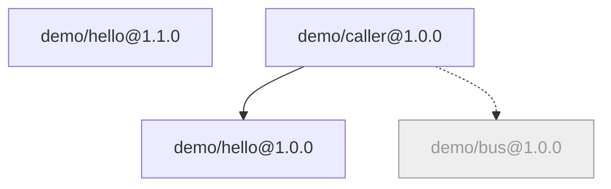

# BrickKit — part 2 of 10 (English)

Contains: docs/en/02-project-guide/01-init-and-project-creation.md, docs/en/02-project-guide/02-add-and-component-install.md, docs/en/02-project-guide/03-local-debug-workflow.md, docs/en/02-project-guide/04-focus-run.md, docs/en/02-project-guide/05-multi-env-switch.md, docs/en/02-project-guide/06-up-and-down.md, docs/en/02-project-guide/07-upgrade-and-migration.md, docs/en/02-project-guide/08-remove-and-archive.md, docs/en/02-project-guide/09-status-and-graph.md

File paths below are relative to the repository root, https://raw.githubusercontent.com/brickKit/brickKit/main/ ; links inside pages are relative to this file

Next: https://raw.githubusercontent.com/brickKit/brickKit/main/llms/en/03.md

---

> File: docs/en/02-project-guide/01-init-and-project-creation.md

# Creating a project

A BrickKit project is an ordinary directory holding the three layers of files plus a few agreed subdirectories.
`brickkit init` creates them all at once.

## `brickkit init <name>`: a new project

```bash
brickkit init my-shop
```

```text
✅ Project initialized: my-shop
   📄 brickkit.yaml        Project config
   📄 deploy.yaml          How it is deployed (team file, committed)
   📁 config/              Component configuration and shared vars
   📁 components/          Component source (configured as the local install source local-dev)
   📁 shell/               Shells (kind: shell), project code (the local install source local-shells)
   📁 .brickkit/           CLI working directory
   📄 AGENTS.md            the project's AI guide; the component table at its end is maintained by brickkit
   📄 CLAUDE.md            @AGENTS.md: Claude Code reads AGENTS.md through it
   📁 .claude/skills/      AI assistant skills (5)
   💡 If component source goes into Git with the project: brickkit init --hooks installs the pre-commit check

Next steps:
  cd my-shop
  brickkit add --local                     add every component under components/
  brickkit add <scope>/<name>@<version>    add a component from an install source (enable one under sources: in brickkit.yaml first)
  brickkit up                              start everything in one go
```

A project name may contain only lowercase letters, digits and hyphens, starting and ending with a letter or digit, at
most 54 characters — it names the Docker network (`brickkit-my-shop-net`) and the default Kubernetes namespace
(`brickkit-my-shop`).

The generated `brickkit.yaml` already declares two **local install sources**; the other two kinds are there as
comments — uncomment one and fill in the address to use it:

```yaml
# brickkit.yaml — what this project is made of: its sources and the exact component versions.
# Shared and reviewed like code: commit it.
project: my-shop

# Install sources, tried in declaration order
sources:
  - name: local-dev
    type: local
    path: ./components      # brickkit init already created this directory
  - name: local-shells
    type: local
    path: ./shell           # shells (kind: shell) are project code: brickkit new --shell writes here
  # More sources: uncomment and fill in the address
  # - name: company-git
  #   type: git
  #   baseUrl: https://git.example.com/components/
  # - name: market
  #   type: market
  #   url: https://market.example.com/api/v1

components: []
```

An "install source" is "where to look for components": a local source is a directory on your machine, a Git source is
a set of Git repositories (component `demo/hello`'s repository is `<baseUrl>demo-hello`, and a version is a tag), and a
market is a component market service. They're tried in declaration order, and **the first source that has the
component wins**.

`deploy.yaml` holds only the deploy target and `config/vars.yaml` is an empty shared-variables file — they fill up as
you add components.

### The generated `.gitignore`

```text
# BrickKit CLI working directory: caches, generated files, credentials
.brickkit/

# Your personal deploy file and its backup (brickkit local on)
deploy.local.yaml
deploy.local.yaml.bak

# Secrets referenced from config with file://, and the .env file
.secrets/
.env

# Config files of removed components (kept for a later re-add)
config/.archive/

# Component source cloned for development (each component is its own Git repository)
components/
```

Each line has a reason: `.brickkit/` is a cache that can be rebuilt at any time; `deploy.local.yaml` is yours alone;
`.secrets/` and `.env` hold real secrets; `config/.archive/` is this machine's undo button; every component under
`components/` is **its own** Git repository (one component per repository) and shouldn't be taken in again by the
project's.

### Without the AI assistant skills: `--no-skills`

By default `init` installs skill files for AI assistants to read (`.claude/skills/brickkit-*`, five of them); they're
committed with the project so every teammate's AI assistant understands it. Don't want them? Add `--no-skills`; to get
them later, run `brickkit skills update`. `AGENTS.md` and `CLAUDE.md` are written either way: they are the project's own
guide, not skills (see [The project's `AGENTS.md`](#the-projects-agentsmd)).

## Completion: `brickkit init` in an existing directory

Without a name, `init` adds whatever the **current directory** lacks. Two typical cases:

- an existing project repository is adopting BrickKit;
- a component repository wants its own local workbench for integration (see
  [Writing components](../../docs/en/03-component-guide/05-local-dev-fractal.md)).

The rule is "create what's missing, leave what exists". When the directory isn't empty, it prints the plan first and
waits for you:

```bash
cd legacy-shop
brickkit init
```

```text
This directory already has files; brickkit init will:
   ✅ create  brickkit.yaml
   ✅ create  deploy.yaml
   ✅ create  config/vars.yaml
   ✅ create  config/.gitkeep
   ✅ create  shell/.gitkeep
   ✅ create  components/
   ✅ create  AGENTS.md
   ✅ create  CLAUDE.md
   ⚠️  .gitignore is missing: .brickkit/, deploy.local.yaml, deploy.local.yaml.bak, .secrets/, .env, config/.archive/ (not edited — add them yourself)
Continue? [y/N] 
```

Worth noticing:

- **An existing `.gitignore` is checked, never modified.** Every missing entry gets a loud warning: without them,
  personal deploy files and secrets get committed. It doesn't edit the file because the file is yours, and may hold
  rules it doesn't understand.
- **`--yes` skips the question** (the plan is still printed), for CI.
- **The project name** is `--name`, otherwise the existing `brickkit.yaml`'s `project`, otherwise the directory name.
  A `--name` that contradicts an existing `brickkit.yaml` is refused (completion never changes an existing file); a
  directory name that isn't a valid project name is turned into one when it can be (`My_Shop` → `my-shop`), and
  otherwise `init` stops and asks for `--name`.
- **At the end, the project is loaded the way `up` loads it**; if it can't be, the command fails — what completion
  produces has to be a usable project.

```bash
brickkit init --yes
```

```text
This directory already has files; brickkit init will:
   ✅ create  brickkit.yaml
   ✅ create  deploy.yaml
   ✅ create  config/vars.yaml
   ✅ create  config/.gitkeep
   ✅ create  shell/.gitkeep
   ✅ create  components/
   ✅ create  AGENTS.md
   ✅ create  CLAUDE.md
   ⚠️  .gitignore is missing: .brickkit/, deploy.local.yaml, deploy.local.yaml.bak, .secrets/, .env, config/.archive/ (not edited — add them yourself)
✅ Project completed: legacy-shop
⚠️ Warning: .gitignore is missing required entries — personal deploy files and secrets can be committed
   File: .gitignore
   Missing: .brickkit/
   Missing: deploy.local.yaml
   Missing: deploy.local.yaml.bak
   Missing: .secrets/
   Missing: .env
   Missing: config/.archive/
   Missing: components/
   Suggestion: Add each missing line to .gitignore by hand (brickkit init never edits an existing .gitignore)
   📁 .claude/skills/      AI assistant skills (5)
   🪝 .git/hooks/pre-commit Check the component layout before committing
   ✅ closing check passed: the project loads
```

When the project root is the Git repository root, `init` also installs the pre-commit check (see
[Managing source](../../docs/en/02-project-guide/11-sync-and-restore.md#the-pre-commit-check)).

## Cloning an existing project

A teammate already created the project and pushed it to Git. You **don't** need `init`:

```bash
git clone https://git.example.com/projects/my-shop.git
cd my-shop
brickkit build
brickkit up
```

`.brickkit/` isn't in the repository, but it's only a cache: on the first run the CLI fetches each component's
`component.yaml` (and its `BRICKKIT.md`) from the install sources again, following `brickkit.yaml`. Contract files
(OpenAPI and the like) aren't fetched by `up`; they're only needed when you write a caller, and
`brickkit fetch <id>@<version>` downloads them into `.brickkit/artifacts/`. `components/` isn't in the
repository either — `up` needs only the components' `component.yaml`, not their source; to change a component's code,
clone it with `brickkit add <id>@<version> --repo` (see [Adding components](../../docs/en/02-project-guide/02-add-and-component-install.md#cloning-source---repo---repo-all)).
The `build` step only has work to do when a component's image is built locally; see [Building and images](../../docs/en/02-project-guide/12-build-and-images.md).

## The project layout

```text
my-shop/
├── brickkit.yaml         which components, which versions (committed)
├── deploy.yaml           how to deploy (committed)
├── deploy.local.yaml     your personal deploy file (not committed, created by brickkit local on)
├── config/               the components' business config and shared variables (committed)
│   └── .archive/         config of removed components (not committed)
├── components/           a local install source: component source you're developing, or cloned to change (not committed)
├── shell/                a local install source: shells, the project's own code (committed)
├── AGENTS.md             the project's AI guide, with the component table at its end (committed)
├── CLAUDE.md             @AGENTS.md, so Claude Code reads AGENTS.md (committed)
├── .claude/skills/       the AI assistant skills (committed)
└── .brickkit/            the CLI's caches and generated files (not committed)
```

- **`components/`** holds component source. Each component is its own Git repository, laid out as `<scope>/<name>/` —
  the layout a local source scans. To commit component source with the project, take `components/` out of
  `.gitignore` and install the pre-commit check with `brickkit init --hooks` (see
  [The pre-commit check](../../docs/en/02-project-guide/11-sync-and-restore.md#the-pre-commit-check)).
- **`shell/`** holds shells: components that compile several components into one process (see [Shells](../../docs/en/04-shell/README.md)).
  A shell is the project's own code and is committed with it.
- **`config/`** holds each component's config, one file per component (see [The config/ directory](../../docs/en/01-three-layers/05-config-directory.md)).

## The project's `AGENTS.md`

`AGENTS.md` is the file AI coding tools read first when they open a repository — a convention shared across tools, not
something BrickKit invented. Claude Code reads `CLAUDE.md` instead, so `init` also writes a `CLAUDE.md` holding exactly
one line, `@AGENTS.md`, which makes Claude Code read the same file. Both are created only when they are missing; in a
file that already exists `init` changes nothing outside the brickkit-maintained block at the end of `AGENTS.md` (see
[Which commands touch it](#which-commands-touch-it); the one exception is an untouched `AGENTS.md` left by an earlier
version, see [below](#a-project-from-an-earlier-version-the-old-brickkitmd)).

What it buys: whichever AI tool a teammate uses, it starts from the same page, and that page is in Git with the project.
What it costs: one more file the team has to keep true — an `AGENTS.md` that describes last year's project misleads
every AI that reads it.

### The sections you write

The file is yours. The skeleton has four sections, each with a `<!-- TODO: … -->` hint (`brickkit lint` lists every hint
still there):

| Section | What goes in it |
| --- | --- |
| Overview | What this project is, its domains, how its components group |
| Conventions | The rules every component here follows — stack, port and schema registries, naming, review rules — so that no component has to repeat them. One line each; a rule that needs more links its full text in `docs/` |
| Where to look | A table: what you are doing (the words you would search for) → the file to read first. Include where the detailed conventions, the decisions and the operations docs are (see [The project's other documents](#the-projects-other-documents)): skills look them up here |
| Pitfalls | A table: Never / Symptom / Why — mistakes that hold for every component in this project |

### The block at the end

At the end of the file is **one** block the CLI maintains, between `<!-- brickkit:managed:begin lang=<code> -->` and
`<!-- brickkit:managed:end -->`. Whatever is written between the markers is overwritten the next time the block is
rewritten; everything outside them is left alone. The block holds:

- a short summary of the platform rules: what each of the three layers holds, that `add` / `remove` / `upgrade` keep them
  in step, that config keys are the variable names from `configSchema`, where the skills are;
- one line saying where each component's documentation is — `BRICKKIT.md` (translations `BRICKKIT.<lang>.md`) in its
  source directory when a local source holds exactly this version, otherwise in `.brickkit/manifests/<id>/<version>/` —
  and where its contracts are, `.brickkit/artifacts/<service name>/`;
- the component table. After `brickkit add --local` with two components:

```text
| Component | Version | What it does | Docs | Home |
|---|---|---|---|---|
| demo/hello | 1.0.0 | The smallest HTTP component for BrickKit's own self-tests; serves a greeting and echoes its environment variables | BRICKKIT.md | — |
| demo/caller | 1.0.0 | The caller component for BrickKit's own self-tests; verifies dependency address injection and optional-dependency degradation | BRICKKIT.md | — |
```

| Column | Comes from |
| --- | --- |
| What it does | The component's `metadata.description` |
| Docs | `BRICKKIT.md`, plus each translation it carries (`BRICKKIT.md +zh`); `—` when it carries no docs |
| Home | The component's optional `metadata.repository`; `—` when it has none |

**Only facts that are the same on every machine go into the block.** The file is committed: a column such as "is the
source local here" would change with whoever ran the command last, and every teammate's `add` would produce a diff.
Whether a component's source is on this machine, an AI checks for itself under `components/`.

**The block records its language** (`lang=`). It is set when the block is first written, and every later rewrite uses
that language — never the language of whoever runs the command — so two teammates whose CLIs speak different languages
don't rewrite each other's file. `brickkit skills update --lang zh` switches it, together with the skills.

### Which commands touch it

| Command | What it does to `AGENTS.md` and `CLAUDE.md` |
| --- | --- |
| `init` | Creates either file when it is missing. In an existing `AGENTS.md` it rewrites the block if there is one; if there isn't, it only warns |
| `add`, `remove`, `upgrade` | Rewrite the existing block (the component table) and nothing else; they never create a block or append one to your file |
| `brickkit skills update` | An explicit request, so it also repairs: creates a missing file, appends the block to an `AGENTS.md` that lacks it, and appends `@AGENTS.md` to a `CLAUDE.md` that lacks it |

When `init` completes a directory that already has an `AGENTS.md` and a `CLAUDE.md` of its own, it changes neither and
says what is missing:

```text
⚠️ AGENTS.md has no usable brickkit-maintained block, so its component table is not kept up to date
   Reason: there is no block maintained by brickkit
   Suggestion: Run brickkit skills update to add it (an explicit request: no other command changes your file)
⚠️ CLAUDE.md does not contain @AGENTS.md, so Claude Code does not read AGENTS.md
   Suggestion: Run brickkit skills update to add it (an explicit request: no other command changes your file)
```

```bash
brickkit skills update
```

```text
✅ AI assistant skills updated
   ✅ AGENTS.md: appended the brickkit-maintained block at the end
   ✅ appended @AGENTS.md to CLAUDE.md
```

### A project from an earlier version: the old `BRICKKIT.md`

Earlier versions kept the component table in a `BRICKKIT.md` at the project root, the "project map". That file is gone:
the table lives at the end of `AGENTS.md` now, and `BRICKKIT.md` means only a component's own documentation. When the
old map (recognised by its markers) is still at the project root, `init`, `brickkit skills update` and `lint` report it
with the warning code `PROJECT_MAP_OBSOLETE`:

```text
⚠️ BRICKKIT.md here is the old project map: the component table now lives at the end of AGENTS.md
```

The suggestion under it says what to do: move any notes of your own into `AGENTS.md`, then delete `BRICKKIT.md`. It is
never deleted for you, because you may have written in it. An `AGENTS.md` that an earlier version installed as a
skill file, and that nobody edited since (recognised from the old `.brickkit/skills.lock` on this machine), is replaced
with the new skeleton by `init` and `brickkit skills update`.

## The project's other documents

`AGENTS.md` is loaded into every AI session, so it has to stay short: each convention in a line, the few pitfalls
everyone hits, and where to look. What doesn't fit goes into the project's `docs/`. BrickKit doesn't fix a layout for
it — a project of three components may need none — but most projects end up with the same three kinds of document,
and these places work:

| Kind | Where | Holds |
| --- | --- | --- |
| Conventions in detail | `docs/conventions/` | The full rule behind each line of `AGENTS.md`'s Conventions: the port registry, schema naming, the review checklist |
| Decisions | `docs/decisions/NNNN-<title>.md` | One decision per file, numbered ([below](#numbering-decisions)): the context, what was decided, why, and what was turned down |
| Operations | `docs/operations/` | Going live, backups, rotating secrets, what to do when production fails |

Whichever layout you choose, put it in the Where to look table of `AGENTS.md` — for example "a change that may go against
an earlier decision → `docs/decisions/`". That table is how an AI finds them, the `brickkit-plan-change` skill included.

### Numbering decisions

A decision's number is its name. Other files cite it — a pitfall in `AGENTS.md` ends with "(0203)", a commit message says
"see 0105" — so a number alone has to find exactly one file:

- **Unique across the project, never reused, never changed.** A decision that is overturned stays where it is, marked as
  replaced by the one that replaced it; the new decision gets a new number.
- **One folder: count up** (`0001`, `0002`, …). That is enough for most projects.
- **Folders by topic: a number range per folder** — `01-architecture/` 0101–0199, `02-permissions/` 0201–0299, and so on.
  The number stays unique and also says the topic; a search for `0203` lands on one file. Write the ranges into the
  folder's `README.md`, the place a person or an AI looks before adding one.
- A decision that later turns out to belong to another topic **keeps its number**, even outside the new folder's range:
  the citations to it are worth more than a tidy range.

This is different from the numbers in front of pages meant to be read in order (`01-…`, `02-…`): those are a reading
order, and change when a page is inserted. A decision number is a name and doesn't.

### One fact, one home

The way project documents go wrong is ordinary: one rule written in `AGENTS.md`'s Pitfalls, in a convention, in a
decision and in a skill of the project's own, each worded a little differently, and an AI trusting whichever it read
first. So, as for a component, every fact has one home and the other files link to it:

| Fact | Its home |
| --- | --- |
| A rule every component follows, in full | `docs/conventions/`; a line in `AGENTS.md`'s Conventions names it and links there |
| The few cross-component mistakes everyone makes | `AGENTS.md`'s Pitfalls, each linking the rule it breaks |
| Why the project chose something, and what it turned down | One file in `docs/decisions/`: the conclusion and the reason, not the rule's full text again |
| How to run it in production | `docs/operations/` |
| What one component does, needs and owns | That component's `BRICKKIT.md`, never repeated in the project's documents |
| Which components there are, at which versions | The component table at the end of `AGENTS.md`, maintained by brickkit |

### More than one language, and what lint checks

The language rules are a component's
([More than one language](../../docs/en/03-component-guide/08-component-doc-spec.md#more-than-one-language)): a translation next to
its file for a few files, a tree per language (`docs/en/`, `docs/zh/`) for a whole `docs/` in two languages. `AGENTS.md`
is usually written once; an `AGENTS.<lang>.md` for human reviewers is allowed and checked like any translation.

`brickkit lint` checks the project's documents as warnings, with a component's rules: the four sections and the block of
`AGENTS.md`, `CLAUDE.md`, the links in `AGENTS.md`, `README.md` and every file under `docs/` (a link may point anywhere in
the project, `components/` included — only its target must exist), placeholders, and translations. Whether a document
says the right thing is for review.

---

> File: docs/en/02-project-guide/02-add-and-component-install.md

# Adding components

## The basics

```bash
brickkit add demo/caller
```

```text
🔎 No version given for demo/caller; the latest is 1.0.0 (install source company-git)
➕ Adding demo/caller@1.0.0
   ✅ demo/hello@1.0.0
   ✅ demo/caller@1.0.0
📝 Written: brickkit.yaml, deploy.yaml
📝 Config skeletons: config/demo-hello.yaml, config/demo-caller.yaml
📦 Artifacts: 2 files, in .brickkit/artifacts/
⚠️ Warning: optional dependency missing: demo/bus@1.0.0
   Affected component: demo/caller@1.0.0
   Reason: Failed to fetch component demo/bus
   Impact: This component's environment variable DEMO_BUS_ENDPOINT will not be injected
   💡 Degrading gracefully for a missing optional dependency is the component's own responsibility; to enable it, confirm it has been published and is available from an install source
```

**The version.** Without one, `add` takes the latest version in the install source and writes that **exact version**
into `brickkit.yaml` — like npm writing a lockfile, resolution happens once, and everyone who clones the project later
gets the same version. With a version (`brickkit add demo/caller@1.0.0`), that version is used. Ranges like `^1.0.0` or
`latest` are always refused: version ranges are the classic source of "it works here and breaks in production".

**Dependencies come along recursively.** `demo/caller` requires `demo/hello@1.0.0`, so `demo/hello` was added with it.
Its optional dependency `demo/bus` couldn't be found in the install source: a missing optional dependency only warns and
never blocks, and its address variable `DEMO_BUS_ENDPOINT` is **not injected at all** — not injected as an empty string.
The component sees "no such variable" and takes its own degraded path.

## What one `add` changes

**`brickkit.yaml`**: the declaration and the exact versions.

```yaml
components:
  - id: demo/hello
    version: 1.0.0
  - id: demo/caller
    version: 1.0.0
```

**The deploy file**: one entry per component version. Nothing written means "run it the default way". When
`deploy.local.yaml` exists, it gets the same entries.

```yaml
components:
  - id: demo/hello
  - id: demo/caller
```

**`config/`**: a skeleton generated from each component's `configSchema` (the config spec sheet the component's author
wrote). Items that are required and have no default are written as `KEY: ""` for you to fill in; the rest are comments,
and while commented they use the component's default.

```yaml
# Component: demo/caller@1.0.0
# Environment variables for this component; every key is injected as-is.
# Shared variable: $var:NAME (config/vars.yaml) · environment variable: ${NAME} · local file: file://path
# Another component's address: $endpoint:<scope>/<name>

# === Optional: commented keys use the component's default; uncomment to override ===
# DATABASE_HOST:  # string | PostgreSQL host name
# DATABASE_NAME:  # string | Database name
# DATABASE_PORT: 5432  # integer | PostgreSQL port (default)
# DATABASE_USER:  # string | User to connect as
# MIGRATION_SHOULD_FAIL:  # string | Test switch: set to "1" to make the migration exit non-zero, to check that a failed migration holds back the main service
```

When there are required items to fill in, `add` names the file and the keys:

```text
📝 Config skeletons: config/demo-widget.yaml
   ✏️ Fill in the required keys in config/demo-widget.yaml: API_URL
```

`up` without filling them in refuses to start and tells you which item is missing.

**`.brickkit/manifests/<id>/<version>/`**: the component's `component.yaml` and its documentation, `BRICKKIT.md` plus
every translation it carries (`BRICKKIT.zh.md` and the like), cached permanently — from a local, Git or market source
alike.

**`.brickkit/artifacts/`**: the contract files the component declares (OpenAPI, proto and the like), which you'll use when
writing a caller.

**`AGENTS.md`**: the component table at its end — the block the CLI maintains — gets a row for each component added:
version, what it does, which docs it carries, its home page (see
[The project's `AGENTS.md`](../../docs/en/02-project-guide/01-init-and-project-creation.md#the-projects-agentsmd)). Nothing outside the block changes,
and an `AGENTS.md` without the block is left as it is.

If the project doesn't load after the changes (say, the new component conflicts with an existing one), `add` puts every
changed file back — all of it, or nothing.

## The shared-variable prompt

Several components often connect to the same database. When `config/vars.yaml` already has a shared variable with the
same name as a config item, `add` asks whether to reference it directly:

```yaml
# config/vars.yaml
DATABASE_HOST: pg.internal
DATABASE_PORT: 5432
```

```text
config/vars.yaml already has DATABASE_HOST; reference it in config/demo-caller.yaml? [y/N] y
config/vars.yaml already has DATABASE_PORT; reference it in config/demo-caller.yaml? [y/N] 
```

An item you said yes to becomes a `$var:` reference; the others stay commented:

```yaml
DATABASE_HOST: $var:DATABASE_HOST  # string | PostgreSQL host name
# DATABASE_PORT: 5432  # integer | PostgreSQL port (default)
```

Why ask instead of referencing automatically: where each value in a config file comes from should be visible at a
glance. The rules of `$var:` are in [Shared variables and $var:](../../docs/en/01-three-layers/06-vars-and-var-ref.md).

## Shells

Adding a shell (a component that compiles several components into one process) also adds the members it compiles in, at
the versions the shell declares, and in the deploy file they're **nested under the shell's entry as `members`** — which
component hosts which member is written there and only there. The other way round, adding an ordinary component never
puts it into a shell for you: that's a decision about how to deploy, made by you in the deploy file. See
[Shells](../../docs/en/04-shell/README.md).

## Two versions of the same component

`demo/caller@1.0.0` wants `demo/hello@1.0.0`. If the project's `demo/hello` is already 1.1.0, `add` doesn't fail: it keeps
1.0.0 as well, marked with who needs it:

```yaml
components:
  - id: demo/hello
    version: 1.1.0
  - id: demo/hello
    version: 1.0.0
    requiredBy: [demo/caller]
```

Both versions run at once, as the services `demo-hello-1-1-0` and `demo-hello-1-0-0`, without clashing. The one without
`requiredBy` is the **default version**. See [Several versions side by side](../../docs/en/03-component-guide/09-multi-version-coexistence.md).

## `--local`: add everything in the local sources at once

```bash
brickkit add --local
```

Scans every local install source (`components/` and `shell/` by default) and adds each `<scope>/<name>/component.yaml` at
the **real version** written in it. A component you just wrote with `brickkit new`, or one you put into `components/` by
hand, joins the project with this one command.

`--local --init` first gives every local component without a `brickkit.yaml` its own local workbench in its directory;
see [Developing inside a component](../../docs/en/03-component-guide/05-local-dev-fractal.md).

## Cloning source: `--repo`, `--repo-all`

By default `add` takes only the component's `component.yaml` and contract files and **doesn't clone its source**: most of
the time you use a component rather than change it. When you want to change its code:

```bash
brickkit add demo/hello@1.0.0 --repo
```

```text
✅ demo/hello@1.0.0 is already in the project; none of the three files needs a change
📥 Cloned the source of demo/hello@1.0.0 into components/demo/hello/ (checked out 1.0.0)
```

When the component is already in the project, `--repo` only does the cloning. The cloned directory has this version's
tag checked out; it's a complete Git repository, and branches, commits and pushes are yours to manage — the CLI doesn't
handle Git permissions.

Note: `components/` is a local install source, and it comes before the Git source. After cloning, the component resolves
from your working copy — the code you change is what `brickkit build` puts into the image, and the "latest version"
`upgrade` sees is the working copy's version (see [Upgrading](../../docs/en/02-project-guide/07-upgrade-and-migration.md#when-a-component-comes-from-a-local-source)).

`--repo-all` clones the source of every open-source component this add brings in (each at its default version).

Wherever you run it inside the project — even in another component's directory — `add` works on the project, so the
clone always lands in the project's own `components/`: component source lives in one place (see
[Developing inside the project](../../docs/en/02-project-guide/04-focus-run.md#one-components)). The exception is a component directory with a
`brickkit.yaml` of its own (a [workbench](../../docs/en/02-project-guide/04-focus-run.md#focus-run-or-workbench)): there the nearest `brickkit.yaml`
wins, so `add` works on the workbench, and `--repo` is refused because it would clone a second copy inside the project.

**Git submodules are never fetched.** The clone leaves them as empty directories and says which:

```text
📥 Cloned the source of demo/lib@1.0.0 into components/demo/lib/ (checked out 1.0.0)
   ℹ️  demo/lib@1.0.0 has git submodules, not fetched: third_party/sdk (git submodule update --init fetches them if you need them)
```

Fetch them in the cloned repository yourself if the code needs them.

## `--yes`: non-interactive

```bash
brickkit add demo/caller@1.0.0 --yes
```

Answers yes to every question, for CI. Without `--yes` and with no terminal input (in a script, say), every question is
answered no.

---

> File: docs/en/02-project-guide/03-local-debug-workflow.md

# Local debugging

You're changing `demo/hello` and want to run it in your IDE with breakpoints, while the project's other components keep
running in containers and can still call your process. This page walks through it from the start.

Background: what your personal deploy file `deploy.local.yaml` is, and why it "replaces the whole file rather than
merging", is in [deploy.local.yaml](../../docs/en/01-three-layers/04-deploy-local-yaml.md).

In a large project where you only need this component and what it depends on, start with a focus run instead:
`brickkit up` in the component's directory runs just those, and `mode: debug` on the focus still gives you breakpoints —
see [Developing inside the project](../../docs/en/02-project-guide/04-focus-run.md).

## The whole flow

### 1. Turn local mode on

```bash
brickkit local on
```

```text
✅ Local mode is on: commands now read deploy.local.yaml
   deploy.local.yaml was copied from deploy.yaml — change it as you like, it is not committed
```

From then on the commands that run or check the deployment (`up`, `down`, `status`, `sync`, `lint`, `build`) read
`deploy.local.yaml` (`graph` and `deps` keep reading `deploy.yaml`), and `up` starts each run with a reminder:

```text
Local mode is on: using deploy.local.yaml (brickkit local off switches back to deploy.yaml)
```

### 2. Mark the component you're debugging `mode: debug`

```yaml
# deploy.local.yaml
components:
  - id: demo/hello
    mode: debug
    localPort: 8080
  - id: demo/caller
    expose: true
    exposePort: 18080
```

`mode: debug` means "I start this component on my machine myself": the platform generates no container for it, but
still counts it as running, and the other components still get its address. `localPort` is the port your process
**actually listens on**. `demo/hello` listens on 8080 in its code, so 8080 goes here; if they differ, callers only get
connection refused. The process must also listen on **all interfaces** (`0.0.0.0`): containers come in through the host's
bridge address, and a process listening only on `127.0.0.1` never receives them (see
[Local debugging problems](../../docs/en/10-troubleshooting/02-local-debug-issues.md#containers-cant-reach-your-process)).

`mode: debug` can only be written in `deploy.local.yaml` — "I'm debugging this on my machine" is a personal fact, and
has no place in a file the team reviews.

### 3. Start the other components

```bash
brickkit up
```

```text
📋 Component state calculation:
   ✅ demo/hello@1.0.0   starting (mode: debug)
   ✅ demo/caller@1.0.0  starting (top-level)
```

```text
🔧 Local debugging (mode: debug):
   demo/hello@1.0.0
      No container is generated; start it in your IDE, listening on port 8080 on all interfaces (0.0.0.0) — containers cannot reach a process that listens on 127.0.0.1 only
      Environment variables: .brickkit/generated/local-debug.demo-hello-1-0-0.env
      VS Code: set "envFile": "${workspaceFolder}/.brickkit/generated/local-debug.demo-hello-1-0-0.env" in launch.json
```

```text
🐳 Starting (docker)...
   demo-caller-1-0-0            running (healthy)
✅ All components started (1)
```

`up` generated an environment file for `demo/hello`: every variable it would have got in its container, none missing.

```text
COMPONENT_ID=demo/hello
COMPONENT_VERSION=1.0.0
GREETING='Hi from the host process'
```

(`GREETING` comes from `config/demo-hello.yaml` — to try another value while debugging, change the config file and `up`
again as usual.)

### 4. Start it in your IDE

In VS Code, put that `envFile` line into `launch.json`; from a shell:

```bash
cd components/demo/hello
set -a && source ../../../.brickkit/generated/local-debug.demo-hello-1-0-0.env && set +a
go run .
```

Where the source comes from: `brickkit add demo/hello@1.0.0 --repo` clones it into `components/` (see
[Adding components](../../docs/en/02-project-guide/02-add-and-component-install.md#cloning-source---repo---repo-all)).

### 5. Check the container reaches you

```bash
curl http://localhost:18080/api/v1/call
```

```json
{"component":"demo/caller","endpoint":"http://demo-hello-1-0-0:8080","upstream":{"component":"demo/hello","greeting":"Hi from the host process","message":"Hi from the host process, I'm demo/hello@1.0.0","version":"1.0.0"},"version":"1.0.0"}
```

`demo/caller` in its container still calls `http://demo-hello-1-0-0:8080` — the address didn't change, and not a line of
component code did. Inside its container the platform resolves that service name to the host (Docker's
`extra_hosts: demo-hello-1-0-0:host-gateway`) and swaps the port for your `localPort`.

`status` lists it separately:

```text
🔧 Local debugging (mode: debug, not started by the platform)
 ┌────────────┬─────────┬─────────────────────────────────┐
 │ Component  │ Version │ Local address                   │
 ├────────────┼─────────┼─────────────────────────────────┤
 │ demo/hello │ 1.0.0   │ localhost:8080 (IDE debug mode) │
 └────────────┴─────────┴─────────────────────────────────┘
```

A few limits to know:

- **Docker / Podman only.** A Pod in a Kubernetes cluster can't reach your laptop; with the `k8s` target, `mode: debug`
  is rejected.
- **The debugged component runs no database migration.** The migration step went away with the container; if the
  component has migrations, run them by hand the first time.
- **Strings hard-coded in config aren't rewritten, with one name excepted.** `host.docker.internal` is what a container
  calls the host machine (it is what `config/` usually says when the database or the message queue runs on your machine).
  In the values a process on your machine receives, it becomes `localhost` — the same machine, under the name that
  resolves there, which on Linux the first one doesn't; containers still get the value as written. So one `config/` works
  on both sides, and you don't change it in the `vars:` of `deploy.local.yaml` (`vars:` reaches the containers too, and
  they would lose the connection). Anything else you wrote by hand reaches the process as is: an address that names
  another container's service needs a value that works on your machine.

## Ports on your machine

A process on your machine (`mode: debug`, `mode: local`, or the focus component of a focus run) and the containers it
talks to meet on host ports. `up` assigns them in one pass, the ones you wrote first:

| What | Host port |
| --- | --- |
| A container with `expose: true` | Its `exposePort` |
| The process itself | Its `localPort`. Without one: the component's own `deployment.port`, or the first free port from 8081 when that's taken. A `mode: local` process gets the number as `PORT` |
| The process's extra ports | As declared in `deployment.extraPorts` |
| A container the process depends on | 10000 + its container port (postgres's 5432 → 15432, a component's 8080 → 18080), or the first free port from 18080 when that's taken; for a dependency hosted in a shell, published on the shell's container. The env file holds `localhost:<that port>` |

Containers that call the process don't use a host port: they keep its service name, which `extra_hosts` resolves to the
host, at its `localPort`.

`up` only knows the ports it assigns itself. A port another program on your machine already holds fails when the engine
binds it, not before. If the project keeps a port registry (a different `deployment.port` for each component), register
ports as usual — 8080, 8081 and their neighbours are all fine — and mind two things:

- **The one time a process gives up its own port.** Only when its `deployment.port` is already assigned in this `up` (two
  components running on the machine declare the same port, or it collides with an `exposePort`) does the process move to
  the first free port from 8081 — which may be the port another component registered. It doesn't happen when the
  components' ports are all different; to fix the port, write a `localPort` for it in `deploy.local.yaml`.
- **10000 + container port belongs to the mappings.** With container ports in 8080–8499, 18080–18499 are used for the host
  mappings of the containers a process depends on; don't register them for components.

## After the team changes files: the strict consistency check

You have local mode on, and a teammate adds a component and pushes. You pull:

```bash
git pull
brickkit up
```

```text
❌ Error: deploy.local.yaml is out of date: it does not match the components in brickkit.yaml
   File: deploy.local.yaml
   No entry for: demo/bus
   Reason: Local mode is on and brickkit.yaml changed, but your deploy.local.yaml was not updated
   Suggestions:
   1. Option A (recommended): brickkit local refresh regenerates deploy.local.yaml from deploy.yaml and keeps the old one as deploy.local.yaml.bak
   2. Option B: add or remove the listed entries in deploy.local.yaml by hand
   3. Option C: brickkit local off switches back to the team's deploy.yaml
```

Why an error rather than quietly adding the new component: the local file replaces `deploy.yaml` as a whole, and the CLI
doesn't know how the new component should run on your machine — the team's way, or do you have other plans? A wrong
guess means running something you didn't mean to, without knowing. So it stops and lists the three ways forward.

**The team added or removed nothing, only changed values in `deploy.yaml`** (another port, `expose` switched on, a
different `vars:`): that isn't out of date, and `up` runs your personal file as usual. Those changes are not in effect on
your machine — the local file replaces the team file as a whole, which is what it is for, and is easy to forget. So `up`
and `brickkit local status` say so:

```text
ℹ️ deploy.yaml has changed since deploy.local.yaml was copied from it, and those changes are not in effect here: brickkit local refresh brings them in (and lists your local changes, to put back)
```

What is compared is the **data** of the `deploy.yaml` saved at the last copy (`local on` / `refresh`) and of the one there
now: a changed comment doesn't count, nor entries reordered by `add`; and `add` / `remove`, which change the team file and
your personal file together, don't count either. To keep working on the older copy, ignore it.

## `brickkit local refresh`

```bash
brickkit local refresh
```

```text
✅ Generated a fresh deploy.local.yaml from deploy.yaml. The old one is backed up at deploy.local.yaml.bak.
ℹ️ The old file had 2 local changes; merge the ones you still need into the new deploy.local.yaml by hand:
   - [demo/hello] mode: debug (now unset)
   - [demo/hello] localPort: 8080 (now unset)
```

`refresh` does three things:

1. keeps the old file as is in `deploy.local.yaml.bak` (overwriting the previous backup);
2. copies a complete new file from `deploy.yaml` — **no merging**: the new file is a copy of the team file;
3. compares the old file with the copy it was made from, and lists every local change you had that differs from the team
   file now: `mode`, `localPort`, `vars` values, a changed `target`, entries you moved, fields you deleted.

You just go down that list and copy back the lines you still want, instead of comparing two YAML files end to end. Once
copied back:

```yaml
components:
  - id: demo/hello
    mode: debug
    localPort: 8080
  - id: demo/caller
    expose: true
    exposePort: 18080
  - id: demo/bus
```

Why no automatic merge: however clever the merge rules, sometimes they guess wrong, and a wrong guess means "what the
file says isn't what runs". A whole-file replacement plus a list keeps the result visible at a glance.

## Debugging a shell member

A member hosted by a shell can be debugged on its own too: in `deploy.local.yaml`, write `mode: debug` and `localPort` on
that member under the shell's `members`. This time you start it on your machine, the shell **no longer hosts it** (it
isn't in the member list the shell receives), the other members stay in the shell, and other components get an address
pointing at your process. How shells work: [Shells](../../docs/en/04-shell/README.md).

## Turning local mode off

```bash
brickkit local off
```

```text
✅ Local mode is off: commands now read deploy.yaml
   deploy.local.yaml is kept; brickkit local on uses it again
```

The file stays, and the next `local on` picks it up as it is. To have a single run ignore it, you don't need to turn it
off: `brickkit up --no-local`.

---

> File: docs/en/02-project-guide/04-focus-run.md

# Developing inside the project

In a big project you rarely work on one component in isolation. You change `demo/caller`, you want to see it run
against the real `demo/hello` it calls, and the other forty components can stay off. This page is about doing that
**inside the project**: you stand in a component's directory, type `brickkit up`, and the project runs just that
component — from its source — plus what it needs.

That is a **focus run**. The component you are working on is the *focus*; everything the focus doesn't need stays off.

## Focus run or workbench

There are two ways to run a component while you develop it. They answer different questions:

| | Focus run (this page) | Workbench ([Developing inside a component](../../docs/en/03-component-guide/05-local-dev-fractal.md)) |
| --- | --- | --- |
| Where you work | Inside the project, in `components/<scope>/<name>/` | In the component's own repository, which has its own `brickkit.yaml` |
| What runs | The focus and what it needs, **at the versions the project uses** | Whatever the workbench declares — often the component plus stand-ins |
| Setup | None: the project already knows everything | A small project of its own, written once |
| Good for | "Does my change work in *this* system?" | Developing a component many projects use, on its own terms |

If the component lives in a project's `components/`, start with a focus run. A workbench is for components that have
a life outside one project.

## `up` in a component's directory

```bash
cd components/demo/caller
brickkit up
```

```text
📁 Project: ../../.. (my-shop)
✅ Local mode is on: commands now read deploy.local.yaml
   deploy.local.yaml was copied from deploy.yaml — change it as you like, it is not committed
🎯 Focus: demo/caller (written to deploy.local.yaml; brickkit up --all runs every component again)
Local mode is on: using deploy.local.yaml (brickkit local off switches back to deploy.yaml)
🚀 Starting project my-shop (target: docker)
📋 Component state calculation:
   ✅ demo/bus@1.0.0     starting (demo/caller needs it)
   ✅ demo/hello@1.0.0   starting (demo/caller needs it)
   ✅ demo/caller@1.0.0  starting (focus)
```

Line by line:

- **`📁 Project`** — there is no `brickkit.yaml` here, so `brickkit` looked upward, like `git` does, and found the
  project three levels up. Every project command works from any subdirectory; paths it prints are relative to where
  you are.
- **Local mode** — the focus is a personal setting, so it lives in your personal deploy file. If local mode was off,
  `up` turns it on first (the same as `brickkit local on`).
- **`🎯 Focus`** — the directory you are in belongs to `demo/caller`, so that is the focus.
- **The reasons** — each component says why it starts: `(focus)`, or `(demo/caller needs it)`.

The focus runs **from its source**, as a process on your machine (as if it were `mode: local`); what it needs runs in
containers, each given a port on your machine so your process can reach it:

```text
🐳 Starting (docker)...
   demo-bus-1-0-0               running (healthy)
   demo-hello-1-0-0             running (healthy)
✅ All components started (2)
```

```text
Starting 1 local component(s) — press Ctrl+C to stop
demo-caller-1-0-0  listening on port 8080
```

The process runs in the foreground; Ctrl+C stops it, and the containers keep running. To use breakpoints, write
`mode: debug` on the focus in `deploy.local.yaml` and start it from your IDE — see
[Local debugging](../../docs/en/02-project-guide/03-local-debug-workflow.md). The focus keeps a `mode: debug` you wrote.

The focus runs no database migration: a process on this machine has no migration container, and `up` says so. The
variables the process was started with are in `.brickkit/generated/local-debug.<service name>.env`; load them and run the
component's migration command by hand (see [When no migration container runs](../../docs/en/05-migration/01-migration-service.md#when-no-migration-container-runs)).

## Where the focus lives

One line in `deploy.local.yaml`:

```yaml
# deploy.local.yaml
target: docker # docker | podman | k8s
focus: demo/caller

components:
  - id: demo/bus
  - id: demo/hello
  - id: demo/caller
```

It stays there until you change it: the next `up` runs the same focus, unless you run it in another component's
directory — that moves the focus there. `deploy.yaml`, the team's file, is never touched. `up`, `status`, `down`,
`lint` and `build` remind you (`sync` ignores the focus, see [below](#what-the-other-commands-do-with-it)):

```text
🎯 Focus: demo/caller
```

## `--focus` and `--all`

From anywhere in the project, `--focus` sets the focus without changing directory:

```bash
brickkit up --focus demo/hello
```

```text
🎯 Focus: demo/hello (written to deploy.local.yaml; brickkit up --all runs every component again)
Local mode is on: using deploy.local.yaml (brickkit local off switches back to deploy.yaml)
🚀 Starting project my-shop (target: docker)
📋 Component state calculation:
   ⬜ demo/bus@1.0.0     not starting (outside the focus)
   ✅ demo/hello@1.0.0   starting (focus)
   ⬜ demo/caller@1.0.0  not starting (outside the focus)
```

`demo/hello` needs nothing, so it runs alone. `--all` removes the focus and runs every component again:

```bash
brickkit up --all
```

```text
📋 Component state calculation:
   ✅ demo/bus@1.0.0     starting (demo/caller needs it)
   ✅ demo/hello@1.0.0   starting (demo/caller needs it)
   ✅ demo/caller@1.0.0  starting (top-level)
```

`--focus` and `--all` only exist on `up`, and they can't be combined with `-f` or `--no-local`: those two mean "don't
read my personal file", and the focus is in it.

Which components start is worked out the same way as always, only from a different starting point: without a focus,
every top-level component starts; with one, only the focus and the components whose `mode` says they always run
(`enabled`, `local`, `debug`). What they need follows, as usual — required and optional dependencies, and the components
whose address their config refers to with `$endpoint:`. Shells count too: a focused shell runs with its members (`starting (hosted by …)`), and
when the focus needs a component a shell hosts, that shell starts to host it (`starting (hosts …)`) rather than the
member running on its own. A focus can't be a component that is `mode: disable` — that is a contradiction, and `up`
refuses it without changing any file.

## What the other commands do with it

| Command | With a focus |
| --- | --- |
| `status`, `down`, `lint`, `build` | Show the `🎯 Focus` line. `down` stops the whole project, focus or not |
| `lint` | Also checks that the focus has source to run from |
| `sync` | **Ignores the focus**: it keeps the source of every component the project runs without one, so switching focus never moves directories around |
| `local refresh` | Lists the focus as one of your local changes, so you can put it back in the new file |
| `remove` | Removing the focused component removes the focus with it, and says so |
| `graph`, `deps` | Unaffected — they read `deploy.yaml` |
| `build`, `deps`, `lint` without an argument | Use the component whose directory you are in (`lint --all` checks the whole project) |

`sync` with a focus on `demo/hello` still keeps all three:

```text
📂 Workspace tidying:
   ✅ components/demo/bus/                 active
   ✅ components/demo/caller/              active
   ✅ components/demo/hello/               active
✅ Workspace tidied (3 active, 0 archived, 0 activated)
```

`local refresh` copies `deploy.yaml` again, and the focus is one of the things it tells you to carry over:

```text
✅ Generated a fresh deploy.local.yaml from deploy.yaml. The old one is backed up at deploy.local.yaml.bak.
ℹ️ The old file had 1 local change; merge the ones you still need into the new deploy.local.yaml by hand:
   - [deploy] focus: demo/hello (now unset)
```

A focus run needs a process on your machine that the other components reach, so it works with `target: docker` and
`podman`. With `target: k8s`, nothing is written and `up` stops:

```text
❌ Error: deploy.local.yaml failed validation
   File: deploy.local.yaml
   focus: a focus run starts a process on your machine, which a cluster cannot reach; use target docker or podman
   Suggestion: Full field reference: brickkit docs 11-reference/03-deploy-yaml-schema (online: https://github.com/brickKit/brickKit/blob/v1.1.0/docs/en/11-reference/03-deploy-yaml-schema.md)
```

## Moving versions forward

The focus runs the code in its directory, so that code has to be the version the project declares. When you bump
`demo/hello` to `1.1.0` in its `component.yaml` while `brickkit.yaml` still says `1.0.0`, `up` stops rather than run a
version the project doesn't know about:

```text
❌ Code that runs from a local repository does not match this run
   File: deploy.local.yaml
   components[1]: demo/hello@1.0.0 runs from the local repository components/demo/hello, which holds 1.1.0
   Suggestions:
   1. To run the version in the repository: brickkit upgrade demo/hello@1.1.0
   2. To run the version in the project: git -C components/demo/hello checkout 1.0.0
```

`brickkit upgrade demo/hello@1.1.0` moves the whole project to the new version — config migration included (see
[Upgrading and config migration](../../docs/en/02-project-guide/07-upgrade-and-migration.md)) — and a component that still requires `1.0.0` keeps that
version alongside. The project moves forward one explicit `upgrade` at a time; nothing moves because a directory
changed.

That is also how a change is tested before it is released. Bump the version in the component's `component.yaml`,
`brickkit upgrade` the project to it, then run it: from source with a focus run (or `mode: local`), or as an image with
`brickkit build <id>` and `brickkit up`. Edit the unreleased version as often as you like while you test. Until
`brickkit release`, the version exists only in your `components/`: a teammate who pulls a `brickkit.yaml` naming it
gets `COMPONENT_NOT_FOUND`. So release the component first, then commit the project's upgrade. Once a version is
released its content is fixed — the next change, code or documents, is the next version.

## One `components/`

Component source lives in exactly one place: the project's `components/`. When a component's repository is itself a
workbench, it can have a `components/` of its own — and if that ends up inside the project, the same component can
exist twice, and nobody can tell which copy runs. `up`, `lint` and `sync` refuse:

```text
❌ Error: component source is nested inside another component's directory
   components/demo/caller/components/demo/hello: demo/hello, inside demo/caller; the project's components/ has demo/hello too
   Before you move or delete it: It is not a Git repository — these files have no other copy
   Suggestions:
   1. The project's components/ already has demo/hello at components/demo/hello: carry over the changes you still need, then rm -rf components/demo/caller/components/demo/hello
   2. A component's source lives in one place, the project's components/; move or delete the nested copy yourself — BrickKit moves nothing
```

BrickKit never moves or deletes the nested copy for you: it may hold changes that exist nowhere else — the
"Before you move or delete it" line says whether it does. The suggestion gives the command for each copy: delete it
when the project already has the component (after carrying over what you still need), or move it into the project's
`components/` when the project doesn't. For the same reason, `brickkit add --repo` refuses to run inside a
workbench that sits in another project's `components/`: it would clone a second copy.

## Git submodules

BrickKit never fetches git submodules. `add --repo` clones without them and names the ones it skipped; `build` warns
when a component's source has submodules that are empty directories. Fetch them yourself with
`git submodule update --init` when you really need them — or, better, have the component publish an image so building
it needs nothing extra.

Every flag of `up` is in the [CLI reference](../../docs/en/07-cli-reference/README.md#brickkit-up).

---

> File: docs/en/02-project-guide/05-multi-env-switch.md

# Several environments

Docker on the development machines, Kubernetes for staging and production, a different database address in each.
BrickKit has exactly one way to do this: **one complete deploy file per environment**, chosen with `-f`.

## `-f` / `--file`

```bash
brickkit up -f deploy.prod.yaml
```

`-f` names the deploy file to read this time (relative to the project root). It's binding: even with local mode on,
`deploy.local.yaml` isn't read, and a missing file is an error rather than a fallback to the default. `up`, `down`,
`status`, `sync`, `lint` and `graph` all accept it.

```text
Using deploy.prod.yaml (--file)
🚀 Starting project my-shop (target: k8s)
```

When local mode is on, the first line adds a note, so you don't think your personal settings apply as well:

```text
Using deploy.prod.yaml (--file); local mode is ignored for this run
```

There's one `brickkit.yaml` and one `config/`, shared by every environment: which components, which versions, and what
the business config is are the same everywhere. Only "how it's deployed" differs.

## A production deploy file

```yaml
# deploy.prod.yaml
target: k8s

k8s:
  context: prod-cluster
  namespace: my-shop

vars:
  DB_HOST: pg.prod.internal

components:
  - id: demo/hello
    replicas: 2
  - id: demo/caller
    expose: true
    hostname: shop.example.com
  - id: demo/hello@1.0.0
  - id: demo/bus
```

Its entries must match every component version in `brickkit.yaml`, one for one, just like `deploy.yaml`; the difference
is that they describe how production runs: two replicas, opened to the outside through an Ingress with a host name,
deployed to a given namespace of a given cluster.

## `vars:` gives the same `config/` different values per environment

`demo/caller` connects to a database. On the development machine the address is `localhost`; in production it's
`pg.prod.internal`. The config file is written once, referencing a shared variable with `$var:`:

```yaml
# config/demo-caller.yaml
DATABASE_HOST: $var:DB_HOST
```

```yaml
# config/vars.yaml
DB_HOST: localhost
```

The production deploy file overrides it under `vars:` (see `deploy.prod.yaml` above). `$var:` looks in the current deploy
file's `vars:` first, then in `config/vars.yaml`:

```bash
brickkit up -f deploy.prod.yaml --dry-run
```

```text
📄 Generated 12 manifests: .brickkit/generated/k8s/
   Namespace: my-shop
```

In the generated Deployment:

```yaml
            - name: DATABASE_HOST
              value: pg.prod.internal
```

Without `-f` (on the development machine, reading `deploy.yaml`), the generated `compose.yaml` has:

```text
      - DATABASE_HOST=localhost
```

The production database password works the same way: write `PG_PASSWORD: ${PG_PASSWORD}` in `config/vars.yaml` and keep
the real value in the deploy machine's environment; on Kubernetes the CLI evaluates it when generating the manifests.
Where the value lands depends on the component, not on `${…}`: when its `configSchema` declares the key `secret: true`
(as a password should be), the value goes into the generated Secret; otherwise it is written in plain text into the
Deployment (see [Secrets](../../docs/en/01-three-layers/07-sensitive-values.md)).

On Kubernetes, `--dry-run` only generates manifests and doesn't connect to the cluster. For a real deployment, `up` first
confirms that `kubectl`'s current context is the deploy file's `k8s.context`, and only then acts — deploying to the wrong
cluster can't be undone.

## `-f` vs. `--no-local`

| | `--no-local` | `-f <file>` |
| --- | --- | --- |
| Reads | `deploy.yaml` | The file you name |
| Local mode | Ignored this time, the switch unchanged | Ignored this time, the switch unchanged |
| When | Local mode is on and you want one run with the team's config | Deploying to another environment |

## Recommendations

- **One complete, self-contained file per environment.** No inheritance, no "base file + overlay" merging: open
  `deploy.prod.yaml` and you see everything production runs. The cost is some repeated entries across files; in exchange,
  no file ever changes quietly because something elsewhere did.
- **Changes to the production file go through code review.** The Git diff is the review: which environment changed, and
  how, at a glance.
- **One file per cluster.** To deploy to another cluster, copy the file and change `k8s.context`; there is no flag for
  switching clusters on the command line.
- **Changes to the component list start in `brickkit.yaml`.** `add` / `remove` / `upgrade` maintain `deploy.yaml` (and
  `deploy.local.yaml` when it exists) as well; other deploy files are yours to bring along — the commands name the ones
  that haven't caught up at the end of their output, and `lint -f <file>` reports them too.

---

> File: docs/en/02-project-guide/06-up-and-down.md

# Starting and stopping

## What `brickkit up` does

```bash
brickkit up
```

```text
🚀 Starting project my-shop (target: docker)
⚠️ Warning: optional dependency missing: demo/bus@1.0.0
   Affected component: demo/caller@1.0.0
   Reason: demo/bus@1.0.0 is not declared in brickkit.yaml
   Impact: This component's environment variable DEMO_BUS_ENDPOINT will not be injected
   💡 Degrading gracefully for a missing optional dependency is the component's own responsibility; to enable it, confirm it has been published and is available from an install source
📋 Component state calculation:
   ✅ demo/hello@1.0.0   starting (demo/caller needs it)
   ✅ demo/caller@1.0.0  starting (top-level)

📋 Start order (topological sort):
   1. demo-hello-1-0-0   no dependencies
   2. demo-caller-1-0-0  ← depends on 1

Can start on their own: demo-hello-1-0-0 (no dependencies)
Longest dependency chain (2 levels): demo-hello-1-0-0 → demo-caller-1-0-0

Dependency graph:
   demo/caller@1.0.0 → demo/hello@1.0.0
                     → demo/bus@1.0.0 (optional, not installed)
📄 Generated: .brickkit/generated/compose.yaml

🔧 Database migrations that run before startup (on failure that component won't start):
   demo/caller@1.0.0  /app/caller migrate

🐳 Starting (docker)...
   demo-hello-1-0-0             running (healthy)
   demo-caller-1-0-0            running (healthy)
✅ All components started (2)

💡 View the status: brickkit status
   View the logs: docker compose -p brickkit-my-shop logs -f
```

In order:

1. **Load and check consistency.** Read `brickkit.yaml`, the deploy file, `config/`, and every component's
   `component.yaml`. If the three layers don't agree (the deploy file lacks a component, a config file holds a conflict
   block, a `$var:` references something undefined), stop.
2. **Decide what runs.** Who starts this time: a top-level component (nothing depends on it) without a `mode` starts, and
   a component further down starts as long as something above it runs and needs it. Every line states its reason —
   "top-level", "demo/caller needs it", "mode: debug".
3. **Check dependencies and sort.** A missing required dependency is an error; a missing optional one is a warning, and
   its address isn't injected. The dependencies give the start order.
4. **Generate the deployment files.** Resolve config, inject environment variables (dependency addresses, the
   component's own config), write `.brickkit/generated/compose.yaml` (a set of Kubernetes manifests when the target is
   `k8s`). It's a generated file, rewritten every time — don't edit it by hand.
5. **Check images.** See the next section.
6. **Run database migrations.** A component that declares `migration.command` first runs its migration with the same
   image; if the migration fails, that component doesn't start.
7. **Call the engine.** `docker compose up` (or `podman compose`, `kubectl apply`), waiting for every component's health
   check to pass.

`up` is idempotent: run it again with nothing changed, and the engine finds everything in place and touches nothing.
Change the config and run it again, and only the affected containers are recreated.

## The image check: `up` never builds

```text
❌ Error: these images are built locally and have not been built yet
   demo/hello@1.0.0: demo-hello:1.0.0
   demo/caller@1.0.0: demo-caller:1.0.0
   Suggestions:
   1. up never builds on its own (building and deploying are separate): run brickkit build first
   2. Or build just one of them: brickkit build demo/hello@1.0.0
   3. Or build just one of them: brickkit build demo/caller@1.0.0
```

| Component | How `up` checks it |
| --- | --- |
| From a local source (code being developed), or its `component.yaml` says only how to build and names no `image` | The image must already be on this machine (built by `brickkit build`); otherwise it's an error |
| A Git / market component that names an `image` | The image is on this machine or can be pulled from the registry; otherwise it's an error, with a note that you can build locally instead |

Every problem is listed at once, rather than one at a time. Why it doesn't just build: see [Building and images](../../docs/en/02-project-guide/12-build-and-images.md).

## `--dry-run`: generate, don't start

```bash
brickkit up --dry-run
```

It goes through the first four steps, writes the deployment files, and stops:

```text
📄 Generated: .brickkit/generated/compose.yaml

🔧 Database migrations that run before startup (on failure that component won't start):
   demo/caller@1.0.0  /app/caller migrate

💡 --dry-run only generates the files and starts no component
   View it: cat .brickkit/generated/compose.yaml
```

It's for reviewing before you act: which components will start, what environment variables each one gets, which
databases will be touched. It's also the most complete check short of running — dependency resolution and the checks on
shells and members happen here, while `lint` deliberately doesn't do them (see [Offline checks](../../docs/en/02-project-guide/10-lint-and-checks.md)).
`--ignore-shells` together with `--dry-run` verifies that every component can still start on its own, outside its shell.

## `brickkit down`

```bash
brickkit down
```

```text
🛑 Stopping project my-shop
✅ All components stopped

💡 Data volumes were not deleted; database data is still there
   For a full cleanup, run by hand: docker volume rm <volume-name>
   Start again with: brickkit up
```

- **Volumes aren't deleted.** The database's data stays, and the next `up` uses it. To wipe it, run `docker volume rm`
  yourself — deleting data by mistake costs too much, so that step is left to a person.
- **To stop only some components:** write `mode: disable` on their deploy entries and `up`. Their containers are removed,
  components further down that ran only for them stop too, and the deploy file keeps a record, so the next `up` doesn't
  bring them back.
- **`mode: local` components** are processes watched in the foreground by the terminal that ran `up`; they can only be
  stopped there with `Ctrl+C`. `down` can't reach them and only names that session's process ID.

## Common start failures

**A required config item has no value.**

```text
❌ Error: a required component config item has no value
   Missing config: demo/widget@0.1.0 → API_URL
   Reason: The component declares it in configSchema.required without a default — the platform can't derive this one, so the project has to supply it
   Suggestions:
   1. Give it a value in config/demo-widget.yaml:
    API_URL: <value>
   2. The value may be ${ENV_VAR} (real value in .env), $var:NAME (shared, from config/vars.yaml) or file://path
```

The platform would rather stop before starting than let a component run without an address it needs, looking healthy,
with one call path that never works.

**An image doesn't exist.** See the image check above: `brickkit build` first.

**A host port conflict.** Two components opened on the same host port are caught when the deploy file is validated:

```text
❌ Error: deploy.yaml failed validation
   File: deploy.yaml
   components[1].exposePort: conflicts with components[0].exposePort (host port 18080 is already taken)
   Suggestion: Full field reference: brickkit docs 11-reference/03-deploy-yaml-schema (online: https://github.com/brickKit/brickKit/blob/v1.1.0/docs/en/11-reference/03-deploy-yaml-schema.md)
```

When another program on the machine holds the port, Docker reports it when starting the container — pick another
`exposePort`.

**A component doesn't come up, its health check never passes.** Look at its logs first:
`docker compose -p brickkit-my-shop logs <service>` (the `-p` matters: it names this project). More cases are in
[Troubleshooting](../../docs/en/10-troubleshooting/01-up-down-issues.md).

---

> File: docs/en/02-project-guide/07-upgrade-and-migration.md

# Upgrading and config migration

A component's author released a new version. Upgrading is more than changing a version number: the new version may add
config items, drop some, or change defaults, and the values you wrote in `config/` have to move with it.
`brickkit upgrade` does all of that in one go.

## Three ways to write it

| Written | What it does |
| --- | --- |
| `brickkit upgrade` | Every component with a newer version moves to its latest — all of them, or none |
| `brickkit upgrade demo/hello` | Only this one, to its latest |
| `brickkit upgrade demo/hello@2.0.0` | Up (or down) to a given version |

Without a version it only moves forward: if the latest in the install source is older than the project's, the project
counts as up to date — never a quiet downgrade.

## Preview first: `--dry-run`

```bash
brickkit upgrade --dry-run
```

```text
📋 upgrade would do this:
   ⬆️  demo/hello: 1.0.0 → 1.1.0
   ✅ demo/hello@1.0.0 (requiredBy: demo/caller)
📝 config/demo-hello.yaml
   ⚠️  Conflict GREETING: your value Howdy, new default Hi
📝 Would write: brickkit.yaml, deploy.yaml, deploy.local.yaml

⚠️  These config files would get conflict blocks: config/demo-hello.yaml. A real upgrade asks you about each one in the terminal; with --yes or no terminal input it writes the blocks, and up refuses to start until they are resolved

💡 --dry-run: no file was changed
```

The preview really does the whole thing on a copy of the project's files, so an upgrade that would fail fails in the
preview too. Three things can be read from it:

1. `demo/hello`'s default version moves from 1.0.0 to 1.1.0;
2. `demo/caller@1.0.0` still depends on `demo/hello@1.0.0`, so 1.0.0 **stays**, marked with who needs it;
3. you changed `GREETING` to "Howdy", and 1.1.0 changed its default from Hello to Hi — that's a conflict.

## What changed: release notes

A component's author can write **release notes** when releasing a version — a few lines of Markdown on what changed and
what you have to do when you upgrade (see [Releasing](../../docs/en/03-component-guide/07-release-workflow.md#release-notes)).
Before `upgrade` changes anything, with or without `--dry-run`, it prints the notes of every version it moves across:
each version after the one you have, up to and including the target. Versions without notes are left out, and when no
version has any, the section doesn't appear at all:

```bash
brickkit upgrade demo/quote --dry-run
```

```text
📋 Release notes of demo/quote, 0.1.0 → 0.3.0:

   ── 0.2.0 ──
      Quotes now carry a currency field. No config changes.

   ── 0.3.0 ──
      ## Breaking

      - `QUOTE_TTL` is now in seconds (was minutes): multiply your value by 60.

      ## Added

      - `GET /quotes/{id}/history`

📋 upgrade would do this:
   ⬆️  demo/quote: 0.1.0 → 0.3.0
📝 Would write: brickkit.yaml, deploy.yaml

💡 --dry-run: no file was changed
```

Read them before the real upgrade: a note like "`QUOTE_TTL` is now in seconds" is a change of meaning, and the config
migration below can't see it — the key keeps its name, so to the migration it is the same item, and your value in
minutes would be carried over untouched.

Where the notes come from depends on the install source that provides the target version: a Git source reads them from
the version's annotated tag, a market from the version's changelog (only versions that can be installed); a local source
has only the working copy, no version history, so it has no notes. If the notes can't be read (Git fails, the market
can't be reached), a ⚠️ line says why and the upgrade goes on — notes are for people to read and never block an upgrade.

## The real upgrade

```bash
brickkit upgrade
```

```text
GREETING of demo/hello: your value Howdy (1.0.0), new default Hi (1.1.0) — [m] keep yours / [n] take the new one / Enter keeps both as a conflict to resolve later: 

   ⬆️  demo/hello: 1.0.0 → 1.1.0
   ✅ demo/hello@1.0.0 (requiredBy: demo/caller)
📝 config/demo-hello.yaml
   ⚠️  Conflict GREETING: your value Howdy, new default Hi
📝 Written: brickkit.yaml, deploy.yaml, deploy.local.yaml

⚠️  These config files contain conflict blocks, and up refuses to start until they are resolved: config/demo-hello.yaml. Open them in a plain text editor, keep one line and delete the other and the comment
```

Each conflict is asked about in the terminal: `m` keeps your value, `n` takes the new default, and plain Enter keeps both
lines for you to choose later (that's what happened above). With `--yes` or no terminal input (scripts, CI), both lines
are always kept.

The upgrade changed these files:

```yaml
# brickkit.yaml
components:
  - id: demo/hello
    version: 1.1.0
  - id: demo/bus
    version: 1.0.0
  - id: demo/caller
    version: 1.0.0
  - id: demo/hello
    version: 1.0.0
    requiredBy: [demo/caller]
```

The deploy files (`deploy.yaml`, and `deploy.local.yaml` when it exists) gained an entry for the version that stayed:

```yaml
  - id: demo/hello@1.0.0
```

`config/demo-hello.yaml` belongs to the default version (1.1.0) and was migrated; the 1.0.0 that stayed gets a config
file with the version in its name, `config/demo-hello@1.0.0.yaml`, holding your original values, not a character changed:

```yaml
# Component: demo/hello@1.0.0
# Environment variables for this component; every key is injected as-is.
# Shared variable: $var:NAME (config/vars.yaml) · environment variable: ${NAME} · local file: file://path
# Another component's address: $endpoint:<scope>/<name>

# === Optional: commented keys use the component's default; uncomment to override ===
GREETING: Howdy
```

When no component depends on the old version any more, it doesn't stay, and its config moves into `config/.archive/`.

## How config is migrated

Each config item is decided mechanically by the table below — no rename guessing, no type conversion:

| Situation | Result |
| --- | --- |
| You didn't write it (still a comment in the skeleton) | Written as the new version's skeleton line, following the new default |
| You wrote it, and the new version's default didn't change | Your text copied as is — `$var:`, `${VAR}`, `file://`, quotes, the comment above it, not a character touched |
| You wrote it, and your value happens to equal the old default | Evidently you never changed it: it follows the new default |
| You wrote a value other than the old default, and the new version changed the default | **A conflict**: you changed it, the author changed it, and only you know which is right |
| The new version dropped the item | Not written into the new file; the value stays in the old version's file (archived under `config/.archive/`, or renamed to `config/<component>@<old version>.yaml` when the old version stays), and the report lists it |
| An item the new version added | Written as a skeleton line; a required one without a default becomes `KEY: ""`, and `up` stops until you fill it in |

Comments you wrote move along with what they're about: those at the top of the file stay at the top, those above an item
stay above it (whether you wrote a value for the item or it's still a commented-out skeleton line), and those after the
last item stay at the end. A comment above an item the new version dropped goes with it. The skeleton's own notes and
section headings are regenerated for the new version, so they don't appear twice. Block scalars (`|`, `|+`, `>` and other
multi-line forms) are carried over as written, parsing back to exactly the same value.

When the old version doesn't stay, its whole config file is kept in `config/.archive/<component>@<old version>.yaml`, to
compare against whenever you like.

## Resolving a conflict

A conflict is written as two lines with the same key:

```yaml
# ⚠️ Config conflict: upgrading to 1.1.0 changed the suggested value of this key.
# Keep one line, delete the other and this comment; until then brickkit refuses to start.
GREETING: Howdy  # brickkit:conflict current 1.0.0
GREETING: Hi  # brickkit:conflict proposed 1.1.0
```

Until then, `up` refuses to start:

```text
❌ Error: unresolved configuration conflicts
   File: config/demo-hello.yaml
   Config item: GREETING
   Line 8: Howdy (your previous value, 1.0.0)
   Line 9: Hi (suggested by 1.1.0)
   Suggestions:
   1. Open the file in a plain text editor, keep the line you want, delete the other one and the comment above them, then run the command again
   2. Do not run yq or your editor's Format Document on this file: they silently drop one of the duplicate keys, and the conflict disappears without being resolved
   💡 Your editor may mark this file as invalid YAML. That is expected: BrickKit wrote the duplicate key on purpose so the conflict cannot be missed
```

Why use "broken YAML" with duplicate keys: it makes a conflict **impossible to overlook**. A comment would leave a file
that still runs — possibly with the wrong value. In a plain text editor, keep the line you want (the
`# brickkit:conflict …` marker at its end can go too), and delete the other line and the two lines of explanation:

```yaml
GREETING: Howdy
```

Then `build` (the new version's image) and `up` as usual. Both versions run at once:

```text
📋 Component state calculation:
   ✅ demo/hello@1.1.0   starting (top-level)
   ✅ demo/bus@1.0.0     starting (demo/caller needs it)
   ✅ demo/hello@1.0.0   starting (demo/caller needs it)
   ✅ demo/caller@1.0.0  starting (top-level)
```

## When a component comes from a local source

After `add --repo` clones a component's source into `components/`, the component is provided by the local source — the
local source comes first, and the first source that has a component decides. Its "latest version" is then **the version
in the working copy's `component.yaml`**; newer tags on Git don't count:

```text
✅ Every component is up to date
ℹ️ These components come from a local source, so "latest" is the version in their working copy's component.yaml — newer tags on a remote don't count:
   demo/hello@1.0.0 (local source local-dev)
   💡 To move one: check out that version in its source directory (git checkout <version>), then brickkit upgrade
```

That's on purpose: you cloned the source because you want to run the code in your hands. To upgrade, check out the new
version in the source directory:

```bash
git -C components/demo/hello checkout 1.1.0
brickkit upgrade
```

## Shells

Upgrading a shell switches its members to **the set of versions the new shell declares** — the shell's image compiles in
exactly those versions, so members can't be upgraded on their own. How member compatibility is checked after an upgrade,
and the ways out when member versions don't match: [Upgrading a shell](../../docs/en/04-shell/07-shell-upgrade.md).

## After upgrading

- Components built locally need `brickkit build` again (the new version's image doesn't exist yet; `up` will say so).
- Deploy files for other environments used with `-f` aren't changed by `upgrade` — the end of its output names them;
  bring the new entries over yourself.
- Commit the changes to `brickkit.yaml`, the deploy files and `config/` together: those files, together, describe this
  upgrade.

---

> File: docs/en/02-project-guide/08-remove-and-archive.md

# Removing and archiving

## What `brickkit remove` checks first

**With several versions, you must name the one to remove:**

```text
❌ Error: demo/hello has several versions (1.1.0, 1.0.0); name the one to remove
   Suggestion: For example brickkit remove demo/hello@1.1.0
```

**While another component still requires it, it isn't removed:**

```text
❌ Error: demo/hello@1.0.0 is still required by: demo/caller@1.0.0
   Suggestion: Remove (or upgrade) the components that depend on it first, then remove it
```

Remove it, and the component depending on it can't start — better to stop now than to find out at the next `up`.

**When only optional dependencies point at it, it goes, and you're told the effect:**

```bash
brickkit remove demo/bus
```

```text
➖ Removed demo/bus@1.0.0
ℹ️  demo/caller@1.0.0 optionally depends on demo/bus@1.0.0: it keeps running, without the address of demo/bus@1.0.0
🗄️  Config archived: config/demo-bus.yaml → config/.archive/demo-bus@1.0.0.yaml
📝 Written: brickkit.yaml, deploy.yaml, deploy.local.yaml
```

## What removing does

- the declaration in `brickkit.yaml` goes;
- its deploy entries go (`deploy.yaml`, and `deploy.local.yaml` when it exists; other deploy files used with `-f` are
  named in the output for you to bring along);
- its config is **not** deleted but moved to `config/.archive/<component>@<version>.yaml`;
- compatibility versions kept only for it (those whose `requiredBy` names only it) go with it;
- when it's a shell, the members it hosted move back to the top level of the deploy file and run on their own.

**Its data is not touched.** `remove` changes the three layers and nothing else: the component's database schema, its
buckets, its queues, whatever it stored, all stay exactly where they are — the platform doesn't know where they are (a
database address is only a string in `config/`). How long that data is kept and when it is destroyed is the project's
decision; the component's `BRICKKIT.md` says what it stores (see "Before you deploy" there).

**A version is promoted to default.** When the default version is removed and one version of the component is left,
that one becomes the new default, and its config file goes back to the name without a version. When several versions
would be left, `remove` can't decide which one becomes the default: it stops and asks you to remove the others first,
or to make one of them the default with `brickkit upgrade`. With exactly one left:

```bash
brickkit remove demo/hello@1.1.0
```

```text
➖ Removed demo/hello@1.1.0
   ⭐ demo/hello@1.0.0 is now the default version
🗄️  Config archived: config/demo-hello.yaml → config/.archive/demo-hello@1.1.0.yaml
📝 Written: brickkit.yaml, deploy.yaml, deploy.local.yaml
```

## Archiving and restoring

`config/.archive/` is this machine's undo button (not in Git). When you later `add` the same component again, its config
comes back from the archive instead of a blank skeleton:

```bash
brickkit add demo/bus
```

```text
🔎 No version given for demo/bus; the latest is 1.0.0 (install source company-git)
➕ Adding demo/bus@1.0.0
   ✅ demo/bus@1.0.0
📝 Written: brickkit.yaml, deploy.yaml, deploy.local.yaml
♻️  config/demo-bus.yaml restored from the archive (config/.archive/demo-bus@1.0.0.yaml, migrated to this version)
📝 config/demo-bus.yaml
   Kept as written: GREETING
📦 Artifacts: 1 file, in .brickkit/artifacts/
```

Restoring uses the same [migration rules](../../docs/en/02-project-guide/07-upgrade-and-migration.md#how-config-is-migrated) as an upgrade rather than a
plain copy: what you add back may be another version, and items the new version dropped, added or gave a new default are
handled by that table. When the archive holds several versions, the one for the same version is taken; failing that, the
highest one not above this version; failing that, the highest one.

## The source directory

When a component's **last version** is removed, its source directory under `components/` (and any archived copy under
`components/.archived/`) is deleted too — otherwise it would become a directory nobody claims and `sync` no longer
manages.

But first it checks that what's deleted could be recovered:

```text
❌ Error: the source directory could not be recovered once deleted, so nothing was removed
   Component: demo/hello
   Directory: components/demo/hello/
   Reason: It has uncommitted changes (untracked files included)
   Suggestions:
   1. Save it first: commit and push to a remote, or move the directory elsewhere
   2. If you are sure you do not need it: brickkit remove demo/hello --force
```

Uncommitted changes, commits not pushed to a remote, or a directory that isn't a Git repository at all (its files
have no other copy) stop it. A directory registered as a git submodule is never deleted, not even with `--force`:
deleting the directory would leave `.gitmodules` and the index out of step, so the error lists the git commands
(`git submodule deinit`, `git rm`) to remove it properly yourself. Otherwise, if you're sure you don't need them, add
`--force`:

```text
➖ Removed demo/hello@1.0.0
🗄️  Config archived: config/demo-hello.yaml → config/.archive/demo-hello@1.0.0.yaml
📝 Written: brickkit.yaml, deploy.yaml, deploy.local.yaml
🗑️  Source directory deleted: components/demo/hello/
```

`remove` means "remove completely": the declaration, the deploy entries and the source all go; only the config stays in
the archive, because it may hold values you spent time tuning.

---

> File: docs/en/02-project-guide/09-status-and-graph.md

# Status and topology

Three read-only commands, each answering one question: what's running now (`status`), who depends on whom (`deps`), and
what the whole graph looks like (`graph`).

## `brickkit status`

The CLI stores no running state — there's no background process keeping it. `status` asks the engine directly every time
(`docker compose ps`, or `kubectl get deployments`):

```text
📊 Project status: my-shop (target: docker)

✅ Running (3 components)
 ┌─────────────┬─────────┬───────────────────┬───────────────────────────────────────────────┐
 │ Component   │ Version │ Status            │ Port                                          │
 ├─────────────┼─────────┼───────────────────┼───────────────────────────────────────────────┤
 │ demo/hello  │ 1.0.0   │ running (healthy) │ 8080/tcp                                      │
 │ demo/caller │ 1.0.0   │ running (healthy) │ 0.0.0.0:18080->8080/tcp, [::]:18080->8080/tcp │
 │ demo/hello  │ 1.1.0   │ running (healthy) │ 8080/tcp                                      │
 └─────────────┴─────────┴───────────────────┴───────────────────────────────────────────────┘

⬜ Not started (1 component)
 ┌───────────┬─────────┬─────────────────────────────────────┐
 │ Component │ Version │ Reason                              │
 ├───────────┼─────────┼─────────────────────────────────────┤
 │ demo/bus  │ 1.0.0   │ disabled explicitly (mode: disable) │
 └───────────┴─────────┴─────────────────────────────────────┘
```

- Two versions of the same component get a row each (`demo/hello` 1.0.0 and 1.1.0 here).
- Components not started this time are listed too, with the reason; a reason that comes from `deploy.local.yaml` is
  marked as such.
- In the Port column, `0.0.0.0:18080->8080` means it's open on the host; a bare `8080/tcp` is reachable only on the
  container network.
- `mode: debug` components get a table of their own (see [Local debugging](../../docs/en/02-project-guide/03-local-debug-workflow.md)). `mode: local`
  components are processes watched by `up` in another terminal, so they aren't in the table; when such a session is
  running, it says which process.

After `down`, the components that should run are listed as not running, with a pointer to the logs (the disabled `demo/bus` stays in the "not started" table):

```text
❌ Not running (3 components)
 ┌─────────────┬─────────┬─────────────┐
 │ Component   │ Version │ Status      │
 ├─────────────┼─────────┼─────────────┤
 │ demo/hello  │ 1.0.0   │ not created │
 │ demo/caller │ 1.0.0   │ not created │
 │ demo/hello  │ 1.1.0   │ not created │
 └─────────────┴─────────┴─────────────┘
   View the logs to find out why: docker compose -p brickkit-my-shop logs <service-name>

📋 No components are running (perhaps brickkit down was already run)
   Start again with: brickkit up
```

## `brickkit deps`

`brickkit.yaml` only locks versions; it doesn't say who depends on whom — each component declares its own dependencies in
its `component.yaml`, and copying them into the project file would only let the two drift apart. `deps` reads them and
prints a tree:

```bash
brickkit deps
```

```text
demo/hello@1.1.0

demo/caller@1.0.0
├── demo/hello@1.0.0
└── demo/bus@1.0.0 (optional)
```

One tree per top-level component (nothing in the project depends on it). Within one output a component version is
expanded only once; later appearances are marked "(shown above)"; an optional dependency missing from the project is marked
"(optional, not installed)".

For one component: a tree per version, plus who depends on it:

```bash
brickkit deps demo/hello
```

```text
demo/hello@1.0.0

Required by: demo/caller@1.0.0

demo/hello@1.1.0

Required by: nothing (top-level)
```

`brickkit deps demo/hello@1.0.0` shows only that version.

**Events.** Events sent through a messaging system are not dependencies, and the trees don't have them. When components
list what they publish and subscribe to under
[`events`](../../docs/en/03-component-guide/02-component-yaml-reference.md#events-what-i-publish-and-subscribe-to) in
`component.yaml`, `deps <id>` adds who is on the other end:

```text
erp/finance@1.0.0

Required by: nothing (top-level)

Publishes:
  erp.finance.invoice.issued.v1 → (no subscriber in this project)

Subscribes to:
  crm.opportunity.won.v1 ← crm/opportunity@1.0.0
  mdm.customer.* ← (no publisher in this project)
```

`deps` with no argument lists every event in the project after the trees, sorted by name — the place to look, before
changing an event, for who is affected:

```text
Events (publisher → subscriber):
  crm.opportunity.won.v1: crm/opportunity@1.0.0 → erp/finance@1.0.0, infra/audit@1.0.0
  erp.finance.invoice.issued.v1: erp/finance@1.0.0 → (no subscriber in this project)
  mdm.customer.*: (no publisher in this project) → erp/finance@1.0.0
```

## `brickkit graph`

The same dependency graph, drawn as Mermaid:

```bash
brickkit graph
```

```text
graph TD
    demo_hello_1_1_0["demo/hello@1.1.0"]
    demo_bus_1_0_0["demo/bus@1.0.0"]
    demo_hello_1_0_0["demo/hello@1.0.0"]
    demo_caller_1_0_0["demo/caller@1.0.0"]
    demo_caller_1_0_0 --> demo_hello_1_0_0
    demo_caller_1_0_0 -.-> demo_bus_1_0_0
    classDef disabled fill:#eee,stroke:#999,color:#999;
    class demo_bus_1_0_0 disabled
```

Rendered, it looks like this:



| In the diagram | Means |
| --- | --- |
| Solid line | Required dependency |
| Dashed line | Optional dependency; one missing from the project is drawn as a "not installed" node |
| Dashed line labelled `$endpoint` | The config refers to its address with `$endpoint:` (filled in by the project, not a dependency the component declared; no start order) |
| Dashed line labelled with event names | From a publisher to a subscriber: the subscriber receives events it publishes (`events` in `component.yaml`). The label is the subscriptions, three at most, then a count; it is not a dependency, and it points the way the events travel |
| Greyed out | Won't start this time (here `demo/bus` is turned off with `mode: disable`) |
| Group box | Members a shell hosts are drawn inside the shell's box; `--ignore-shells` shows each component on its own |
| Special label | `mode: local` components are marked "managed locally" |

Edges are always drawn, whether or not the other end runs this time: the diagram shows the declared structure, and
"does it run" is expressed by the node's style.

**Save it as a file.** Stdout carries nothing but Mermaid, so:

```bash
brickkit graph > graph.mmd
```

GitHub renders a `.mmd` file directly; in Markdown, put it in a `mermaid` code fence. Warnings from dependency resolution
go to stderr and never end up in the file.

**It never reads local mode.** `graph` reads `deploy.yaml` (or the file named with `-f`), never `deploy.local.yaml` — the
diagram can be committed and shared, and doesn't depend on who generated it.

`deps` and `graph` both need the complete dependency graph: components not yet cached have their `component.yaml`
fetched from the install sources, so they may go to the network.
