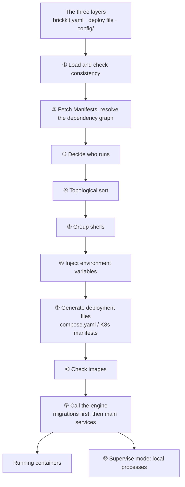

# BrickKit — part 4 of 9 (English)

Contains: docs/en/06-architecture/01-pipeline-overview.md, docs/en/06-architecture/02-dependency-resolution.md, docs/en/06-architecture/03-env-injection-contract.md, docs/en/06-architecture/04-deploy-file-generation.md

File paths below are relative to the repository root, https://raw.githubusercontent.com/brickKit/brickKit/main/ ; links inside pages are relative to this file

Next: https://raw.githubusercontent.com/brickKit/brickKit/main/llms/en/05.md

---

> File: docs/en/06-architecture/01-pipeline-overview.md

# The pipeline

## Four parts

| Part | Form | Long-running? | Does |
| --- | --- | --- | --- |
| BrickKit CLI | One local executable | ❌ Exits when done | Reads declarations, resolves, generates, calls the engine, releases |
| Components | Docker containers / Kubernetes Pods | ✅ | The business itself; they call each other directly by DNS name |
| The underlying engine | Docker / Podman / Kubernetes | ✅ | Actually runs containers, health-checks, restarts, load-balances |
| Install sources | Git repositories, local directories, a component market (optional) | Depends | Holds components' `component.yaml`, contracts and code |

"What it should be" is written in the three layers of files; "what it actually is" lives in the underlying engine. Between
two runs the CLI remembers nothing — no background process, no listening port, no service to operate.

## The pipeline of one `brickkit up`



## What each station does

**① Load and check consistency.** Read `brickkit.yaml`, the deploy file used this time (`deploy.yaml`; `deploy.local.yaml`
in local mode; or the one `-f` names) and `config/`. The three layers have to agree: every component version has exactly
one entry in the deploy file, shell members are written under their shell, every `$var:` is defined, no config conflict is
left unresolved. When they don't, it stops — every later station takes these three files as input, and with wrong input,
everything computed afterwards is wrong.

**② Fetch Manifests, resolve the dependency graph.** For the components and versions in `brickkit.yaml`, fetch each
component's `component.yaml` from the cache or the install source, and connect them into a graph by their
`dependencies`. A missing required dependency is an error here; a missing optional one is a warning. See
[Dependency resolution](../../docs/en/06-architecture/02-dependency-resolution.md).

**③ Decide who runs.** Top-level components (nothing depends on them) run by default; a lower component runs as long as
something above it that needs it runs; a `mode` written in the deploy file takes precedence. Every component carries a
reason ("top-level", "demo/caller needs it", "mode: debug").

**④ Topological sort.** Order the components running this time for start-up: dependencies before those that depend on
them.

**⑤ Group shells.** Work out which members each shell hosts this time, check their versions match the ones compiled into
the shell, and pack the members' config into JSON. See [Shells](../../docs/en/04-shell/README.md).

**⑥ Inject environment variables.** Work out every environment variable each component gets: `COMPONENT_ID`,
`COMPONENT_VERSION`, every dependency's `*_ENDPOINT`, the config values resolved from `config/`. A required item without a
value is stopped here. See [The environment variable contract](../../docs/en/06-architecture/03-env-injection-contract.md).

**⑦ Generate deployment files.** Depending on the deploy file's `target`, generate `.brickkit/generated/compose.yaml`
(`docker`, `podman`) or a set of Kubernetes manifests (`k8s`). They are generated afresh every time; components never
carry deployment files of their own. `--dry-run` stops here. See [Generating deployment files](../../docs/en/06-architecture/04-deploy-file-generation.md).

**⑧ Check images.** Images built on this machine must already exist (`up` never builds); pulled images must be reachable.
Every missing one is listed at once.

**⑨ Call the engine.** `docker compose up` (or `podman compose`, `kubectl apply`). Components that declare a migration run
it first, and their main service starts only when it finished successfully; then it waits for every component's health
check to pass. With the `k8s` target, before touching anything it confirms that `kubectl` is connected to the cluster the
deploy file names.

**⑩ Supervise local processes.** With `mode: local` components, `up` stays in the foreground, starting and supervising
those processes on this machine until `Ctrl+C`.

## One pipeline, several exits

| Command | Goes as far as |
| --- | --- |
| `brickkit lint` | ①, plus config and shell-declaration checks for components whose Manifests are already on disk; no network, no dependency graph |
| `brickkit deps`, `brickkit graph` | ①②③, printing the dependency graph |
| `brickkit up --dry-run` | ①–⑦, stopping once the deployment files are generated |
| `brickkit up` | All of it |
| `brickkit sync` | ①②③, arranging the source directories by who runs |

They share the same code: for the same project and the same deploy file, what `graph` draws, what `sync` archives and
what `up` starts are always the same decision. (With local mode on, `sync` and `up` read `deploy.local.yaml` while `graph`
always reads `deploy.yaml`; `graph --file deploy.local.yaml` draws the local decision.)

## What the platform deliberately doesn't do

- **Stay running.** No control plane, no daemon: the state lives in the three layers and the underlying engine.
- **Service discovery or health polling.** DNS and the engine's own health checks already do that.
- **Gateways, meshes, circuit breaking, rate limiting, config centres.** These vary by business; they belong to the
  components themselves, or to outside tools hooked in through `labels` passed through.
- **Guess.** Version ranges, unknown fields, ports nobody said to expose — none of these are decided for you.

The reasons behind each are in [Design principles and trade-offs](../../docs/en/06-architecture/05-design-principles.md).

---

> File: docs/en/06-architecture/02-dependency-resolution.md

# Dependency resolution

`brickkit.yaml` only says "which components, at which versions", never who depends on whom — each component declares its
own dependencies in its `component.yaml`. On every run the CLI reads them and connects them into a graph: the nodes are
component versions, the edges are dependencies. Who runs, the start order, the injected addresses and the network policies
are all worked out from this graph.

## Required and optional dependencies

```yaml
dependencies:
  components:
    - shop/catalog@1.0.0          # required
    - id: shop/bus@1.0.0          # optional
      optional: true
```

| | When it's missing | Start order | Address variable |
| --- | --- | --- | --- |
| Required | An error; nothing starts | It starts before whoever depends on it (they wait for it to be healthy) | Always injected |
| Optional | A warning; start-up goes on | Doesn't constrain the start order | Injected while it runs; when it doesn't, the variable **doesn't exist at all** |

When deciding who runs, both kinds count the same: if something above needs it (required or optional), it runs along. They
differ only in what a missing one leads to, and in whether it's waited for.

## Topological sort

The start order is a topological sort of the dependency graph: each component comes after all of its required dependencies.
A diamond as an example — `shop/portal` depends on `shop/order` and `shop/stock`, and both of those depend on
`shop/catalog`:

```text
📋 Component state calculation:
   ✅ shop/catalog@1.0.0  starting (shop/order needs it)
   ✅ shop/order@1.0.0    starting (shop/portal needs it)
   ✅ shop/stock@1.0.0    starting (shop/portal needs it)
   ✅ shop/portal@1.0.0   starting (top-level)

📋 Start order (topological sort):
   1. shop-catalog-1-0-0  no dependencies
   2. shop-order-1-0-0    ← depends on 1
   3. shop-stock-1-0-0    ← depends on 1
   4. shop-portal-1-0-0   ← depends on 2, 3

Can start on their own: shop-catalog-1-0-0 (no dependencies)
Longest dependency chain (3 levels): shop-catalog-1-0-0 → shop-order-1-0-0 → shop-portal-1-0-0
   Components not on this chain start in parallel with it
```

## Diamond dependencies

`shop/catalog` is depended on along two paths, but it's **one** node and starts once: both dependants name the same exact
version, so it's the same component version.

```text
shop/portal@1.0.0
├── shop/order@1.0.0
│   └── shop/catalog@1.0.0
└── shop/stock@1.0.0
    └── shop/catalog@1.0.0 (shown above)
```

When the two paths want **different** versions, those are two nodes — see several versions below.

## Dependency cycles

When a few components **require** each other in a loop, each waits for the other to come up first, there's no start order,
and resolution fails:

```text
❌ Error: dependency cycle detected
   Cycle path: shop/order@1.0.0 → shop/stock@1.0.0 → shop/order@1.0.0
   Reason: These components all require each other; each is waiting for the others to start first, so there is no valid startup order
   Suggestions:
   1. Check the dependency declarations in the Manifest (dependencies.components)
   2. Make one side an optional dependency (optional: true) instead — an optional edge doesn't constrain startup order, and one optional edge in the cycle breaks the deadlock
```

One optional edge in the loop and it's no deadlock: optional edges don't constrain the start order, and with it left out
the sort has an answer. `shop/order` requires `shop/stock`, and `shop/stock` optionally depends on `shop/order`:

```text
📋 Start order (topological sort):
   1. shop-stock-1-0-0  no dependencies
   2. shop-order-1-0-0  ← depends on 1

Dependency graph:
   shop/order@1.0.0 → shop/stock@1.0.0
   shop/stock@1.0.0 → shop/order@1.0.0 (optional)
```

Both components run: deciding who runs computes the least fixed point of "who **doesn't** run", and cycles need no special
handling — nothing turns them off, so they both run.

A wait cycle that only appears once components are merged into a shell is another matter; see
[Managing members](../../docs/en/04-shell/04-members-management.md#start-cycles-caused-by-merging-and-skipwaitfor).

## Several versions

Dependencies name exact versions, so two components can depend on two versions of the same component: they are two nodes
in the graph with different service names (`demo-hello-1-0-0`, `demo-hello-1-1-0`), running at the same time. When `add`
meets this it adds the second version to `brickkit.yaml` too, marked with `requiredBy` (see
[Several versions side by side](../../docs/en/03-component-guide/09-multi-version-coexistence.md)).

The other way round, a component ID can appear only once in one component's `dependencies`: the address variable's name
carries no version, so two versions would collide on the same variable.

## The longest chain decides start-up time

More components doesn't mean more serial steps. Components without a dependency between them start in parallel; what
really decides how long an `up` waits is **the longest chain of required dependencies** in the graph — each one on it
waits for the one before to be healthy. `up` prints it:

```text
Longest dependency chain (3 levels): shop-catalog-1-0-0 → shop-order-1-0-0 → shop-portal-1-0-0
   Components not on this chain start in parallel with it
```

To start faster, look at this chain: turn a required dependency on it that needn't be waited for into an optional one (the
component must then retry on its own while the other isn't up yet), and the chain gets shorter.

## Where Manifests come from

Resolution needs every component version's `component.yaml`. For components from a local source it's read from the
directory every time; for ones from Git or a market, the project's permanent cache is checked first, and the install
source is asked only when it isn't there (see [The Git repository cache](../../docs/en/06-architecture/06-bare-repo-mechanism.md)). So `deps`, `graph`
and `up --dry-run` may need the network the first time; after that the same versions come from the cache. `lint` doesn't
build this graph, so it never goes to the network.

---

> File: docs/en/06-architecture/03-env-injection-contract.md

# The environment variable contract

Everything a component gets from the platform is an environment variable. This page lists every variable the platform may
inject, how its name is formed, and when its value is worked out. The only platform convention a component's code needs to
know is on this page.

## Every variable the platform may inject

| Variable | For | Value |
| --- | --- | --- |
| `COMPONENT_ID` | Every component | The component ID, e.g. `demo/hello` |
| `COMPONENT_VERSION` | Every component | The exact version, e.g. `1.0.0` |
| `<dependency>_ENDPOINT` | One per dependency running this time | The address of the dependency's main port, e.g. `http://demo-hello-1-0-0:8080` |
| `<dependency>_<port name>_ENDPOINT` | Every extra port a dependency declares | E.g. `PEOPLE_BASIC_GRPC_ENDPOINT=http://people-basic-1-0-0:9090` |
| The component's own config | Every component | The keys are the keys in `configSchema`; the values are resolved from `config/` |
| `BRICKKIT_SERVED_MEMBERS` | Shells | The service names of the members hosted this time, comma-separated |
| `BRICKKIT_SERVED_MEMBERS_CONFIG` | Shells | Each member's config and ports, as a JSON array (see [Config as JSON](../../docs/en/04-shell/02-json-injection.md)) |
| `PORT` | `mode: local` components | The port the platform picked for this process on this machine |

Beyond these, the platform injects nothing.

## Dependency addresses

The **name** is derived from the component ID: `/` and `-` become `_`, all uppercase, followed by `_ENDPOINT`. The name
**carries no version**.

The **value** does: `http://<versioned service name>:<port>`. The service name is the component ID with `/` and `.` turned
into `-`, all lowercase, followed by the exact version with its dots turned into `-` too (`demo/hello@1.0.0` →
`demo-hello-1-0-0`). This string is exactly the same on Docker and on Kubernetes.

| Dependency | Variable | Value |
| --- | --- | --- |
| `demo/hello@1.0.0` | `DEMO_HELLO_ENDPOINT` | `http://demo-hello-1-0-0:8080` |
| `people/basic@2.1.0` (extra port `grpc: 9090`) | `PEOPLE_BASIC_GRPC_ENDPOINT` | `http://people-basic-2-1-0:9090` |

Name and component ID can be derived from each other: seeing `PEOPLE_BASIC_ENDPOINT`, you know it points at
`people/basic`. That's why an ID can appear only once in one component's `dependencies`.

In a few special cases the address keeps this format but points elsewhere:

| This time the dependency | The address callers get points at |
| --- | --- |
| Is hosted by a shell | The shell: `http://<shell service name>:<the member's own port>` (the shell listens on that port for the member) |
| Runs as a process on this machine (`mode: debug` / `mode: local`) | The port becomes its port on this machine; inside containers the service name resolves to the host |

**When an optional dependency isn't running, the variable doesn't exist at all** — it isn't an empty string. A component
must handle "there is no such variable" when reading it:

```python
bus = os.environ.get("DEMO_BUS_ENDPOINT")   # None when it isn't running
if bus is None:
    ...  # degrade
```

An empty string would cause a class of very hard-to-find bugs: `f"{ENDPOINT}/healthz"` becomes `/healthz`, the request
hits the component **itself**, gets a 200, and you believe the dependency is fine.

## The component's own config

The keys of `configSchema` are the environment variable names, injected as they are. Where a value comes from follows one
chain (details in [Resolution order](../../docs/en/01-three-layers/08-resolution-priority.md)):

1. The value written in `config/<component>.yaml` (`config/<component>@<version>.yaml` for a compatibility version);
2. When it's written as `$var:NAME`, the current deploy file's `vars:` is checked first, then `config/vars.yaml`, and it's
   an error when neither has it;
3. Not written: the `default` from `configSchema`;
4. None of these: an optional item isn't injected; a required item makes `up` refuse to start.

Value types: scalars are turned into strings (`1.10` is injected as `"1.10"`, never as `1.1`); lists and maps are encoded
as one line of JSON.

### No implicit overrides

A variable of the same name that happens to be in the process environment doesn't override what's written in `config/`.
Environment variables take part only where you **explicitly** wrote `${VAR}`.

## Reserved names

Names the platform injects itself can't be used as a component's config items:

| Rule | Names |
| --- | --- |
| Exact | `COMPONENT_ID`, `COMPONENT_VERSION`, `PORT`, `BRICKKIT_SERVED_MEMBERS`, `BRICKKIT_SERVED_MEMBERS_CONFIG` |
| Suffix | `*_ENDPOINT` |

What happens on a collision depends on the step that finds it:

| When | Handling |
| --- | --- |
| `up` / `lint` | A warning; the item is ignored and the platform-injected value takes precedence |
| Publishing to a component market | Refused |

```text
⚠️ Config conflict: the config item of component demo/widget was ignored
   Component: demo/widget
   Config item: UPSTREAM_ENDPOINT
   Conflicting reserved pattern: *_ENDPOINT
   Handling: This config item is ignored; the platform-injected value takes precedence
   Origin: components/demo/widget/component.yaml
   Suggestions:
   1. Rename the config item in configSchema to avoid the platform's reserved variables
   2. For example, rename it to UPSTREAM_BASE_URL
```

`lint` checks every item declared in `configSchema`; `up` only meets an item when it would really be injected.

## When values are worked out

A config value can hold three kinds of reference: `$var:NAME` (a shared variable), `${VAR}` (the process environment or
`.env`), `file://path` (a file's contents). `$var:` is always replaced by the shared variable's value when the CLI loads the
project. When the other two are worked out depends on where the value lands:

| Where the value lands | `${VAR}` | `file://` |
| --- | --- | --- |
| An ordinary value on Docker / Podman | Written into `compose.yaml` as it is and expanded when `docker compose` starts; the CLI checks it's defined when generating, and stops if not | The CLI reads the contents and writes them, as a secret, into an env file with mode 0600 |
| A secret on Docker / Podman (`secret: true`) | Written into the 0600 env file as it is and expanded when `docker compose` starts; checked to be defined first, likewise | As above |
| Kubernetes | Expanded by the CLI when generating the manifests (`kubectl` substitutes nothing); stops if it can't be found | The CLI reads the contents |
| A shell's `BRICKKIT_SERVED_MEMBERS_CONFIG` | Expanded by the CLI when generating, and JSON-encoded; stops if it can't be found | The CLI reads the contents and JSON-encodes them |
| A `mode: local` process's environment | Expanded by the CLI before starting the process; refuses to start if it can't be found | The CLI reads the contents |
| `mode: debug`'s `local-debug.*.env` | Expanded by the CLI when generating; if it can't be found the placeholder stays, and the output names it | The CLI reads the contents |

A shell's JSON must be worked out beforehand: `docker compose`'s substitution is plain text that knows nothing about JSON,
and substituting a value with a quote or a newline breaks the JSON (see
[Special characters](../../docs/en/04-shell/06-special-characters.md)). Kubernetes must be worked out beforehand: `kubectl` doesn't
substitute at all.

In no case does a secret appear in plain text in `compose.yaml` or a Deployment: on Docker it's in the 0600 env file, on
Kubernetes it's in the generated Secret, referenced by the Deployment through `secretKeyRef` (see
[Sensitive values](../../docs/en/01-three-layers/07-sensitive-values.md)).

## Migration containers and processes on this machine get the same

A component's migration container gets exactly the main service's environment (the same inline variables, the same env
file). A `mode: debug` component has no container; the platform writes the variables it would have got into
`.brickkit/generated/local-debug.<service name>.env` for you to load in your IDE; in that file, dependency addresses are
`http://localhost:<port>`, reachable from this machine.

---

> File: docs/en/06-architecture/04-deploy-file-generation.md

# Generating deployment files

A component's repository never carries deployment files. On every `up` (and `up --dry-run`) the CLI regenerates them,
following the deploy file's `target`, from the three layers and each component's `component.yaml`:

| `target` | Generates | Where |
| --- | --- | --- |
| `docker`, `podman` | One `compose.yaml` | `.brickkit/generated/compose.yaml` |
| `k8s` | A set of Kubernetes manifests | `.brickkit/generated/k8s/` |

They are generated files: don't edit them by hand, the next `up` overwrites them. To change something, change the three
layers.

Both examples below come from the same project: `demo/caller` requires `demo/hello`, optionally depends on `demo/bus`,
declares a database migration of its own, and is exposed to the outside.

## Docker Compose

```yaml
# deploy.yaml
target: docker

components:
  - id: demo/hello
  - id: demo/bus
  - id: demo/caller
    expose: true
    exposePort: 18080
```

The generated `compose.yaml` (an excerpt: `demo/caller`, its migration, `demo/hello`):

```yaml
  demo-caller-1-0-0:
    depends_on:
      demo-caller-1-0-0-migration:
        condition: service_completed_successfully
      demo-hello-1-0-0:
        condition: service_healthy
    deploy:
      resources:
        reservations:
          cpus: "0.05"
          memory: 32M
    environment:
      - COMPONENT_ID=demo/caller
      - COMPONENT_VERSION=1.0.0
      - DATABASE_PORT=5432
      - DEMO_BUS_ENDPOINT=http://demo-bus-1-0-0:8080
      - DEMO_HELLO_ENDPOINT=http://demo-hello-1-0-0:8080
    healthcheck:
      interval: 10s
      retries: 3
      start_period: 60s
      test:
        - CMD-SHELL
        - wget -q --spider http://localhost:8080/healthz || curl -fsS http://localhost:8080/healthz || exit 1
      timeout: 3s
    image: demo-caller:1.0.0
    networks:
      - brickkit-net
    ports:
      - 18080:8080
    restart: unless-stopped
  demo-caller-1-0-0-migration:
    command:
      - migrate
    entrypoint:
      - /app/caller
    environment:
      - COMPONENT_ID=demo/caller
      - COMPONENT_VERSION=1.0.0
      - DATABASE_PORT=5432
      - DEMO_BUS_ENDPOINT=http://demo-bus-1-0-0:8080
      - DEMO_HELLO_ENDPOINT=http://demo-hello-1-0-0:8080
    image: demo-caller:1.0.0
    networks:
      - brickkit-net
    restart: "no"
  demo-hello-1-0-0:
    environment:
      - COMPONENT_ID=demo/hello
      - COMPONENT_VERSION=1.0.0
      - GREETING=Hello
    healthcheck:
      interval: 10s
      retries: 3
      start_period: 60s
      test:
        - CMD-SHELL
        - wget -q --spider http://localhost:8080/healthz || curl -fsS http://localhost:8080/healthz || exit 1
      timeout: 3s
    image: demo-hello:1.0.0
    networks:
      - brickkit-net
    restart: unless-stopped
```

Item by item:

- **The service name is the versioned service name**: `demo-caller-1-0-0`. Another version of the same component is
  another service, running alongside.
- **`depends_on`**: a required dependency is waited for until it's **healthy** (`service_healthy`), the component's own
  migration until it **finished successfully** (`service_completed_successfully`). The optional dependency `demo/bus`
  isn't in it — it may not start at all, and listing it would hold up the whole project.
- **Environment variables**: platform variables, dependency addresses, config values (`DATABASE_PORT` is the
  `configSchema` default, and so is `GREETING`). Secrets aren't here; they are in the 0600 file `env_file` references.
- **The migration container**: the same image, the same environment, `restart: "no"`, with the entry point replaced by
  the migration command.
- **The health check**: its rhythm is fixed by the platform (every 10 seconds, a 3-second timeout, 3 failures in a row);
  `start_period` comes from `startPeriodSeconds` (60 by default). Both `wget` and `curl` are tried, so having either in the
  image is enough.
- **Ports**: only `expose: true` components map a host port; the rest are reachable only inside the project's network.
- **Resources**: `requests` become `reservations`; when nobody writes `limits`, no ceiling is generated.
- **The network**: one network per project, named `brickkit-<project name>-net`; the Compose project name is
  `brickkit-<project name>`.

What a shell looks like in Compose (network aliases, `BRICKKIT_SERVED_MEMBERS`, members' migrations) is in
[Writing a shell](../../docs/en/04-shell/05-shell-development.md#how-addresses-are-pointed-at-it).

## Kubernetes

```yaml
# deploy.k8s.yaml
target: k8s
components:
  - id: demo/hello
    replicas: 2
  - id: demo/bus
  - id: demo/caller
    expose: true
    hostname: shop.example.com
```

```text
📄 Generated 10 manifests: .brickkit/generated/k8s/
   Namespace: brickkit-my-shop
```

```text
k8s/
├── namespace.yaml
├── deployments/      demo-bus-1-0-0.yaml  demo-caller-1-0-0.yaml  demo-hello-1-0-0.yaml
├── services/         demo-bus-1-0-0.yaml  demo-caller-1-0-0.yaml  demo-hello-1-0-0.yaml
├── ingress/          demo-caller-1-0-0.yaml
├── migrations/       demo-caller-1-0-0-migration.yaml
└── poddisruptionbudgets/  demo-hello-1-0-0.yaml
```

**Deployment** (`demo/hello`, an excerpt of the container part):

```yaml
      containers:
        - env:
            - name: COMPONENT_ID
              value: demo/hello
            - name: COMPONENT_VERSION
              value: 1.0.0
            - name: GREETING
              value: Hello
          image: demo-hello:1.0.0
          livenessProbe:
            failureThreshold: 3
            httpGet:
              path: /healthz
              port: 8080
            initialDelaySeconds: 10
            periodSeconds: 10
            timeoutSeconds: 3
          name: demo-hello
          ports:
            - containerPort: 8080
              name: http
          readinessProbe:
            failureThreshold: 3
            httpGet:
              path: /healthz
              port: 8080
            initialDelaySeconds: 5
            periodSeconds: 5
            timeoutSeconds: 3
          resources:
            requests:
              cpu: 50m
              memory: 32Mi
          startupProbe:
            failureThreshold: 12
            httpGet:
              path: /healthz
              port: 8080
            periodSeconds: 5
            timeoutSeconds: 3
```

**Three probes**: `startupProbe` leaves a grace period for a cold start (12 × 5 seconds = 60 seconds, from
`startPeriodSeconds`), and the other two probes don't begin until it passes; `readinessProbe` decides whether traffic
comes; `livenessProbe` decides whether to restart. All three hit the component's health check path — which should only
check that this process is alive.

**Service**: its name is the versioned service name, so `http://demo-hello-1-0-0:8080` is the same string on Kubernetes
as on Docker.

```yaml
kind: Service
metadata:
  name: demo-hello-1-0-0
spec:
  ports:
    - name: http
      port: 8080
      targetPort: 8080
  selector:
    app: demo-hello-1-0-0
  type: ClusterIP
```

**Ingress**: only for `expose: true` components, and `hostname` is required.

```yaml
kind: Ingress
spec:
  rules:
    - host: shop.example.com
      http:
        paths:
          - backend:
              service:
                name: demo-caller-1-0-0
                port:
                  number: 8080
            path: /
            pathType: Prefix
```

**Migration Job**: `backoffLimit: 0`, no retry on failure; `up` first deletes the same-named Job from last time, then
creates it and waits for it to complete, and only then `apply`s the main services.

```yaml
kind: Job
spec:
  backoffLimit: 0
  template:
    spec:
      containers:
        - command:
            - /app/caller
            - migrate
          image: demo-caller:1.0.0
          name: demo-caller-migration
      restartPolicy: Never
```

**PodDisruptionBudget**: generated automatically when `replicas` is above 1 (`maxUnavailable: 1`), so node maintenance
never evicts every replica at once.

A few more things are generated depending on the deploy file's settings:

| Setting | Generates |
| --- | --- |
| `secret: true` config, the contents of `file://` | A Secret (file mode 0600), referenced by the Deployment through `secretKeyRef` (see [Sensitive values](../../docs/en/01-three-layers/07-sensitive-values.md)) |
| `k8s.networkPolicy.enabled: true` | One NetworkPolicy per component, letting through what the dependency graph allows (see [Security and signing](../../docs/en/06-architecture/08-security-and-signing.md)) |
| `k8s.serviceAccount.enabled: true` | One ServiceAccount per component, with no token mounted |
| `k8s.podSecurity: restricted` | A `securityContext` on every container |

## The one thing both sides share

Docker's Compose file and Kubernetes' manifests have hardly a line in common — but **what components see is exactly the
same**: the same environment variable names, the same values, dependency addresses in the same format
`http://<versioned service name>:<port>`. So switching the deploy target is switching one deploy file, without a line of
component code changing.
