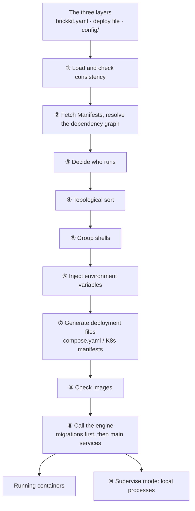

# BrickKit — part 4 of 9 (English)

Contains: docs/en/04-shell/04-members-management.md, docs/en/04-shell/05-shell-development.md, docs/en/04-shell/06-special-characters.md, docs/en/04-shell/07-shell-upgrade.md, docs/en/04-shell/08-shell-config.md, docs/en/05-migration/README.md, docs/en/05-migration/01-migration-service.md, docs/en/05-migration/02-env-passthrough.md, docs/en/05-migration/03-multi-version-chain.md, docs/en/05-migration/04-shell-interaction.md, docs/en/06-architecture/README.md, docs/en/06-architecture/01-pipeline-overview.md, docs/en/06-architecture/02-dependency-resolution.md, docs/en/06-architecture/03-env-injection-contract.md, docs/en/06-architecture/04-deploy-file-generation.md

File paths below are relative to the repository root, https://raw.githubusercontent.com/brickKit/brickKit/main/ ; links inside pages are relative to this file

Next: https://raw.githubusercontent.com/brickKit/brickKit/main/llms/en/05.md

---

> File: docs/en/04-shell/04-members-management.md

# Managing members

## Joining a shell

When you `add` a shell, the members compiled into it are added to the project at the versions the shell declares, and in
the deploy file they are **nested straight under the shell's entry**:

```bash
brickkit add --local
```

```text
➕ Adding shop/cart@0.1.0, shop/shell@0.1.0, shop/stock@0.1.0
   ✅ shop/stock@0.1.0 (in shell shop/shell)
   ✅ shop/cart@0.1.0 (in shell shop/shell)
   ✅ shop/shell@0.1.0
📝 Written: brickkit.yaml, deploy.yaml
📝 Config skeletons: config/shop-stock.yaml
```

```yaml
# deploy.yaml
components:
  - id: shop/shell
    members:
      - id: shop/stock
      - id: shop/cart
```

For a component that was in the project before a shell able to host it came along, `add` **doesn't** move it into the
shell for you, and doesn't ask whether to: whether it runs inside a shell is a decision about how you deploy — saving memory
or scaling separately, merging in this environment or not — that only you can make, and it may differ per deploy file. To
put it in, move its entry under the shell entry's `members`.

## Moving out of a shell

Move the member's entry from under `members` to the top level:

```yaml
components:
  - id: shop/shell
    members:
      - id: shop/cart
  - id: shop/stock          # runs on its own
```

On the next `up`, `shop/stock` runs in its own container from its own image, the shell hosts only `shop/cart`, and the
addresses pointing at `shop/stock` go back to its own service name. **Not a word of its config changes**:
`config/shop-stock.yaml` says which values it needs, which has nothing to do with where it runs. The deploy file's `members`
decides only "how it runs"; it doesn't change the config itself.

By the same reasoning, writing a member's entry as `mode: disable` in a deploy file means the shell doesn't host it this
time; writing it as `mode: debug` or `mode: local` in `deploy.local.yaml` runs it as a process on your machine this time,
and the shell doesn't host it either (see [Local debugging](../../docs/en/02-project-guide/03-local-debug-workflow.md#debugging-a-shell-member)).

## When the shell doesn't run

When the shell is turned off with `mode: disable`, or doesn't start this time, the members under it don't disappear with
it — they **fall back to standalone components**, each deployed by its own entry.

## Removing a shell

```bash
brickkit remove shop/shell
```

The shell's entry is deleted, the members it hosted move back to the top level of the deploy file and run on their own,
and their config is kept.

## Fields that do nothing for a member in a shell

A member entry is a full deploy entry, but while a shell hosts it, the fields describing "how its own container is
deployed" **do nothing, without a warning**: `expose`, `exposePort`, `hostname`, `tlsSecret`, `replicas`, `resources`,
`serviceAccountName`, `labels`. It has no container of its own this time, so there's nowhere for them to apply. Keeping
them on the entry is useful: when the shell doesn't run and the member falls back to a standalone component, they take
effect.

Likewise, the `healthCheck` in a member's `component.yaml` isn't used inside a shell — what's health-checked is the shell's
process, with the shell's own `healthCheck`. A member's port can't be opened to the outside on its own while it's inside a
shell; a member that needs its own external exposure shouldn't go into a shell.

## Start cycles caused by merging, and `skipWaitFor`

There's no cycle between the components, yet putting them in a shell can create one. `shop/cart` (in the shell) depends on
`shop/order` (outside), and `shop/order` depends on `shop/stock` (in the shell):

```text
shop/cart ──→ shop/order ──→ shop/stock
(in shell)    (outside)      (in shell)
```

The shell starts as one unit: it inherits every member's dependencies, so the shell waits for `shop/order`; whatever
depends on a member depends on the shell, so `shop/order` waits for the shell. On Docker Compose that's a wait cycle that
can never start, and `up` stops it before generating anything:

```text
❌ Error: running the members inside shell shop/shell@0.1.0 makes it wait for a component that in turn waits for the shell
   Dependency: shop/order@0.1.0 → shop/stock@0.1.0 (in shell shop/shell@0.1.0)
   Dependency: shop/cart@0.1.0 (in shell shop/shell@0.1.0) → shop/order@0.1.0
   Reason: No component requires another in a loop, but the shell container starts as one unit: it inherits every member's dependencies, and whatever depends on a member depends on the shell. With Docker Compose this becomes a depends_on cycle that can never start
   Suggestions:
   1. Put the component in the middle into the same shell too (nest its entry under the shell), or take one of these members out of the shell (move its entry to the top level)
   2. Or make one of these dependencies optional (optional: true) in its component.yaml: an optional dependency doesn't constrain start order
   3. Or accept the cost: in the deploy file, write skipWaitFor: [shop/order] on the entry of shop/cart@0.1.0. It then starts without waiting for shop/order and must retry until it is ready
```

The first two ways out change the structure; the third keeps the structure and removes one wait:

```yaml
components:
  - id: shop/shell
    members:
      - id: shop/stock
      - id: shop/cart
        skipWaitFor: [shop/order]
  - id: shop/order
```

```text
📋 Start order (topological sort):
   1. shop-shell-0-1-0  no dependencies  (hosts shop/stock@0.1.0, shop/cart@0.1.0; does not wait for shop/order@0.1.0)
   2. shop-order-0-1-0  ← depends on 1
```

`skipWaitFor` removes only **the wait at start-up**: the shell starts without waiting for `shop/order`. Connections are
unaffected — `shop/cart` still gets `SHOP_ORDER_ENDPOINT` and still reaches it.

**Whoever writes it pays the cost.** When the shell starts, `shop/order` may not be ready yet, so `shop/cart`'s code must
retry: code that exits when it can't connect during initialisation keeps restarting here. Make sure your member can do
that before writing it.

The rules:

- What's listed must be a real **required dependency** of this component version — a misspelled name, an optional
  dependency (never waited for anyway), or a component it doesn't depend on at all is an error, so that you don't believe a
  wait was removed when it wasn't.
- When the skipped dependency is in the same shell, the call never leaves the process and there's no wait to begin with;
  on Docker / Podman writing it gets a warning.
- On Kubernetes, Pods don't wait for each other at start, so there is no wait to skip. `up` warns for each entry that
  has it — `shop/cart@0.1.0 has skipWaitFor, but Pods on Kubernetes don't wait for each other at start: it has no
  effect here` — and its start order has no "does not wait for" notes. The entry isn't refused: the same deploy file
  pointed back at Docker / Podman makes it work again.
- A component running as a process on this machine (or inside a shell that runs as one) has no `depends_on` either;
  `up` warns that its `skipWaitFor` has no effect this time.
- In both of those cases a cycle caused by merging isn't stopped: with no waits at start, nothing deadlocks.

---

> File: docs/en/04-shell/05-shell-development.md

# Writing a shell

## Start from the skeleton

```bash
brickkit new shop/shell --shell
```

```text
✅ Component skeleton generated: shop/shell
   📄 shell/shop/shell/component.yaml
   📄 shell/shop/shell/BRICKKIT.md
   📄 shell/shop/shell/AGENTS.md
   📄 shell/shop/shell/CLAUDE.md
   📄 shell/shop/shell/README.md
```

A shell is written under the project's `shell/` (the local install source `local-shells`): a shell is usually a project's
own code, deciding "which components this project merges", and it's committed with the project. The skeleton's
`shell.members` carries a placeholder member to replace:

```yaml
shell:
  # TODO: the members this shell compiles in, each at its exact version (replace the placeholder)
  members:
    - example/member@0.1.0
```

Replace it with the members really compiled in:

```yaml
shell:
  members:
    - shop/cart@0.1.0
    - shop/stock@0.1.0
```

**What's compiled in is not what's hosted.** `shell.members` says what the shell's image contains, so it lists at least
one member: `members: []` is `MANIFEST_INVALID` in `lint` and `add`, because a shell with nothing compiled in has no
reason to exist. Which of those members run inside it this time is a different fact, chosen in the deploy file by
nesting their entries under the shell's — and that may be none, in which case the shell starts with
`BRICKKIT_SERVED_MEMBERS` empty and `BRICKKIT_SERVED_MEMBERS_CONFIG` as `[]` (see
[Config as JSON](../../docs/en/04-shell/02-json-injection.md)).

So a new shell joins the project together with its first member, not before it: make that member work and build its
image, put it in `shell.members` in place of the placeholder, then `brickkit add` the shell (which writes the members in
for you). Until then the shell's skeleton stays out of `brickkit.yaml` — and `brickkit build`, which builds only
components the project has, doesn't know it yet.

The shell itself is an ordinary component: it has its own `deployment`, `healthCheck`, image and config.

It has the same documents as any component, too. Its `BRICKKIT.md` has the usual six sections; the last one, Shell
declaration, lists the members compiled in, each at its exact version, kept in step with `shell.members`. The skeleton
starts it with the placeholder member:

```markdown
## Shell declaration

This component is a shell. Members compiled in (keep in step with shell.members in component.yaml):

- `example/member@0.1.0` <!-- TODO: placeholder: what each member does and what it needs from the shell -->
```

Replace it along with `shell.members`, saying for each member what it does and what it needs from the shell. A member in
`shell.members` that the section doesn't mention is reported by `brickkit lint` as `DOC_OUT_OF_STEP`.

## The start-up code

When a shell starts it does four things: read `BRICKKIT_SERVED_MEMBERS_CONFIG`, find the module compiled in for each item,
initialise it with that item's config, and listen on that item's port for it. The whole of `shop/shell`:

```go
// shop/shell: a shell that compiles shop/cart and shop/stock into one process.
//
// A real shell would import the members' code; to keep it short, the two modules' handlers are written here in the shell.
package main

import (
	"encoding/json"
	"fmt"
	"log"
	"net/http"
	"os"
)

// member is one item of BRICKKIT_SERVED_MEMBERS_CONFIG.
type member struct {
	ComponentID string            `json:"componentId"`
	Version     string            `json:"version"`
	HTTPPort    int               `json:"httpPort"`
	Config      map[string]string `json:"config"`
}

// modules are the modules compiled into this shell: component ID → build its HTTP handler from the member's own config.
var modules = map[string]func(cfg map[string]string) http.Handler{
	"shop/stock": func(cfg map[string]string) http.Handler {
		mux := http.NewServeMux()
		mux.HandleFunc("/api/v1/stock", func(w http.ResponseWriter, _ *http.Request) {
			json.NewEncoder(w).Encode(map[string]any{"sku": "A1", "count": 42, "warehouse": cfg["STOCK_WAREHOUSE"]})
		})
		return mux
	},
	"shop/cart": func(cfg map[string]string) http.Handler {
		mux := http.NewServeMux()
		mux.HandleFunc("/api/v1/cart", func(w http.ResponseWriter, _ *http.Request) {
			var s map[string]any
			if resp, err := http.Get(cfg["SHOP_STOCK_ENDPOINT"] + "/api/v1/stock"); err == nil {
				_ = json.NewDecoder(resp.Body).Decode(&s)
				resp.Body.Close()
			}
			json.NewEncoder(w).Encode(map[string]any{"items": []string{"A1"}, "stock": s})
		})
		return mux
	},
}

func main() {
	var members []member
	if err := json.Unmarshal([]byte(os.Getenv("BRICKKIT_SERVED_MEMBERS_CONFIG")), &members); err != nil {
		log.Fatalf("BRICKKIT_SERVED_MEMBERS_CONFIG: %v", err)
	}
	for _, m := range members {
		build, ok := modules[m.ComponentID]
		if !ok {
			log.Fatalf("this shell has no module %s", m.ComponentID) // not among the members compiled in: fail loudly
		}
		addr := fmt.Sprintf(":%d", m.HTTPPort) // listen on the member's own port for it
		go func(h http.Handler) { log.Fatal(http.ListenAndServe(addr, h)) }(build(m.Config))
		log.Printf("serving %s@%s on %s", m.ComponentID, m.Version, addr)
	}
	http.HandleFunc("/healthz", func(w http.ResponseWriter, _ *http.Request) { w.Write([]byte("ok")) })
	log.Fatal(http.ListenAndServe(":8080", nil))
}
```

Built and started, the shell logs:

```text
shop-shell-0-1-0-1  | 2026/09/29 22:58:47 serving shop/cart@0.1.0 on :8081
shop-shell-0-1-0-1  | 2026/09/29 22:58:47 serving shop/stock@0.1.0 on :8082
```

A few things to do exactly this way:

- **Each module uses its own item's `config`**, never the shell process's environment variables — members' config isn't
  there.
- **Fail at once when the JSON names a member the shell didn't compile in.** It means the declaration and the image
  disagree; skip it quietly, and callers get an address pointing at a service that doesn't exist.
- **The health check checks only the shell's process itself.** A module that fails to initialise should make the whole
  shell fail to start, rather than report healthy with a dead module inside.

## How addresses are pointed at it

Callers don't know the other end is a shell. The platform connects the addresses for it in two places:

**The addresses others get point at the shell.** `shop/order`, outside the shell, depends on `shop/stock` and gets:

```text
      - SHOP_STOCK_ENDPOINT=http://shop-shell-0-1-0:8082
```

The same holds between members inside the shell: the `SHOP_STOCK_ENDPOINT` that `shop/cart` gets in the JSON is also
`http://shop-shell-0-1-0:8082`. The port is the member's own port — exactly where the shell listens for it.

**Members' service names resolve to the shell too.** On Docker the shell's container carries every member's service name
as a network alias:

```yaml
    networks:
      brickkit-net:
        aliases:
          - shop-cart-0-1-0
          - shop-stock-0-1-0
```

On Kubernetes each hosted member gets a Service of its own name that selects the shell's Pod. Either way, whatever
addresses a member by its service name — another container, a seed script, a cross-component test — reaches the shell
without a change.

**How requests are routed inside the process is the shell's own business.** Which module a request gets once it reaches
one of the shell's ports, whether to split further by path or host name — the platform stays out of it. The platform only
guarantees a request reaches the right port of the shell; whether the shell uses one port per module or one port routed by
path is the shell author's decision.

**Ports must not clash.** The shell's own port and every member's port end up listening in the same container (or Pod), so
the platform checks them before generating anything:

```text
❌ Error: two components on shell shop/shell@0.2.0 both want port 8082
   Held by: Component shop/cart@0.1.0
   Held by: Component shop/stock@0.2.0
   Suggestion: These components all end up running in the same shell container/Pod, so ports must not collide
```

## Members' migrations don't run in the shell

When a member declares `migration.command`, the platform runs its migration separately, with **the member's own image** and
the member's own config, and starts the shell only once it succeeded:

```yaml
  shop-shell-0-1-0:
    depends_on:
      shop-stock-0-1-0-migration:
        condition: service_completed_successfully
```

So the shell needn't know how to migrate each member; and every member **must have its own image** (`deployment.image` or
`deployment.build`), even if it always runs in a shell. More in
[Migrations and shells](../../docs/en/05-migration/04-shell-interaction.md).

## Developing it locally

A shell is a component too and is developed the same way: create a workbench with `brickkit init` in the shell's
directory, or write the shell's entry in the project as `mode: debug` / `mode: local` so it runs as a process on this
machine (see [Developing inside a component](../../docs/en/03-component-guide/05-local-dev-fractal.md)).

A shell running as a process on this machine loads the members' **code in their local repositories** (the clones under
`components/`). So `up` checks a chain: the member versions the shell hosts this time equal the versions the shell's
`component.yaml` declares as compiled in; when a member has a local repository, the version in that repository's
`component.yaml` must be exactly that one too, and it must be the member's default version. When they don't match it fails,
suggesting `brickkit upgrade <member>@<repository version>` or checking out the matching tag in the repository — rather
than letting you debug code that doesn't match the declaration.

---

> File: docs/en/04-shell/06-special-characters.md

# Special characters

## The problem

Members' config goes into one JSON string, handed to the shell as one environment variable. A config value can hold
anything: a multi-line PEM private key, quotes, backslashes, `$`. If the platform just wrote `${VAR}` into the JSON as it
is and left it to Docker Compose to substitute at start-up, Compose would do **a plain-text substitution that knows nothing
about JSON**: substitute a value with a quote or a newline, and the JSON breaks. The shell fails to parse it at start-up —
and it only shows up at run time.

## What the platform does

**Evaluate first.** When generating the deployment files, the CLI works out the value of every member's config:

| Written as | At generation time |
| --- | --- |
| A literal | Kept as it is |
| `$var:NAME` | Replaced by the shared variable's value |
| `${VAR}` | Expanded from the process environment, then the project root's `.env`; if it isn't found, it fails loudly |
| `file://path` | Read into the file's contents |
| `{ existingSecret, key }` | Refused: the value lives only in the cluster, the CLI can't read it, and the JSON needs the value |

**Then encode it as JSON.** The evaluated values are encoded by JSON's rules: quotes, backslashes and newlines are all
escaped.

**Then escape once more for where it lands.** On Docker the JSON goes into an env file with mode 0600, with `$` written as
`$$` so that Compose substitutes nothing in it; on Kubernetes it goes into the generated Secret.

## An example

`shop/stock`'s warehouse name is kept in a file, holding quotes, a `$` and two lines:

```text
Warehouse "No. 1"
Price $5
```

```yaml
# config/shop-stock.yaml
STOCK_WAREHOUSE: file://.secrets/warehouse.txt
```

In the shell's env file:

```text
BRICKKIT_SERVED_MEMBERS_CONFIG="[{\"componentId\":\"shop/cart\",\"version\":\"0.1.0\",\"httpPort\":8081,\"extraPorts\":[],\"config\":{\"SHOP_ORDER_ENDPOINT\":\"http://shop-order-0-1-0:8083\",\"SHOP_STOCK_ENDPOINT\":\"http://shop-shell-0-1-0:8082\"}},{\"componentId\":\"shop/stock\",\"version\":\"0.1.0\",\"httpPort\":8082,\"extraPorts\":[],\"config\":{\"STOCK_WAREHOUSE\":\"Warehouse \\\"No. 1\\\"\\nPrice $$5\\n\"}}]"
```

The value the `shop/stock` module in the shell gets is the file's contents, byte for byte:

```json
{"count":42,"sku":"A1","warehouse":"Warehouse \"No. 1\"\nPrice $5\n"}
```

## Values JSON can't carry: fail loudly

JSON carries only text. When a value isn't valid UTF-8 (a binary file, say), encoding would silently replace the invalid
bytes with the replacement character — and the member would get an altered value. The platform stops it at generation
time:

```text
❌ Error: config item STOCK_WAREHOUSE of shell member shop/stock@0.1.0 is not valid UTF-8 text
   Reason: JSON can only carry text; binary bytes would be replaced silently
   Suggestion: Store binary content base64-encoded and decode it in the component
```

`lint` runs the same check (a referenced file or variable that can't be found is reported under `--strict`), so this kind
of problem is caught in CI, before any deployment.

Evaluating first has one consequence: on Docker, `${VAR}` in a shell member's config is also looked up **when the CLI
runs**, not when `docker compose` starts — the environment that runs `brickkit up` has to hold those variables.

---

> File: docs/en/04-shell/07-shell-upgrade.md

# Upgrading a shell

## The shell's version decides the members' versions

A shell's image has the code of one specific version of each member compiled in. So "which version of a member does the
shell host this time" isn't something to pick freely: it has to be the version written in `shell.members` of the shell's
`component.yaml`.

The platform only **checks**; it never works it out for you. The deploy file and `brickkit.yaml` say which version is
hosted this time, the shell's `component.yaml` says which version is compiled in, and when the two disagree it's an error.

## Upgrading the shell: switch to the set the new shell compiles in

`shop/shell@0.2.0` compiles in `shop/stock@0.2.0`:

```yaml
metadata:
  id: shop/shell
  name: Shop shell
  version: 0.2.0
  description: Compiles the cart and the stock into one process

shell:
  members:
    - shop/cart@0.1.0
    - shop/stock@0.2.0
```

```bash
brickkit upgrade shop/shell
```

```text
   ⬆️  shop/shell: 0.1.0 → 0.2.0
   ⬆️  shop/stock: 0.1.0 → 0.2.0
   ✅ shop/stock@0.1.0 (requiredBy: shop/cart, shop/order)
📝 config/shop-stock.yaml
   Kept as written: STOCK_WAREHOUSE
📝 config/shop-shell.yaml
🗄️  Config archived: config/shop-shell.yaml → config/.archive/shop-shell@0.1.0.yaml
📝 Written: brickkit.yaml, deploy.yaml
```

Upgrading a shell is switching to the set of member versions the new shell compiles in. `shop/stock@0.1.0` is still
depended on by other components (`shop/cart` and `shop/order` both declare `shop/stock@0.1.0`), so it stays, and runs on
its own at the top level; an old version nobody needs any more would be removed. Each config file follows its version, as
in any upgrade: `config/shop-stock.yaml` is migrated to `shop/stock@0.2.0` and the kept old version gets its own
`config/shop-stock@0.1.0.yaml`; the shell's own config is migrated to 0.2.0, and the 0.1.0 file is archived into
`config/.archive/`, because no `shop/shell@0.1.0` is left. The deploy file changes with it:

```yaml
components:
  - id: shop/shell
    members:
      - id: shop/stock
      - id: shop/cart
        skipWaitFor: [shop/order]
  - id: shop/order
  - id: shop/stock@0.1.0
```

Fields you wrote on member entries (`mode`, `skipWaitFor`…) are kept. Build the new shell's image and `up`:

```text
📋 Start order (topological sort):
   1. shop-stock-0-1-0  no dependencies
   2. shop-order-0-1-0  ← depends on 1
   3. shop-shell-0-2-0  ← depends on 1  (hosts shop/stock@0.2.0, shop/cart@0.1.0; does not wait for shop/order@0.1.0)
```

A shell can have only one version in `brickkit.yaml`: with two versions of the same shell hosting members at once, who
hosts whom would be unclear.

## Upgrading only a member

Upgrading only a member (`brickkit upgrade shop/stock`) leaves the shell alone: the shell's image still holds the old
version's code. So the old version stays with a `requiredBy` (the shell is on the list of those who need it), the member
entry under the shell is pinned to the old version, and the new default version runs on its own at the top level:

```text
   ⬆️  shop/stock: 0.1.0 → 0.2.0
   ✅ shop/stock@0.1.0 (requiredBy: shop/cart, shop/order, shop/shell)
```

```yaml
components:
  - id: shop/shell
    members:
      - id: shop/stock@0.1.0
      - id: shop/cart
        skipWaitFor: [shop/order]
  - id: shop/order
  - id: shop/stock
```

When the two versions share one database, whether the data layer stays compatible is for the member to guarantee (see
[Several versions side by side](../../docs/en/03-component-guide/09-multi-version-coexistence.md)). **After upgrading, check
compatibility between the members yourself**: members in a shell call each other in-process, and the platform can't know
whether `shop/cart@0.1.0` works with a newer version of the stock module.

## Three ways out when versions don't match

Editing the deploy file by hand, you may have a shell host a version it doesn't compile in — for instance, by swapping the
two `shop/stock` entries above:

```text
❌ Error: the member versions this run hosts in a shell differ from the ones its component.yaml says are compiled in
   File: deploy.yaml
   components[0].members[0]: shell shop/shell@0.1.0 contains shop/stock@0.1.0, but this run hosts shop/stock@0.2.0
   Suggestions:
   1. Upgrade shop/shell to a version whose component.yaml lists shop/stock@0.2.0 under shell.members
   2. Move the entry of shop/stock out of the members of shop/shell to the top level of the deploy file, so it runs on its own
   3. Keep both versions: brickkit.yaml already keeps the version compiled into the shell, so swap the two deploy entries: change the member entry under shop/shell to `- id: shop/stock@0.1.0` and the entry at components[2] to `- id: shop/stock`; shop/stock@0.2.0 then runs on its own
```

| Way out | Fits when |
| --- | --- |
| Upgrade the shell | There's already a shell version that compiles in the new version |
| Move the member out of the shell | It's fine not to merge this member for now |
| Keep both versions | The old version keeps running in the shell, the new one runs on its own, until the shell catches up |

The third one spells out exactly what to change; make those edits and `up` passes.

## When the image and the declaration don't match

Change `shell.members` in the shell's `component.yaml` without rebuilding the shell's image, and the image on this machine
still holds the old members' code. `brickkit build` records the member versions compiled in as an image label when it
builds a shell's image, and `up` checks it before using a shell image built on this machine:

```text
❌ Error: the local image of shell shop/shell@0.2.0 contains other member versions than its component.yaml declares
   Image: shop-shell:0.2.0
   Members in the image: shop/cart@0.1.0,shop/stock@0.1.0
   Members declared in component.yaml: shop/cart@0.1.0,shop/stock@0.2.0
   Suggestion: Rebuild the shell image: brickkit build shop/shell@0.2.0 --force
```

Better still: when the members a shell compiles in change, raise the shell's version. For a released shell version,
`component.yaml`, tag and image agree by construction. A shell image without this label (built by hand, or a third-party
image) can't be checked, and `up` only warns.

---

> File: docs/en/04-shell/08-shell-config.md

# The shell's own config

## A shell is a component too

A shell has config of its own: a log level, its own connection pool, its own external port. Like any component, it
declares a `configSchema` in `component.yaml`, and the project fills in values in `config/<shell>.yaml`:

```yaml
# shell/shop/shell/component.yaml
configSchema:
  type: object
  properties:
    SHELL_LOG_LEVEL:
      type: string
      default: info
      description: The shell's own log level
```

## Two kinds of config, two channels

| | For | How it arrives |
| --- | --- | --- |
| The shell's own config | The shell's process | Ordinary environment variables, as for any component |
| The members' config | The modules inside the shell | Packed into `BRICKKIT_SERVED_MEMBERS_CONFIG` (see [Config as JSON](../../docs/en/04-shell/02-json-injection.md)) |

Both sit side by side on the generated shell container:

```yaml
    env_file:
      - path: .brickkit/generated/env/shop-shell-0-2-0.env
    environment:
      - BRICKKIT_SERVED_MEMBERS=shop-cart-0-1-0,shop-stock-0-2-0
      - COMPONENT_ID=shop/shell
      - COMPONENT_VERSION=0.2.0
      - SHELL_LOG_LEVEL=info
```

`SHELL_LOG_LEVEL` is the shell's own; the members' config is in the JSON in the env file and doesn't collide with it. The
shell's `COMPONENT_ID` / `COMPONENT_VERSION` are the shell's own — members' IDs and versions are in each JSON item's
`componentId` / `version`.

A shell's `configSchema` can't use the platform's reserved names either, `BRICKKIT_SERVED_MEMBERS` and
`BRICKKIT_SERVED_MEMBERS_CONFIG` among them.

## Communication inside the shell

How members call each other inside the shell — through their own ports, through in-process function calls, or over an
internal message bus — the platform stays out of it. The address the platform gives
(`SHOP_STOCK_ENDPOINT=http://shop-shell-0-1-0:8082`) always works: the shell really does listen on that port for
`shop/stock`. A shell author who wants to save that network hop can have the shell recognise "this address points at one
of my own modules" and make an in-process call instead — that's the shell's own optimisation, which the platform doesn't
understand and doesn't need to.

---

> File: docs/en/05-migration/README.md

# Database migrations

A component is responsible for its own table structure: it declares a migration command, and before starting the
component the platform runs that command once, with the same image and the same config, starting the component only when
it succeeded.

The platform only handles **when it runs, in what order, and whom a failure stops**; what the migration does, which
database it connects to, how it builds the connection string — all of that is the component's own business. The platform
doesn't deploy databases and doesn't know about them: a database's address, user and password are ordinary config items of
the component (declared in `configSchema`, filled in under `config/`), injected like any other config. The database itself
is prepared by whoever uses the component (created once); the tables are created by the component's migration.

| Page | Covers |
| --- | --- |
| [01 The migration container](../../docs/en/05-migration/01-migration-service.md) | The one-shot migration container, how the main service waits for it, what happens when it fails |
| [02 Environment passed through](../../docs/en/05-migration/02-env-passthrough.md) | The migration gets exactly the main service's config; the component builds its own connection string |
| [03 Migration order across versions](../../docs/en/05-migration/03-multi-version-chain.md) | When two versions of one component share a database, their migrations run one after the other, by version |
| [04 Migrations and shells](../../docs/en/05-migration/04-shell-interaction.md) | A shell member's migration runs on its own, with the member's own image |

---

> File: docs/en/05-migration/01-migration-service.md

# The migration container

## Declaring it

```yaml
# component.yaml
migration:
  command: ["/app/stock", "migrate"]
```

The command is an array: the very command to run in the container. It uses the component's **own image**: the migration
scripts and the component's code live in the same repository and the same image, and are always the same version — the
table structure the code needs is exactly what this version's migration builds.

The entry program has to tell "run the migration" from "start the service" by its argument, and **must fail at once on an
argument it doesn't know**:

```go
if len(os.Args) > 1 {
	if os.Args[1] != "migrate" {
		log.Fatalf("unknown argument %q", os.Args[1]) // fail at once on an argument it does not know
	}
	fmt.Println("shop/stock: migrations applied")
	return
}
```

Otherwise a misspelled argument turns the migration container into a second service that keeps running: it never
finishes, the main service waits for it forever, and the logs look perfectly normal.

## What the platform generates

On Docker, every component that declares a migration gets one more, one-shot service:

```yaml
  shop-stock-0-2-0-migration:
    command:
      - migrate
    depends_on:
      shop-stock-0-1-0-migration:
        condition: service_completed_successfully
    entrypoint:
      - /app/stock
    environment:
      - COMPONENT_ID=shop/stock
      - COMPONENT_VERSION=0.2.0
      - STOCK_WAREHOUSE=Main warehouse
    image: shop-stock:0.2.0
    networks:
      - brickkit-net
    restart: "no"
```

(Its `depends_on` is there because this project also runs `shop/stock@0.1.0`: see
[Migration order across versions](../../docs/en/05-migration/03-multi-version-chain.md).)

The main service **waits for it to finish successfully**, not for it to "be up":

```yaml
  shop-stock-0-1-0:
    depends_on:
      shop-stock-0-1-0-migration:
        condition: service_completed_successfully
```

On Kubernetes it's a Job: `up` first deletes the same-named Job left over from last time, then creates it and waits for
it to complete, and only then deploys the main service. The Job doesn't retry (`backoffLimit: 0`), and it runs once only,
however many replicas the main service has (with a Pod InitContainer, three replicas would run the same migration three
times at once).

`up` tells you beforehand which ones it will run:

```text
🔧 Database migrations that run before startup (on failure that component won't start):
   shop/stock@0.1.0  /app/stock migrate
   shop/stock@0.2.0  /app/stock migrate
```

## When a migration fails

When the migration exits non-zero, the main service doesn't start:

```text
❌ Error: database migration failed
   Component: shop/stock@0.2.0
   View logs: docker compose -p brickkit-shop logs shop-stock-0-2-0-migration
   Suggestions:
   1. When a migration fails the main service does not start: it waits for the migration to finish successfully
   2. Fix it and run brickkit up again: the migration container runs once more
```

```text
shop-stock-0-2-0-migration-1  | shop/stock: migration 002 failed: column "warehouse" already exists
```

Fix it and `up` again: the migration container runs on every `up`. So **a migration must be idempotent** — running a
change that was already made again does nothing. The usual way is a migration-record table noting which steps have run.
When several components share one database, that table's primary key has to include a component identifier, or their
records overwrite each other.

## When no migration container runs

A component running as a process on this machine (`mode: debug`, `mode: local`) has no container, so its migration
container is skipped too, and `up` reminds you:

```text
⚠️ Note: a mode: debug component's database migration won't run automatically
   Component: shop/stock@0.2.0
   Reason: A mode: debug component generates no container, so its migration container is skipped too
   Suggestions:
   1. Run the component's migration command by hand on this machine: /app/stock migrate
   2. Use the environment variables from local-debug.shop-stock-0-2-0.env
```

Run the migration yourself once then: with the environment variables from `local-debug.<service name>.env`, run the
component's migration command on this machine.

---

> File: docs/en/05-migration/02-env-passthrough.md

# Environment passed through

## The platform doesn't build connection strings

A migration connects to a database. The platform doesn't know whether you use PostgreSQL or MySQL, what the connection
string looks like, whether it needs SSL — and doesn't need to. **The migration container gets exactly the main service's
environment variables**: the same config, the same dependency addresses, the same secret file. The component takes the
host, port, database name, user and password from environment variables and builds the connection string itself.

## A complete example

The component declares which config it needs:

```yaml
# component.yaml
configSchema:
  type: object
  properties:
    DB_HOST:
      type: string
      description: PostgreSQL host name
    DB_PORT:
      type: integer
      default: 5432
      description: PostgreSQL port
    DB_NAME:
      type: string
      description: Database name
    DB_USER:
      type: string
      description: User to connect as
    DB_PASSWORD:
      type: string
      secret: true
      description: Password to connect with
  required: [DB_HOST, DB_NAME, DB_USER, DB_PASSWORD]

migration:
  command: ["/app/orders", "migrate"]
```

The project fills in values — when several components share one database, the address is written as a shared variable:

```yaml
# config/vars.yaml
PG_HOST: pg.internal
PG_PASSWORD: ${PG_PASSWORD}
```

```yaml
# config/shop-orders.yaml
DB_HOST: $var:PG_HOST
DB_NAME: orders
DB_USER: orders
DB_PASSWORD: $var:PG_PASSWORD
```

The migration container and the main service both get the same environment:

```yaml
  shop-orders-0-1-0-migration:
    command:
      - migrate
    entrypoint:
      - /app/orders
    env_file:
      - path: .brickkit/generated/env/shop-orders-0-1-0.env
    environment:
      - COMPONENT_ID=shop/orders
      - COMPONENT_VERSION=0.1.0
      - DB_HOST=pg.internal
      - DB_NAME=orders
      - DB_PORT=5432
      - DB_USER=orders
```

`DB_PASSWORD` is a secret: on Docker both reference the same env file with mode 0600 (it holds
`DB_PASSWORD="${PG_PASSWORD}"`, which `docker compose` fills in from the environment when it starts); on Kubernetes both
reference the same generated Secret. In the component's code:

```go
dsn := fmt.Sprintf("postgres://%s:%s@%s:%s/%s",
	os.Getenv("DB_USER"), url.QueryEscape(os.Getenv("DB_PASSWORD")),
	os.Getenv("DB_HOST"), os.Getenv("DB_PORT"), os.Getenv("DB_NAME"))
```

## Why it's split this way

- **The connection string's format is the component's business.** For the same PostgreSQL, Go's driver, JDBC and
  SQLAlchemy each want a different form; a platform building it for you could only build one of them.
- **One config, used in two places.** The migration and the main service read the same set of variables, so "the
  migration connected to database A and the service to database B" can't happen.
- **The database is prepared by the project.** The platform doesn't create databases: the database `DB_NAME` names has to
  exist first (created once by operations), and the tables are created by the migration.

Dependency addresses are passed through the same way: when a migration needs to call another component (registering with
some service before migrating, say), it gets the `*_ENDPOINT` variables too.

---

> File: docs/en/05-migration/03-multi-version-chain.md

# Migration order across versions

## The problem

When two versions of the same component run at once (see
[Several versions side by side](../../docs/en/03-component-guide/09-multi-version-coexistence.md)), they usually connect to the same
database. If both versions' migrations run at the same time, they change the structure of the same tables concurrently — at
best one side fails, at worst the schema ends up broken.

## Chained by version

The platform chains the migrations of the versions of one component **by version number**: the lower version's migration
finishes before the higher one's starts. When `shop/stock`'s 0.1.0 and 0.2.0 both declare a migration, what's generated is:

```yaml
  shop-stock-0-2-0-migration:
    command:
      - migrate
    depends_on:
      shop-stock-0-1-0-migration:
        condition: service_completed_successfully
    entrypoint:
      - /app/stock
    image: shop-stock:0.2.0
```

The two migration containers' logs, in order:

```text
shop-stock-0-1-0-migration-1  | shop/stock: migrations applied
shop-stock-0-2-0-migration-1  | shop/stock: migrations applied
```

The rules:

- Versions are compared as versions, not as names (`1.10.0` comes after `1.9.0`).
- A version that declares no migration is skipped, and the chain joins up across it.
- **Different components' migrations aren't chained**: their chains run in parallel — even two components sharing one
  database each look after their own tables.

Why the lower version goes first: the old version's migration builds the structure it needs, and the new version's
migration carries on from there. The other way round, the old version's migration might fail against a structure the new
version has already changed.

## Data compatibility is the component author's business

The platform only guarantees that two versions' migrations never change the structure at the same time. Whether the two
versions are compatible while both read and write the same tables — does the old version accept the columns the new one
added, can the new version read what the old one wrote — the platform has no way to know; only the component's author can
design for it. It usually means migrations only "add" (add columns, add tables), never delete or change structure the old
version still uses, and clean up once the old version has retired.

---

> File: docs/en/05-migration/04-shell-interaction.md

# Migrations and shells

A shell member's code runs in the shell's process, but its **migration doesn't run in the shell**. The platform generates
the member's own migration container as usual:

- With **the member's own image**: every member must have its own image (`deployment.image` or `deployment.build`), even
  one that always runs inside a shell.
- With **the member's own config**: exactly the environment variables it would get running on its own.
- **The shell starts only once it finished successfully**: the moment the member's code is loaded, the table structure
  has to be in place.

`shop/stock@0.2.0` is in the shell `shop/shell@0.2.0`; what's generated is:

```yaml
  shop-shell-0-2-0:
    depends_on:
      shop-stock-0-1-0:
        condition: service_healthy
      shop-stock-0-2-0-migration:
        condition: service_completed_successfully
```

(The first entry is there because `shop/cart` in the shell depends on `shop/stock@0.1.0`, which runs on its own outside.)

```yaml
  shop-stock-0-2-0-migration:
    command:
      - migrate
    depends_on:
      shop-stock-0-1-0-migration:
        condition: service_completed_successfully
    entrypoint:
      - /app/stock
    image: shop-stock:0.2.0
```

The member's migration logs come before the shell's:

```text
shop-stock-0-1-0-migration-1  | shop/stock: migrations applied
shop-stock-0-2-0-migration-1  | shop/stock: migrations applied
shop-shell-0-2-0-1            | 2026/09/29 23:09:58 serving shop/cart@0.1.0 on :8081
shop-shell-0-2-0-1            | 2026/09/29 23:09:58 serving shop/stock@0.2.0 on :8082
```

What this split buys:

- **The shell needn't understand how each member migrates.** A member's migration command and the environment it
  migrates with are the member's own.
- **When one member's migration fails, the shell doesn't start, and the error names that member** — rather than the shell
  starting and some module then failing against a table that doesn't exist.
- **Moving a member out of the shell changes nothing.** Its migration already runs on its own.

When another version of the same member runs on its own outside the shell — as `shop/stock@0.1.0` does here — the two
versions' migrations are chained by version number as usual (see
[Migration order across versions](../../docs/en/05-migration/03-multi-version-chain.md)).

When the shell runs as a process on this machine (`mode: debug` / `mode: local`), there's no container to wait for; `up`
runs the members' migration containers once on their own, after starting the other containers.

---

> File: docs/en/06-architecture/README.md

# Architecture and mechanisms in depth

**For whom**: people who want to know how BrickKit works inside — tracking down a behaviour that makes no sense,
weighing a design proposal, or writing code for BrickKit itself. To simply use it, the
[Project guide](../../docs/en/02-project-guide/README.md) and the [Component guide](../../docs/en/03-component-guide/README.md) are enough.

**How to read it**: start with [01 The pipeline](../../docs/en/06-architecture/01-pipeline-overview.md) to see which stations one `up` passes through,
then jump to the station you need. For "why is it this way and not that way", read
[05 Design principles and trade-offs](../../docs/en/06-architecture/05-design-principles.md).

| Page | Covers |
| --- | --- |
| [01 The pipeline](../../docs/en/06-architecture/01-pipeline-overview.md) | From the three declaration layers to running containers: every station of the pipeline |
| [02 Dependency resolution](../../docs/en/06-architecture/02-dependency-resolution.md) | Topological sort, diamond dependencies, cycles, several versions |
| [03 The environment variable contract](../../docs/en/06-architecture/03-env-injection-contract.md) | Every variable the platform may inject, how names are formed, when values are worked out |
| [04 Generating deployment files](../../docs/en/06-architecture/04-deploy-file-generation.md) | What the generated `compose.yaml` and Kubernetes manifests look like |
| [05 Design principles and trade-offs](../../docs/en/06-architecture/05-design-principles.md) | The idea running through everything, fifteen engineering ideas, the ten principles |
| [06 The Git repository cache](../../docs/en/06-architecture/06-bare-repo-mechanism.md) | Bare repositories, the read order, working offline |
| [07 Cache design](../../docs/en/06-architecture/07-cache-design.md) | What's in `.brickkit/`, what can be deleted |
| [08 Security and signing](../../docs/en/06-architecture/08-security-and-signing.md) | Signing and verification, where public keys live, network policies and their limits |
| [09 Error codes](../../docs/en/06-architecture/09-error-codes.md) | Every error code, the situations behind it, whether to retry |

---

> File: docs/en/06-architecture/01-pipeline-overview.md

# The pipeline

## Four parts

| Part | Form | Long-running? | Does |
| --- | --- | --- | --- |
| BrickKit CLI | One local executable | ❌ Exits when done | Reads declarations, resolves, generates, calls the engine, releases |
| Components | Docker containers / Kubernetes Pods | ✅ | The business itself; they call each other directly by DNS name |
| The underlying engine | Docker / Podman / Kubernetes | ✅ | Actually runs containers, health-checks, restarts, load-balances |
| Install sources | Git repositories, local directories, a component market (optional) | Depends | Holds components' `component.yaml`, contracts and code |

"What it should be" is written in the three layers of files; "what it actually is" lives in the underlying engine. Between
two runs the CLI remembers nothing — no background process, no listening port, no service to operate.

## The pipeline of one `brickkit up`



## What each station does

**① Load and check consistency.** Read `brickkit.yaml`, the deploy file used this time (`deploy.yaml`; `deploy.local.yaml`
in local mode; or the one `-f` names) and `config/`. The three layers have to agree: every component version has exactly
one entry in the deploy file, shell members are written under their shell, every `$var:` is defined, no config conflict is
left unresolved. When they don't, it stops — every later station takes these three files as input, and with wrong input,
everything computed afterwards is wrong. With the `k8s` target (except under `--dry-run`), `up` then confirms that
`kubectl` is connected to the cluster the deploy file names, before fetching or generating anything: deploying to the
wrong cluster can't be undone.

**② Fetch Manifests, resolve the dependency graph.** For the components and versions in `brickkit.yaml`, fetch each
component's `component.yaml` from the cache or the install source, and connect them into a graph by their
`dependencies`. A missing required dependency is an error here; a missing optional one is a warning. See
[Dependency resolution](../../docs/en/06-architecture/02-dependency-resolution.md).

**③ Decide who runs.** Top-level components (nothing depends on them) run by default; a lower component runs as long as
something above it that needs it runs; a `mode` written in the deploy file takes precedence. Every component carries a
reason ("top-level", "demo/caller needs it", "mode: debug").

**④ Topological sort.** Order the components running this time for start-up: dependencies before those that depend on
them.

**⑤ Group shells.** Work out which members each shell hosts this time, check their versions match the ones compiled into
the shell, and pack the members' config into JSON. See [Shells](../../docs/en/04-shell/README.md).

**⑥ Inject environment variables.** Work out every environment variable each component gets: `COMPONENT_ID`,
`COMPONENT_VERSION`, every dependency's `*_ENDPOINT`, the config values resolved from `config/`. A required item without a
value is stopped here. See [The environment variable contract](../../docs/en/06-architecture/03-env-injection-contract.md).

**⑦ Generate deployment files.** Depending on the deploy file's `target`, generate `.brickkit/generated/compose.yaml`
(`docker`, `podman`) or a set of Kubernetes manifests (`k8s`). They are generated afresh every time; components never
carry deployment files of their own. `--dry-run` stops here. See [Generating deployment files](../../docs/en/06-architecture/04-deploy-file-generation.md).

**⑧ Check images.** Images built on this machine must already exist (`up` never builds); pulled images must be reachable.
Every missing one is listed at once.

**⑨ Call the engine.** `docker compose up` (or `podman compose`, `kubectl apply`). Components that declare a migration run
it first, and their main service starts only when it finished successfully; then it waits for every component's health
check to pass.

**⑩ Supervise local processes.** With `mode: local` components, `up` stays in the foreground, starting and supervising
those processes on this machine until `Ctrl+C`.

## One pipeline, several exits

| Command | Goes as far as |
| --- | --- |
| `brickkit lint` | ①, plus config and shell-declaration checks for components whose Manifests are already on disk; no network, no dependency graph |
| `brickkit deps`, `brickkit graph` | ①②③, printing the dependency graph |
| `brickkit up --dry-run` | ①–⑦, stopping once the deployment files are generated |
| `brickkit up` | All of it |
| `brickkit sync` | ①②③, arranging the source directories by who runs |

They share the same code: for the same project and the same deploy file, what `graph` draws, what `sync` archives and
what `up` starts are always the same decision. (With local mode on, `sync` and `up` read `deploy.local.yaml` while `graph`
always reads `deploy.yaml`; `graph --file deploy.local.yaml` draws the local decision.)

## What the platform deliberately doesn't do

- **Stay running.** No control plane, no daemon: the state lives in the three layers and the underlying engine.
- **Service discovery or health polling.** DNS and the engine's own health checks already do that.
- **Gateways, meshes, circuit breaking, rate limiting, config centres.** These vary by business; they belong to the
  components themselves, or to outside tools hooked in through `labels` passed through.
- **Guess.** Version ranges, unknown fields, ports nobody said to expose — none of these are decided for you.

The reasons behind each are in [Design principles and trade-offs](../../docs/en/06-architecture/05-design-principles.md).

---

> File: docs/en/06-architecture/02-dependency-resolution.md

# Dependency resolution

`brickkit.yaml` only says "which components, at which versions", never who depends on whom — each component declares its
own dependencies in its `component.yaml`. On every run the CLI reads them and connects them into a graph: the nodes are
component versions, the edges are dependencies. Who runs, the start order, the injected addresses and the network policies
are all worked out from this graph.

## Required and optional dependencies

```yaml
dependencies:
  components:
    - shop/catalog@1.0.0          # required
    - id: shop/bus@1.0.0          # optional
      optional: true
```

| | When it's missing | Start order | Address variable |
| --- | --- | --- | --- |
| Required | An error; nothing starts | It starts before whoever depends on it (they wait for it to be healthy) | Always injected |
| Optional | A warning; start-up goes on | Doesn't constrain the start order | Injected while it runs; when it doesn't, the variable **doesn't exist at all** |

When deciding who runs, both kinds count the same: if something above needs it (required or optional), it runs along. They
differ only in what a missing one leads to, and in whether it's waited for.

## Topological sort

The start order is a topological sort of the dependency graph: each component comes after all of its required dependencies.
A diamond as an example — `shop/portal` depends on `shop/order` and `shop/stock`, and both of those depend on
`shop/catalog`:

```text
📋 Component state calculation:
   ✅ shop/catalog@1.0.0  starting (shop/order needs it)
   ✅ shop/order@1.0.0    starting (shop/portal needs it)
   ✅ shop/stock@1.0.0    starting (shop/portal needs it)
   ✅ shop/portal@1.0.0   starting (top-level)

📋 Start order (topological sort):
   1. shop-catalog-1-0-0  no dependencies
   2. shop-order-1-0-0    ← depends on 1
   3. shop-stock-1-0-0    ← depends on 1
   4. shop-portal-1-0-0   ← depends on 2, 3

Can start on their own: shop-catalog-1-0-0 (no dependencies)
Longest dependency chain (3 levels): shop-catalog-1-0-0 → shop-order-1-0-0 → shop-portal-1-0-0
   Components not on this chain start in parallel with it
```

## Diamond dependencies

`shop/catalog` is depended on along two paths, but it's **one** node and starts once: both dependants name the same exact
version, so it's the same component version.

```text
shop/portal@1.0.0
├── shop/order@1.0.0
│   └── shop/catalog@1.0.0
└── shop/stock@1.0.0
    └── shop/catalog@1.0.0 (shown above)
```

When the two paths want **different** versions, those are two nodes — see several versions below.

## Dependency cycles

When a few components **require** each other in a loop, each waits for the other to come up first, there's no start order,
and resolution fails:

```text
❌ Error: dependency cycle detected
   Cycle path: shop/order@1.0.0 → shop/stock@1.0.0 → shop/order@1.0.0
   Reason: These components all require each other; each is waiting for the others to start first, so there is no valid startup order
   Suggestions:
   1. Check the dependency declarations in the Manifest (dependencies.components)
   2. Make one side an optional dependency (optional: true) instead — an optional edge doesn't constrain startup order, and one optional edge in the cycle breaks the deadlock
```

One optional edge in the loop and it's no deadlock: optional edges don't constrain the start order, and with it left out
the sort has an answer. `shop/order` requires `shop/stock`, and `shop/stock` optionally depends on `shop/order`:

```text
📋 Start order (topological sort):
   1. shop-stock-1-0-0  no dependencies
   2. shop-order-1-0-0  ← depends on 1

Dependency graph:
   shop/order@1.0.0 → shop/stock@1.0.0
   shop/stock@1.0.0 → shop/order@1.0.0 (optional)
```

Both components run: deciding who runs computes the least fixed point of "who **doesn't** run", and cycles need no special
handling — nothing turns them off, so they both run.

A wait cycle that only appears once components are merged into a shell is another matter; see
[Managing members](../../docs/en/04-shell/04-members-management.md#start-cycles-caused-by-merging-and-skipwaitfor).

## Several versions

Dependencies name exact versions, so two components can depend on two versions of the same component: they are two nodes
in the graph with different service names (`demo-hello-1-0-0`, `demo-hello-1-1-0`), running at the same time. When `add`
meets this it adds the second version to `brickkit.yaml` too, marked with `requiredBy` (see
[Several versions side by side](../../docs/en/03-component-guide/09-multi-version-coexistence.md)).

The other way round, a component ID can appear only once in one component's `dependencies`: the address variable's name
carries no version, so two versions would collide on the same variable.

## The longest chain decides start-up time

More components doesn't mean more serial steps. Components without a dependency between them start in parallel; what
really decides how long an `up` waits is **the longest chain of required dependencies** in the graph — each one on it
waits for the one before to be healthy. `up` prints it:

```text
Longest dependency chain (3 levels): shop-catalog-1-0-0 → shop-order-1-0-0 → shop-portal-1-0-0
   Components not on this chain start in parallel with it
```

To start faster, look at this chain: turn a required dependency on it that needn't be waited for into an optional one (the
component must then retry on its own while the other isn't up yet), and the chain gets shorter.

## Where Manifests come from

Resolution needs every component version's `component.yaml`. For components from a local source it's read from the
directory every time; for ones from Git or a market, the project's permanent cache is checked first, and the install
source is asked only when it isn't there (see [The Git repository cache](../../docs/en/06-architecture/06-bare-repo-mechanism.md)). So `deps`, `graph`
and `up --dry-run` may need the network the first time; after that the same versions come from the cache. `lint` doesn't
build this graph, so it never goes to the network.

---

> File: docs/en/06-architecture/03-env-injection-contract.md

# The environment variable contract

Everything a component gets from the platform is an environment variable. This page lists every variable the platform may
inject, how its name is formed, and when its value is worked out. The only platform convention a component's code needs to
know is on this page.

## Every variable the platform may inject

| Variable | For | Value |
| --- | --- | --- |
| `COMPONENT_ID` | Every component | The component ID, e.g. `demo/hello` |
| `COMPONENT_VERSION` | Every component | The exact version, e.g. `1.0.0` |
| `<dependency>_ENDPOINT` | One per dependency running this time | The address of the dependency's main port, e.g. `http://demo-hello-1-0-0:8080` |
| `<dependency>_<port name>_ENDPOINT` | Every extra port a dependency declares | E.g. `PEOPLE_BASIC_GRPC_ENDPOINT=http://people-basic-1-0-0:9090` |
| The component's own config | Every component | The keys are the keys in `configSchema`; the values are resolved from `config/` |
| `BRICKKIT_SERVED_MEMBERS` | Shells | The service names of the members hosted this time, comma-separated |
| `BRICKKIT_SERVED_MEMBERS_CONFIG` | Shells | Each member's config and ports, as a JSON array (see [Config as JSON](../../docs/en/04-shell/02-json-injection.md)) |
| `PORT` | `mode: local` components | The port the platform picked for this process on this machine |

Beyond these, the platform injects nothing into a container. A `mode: local` process gets the same variables on top of
the environment of the terminal that ran `up`, minus every name the platform owns, plus a few language helpers; see
[What a `mode: local` process inherits](#what-a-mode-local-process-inherits).

## Dependency addresses

The **name** is derived from the component ID: `/` and `-` become `_`, all uppercase, followed by `_ENDPOINT`. The name
**carries no version**. An extra port's variable puts the port's name in between, by the same rule: `-` becomes `_`, all
uppercase (port `admin-api` → `PEOPLE_BASIC_ADMIN_API_ENDPOINT`), so every name is one a shell can read as `$NAME`.

The **value** does: `http://<versioned service name>:<port>`. The service name is the component ID with `/` and `.` turned
into `-`, all lowercase, followed by the exact version with its dots turned into `-` too (`demo/hello@1.0.0` →
`demo-hello-1-0-0`). This string is exactly the same on Docker and on Kubernetes.

| Dependency | Variable | Value |
| --- | --- | --- |
| `demo/hello@1.0.0` | `DEMO_HELLO_ENDPOINT` | `http://demo-hello-1-0-0:8080` |
| `people/basic@2.1.0` (extra port `grpc: 9090`) | `PEOPLE_BASIC_GRPC_ENDPOINT` | `http://people-basic-2-1-0:9090` |

Name and component ID can be derived from each other: seeing `PEOPLE_BASIC_ENDPOINT`, you know it points at
`people/basic`. That's why an ID can appear only once in one component's `dependencies`.

In a few special cases the address keeps this format but points elsewhere:

| This time the dependency | The address callers get points at |
| --- | --- |
| Is hosted by a shell | The shell: `http://<shell service name>:<the member's own port>` (the shell listens on that port for the member) |
| Runs as a process on this machine (`mode: debug` / `mode: local`) | The port becomes its port on this machine; inside containers the service name resolves to the host |

**When an optional dependency isn't running, the variable doesn't exist at all** — it isn't an empty string. A component
must handle "there is no such variable" when reading it:

```python
bus = os.environ.get("DEMO_BUS_ENDPOINT")   # None when it isn't running
if bus is None:
    ...  # degrade
```

An empty string would cause a class of very hard-to-find bugs: `f"{ENDPOINT}/healthz"` becomes `/healthz`, the request
hits the component **itself**, gets a 200, and you believe the dependency is fine.

## The component's own config

The keys of `configSchema` are the environment variable names, injected as they are. Where a value comes from follows one
chain (details in [Resolution order](../../docs/en/01-three-layers/08-resolution-priority.md)):

1. The value written in `config/<component>.yaml` (`config/<component>@<version>.yaml` for a compatibility version);
2. When it's written as `$var:NAME`, the current deploy file's `vars:` is checked first, then `config/vars.yaml`, and it's
   an error when neither has it;
3. Not written: the `default` from `configSchema`;
4. None of these: an optional item isn't injected; a required item makes `up` refuse to start.

Value types: a scalar is injected as the text you wrote (`1.10` is injected as `1.10`, never as `1.1`), whether it's a
value in `config/` or a `default` in `configSchema`; lists and maps are encoded as one line of JSON.

### No implicit overrides

A variable of the same name that happens to be in the process environment doesn't override what's written in `config/`,
and doesn't fill in an item that has no value either. Environment variables take part only where you **explicitly** wrote
`${VAR}`. This holds for `mode: local` processes too, which otherwise inherit the terminal's environment (see
[below](#what-a-mode-local-process-inherits)).

## Reserved names

Names the platform injects itself can't be used as a component's config items:

| Rule | Names |
| --- | --- |
| Exact | `COMPONENT_ID`, `COMPONENT_VERSION`, `PORT`, `BRICKKIT_SERVED_MEMBERS`, `BRICKKIT_SERVED_MEMBERS_CONFIG` |
| Suffix | `*_ENDPOINT` |

What happens on a collision depends on the step that finds it:

| When | Handling |
| --- | --- |
| `up` / `lint` | A warning; the item is ignored and the platform-injected value takes precedence |
| Publishing to a component market | Refused |

```text
⚠️ Config conflict: the config item of component demo/widget was ignored
   Component: demo/widget
   Config item: UPSTREAM_ENDPOINT
   Conflicting reserved pattern: *_ENDPOINT
   Handling: This config item is ignored; the platform-injected value takes precedence
   Origin: components/demo/widget/component.yaml
   Suggestions:
   1. Rename the config item in configSchema to avoid the platform's reserved variables
   2. For example, rename it to UPSTREAM_BASE_URL
```

`lint` checks every item declared in `configSchema`; `up` only meets an item when it would really be injected.

## When values are worked out

A config value can hold four kinds of reference: `$var:NAME` (a shared variable), `${VAR}` (the process environment or
`.env`), `file://path` (a file's contents), and `{ existingSecret: name, key: key }` (a Kubernetes Secret already in the
cluster). `$var:` is always replaced by the shared variable's value when the CLI loads the project. `existingSecret` is
never read by the CLI at all: on Kubernetes the Deployment references that Secret through `secretKeyRef`; everywhere else
the item isn't injected (on Docker you're warned; a shell's JSON refuses it, since the JSON needs the value; see
[Sensitive values](../../docs/en/01-three-layers/07-sensitive-values.md)). When `${VAR}` and `file://` are worked out depends on where
the value lands:

| Where the value lands | `${VAR}` | `file://` |
| --- | --- | --- |
| An ordinary value on Docker / Podman | Written into `compose.yaml` as it is and expanded when `docker compose` starts; the CLI checks it's defined when generating, and stops if not | The CLI reads the contents and writes them, as a secret, into an env file with mode 0600 |
| A secret on Docker / Podman (`secret: true`) | Written into the 0600 env file as it is and expanded when `docker compose` starts; checked to be defined first, likewise | As above |
| Kubernetes | Expanded by the CLI when generating the manifests (`kubectl` substitutes nothing); stops if it can't be found | The CLI reads the contents |
| A shell's `BRICKKIT_SERVED_MEMBERS_CONFIG` | Expanded by the CLI when generating, and JSON-encoded; stops if it can't be found | The CLI reads the contents and JSON-encodes them |
| A `mode: local` process's environment | Expanded by the CLI before starting the process; refuses to start if it can't be found | The CLI reads the contents |
| `mode: debug`'s `local-debug.*.env` | Expanded by the CLI when generating; if it can't be found the placeholder stays, and the output names it | The CLI reads the contents |

A shell's JSON must be worked out beforehand: `docker compose`'s substitution is plain text that knows nothing about JSON,
and substituting a value with a quote or a newline breaks the JSON (see
[Special characters](../../docs/en/04-shell/06-special-characters.md)). Kubernetes must be worked out beforehand: `kubectl` doesn't
substitute at all.

In no case does a secret appear in plain text in `compose.yaml` or a Deployment: on Docker it's in the 0600 env file, on
Kubernetes it's in the generated Secret, referenced by the Deployment through `secretKeyRef` (see
[Sensitive values](../../docs/en/01-three-layers/07-sensitive-values.md)).

## Migration containers and processes on this machine get the same

A component's migration container gets exactly the main service's environment (the same inline variables, the same env
file). A `mode: debug` component has no container; the platform writes the variables it would have got into
`.brickkit/generated/local-debug.<service name>.env` for you to load in your IDE; in that file, dependency addresses are
`http://localhost:<port>`, reachable from this machine.

## What a `mode: local` process inherits

A container gets the variables on this page and whatever its image sets, nothing from your terminal. A `mode: local`
process, which `brickkit up` starts on this machine from the component's source, starts from the environment of the
terminal that ran `up` instead: a program on your machine needs your `PATH`, `HOME`, toolchain and proxy settings to run
at all.

The names the platform owns are not inherited. They're removed from the terminal's environment before the process starts,
so the only value that can reach the process is the platform's own:

| Removed from the terminal's environment | So that |
| --- | --- |
| `COMPONENT_ID`, `COMPONENT_VERSION`, `PORT`, `BRICKKIT_SERVED_MEMBERS`, `BRICKKIT_SERVED_MEMBERS_CONFIG`, every name ending in `_ENDPOINT` | When the platform doesn't set one this time (an optional dependency that isn't running), the process really has no such variable, exactly as in a container; an `export DEMO_BUS_ENDPOINT=…` left in your shell can't make a stopped dependency look present |
| The keys of the component's own `configSchema` | A config item's value comes only from the chain [above](#the-components-own-config); a stale `export DB_HOST=…` in your shell never stands in for it |

On top of that, the platform sets a few variables for the language it recognised in the source directory, or the
`language` written in the `local:` block of `component.yaml` (a hand-written `runCommand` without `language` gets none of
them):

| Language | Set | Why |
| --- | --- | --- |
| `java` (Spring Boot) | `SERVER_PORT=<the PORT value>` | Spring Boot takes its listening port from `SERVER_PORT` |
| `java` | `JAVA_TOOL_OPTIONS=` and `JDK_JAVA_OPTIONS=` (emptied) | A debug agent with `suspend=y` left in your shell would make the process wait for a debugger nobody attaches |
| `node` | `NODE_OPTIONS=` (emptied) | The same, for an `--inspect-brk` left in your shell |
| `python` (Django) | `PYTHONUNBUFFERED=1` | The process's output goes to a pipe, not a terminal, and Python would otherwise hold log lines back in large blocks |

A `mode: debug` component is started by you, in your IDE, so what it inherits is up to the IDE; the platform's part is the
`local-debug.<service name>.env` file described above.

---

> File: docs/en/06-architecture/04-deploy-file-generation.md

# Generating deployment files

A component's repository never carries deployment files. On every `up` (and `up --dry-run`) the CLI regenerates them,
following the deploy file's `target`, from the three layers and each component's `component.yaml`:

| `target` | Generates | Where |
| --- | --- | --- |
| `docker`, `podman` | One `compose.yaml` | `.brickkit/generated/compose.yaml` |
| `k8s` | A set of Kubernetes manifests | `.brickkit/generated/k8s/` |

They are generated files: don't edit them by hand, the next `up` overwrites them. To change something, change the three
layers.

Both examples below come from the same project: `demo/caller` requires `demo/hello`, optionally depends on `demo/bus`,
declares a database migration of its own, and is exposed to the outside.

## Docker Compose

```yaml
# deploy.yaml
target: docker

components:
  - id: demo/hello
  - id: demo/bus
  - id: demo/caller
    expose: true
    exposePort: 18080
```

The generated `compose.yaml` (an excerpt: `demo/caller`, its migration, `demo/hello`):

```yaml
  demo-caller-1-0-0:
    depends_on:
      demo-caller-1-0-0-migration:
        condition: service_completed_successfully
      demo-hello-1-0-0:
        condition: service_healthy
    deploy:
      resources:
        reservations:
          cpus: "0.05"
          memory: 32M
    environment:
      - COMPONENT_ID=demo/caller
      - COMPONENT_VERSION=1.0.0
      - DATABASE_PORT=5432
      - DEMO_BUS_ENDPOINT=http://demo-bus-1-0-0:8080
      - DEMO_HELLO_ENDPOINT=http://demo-hello-1-0-0:8080
    healthcheck:
      interval: 10s
      retries: 3
      start_period: 60s
      test:
        - CMD-SHELL
        - wget -q --spider http://localhost:8080/healthz || curl -fsS http://localhost:8080/healthz || exit 1
      timeout: 3s
    image: demo-caller:1.0.0
    networks:
      - brickkit-net
    ports:
      - 18080:8080
    restart: unless-stopped
  demo-caller-1-0-0-migration:
    command:
      - migrate
    entrypoint:
      - /app/caller
    environment:
      - COMPONENT_ID=demo/caller
      - COMPONENT_VERSION=1.0.0
      - DATABASE_PORT=5432
      - DEMO_BUS_ENDPOINT=http://demo-bus-1-0-0:8080
      - DEMO_HELLO_ENDPOINT=http://demo-hello-1-0-0:8080
    image: demo-caller:1.0.0
    networks:
      - brickkit-net
    restart: "no"
  demo-hello-1-0-0:
    environment:
      - COMPONENT_ID=demo/hello
      - COMPONENT_VERSION=1.0.0
      - GREETING=Hello
    healthcheck:
      interval: 10s
      retries: 3
      start_period: 60s
      test:
        - CMD-SHELL
        - wget -q --spider http://localhost:8080/healthz || curl -fsS http://localhost:8080/healthz || exit 1
      timeout: 3s
    image: demo-hello:1.0.0
    networks:
      - brickkit-net
    restart: unless-stopped
```

Item by item:

- **The service name is the versioned service name**: `demo-caller-1-0-0`. Another version of the same component is
  another service, running alongside.
- **`depends_on`**: a required dependency is waited for until it's **healthy** (`service_healthy`), the component's own
  migration until it **finished successfully** (`service_completed_successfully`). The optional dependency `demo/bus`
  isn't in it — it may not start at all, and listing it would hold up the whole project.
- **Environment variables**: platform variables, dependency addresses, config values (`DATABASE_PORT` is the
  `configSchema` default, and so is `GREETING`). Secrets aren't here; they are in the 0600 file `env_file` references.
- **The migration container**: the same image, the same environment, `restart: "no"`, with the entry point replaced by
  the migration command.
- **The health check**: its rhythm is fixed by the platform (every 10 seconds, a 3-second timeout, 3 failures in a row);
  `start_period` comes from `startPeriodSeconds` (60 by default). Both `wget` and `curl` are tried, so having either in the
  image is enough.
- **Ports**: only `expose: true` components map a host port; the rest are reachable only inside the project's network.
- **Resources**: `requests` become `reservations`; when nobody writes `limits`, no ceiling is generated.
- **The network**: one network per project, named `brickkit-<project name>-net`; the Compose project name is
  `brickkit-<project name>`.

What a shell looks like in Compose (network aliases, `BRICKKIT_SERVED_MEMBERS`, members' migrations) is in
[Writing a shell](../../docs/en/04-shell/05-shell-development.md#how-addresses-are-pointed-at-it).

## Kubernetes

```yaml
# deploy.k8s.yaml
target: k8s
components:
  - id: demo/hello
    replicas: 2
  - id: demo/bus
  - id: demo/caller
    expose: true
    hostname: shop.example.com
```

```text
📄 Generated 10 manifests: .brickkit/generated/k8s/
   Namespace: brickkit-my-shop
```

```text
k8s/
├── namespace.yaml
├── deployments/      demo-bus-1-0-0.yaml  demo-caller-1-0-0.yaml  demo-hello-1-0-0.yaml
├── services/         demo-bus-1-0-0.yaml  demo-caller-1-0-0.yaml  demo-hello-1-0-0.yaml
├── ingress/          demo-caller-1-0-0.yaml
├── migrations/       demo-caller-1-0-0-migration.yaml
└── poddisruptionbudgets/  demo-hello-1-0-0.yaml
```

**Deployment** (`demo/hello`, an excerpt of the container part):

```yaml
      containers:
        - env:
            - name: COMPONENT_ID
              value: demo/hello
            - name: COMPONENT_VERSION
              value: 1.0.0
            - name: GREETING
              value: Hello
          image: demo-hello:1.0.0
          livenessProbe:
            failureThreshold: 3
            httpGet:
              path: /healthz
              port: 8080
            initialDelaySeconds: 10
            periodSeconds: 10
            timeoutSeconds: 3
          name: demo-hello
          ports:
            - containerPort: 8080
              name: http
          readinessProbe:
            failureThreshold: 3
            httpGet:
              path: /healthz
              port: 8080
            initialDelaySeconds: 5
            periodSeconds: 5
            timeoutSeconds: 3
          resources:
            requests:
              cpu: 50m
              memory: 32Mi
          startupProbe:
            failureThreshold: 12
            httpGet:
              path: /healthz
              port: 8080
            periodSeconds: 5
            timeoutSeconds: 3
```

**Three probes**: `startupProbe` leaves a grace period for a cold start (12 × 5 seconds = 60 seconds, from
`startPeriodSeconds`), and the other two probes don't begin until it passes; `readinessProbe` decides whether traffic
comes; `livenessProbe` decides whether to restart. All three hit the component's health check path — which should only
check that this process is alive.

**Service**: its name is the versioned service name, so `http://demo-hello-1-0-0:8080` is the same string on Kubernetes
as on Docker.

```yaml
kind: Service
metadata:
  name: demo-hello-1-0-0
spec:
  ports:
    - name: http
      port: 8080
      targetPort: 8080
  selector:
    app: demo-hello-1-0-0
  type: ClusterIP
```

**Ingress**: only for `expose: true` components, and `hostname` is required.

```yaml
kind: Ingress
spec:
  rules:
    - host: shop.example.com
      http:
        paths:
          - backend:
              service:
                name: demo-caller-1-0-0
                port:
                  number: 8080
            path: /
            pathType: Prefix
```

**Migration Job**: `backoffLimit: 0`, no retry on failure; `up` first deletes the same-named Job from last time, then
creates it and waits for it to complete, and only then `apply`s the main services.

```yaml
kind: Job
spec:
  backoffLimit: 0
  template:
    spec:
      containers:
        - command:
            - /app/caller
            - migrate
          image: demo-caller:1.0.0
          name: demo-caller-migration
      restartPolicy: Never
```

**PodDisruptionBudget**: generated automatically when `replicas` is above 1 (`maxUnavailable: 1`), so node maintenance
never evicts every replica at once.

A few more things are generated depending on the deploy file's settings:

| Setting | Generates |
| --- | --- |
| `secret: true` config, the contents of `file://` | A Secret (file mode 0600), referenced by the Deployment through `secretKeyRef` (see [Sensitive values](../../docs/en/01-three-layers/07-sensitive-values.md)) |
| `k8s.networkPolicy.enabled: true` | One NetworkPolicy per component, letting through what the dependency graph allows (see [Security and signing](../../docs/en/06-architecture/08-security-and-signing.md)) |
| `k8s.serviceAccount.enabled: true` | One ServiceAccount per component, with no token mounted |
| `k8s.podSecurity: restricted` | A `securityContext` on every container |

## The one thing both sides share

Docker's Compose file and Kubernetes' manifests have hardly a line in common — but **what components see is exactly the
same**: the same environment variable names, the same values, dependency addresses in the same format
`http://<versioned service name>:<port>`. So switching the deploy target is switching one deploy file, without a line of
component code changing.
