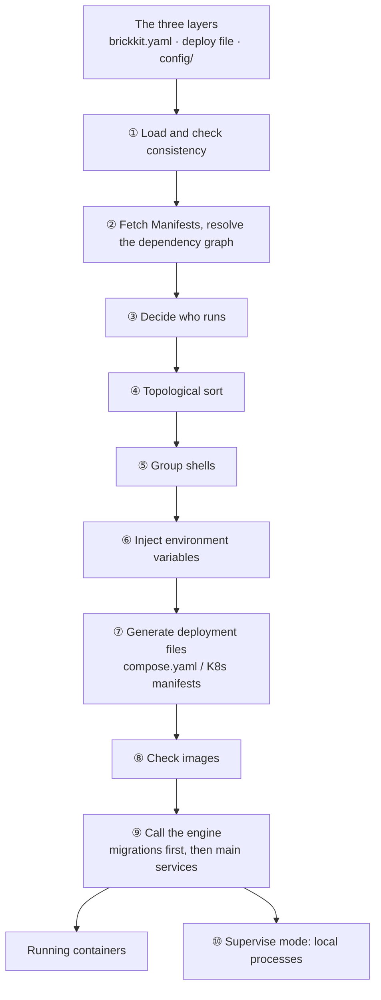

# BrickKit — part 4 of 10 (English)

Contains: docs/en/03-component-guide/08-component-doc-spec.md, docs/en/03-component-guide/09-multi-version-coexistence.md, docs/en/03-component-guide/10-git-distribution.md, docs/en/04-shell/README.md, docs/en/04-shell/01-shell-concept.md, docs/en/04-shell/02-json-injection.md, docs/en/04-shell/03-shell-declaration.md, docs/en/04-shell/04-members-management.md, docs/en/04-shell/05-shell-development.md, docs/en/04-shell/06-special-characters.md, docs/en/04-shell/07-shell-upgrade.md, docs/en/04-shell/08-shell-config.md, docs/en/05-migration/README.md, docs/en/05-migration/01-migration-service.md, docs/en/05-migration/02-env-passthrough.md, docs/en/05-migration/03-multi-version-chain.md, docs/en/05-migration/04-shell-interaction.md, docs/en/06-architecture/README.md, docs/en/06-architecture/01-pipeline-overview.md

File paths below are relative to the repository root, https://raw.githubusercontent.com/brickKit/brickKit/main/ ; links inside pages are relative to this file

Next: https://raw.githubusercontent.com/brickKit/brickKit/main/llms/en/05.md

---

> File: docs/en/03-component-guide/08-component-doc-spec.md

# A component's documentation

A component is read by three kinds of reader who want different things:

- **The projects that use it**, and the AI assistants writing code in them. They want to know what the component does,
  what to prepare, how to configure it and how to call it — without reading its source.
- **Whoever develops it**, very often an AI. It wants to find the code for a feature fast, run the tests, and know what
  not to break.
- **People on GitHub**, deciding whether to use it. They want a short answer and a pointer to the rest.

So a component carries one document per reader, plus the manifest. This page says what goes in each, how to write
them in more than one language, and what `brickkit lint` checks. `brickkit new` writes every one of them as a skeleton
(see [Generating a skeleton](../../docs/en/03-component-guide/04-new-and-skeleton.md)).

## Who reads what

| File | Required | Reader | Holds |
| --- | --- | --- | --- |
| `component.yaml` | ✅ | The CLI | Dependencies, config keys, ports, image — see [component.yaml](../../docs/en/03-component-guide/02-component-yaml-reference.md) |
| Contract files | When there is an interface | Callers and their AIs | Interfaces and event formats, registered under `artifacts` — see [Contracts and artifacts](../../docs/en/03-component-guide/06-artifacts-and-contracts.md) |
| `BRICKKIT.md` | ✅ | Projects using it; travels with every version | What it owns, what to prepare, how to configure and call it |
| `AGENTS.md` | ✅ | The AI developing it | Where the code is, how to build and test, what not to break |
| `CLAUDE.md` | ✅ | Claude Code | Exactly one line, `@AGENTS.md` |
| `README.md` | ✅ | People on GitHub | A short introduction and a map of the other files |
| `docs/` | Optional | Whoever goes deep | Design, numbered decisions, a data model |
| `CHANGELOG.md` | Optional, never checked | Anyone | Link it from the README if you keep one; projects see a version's [release notes](../../docs/en/03-component-guide/07-release-workflow.md#release-notes) on `upgrade`, not this file |

`CLAUDE.md` exists because Claude Code reads `CLAUDE.md` and other AI tools read `AGENTS.md`: one line imports the
other, and the content is written once.

## One fact, one home

The same fact written in two files is how documentation goes wrong: one copy gets updated, the other doesn't, and the
next reader trusts the stale one. So every fact has exactly one home, and every other file names it or links to it.

| Fact | Its home |
| --- | --- |
| Dependencies, config keys, ports, image, shell members | `component.yaml` |
| Interfaces and event formats | The contract files |
| What the component owns and doesn't; how to use, configure and prepare it | `BRICKKIT.md` |
| Where the code is; how to build, test and change it | `AGENTS.md` |
| Why it is designed this way, when that takes more than a few lines | `docs/` |
| What changed when | Git — commits, and each version's release notes in its tag (`release --notes`) |

Explaining a fact is not restating it. `BRICKKIT.md`'s Configuration section explains how to choose a value for a key
`component.yaml` declares; writing the key's type or default there again is restating it. And no document carries
history ("v1.0.12: …", "added in phase 3"): documents say what is true now, and what a version changed goes into its
release notes.

## `BRICKKIT.md`

It is the only document that leaves the repository. When a project adds the component, the CLI caches it next to the
component's `component.yaml` in that project — alone, without the repository around it. Six sections, in this order:

| Section | What goes in it |
| --- | --- |
| `Purpose` | One or two sentences on the problem it solves, then two short lists: what it **owns**, and what it **does not own** — each of those naming who does instead (another component, the caller, a person) |
| `Before you deploy` | What must exist before `brickkit up`: a database with its schema and role, a third-party account, a certificate. For each, who prepares it and how to check it's ready. "Nothing beyond the configuration below." when there's nothing |
| `Dependencies` | Each dependency by ID, what it is used for; for an optional one, what happens when it is absent |
| `Configuration` | What `configSchema` can't say: how to choose a value, what changing it does, which values go together. Every `required` key appears here |
| `Contracts` | Every file under `artifacts`, named as `artifacts` writes it, with the main interfaces it describes; the events it publishes; the events it consumes |
| `Shell declaration` | "Not a shell.", or the members it compiles in |

Two rules follow from where it is read:

- **No relative links.** In another project's cache, `[design](docs/design.md)` points at nothing. Name repository
  files as inline code (`api/openapi.yaml`); absolute URLs are fine.
- **The "does not own" list matters most.** A project that has only this cached file decides from it which component
  a new requirement belongs to (see [Judging and planning a requirement](../../docs/en/08-ai-guide/03-judging-a-requirement.md)).

## `AGENTS.md`

It is the developer's guide — what an AI working in this repository reads first, every session. It starts with the
component ID and a sentence pointing at `BRICKKIT.md` (for usage and boundaries) and `component.yaml` (for
dependencies and configuration). Then five sections:

| Section | What goes in it |
| --- | --- |
| `Code map` | Tables only. The first maps each path to what it owns; the second maps each feature to the file to start in. Paths in backticks; a directory ends in `/`. lint checks that each path exists: every backticked token in the first column of the first table (top-level files such as `main.go` and `Dockerfile` too), and elsewhere only tokens containing a `/` — a bare name such as `runMode` in another cell is a function or type, not a path. A token starting with `/` (an HTTP route such as `/api/v1/call`) is never a path; tokens with spaces, `*` or `://` are skipped |
| `Build and test` | The exact commands to build, test, run locally and check the contract, and what success looks like |
| `Design decisions` | Why it doesn't depend on some component; alternatives rejected and why. Longer reasoning goes in `docs/`, linked from here |
| `Pitfalls` | A table: never / symptom / why. Only what is specific to this component — rules for the whole project live in the project's `AGENTS.md` |
| `Before changing code` | Three to eight checks specific to this component |

At the end is a block maintained by brickkit, between `<!-- brickkit:managed:begin lang=… -->` and
`<!-- brickkit:managed:end -->`: the few platform rules every component author must keep. Only what is between those
markers is ever written by brickkit, and `brickkit skills status` says when that text is older than what this CLI
writes; `brickkit skills update` refreshes it.

`AGENTS.md` is written once, in the team's working language, and usually not translated: an AI reads either language,
and a second copy is a second thing to keep in step. A team that wants one for human reviewers can add
`AGENTS.<lang>.md`; lint checks it like any other translation, and the brickkit-maintained block stays in the
primary only. Two writing habits help an AI that may see only part of the file: no
"as mentioned above", and every "never" carries its symptom and its reason.

## `README.md`

A short page whose main job is to send people to the right file. Three sections:

| Section | What goes in it |
| --- | --- |
| `Use it in a project` | `brickkit add <id>@<version>` and `brickkit up`, then a pointer to "Before you deploy" |
| `Documentation` | A table: what you want to know → the file that answers it (`BRICKKIT.md`, the contracts, `component.yaml`, `AGENTS.md`) |
| `Development` | How to clone it and run it with its dependencies, then a pointer to `AGENTS.md` |

Its first line under the title is the same sentence as `metadata.description`. A project lists that sentence and the
optional `metadata.repository` (the component's repository or page) in the component table of its own `AGENTS.md`.

## `docs/`

Optional. Create it when the files above can't hold something: `docs/design.md` (revise it before the code when the
design changes), `docs/decisions/NNNN-<title>.md` (one decision per file; the number is its name — see
[Numbering decisions](../../docs/en/02-project-guide/01-init-and-project-creation.md#numbering-decisions)),
`docs/data-model.md`. Link every file in it from `AGENTS.md` or `README.md`. A component's design lives in the
component repository, so it travels with the component's versions.

## More than one language

Every document has one primary language, which the author chooses; any other language is a translation. There are
two ways to lay translations out, and lint checks both the same way:

| Layout | What it looks like | Suits |
| --- | --- | --- |
| Next to the file | `README.zh.md` beside `README.md`, `docs/design.zh.md` beside `docs/design.md` | A few translated files: `README`, `BRICKKIT` |
| A tree per language | `docs/en/…` and `docs/zh/…`, with the same relative paths in each | A whole `docs/` in two languages. With dozens of files, a translation beside every file doubles every directory; with a tree per language, each tree reads like a project written in one language |

- **Next to the file**: the file without a suffix is the primary; a translation has the language code before `.md`.
  A file and its translation are in the same directory, so their relative links are identical. The files at the
  root — `README`, `BRICKKIT`, `AGENTS` — are always translated this way.
- **A tree per language**: `docs/<primary language>/` is the primary tree, and each other `docs/<lang>/` is a
  translation of it — the file at the same relative path is the same page. The primary language is the `lang=` recorded
  in the block at the end of `AGENTS.md` (`en` when there is no block). lint reads `docs/` as trees only when that
  tree exists and at least one more `docs/<lang>/` sits beside it, so a `docs/api/` is never taken for a language.
  Choosing trees means the whole `docs/` is bilingual: **every page is in every tree.**
- Language codes are lowercase: `zh`, `ja`, `pt-br`. lint reads the part after the last dot before `.md` as the
  language, so `README.zh-CN.md` gets a warning (it should be `README.zh-cn.md`). This covers `README.*`,
  `BRICKKIT.*` and `AGENTS.*` at the root, and a file under `docs/` in a directory that has translations; elsewhere
  in `docs/` a name such as `v1.2-notes.md` is just a name.
- Translations are optional, per file. Typical: `README` and `BRICKKIT` translated (people and other teams read them),
  `AGENTS.md` and `docs/` not.
- **The primary file is right** when the two disagree. A change updates its translations in the same commit.
- **An AI reads one language — the primary.** Translations are for people; an AI that reads both versions of a page
  spends its context on the same facts twice.
- A file with translations starts with a line linking every language version, for example
  `[English](README.md) · [Chinese](README.zh.md)` — except `BRICKKIT*.md`, which has no relative links at all. Every
  version carries the whole line: with three languages, each of the three links the other two. In trees the links
  cross over: `docs/en/guide/setup.md` links `../../zh/guide/setup.md`.
- A translation has the same `##` sections as its primary, in its own language. The brickkit-maintained block at the end
  of `AGENTS.md` is in the primary only and isn't counted.
- The fixed sections are recognised by these headings, in English or Chinese — a Chinese translation uses the
  Chinese name exactly as written here, not a translation of its own:

| Document | English | Chinese |
| --- | --- | --- |
| `BRICKKIT.md` | `Purpose`, `Before you deploy`, `Dependencies`, `Configuration`, `Contracts`, `Shell declaration` | `组件定位`, `部署前准备`, `依赖说明`, `配置指南`, `契约索引`, `外壳声明` |
| A component's `AGENTS.md` | `Code map`, `Build and test`, `Design decisions`, `Pitfalls`, `Before changing code` | `代码地图`, `构建与测试`, `设计取舍`, `易错点`, `改代码前自查` |
| A project's `AGENTS.md` | `Overview`, `Conventions`, `Where to look`, `Pitfalls` | `项目概述`, `项目约定`, `查找路由`, `易错点` |
| `README.md` | `Use it in a project`, `Documentation`, `Development` | `在项目里使用`, `文档`, `开发` |

`brickkit add` caches every `BRICKKIT.<lang>.md` along with `BRICKKIT.md`, and `brickkit publish` uploads them. A
project's own documents follow the same rules — see
[The project's other documents](../../docs/en/02-project-guide/01-init-and-project-creation.md#the-projects-other-documents).

## What `brickkit lint` checks

`lint` checks what a program can decide for certain; whether the writing is good is for review. Every finding is a
warning — `up` and `release` never stop on documentation, and `lint --strict` turns warnings into a failure for a team
that wants its CI to hold the line. It runs on a component repository, on a workbench, and in a project on every
local-source component and on the project's own documents. An invalid `component.yaml` doesn't stop it: the documents are still checked, only the
comparison with the manifest (`DOC_OUT_OF_STEP`) is skipped.

| Code | Means |
| --- | --- |
| `DOC_FILE_MISSING` | A required document is absent |
| `DOC_SECTION_MISSING` | A fixed section is absent |
| `DOC_PATH_MISSING` | A Code map path no longer exists (which tokens count as paths: the `Code map` row above) |
| `DOC_LINK_BROKEN` | A relative link points at nothing |
| `DOC_LINK_NOT_PORTABLE` | `BRICKKIT.md` has a relative link, or a doc links out of the component |
| `DOC_OUT_OF_STEP` | `component.yaml` has a dependency, required key, contract file or shell member the doc doesn't mention where it belongs |
| `DOC_PLACEHOLDER` | `TODO`, `TBD`, `FIXME` (or their Chinese counterparts) is still in the text, outside code |
| `DOC_TRANSLATION_DRIFT` | A translation has no primary or a different number of sections, a page is missing from one of the `docs/<lang>/` trees, a language version doesn't link every other one, or a file's language suffix isn't a lowercase language code (`README.zh-CN.md`) |
| `AGENTS_BLOCK_MISSING` | `AGENTS.md` has no block maintained by brickkit |
| `CLAUDE_IMPORT_MISSING` | `CLAUDE.md` doesn't import `AGENTS.md` |

What each one asks you to do is in [Error codes](../../docs/en/06-architecture/09-error-codes.md#documentation-checks).

## A complete example

`demo/quote` returns a quotation prefixed with `demo/hello`'s greeting. Its repository:

```text
demo-quote/
├── component.yaml
├── BRICKKIT.md
├── AGENTS.md
├── CLAUDE.md
├── README.md
├── api/openapi.yaml
├── main.go
└── Dockerfile
```

`BRICKKIT.md`:

```markdown
# demo/quote

## Purpose

Returns a quotation each time, prefixed with demo/hello's greeting; used by the "quote of the day" at the top of the page.

Owns:
- choosing and formatting the quotation

Does not own:
- the greeting itself: demo/hello
- showing it on the page: the caller

## Before you deploy

Nothing beyond the configuration below.

## Dependencies

- demo/hello (required): supplies the greeting. When it's unreachable, the endpoint still answers, with the greeting replaced by "(demo/hello unreachable)".

## Configuration

| Variable | Meaning |
|---|---|
| QUOTE_PREFIX | The text in front of the quotation. To drop the prefix, set it to the empty string "" |

## Contracts

- `api/openapi.yaml`: `GET /api/v1/quote`, returning `{"greeting": "...", "quote": "..."}`. No events.

## Shell declaration

Not a shell.
```

`AGENTS.md`:

```markdown
# demo/quote

Returns a quotation prefixed with demo/hello's greeting. How to use it and its boundaries: BRICKKIT.md. Dependencies and configuration: component.yaml.

## Code map

| Path | Owns |
|---|---|
| `main.go` | The HTTP server, the quotation list, the call to demo/hello |
| `api/openapi.yaml` | The contract |

| Feature | Start here | Then |
|---|---|---|
| The quotation endpoint | `main.go` (`/api/v1/quote`) | `api/openapi.yaml` |

## Build and test

`go build ./...`; `go test ./...` prints `ok`. To run it with demo/hello: `brickkit up` in this directory (a focus run in a project, or the workbench).

## Design decisions

It degrades instead of failing when demo/hello is down: the quotation is the content, the greeting is decoration.

## Pitfalls

| Never | Symptom | Why |
|---|---|---|
| Check demo/hello in `/healthz` | demo/quote goes unhealthy whenever demo/hello restarts | A health check checks only its own process |

## Before changing code

1. Does the change alter `/api/v1/quote`'s response? Update `api/openapi.yaml` and BRICKKIT.md's Contracts in the same commit.
2. A new config key? Declare it in `configSchema` and explain it in BRICKKIT.md's Configuration.

<!-- brickkit:managed:begin lang=en -->
… written by brickkit …
<!-- brickkit:managed:end -->
```

`README.md`:

```markdown
# demo/quote

Returns a quotation each time, prefixed with demo/hello's greeting.

## Use it in a project

    brickkit add demo/quote@0.1.0
    brickkit up

Prepare first: see "Before you deploy" in BRICKKIT.md.

## Documentation

| To find out | Read |
|---|---|
| What it does and doesn't, how to configure it, what to prepare | BRICKKIT.md |
| Its interface | api/openapi.yaml |
| What it depends on (explained in BRICKKIT.md) | component.yaml |
| How to develop it | AGENTS.md |

## Development

Clone it, run `brickkit init` for a workbench and `brickkit up` to run it with demo/hello; then read AGENTS.md.
```

In the real file each name in the Documentation table is a relative link to that file.

Note the Configuration row in `BRICKKIT.md`: the empty string drops the prefix. `component.yaml` can say
`default: "Quote of the day: "`, but not that — which is exactly what a user most wants to know.

## How it reaches users

When a project `add`s or `fetch`es the component, the CLI takes `BRICKKIT.md` and every `BRICKKIT.<lang>.md` from the
version (a local source's directory, a git tag, or the market) and caches them at

```text
.brickkit/manifests/<scope>/<name>/<version>/BRICKKIT.md
```

The project's `AGENTS.md` ends with a component table maintained by brickkit: each component, its version, its
`metadata.description`, which docs it carries (`BRICKKIT.md +zh`) and its `metadata.repository`. That table is where an AI
in the project starts; it then reads only the `BRICKKIT.md` of the components the task touches. When a local source
holds that exact version, the copy in its source directory is the one being edited and the one to read.

The cache follows the version it came from: fetching the version again drops a cached translation the version no
longer has, and `docs.list` next to the files records which ones the cache holds. When the cache holds no record for a
component — it isn't cached on this machine, or an older CLI cached it — the table keeps the Docs cell it already had rather than guessing.

So the documents are part of the version, like the code. Working towards a new version is the normal way to change
them: bump `metadata.version` first, test it from the local source, `brickkit release` it — until then a machine
without the source has no such version and leaves its row as it is. What breaks is editing a version that is already
released: one version number then has two contents, the machine with the local source writes the new row into the
project's `AGENTS.md`, a machine that takes the version from its tag writes the old one back, and `brickkit skills
status` on each calls the other's block outdated. A released `BRICKKIT.md`, translation or `metadata.description`
changes in the next version.

`brickkit publish` uploads `BRICKKIT.md` and its translations with the version: at most 16 translations, each at most
256 KiB, all of them together at most 1 MiB. Resuming an interrupted publish compares every one of them with what the
draft registered and stops if any differs. A market too old to store translations publishes the version without them,
and `publish` warns.

---

> File: docs/en/03-component-guide/09-multi-version-coexistence.md

# Several versions side by side

## The service name carries the version

Every running component version has a **versioned service name**: the component ID with `/` and `.` turned into `-`,
followed by the exact version.

| Component version | Service name | The address others get |
| --- | --- | --- |
| `demo/hello@1.0.0` | `demo-hello-1-0-0` | `http://demo-hello-1-0-0:8080` |
| `demo/hello@1.1.0` | `demo-hello-1-1-0` | `http://demo-hello-1-1-0:8080` |

The address is exactly the same on Docker and on Kubernetes (it is both the Docker Compose service name and the Kubernetes
Service name). Two versions are two names, and DNS keeps them apart by nature: they run at the same time without clashing,
with no extra mechanism.

The address variable's **name** carries no version (`DEMO_HELLO_ENDPOINT`); its **value** does. A caller always knows
which version it talks to — there's no such thing as a quiet upgrade.

## When two versions appear

`demo/caller@1.0.0` declares a dependency on `demo/hello@1.0.0`, and `demo/quote@0.1.0` on `demo/hello@1.1.0`. With both
components in the same project, both versions of `demo/hello` are added — dependencies wanting different versions **isn't
an error**:

```yaml
# brickkit.yaml
components:
  - id: demo/hello
    version: 1.1.0
  - id: demo/quote
    version: 0.1.0
  - id: demo/hello
    version: 1.0.0
    requiredBy: [demo/caller]
```

The one without `requiredBy` is the **default version**; the one with `requiredBy` is a compatibility version "kept
because someone needs it", and it says who at a glance. `add` and `upgrade` maintain these markers: a compatibility version
nobody needs any more is cleared.

In the generated deployment file (an excerpt), each caller connects to the version it declared:

```text
  demo-caller-1-0-0:
      - DEMO_HELLO_ENDPOINT=http://demo-hello-1-0-0:8080
  demo-hello-1-0-0:
      - COMPONENT_VERSION=1.0.0
  demo-hello-1-1-0:
      - COMPONENT_VERSION=1.1.0
  demo-quote-0-1-0:
      - DEMO_HELLO_ENDPOINT=http://demo-hello-1-1-0:8080
```

## One config file per version

| File | Belongs to |
| --- | --- |
| `config/demo-hello.yaml` | The default version (1.1.0) |
| `config/demo-hello@1.0.0.yaml` | The compatibility version 1.0.0 |

The file without a version always follows the default version; when the default moves (`upgrade`), the config is carried
over by the migration rules, and an old version that is still depended on keeps its original config renamed with the
version (see [Upgrading and config migration](../../docs/en/02-project-guide/07-upgrade-and-migration.md)). Deploy files work the
same way: the entry with the bare ID (`- id: demo/hello`) is the default version, and every other version has its own
`id@version` entry.

## What a component author should know

- **Within one component's `dependencies`, a component ID can appear only once.** The address variable's name carries no
  version, so two versions would collide on the same variable. Versions side by side is a **project-level** capability:
  different components each depending on a different version.
- **Two versions may share one database.** Each runs its own migrations; whether the data layer stays compatible (does the
  old version accept the columns the new one added, can the new version read what the old one wrote) is the component
  author's responsibility. The migration state table's primary key should include a component identifier, or two
  components sharing a database overwrite each other's migration records.
- **Incompatible changes raise the major version.** Users decide whether they can upgrade by the version number; change
  the interface quietly in a patch release, and callers break without knowing why.

## When coexistence is needed, and when it isn't

Needed:

- **Different components depend on different versions**, and one of them hasn't caught up yet — coexistence is a buffer
  that gives it time to upgrade.
- **Gradual rollout**: the new version serves some callers first while the old one keeps serving the rest.

Not needed: once every caller has upgraded, the old version has no `requiredBy` left, and `upgrade` / `remove` clears it
naturally. Coexistence is a transition, not a goal — every extra version is another image, another config file, another
set of containers to look after.

---

> File: docs/en/03-component-guide/10-git-distribution.md

# Distributing through Git

## The idea

No dedicated server is needed: **components live in Git repositories, and a version is a Git tag.** The GitLab, Gitea or
GitHub organisation your company already has is a component source. Releasing is pushing a tag (`brickkit release`);
installing is fetching files by tag.

## How component addresses are derived

Users declare a Git install source in `brickkit.yaml`:

```yaml
sources:
  - name: company-git
    type: git
    baseUrl: https://git.example.com/components/
```

From then on each component's repository address is derived by rule, without configuring them one by one:

| Component | Repository |
| --- | --- |
| `demo/quote` | `https://git.example.com/components/demo-quote` |
| `erp/backend` | `https://git.example.com/components/erp-backend` |

A version maps to a tag: version `0.1.0` is tag `0.1.0` (no `v`). "The latest version" is the highest tag in exact-version
form; tags like `v1.0.0` or `latest` don't count as versions.

**When it can't be derived, name it.** For a repository in another organisation, a name that doesn't follow the rule, or a
component in a monorepo subdirectory, write `source` on that component's entry:

```yaml
components:
  - id: erp/backend
    version: 2.1.0
    source:
      type: git
      repo: https://git.example.com/platform/erp.git
      path: services/backend      # the component's subdirectory in the repository; the tag is then erp-backend/2.1.0
```

`source.type: local` points at a component directory on this machine instead (`path` relative to the project root); see
[Developing inside a component](../../docs/en/03-component-guide/05-local-dev-fractal.md).

## The cache: each repository cloned once

The CLI keeps a bare repository (Git data only, no working tree) per component repository in a **user-level** cache
directory, organised by the full repository address:

```text
~/.cache/brickkit/repos/
└── git.example.com/
    └── components/
        ├── demo-bus.git
        ├── demo-caller.git
        ├── demo-hello.git
        └── demo-quote.git
```

(On macOS it's `~/Library/Caches/brickkit/repos/`.) It's user-level rather than under each project's `.brickkit/` because
the same component repository is shared by many projects, and by the component's own workbench — kept per project, the
same repository would be cloned N times.

To get a component version's `component.yaml`, the CLI tries in order:

| Order | From | Network? |
| --- | --- | --- |
| 1 | The project's `.brickkit/manifests/` cache | No |
| 2 | This tag in the cached bare repository (`git show`) | No |
| 3 | `git fetch --tags`: the repository is there but lacks this tag | Incremental |
| 4 | `git clone --bare`: the repository was never cloned | A full clone |

So the first install needs the network, and after that the same version can be used offline at any time; a new version
only fetches the increment. A clone lands in a temporary directory first and is renamed when complete, so an interrupted
clone never leaves half a repository behind.

## Private repositories and authentication

**The CLI doesn't handle authentication.** It calls your system's `git`, using the credentials your `git` already has:

| Situation | What to set up |
| --- | --- |
| SSH addresses (`git@git.example.com:components/…`) | The matching key in `~/.ssh/`, added to the hosting platform |
| HTTPS addresses | A git credential helper (store, cache, osxkeychain, manager…) |
| CI | A token injected into the environment (`GIT_ASKPASS`, `.netrc`, or the CI platform's own credentials) |

Without credentials, the CLI lets `git` fail rather than stop and wait for a password — in CI that would hang the pipeline.
On failure, git's own words are passed on to you:

```text
❌ Failed to fetch component example/member
   Install source: company-git (git)
   Repository: git@github.com:brickkit-nonexistent-org/example-member
   Git error: ERROR: Repository not found.
      fatal: Could not read from remote repository.
      Please make sure you have the correct access rights
      and the repository exists.
   Component: example/member@0.1.0
   Suggestions:
   1. SSH: check that ~/.ssh/ holds the right key and that it is added to the repository host
   2. HTTPS: check that a git credential helper is configured (store, cache, osxkeychain, manager…)
   3. CI/CD: check that a token is injected (GIT_ASKPASS, .netrc or the CI system's credentials); a mistyped or missing repository fails the same way
```

When git never reached the remote at all (offline, an unresolvable host name), the suggestion is about the network
instead. How to tell the cases apart, and what to do in each: [Git authentication problems](../../docs/en/10-troubleshooting/04-git-auth-issues.md).

The platform stays out of credentials because git already solves this well: SSH, the many credential helpers, the ways CI
platforms inject tokens — each has a mature answer. A separate mechanism in the CLI would be one more thing to maintain,
and would never keep up with every hosting platform.

## How components are discovered

The platform has no registry and offers no search: where components are and which exist is a matter of convention and
documentation — for instance, keeping every component in the same Git organisation and listing them on the
organisation's page or an internal wiki, with each component's `BRICKKIT.md` saying what it is. When you need a searchable
catalog, a component market (`sources[].type: market`) is the other route.

---

> File: docs/en/04-shell/README.md

# Shells

A **shell** is a special kind of component: at build time it compiles the code of a few other components (its
**members**) into its own process, and when deployed, one container serves all of them. Other components keep calling the
members at their addresses, without knowing whether a container or a shell answers.

**When to use one:** there are many components and running each as its own process costs too much memory (JVMs especially:
an idle Spring Boot takes two or three hundred MB), or a few components call each other so often that you want to save the
network round trips.

**When not to:** members that need to scale separately, isolate failures separately, or are written in different
languages — all of that requires separate processes. A shell is a way of deploying, not a default: let components run on
their own first, and merge when there's a real need.

This module uses a real example: the shell `shop/shell` compiles in `shop/cart` (the cart) and `shop/stock` (the stock),
with `shop/order` running on its own outside.

| Page | What it covers |
| --- | --- |
| [01 The idea](../../docs/en/04-shell/01-shell-concept.md) | One process loading several modules; when it fits |
| [02 JSON config injection](../../docs/en/04-shell/02-json-injection.md) | How a shell gets each member's config and port |
| [03 Declaring a shell](../../docs/en/04-shell/03-shell-declaration.md) | What each of the three files says: "what it compiles in" vs. "what it hosts this time" |
| [04 Members](../../docs/en/04-shell/04-members-management.md) | Moving members in and out; start cycles created by merging, and `skipWaitFor`; which member fields don't apply |
| [05 Writing a shell](../../docs/en/04-shell/05-shell-development.md) | The shell's start-up code, how addresses are pointed at it, local integration |
| [06 Special characters](../../docs/en/04-shell/06-special-characters.md) | How multi-line secrets, quotes and `$` reach a member byte for byte |
| [07 Upgrading a shell](../../docs/en/04-shell/07-shell-upgrade.md) | How member versions line up with the shell's version; three ways out when they don't |
| [08 A shell's own config](../../docs/en/04-shell/08-shell-config.md) | The shell's own config next to its members' |

---

> File: docs/en/04-shell/01-shell-concept.md

# The idea

## One process, several modules

A shell isn't "several processes in one container". It is **one process** that loads several modules, each module being
one member component's code.

```text
Deployed on their own                      Deployed in a shell
┌──────────────┐ ┌──────────────┐          ┌──────────────────────────────┐
│ shop/cart    │ │ shop/stock   │          │ shop/shell (one process)     │
│ process :8081│ │ process :8082│    →     │   cart module   on :8081     │
└──────────────┘ └──────────────┘          │   stock module  on :8082     │
  two containers, two runtimes              └──────────────────────────────┘
                                             one container, one runtime
```

The shell listens for each member on **the member's own port**. So nothing changes for callers: `shop/order` still calls
`SHOP_STOCK_ENDPOINT`, only that address now points at the shell (see
[Writing a shell](../../docs/en/04-shell/05-shell-development.md#how-addresses-are-pointed-at-it)).

## A shell hosts several members; a member is in one shell at a time

In the deploy file, member entries are **nested under the shell's entry**:

```yaml
components:
  - id: shop/shell
    members:
      - id: shop/stock
      - id: shop/cart
  - id: shop/order
```

Each component version appears once in a deploy file, so a member can't belong to two shells at once — "where does it run
this time" has one answer. Another version of the same component can run on its own elsewhere (see
[Upgrading a shell](../../docs/en/04-shell/07-shell-upgrade.md)).

## Where it fits

- **Saving memory.** A process's memory floor is mostly decided by its language runtime: Go takes a dozen or so MB,
  Python / Node a few dozen, a JVM two or three hundred. Twenty Spring Boot components, each its own process, take four to
  nine GB idle; compiled into three or four shells, that's three or four runtimes.
- **Saving network round trips.** When members call each other very often, compiled into one process the shell can have
  them call each other in-process.

Consider the alternatives first: components written in Go or Rust are frugal already, and merging isn't worth it; for the
JVM, try GraalVM native images; components you don't need can be `mode: disable` in the deploy file and not run at all.

## Where it doesn't

- **Scaling separately.** Members in a shell can only scale with the shell.
- **Isolating failures separately.** One module that brings the process down takes every member in the shell with it.
- **Different languages.** The shell compiles members' code in, so members usually share the shell's language and runtime.

## What the platform does, what the shell's author does

| The platform | The shell's author |
| --- | --- |
| Works out which members this shell hosts this time, and encodes their config and ports into one JSON value for the shell | Reads the JSON, initialises the matching modules, listens on the members' ports |
| Points the addresses of members at the shell | Hands each request to the right module inside the process |
| Runs members' migrations separately, with each member's own image, before starting the shell | Doesn't run members' migrations inside the shell |
| Checks that the member versions compiled into the shell's image match the ones it hosts this time | States truthfully in `component.yaml` which members, at which versions, are compiled in |

The platform doesn't understand how a shell loads modules or routes requests inside — that's the shell's own code. The
platform only makes clear "which members, with what config, at which address".

---

> File: docs/en/04-shell/02-json-injection.md

# Config as JSON

Deployed on their own, members each get their own environment variables in their own container. Compiled into a shell
they share one process and one environment — so what happens when both members have a `LOG_LEVEL`? The platform's
answer: **members' config isn't spread into the shell's environment; it's packed into one JSON value**, one item per
member, and the items don't touch each other.

## Two reserved variables

The shell's container gets two extra variables:

| Variable | Holds |
| --- | --- |
| `BRICKKIT_SERVED_MEMBERS` | The service names of the members hosted this time, comma-separated: `shop-cart-0-1-0,shop-stock-0-1-0` |
| `BRICKKIT_SERVED_MEMBERS_CONFIG` | A JSON array with one item per member: its config and ports |

The `BRICKKIT_SERVED_MEMBERS_CONFIG` that `shop/shell` gets (formatted):

```json
[
  {
    "componentId": "shop/cart",
    "version": "0.1.0",
    "httpPort": 8081,
    "extraPorts": [],
    "config": {
      "SHOP_STOCK_ENDPOINT": "http://shop-shell-0-1-0:8082"
    }
  },
  {
    "componentId": "shop/stock",
    "version": "0.1.0",
    "httpPort": 8082,
    "extraPorts": [],
    "config": {
      "STOCK_WAREHOUSE": "Main warehouse"
    }
  }
]
```

## The fields of each item

| Field | Meaning |
| --- | --- |
| `componentId`, `version` | Which member, which version |
| `httpPort` | The main port in the member's own `component.yaml`: the shell listens on it for the member |
| `extraPorts` | The member's extra ports: `[{"name": "grpc", "port": 9090}]` |
| `config` | The environment variables the member would get deployed on its own: its config items, plus the addresses it depends on (`*_ENDPOINT`). `COMPONENT_ID` and `COMPONENT_VERSION` aren't here — they are `componentId` and `version` |

The values in `config` are **already evaluated**: `$var:` has been replaced by the shared variable's value, `${VAR}`
expanded, `file://` read into the file's contents. The shell uses them as they are, with no further substitution (why they
are evaluated beforehand: [Special characters](../../docs/en/04-shell/06-special-characters.md)).

## How the shell uses it

1. Read `BRICKKIT_SERVED_MEMBERS_CONFIG` and parse it into an array.
2. For each item, find the module compiled in for it and initialise it with that item's `config` — not with the shell's
   own environment.
3. Listen on `httpPort` (and each of `extraPorts`) for it.

```go
type member struct {
	ComponentID string            `json:"componentId"`
	Version     string            `json:"version"`
	HTTPPort    int               `json:"httpPort"`
	Config      map[string]string `json:"config"`
}

var members []member
if err := json.Unmarshal([]byte(os.Getenv("BRICKKIT_SERVED_MEMBERS_CONFIG")), &members); err != nil {
	log.Fatalf("BRICKKIT_SERVED_MEMBERS_CONFIG: %v", err)
}
```

A module that used to read its config with `os.Getenv("STOCK_WAREHOUSE")` reads it from the table handed to it once it's
compiled into a shell. The least work is for the module to take a config table from the start: deployed on its own,
`main` fills the table from environment variables; inside a shell, the shell fills it from the JSON.

## Zero members

A shell may host no members at all this time (they were all moved out). `BRICKKIT_SERVED_MEMBERS` is then the **empty
string**, and `BRICKKIT_SERVED_MEMBERS_CONFIG` is `[]` — "the variable exists, and is empty". The shell should then
initialise no modules. Never treat it as "the variable isn't there" and fall back to "start every module compiled in": the
two cases mean opposite things.

## Why nothing collides

Each member's config sits in its own item: `shop/cart`'s `LOG_LEVEL` and `shop/stock`'s `LOG_LEVEL` are two keys in two
different objects, and neither can overwrite the other. The shell's own config stays ordinary environment variables on the
shell's container (see [The shell's own config](../../docs/en/04-shell/08-shell-config.md)), and doesn't collide with the JSON either.

## Where it's kept

The JSON holds members' whole config, possibly including secrets, so it's treated as a secret: on Docker it's written to
`.brickkit/generated/env/<shell service name>.env` (file mode 0600, referenced through `env_file`); on Kubernetes it goes
into the generated Secret. It never appears in plain text in `compose.yaml` or a Deployment.

---

> File: docs/en/04-shell/03-shell-declaration.md

# Declaring a shell

Three files each say one thing about a shell:

| File | Says | Written by |
| --- | --- | --- |
| The shell's `component.yaml`: `shell.members` | **What the shell is**: which members were compiled in at build time, each at which exact version | The shell's author |
| `brickkit.yaml`: `kind: shell` | This component is a shell (a marker) | The CLI |
| The deploy file: `members` under the shell's entry | **What it hosts this time**: which members run inside the shell this run | The project |

The platform only checks that the three say the same thing; it never works out on your behalf how things should run.

## What the shell is: `shell.members`

```yaml
# shell/shop/shell/component.yaml
metadata:
  id: shop/shell
  name: Shop shell
  version: 0.1.0
  description: Compiles the cart and the stock into one process

shell:
  members:
    - shop/cart@0.1.0
    - shop/stock@0.1.0
```

Writing `shell.members` makes the component a shell. Each member is written with an **exact version**, the same way as in
`dependencies`: those versions' code is what's compiled into the shell's image, and it can't load an arbitrary version
when it starts — BrickKit supports only shells that compile their members in at build time.

When `brickkit build` builds the shell's image, it records the member versions compiled in as an image label:

```text
io.brickkit.shell.members = shop/cart@0.1.0,shop/stock@0.1.0
```

`up` checks it before using a shell image built on this machine; see
[Upgrading a shell](../../docs/en/04-shell/07-shell-upgrade.md#when-the-image-and-the-declaration-dont-match).

## What it hosts this time: `members` in the deploy file

```yaml
# deploy.yaml
components:
  - id: shop/shell
    members:
      - id: shop/stock
      - id: shop/cart
  - id: shop/order
```

Member entries are nested under the shell's entry, one level only. They are full deploy entries and can carry `mode`,
`skipWaitFor` and the other fields. A bare ID means the default version; `id@version` means that version.

**Membership has this one source only.** The shell's `component.yaml` says who it **can** host; the deploy file says who
it **does** host this time. A shell with five modules compiled in, in a project that uses two of them, gets just those two
under it — the other three aren't initialised this time.

## `kind: shell`

The shell's entry in `brickkit.yaml` carries `kind: shell`:

```yaml
components:
  - id: shop/shell
    version: 0.1.0
    kind: shell
```

The CLI writes it when it `add`s the shell. `lint`, `up` and `graph` all check that it agrees with the shell's
`component.yaml`, and that every member placed under the shell really is compiled into it. It's only a marker, so that
someone reading `brickkit.yaml` sees at a glance which component is a shell; it doesn't decide who is inside the shell.

## Why it's split this way

- **Being able to isn't the same as doing.** The same shell image can host different combinations of members in different
  projects; writing "who it hosts" into the shell's `component.yaml` would allow only one.
- **"Which version was compiled in" has to be said by the shell itself.** Only whoever built the image knows what code is
  in it; the project can only decide whether and how to use it.
- **Each fact is written in one place.** Membership only in the deploy file, compiled-in versions only in the shell's
  `component.yaml`. A fact written in two places sooner or later disagrees with itself.

When the three disagree, what gets generated is certainly wrong — the image doesn't contain the member's code at all, it
has another version compiled in, or the shell doesn't know it's a shell. So `up` fails loudly before generating anything,
instead of letting it show up only once the containers are running.

---

> File: docs/en/04-shell/04-members-management.md

# Managing members

## Joining a shell

When you `add` a shell, the members compiled into it are added to the project at the versions the shell declares, and in
the deploy file they are **nested straight under the shell's entry**:

```bash
brickkit add --local
```

```text
➕ Adding shop/cart@0.1.0, shop/shell@0.1.0, shop/stock@0.1.0
   ✅ shop/stock@0.1.0 (in shell shop/shell)
   ✅ shop/cart@0.1.0 (in shell shop/shell)
   ✅ shop/shell@0.1.0
📝 Written: brickkit.yaml, deploy.yaml
📝 Config skeletons: config/shop-stock.yaml
```

```yaml
# deploy.yaml
components:
  - id: shop/shell
    members:
      - id: shop/stock
      - id: shop/cart
```

For a component that was in the project before a shell able to host it came along, `add` **doesn't** move it into the
shell for you, and doesn't ask whether to: whether it runs inside a shell is a decision about how you deploy — saving memory
or scaling separately, merging in this environment or not — that only you can make, and it may differ per deploy file. To
put it in, move its entry under the shell entry's `members`.

## Moving out of a shell

Move the member's entry from under `members` to the top level:

```yaml
components:
  - id: shop/shell
    members:
      - id: shop/cart
  - id: shop/stock          # runs on its own
```

On the next `up`, `shop/stock` runs in its own container from its own image, the shell hosts only `shop/cart`, and the
addresses pointing at `shop/stock` go back to its own service name. **Not a word of its config changes**:
`config/shop-stock.yaml` says which values it needs, which has nothing to do with where it runs. The deploy file's `members`
decides only "how it runs"; it doesn't change the config itself.

By the same reasoning, writing a member's entry as `mode: disable` in a deploy file means the shell doesn't host it this
time; writing it as `mode: debug` or `mode: local` in `deploy.local.yaml` runs it as a process on your machine this time,
and the shell doesn't host it either (see [Local debugging](../../docs/en/02-project-guide/03-local-debug-workflow.md#debugging-a-shell-member)).

## When the shell doesn't run

When the shell is turned off with `mode: disable`, or doesn't start this time, the members under it don't disappear with
it — they **fall back to standalone components**, each deployed by its own entry.

## Removing a shell

```bash
brickkit remove shop/shell
```

The shell's entry is deleted, the members it hosted move back to the top level of the deploy file and run on their own,
and their config is kept.

## Fields that do nothing for a member in a shell

A member entry is a full deploy entry, but while a shell hosts it, the fields describing "how its own container is
deployed" **do nothing, without a warning**: `expose`, `exposePort`, `hostname`, `tlsSecret`, `replicas`, `resources`,
`serviceAccountName`, `labels`. It has no container of its own this time, so there's nowhere for them to apply. Keeping
them on the entry is useful: when the shell doesn't run and the member falls back to a standalone component, they take
effect.

Likewise, the `healthCheck` in a member's `component.yaml` isn't used inside a shell — what's health-checked is the shell's
process, with the shell's own `healthCheck`. A member's port can't be opened to the outside on its own while it's inside a
shell; a member that needs its own external exposure shouldn't go into a shell.

## Start cycles caused by merging, and `skipWaitFor`

There's no cycle between the components, yet putting them in a shell can create one. `shop/cart` (in the shell) depends on
`shop/order` (outside), and `shop/order` depends on `shop/stock` (in the shell):

```text
shop/cart ──→ shop/order ──→ shop/stock
(in shell)    (outside)      (in shell)
```

The shell starts as one unit: it inherits every member's dependencies, so the shell waits for `shop/order`; whatever
depends on a member depends on the shell, so `shop/order` waits for the shell. On Docker Compose that's a wait cycle that
can never start, and `up` stops it before generating anything:

```text
❌ Error: running the members inside shell shop/shell@0.1.0 makes it wait for a component that in turn waits for the shell
   Dependency: shop/order@0.1.0 → shop/stock@0.1.0 (in shell shop/shell@0.1.0)
   Dependency: shop/cart@0.1.0 (in shell shop/shell@0.1.0) → shop/order@0.1.0
   Reason: No component requires another in a loop, but the shell container starts as one unit: it inherits every member's dependencies, and whatever depends on a member depends on the shell. With Docker Compose this becomes a depends_on cycle that can never start
   Suggestions:
   1. Put the component in the middle into the same shell too (nest its entry under the shell), or take one of these members out of the shell (move its entry to the top level)
   2. Or make one of these dependencies optional (optional: true) in its component.yaml: an optional dependency doesn't constrain start order
   3. Or accept the cost: in the deploy file, write skipWaitFor: [shop/order] on the entry of shop/cart@0.1.0. It then starts without waiting for shop/order and must retry until it is ready
```

The first two ways out change the structure; the third keeps the structure and removes one wait:

```yaml
components:
  - id: shop/shell
    members:
      - id: shop/stock
      - id: shop/cart
        skipWaitFor: [shop/order]
  - id: shop/order
```

```text
📋 Start order (topological sort):
   1. shop-shell-0-1-0  no dependencies  (hosts shop/stock@0.1.0, shop/cart@0.1.0; does not wait for shop/order@0.1.0)
   2. shop-order-0-1-0  ← depends on 1
```

`skipWaitFor` removes only **the wait at start-up**: the shell starts without waiting for `shop/order`. Connections are
unaffected — `shop/cart` still gets `SHOP_ORDER_ENDPOINT` and still reaches it.

**Whoever writes it pays the cost.** When the shell starts, `shop/order` may not be ready yet, so `shop/cart`'s code must
retry: code that exits when it can't connect during initialisation keeps restarting here. Make sure your member can do
that before writing it.

The rules:

- What's listed must be a real **required dependency** of this component version — a misspelled name, an optional
  dependency (never waited for anyway), or a component it doesn't depend on at all is an error, so that you don't believe a
  wait was removed when it wasn't.
- When the skipped dependency is in the same shell, the call never leaves the process and there's no wait to begin with;
  on Docker / Podman writing it gets a warning.
- On Kubernetes, Pods don't wait for each other at start, so there is no wait to skip. `up` warns for each entry that
  has it — `shop/cart@0.1.0 has skipWaitFor, but Pods on Kubernetes don't wait for each other at start: it has no
  effect here` — and its start order has no "does not wait for" notes. The entry isn't refused: the same deploy file
  pointed back at Docker / Podman makes it work again.
- A component running as a process on this machine (or inside a shell that runs as one) has no `depends_on` either;
  `up` warns that its `skipWaitFor` has no effect this time.
- In both of those cases a cycle caused by merging isn't stopped: with no waits at start, nothing deadlocks.

---

> File: docs/en/04-shell/05-shell-development.md

# Writing a shell

## Start from the skeleton

```bash
brickkit new shop/shell --shell
```

```text
✅ Component skeleton generated: shop/shell
   📄 shell/shop/shell/component.yaml
   📄 shell/shop/shell/BRICKKIT.md
   📄 shell/shop/shell/AGENTS.md
   📄 shell/shop/shell/CLAUDE.md
   📄 shell/shop/shell/README.md
```

A shell is written under the project's `shell/` (the local install source `local-shells`): a shell is usually a project's
own code, deciding "which components this project merges", and it's committed with the project. The skeleton's
`shell.members` carries a placeholder member to replace:

```yaml
shell:
  # TODO: the members this shell compiles in, each at its exact version (replace the placeholder)
  members:
    - example/member@0.1.0
```

Replace it with the members really compiled in:

```yaml
shell:
  members:
    - shop/cart@0.1.0
    - shop/stock@0.1.0
```

**What's compiled in is not what's hosted.** `shell.members` says what the shell's image contains, so it lists at least
one member: `members: []` is `MANIFEST_INVALID` in `lint` and `add`, because a shell with nothing compiled in has no
reason to exist. Which of those members run inside it this time is a different fact, chosen in the deploy file by
nesting their entries under the shell's — and that may be none, in which case the shell starts with
`BRICKKIT_SERVED_MEMBERS` empty and `BRICKKIT_SERVED_MEMBERS_CONFIG` as `[]` (see
[Config as JSON](../../docs/en/04-shell/02-json-injection.md)).

So a new shell joins the project together with its first member, not before it: make that member work and build its
image, put it in `shell.members` in place of the placeholder, then `brickkit add` the shell (which writes the members in
for you). Until then the shell's skeleton stays out of `brickkit.yaml` — and `brickkit build`, which builds only
components the project has, doesn't know it yet.

The shell itself is an ordinary component: it has its own `deployment`, `healthCheck`, image and config.

It has the same documents as any component, too. Its `BRICKKIT.md` has the usual six sections; the last one, Shell
declaration, lists the members compiled in, each at its exact version, kept in step with `shell.members`. The skeleton
starts it with the placeholder member:

```markdown
## Shell declaration

This component is a shell. Members compiled in (keep in step with shell.members in component.yaml):

- `example/member@0.1.0` <!-- TODO: placeholder: what each member does and what it needs from the shell -->
```

Replace it along with `shell.members`, saying for each member what it does and what it needs from the shell. A member in
`shell.members` that the section doesn't mention is reported by `brickkit lint` as `DOC_OUT_OF_STEP`.

## The start-up code

When a shell starts it does four things: read `BRICKKIT_SERVED_MEMBERS_CONFIG`, find the module compiled in for each item,
initialise it with that item's config, and listen on that item's port for it. The whole of `shop/shell`:

```go
// shop/shell: a shell that compiles shop/cart and shop/stock into one process.
//
// A real shell would import the members' code; to keep it short, the two modules' handlers are written here in the shell.
package main

import (
	"encoding/json"
	"fmt"
	"log"
	"net/http"
	"os"
)

// member is one item of BRICKKIT_SERVED_MEMBERS_CONFIG.
type member struct {
	ComponentID string            `json:"componentId"`
	Version     string            `json:"version"`
	HTTPPort    int               `json:"httpPort"`
	Config      map[string]string `json:"config"`
}

// modules are the modules compiled into this shell: component ID → build its HTTP handler from the member's own config.
var modules = map[string]func(cfg map[string]string) http.Handler{
	"shop/stock": func(cfg map[string]string) http.Handler {
		mux := http.NewServeMux()
		mux.HandleFunc("/api/v1/stock", func(w http.ResponseWriter, _ *http.Request) {
			json.NewEncoder(w).Encode(map[string]any{"sku": "A1", "count": 42, "warehouse": cfg["STOCK_WAREHOUSE"]})
		})
		return mux
	},
	"shop/cart": func(cfg map[string]string) http.Handler {
		mux := http.NewServeMux()
		mux.HandleFunc("/api/v1/cart", func(w http.ResponseWriter, _ *http.Request) {
			var s map[string]any
			if resp, err := http.Get(cfg["SHOP_STOCK_ENDPOINT"] + "/api/v1/stock"); err == nil {
				_ = json.NewDecoder(resp.Body).Decode(&s)
				resp.Body.Close()
			}
			json.NewEncoder(w).Encode(map[string]any{"items": []string{"A1"}, "stock": s})
		})
		return mux
	},
}

func main() {
	var members []member
	if err := json.Unmarshal([]byte(os.Getenv("BRICKKIT_SERVED_MEMBERS_CONFIG")), &members); err != nil {
		log.Fatalf("BRICKKIT_SERVED_MEMBERS_CONFIG: %v", err)
	}
	for _, m := range members {
		build, ok := modules[m.ComponentID]
		if !ok {
			log.Fatalf("this shell has no module %s", m.ComponentID) // not among the members compiled in: fail loudly
		}
		addr := fmt.Sprintf(":%d", m.HTTPPort) // listen on the member's own port for it
		go func(h http.Handler) { log.Fatal(http.ListenAndServe(addr, h)) }(build(m.Config))
		log.Printf("serving %s@%s on %s", m.ComponentID, m.Version, addr)
	}
	http.HandleFunc("/healthz", func(w http.ResponseWriter, _ *http.Request) { w.Write([]byte("ok")) })
	log.Fatal(http.ListenAndServe(":8080", nil))
}
```

Built and started, the shell logs:

```text
shop-shell-0-1-0-1  | 2026/09/29 22:58:47 serving shop/cart@0.1.0 on :8081
shop-shell-0-1-0-1  | 2026/09/29 22:58:47 serving shop/stock@0.1.0 on :8082
```

A few things to do exactly this way:

- **Each module uses its own item's `config`**, never the shell process's environment variables — members' config isn't
  there.
- **Fail at once when the JSON names a member the shell didn't compile in.** It means the declaration and the image
  disagree; skip it quietly, and callers get an address pointing at a service that doesn't exist.
- **The health check checks only the shell's process itself.** A module that fails to initialise should make the whole
  shell fail to start, rather than report healthy with a dead module inside.

## How addresses are pointed at it

Callers don't know the other end is a shell. The platform connects the addresses for it in two places:

**The addresses others get point at the shell.** `shop/order`, outside the shell, depends on `shop/stock` and gets:

```text
      - SHOP_STOCK_ENDPOINT=http://shop-shell-0-1-0:8082
```

The same holds between members inside the shell: the `SHOP_STOCK_ENDPOINT` that `shop/cart` gets in the JSON is also
`http://shop-shell-0-1-0:8082`. The port is the member's own port — exactly where the shell listens for it.

**Members' service names resolve to the shell too.** On Docker the shell's container carries every member's service name
as a network alias:

```yaml
    networks:
      brickkit-net:
        aliases:
          - shop-cart-0-1-0
          - shop-stock-0-1-0
```

On Kubernetes each hosted member gets a Service of its own name that selects the shell's Pod. Either way, whatever
addresses a member by its service name — another container, a seed script, a cross-component test — reaches the shell
without a change.

**How requests are routed inside the process is the shell's own business.** Which module a request gets once it reaches
one of the shell's ports, whether to split further by path or host name — the platform stays out of it. The platform only
guarantees a request reaches the right port of the shell; whether the shell uses one port per module or one port routed by
path is the shell author's decision.

**Ports must not clash.** The shell's own port and every member's port end up listening in the same container (or Pod), so
the platform checks them before generating anything:

```text
❌ Error: two components on shell shop/shell@0.2.0 both want port 8082
   Held by: Component shop/cart@0.1.0
   Held by: Component shop/stock@0.2.0
   Suggestion: These components all end up running in the same shell container/Pod, so ports must not collide
```

## Members' migrations don't run in the shell

When a member declares `migration.command`, the platform runs its migration separately, with **the member's own image** and
the member's own config, and starts the shell only once it succeeded:

```yaml
  shop-shell-0-1-0:
    depends_on:
      shop-stock-0-1-0-migration:
        condition: service_completed_successfully
```

So the shell needn't know how to migrate each member; and every member **must have its own image** (`deployment.image` or
`deployment.build`), even if it always runs in a shell. More in
[Migrations and shells](../../docs/en/05-migration/04-shell-interaction.md).

## Developing it locally

A shell is a component too and is developed the same way: create a workbench with `brickkit init` in the shell's
directory, or write the shell's entry in the project as `mode: debug` / `mode: local` so it runs as a process on this
machine (see [Developing inside a component](../../docs/en/03-component-guide/05-local-dev-fractal.md)).

A shell running as a process on this machine loads the members' **code in their local repositories** (the clones under
`components/`). So `up` checks a chain: the member versions the shell hosts this time equal the versions the shell's
`component.yaml` declares as compiled in; when a member has a local repository, the version in that repository's
`component.yaml` must be exactly that one too, and it must be the member's default version. When they don't match it fails,
suggesting `brickkit upgrade <member>@<repository version>` or checking out the matching tag in the repository — rather
than letting you debug code that doesn't match the declaration.

---

> File: docs/en/04-shell/06-special-characters.md

# Special characters

## The problem

Members' config goes into one JSON string, handed to the shell as one environment variable. A config value can hold
anything: a multi-line PEM private key, quotes, backslashes, `$`. If the platform just wrote `${VAR}` into the JSON as it
is and left it to Docker Compose to substitute at start-up, Compose would do **a plain-text substitution that knows nothing
about JSON**: substitute a value with a quote or a newline, and the JSON breaks. The shell fails to parse it at start-up —
and it only shows up at run time.

## What the platform does

**Evaluate first.** When generating the deployment files, the CLI works out the value of every member's config:

| Written as | At generation time |
| --- | --- |
| A literal | Kept as it is |
| `$var:NAME` | Replaced by the shared variable's value |
| `${VAR}` | Expanded from the process environment, then the project root's `.env`; if it isn't found, it fails loudly |
| `file://path` | Read into the file's contents |
| `{ existingSecret, key }` | Refused: the value lives only in the cluster, the CLI can't read it, and the JSON needs the value |

**Then encode it as JSON.** The evaluated values are encoded by JSON's rules: quotes, backslashes and newlines are all
escaped.

**Then escape once more for where it lands.** On Docker the JSON goes into an env file with mode 0600, with `$` written as
`$$` so that Compose substitutes nothing in it; on Kubernetes it goes into the generated Secret.

## An example

`shop/stock`'s warehouse name is kept in a file, holding quotes, a `$` and two lines:

```text
Warehouse "No. 1"
Price $5
```

```yaml
# config/shop-stock.yaml
STOCK_WAREHOUSE: file://.secrets/warehouse.txt
```

In the shell's env file:

```text
BRICKKIT_SERVED_MEMBERS_CONFIG="[{\"componentId\":\"shop/cart\",\"version\":\"0.1.0\",\"httpPort\":8081,\"extraPorts\":[],\"config\":{\"SHOP_ORDER_ENDPOINT\":\"http://shop-order-0-1-0:8083\",\"SHOP_STOCK_ENDPOINT\":\"http://shop-shell-0-1-0:8082\"}},{\"componentId\":\"shop/stock\",\"version\":\"0.1.0\",\"httpPort\":8082,\"extraPorts\":[],\"config\":{\"STOCK_WAREHOUSE\":\"Warehouse \\\"No. 1\\\"\\nPrice $$5\\n\"}}]"
```

The value the `shop/stock` module in the shell gets is the file's contents, byte for byte:

```json
{"count":42,"sku":"A1","warehouse":"Warehouse \"No. 1\"\nPrice $5\n"}
```

## Values JSON can't carry: fail loudly

JSON carries only text. When a value isn't valid UTF-8 (a binary file, say), encoding would silently replace the invalid
bytes with the replacement character — and the member would get an altered value. The platform stops it at generation
time:

```text
❌ Error: config item STOCK_WAREHOUSE of shell member shop/stock@0.1.0 is not valid UTF-8 text
   Reason: JSON can only carry text; binary bytes would be replaced silently
   Suggestion: Store binary content base64-encoded and decode it in the component
```

`lint` runs the same check (a referenced file or variable that can't be found is reported under `--strict`), so this kind
of problem is caught in CI, before any deployment.

Evaluating first has one consequence: on Docker, `${VAR}` in a shell member's config is also looked up **when the CLI
runs**, not when `docker compose` starts — the environment that runs `brickkit up` has to hold those variables.

---

> File: docs/en/04-shell/07-shell-upgrade.md

# Upgrading a shell

## The shell's version decides the members' versions

A shell's image has the code of one specific version of each member compiled in. So "which version of a member does the
shell host this time" isn't something to pick freely: it has to be the version written in `shell.members` of the shell's
`component.yaml`.

The platform only **checks**; it never works it out for you. The deploy file and `brickkit.yaml` say which version is
hosted this time, the shell's `component.yaml` says which version is compiled in, and when the two disagree it's an error.

## Upgrading the shell: switch to the set the new shell compiles in

`shop/shell@0.2.0` compiles in `shop/stock@0.2.0`:

```yaml
metadata:
  id: shop/shell
  name: Shop shell
  version: 0.2.0
  description: Compiles the cart and the stock into one process

shell:
  members:
    - shop/cart@0.1.0
    - shop/stock@0.2.0
```

```bash
brickkit upgrade shop/shell
```

```text
   ⬆️  shop/shell: 0.1.0 → 0.2.0
   ⬆️  shop/stock: 0.1.0 → 0.2.0
   ✅ shop/stock@0.1.0 (requiredBy: shop/cart, shop/order)
📝 config/shop-stock.yaml
   Kept as written: STOCK_WAREHOUSE
📝 config/shop-shell.yaml
🗄️  Config archived: config/shop-shell.yaml → config/.archive/shop-shell@0.1.0.yaml
📝 Written: brickkit.yaml, deploy.yaml
```

Upgrading a shell is switching to the set of member versions the new shell compiles in. `shop/stock@0.1.0` is still
depended on by other components (`shop/cart` and `shop/order` both declare `shop/stock@0.1.0`), so it stays, and runs on
its own at the top level; an old version nobody needs any more would be removed. Each config file follows its version, as
in any upgrade: `config/shop-stock.yaml` is migrated to `shop/stock@0.2.0` and the kept old version gets its own
`config/shop-stock@0.1.0.yaml`; the shell's own config is migrated to 0.2.0, and the 0.1.0 file is archived into
`config/.archive/`, because no `shop/shell@0.1.0` is left. The deploy file changes with it:

```yaml
components:
  - id: shop/shell
    members:
      - id: shop/stock
      - id: shop/cart
        skipWaitFor: [shop/order]
  - id: shop/order
  - id: shop/stock@0.1.0
```

Fields you wrote on member entries (`mode`, `skipWaitFor`…) are kept. Build the new shell's image and `up`:

```text
📋 Start order (topological sort):
   1. shop-stock-0-1-0  no dependencies
   2. shop-order-0-1-0  ← depends on 1
   3. shop-shell-0-2-0  ← depends on 1  (hosts shop/stock@0.2.0, shop/cart@0.1.0; does not wait for shop/order@0.1.0)
```

A shell can have only one version in `brickkit.yaml`: with two versions of the same shell hosting members at once, who
hosts whom would be unclear.

## Upgrading only a member

Upgrading only a member (`brickkit upgrade shop/stock`) leaves the shell alone: the shell's image still holds the old
version's code. So the old version stays with a `requiredBy` (the shell is on the list of those who need it), the member
entry under the shell is pinned to the old version, and the new default version runs on its own at the top level:

```text
   ⬆️  shop/stock: 0.1.0 → 0.2.0
   ✅ shop/stock@0.1.0 (requiredBy: shop/cart, shop/order, shop/shell)
```

```yaml
components:
  - id: shop/shell
    members:
      - id: shop/stock@0.1.0
      - id: shop/cart
        skipWaitFor: [shop/order]
  - id: shop/order
  - id: shop/stock
```

When the two versions share one database, whether the data layer stays compatible is for the member to guarantee (see
[Several versions side by side](../../docs/en/03-component-guide/09-multi-version-coexistence.md)). **After upgrading, check
compatibility between the members yourself**: members in a shell call each other in-process, and the platform can't know
whether `shop/cart@0.1.0` works with a newer version of the stock module.

## Three ways out when versions don't match

Editing the deploy file by hand, you may have a shell host a version it doesn't compile in — for instance, by swapping the
two `shop/stock` entries above:

```text
❌ Error: the member versions this run hosts in a shell differ from the ones its component.yaml says are compiled in
   File: deploy.yaml
   components[0].members[0]: shell shop/shell@0.1.0 contains shop/stock@0.1.0, but this run hosts shop/stock@0.2.0
   Suggestions:
   1. Upgrade shop/shell to a version whose component.yaml lists shop/stock@0.2.0 under shell.members
   2. Move the entry of shop/stock out of the members of shop/shell to the top level of the deploy file, so it runs on its own
   3. Keep both versions: brickkit.yaml already keeps the version compiled into the shell, so swap the two deploy entries: change the member entry under shop/shell to `- id: shop/stock@0.1.0` and the entry at components[2] to `- id: shop/stock`; shop/stock@0.2.0 then runs on its own
```

| Way out | Fits when |
| --- | --- |
| Upgrade the shell | There's already a shell version that compiles in the new version |
| Move the member out of the shell | It's fine not to merge this member for now |
| Keep both versions | The old version keeps running in the shell, the new one runs on its own, until the shell catches up |

The third one spells out exactly what to change; make those edits and `up` passes.

## When the image and the declaration don't match

Change `shell.members` in the shell's `component.yaml` without rebuilding the shell's image, and the image on this machine
still holds the old members' code. `brickkit build` records the member versions compiled in as an image label when it
builds a shell's image, and `up` checks it before using a shell image built on this machine:

```text
❌ Error: the local image of shell shop/shell@0.2.0 contains other member versions than its component.yaml declares
   Image: shop-shell:0.2.0
   Members in the image: shop/cart@0.1.0,shop/stock@0.1.0
   Members declared in component.yaml: shop/cart@0.1.0,shop/stock@0.2.0
   Suggestion: Rebuild the shell image: brickkit build shop/shell@0.2.0 --force
```

Better still: when the members a shell compiles in change, raise the shell's version. For a released shell version,
`component.yaml`, tag and image agree by construction. A shell image without this label (built by hand, or a third-party
image) can't be checked, and `up` only warns.

---

> File: docs/en/04-shell/08-shell-config.md

# The shell's own config

## A shell is a component too

A shell has config of its own: a log level, its own connection pool, its own external port. Like any component, it
declares a `configSchema` in `component.yaml`, and the project fills in values in `config/<shell>.yaml`:

```yaml
# shell/shop/shell/component.yaml
configSchema:
  type: object
  properties:
    SHELL_LOG_LEVEL:
      type: string
      default: info
      description: The shell's own log level
```

## Two kinds of config, two channels

| | For | How it arrives |
| --- | --- | --- |
| The shell's own config | The shell's process | Ordinary environment variables, as for any component |
| The members' config | The modules inside the shell | Packed into `BRICKKIT_SERVED_MEMBERS_CONFIG` (see [Config as JSON](../../docs/en/04-shell/02-json-injection.md)) |

Both sit side by side on the generated shell container:

```yaml
    env_file:
      - path: .brickkit/generated/env/shop-shell-0-2-0.env
    environment:
      - BRICKKIT_SERVED_MEMBERS=shop-cart-0-1-0,shop-stock-0-2-0
      - COMPONENT_ID=shop/shell
      - COMPONENT_VERSION=0.2.0
      - SHELL_LOG_LEVEL=info
```

`SHELL_LOG_LEVEL` is the shell's own; the members' config is in the JSON in the env file and doesn't collide with it. The
shell's `COMPONENT_ID` / `COMPONENT_VERSION` are the shell's own — members' IDs and versions are in each JSON item's
`componentId` / `version`.

A shell's `configSchema` can't use the platform's reserved names either, `BRICKKIT_SERVED_MEMBERS` and
`BRICKKIT_SERVED_MEMBERS_CONFIG` among them.

## Communication inside the shell

How members call each other inside the shell — through their own ports, through in-process function calls, or over an
internal message bus — the platform stays out of it. The address the platform gives
(`SHOP_STOCK_ENDPOINT=http://shop-shell-0-1-0:8082`) always works: the shell really does listen on that port for
`shop/stock`. A shell author who wants to save that network hop can have the shell recognise "this address points at one
of my own modules" and make an in-process call instead — that's the shell's own optimisation, which the platform doesn't
understand and doesn't need to.

---

> File: docs/en/05-migration/README.md

# Database migrations

A component is responsible for its own table structure: it declares a migration command, and before starting the
component the platform runs that command once, with the same image and the same config, starting the component only when
it succeeded.

The platform only handles **when it runs, in what order, and whom a failure stops**; what the migration does, which
database it connects to, how it builds the connection string — all of that is the component's own business. The platform
doesn't deploy databases and doesn't know about them: a database's address, user and password are ordinary config items of
the component (declared in `configSchema`, filled in under `config/`), injected like any other config. The database itself
is prepared by whoever uses the component (created once); the tables are created by the component's migration.

| Page | Covers |
| --- | --- |
| [01 The migration container](../../docs/en/05-migration/01-migration-service.md) | The one-shot migration container, how the main service waits for it, what happens when it fails |
| [02 Environment passed through](../../docs/en/05-migration/02-env-passthrough.md) | The migration gets exactly the main service's config; the component builds its own connection string |
| [03 Migration order across versions](../../docs/en/05-migration/03-multi-version-chain.md) | When two versions of one component share a database, their migrations run one after the other, by version |
| [04 Migrations and shells](../../docs/en/05-migration/04-shell-interaction.md) | A shell member's migration runs on its own, with the member's own image |

---

> File: docs/en/05-migration/01-migration-service.md

# The migration container

## Declaring it

```yaml
# component.yaml
migration:
  command: ["/app/stock", "migrate"]
```

The command is an array: the very command to run in the container. It uses the component's **own image**: the migration
scripts and the component's code live in the same repository and the same image, and are always the same version — the
table structure the code needs is exactly what this version's migration builds.

The entry program has to tell "run the migration" from "start the service" by its argument, and **must fail at once on an
argument it doesn't know**:

```go
if len(os.Args) > 1 {
	if os.Args[1] != "migrate" {
		log.Fatalf("unknown argument %q", os.Args[1]) // fail at once on an argument it does not know
	}
	fmt.Println("shop/stock: migrations applied")
	return
}
```

Otherwise a misspelled argument turns the migration container into a second service that keeps running: it never
finishes, the main service waits for it forever, and the logs look perfectly normal.

## What the platform generates

On Docker, every component that declares a migration gets one more, one-shot service:

```yaml
  shop-stock-0-2-0-migration:
    command:
      - migrate
    depends_on:
      shop-stock-0-1-0-migration:
        condition: service_completed_successfully
    entrypoint:
      - /app/stock
    environment:
      - COMPONENT_ID=shop/stock
      - COMPONENT_VERSION=0.2.0
      - STOCK_WAREHOUSE=Main warehouse
    image: shop-stock:0.2.0
    networks:
      - brickkit-net
    restart: "no"
```

(Its `depends_on` is there because this project also runs `shop/stock@0.1.0`: see
[Migration order across versions](../../docs/en/05-migration/03-multi-version-chain.md).)

The main service **waits for it to finish successfully**, not for it to "be up":

```yaml
  shop-stock-0-1-0:
    depends_on:
      shop-stock-0-1-0-migration:
        condition: service_completed_successfully
```

On Kubernetes it's a Job: `up` first deletes the same-named Job left over from last time, then creates it and waits for
it to complete, and only then deploys the main service. The Job doesn't retry (`backoffLimit: 0`), and it runs once only,
however many replicas the main service has (with a Pod InitContainer, three replicas would run the same migration three
times at once).

`up` tells you beforehand which ones it will run:

```text
🔧 Database migrations that run before startup (on failure that component won't start):
   shop/stock@0.1.0  /app/stock migrate
   shop/stock@0.2.0  /app/stock migrate
```

## When a migration fails

When the migration exits non-zero, the main service doesn't start:

```text
❌ Error: database migration failed
   Component: shop/stock@0.2.0
   View logs: docker compose -p brickkit-shop logs shop-stock-0-2-0-migration
   Suggestions:
   1. When a migration fails the main service does not start: it waits for the migration to finish successfully
   2. Fix it and run brickkit up again: the migration container runs once more
```

```text
shop-stock-0-2-0-migration-1  | shop/stock: migration 002 failed: column "warehouse" already exists
```

Fix it and `up` again: the migration container runs on every `up`. So **a migration must be idempotent** — running a
change that was already made again does nothing. The usual way is a migration-record table noting which steps have run.
When several components share one database, that table's primary key has to include a component identifier, or their
records overwrite each other.

## When no migration container runs

A component running as a process on this machine (`mode: debug`, `mode: local`) has no container, so its migration
container is skipped too, and `up` reminds you:

```text
⚠️ Note: a mode: debug component's database migration won't run automatically
   Component: shop/stock@0.2.0
   Reason: A mode: debug component generates no container, so its migration container is skipped too
   Suggestions:
   1. Run the component's migration command by hand on this machine: /app/stock migrate
   2. Use the environment variables from local-debug.shop-stock-0-2-0.env
```

Run the migration yourself once then: with the environment variables from `local-debug.<service name>.env`, run the
component's migration command on this machine.

---

> File: docs/en/05-migration/02-env-passthrough.md

# Environment passed through

## The platform doesn't build connection strings

A migration connects to a database. The platform doesn't know whether you use PostgreSQL or MySQL, what the connection
string looks like, whether it needs SSL — and doesn't need to. **The migration container gets exactly the main service's
environment variables**: the same config, the same dependency addresses, the same secret file. The component takes the
host, port, database name, user and password from environment variables and builds the connection string itself.

## A complete example

The component declares which config it needs:

```yaml
# component.yaml
configSchema:
  type: object
  properties:
    DB_HOST:
      type: string
      description: PostgreSQL host name
    DB_PORT:
      type: integer
      default: 5432
      description: PostgreSQL port
    DB_NAME:
      type: string
      description: Database name
    DB_USER:
      type: string
      description: User to connect as
    DB_PASSWORD:
      type: string
      secret: true
      description: Password to connect with
  required: [DB_HOST, DB_NAME, DB_USER, DB_PASSWORD]

migration:
  command: ["/app/orders", "migrate"]
```

The project fills in values — when several components share one database, the address is written as a shared variable:

```yaml
# config/vars.yaml
PG_HOST: pg.internal
PG_PASSWORD: ${PG_PASSWORD}
```

```yaml
# config/shop-orders.yaml
DB_HOST: $var:PG_HOST
DB_NAME: orders
DB_USER: orders
DB_PASSWORD: $var:PG_PASSWORD
```

The migration container and the main service both get the same environment:

```yaml
  shop-orders-0-1-0-migration:
    command:
      - migrate
    entrypoint:
      - /app/orders
    env_file:
      - path: .brickkit/generated/env/shop-orders-0-1-0.env
    environment:
      - COMPONENT_ID=shop/orders
      - COMPONENT_VERSION=0.1.0
      - DB_HOST=pg.internal
      - DB_NAME=orders
      - DB_PORT=5432
      - DB_USER=orders
```

`DB_PASSWORD` is a secret: on Docker both reference the same env file with mode 0600 (it holds
`DB_PASSWORD="${PG_PASSWORD}"`, which `docker compose` fills in from the environment when it starts); on Kubernetes both
reference the same generated Secret. In the component's code:

```go
dsn := fmt.Sprintf("postgres://%s:%s@%s:%s/%s",
	os.Getenv("DB_USER"), url.QueryEscape(os.Getenv("DB_PASSWORD")),
	os.Getenv("DB_HOST"), os.Getenv("DB_PORT"), os.Getenv("DB_NAME"))
```

## Why it's split this way

- **The connection string's format is the component's business.** For the same PostgreSQL, Go's driver, JDBC and
  SQLAlchemy each want a different form; a platform building it for you could only build one of them.
- **One config, used in two places.** The migration and the main service read the same set of variables, so "the
  migration connected to database A and the service to database B" can't happen.
- **The database is prepared by the project.** The platform doesn't create databases: the database `DB_NAME` names has to
  exist first (created once by operations), and the tables are created by the migration.

Dependency addresses are passed through the same way: when a migration needs to call another component (registering with
some service before migrating, say), it gets the `*_ENDPOINT` variables too.

---

> File: docs/en/05-migration/03-multi-version-chain.md

# Migration order across versions

## The problem

When two versions of the same component run at once (see
[Several versions side by side](../../docs/en/03-component-guide/09-multi-version-coexistence.md)), they usually connect to the same
database. If both versions' migrations run at the same time, they change the structure of the same tables concurrently — at
best one side fails, at worst the schema ends up broken.

## Chained by version

The platform chains the migrations of the versions of one component **by version number**: the lower version's migration
finishes before the higher one's starts. When `shop/stock`'s 0.1.0 and 0.2.0 both declare a migration, what's generated is:

```yaml
  shop-stock-0-2-0-migration:
    command:
      - migrate
    depends_on:
      shop-stock-0-1-0-migration:
        condition: service_completed_successfully
    entrypoint:
      - /app/stock
    image: shop-stock:0.2.0
```

The two migration containers' logs, in order:

```text
shop-stock-0-1-0-migration-1  | shop/stock: migrations applied
shop-stock-0-2-0-migration-1  | shop/stock: migrations applied
```

The rules:

- Versions are compared as versions, not as names (`1.10.0` comes after `1.9.0`).
- A version that declares no migration is skipped, and the chain joins up across it.
- **Different components' migrations aren't chained**: their chains run in parallel — even two components sharing one
  database each look after their own tables.

Why the lower version goes first: the old version's migration builds the structure it needs, and the new version's
migration carries on from there. The other way round, the old version's migration might fail against a structure the new
version has already changed.

## Data compatibility is the component author's business

The platform only guarantees that two versions' migrations never change the structure at the same time. Whether the two
versions are compatible while both read and write the same tables — does the old version accept the columns the new one
added, can the new version read what the old one wrote — the platform has no way to know; only the component's author can
design for it. It usually means migrations only "add" (add columns, add tables), never delete or change structure the old
version still uses, and clean up once the old version has retired.

---

> File: docs/en/05-migration/04-shell-interaction.md

# Migrations and shells

A shell member's code runs in the shell's process, but its **migration doesn't run in the shell**. The platform generates
the member's own migration container as usual:

- With **the member's own image**: every member must have its own image (`deployment.image` or `deployment.build`), even
  one that always runs inside a shell.
- With **the member's own config**: exactly the environment variables it would get running on its own.
- **The shell starts only once it finished successfully**: the moment the member's code is loaded, the table structure
  has to be in place.

`shop/stock@0.2.0` is in the shell `shop/shell@0.2.0`; what's generated is:

```yaml
  shop-shell-0-2-0:
    depends_on:
      shop-stock-0-1-0:
        condition: service_healthy
      shop-stock-0-2-0-migration:
        condition: service_completed_successfully
```

(The first entry is there because `shop/cart` in the shell depends on `shop/stock@0.1.0`, which runs on its own outside.)

```yaml
  shop-stock-0-2-0-migration:
    command:
      - migrate
    depends_on:
      shop-stock-0-1-0-migration:
        condition: service_completed_successfully
    entrypoint:
      - /app/stock
    image: shop-stock:0.2.0
```

The member's migration logs come before the shell's:

```text
shop-stock-0-1-0-migration-1  | shop/stock: migrations applied
shop-stock-0-2-0-migration-1  | shop/stock: migrations applied
shop-shell-0-2-0-1            | 2026/09/29 23:09:58 serving shop/cart@0.1.0 on :8081
shop-shell-0-2-0-1            | 2026/09/29 23:09:58 serving shop/stock@0.2.0 on :8082
```

What this split buys:

- **The shell needn't understand how each member migrates.** A member's migration command and the environment it
  migrates with are the member's own.
- **When one member's migration fails, the shell doesn't start, and the error names that member** — rather than the shell
  starting and some module then failing against a table that doesn't exist.
- **Moving a member out of the shell changes nothing.** Its migration already runs on its own.

When another version of the same member runs on its own outside the shell — as `shop/stock@0.1.0` does here — the two
versions' migrations are chained by version number as usual (see
[Migration order across versions](../../docs/en/05-migration/03-multi-version-chain.md)).

When the shell runs as a process on this machine (`mode: debug` / `mode: local`), there's no container to wait for; `up`
runs the members' migration containers once on their own, after starting the other containers.

---

> File: docs/en/06-architecture/README.md

# Architecture and mechanisms in depth

**For whom**: people who want to know how BrickKit works inside — tracking down a behaviour that makes no sense,
weighing a design proposal, or writing code for BrickKit itself. To simply use it, the
[Project guide](../../docs/en/02-project-guide/README.md) and the [Component guide](../../docs/en/03-component-guide/README.md) are enough.

**How to read it**: start with [01 The pipeline](../../docs/en/06-architecture/01-pipeline-overview.md) to see which stations one `up` passes through,
then jump to the station you need. For "why is it this way and not that way", read
[05 Design principles and trade-offs](../../docs/en/06-architecture/05-design-principles.md).

| Page | Covers |
| --- | --- |
| [01 The pipeline](../../docs/en/06-architecture/01-pipeline-overview.md) | From the three declaration layers to running containers: every station of the pipeline |
| [02 Dependency resolution](../../docs/en/06-architecture/02-dependency-resolution.md) | Topological sort, diamond dependencies, cycles, several versions |
| [03 The environment variable contract](../../docs/en/06-architecture/03-env-injection-contract.md) | Every variable the platform may inject, how names are formed, when values are worked out |
| [04 Generating deployment files](../../docs/en/06-architecture/04-deploy-file-generation.md) | What the generated `compose.yaml` and Kubernetes manifests look like |
| [05 Design principles and trade-offs](../../docs/en/06-architecture/05-design-principles.md) | The idea running through everything, fifteen engineering ideas, the ten principles |
| [06 The Git repository cache](../../docs/en/06-architecture/06-bare-repo-mechanism.md) | Bare repositories, the read order, working offline |
| [07 Cache design](../../docs/en/06-architecture/07-cache-design.md) | What's in `.brickkit/`, what can be deleted |
| [08 Security and signing](../../docs/en/06-architecture/08-security-and-signing.md) | Signing and verification, where public keys live, network policies and their limits |
| [09 Error codes](../../docs/en/06-architecture/09-error-codes.md) | Every error code, the situations behind it, whether to retry |

---

> File: docs/en/06-architecture/01-pipeline-overview.md

# The pipeline

## Four parts

| Part | Form | Long-running? | Does |
| --- | --- | --- | --- |
| BrickKit CLI | One local executable | ❌ Exits when done | Reads declarations, resolves, generates, calls the engine, releases |
| Components | Docker containers / Kubernetes Pods | ✅ | The business itself; they call each other directly by DNS name |
| The underlying engine | Docker / Podman / Kubernetes | ✅ | Actually runs containers, health-checks, restarts, load-balances |
| Install sources | Git repositories, local directories, a component market (optional) | Depends | Holds components' `component.yaml`, contracts and code |

"What it should be" is written in the three layers of files; "what it actually is" lives in the underlying engine. Between
two runs the CLI remembers nothing — no background process, no listening port, no service to operate.

## The pipeline of one `brickkit up`



## What each station does

**① Load and check consistency.** Read `brickkit.yaml`, the deploy file used this time (`deploy.yaml`; `deploy.local.yaml`
in local mode; or the one `-f` names) and `config/`. The three layers have to agree: every component version has exactly
one entry in the deploy file, shell members are written under their shell, every `$var:` is defined, no config conflict is
left unresolved. When they don't, it stops — every later station takes these three files as input, and with wrong input,
everything computed afterwards is wrong. With the `k8s` target (except under `--dry-run`), `up` then confirms that
`kubectl` is connected to the cluster the deploy file names, before fetching or generating anything: deploying to the
wrong cluster can't be undone.

**② Fetch Manifests, resolve the dependency graph.** For the components and versions in `brickkit.yaml`, fetch each
component's `component.yaml` from the cache or the install source, and connect them into a graph by their
`dependencies`. A missing required dependency is an error here; a missing optional one is a warning. See
[Dependency resolution](../../docs/en/06-architecture/02-dependency-resolution.md).

**③ Decide who runs.** Top-level components (nothing depends on them) run by default; a lower component runs as long as
something above it that needs it runs; a `mode` written in the deploy file takes precedence. Every component carries a
reason ("top-level", "demo/caller needs it", "mode: debug").

**④ Topological sort.** Order the components running this time for start-up: dependencies before those that depend on
them.

**⑤ Group shells.** Work out which members each shell hosts this time, check their versions match the ones compiled into
the shell, and pack the members' config into JSON. See [Shells](../../docs/en/04-shell/README.md).

**⑥ Inject environment variables.** Work out every environment variable each component gets: `COMPONENT_ID`,
`COMPONENT_VERSION`, every dependency's `*_ENDPOINT`, the config values resolved from `config/`. A required item without a
value is stopped here. See [The environment variable contract](../../docs/en/06-architecture/03-env-injection-contract.md).

**⑦ Generate deployment files.** Depending on the deploy file's `target`, generate `.brickkit/generated/compose.yaml`
(`docker`, `podman`) or a set of Kubernetes manifests (`k8s`). They are generated afresh every time; components never
carry deployment files of their own. `--dry-run` stops here. See [Generating deployment files](../../docs/en/06-architecture/04-deploy-file-generation.md).

**⑧ Check images.** Images built on this machine must already exist (`up` never builds); pulled images must be reachable.
Every missing one is listed at once.

**⑨ Call the engine.** `docker compose up` (or `podman compose`, `kubectl apply`). Components that declare a migration run
it first, and their main service starts only when it finished successfully; then it waits for every component's health
check to pass.

**⑩ Supervise local processes.** With `mode: local` components, `up` stays in the foreground, starting and supervising
those processes on this machine until `Ctrl+C`.

## One pipeline, several exits

| Command | Goes as far as |
| --- | --- |
| `brickkit lint` | ①, plus config and shell-declaration checks for components whose Manifests are already on disk; no network, no dependency graph |
| `brickkit deps`, `brickkit graph` | ①②③, printing the dependency graph |
| `brickkit up --dry-run` | ①–⑦, stopping once the deployment files are generated |
| `brickkit up` | All of it |
| `brickkit sync` | ①②③, arranging the source directories by who runs |

They share the same code: for the same project and the same deploy file, what `graph` draws, what `sync` archives and
what `up` starts are always the same decision. (With local mode on, `sync` and `up` read `deploy.local.yaml` while `graph`
always reads `deploy.yaml`; `graph --file deploy.local.yaml` draws the local decision.)

## What the platform deliberately doesn't do

- **Stay running.** No control plane, no daemon: the state lives in the three layers and the underlying engine.
- **Service discovery or health polling.** DNS and the engine's own health checks already do that.
- **Gateways, meshes, circuit breaking, rate limiting, config centres.** These vary by business; they belong to the
  components themselves, or to outside tools hooked in through `labels` passed through.
- **Guess.** Version ranges, unknown fields, ports nobody said to expose — none of these are decided for you.

The reasons behind each are in [Design principles and trade-offs](../../docs/en/06-architecture/05-design-principles.md).
