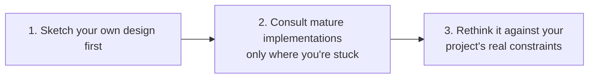
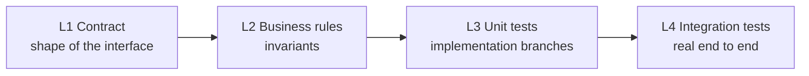
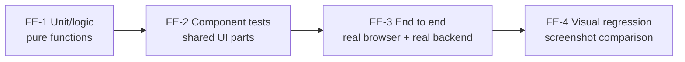
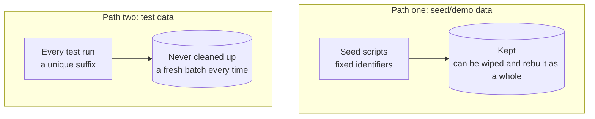
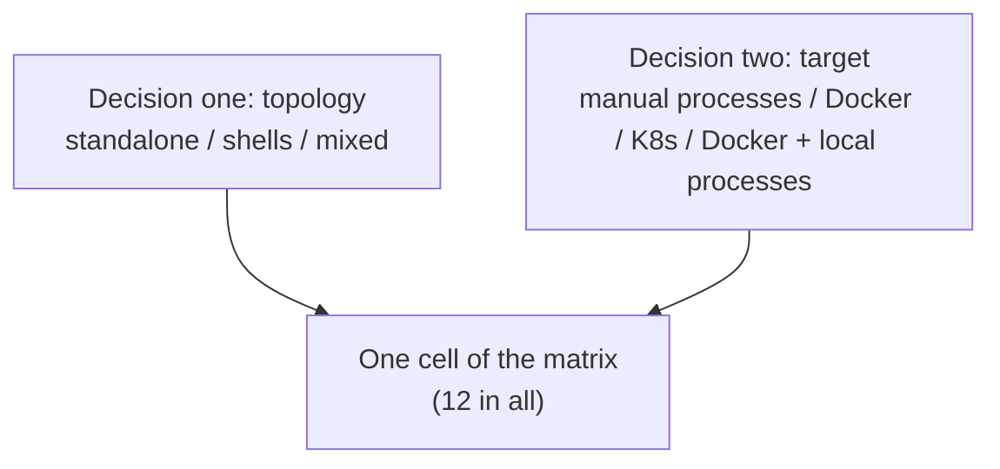

# BrickKit — part 7 of 9 (English)

Contains: docs/en/08-ai-guide/02-ai-dev-workflow.md, docs/en/08-ai-guide/03-judging-a-requirement.md, docs/en/08-ai-guide/04-component-doc-spec.md, docs/en/08-ai-guide/05-fractal-reading.md, docs/en/08-ai-guide/06-reading-brickkit.md, docs/en/09-patterns/README.md, docs/en/09-patterns/01-component-design.md, docs/en/09-patterns/02-testing-strategy.md, docs/en/09-patterns/03-seed-data.md, docs/en/09-patterns/04-service-calling.md, docs/en/09-patterns/05-deployment-selection.md, docs/en/10-troubleshooting/README.md

File paths below are relative to the repository root, https://raw.githubusercontent.com/brickKit/brickKit/main/ ; links inside pages are relative to this file

Next: https://raw.githubusercontent.com/brickKit/brickKit/main/llms/en/08.md

---

> File: docs/en/08-ai-guide/02-ai-dev-workflow.md

# The AI-assisted development workflow

When the task starts as a requirement rather than a component — "users should be able to …" — work out first which
component owns it, whether it is sound, and the order to change things in: see
[Judging and planning a requirement](../../docs/en/08-ai-guide/03-judging-a-requirement.md). The steps below begin once you know which component
you are writing or changing.

## Writing a new component

1. **Read the context.** The project root's `AGENTS.md` — the team's conventions, and the component table at its end — and
   `brickkit.yaml`: what the project already has, the rules a new component must follow, and where it goes.
2. **Read the dependencies.** For every component the new one will call: its `BRICKKIT.md`, `configSchema` and contracts.
   Only direct dependencies.
3. **Generate the skeleton.** `brickkit new <scope>/<name>` (`--path` for a repository of its own, `--contract
   openapi|proto` for a contract placeholder).
4. **Write `component.yaml` first.** `dependencies` (exact versions), `configSchema` (the keys are the environment
   variable names; mark secrets `secret: true`; what the platform can't work out is written as required), `deployment`,
   `healthCheck`, and `migration` if needed. Then `brickkit lint`.
5. **Write the contract.** Put the interface in the contract file first — callers can start at the same time, and you have
   your acceptance criteria.
6. **Write the code.** Read dependency addresses from `*_ENDPOINT`; an optional dependency's variable may not exist, so
   read it with `.get()` and write down the degradation; the health check checks only this process; the entry program
   exits with an error at once on an argument it doesn't know.
7. **Write the Dockerfile.** The image needs `wget` or `curl` (for the HTTP health check), and doesn't run as root.
8. **Write the component's documents.** `BRICKKIT.md` for the people using it — six sections, holding what
   `component.yaml` can't say; `AGENTS.md` for whoever develops it next — the code map, how to build and test, the
   design decisions; and the first line of `README.md`. `brickkit lint` lists every placeholder left. See
   [A component's documentation](../../docs/en/03-component-guide/08-component-doc-spec.md) and
   [Component docs, from an AI's side](../../docs/en/08-ai-guide/04-component-doc-spec.md).
9. **Run it.** `brickkit add --local`, `brickkit build`, `brickkit up`; or build a workbench in the component repository for
   integration work (see [Developing inside a component](../../docs/en/03-component-guide/05-local-dev-fractal.md)).
10. **Test.** Write the tests first and watch them go red, then make the implementation turn them green (see the
    [testing strategy](../../docs/en/09-patterns/02-testing-strategy.md)).

## Changing an existing component

1. **Read its `BRICKKIT.md`, `AGENTS.md` and `component.yaml`.** Especially `configSchema` and `dependencies`, and the
   code map and pitfalls in `AGENTS.md`.
2. **Judge whether it's a breaking change.** Removing an endpoint, changing a field's meaning, changing a config item's name
   or meaning, changing a default — all affect the people using it.
3. **Change the code, the contract and the documents.** In the same commit: `BRICKKIT.md` when what users see changes,
   `AGENTS.md` when the code map or a decision changes. Don't let the docs fall behind the implementation —
   `brickkit lint` says when a document no longer matches `component.yaml` (`DOC_OUT_OF_STEP`) or points at code that
   moved (`DOC_PATH_MISSING`).
4. **Raise the version.** Change `metadata.version` (the version's only source): the patch for implementation-only
   changes, the minor for additions, the major for breaking changes.
5. **Release.** Commit, push, `brickkit release`.
6. **Upgrade in the project.** `brickkit upgrade <component>`; when there are config conflicts, a person decides which value
   to keep.

**Change defaults with care**: keys the project never wrote follow the new default automatically — which is what you want;
keys it did write become a conflict, and it has to decide each one.

## Working in a large project

When the project has dozens of components and the task is about one of them, don't start them all.

1. **Run a focus run.** `brickkit up` in the component's directory (or `brickkit up --focus <id>` anywhere in the
   project) runs that component from its source plus what it needs; the reasons printed next to each component say why
   it starts or doesn't. `brickkit up --all` goes back to the whole project. See
   [Developing inside the project](../../docs/en/02-project-guide/04-focus-run.md).
2. **Run commands from where you are.** Every project command finds the project upward; `build` and `deps` without an
   argument mean "this component".
3. **Move versions forward explicitly.** When you raise `metadata.version` in a component under `components/`, `up`
   stops until the project follows: run the `brickkit upgrade <id>@<version>` it suggests, and read the config migration
   it reports. Nothing moves because a directory changed.
4. **Keep one `components/`.** Never clone or copy a component into another component's directory; `up`, `lint` and
   `sync` refuse nested copies, and BrickKit never moves them for you — ask the person before deleting one: it may hold
   the only copy of their changes.

## What you don't need to do

- **Read the whole codebase.** Component boundaries are written in files; the current component and its direct dependencies
  are enough.
- **Guess service addresses.** It's `http://<versioned service name>:<port>`, injected by the platform.
- **Guess variable names.** Dependency addresses are derived from the component ID; config items are named by the keys of
  `configSchema`.
- **Write deployment scripts.** Deployment files are generated by the CLI; you change only the three layers.
- **Remember command flags.** Use `brickkit <command> --help`.

## What to hand to a person

- How component boundaries are drawn (a domain judgment).
- Which value to keep in a config conflict after an upgrade.
- Bringing in a new third-party component, or adding a trusted public key to `installer.publicKeys`.
- Whether to turn on network policies, ServiceAccount isolation, `podSecurity: restricted`.
- Changes to production deploy files.

---

> File: docs/en/08-ai-guide/03-judging-a-requirement.md

# Judging and planning a requirement

A requirement arrives — "customers should get a credit limit", "orders need an approval step". Before any code is
written, three questions have answers in the project's files: which component owns it, whether it is sound, and in what
order the change goes. This page is how an AI answers them from what is written, instead of from a guess. The skill
`brickkit-plan-change`, installed in every project, carries the same steps.

## Understand the project first

Read in this order, and stop as soon as you know enough:

1. **The project's `AGENTS.md`** (already loaded — Claude Code reads it every session through `CLAUDE.md`): the
   project's conventions and pitfalls, then, at the end, the component table with what each component does.
2. **For each component the question touches, its `BRICKKIT.md`**: what it owns and doesn't, what it needs before
   deploying, its dependencies, configuration and contracts. It is in `.brickkit/manifests/<id>/<version>/`, or in the
   component's source directory when a local source holds that version.
3. **To change a component, its own `AGENTS.md`**: the code map says which file to start in; its pitfalls and
   "Before changing code" say what not to break.
4. **The structure**: `brickkit deps <id>` and `brickkit graph` for who depends on whom; the contract files under
   `.brickkit/artifacts/`.

Never load every component's documentation: only the ones the task touches. What each file holds is in
[A component's documentation](../../docs/en/03-component-guide/08-component-doc-spec.md).

## Find the owner

The component table's "What it does" column narrows the candidates. Each candidate's `BRICKKIT.md` decides: its
`Purpose` section lists what the component **owns** and what it **does not own** — and every "does not own" names who
does instead. Follow that pointer; it is there exactly so nobody has to guess.

## Check it against what is written

| Check | Where it is written | It fails when |
| --- | --- | --- |
| The owner's boundary | Its `BRICKKIT.md`, `Purpose` | The requirement needs it to own something it lists under "does not own" |
| Project conventions | `Conventions` in the project's `AGENTS.md` | The requirement breaks one |
| Recorded decisions | The project's `docs/decisions/`; the component's `Design decisions` and `docs/` | The requirement reverses one |
| Dependency direction | `brickkit deps`, `brickkit graph` | A new dependency would make a cycle, or point against the direction the design allows |
| Contract compatibility | The contract files listed under `artifacts` | It removes or changes the meaning of something callers use — a major version, and every caller moves |

A failed check is not a reason to say no. It is a decision that belongs to a person: changing a boundary, a convention
or a recorded decision is a choice about the system, not a coding detail.

## The outcome is one of four

| Outcome | What it means | Next |
| --- | --- | --- |
| Fits one component | Its owner owns it, nothing conflicts | Plan and change that component |
| Needs a provider first | The owner needs something a dependency doesn't offer yet | Change the provider's contract first, then the consumer |
| Needs a new component | No component owns it, and none should be stretched to | `brickkit new <scope>/<name>` |
| Conflicts | A check above failed | Stop, and put it to the person, quoting the file and section that says so |

## Plan and change

- **Order:** providers before consumers — in `brickkit deps <id>`'s tree, the leaves first, working up to the root; the
  `📋 Start order (topological sort):` list `brickkit up --dry-run` prints is the same order, for the components this run
  starts.
- **Per component, one commit:** the contract, the code, and its `BRICKKIT.md` / `AGENTS.md` together. A doc that lags
  behind the code is how the next AI writes against a wrong description.
- **The version:** raise `metadata.version` — the patch for an implementation-only change, the minor for an addition, the
  major for a breaking change — then release, and `brickkit upgrade <id>@<version>` in the project.
- **Test inside the project with a focus run:** `brickkit up` in the component's directory runs it from its source plus
  what it needs (see [Developing inside the project](../../docs/en/02-project-guide/04-focus-run.md)).

## Done means

- The tests the component's `AGENTS.md` names pass.
- `brickkit lint` shows no documentation warnings for what changed. `DOC_OUT_OF_STEP` in particular says a new
  dependency, required key or contract file isn't mentioned in the docs yet.

## What goes to a person

- A boundary change: a component taking on something it lists as "does not own".
- Breaking a convention or reversing a recorded decision.
- A breaking contract change, and the order consumers move in.
- Whether a new component is warranted, and its boundary.

---

> File: docs/en/08-ai-guide/04-component-doc-spec.md

# Component docs, from an AI's side

A component carries two documents written with an AI in mind: `BRICKKIT.md`, for whoever **uses** the component, and
`AGENTS.md`, for whoever **develops** it. What goes in each, and the rules they follow, are in
[A component's documentation](../../docs/en/03-component-guide/08-component-doc-spec.md); this page is about how an AI reads them
and how it writes them.

## Reading them

### Where they are

**`BRICKKIT.md`.** The component table at the end of the project's `AGENTS.md` says which docs each component carries
(the Docs column: `BRICKKIT.md`, `BRICKKIT.md +zh` when it carries a translation, `—` when it carries none), and the line
above the table gives the rule for where they are:

- when a local source holds the component's source at exactly this version, the `BRICKKIT.md` in that source directory;
- otherwise `.brickkit/manifests/<scope>/<name>/<version>/BRICKKIT.md`, cached by `add` or `fetch`.

A translation, `BRICKKIT.<lang>.md`, sits next to it. The file without a suffix is the primary one: when a translation
says something different, the primary wins. The Home column (`metadata.repository`) is the component's repository, for
reading it on the web, where there is no `.brickkit/`.

**`AGENTS.md`.** Only in the component's own repository: under `components/` when its source is cloned there (a local
source, or `brickkit add --repo`). It never travels into a project's cache — a project using the component has no need
for it.

### What each of `BRICKKIT.md`'s six sections gives you

| Section | Use it for |
| --- | --- |
| Purpose | Judging whether this is the component you're looking for. Its "Owns" and "Does not own" lists — each item saying who owns it instead — tell you where a requirement belongs |
| Before you deploy | What has to exist before `brickkit up` (a database with its schema and role, an account, a certificate) and who prepares it; check these before telling the user it's ready |
| Dependencies | What it uses each dependency for, and how it behaves when an optional one is missing |
| Configuration | What to fill in for each item when writing `config/<scope>-<name>.yaml` — especially what the default can't say |
| Contracts | The interface files to write calling code from, and the events it publishes and consumes |
| Shell declaration | Whether it's a shell, and which members it compiles in |

When `BRICKKIT.md` and `component.yaml` disagree, `component.yaml` wins (it's all the CLI reads); tell the user about the
disagreement.

### The developer's `AGENTS.md`

Read it when you are about to **change** the component, not when you only call it:

| Section | Use it for |
| --- | --- |
| Code map | Where each thing lives, and for each feature where to start and what to read next — start from it instead of scanning the tree |
| Build and test | The exact commands, and what success looks like; run those, don't invent your own |
| Design decisions | Why it is the way it is, and what was rejected; don't undo a decision without reading why it was made |
| Pitfalls | Never / Symptom / Why, for this component |
| Before changing code | A short checklist to go through first |

The block at its end holds the component rules every BrickKit component follows. Rules that hold for every component in
one project are in that project's `AGENTS.md`, not repeated here.

## When there's no `BRICKKIT.md`

The Docs column in the project's component table is "—": the component carries no docs. Fall back to:

1. `component.yaml`: `metadata.description` for a one-line purpose; `dependencies`; the `description`, `default` and
   `required` of `configSchema`.
2. The contract files (`artifacts`): the interface.
3. When that's still not enough, tell the user the component lacks docs, rather than reading its source to guess — what's
   guessed there isn't a promise.

## Writing them

Sources of information, by reliability:

1. `component.yaml`: purpose, dependencies, config items, whether it's a shell — facts, restated directly.
2. The contract files: the list of endpoints and events.
3. The component's code: what the code actually does when an optional dependency is missing; how a config item is actually
   used; for `AGENTS.md`, where things really are and how it really builds.
4. The user: the business "why" — what problem the component solves, what it deliberately doesn't do, how to choose a
   config value, why a design was chosen.

When writing:

- **Don't repeat what `component.yaml` already says** (types, the defaults themselves); write what it can't: how to choose
  a value, what changing it does, what happens when a dependency is missing.
- **Change them in the same commit as the code.** `BRICKKIT.md` when what users see changes, `AGENTS.md` when the code
  map or a decision changes. Change behaviour without changing the docs, and the next AI reading them writes code against
  a wrong description.
- **Write `BRICKKIT.md` for someone meeting the component for the first time, without the repository.** It is read alone
  in other projects' caches, so it has no relative links: name a file as inline code (`api/openapi.yaml`), and use an
  absolute URL for anything outside. Leave out implementation details — they aren't promises.
- **A translation follows its primary.** It is a sibling file (`BRICKKIT.zh.md`), with the same sections, changed when
  the primary changes. `AGENTS.md` isn't translated.
- **Finish with `brickkit lint`.** It checks the sections, the code-map paths, the links, whether the docs still say what
  `component.yaml` says, the placeholders left, and the translations — as warnings, each naming the file and line.

---

> File: docs/en/08-ai-guide/05-fractal-reading.md

# Reading fractally

BrickKit is fractal: a project is made of components, and a component under development is a small project of its own.
Each level has an entry file written for its reader, and each covers only its own level. An AI reads from the top down,
and each level, once read, says which file to read at the next — there's no need to load everything into context at
once.

## Three entry points

| Level | Entry point | What you know after reading it |
| --- | --- | --- |
| The project | The project's `AGENTS.md` (and `.claude/skills/`) | The team's conventions and pitfalls; at its end, the platform rules in brief and the component table — which components exist, what each does, where their docs and contracts are |
| A component, to use it | The component's `BRICKKIT.md` | What it owns and doesn't, what to prepare, how to configure it, how to call it |
| A component, to change it | The component's own `AGENTS.md`, in its source directory | Where its code is, how to build and test it, why it is designed the way it is |

Each level points at the next: the project's `AGENTS.md` ends with the table and the rule for where each component's
`BRICKKIT.md` is; a component's `BRICKKIT.md` is all a caller needs, and its `AGENTS.md` takes over only when the code
itself is to change.

A component under development is itself a project too (its own workbench), so the same levels repeat inside the
component repository — but **when using a component, read only what it publishes** (`BRICKKIT.md`, `component.yaml`,
contracts), never the workbench files in its repository.

## The reading order

1. The project's `AGENTS.md`: once per session is enough.
2. The `BRICKKIT.md` of the components the current task involves: usually only one or two.
3. When needed, that component's `component.yaml` and contracts.
4. When the task changes a component's code, that component's own `AGENTS.md`.
5. When needed, the relevant one of the three layers (the deploy file or `config/`).

**When to stop**: as soon as you can answer the current task's question. To fix a component's config, reading its
`configSchema` and its file under `config/` is enough; there's no need to read the components it depends on.

## The context window

- **Don't read everything.** With many components in a project, reading every component's docs wastes context and drags
  irrelevant details into your judgment.
- **Read on demand.** The routing table ([The routing table](../../docs/en/08-ai-guide/01-ai-routing-table.md)) says which file answers each question.
- **Let the CLI answer derived questions.** Who depends on whom (`brickkit deps`), who runs this time (`brickkit up
  --dry-run`), which variables a component gets (the generated deployment files) — these are all computed from the three
  layers, and working them out yourself from the three layers is slow and error-prone.
- **Don't look for a "merged view".** The platform deliberately offers no command that merges the three layers into one:
  read the layer that owns each question, where the information is densest.

---

> File: docs/en/08-ai-guide/06-reading-brickkit.md

# Reading BrickKit itself

The other pages of this module are about an AI working **in a project that uses BrickKit**. This one is about an AI
reading **BrickKit itself** — asked to explain or evaluate the platform, to answer a question about it, or to develop it
in a clone of this repository.

## Three routes

| The task | Read | How many fetches |
| --- | --- | --- |
| Understand or evaluate BrickKit, or read everything | [`llms/en/00-core.md`](00-core.md), then follow each file's "Next" line | One for the core; one per part for everything (the list in `llms.txt` says how many) |
| Answer one question | [`llms.txt`](../../llms.txt): find the page whose one-line description fits, fetch just that page | Two |
| Develop in a local clone | [`AGENTS.md`](../../AGENTS.md): the doc map (§9) and the code map (§10) | Already loaded — Claude Code reads it every session through `CLAUDE.md` |

On the web, every path is relative to the repository root: prefix it with
`https://raw.githubusercontent.com/brickKit/brickKit/main/`. The Chinese tree has the same routes:
`llms/zh/00-core.md`, `llms.zh.txt`, `AGENTS.zh.md`.

## The bundles

Reading the documentation one page per fetch is slow and easy to leave half-done, so the documentation also comes as
**bundles**: a few files that together hold every page once.

- **`00-core.md`** is `AGENTS.md` plus the pages that explain what BrickKit is, how to get it running, the core concepts,
  the fractal structure and the three layers. On its own it is enough to discuss the platform.
- **`01.md` … `NN.md`** hold every other page, in reading order. A file is filled until the next page would take it
  over **100 KB**, so one fetch reads a whole file; a page is never split across two.
- Each file starts with which part it is, the pages it contains, and the address of the next part. Each page inside
  starts with `> File: docs/en/…`, so after reading a bundle you know which single file to fetch again later.
- Links inside a bundle point back at the original files, so they still say where each one goes.

## Locating code in a clone

`AGENTS.md` §10 is the code map: every package under `internal/` and `cmd/` with what it owns, a table from each
command and cross-cutting feature to the file it starts in, and where tests and checks live. A test fails when a package
is missing from it or a path in it no longer exists, so it can be trusted. Building, testing and conventions are in
[`CONTRIBUTING.md`](../../CONTRIBUTING.md).

## How the bundles stay current

They are generated: `make generate-llms` rebuilds `llms/` and the bundle list in `llms.txt`. The repository's commit
hook (enable it once with `make hooks`) runs it whenever a commit touches the docs, and `make lint` fails when the
bundles are stale — so what a web AI reads is what the docs say.

---

> File: docs/en/09-patterns/README.md

# Recommended practices

The earlier modules cover "how to use it": what commands do, how files are written. This module covers "how to use it
well" — how to draw component boundaries, how to test, how to build data, how to write calls that hold up, what shape a
project should run in.

These are all **recommended practices, not platform rules**. The platform stays out of how components are designed or
tested inside; most of what's below comes from reviews of real deployments, and each page says which parts are backed by
practice and which are only a recommended order. Whether to use them, and how to adapt them, is your call.

For developers who have already run a project with BrickKit and are starting to ask "how do I do this right".

| Page | Answers |
| --- | --- |
| [Component design](../../docs/en/09-patterns/01-component-design.md) | How big a component should be; component or config switch; how DDD concepts map; failure modes to avoid |
| [Testing strategy](../../docs/en/09-patterns/02-testing-strategy.md) | Four layers for backends, four for frontends; a component's own tests and cross-component integration tests; spec first, then implementation |
| [Seed data](../../docs/en/09-patterns/03-seed-data.md) | Two paths for demo data and test data; why to isolate them physically; why seed mechanisms must never reach production |
| [Calling dependencies reliably](../../docs/en/09-patterns/04-service-calling.md) | What Go / Python / Node clients each do when a dependency's container is replaced; how to set timeouts and retries |
| [Choosing a deployment shape](../../docs/en/09-patterns/05-deployment-selection.md) | Standalone / shell / mixed × Docker / K8s / processes on this machine: what each of the 12 combinations suits |

---

> File: docs/en/09-patterns/01-component-design.md

# Component design

This page is **recommended practice**, not a platform rule. How a component's domain model is designed inside is none of
the platform's business — it belongs to whoever builds the component. The method below comes from a real production
deployment: research before designing, watch for one particular signal while researching, then decide where the boundary
goes.

## How big a component should be

**One component covers one domain concept.** "Basic personnel data", "the department tree", "password login", "role
authorisation" are each one component; "the HR system" isn't — it's a family of components.

**For scale.** The project's own 10 test components (`tests/components/`) range from a little over two hundred lines of
code to about three thousand six hundred. That order of size has two advantages:

- One person or one AI can read and understand the whole component in one go, without guessing their way around a
  codebase of hundreds of thousands of lines.
- The component's boundary is written in `component.yaml` and its contracts; someone reading the component only needs those
  two, plus its direct dependencies.

This isn't a hard rule: a component that grows to five thousand lines while really covering one thing doesn't need
splitting to meet a number. Conversely, a three-hundred-line component looking after both "orders" and "stock" should be
split. Line counts are a symptom; the domain concept is what decides.

## Start from reference implementations, not a blank page

Designing business logic should almost always begin by looking at how mature software solves the same problem. A domain
model polished by years of real deployment has absorbed the edge cases a from-scratch design is almost sure to miss —
misses that usually surface three months after a customer goes live, not in the design review.

**The order matters, and the reverse order is worse than no research at all:**



| Step | Do | Why in this order |
| --- | --- | --- |
| 1. Design your own version first | Before opening any reference implementation, sketch a version from your own project's real constraints | Only with your own plan in hand do you see where they differ; read with an empty head and you just produce a copy |
| 2. Look only for what you can't work out | How to cut the domain model, which states a state machine has, which transitions are legal, which fields are required, how edge cases are handled | This step is research, not copying homework — you already know what you're looking for |
| 3. Come back and think it through, then write | Digest what you learned against your own project's real constraints | A reference project's stack and boundaries are almost never the same as yours; what you borrow is its reasoning, not its code |

**Closed-source products are worth consulting too**, even without their source. You can still watch how they're used in
the real world: which features customers use every day, which nobody ever clicks, which flows have been complained about
for years. When judging "is this capability worth its own component", that kind of information is often more useful than
source — and that judgment matters more than any implementation detail, because it comes earlier and is harder to correct
afterwards.

**About licences**: understanding an implementation's reasoning and then re-implementing it independently (even in
another language) isn't a derivative work. What to avoid is opening their source files and copying line by line.
Following the three steps above keeps you well clear of that line. If you really want to use code directly, only under
permissive licences (Apache-2.0 / MIT / BSD), keeping the original copyright notice.

**Write down what you consulted** in the component's design notes, before implementing. Writing it then is cheap;
reconstructing it later, when someone asks "why does this field look like this", is expensive:

```markdown
## Implementations consulted

| Project | Version/commit | Module consulted | What was borrowed | Licence (verified) | Use |
|---|---|---|---|---|---|
| Odoo | 17.0 | `addons/product/models/product_uom.py` | Table design and rounding strategy for unit-of-measure conversion factors | LGPL-3 | Borrowed reasoning |
| A closed-source product | — | — | Real everyday patterns of multi-unit conversion | Closed source | Borrowed usage patterns |

**Deliberately not consulted** (say so, so that later readers don't think it was overlooked):

**Approaches deliberately avoided** (name the anti-patterns found in the references, and why this component doesn't repeat them):
```

The "Use" column takes only three values: **borrowed reasoning** (understand why it was designed that way, then implement
independently — nearly every row should be this), **borrowed usage patterns** (closed-source products, or only docs and
interaction observed), **copied code** (only Apache-2.0 / MIT / BSD, keeping the copyright notice, saying exactly which
file and which part).

## Weaknesses common in reference implementations

Reading several mature implementations in one domain, you often find they share the same set of structural weaknesses,
mostly inherited from the same kind of early architecture. Recognising them as you read is a chance to deliberately not
repeat them:

| Common weakness | How to avoid it |
| --- | --- |
| Every module shares one process and one database, cross-module joins are routine, and module boundaries become "soft" ones anyone can step over | Separate components with separate schemas, the boundary kept by access rights rather than convention — exactly the boundary the component model gives you already |
| Customisation by runtime patching and hooks into the base implementation, so every upgrade may break every customisation | A separately versioned fork plus a locked contract, turning the upgrade into an explicit merge |
| Everything metadata-driven (dynamic fields, a generic "document type"), with no static types to catch errors before run time | A real contract, plus static types where the language supports them |
| Reports query live transaction tables directly, and one heavy query drags down the transaction path | Reports go to summary tables or a dedicated component, never touching the live transaction path |
| Tables grow without limit, and sooner or later the system is crushed by its own history | Design partitioning and archiving for tables that keep growing from day one |

## Component or config switch: recognising a "slot family"

Comparing reference implementations, one situation keeps coming up: **the same feature has genuinely different
implementations in several mature systems, each of them reasonable, only suited to different customers.**

That isn't a "should it be configurable" question. It's telling you the feature needs **a family of interchangeable
components**, not a switch hidden inside one component. It turns on that qualifying condition:

- After comparing, one is **clearly better** → that's the only version you should implement; no family needed.
- Several implementations **each hold up, serving genuinely different customers** → worth making into a family of
  independent, interchangeable components.

| Feature | The real divergence in reference implementations | Conclusion |
| --- | --- | --- |
| Costing method | Moving weighted average / FIFO / standard cost / actual batch cost, each suited to different industries | A family |
| Warehouse picking strategy | First-expiry-first-out / FIFO / nearest location / wave picking | A family |
| Approval routing | Strict hierarchy / tiered by amount / matrix / rule engine | A family — but it's business logic, so it goes in a business-facing component; don't expect a platform mechanism to express it |
| Document numbering | Sequential / segmented by year and month / segmented by organisation and type | **Not** a family — one config item is enough |
| Which fields a master-data record has | Each just has "a few more fields, a few fewer" | **Not** a family — that's customisation, not architecture |

### What a family of interchangeable components looks like on BrickKit

1. **Each member is an independent component**: its own repository, its own `component.yaml`, its own version history.
   `pricing/costing-fifo` and `pricing/costing-standard` are two components, not two modes of one component.
2. **Every member's external contract is exactly the same.** Calling code written against one member works unchanged
   against another — that's what "interchangeable" means.
3. **Nobody may declare a dependency on a particular member.** A component's `dependencies.components` names an exact
   component ID and exact version, fixed in its `component.yaml` when it's released, and the project using it can't
   re-point it afterwards; nor does the platform offer dependency aliases (the variable name is derived from the component
   ID — seeing `PRICING_COSTING_FIFO_ENDPOINT` you know what it points at, and an alias would break that derivation). So a
   component that calls this slot **doesn't** write `pricing/costing-fifo` as a dependency; it declares an address config
   item in `configSchema` (say a required `COSTING_URL` without a default), which the project assembling the system fills
   in under `config/` with the address of the member it actually installs. Once anyone declares a dependency on a member,
   that member is no longer replaceable.
4. **Settle the family before writing implementations**: the names, the shared contract, which customers each member
   serves, and which one a new project installs by default.

**Don't write `if costingMethod == "fifo"` inside one component to fob off a real slot signal.** That crams several
customer groups' genuinely different needs into one codebase, and from then on each customer's needs hold back everyone
else's releases. **The exception**: a divergence small enough for two or three conditional branches, with no third or
fourth variant in sight — splitting out a whole component for that is over-design of another kind.

## Failure modes to avoid

**The god component.** One component looks after everything: users, permissions, orders, reports. The symptoms: dozens of
unrelated items in `configSchema`; changing one feature means releasing the whole component; a problem anywhere restarts
all of it. For the direction of the split, see the three questions in the next section.

**Too many dependencies.** One component depends directly on seven or eight others. Every one of them has to be up before
it can start, and whenever any of them changes its contract, it has to change too. Two common causes:

- It's really a **connector component** (orchestrating several standalone components to complete one flow) written as an
  ordinary business component — make orchestration its explicit job, and don't let other components depend back on it.
- It's doing its dependencies' work for them (assembling another component's data itself, say) — hand that capability
  back to the component it belongs to.

**Splitting too far.** Two components share a rule that "must hold at every moment", yet they were split — there are no
transactions across components, and sooner or later the rule gets broken.

## If your team speaks DDD

You're not required to use DDD. This is just a mapping: if your team already uses words like bounded context and
aggregate, here's what they correspond to in BrickKit. This section isn't backed by a review of a real deployment; it
translates the platform's existing mechanisms into DDD terms, plus a few recommended tests.

| DDD concept | What it corresponds to in BrickKit | Why |
| --- | --- | --- |
| Bounded context | At least one component; a component shouldn't straddle two contexts | A component decides its model and manages its schema itself |
| Aggregate (consistency boundary) | Must go into **one component** | Components only call each other directly by request/response, the platform isn't on the call path, and there are no cross-component transactions to rely on |
| Ubiquitous language | Component IDs and the key names in `configSchema` | The component ID turns, unchanged, into a variable name in the caller's code (`people/basic` → `PEOPLE_BASIC_ENDPOINT`), so name it with the domain's words, not the implementation's |
| Published language / open host service | The contract files in `artifacts` | See [Contracts and artifacts](../../docs/en/03-component-guide/06-artifacts-and-contracts.md) |
| Customer–supplier | The caller pins the supplier's exact version in `dependencies` | No implicit upgrades; upgrading is an explicit change the caller makes itself |

**One term easy to get backwards.** In DDD, "upstream" is the supplier depended on and "downstream" the consumer. When
BrickKit says a component "follows the ones above it", "above" is **the side depending on others** — the top level is the
components nothing depends on. So BrickKit's "above" corresponds to DDD's downstream, and "below" to DDD's upstream.

**Whether to split: ask three questions** (a recommended test, not a platform rule):

1. Is there a rule between the two pieces of data that **must hold at every moment** (say "a balance can never be
   negative", constraining both the account and its ledger)? Yes → put them in one component.
2. Do they need to be **released separately, owned by different people or different customers**? Yes → split them. A
   component is one unit of release, one unit of versioning, one unit of permissions.
3. Once split, can callers write their calling code from the contract alone, without knowing which tables the other side
   has inside? No → the boundary is wrong; go back to question 1.

These three questions answer "should two things be in one component"; the slot family in the section above answers
"should a feature become a family of interchangeable components". They don't conflict.

---

> File: docs/en/09-patterns/02-testing-strategy.md

# Testing strategy

This page is **recommended practice**. The platform stays out of how components are tested inside: language, framework
and test tools are the component's own choice, and the platform only asks for three things — `component.yaml`, a health
check, environment variables. The layered approach below comes from a review of a real production deployment (14
components, including a frontend, covering one complete business loop). To the platform, a frontend component is just
like any other — a container with a port and a health check — so this approach covers both sides: first four layers for
backends, then four for frontends.

## Backends: four layers of tests



| Layer | Checks | Specifically |
| --- | --- | --- |
| L1 Contract tests | The interface's shape to the outside | No breaking change to the contract; every endpoint really works across a process boundary — over the real protocol and real serialisation, not just a local function call that passes |
| L2 Business-rule tests | The properties the feature should have | Invariants (a balance can't go negative), legal state transitions, idempotency, edge cases |
| L3 Unit tests | This implementation's branches | Every branch, condition and error path the current code actually takes |
| L4 Integration tests | The real path end to end | Against a real database and a real message queue, all the way from the request coming in to the write or the message sent |

Two further dimensions **run through every layer** — not a fifth layer, but covered along the way while writing each one:

| Dimension | Covers |
| --- | --- |
| Permissions and data scope | The boundary of what different identities, with different ownership scopes, can see. It goes into every layer, not tested once and done |
| Cross-component calls | Calls to other components go to the real dependency, not a stand-in; see "A component's tests and integration tests" below |

### Telling L2 from L3

L2 and L3 are the easiest to confuse: both look like testing "whether the feature is right". One test is enough:

> Delete this feature's implementation entirely and rewrite it in another language — should this test still hold? Yes →
> L2; no → L3.

"Two requests with the same idempotency key leave only one record" — has to hold in Go and in Python alike: L2. "The amount
field is parsed as `Decimal`, not `float`" — only meaningful for the current implementation: L3.

### Two traps actually fallen into

**Trap one: testing idempotency only by "replaying once".**

| Don't | Symptom | Instead |
| --- | --- | --- |
| Test only serial replay: send once, send again, assert the results match | An implementation that "first `SELECT`s whether it exists, then `INSERT`s if not" inserts twice when two concurrent requests both fall into the "not found yet" window, leaving two records. Serial replay never hits that window, and the test stays green | Switch to an atomic write (like `INSERT ... ON CONFLICT DO NOTHING`); the test must include "several requests with the same idempotency key arrive at once, and only one really runs" |

**Trap two: testing permissions only at the two ends.**

| Don't | Symptom | Instead |
| --- | --- | --- |
| Test only "someone with permission sees what they should" and "someone with no permission sees nothing" | The permission branch is wrong and returns the whole table: the no-permission user is stopped earlier anyway, and the rows the permitted user sees are themselves correct (they just see other people's too) — both tests pass every time | Build two pieces of data in different ownership scopes (different owners, departments, warehouses), query as one identity, and assert the result contains **none at all** of the other's data — not merely "not empty" or "empty" |

## A component's tests and integration tests

### A component's own tests: run on their own

L1–L3 run in the component's own repository, without starting other components and without BrickKit. Dependency
addresses come from environment variables, which the test sets itself; an optional dependency's variable may not exist at
all, so treat "the variable doesn't exist" as an input to test too — how the component degrades then is its own business
logic.

**Stand-ins (mocks) are fine, but know what they can't prove**: a mock can only prove "the call happened" (right arguments,
how many times), never "the result after the call is right".

### Integration tests: real containers, cross-component calls

L4 uses BrickKit to bring up the real dependencies. To judge whether a cross-component test is written right, look for
three things:

1. **It produces data on the spot through the dependency's real interface**, rather than bypassing the interface to read or
   write its storage directly.
2. **When the dependency's contract has no way to produce that data, the capability is added to its contract first** —
   never working around the contract, never writing its database with SQL.
3. **Whether the result is right can only be verified with the dependencies really up** — exactly the half a mock can't do.

In the component's own repository, bring the dependencies up with a workbench (see
[Developing inside a component](../../docs/en/03-component-guide/05-local-dev-fractal.md)): the dependencies run in containers, the
component under test runs on this machine as `mode: debug`, and the tests hit it directly.

## Spec first, then implementation (especially when an AI writes the component)

This section is a **recommended working order**, without a real deployment review behind it like the ones above.

**Why the order matters.** Write the implementation first and the tests afterwards, and the tests become a restatement of
the code already written — they verify "the code does what it does", not "what the code should do". For tests to really
constrain anything, there has to be a specification that doesn't depend on the implementation first. A component happens
to have three, all in `component.yaml`, available without reading a line of implementation:

| Specification | Where | Constrains |
| --- | --- | --- |
| The config spec sheet | `configSchema` | Which environment variables the component reads, their defaults, which are required |
| The dependency declaration | `dependencies` | Which `*_ENDPOINT` variables the component receives (an optional dependency not running is **not** injected; see [The environment variable contract](../../docs/en/06-architecture/03-env-injection-contract.md)) |
| The interface contract | The contract files in `artifacts` | What the component promises to the outside (see [Contracts and artifacts](../../docs/en/03-component-guide/06-artifacts-and-contracts.md)) |

The recommended order:

| Step | Do | How you know the step is right | Containers? |
| --- | --- | --- | --- |
| 1 | Complete `component.yaml`: `dependencies`, `configSchema` (keys, defaults, `required`), contract files | `brickkit lint`, then `brickkit up --dry-run` in the workbench (see below) | No |
| 2 | Write L1 from the contract | They must all be red now, and red for a reason (the endpoints aren't implemented yet). Green on the first run means it tests nothing | No |
| 3 | Write each L2 business rule as a sentence first, then turn it into a test | Likewise red first | No |
| 4 | Write the implementation until L1 and L2 are all green | The tests are the acceptance | No |
| 5 | Add L3: this implementation's branches | Every branch is reached | No |
| 6 | Run L4: `brickkit up` starts real dependencies, and a real path is walked through | Works end to end | Yes |

**Step 1's checks come from BrickKit.** `brickkit up --dry-run` starts nothing, but the checks of the injection stage run
as usual, so wherever `component.yaml` and `config/` disagree shows up right there. Here's the real output (an excerpt) when
`demo/hello`'s config key `GREETING` is written as `GREETTING`:

```text
⚠️ demo/hello@1.0.0: GREETTING is not declared in the component's configSchema, so it has no effect
   File: config/demo-hello.yaml
   Declared keys: GREETING
   Suggestion: Did you mean GREETING?
```

The same step also stops: a config item name colliding with a platform-reserved variable (a warning); a key in `required`
with neither a default nor a value from the project (**blocking** — `--dry-run` stops with exit code 1 too).

**How to write step 3.** Write it first as one sentence of "given… when… then…", then turn it into a test. The idempotency
rule from trap one, written out:

> Given an idempotency key not yet processed; when two requests with the same key arrive at once; then only one really
> runs, and the other gets the same result.

That sentence is itself the most precise prompt you can give an AI, and it points straight at the concurrency window that
serial replay can't reach.

## Frontends: four layers of their own

The same thinking — specification apart from implementation, shared things before specific ones, real environments over
simulated ones — with different tools and boundaries:



| Layer | Checks | Specifically |
| --- | --- | --- |
| FE-1 Unit/logic | Whether the logic computes right | Pure functions, composables, state management; every network request mocked, no rendering |
| FE-2 Component tests | The shared UI parts themselves | Tables, form templates and generic cards reused by several pages — breaking one breaks every page using it, so they naturally come before parts specific to one page |
| FE-3 End to end | Whole business flows | A real browser + a real backend (the whole assembly running). Named by "the business flow verified", not "which button was clicked" |
| FE-4 Visual regression | Whether spacing, density and usage are consistent across pages | Screenshots compared along the way when FE-3 reaches key pages, without starting a browser again. The baseline is updated together with intended UI changes |

**When to write FE-3/FE-4**: add them in bulk once page interactions have mostly settled. While pages are still changing a
lot, every change drags selectors and assertions along with it, and the payoff is poor. The skeleton and directory
conventions can be settled early.

**Before having an AI run FE-3 or FE-4, get the user's agreement.** What's expensive isn't the tools but "an AI really
driving a browser, debugging selectors through screenshots or reading the DOM". Say beforehand which flow is being tested
this time and which pages it covers, and wait for the user to confirm. The cost is mostly in writing and debugging; running
an already stable suite with a text report costs about as much as unit tests. To lower the cost of writing them the first
time: confirm elements with accessibility-tree snapshots (structured text) rather than a full-page screenshot every time;
on failure, read the text stack first and take a screenshot only if that doesn't tell you; have a person record the key
paths where possible.

**A trap actually fallen into: not catching "the backend refused".**

| Don't | Symptom | Instead |
| --- | --- | --- |
| Write data loading as `try { await load() } finally { ... }` with no `catch` — because the mocked backend in FE-1 always succeeds | When the real backend legitimately refuses (403, a validation error, a dropped connection), the rejection becomes an exception nobody catches: one framework warning in the console, the page stuck blank or loading, and the user sees nothing | Every load/refresh function has an explicit `catch` and shows a visible error state. It's also why FE-3 has to hit a real backend: a mock can't test "was a real refusal handled" |

**Frontend types drifting from backend contracts: prevent it with a mechanism, not with more tests.** A hand-written
frontend type annotation says "matches the backend contract", with nothing to guarantee it. Generate frontend types and
request functions straight from the backend contract (an OpenAPI file, a GraphQL schema), and type checking stops every
drift at compile time, at zero extra cost for each endpoint added afterwards.

---

How to plan seed data and test data: [Seed data](../../docs/en/09-patterns/03-seed-data.md).

---

> File: docs/en/09-patterns/03-seed-data.md

# Seed data

This page is **recommended practice**, following on from the [testing strategy](../../docs/en/09-patterns/02-testing-strategy.md): that page covers
how to test in layers; this one covers what data those tests — and a person exploring the whole system by hand — actually
run on. How a component manages its own data is none of the platform's business; the method below comes from the same
real production deployment (14 components, one complete business path).

Two words first:

- **Seed data** (also called demo data): a batch of fake data for people to explore the system locally and give demos
  with, produced by scripts and kept.
- **Test data**: data an automated test creates on the spot on every run, serving only that test's assertions.

## Two paths



| | Seed/demo data | Test data |
| --- | --- | --- |
| Purpose | People exploring locally, demos | Automated tests at every layer |
| How it's produced | Fixed identifiers, idempotent — rerunning the script doesn't rebuild what exists | Created on the spot by each test run, with a timestamp or random number as a unique suffix |
| Lifetime | Kept; can be wiped as a whole | Never cleaned up — rows piling up doesn't matter; the next run has its own new suffix |
| Shared? | Components may look up and reuse each other's (see below) | Never — no test should depend on "this row was left by another test" |

**Why "never cleaned up" is actually better.** Cleaning up at the end of a test means a test failing halfway leaves half
its data behind, which the next run may run into; and two batches of tests running concurrently delete each other's data.
With a new suffix every time and no cleanup, both problems disappear at once — at the cost of a few rows in the database
nobody looks at.

## Physical isolation: never share storage

Wiping the seed data shouldn't turn any test red; a test run shouldn't dirty the data a person is exploring by hand. With
the two paths mixed, "why did this suddenly break" has no single direction to investigate — maybe someone wiped the seed
data, maybe another test ran concurrently — and the two causes are investigated completely differently.

So isolate them **physically**, not just by convention: tests connect to a different database instance (at least a
different database), not two namespaces in the same one. An integration test writing to a row of baseline data (the
default warehouse, the default cost centre) that happens to be what a demo reads — as long as physical storage is shared,
that risk is always there.

**How to do it in BrickKit**: a database address is a component's config item anyway, with its value referencing a shared
variable through `$var:`. Give the tests a deploy file of their own, pointing at the test database in its `vars:`:

```yaml
# config/vars.yaml — the database used normally (exploring, demos)
PG_HOST: pg.dev.internal
PG_PASSWORD: ${PG_PASSWORD}
```

```yaml
# config/people-basic.yaml
DB_HOST: $var:PG_HOST
DB_PASSWORD: $var:PG_PASSWORD
DB_NAME: people
```

```yaml
# deploy.test.yaml — used for integration tests: brickkit up -f deploy.test.yaml
target: docker
vars:
  PG_HOST: pg.test.internal
components:
  - id: people/basic
  # …copy the other components' entries from deploy.yaml: every deploy file lists every component in brickkit.yaml
```

On the `-f deploy.test.yaml` run, every `$var:PG_HOST` gets the test database; normally it's still the development one.
The component's code needn't know which one it's connected to.

**Don't switch to an in-memory database for speed.** When your database uses features an embedded substitute can't
reproduce (partitioned tables, session-level settings like `SET LOCAL ROLE`), switching to a throwaway substitute gives up
exactly what the integration test is there to prove — that the real infrastructure really behaves as expected. The real
fix for "rebuilding data is slow, tests pollute each other" is making **the data itself** disposable — the "unique suffix,
never cleaned up" above — not changing the database.

## One coverage floor, two ways to reach it

Both paths share one floor: **no component should have only "everything's fine" data.** Every branch of a state machine,
every failure path, every data-scope dimension needs data that really triggers it. But the floor is reached differently:

- **Seed data aims to be plentiful and complete.** It also has to serve "can a person experience this whole system", so
  quantity and variety are goals in themselves.
- **Test data aims to be small and precise.** Each test creates exactly enough data to verify its own assertion. The one
  exception is property-based tests of core invariants (a balance never goes negative, a state machine never jumps to an
  illegal state): they need volume so random input is more likely to hit the edges — a different thing from "complete to
  experience".

They aren't a rich and a slim version of the same data — their purposes differ, so they should look different.

## When seed data is "enough"

This takes deliberate design, not just piling up volume:

- **Data scopes really have several values.** Permission boundaries by department, by owner, by warehouse can only be
  clicked through and verified when the data really holds several values. With all the seed data under one all-powerful
  administrator, even a correctly implemented scope mechanism doesn't exist as far as the experience goes.
- **Enough volume to need paging.** A list with cursor paging and 5 rows only ever has one page — the paging contract never
  existed in the experience.
- **Spread out in time**, not all freshly created, so "the last N days", trend charts and time-partitioned logic have
  something to verify.
- **Negative and edge data really exist**: a disabled record, a zero balance, an overdue unpaid invoice, a rejected request.
  A failure path that exists only in your head can't be clicked open.
- **The data can be looked up.** With a lot of data, there needs to be one place to look up "what this fixed identifier
  stands for" — otherwise a new component that wants to reuse it has nowhere to look, and may collide with an identifier
  already taken. One list maintained in one place (component, data, count, owner) beats every component keeping its own.

## Duplicate data between components is fine

It's all fake data, with no risk of polluting real data. Two components each creating something conceptually similar (each
its own "sample customer") isn't worth the coordination cost of de-duplicating. When a component needs data like another
component's, reusing what's already there is far cheaper than negotiating "who should maintain it".

## Ownership: each component creates its own, dependencies first

Centralise seed data at the project level, and the moment someone runs one component on its own with just its
dependencies (a very common way to use it), the central script stops working — it only works when every component runs
together. So:

- **Each component owns and maintains its own seed data.**
- **Before creating its own part, it has the seed data of every declared dependency created first** — required and
  optional dependencies alike: in development and demo environments, declared dependencies are usually all running anyway;
  the required/optional distinction serves "should this optional module be installed" in real deployments, not the order
  of seed data. When a dependency really can't be reached in the current environment, skip it and carry on with your own —
  a missing dependency degrades the seed flow rather than failing it.
- **Hand over through the component's own idempotency mechanism; don't invent a protocol.** When a downstream component
  needs an id from a dependency's seed data, it looks it up in that dependency by the fixed identifier both sides agreed
  on, and gets the matching row.

## Once referenced, a fixed identifier is a contract

Once another component has looked up a fixed seed identifier, it can no longer be deleted or pointed at another meaning —
only added to. Treat it like a field in a published contract: additions are fine; breaking changes need the same
coordination as a real contract change.

## Append-only tables can only be reset as a whole

A table that by nature only ever grows (a ledger, locked accounting periods, an audit log) shouldn't have row-by-row seed
cleanup — sequences don't roll back because a few rows were deleted, and hard deletes quietly violate the table's own
design. The right tool is a full migration reset (roll back every migration and run them again); the side effect is that
the baseline data the migrations themselves load comes back too, since it belongs to the rebuilt schema, not to the seed
scripts.

**Rule of thumb**: append-only tables only ever get a full reset; tables that can safely be deleted row by row can have
either, and day to day the lighter row-by-row cleanup comes first.

## The line never to cross: seed mechanisms never reach production

No mechanism that creates seed data may ever be able to plant a real credential in a real customer's deployment. Once a
test account or a shared password gets mixed into something "run on every deployment" (a database init script baked into
an image, say), it's a back door buried in every installation. No exceptions:

- **Baseline data every deployment really needs** (the default warehouse, the basic chart of accounts, standard units of
  measure) goes through migrations, not seed scripts — it isn't test data, it's part of the product. A component's
  `migration.command` runs before the main service on every deployment, which is exactly the "runs everywhere,
  non-optional" this kind of data needs (see [The migration container](../../docs/en/05-migration/01-migration-service.md)).
- **"How the first administrator gets in" in a real deployment is a config-driven bootstrap problem, not seed data.** Put
  the first real operator's identity in a config item; the component reads it at start-up and idempotently grants it the
  administrator role — nobody writes SQL by hand, and no account is hard-coded anywhere. That's a different problem from
  the "test role with every permission" local development needs; don't let one mechanism stand in for the other.

## What else test data needs

- **Event or message tests need a private subject or topic of their own** — shared with something else on the same
  machine, a real consumer competes with the test for messages.
- **Tests verifying idempotent consumption (de-duplicating by a unique key) use a different identifier on every run** —
  with a fixed string, the second run looks like a legitimate replay to the de-duplication logic and is quietly swallowed,
  never reaching the code under test.
- **Test data doesn't need seed data's dimensions** — paging volume, spread in time, discoverability. Creating more data
  for goals unrelated to this test is pure waste.

---

> File: docs/en/09-patterns/04-service-calling.md

# Calling dependencies reliably

A dependency's address is stable: `http://<versioned service name>:<port>`, like `http://demo-hello-1-0-0:8080`,
resolved by Docker's or Kubernetes' own DNS, with no registry run by the platform. That promise is about **the name
itself**. It doesn't answer another question: once your process has connected through that name and the container behind
it is replaced (a redeploy, a crash and restart, a rolling update), what does your HTTP client do next?

This page answers it with a real experiment: can the default HTTP clients of Go, Python and Node.js survive the
dependency's container being replaced behind an established connection?

## How the experiment was done

One `docker compose` project: a backend (`traefik/whoami`, which only echoes its own container's hostname — just right
for telling whether a response came from the old container or the new one), and one client per language sending a
request to `http://backend/` every 500 ms, each using its language's default keep-alive client: Go's `net/http.Client`,
Python's `requests.Session()`, Node.js's `http.Agent({keepAlive: true})`.

After about 25 requests had all hit the first container, the backend was force-recreated — deleted, and a brand-new
container started on a genuinely different IP (verified with `docker network inspect`) — while the clients kept polling
without knowing anything had happened behind them. That's exactly what a redeploy looks like in a real deployment: the
caller never gets a signal that "the other side is about to be replaced".

## DNS caching and connection reuse: what happened in each language

**Go: fails once, at once, and recovers on the next try.** The request that landed exactly at the switch failed
immediately, without hanging:

```text
[ 25] t=21:31:55.147 status=200 took=632.03µs body="Hostname: 8bda437b989b"
[ 26] t=21:31:55.648 ERROR: Get "http://backend/": dial tcp: lookup backend on 127.0.0.11:53: server misbehaving
[ 27] t=21:31:56.150 status=200 took=1.173938ms body="Hostname: ce0eda814117"
```

`127.0.0.11` is Docker's built-in DNS server — this is a real DNS resolution failure, surfacing at once as an `error`. The
next request 500 ms later already hit the new container. Two independent runs gave the same result. Go's default
`Transport` notices the pooled connection died, and next time dials again and looks up DNS again — with no need to turn off
keep-alive, and no retry code of your own.

**Python (`requests.Session`): no error, but a silent 2.5-second stall.** This is the only really dangerous result in the
experiment. Every other request took single-digit milliseconds; the one that landed on the dead connection took
**2.506 seconds**, and still returned `200`, with no exception at all:

```text
[ 25] t=21:31:55 status=200 took=0.003s body='Hostname: 8bda437b989b'
[ 26] t=21:31:58 status=200 took=2.506s body='Hostname: ce0eda814117'
[ 27] t=21:31:58 status=200 took=0.001s body='Hostname: ce0eda814117'
```

No error, no warning; the only trace is the `took=` timing, which nothing looks at by default. `requests`' underlying
connection pool tried to reuse the dead socket, writing into a connection whose other end had vanished entirely (no FIN,
no RST — that container's network namespace was simply gone). It stopped at about 2.5 seconds because the experiment's
code set `timeout=2`; without it, Linux's own TCP retransmission would drag on far longer. **A `requests` call without
`timeout=` has no upper bound at all.**

**Node.js (`http.Agent({keepAlive: true})`): that one request hangs until your own timeout.** The log is out of order
because the requests are asynchronous:

```text
[ 26] t=21:31:56 status=200 took=3ms body="Hostname: ce0eda814117"
[ 27] t=21:31:56 status=200 took=2ms body="Hostname: ce0eda814117"
[ 28] t=21:31:57 status=200 took=3ms body="Hostname: ce0eda814117"
[ 25] t=21:31:57 ERROR: timeout
[ 29] t=21:31:57 status=200 took=1ms body="Hostname: ce0eda814117"
```

26–29 were sent after the switch and all hit the new container at once. 25 hung on the dying connection and never
recovered by itself; it finally failed only because the experiment's code explicitly set a 2-second timeout and called
`req.destroy()`. **Without a timeout, that request would hang indefinitely** — Node's `http` module has no default
per-request timeout.

## What this means for your code

**All three clients survived the dependency being replaced — none got stuck on the old address forever.** The promise of
stable addresses holds: no DNS-caching tricks, no disabling the connection pool, no BrickKit-specific client code. The
versioned service name resolved correctly again on the next attempt.

**But "recovers eventually" and "the caller doesn't notice at all" are two different things, and only Go's defaults give
both for free.** Concretely:

- **Set an explicit per-request timeout on every call to a dependency, in every language.** This is the one thing the
  experiment really verified: Python's `timeout=2` and Node's `timeout: 2000` turned an open-ended hang into a bounded few
  seconds. Go's `http.Client{Timeout: ...}` should be set too, even though this failure happened not to need it.
- **Treat a failed or slow call to a dependency as an ordinary, retryable event**, not a fatal error. One retry with a
  short back-off absorbs the single hiccup every language showed above. Retrying is your own code's responsibility: what a
  sensible retry looks like varies by call and is a business judgment; the platform stays out of circuit breaking, retries
  and back-off, because a uniform default would be wrong for most calls.
- **"Slow but successful" is a real production risk, not just a Python quirk.** Those 2.5 seconds had zero errors and zero
  logs. When your caller's timeout is shorter than that, it sees a failure, and your own logs hold no explanation. **The
  timeout you set on a dependency must be shorter than the time your caller is willing to wait for you.**

## On Kubernetes: which failure the ClusterIP erases

The experiment ran on Docker: when the container was replaced, Docker's built-in DNS really did resolve `backend` to a new
IP — the direct cause of Go's DNS error and of the other languages' stalled connections.

On Kubernetes the mechanism differs, and happens to erase one of the failures: a `Service`'s `ClusterIP` stays the same for
the Service's whole lifetime, and what actually forwards traffic is `kube-proxy`'s rules (iptables or IPVS), working below
DNS and steering traffic to Pods that are currently healthy. The client resolves the ClusterIP, not a Pod's IP, and that
doesn't go stale — so **Go's one DNS failure doesn't happen on K8s**.

**What isn't erased**: once the old Pod's process exits, **the TCP connection itself** still dies. The connection-pool
stalls of Python and Node.js aren't unique to Docker, and the same advice (explicit timeouts, retryable failures) applies
unchanged on K8s.

## Calling a member inside a shell

When a component you depend on is compiled into a shell, the `*_ENDPOINT` you receive names the shell's service with the
member's own port: `http://<shell service name>:<the member's port>` (see
[The environment variable contract](../../docs/en/06-architecture/03-env-injection-contract.md#dependency-addresses)). The member's
own versioned service name resolves to the shell too: a network alias of the shell's container on Docker, and on K8s a
Service selecting the shell's Pod. The calling code — which reads the variable — doesn't change at all, and the
conclusions above apply in full. The only difference: when the shell restarts, every member it hosts is unavailable at
once, and callers see one and the same hiccup. How a shell hands requests to its members inside is covered in
[Writing a shell](../../docs/en/04-shell/05-shell-development.md).

## Further reading

- [The environment variable contract](../../docs/en/06-architecture/03-env-injection-contract.md): how a dependency's address becomes
  the `*_ENDPOINT` in your environment
- [Design principles](../../docs/en/06-architecture/05-design-principles.md): why there's no registry, and why retries and circuit
  breaking are left to components

---

> File: docs/en/09-patterns/05-deployment-selection.md

# Choosing a deployment shape

This page answers one question only: **what should a project with N components actually run as?** It doesn't teach you
how to build a shell (see [Writing a shell](../../docs/en/04-shell/05-shell-development.md)), nor the steps to put a component into a
shell (see [Managing members](../../docs/en/04-shell/04-members-management.md)). Read this page first, before the project's overall
shape is decided.

## Two decisions, plus one switch

**Decision one: topology — how many containers do the components end up in?**

- **All standalone**: each component its own container (or Pod). This is the shape you get by writing nothing extra.
- **All in shells**: as many components as can be merged are compiled into a few shells, one container per shell.
- **Mixed**: some in shells, some standalone. This is usually the norm, not a compromise: some components **structurally**
  can't go into a shell — a pure frontend served by nginx has no backend process to compile in; a stateless gateway is
  often kept standalone on purpose, so it can scale on its own load.

A shell is itself an ordinary component (marked `kind: shell` in `brickkit.yaml`); the members it can host are written in
`shell.members` of its `component.yaml`, and **which it hosts this time** is written in the deploy file — member entries
nested under the shell entry's `members`. So topology is decided **per deploy file**: the development machine's
`deploy.yaml` can be all standalone while production's `deploy.prod.yaml` gathers a few members into shells, without a word
of `config/` changing.

**Decision two: the deploy target — `docker` (or `podman`) or `k8s`**, written in the deploy file's `target`. This is
almost entirely an infrastructure question, not a performance one: do you have a Kubernetes cluster, do you need
scheduling across machines and self-healing? If not, `docker` drives everything on one machine with `docker compose`, the
simplest to operate, fit for local development, demos, and small-scale or single-machine production. If so, `k8s`
generates Deployments / Services / Ingresses. The topology decision applies unchanged; switching targets is switching one
deploy file.

**The switch: `mode: debug` / `mode: local` — pull one or two components onto your machine as processes, while the rest
runs in containers as usual.**

- `mode: debug`: you start the process in your IDE, and the platform only makes sure others can find it. It can only be
  written in the personal `deploy.local.yaml`.
- `mode: local`: the platform recognises the start command itself, starts the process and supervises it.

Both **exist only on Docker / Podman**, and are refused when the deploy target is `k8s` — a Pod in the cluster can't reach
your laptop. They combine with any topology: a process on this machine can depend on standalone components, on shells, or
on a member inside a shell; a member inside a shell can itself be pulled out to debug.

The two decisions really are two independent axes, so this is a matrix, not a few preset names:



## One way outside the platform: starting things by hand

Nothing stops you from starting every component as an ordinary process (`go run`, `uvicorn`, or your language's
equivalent), without going through `brickkit up` at all.

**The boundary first: this isn't a shape the platform manages; the platform doesn't even know it exists.** Dependency
resolution, environment variable injection, health checks, migration order and service discovery all don't happen,
because you didn't call it. Which port each process listens on, every variable a real deployment would inject, the start
order — you reconstruct all of it yourself. That's a direct consequence of "the CLI exits when done, with no long-running
service": the platform exists only while a command runs.

It's still entirely legitimate and very common — usually the fastest development loop (no images to build, breakpoints
attach directly).

**A trick worth knowing: have the CLI work out the environment variables for you.** In `deploy.local.yaml`, temporarily
mark the component you'll run by hand `mode: debug`, run `brickkit up --dry-run` once, and read the generated
`.brickkit/generated/local-debug.<versioned service name>.env` — exactly the full set of variables a real deployment would
give it. For instance, `shop/order` depending on the shell member `shop/stock`:

```text
COMPONENT_ID=shop/order
COMPONENT_VERSION=0.1.0
SHOP_STOCK_ENDPOINT=http://localhost:18082
```

Copy what you need, then delete that line (or `brickkit local off`). `deploy.local.yaml` is never committed anyway, so it
affects no one. One thing the trick doesn't cover: addresses you wrote by hand in `config/` assuming the container network
(like `http://host.docker.internal:8000`) — the platform doesn't parse config values and won't rewrite them to
`localhost` for you, just as with `mode: debug` itself.

## The matrix

|  | Manual processes | Docker | K8s | Docker + local processes |
| --- | --- | --- | --- | --- |
| **All standalone** | [1. The starting point before shells](#1-all-standalone--manual-processes) | [2. The standard shape while one machine is enough](#2-all-standalone--docker) | [3. The most generous end](#3-all-standalone--k8s) | [4. Debug one component, keep the rest real](#4-all-standalone--docker--local-processes) |
| **All in shells** | [5. Testing a shell's own orchestration alone](#5-all-in-shells--manual-processes) | [6. Squeezing memory when one machine isn't enough](#6-all-in-shells--docker) | [7. The tightest end](#7-all-in-shells--k8s) | [8. Debug one component, keep the shells real](#8-all-in-shells--docker--local-processes) |
| **Mixed** | [9. Everyday development once shells are in use](#9-mixed--manual-processes) | [10. Where most real projects end up](#10-mixed--docker) | [11. The middle ground on resources](#11-mixed--k8s) | [12. The combination closest to real development](#12-mixed--docker--local-processes) |

There's no 13th cell "K8s + local processes": `mode: debug` / `mode: local` meeting `target: k8s` in a deploy file is
refused while loading, the error pointing at the offending entry (`components[N].mode`).

### 1. All standalone × manual processes

**What it is**: every component used is an ordinary process you start by hand, with no containers and no `brickkit up`.

**When**: the most common starting point for developing one component, especially while the project has no shells yet.
When you want the fastest "change code, see the effect" loop.

**Upside**: no image-building step; no container layer between a process and the addresses it connects to, so a problem
has only two variables to check; no need to install Docker.

**Cost**: injection, health checks, service discovery and migration order are all for you to reconstruct; with more
components, assembling a dozen sets of environment variables by hand is real labour and error-prone. The `--dry-run`
trick above saves most of it.

### 2. All standalone × Docker

**What it is**: one Compose service per component, driven end to end by `brickkit up`: address injection, health checks,
starting in dependency order, migrations.

**When**: the default shape while one machine can hold the components. "Can hold" is a real number: each process's memory
floor is almost entirely set by its language runtime — Go / Rust 8–20 MB, Python / Node 40–90 MB, JVM 200–450 MB (typical
orders of magnitude for each runtime; measure your own components). Twenty idle Go components add up to under half a GB;
twenty idle Spring Boot components already take 4–9 GB without doing anything. Stay in this cell until that sum really
doesn't work out on the machine you deploy to.

**Upside**: every component can be started and stopped on its own, and trouble affects only itself; one component means
one container, one log, one health state — the simplest to troubleshoot.

**Cost**: every component pays its own runtime memory floor — the very reason shells exist; a single-machine shape, with no
scheduling across machines and no self-healing.

**Worth knowing**: measure before deciding "it doesn't fit" (`docker stats`); don't take numbers off the table — a
50-component project may run only a few locally, because most are `mode: disable` this time, or nothing needs them.

### 3. All standalone × K8s

**What it is**: one Deployment + Service per component, with addresses resolved by the cluster's native Service DNS.

**When**: the cluster has resources to spare, and there's no need to trade merging for a lower memory floor. Every
component keeps its own `replicas` and its own `resources`.

**Upside**: truly independent horizontal scaling; scheduling across machines and failure recovery work per component.

**Cost**: the highest operational complexity — it needs real cluster administration; the machine running `up` needs
`kubectl`; many components means many Deployment / Service objects.

**Worth knowing**: on K8s, `expose: true` needs `hostname` (Ingress routes by domain name), and Docker's `exposePort` does
nothing; a missing `hostname` is stopped by `up --dry-run`. Addresses in `config/` that assume a single-machine Docker
network have to be changed when moving to K8s — giving different values per environment with the deploy file's `vars:` is
the least work.

### 4. All standalone × Docker + local processes

**What it is**: everything is a real container except the components you marked `mode: debug` or `mode: local`. The
platform makes the other containers resolve that component's versioned service name to your machine (`extra_hosts` pointing
at `host-gateway`). Callers keep the same service name — `extra_hosts` only changes where it resolves — and the port
becomes your `localPort`, which by default is the component's declared port, so often nothing in the address changes.

**When**: you want "the rest is real" and also "no image rebuild for changing this one component". It's only a
development-time overlay; it doesn't decide the production topology.

**Upside**: zero changes to component code; several components can be pulled out at once, each with its own `localPort`;
everything the process on this machine depends on still gets the real addresses the platform works out.

**Cost**: when something can't connect, first ask "does this name resolve to my machine or to a container", rather than
checking the network in general; container-network addresses written by hand in `config/` aren't rewritten.

**Worth knowing**: a `mode: debug` component gets a `local-debug.<service name>.env` for the IDE to load, with multi-line
values and values holding special characters already escaped by shell rules. It **runs no database migration** — the
migration step went away together with its container, so a component with a migration has to have it run by hand the first
time (see [Local debugging](../../docs/en/02-project-guide/03-local-debug-workflow.md)).

### 5. All in shells × manual processes

**What it is**: the shell's own program started straight on your machine, without any orchestration. What you're testing
is the shell's own multi-module orchestration. The platform isn't there, so `BRICKKIT_SERVED_MEMBERS` /
`BRICKKIT_SERVED_MEMBERS_CONFIG` are yours to assemble (or hard-code for the test).

**When**: needed almost only by whoever builds and tests shells: verifying the shell's start order, health check and
failure isolation between modules without the container layer, before handing it to a real deployment.

**Upside**: the fastest loop for shell development; "a bug in the shell's orchestration" can be separated cleanly from "a
problem in the container layer".

**Cost**: none of the platform's guarantees exist here — it can only prove the shell behaves right on data you assembled
yourself. The exact shape of the two variables is in [Config as JSON](../../docs/en/04-shell/02-json-injection.md).

**Worth knowing**: the module registry inside a shell should be keyed by **the full component ID plus version**, so that a
real deployment can host two versions of one component at once — a trap that only shows up when two versions really are
fed in, worth practising on purpose in this cell.

### 6. All in shells × Docker

**What it is**: as many components as possible compiled into a few shells; one Compose service per shell, and members
generate no service container of their own. A caller's `*_ENDPOINT` for a member points at the shell:
`http://<shell service name>:<the member's own port>`. The members' versioned service names are also kept as network
aliases of the shell's container, so caller code — which reads the variable anyway — doesn't change.

**When**: when the memory sum of cell 2 really doesn't work out — not before. Before doing it, try cheaper things first:
give the expensive components a lighter runtime (compiling JVM components into GraalVM native images drops the memory floor
from hundreds of MB to tens, with the deployment shape unchanged); check whether the components driving the number up could
be `mode: disable` this time anyway.

**Upside**: a shell carries one runtime floor and one connection pool, not N; fewer containers, faster start-up, fewer logs
to watch and fewer things to restart.

**Cost**: members sharing a shell share a failure domain (one crash can take down the other modules, unless the shell is
built very carefully) and a unit of scaling (one member can't get extra replicas on its own).

**Worth knowing**:
- Members' migrations **are still run by the platform**: with the member's own image and config, and the shell starts only
  once they succeeded (see [Migrations and shells](../../docs/en/05-migration/04-shell-interaction.md)). So every member must have an
  image of its own.
- For a shell image built on this machine, `brickkit build` records in a label which member versions it compiled in, and
  `up` compares that label with `shell.members` in the shell's `component.yaml`: a mismatch stops it (`IMAGE_STALE`),
  rather than a shell missing a member quietly starting. An image without the label (built by hand) only gets a warning
  (`IMAGE_UNVERIFIED`); pulled images aren't checked — a released version's image matches its `component.yaml` by
  construction.
- Fields on a member entry describing "how its own container is deployed" (`expose`, `replicas`, `resources` and so on) do
  nothing inside a shell; they're kept for when the member falls back to a standalone component.
- Merging can create a start wait cycle; `up` stops it and gives three ways out (see
  [Managing members](../../docs/en/04-shell/04-members-management.md#start-cycles-caused-by-merging-and-skipwaitfor)).

### 7. All in shells × K8s

**What it is**: the same merging against a cluster: one Deployment per shell; one Service per member, whose `selector`
picks the shell's Pod and whose port is the member's own declared port; members generate no Deployment of their own.

**When**: the cluster's resources really are tight, and pushing the total cost down matters more than scaling a member on
its own.

**Upside**: both "merging saves memory" and "K8s self-healing and scheduling across machines". With network policies on, a
member's callers and dependencies are counted into the shell's rules automatically.

**Cost**: every cost of cell 6 holds unchanged; so does every K8s cost of cell 3 — merging doesn't lower K8s' own demands.

**Worth knowing**: Pods have no start order on K8s, so wait cycles caused by merging aren't stopped here, and `skipWaitFor`
only warns and does nothing; members' migrations are still their own Jobs.

### 8. All in shells × Docker + local processes

**What it is**: cell 4's overlay, only "the rest" is shells. Both directions work:

- A process on this machine depends on a member: the address it gets is a real `http://localhost:<port>` — the mapping is
  opened on the **shell's** Compose service (the member has no service of its own), on the port the member declares, which
  the shell must listen on anyway.
- A member itself is pulled out: in `deploy.local.yaml`, write `mode: debug` and `localPort` on that member under the shell
  entry's `members`; the shell doesn't host it this time, and it runs on your machine.

**When**: the component you're changing has to talk to the real, already merged rest, and you don't want to rebuild any
image.

**Upside**: no need to know which shell a member is in; the rest stays whole and real.

**Cost**: every limit of cell 4 applies unchanged. With a member pulled out for debugging, the shell hosts one module fewer
this time — the shell must handle one item fewer in `BRICKKIT_SERVED_MEMBERS` correctly.

### 9. Mixed × manual processes

**What it is**: the components used this time are started by hand in their real shapes — standalone components as in cell
1, shells as in cell 5.

**When**: everyday development once the project's production topology uses shells. Start only the few you're changing,
and the local result still reflects real address resolution and cross-process calls.

**Upside**: keeps the fastest loop past the scale of "all standalone"; reconstructing the real shape lets you hit
shape-related bugs locally (a shell registry keyed wrong, say).

**Cost**: the most manual preparation of any cell; nothing checks that the "who is where" you set up by hand agrees with the
deploy file.

### 10. Mixed × Docker

**What it is**: some standalone containers, some in shells, all driven by one `brickkit up`. Who is where is decided
entirely by where entries sit in the deploy file (at the top level, or under a shell's `members`).

**When**: where a mature project usually ends up, and usually **structurally**, not as a resource compromise — components
like frontends and gateways don't belong in shells to begin with. When you're unsure which cell an on-premises delivery
should use, this is usually the answer.

**Upside**: standalone where independence is needed, memory saved everywhere else; both kinds of entry sit side by side in
one deploy file, with no special handling.

**Cost**: troubleshooting means carrying two mental models at once; the costs of the merged half and of the standalone half
each hold unchanged — mixing doesn't average them out.

**Worth knowing**: an old version of a component running standalone while a new version runs in a shell can coexist with
zero coordination (see the end of this page).

### 11. Mixed × K8s

**What it is**: cell 10's mixed topology against a cluster: standalone components each with a Deployment + Service,
members' Services pointing at the shell Pods.

**When**: resources neither tight nor generous: most components stay in shells to keep the total cost down, and the few
that really need their own replica count or resource quota are picked out and deployed on their own. Unlike cell 10, mixing
here is often a **resource-tuning** decision — a component that could structurally be merged perfectly well is split out
deliberately, to scale on its own.

**Upside**: the most flexible resource allocation; address resolution and network policies support mixing natively, with
no extra configuration.

**Cost**: the full K8s operational cost and the full merging cost at once; the most places to look when something goes
wrong: K8s itself, a shell's internal orchestration, ordinary containers.

### 12. Mixed × Docker + local processes

**What it is**: the real mixed topology running in Docker, with one more component pulled onto your machine. The
combination closest to real development, because "the rest" is the project's real production shape.

**When**: the component you're changing has to be checked against the topology the project will really use.

**Upside**: without touching production, it's the nearest thing to "debugging against production"; address resolution
works in both directions (see cells 4 and 8).

**Cost**: you have to understand shell merging, the address resolution of processes on this machine and the behaviour of
ordinary containers all at once — there's no simpler mental model to fall back on.

## One conclusion across all 12 cells: versions side by side need no extra care

No cell changes how several versions of the same component coexist. Versioned service names make coexistence independent
of topology and of deploy target: old callers and new ones, a version running standalone and a version in a shell, can all
coexist in one deployment. The platform doesn't check whether old and new versions work together correctly — keeping
contracts compatible is the component author's responsibility (see
[Several versions side by side](../../docs/en/03-component-guide/09-multi-version-coexistence.md)).

## Comparing two environments

Each environment has one complete deploy file, so comparing two environments needs no dedicated command; two ordinary
`diff`s are enough:

1. `diff -u deploy.yaml deploy.prod.yaml` shows **what you wrote differently**.
2. A `diff` of two `up --dry-run` outputs shows **what those differences lead to** — which components don't start as a
   result, and why.

Real output below: `demo/caller` requires `demo/hello` and optionally depends on `demo/bus`; the production file switches
to `k8s` and turns `demo/hello` off:

```text
$ diff -u deploy.yaml deploy.prod.yaml
--- deploy.yaml
+++ deploy.prod.yaml
@@ -1,10 +1,8 @@
-# deploy.yaml — how this project is deployed: the target, and which components run and how.
-# The team file: commit it. Your personal copy is deploy.local.yaml (brickkit local on).
-target: docker # docker | podman | k8s
-
+target: k8s
 components:
   - id: demo/hello
+    mode: disable
   - id: demo/bus
   - id: demo/caller
     expose: true
-    exposePort: 18080
+    hostname: shop.example.com
```

```text
$ diff <(brickkit up --dry-run 2>&1 | grep -v '^{') \
       <(brickkit up --dry-run -f deploy.prod.yaml 2>&1 | grep -v '^{')
1c1,2
< 🚀 Starting project my-shop (target: docker)
---
> Using deploy.prod.yaml (--file)
> 🚀 Starting project my-shop (target: k8s)
3,5c4,6
<    ✅ demo/hello@1.0.0   starting (demo/caller needs it)
<    ✅ demo/bus@1.0.0     starting (demo/caller needs it)
<    ✅ demo/caller@1.0.0  starting (top-level)
---
>    ⬜ demo/hello@1.0.0   disabled explicitly (mode: disable)
>    ⬜ demo/bus@1.0.0     not starting (nothing above it is starting)
>    ⬜ demo/caller@1.0.0  not starting (required dependency demo/hello is not starting)
```

(The second `diff` goes on with differences in start order and generated files, cut here.)

The second one gives the consequences directly: not only does `demo/hello` not start, `demo/caller` doesn't either (it
requires `demo/hello`), and `demo/bus`, with nothing above needing it, doesn't start. The `mode: disable` line in the first
`diff` alone doesn't tell you any of that.

- `grep -v '^{'` filters out the JSON log lines the CLI writes on stderr; otherwise they mix into the human-readable output
  and the `diff` is full of noise.
- What's compared here is **the start decision**, not the generated deployment files themselves: one side is
  `compose.yaml`, the other a set of Kubernetes manifests, which can't be compared line by line anyway.

---

> File: docs/en/10-troubleshooting/README.md

# Troubleshooting

When something goes wrong, find the page for the situation, then the section for the symptom. Every section has the same
form:

- **Symptom**: what you see — an error, a config that didn't take effect, an address that can't be reached.
- **Cause**: why it happens.
- **Fix**: what to change.

| Situation | Page |
| --- | --- |
| `brickkit up` / `down` fails, components won't start | [up / down problems](../../docs/en/10-troubleshooting/01-up-down-issues.md) |
| Debugging a component in your IDE, processes on this machine | [Local debugging problems](../../docs/en/10-troubleshooting/02-local-debug-issues.md) |
| Conflict blocks in `config/`, `$var:` not found, config not taking effect | [Config conflict problems](../../docs/en/10-troubleshooting/03-config-conflict-issues.md) |
| Fetching a component from a Git repository fails | [Git authentication problems](../../docs/en/10-troubleshooting/04-git-auth-issues.md) |
| `brickkit build`, images | [Build problems](../../docs/en/10-troubleshooting/05-build-issues.md) |
| Shells and members | [Shell problems](../../docs/en/10-troubleshooting/06-shell-issues.md) |
| Database migrations | [Migration problems](../../docs/en/10-troubleshooting/07-migration-issues.md) |
| `brickkit lint`, JSON Schemas in your editor, the component table in `AGENTS.md` | [lint and schema problems](../../docs/en/10-troubleshooting/08-lint-and-schema-issues.md) |

**When the error carries an error code**, check [Error codes](../../docs/en/06-architecture/09-error-codes.md) first: it lists, by
error code, every error title the CLI prints, and searching that page for the title finds the cause and the fix. This
module covers what error codes can't — cases with no error but a wrong result, and the longer story behind an error.
