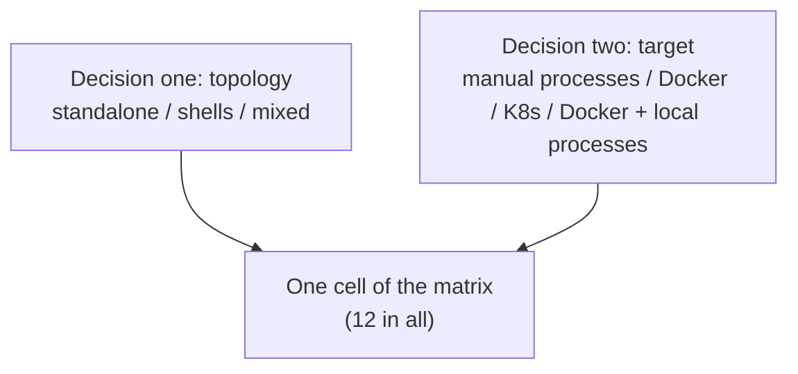

# BrickKit — part 8 of 9 (English)

Contains: docs/en/09-patterns/05-deployment-selection.md, docs/en/10-troubleshooting/README.md, docs/en/10-troubleshooting/01-up-down-issues.md, docs/en/10-troubleshooting/02-local-debug-issues.md, docs/en/10-troubleshooting/03-config-conflict-issues.md, docs/en/10-troubleshooting/04-git-auth-issues.md, docs/en/10-troubleshooting/05-build-issues.md, docs/en/10-troubleshooting/06-shell-issues.md, docs/en/10-troubleshooting/07-migration-issues.md

File paths below are relative to the repository root, https://raw.githubusercontent.com/brickKit/brickKit/main/ ; links inside pages are relative to this file

Next: https://raw.githubusercontent.com/brickKit/brickKit/main/llms/en/09.md

---

> File: docs/en/09-patterns/05-deployment-selection.md

# Choosing a deployment shape

This page answers one question only: **what should a project with N components actually run as?** It doesn't teach you
how to build a shell (see [Writing a shell](../../docs/en/04-shell/05-shell-development.md)), nor the steps to put a component into a
shell (see [Managing members](../../docs/en/04-shell/04-members-management.md)). Read this page first, before the project's overall
shape is decided.

## Two decisions, plus one switch

**Decision one: topology — how many containers do the components end up in?**

- **All standalone**: each component its own container (or Pod). This is the shape you get by writing nothing extra.
- **All in shells**: as many components as can be merged are compiled into a few shells, one container per shell.
- **Mixed**: some in shells, some standalone. This is usually the norm, not a compromise: some components **structurally**
  can't go into a shell — a pure frontend served by nginx has no backend process to compile in; a stateless gateway is
  often kept standalone on purpose, so it can scale on its own load.

A shell is itself an ordinary component (marked `kind: shell` in `brickkit.yaml`); the members it can host are written in
`shell.members` of its `component.yaml`, and **which it hosts this time** is written in the deploy file — member entries
nested under the shell entry's `members`. So topology is decided **per deploy file**: the development machine's
`deploy.yaml` can be all standalone while production's `deploy.prod.yaml` gathers a few members into shells, without a word
of `config/` changing.

**Decision two: the deploy target — `docker` (or `podman`) or `k8s`**, written in the deploy file's `target`. This is
almost entirely an infrastructure question, not a performance one: do you have a Kubernetes cluster, do you need
scheduling across machines and self-healing? If not, `docker` drives everything on one machine with `docker compose`, the
simplest to operate, fit for local development, demos, and small-scale or single-machine production. If so, `k8s`
generates Deployments / Services / Ingresses. The topology decision applies unchanged; switching targets is switching one
deploy file.

**The switch: `mode: debug` / `mode: local` — pull one or two components onto your machine as processes, while the rest
runs in containers as usual.**

- `mode: debug`: you start the process in your IDE, and the platform only makes sure others can find it. It can only be
  written in the personal `deploy.local.yaml`.
- `mode: local`: the platform recognises the start command itself, starts the process and supervises it.

Both **exist only on Docker / Podman**, and are refused when the deploy target is `k8s` — a Pod in the cluster can't reach
your laptop. They combine with any topology: a process on this machine can depend on standalone components, on shells, or
on a member inside a shell; a member inside a shell can itself be pulled out to debug.

The two decisions really are two independent axes, so this is a matrix, not a few preset names:



## One way outside the platform: starting things by hand

Nothing stops you from starting every component as an ordinary process (`go run`, `uvicorn`, or your language's
equivalent), without going through `brickkit up` at all.

**The boundary first: this isn't a shape the platform manages; the platform doesn't even know it exists.** Dependency
resolution, environment variable injection, health checks, migration order and service discovery all don't happen,
because you didn't call it. Which port each process listens on, every variable a real deployment would inject, the start
order — you reconstruct all of it yourself. That's a direct consequence of "the CLI exits when done, with no long-running
service": the platform exists only while a command runs.

It's still entirely legitimate and very common — usually the fastest development loop (no images to build, breakpoints
attach directly).

**A trick worth knowing: have the CLI work out the environment variables for you.** In `deploy.local.yaml`, temporarily
mark the component you'll run by hand `mode: debug`, run `brickkit up --dry-run` once, and read the generated
`.brickkit/generated/local-debug.<versioned service name>.env` — exactly the full set of variables a real deployment would
give it. For instance, `shop/order` depending on the shell member `shop/stock`:

```text
COMPONENT_ID=shop/order
COMPONENT_VERSION=0.1.0
SHOP_STOCK_ENDPOINT=http://localhost:18082
```

Copy what you need, then delete that line (or `brickkit local off`). `deploy.local.yaml` is never committed anyway, so it
affects no one. One thing the trick doesn't cover: addresses you wrote by hand in `config/` assuming the container network
(like `http://host.docker.internal:8000`) — the platform doesn't parse config values and won't rewrite them to
`localhost` for you, just as with `mode: debug` itself.

## The matrix

|  | Manual processes | Docker | K8s | Docker + local processes |
| --- | --- | --- | --- | --- |
| **All standalone** | [1. The starting point before shells](#1-all-standalone--manual-processes) | [2. The standard shape while one machine is enough](#2-all-standalone--docker) | [3. The most generous end](#3-all-standalone--k8s) | [4. Debug one component, keep the rest real](#4-all-standalone--docker--local-processes) |
| **All in shells** | [5. Testing a shell's own orchestration alone](#5-all-in-shells--manual-processes) | [6. Squeezing memory when one machine isn't enough](#6-all-in-shells--docker) | [7. The tightest end](#7-all-in-shells--k8s) | [8. Debug one component, keep the shells real](#8-all-in-shells--docker--local-processes) |
| **Mixed** | [9. Everyday development once shells are in use](#9-mixed--manual-processes) | [10. Where most real projects end up](#10-mixed--docker) | [11. The middle ground on resources](#11-mixed--k8s) | [12. The combination closest to real development](#12-mixed--docker--local-processes) |

There's no 13th cell "K8s + local processes": `mode: debug` / `mode: local` meeting `target: k8s` in a deploy file is
refused while loading, the error pointing at the offending entry (`components[N].mode`).

### 1. All standalone × manual processes

**What it is**: every component used is an ordinary process you start by hand, with no containers and no `brickkit up`.

**When**: the most common starting point for developing one component, especially while the project has no shells yet.
When you want the fastest "change code, see the effect" loop.

**Upside**: no image-building step; no container layer between a process and the addresses it connects to, so a problem
has only two variables to check; no need to install Docker.

**Cost**: injection, health checks, service discovery and migration order are all for you to reconstruct; with more
components, assembling a dozen sets of environment variables by hand is real labour and error-prone. The `--dry-run`
trick above saves most of it.

### 2. All standalone × Docker

**What it is**: one Compose service per component, driven end to end by `brickkit up`: address injection, health checks,
starting in dependency order, migrations.

**When**: the default shape while one machine can hold the components. "Can hold" is a real number: each process's memory
floor is almost entirely set by its language runtime — Go / Rust 8–20 MB, Python / Node 40–90 MB, JVM 200–450 MB (typical
orders of magnitude for each runtime; measure your own components). Twenty idle Go components add up to under half a GB;
twenty idle Spring Boot components already take 4–9 GB without doing anything. Stay in this cell until that sum really
doesn't work out on the machine you deploy to.

**Upside**: every component can be started and stopped on its own, and trouble affects only itself; one component means
one container, one log, one health state — the simplest to troubleshoot.

**Cost**: every component pays its own runtime memory floor — the very reason shells exist; a single-machine shape, with no
scheduling across machines and no self-healing.

**Worth knowing**: measure before deciding "it doesn't fit" (`docker stats`); don't take numbers off the table — a
50-component project may run only a few locally, because most are `mode: disable` this time, or nothing needs them.

### 3. All standalone × K8s

**What it is**: one Deployment + Service per component, with addresses resolved by the cluster's native Service DNS.

**When**: the cluster has resources to spare, and there's no need to trade merging for a lower memory floor. Every
component keeps its own `replicas` and its own `resources`.

**Upside**: truly independent horizontal scaling; scheduling across machines and failure recovery work per component.

**Cost**: the highest operational complexity — it needs real cluster administration; the machine running `up` needs
`kubectl`; many components means many Deployment / Service objects.

**Worth knowing**: on K8s, `expose: true` needs `hostname` (Ingress routes by domain name), and Docker's `exposePort` does
nothing; a missing `hostname` is stopped by `up --dry-run`. Addresses in `config/` that assume a single-machine Docker
network have to be changed when moving to K8s — giving different values per environment with the deploy file's `vars:` is
the least work.

### 4. All standalone × Docker + local processes

**What it is**: everything is a real container except the components you marked `mode: debug` or `mode: local`. The
platform makes the other containers resolve that component's versioned service name to your machine (`extra_hosts` pointing
at `host-gateway`). Callers keep the same service name — `extra_hosts` only changes where it resolves — and the port
becomes your `localPort`, which by default is the component's declared port, so often nothing in the address changes.

**When**: you want "the rest is real" and also "no image rebuild for changing this one component". It's only a
development-time overlay; it doesn't decide the production topology.

**Upside**: zero changes to component code; several components can be pulled out at once, each with its own `localPort`;
everything the process on this machine depends on still gets the real addresses the platform works out.

**Cost**: when something can't connect, first ask "does this name resolve to my machine or to a container", rather than
checking the network in general; container-network addresses written by hand in `config/` aren't rewritten.

**Worth knowing**: a `mode: debug` component gets a `local-debug.<service name>.env` for the IDE to load, with multi-line
values and values holding special characters already escaped by shell rules. It **runs no database migration** — the
migration step went away together with its container, so a component with a migration has to have it run by hand the first
time (see [Local debugging](../../docs/en/02-project-guide/03-local-debug-workflow.md)).

### 5. All in shells × manual processes

**What it is**: the shell's own program started straight on your machine, without any orchestration. What you're testing
is the shell's own multi-module orchestration. The platform isn't there, so `BRICKKIT_SERVED_MEMBERS` /
`BRICKKIT_SERVED_MEMBERS_CONFIG` are yours to assemble (or hard-code for the test).

**When**: needed almost only by whoever builds and tests shells: verifying the shell's start order, health check and
failure isolation between modules without the container layer, before handing it to a real deployment.

**Upside**: the fastest loop for shell development; "a bug in the shell's orchestration" can be separated cleanly from "a
problem in the container layer".

**Cost**: none of the platform's guarantees exist here — it can only prove the shell behaves right on data you assembled
yourself. The exact shape of the two variables is in [Config as JSON](../../docs/en/04-shell/02-json-injection.md).

**Worth knowing**: the module registry inside a shell should be keyed by **the full component ID plus version**, so that a
real deployment can host two versions of one component at once — a trap that only shows up when two versions really are
fed in, worth practising on purpose in this cell.

### 6. All in shells × Docker

**What it is**: as many components as possible compiled into a few shells; one Compose service per shell, and members
generate no service container of their own. A caller's `*_ENDPOINT` for a member points at the shell:
`http://<shell service name>:<the member's own port>`. The members' versioned service names are also kept as network
aliases of the shell's container, so caller code — which reads the variable anyway — doesn't change.

**When**: when the memory sum of cell 2 really doesn't work out — not before. Before doing it, try cheaper things first:
give the expensive components a lighter runtime (compiling JVM components into GraalVM native images drops the memory floor
from hundreds of MB to tens, with the deployment shape unchanged); check whether the components driving the number up could
be `mode: disable` this time anyway.

**Upside**: a shell carries one runtime floor and one connection pool, not N; fewer containers, faster start-up, fewer logs
to watch and fewer things to restart.

**Cost**: members sharing a shell share a failure domain (one crash can take down the other modules, unless the shell is
built very carefully) and a unit of scaling (one member can't get extra replicas on its own).

**Worth knowing**:
- Members' migrations **are still run by the platform**: with the member's own image and config, and the shell starts only
  once they succeeded (see [Migrations and shells](../../docs/en/05-migration/04-shell-interaction.md)). So every member must have an
  image of its own.
- For a shell image built on this machine, `brickkit build` records in a label which member versions it compiled in, and
  `up` compares that label with `shell.members` in the shell's `component.yaml`: a mismatch stops it (`IMAGE_STALE`),
  rather than a shell missing a member quietly starting. An image without the label (built by hand) only gets a warning
  (`IMAGE_UNVERIFIED`); pulled images aren't checked — a released version's image matches its `component.yaml` by
  construction.
- Fields on a member entry describing "how its own container is deployed" (`expose`, `replicas`, `resources` and so on) do
  nothing inside a shell; they're kept for when the member falls back to a standalone component.
- Merging can create a start wait cycle; `up` stops it and gives three ways out (see
  [Managing members](../../docs/en/04-shell/04-members-management.md#start-cycles-caused-by-merging-and-skipwaitfor)).

### 7. All in shells × K8s

**What it is**: the same merging against a cluster: one Deployment per shell; one Service per member, whose `selector`
picks the shell's Pod and whose port is the member's own declared port; members generate no Deployment of their own.

**When**: the cluster's resources really are tight, and pushing the total cost down matters more than scaling a member on
its own.

**Upside**: both "merging saves memory" and "K8s self-healing and scheduling across machines". With network policies on, a
member's callers and dependencies are counted into the shell's rules automatically.

**Cost**: every cost of cell 6 holds unchanged; so does every K8s cost of cell 3 — merging doesn't lower K8s' own demands.

**Worth knowing**: Pods have no start order on K8s, so wait cycles caused by merging aren't stopped here, and `skipWaitFor`
only warns and does nothing; members' migrations are still their own Jobs.

### 8. All in shells × Docker + local processes

**What it is**: cell 4's overlay, only "the rest" is shells. Both directions work:

- A process on this machine depends on a member: the address it gets is a real `http://localhost:<port>` — the mapping is
  opened on the **shell's** Compose service (the member has no service of its own), on the port the member declares, which
  the shell must listen on anyway.
- A member itself is pulled out: in `deploy.local.yaml`, write `mode: debug` and `localPort` on that member under the shell
  entry's `members`; the shell doesn't host it this time, and it runs on your machine.

**When**: the component you're changing has to talk to the real, already merged rest, and you don't want to rebuild any
image.

**Upside**: no need to know which shell a member is in; the rest stays whole and real.

**Cost**: every limit of cell 4 applies unchanged. With a member pulled out for debugging, the shell hosts one module fewer
this time — the shell must handle one item fewer in `BRICKKIT_SERVED_MEMBERS` correctly.

### 9. Mixed × manual processes

**What it is**: the components used this time are started by hand in their real shapes — standalone components as in cell
1, shells as in cell 5.

**When**: everyday development once the project's production topology uses shells. Start only the few you're changing,
and the local result still reflects real address resolution and cross-process calls.

**Upside**: keeps the fastest loop past the scale of "all standalone"; reconstructing the real shape lets you hit
shape-related bugs locally (a shell registry keyed wrong, say).

**Cost**: the most manual preparation of any cell; nothing checks that the "who is where" you set up by hand agrees with the
deploy file.

### 10. Mixed × Docker

**What it is**: some standalone containers, some in shells, all driven by one `brickkit up`. Who is where is decided
entirely by where entries sit in the deploy file (at the top level, or under a shell's `members`).

**When**: where a mature project usually ends up, and usually **structurally**, not as a resource compromise — components
like frontends and gateways don't belong in shells to begin with. When you're unsure which cell an on-premises delivery
should use, this is usually the answer.

**Upside**: standalone where independence is needed, memory saved everywhere else; both kinds of entry sit side by side in
one deploy file, with no special handling.

**Cost**: troubleshooting means carrying two mental models at once; the costs of the merged half and of the standalone half
each hold unchanged — mixing doesn't average them out.

**Worth knowing**: an old version of a component running standalone while a new version runs in a shell can coexist with
zero coordination (see the end of this page).

### 11. Mixed × K8s

**What it is**: cell 10's mixed topology against a cluster: standalone components each with a Deployment + Service,
members' Services pointing at the shell Pods.

**When**: resources neither tight nor generous: most components stay in shells to keep the total cost down, and the few
that really need their own replica count or resource quota are picked out and deployed on their own. Unlike cell 10, mixing
here is often a **resource-tuning** decision — a component that could structurally be merged perfectly well is split out
deliberately, to scale on its own.

**Upside**: the most flexible resource allocation; address resolution and network policies support mixing natively, with
no extra configuration.

**Cost**: the full K8s operational cost and the full merging cost at once; the most places to look when something goes
wrong: K8s itself, a shell's internal orchestration, ordinary containers.

### 12. Mixed × Docker + local processes

**What it is**: the real mixed topology running in Docker, with one more component pulled onto your machine. The
combination closest to real development, because "the rest" is the project's real production shape.

**When**: the component you're changing has to be checked against the topology the project will really use.

**Upside**: without touching production, it's the nearest thing to "debugging against production"; address resolution
works in both directions (see cells 4 and 8).

**Cost**: you have to understand shell merging, the address resolution of processes on this machine and the behaviour of
ordinary containers all at once — there's no simpler mental model to fall back on.

## One conclusion across all 12 cells: versions side by side need no extra care

No cell changes how several versions of the same component coexist. Versioned service names make coexistence independent
of topology and of deploy target: old callers and new ones, a version running standalone and a version in a shell, can all
coexist in one deployment. The platform doesn't check whether old and new versions work together correctly — keeping
contracts compatible is the component author's responsibility (see
[Several versions side by side](../../docs/en/03-component-guide/09-multi-version-coexistence.md)).

## Comparing two environments

Each environment has one complete deploy file, so comparing two environments needs no dedicated command; two ordinary
`diff`s are enough:

1. `diff -u deploy.yaml deploy.prod.yaml` shows **what you wrote differently**.
2. A `diff` of two `up --dry-run` outputs shows **what those differences lead to** — which components don't start as a
   result, and why.

Real output below: `demo/caller` requires `demo/hello` and optionally depends on `demo/bus`; the production file switches
to `k8s` and turns `demo/hello` off:

```text
$ diff -u deploy.yaml deploy.prod.yaml
--- deploy.yaml
+++ deploy.prod.yaml
@@ -1,10 +1,8 @@
-# deploy.yaml — how this project is deployed: the target, and which components run and how.
-# The team file: commit it. Your personal copy is deploy.local.yaml (brickkit local on).
-target: docker # docker | podman | k8s
-
+target: k8s
 components:
   - id: demo/hello
+    mode: disable
   - id: demo/bus
   - id: demo/caller
     expose: true
-    exposePort: 18080
+    hostname: shop.example.com
```

```text
$ diff <(brickkit up --dry-run 2>&1 | grep -v '^{') \
       <(brickkit up --dry-run -f deploy.prod.yaml 2>&1 | grep -v '^{')
1c1,2
< 🚀 Starting project my-shop (target: docker)
---
> Using deploy.prod.yaml (--file)
> 🚀 Starting project my-shop (target: k8s)
3,5c4,6
<    ✅ demo/hello@1.0.0   starting (demo/caller needs it)
<    ✅ demo/bus@1.0.0     starting (demo/caller needs it)
<    ✅ demo/caller@1.0.0  starting (top-level)
---
>    ⬜ demo/hello@1.0.0   disabled explicitly (mode: disable)
>    ⬜ demo/bus@1.0.0     not starting (nothing above it is starting)
>    ⬜ demo/caller@1.0.0  not starting (required dependency demo/hello is not starting)
```

(The second `diff` goes on with differences in start order and generated files, cut here.)

The second one gives the consequences directly: not only does `demo/hello` not start, `demo/caller` doesn't either (it
requires `demo/hello`), and `demo/bus`, with nothing above needing it, doesn't start. The `mode: disable` line in the first
`diff` alone doesn't tell you any of that.

- `grep -v '^{'` filters out the JSON log lines the CLI writes on stderr; otherwise they mix into the human-readable output
  and the `diff` is full of noise.
- What's compared here is **the start decision**, not the generated deployment files themselves: one side is
  `compose.yaml`, the other a set of Kubernetes manifests, which can't be compared line by line anyway.

---

> File: docs/en/10-troubleshooting/README.md

# Troubleshooting

When something goes wrong, find the page for the situation, then the section for the symptom. Every section has the same
form:

- **Symptom**: what you see — an error, a config that didn't take effect, an address that can't be reached.
- **Cause**: why it happens.
- **Fix**: what to change.

| Situation | Page |
| --- | --- |
| `brickkit up` / `down` fails, components won't start | [up / down problems](../../docs/en/10-troubleshooting/01-up-down-issues.md) |
| Debugging a component in your IDE, processes on this machine | [Local debugging problems](../../docs/en/10-troubleshooting/02-local-debug-issues.md) |
| Conflict blocks in `config/`, `$var:` not found, config not taking effect | [Config conflict problems](../../docs/en/10-troubleshooting/03-config-conflict-issues.md) |
| Fetching a component from a Git repository fails | [Git authentication problems](../../docs/en/10-troubleshooting/04-git-auth-issues.md) |
| `brickkit build`, images | [Build problems](../../docs/en/10-troubleshooting/05-build-issues.md) |
| Shells and members | [Shell problems](../../docs/en/10-troubleshooting/06-shell-issues.md) |
| Database migrations | [Migration problems](../../docs/en/10-troubleshooting/07-migration-issues.md) |
| `brickkit lint`, JSON Schemas in your editor, the component table in `AGENTS.md` | [lint and schema problems](../../docs/en/10-troubleshooting/08-lint-and-schema-issues.md) |

**When the error carries an error code**, check [Error codes](../../docs/en/06-architecture/09-error-codes.md) first: it lists, by
error code, every error title the CLI prints, and searching that page for the title finds the cause and the fix. This
module covers what error codes can't — cases with no error but a wrong result, and the longer story behind an error.

---

> File: docs/en/10-troubleshooting/01-up-down-issues.md

# up / down problems

`up` works in a fixed order: load and check the three layers → decide who starts this time → resolve dependencies →
generate the deployment files → check images → run migrations → call the engine. Which step an error appears in roughly
tells you which layer the problem is in. The whole flow is in [Starting and stopping](../../docs/en/02-project-guide/06-up-and-down.md).

## Images don't exist

**Symptom**

```text
❌ Error: these images are built locally and have not been built yet
   demo/hello@1.0.0: demo-hello:1.0.0
   demo/caller@1.0.0: demo-caller:1.0.0
```

Or `Error: image pull not authorized`, `Error: image not found`.

**Cause and fix**

`up` never builds images. For images built on this machine, run `brickkit build` first; for pulled ones, make sure you're
logged in to the image registry and the address and tag are right. More in [Build problems](../../docs/en/10-troubleshooting/05-build-issues.md).

## A required config item is missing

**Symptom**

```text
❌ Error: a required component config item has no value
   Missing config: demo/widget@0.1.0 → API_URL
   Reason: The component declares it in configSchema.required without a default — the platform can't derive this one, so the project has to supply it
   Suggestions:
   1. Give it a value in config/demo-widget.yaml:
    API_URL: <value>
   2. The value may be ${ENV_VAR} (real value in .env), $var:NAME (shared, from config/vars.yaml) or file://path
```

**Cause**

The component declares a required config item with no default — usually an address the platform can't work out (a
service deployed by another project) or a credential. With it missing, the component would still start and look healthy,
yet have a call path that never works; so the platform stops it before starting, instead of letting it slip through quietly.

**Fix**

Fill it in in `config/<component>.yaml`, as the suggestion says. For a component just `upgrade`d, required items the new
version added appear in the config file as `KEY: ""`, and need filling in too.

## Port conflicts

**Symptom one: two components want the same host port.**

```text
❌ Error: deploy.yaml failed validation
   File: deploy.yaml
   components[2].exposePort: conflicts with components[0].exposePort (host port 18080 is already taken)
   Suggestion: Full field reference: brickkit docs 11-reference/03-deploy-yaml-schema (online: https://github.com/brickKit/brickKit/blob/v1.1.0/docs/en/11-reference/03-deploy-yaml-schema.md)
```

**Fix**: give one of them another `exposePort` (or `localPort`).

**Symptom two: another program on this machine holds the port.** Validation passes, then `docker compose` fails to start
the container, with `port is already allocated` or `address already in use` in the engine's output.

**Fix**: find the program holding it (`ss -ltnp | grep <port>`) and stop it, or pick another `exposePort`.

**Symptom three: two components on a shell use the same port** — see
[Shell problems](../../docs/en/10-troubleshooting/06-shell-issues.md#two-components-on-a-shell-want-the-same-port).

## A migration fails

**Symptom**

```text
❌ Error: database migration failed
   Component: shop/stock@0.2.0
   View logs: docker compose -p brickkit-shop logs shop-stock-0-2-0-migration
```

**Cause and fix**

The migration exited non-zero, so the main service won't start. Read the migration container's logs as the suggestion
says, fix it, and `up` again; the migration runs once more. More in [Migration problems](../../docs/en/10-troubleshooting/07-migration-issues.md).

## The component's logs look fine, yet the platform says it's unhealthy

**Symptom**

`up` waits to the end and reports `Error: some components did not start properly`, or the components depending on it never
start. Meanwhile the component's own logs say it's ready and listening on its port.

**Cause**

On Docker, the health check runs **inside** the container, through the image's `/bin/sh`. For `type: http` it's:

```text
wget -q --spider http://localhost:8080/healthz || curl -fsS http://localhost:8080/healthz || exit 1
```

and for `type: tcp` it's `nc -z localhost 8080`. So `type: http` needs `/bin/sh` plus `wget` or `curl` in the image, and
`type: tcp` needs `/bin/sh` plus `nc`. When they're missing, the command always fails and the container is always judged
unhealthy — however healthy the component itself is. `scratch` and distroless images have no shell at all, so **neither
type** can pass there; images based on `busybox` or `alpine` have all of it. Another common cause: a wrong health check
path (`healthCheck.path` in `component.yaml` differs from what the component actually serves).

On Kubernetes this problem doesn't exist: the probes (`httpGet`, `tcpSocket`) are sent by the kubelet from outside the
container and need nothing in the image.

**Fix**

- Look at the container's health-check record: `docker inspect --format '{{json .State.Health}}' <container name>`; the
  output of the last few entries says `wget: not found`, `nc: not found` or that `/bin/sh` doesn't exist.
- Check what the image has: `docker run --rm --entrypoint sh <image> -c 'command -v wget curl nc'` (when even this fails,
  the image has no shell).
- Give the image the tools: build the final stage on `busybox` or `alpine` (a few MB; they carry `sh`, `wget` and `nc`).
  Switching from `http` to `tcp` only helps when the image has `nc` but neither `wget` nor `curl`.
- If the image must stay without a shell, `healthCheck.type: none` is the remaining choice: components depending on it
  then wait only for its container to start, not for it to be ready, and on Kubernetes it gets no probes either — so they
  have to retry on their own while it comes up.
- When the path doesn't match, change `healthCheck.path`.

## A component with a cold start over a minute is judged failed

**Symptom**

A slow-starting component (a heavy Spring Boot app, a Django project that preloads a lot, .NET's first JIT pass): on
Docker, `up` reports it unhealthy; on Kubernetes the Pod keeps restarting, stuck in `CrashLoopBackOff`. And the container's
own logs look perfectly normal throughout — it just hasn't finished starting yet.

**Cause**

The health check's rhythm is fixed by the platform: every 10 seconds, a 3-second timeout, 3 failures in a row means
unhealthy. The platform gives every component a 60-second start-up grace period, during which failures don't count. With a
cold start over 60 seconds, it isn't ready when the grace period ends and is declared dead; on Kubernetes it's killed and
restarted, starts over from scratch, and never comes up.

**Fix**

Raise the grace period in the component's `component.yaml`, with room to spare:

```yaml
healthCheck:
  type: http
  path: /healthz
  startPeriodSeconds: 180
```

The grace period only delays "declaring it dead", never "declaring it alive": a component ready in two seconds still turns
healthy in two seconds, so setting it generously costs nothing.

## `up` hangs, and the migration container keeps running

**Symptom**

`up` never returns. In `docker compose -p brickkit-<project> ps` the main service sits at `Created` while the migration
container is `running`; the migration container's logs say the service is ready and listening on its port.

**Cause**

The migration container and the main service run the same image, differing only in the command argument. When the
component's entry program meets an argument it doesn't know (`migration.command` misspelled), it doesn't exit with an
error — it **starts the service as usual**. The migration container becomes a second service that keeps running and never
finishes; the main service waits for it to "finish successfully" before starting, and waits forever.

**Fix**

- The entry program must fail and exit at once (with a non-zero exit code) on an argument it doesn't know; see
  [The migration container](../../docs/en/05-migration/01-migration-service.md). Check this **before** reading environment variables
  or connecting to the database, or a misspelled argument shows up as a misleading "can't connect to the database".
- Check the spelling of `migration.command`.
- `Ctrl+C` first, then `brickkit down` to clear the stuck containers.

## `docker compose logs` shows nothing

**Symptom**

The component is clearly running, yet `docker compose logs` prints nothing, or says it can't find the service.

**Cause**

`docker compose` finds containers by **project name**. The Compose project name BrickKit generates is
`brickkit-<project name>`, while running it directly in the project directory, Compose uses the directory's name and looks
at another (empty) project.

**Fix**

Add `-p`:

```bash
docker compose -p brickkit-my-shop logs -f demo-caller-1-0-0
```

The "View the logs" line `up` prints at the end is the right command.

## Deployed to the wrong cluster (or nearly)

**Symptom**

```text
❌ Error: the cluster currently connected is not the one the configuration specifies
   Required by the deploy file (k8s.context): prod-cluster
   Current context: dev-cluster
   Suggestions:
   1. Switch to it: kubectl config use-context prod-cluster
   2. If dev-cluster is where you mean to deploy: use a deploy file whose k8s.context names it (brickkit up -f <file>)
   3. Don't continue until you are sure — deploying to the wrong cluster can't be undone
```

**Cause**

The deploy file's `k8s.context` names one cluster while `kubectl`'s current context is another. Deploying to the wrong
cluster can't be taken back, so `up` checks first and stops when they don't match.

**Fix**

`kubectl config use-context <the one in the deploy file>`, or use the deploy file naming the current cluster (`-f`).
There's no command-line flag to switch clusters for one run: one deploy file per cluster.

## `down` fails on Podman: `permission denied`

**Symptom**

The deploy target is `podman`. `up`, `status` and ordinary requests all work, yet `down` (or `up` when it cleans up
leftover containers) fails, with this in the engine's output:

```text
Error: removing container ...: 1 error occurred:
	* rootless netns: kill network process: permission denied
```

BrickKit recognises this signature and adds a line to the error's suggestions:

```text
This is a known Ubuntu/Debian AppArmor gap blocking rootless Podman's network teardown (containers/podman#27372), not a BrickKit or Podman bug — see docs/en/10-troubleshooting/01-up-down-issues.md for the fix
```

On an affected machine it reproduces **every** time; it isn't intermittent. The container itself is usually already gone
(Podman falls back to `SIGKILL`), but network resources may not be released, and the command exits with a failure — easy to
mistake for "it didn't stop at all this time".

**Cause**

Podman running without root connects containers to the network through a helper process called `pasta`. When stopping a
container, Podman sends `pasta` a `SIGTERM` so it tears the network down cleanly. Ubuntu's / Debian's default AppArmor
policy blocks that signal. It's a gap in how the distribution packages its security policy; Podman upstream has exactly the
same report ([containers/podman#27372](https://github.com/containers/podman/issues/27372)), and Debian has tracked the
same error ([Debian #1100135](https://bugs.debian.org/cgi-bin/bugreport.cgi?bug=1100135)).

**First, check whether you're affected**

```bash
scripts/podman/check-environment.sh
```

It's essentially read-only; to get a real answer it starts a throwaway test container — you can't tell from configuration
files alone, since whether it's blocked depends on the policy currently loaded in the kernel. Exit code `0` is fine, `1`
means the problem reproduced, `2` means the check itself couldn't run (Podman not installed, say).

**The fix**

```bash
scripts/podman/fix-apparmor.sh
```

**Read the script before running it — it's destructive.** It resets Podman to a clean state: deleting your existing Podman
containers, images and volumes, reinstalling `podman` and `apparmor-utils` with apt, and regenerating the base
configuration. It needs `sudo`, is verified only on Ubuntu / Debian, and doesn't touch Docker. It takes two routes, verified
to fix the problem when used together:

1. **Delete the placeholder `podman` AppArmor profile** (Debian's conclusion): it restricts nothing itself, but gives the
   `podman` process a name, which triggers AppArmor's cross-profile signal mediation. The script first writes a minimal
   file of the same name, unloads it from the kernel, then deletes the file — in the reverse order, the unload command
   can't read the file, and the old profile quietly stays in the kernel.
2. **Put `pasta` into complain mode** (`aa-complain /usr/bin/pasta`): AppArmor only logs this one process, without blocking.
   The rest of the system is unaffected; the cost is that this one process is from then on only monitored, not confined.

The script also handles three things unrelated to this signal that likewise make `up` fail or hang: configuring default
image registries in `registries.conf` (otherwise pulling an image without a registry prefix, like `alpine:3`, fails, or pops
up an interactive choice that hangs a non-interactive `up`); setting `policy.json` (otherwise Podman refuses to pull any
image); enabling `podman.socket` (`podman compose` talks to Podman through it, and without it reports `failed to connect to
the docker API`). When only the socket is missing, run just:

```bash
systemctl --user enable --now podman.socket
```

**Two further prerequisites**

- **A terminal opened from a snap-packaged application** (VS Code installed as a snap, say) redirects `$XDG_DATA_HOME` to a
  versioned path, and after a Podman upgrade Podman reports `database configuration mismatch`. `check-environment.sh`
  flags it; the fix is setting `export XDG_DATA_HOME="$HOME/.local/share"` and `export XDG_CONFIG_HOME="$HOME/.config"` in
  your shell's start-up file.
- **`podman compose` should use Docker's own Compose V2 plugin.** `podman compose` has no compose implementation of its
  own; it only forwards to an external program it finds. What's verified is Docker and Podman installed on the same
  machine, with it forwarding to Docker's Compose plugin. Run `podman compose version`: `Executing external compose
  provider ".../docker-compose"` means that route; when it shows the separate `podman-compose` project, working with BrickKit
  hasn't been verified.

## `down` can't stop a `mode: local` component

**Symptom**

After `brickkit down`, a `mode: local` component is still running; `down` only printed a session's process ID.

**Cause**

A `mode: local` process is supervised in the foreground by the terminal that ran `up`; it isn't a container. `down` only
looks after containers, and can't reach into another terminal's process tree.

**Fix**

`Ctrl+C` in that terminal. A normal stop prints no crash summary.

## Config changed, no difference after `up`

**Causes and fixes**

- The key name is wrong: `up`'s output has a warning saying it "is not declared in the component's configSchema, so it has
  no effect"; see [Config conflict problems](../../docs/en/10-troubleshooting/03-config-conflict-issues.md#config-written-but-not-taking-effect).
- The file changed isn't the one read this time: with local mode on, `deploy.local.yaml` is read, while you changed `vars:`
  in `deploy.yaml`. `brickkit local status` shows which one is read this time.
- What changed is code, not config: after changing code, `brickkit build --force`; see [Build problems](../../docs/en/10-troubleshooting/05-build-issues.md).

---

> File: docs/en/10-troubleshooting/02-local-debug-issues.md

# Local debugging problems

Local debugging pulls one component onto your machine with `mode: debug` and runs it in your IDE, while the other
components run in containers as usual. The whole flow is in [Local debugging](../../docs/en/02-project-guide/03-local-debug-workflow.md).

## `deploy.local.yaml` is out of date

**Symptom**

After `git pull`, `up` (and other commands) refuse to run:

```text
❌ Error: deploy.local.yaml is out of date: it does not match the components in brickkit.yaml
   File: deploy.local.yaml
   No entry for: demo/bus
   Reason: Local mode is on and brickkit.yaml changed, but your deploy.local.yaml was not updated
   Suggestions:
   1. Option A (recommended): brickkit local refresh regenerates deploy.local.yaml from deploy.yaml and keeps the old one as deploy.local.yaml.bak
   2. Option B: add or remove the listed entries in deploy.local.yaml by hand
   3. Option C: brickkit local off switches back to the team's deploy.yaml
```

**Cause**

A teammate added (or removed) a component. `deploy.local.yaml` replaces `deploy.yaml` as a whole, and every component
version must have exactly one entry; the CLI doesn't know how the new component should run on your machine, so it stops
rather than guessing for you.

**Fix**

Most of the time, option A:

```bash
brickkit local refresh
```

```text
✅ Generated a fresh deploy.local.yaml from deploy.yaml. The old one is backed up at deploy.local.yaml.bak.
ℹ️ The old file had 2 local changes; merge the ones you still need into the new deploy.local.yaml by hand:
   - [demo/hello] mode: debug (now unset)
   - [demo/hello] localPort: 8080 (now unset)
```

Copy the lines you still want back into the new file, going down the list. When only one or two entries are missing,
adding them by hand (option B) is quicker.

## `mode: debug` doesn't take effect

**Symptom one: written in `deploy.yaml`, and refused.**

```text
❌ Error: deploy.yaml failed validation
   File: deploy.yaml
   components[0].mode: mode: debug can only be written in deploy.local.yaml: it records that you are debugging this component on your machine right now, which is not a team decision. Run brickkit local on and set it there
   Suggestion: Full field reference: brickkit docs 11-reference/03-deploy-yaml-schema (online: https://github.com/brickKit/brickKit/blob/v1.1.0/docs/en/11-reference/03-deploy-yaml-schema.md)
```

**Cause**: `mode: debug` is your personal fact of the moment, and can only be written in the personal file. **Fix**:
`brickkit local on`, and write it in `deploy.local.yaml`.

**Symptom two: written in `deploy.local.yaml`, yet the component still runs in a container.**

**Cause**: local mode is off, so commands read `deploy.yaml` and never look at `deploy.local.yaml`. Or this run used `-f` /
`--no-local`, which skip local mode.

**Fix**: confirm which file is read:

```bash
brickkit local status
```

```text
Local mode: off
deploy.local.yaml: present (not read while local mode is off)
```

`brickkit local on` turns it on. With local mode on, the first line of `up`'s output says `Local mode is on: using
deploy.local.yaml (brickkit local off switches back to deploy.yaml)`; no such line means `up` didn't read it. The other
commands (`down`, `status`, `sync`, `lint`) print no such line — for them, `brickkit local status` says which file is read.

**Symptom three: the deploy target is `k8s`, and it's refused.** A Pod in the cluster can't reach your laptop, so
`mode: debug` and `mode: local` only work under `docker` / `podman`. In the personal file you can change `target` to
`docker` and debug on your machine.

## Containers can't reach your process

**Symptom**

The caller (in a container) requests your process on this machine and gets connection refused, a timeout, or a 502/503.

**Causes and fixes**, by how often they come up:

1. **The port doesn't match.** `localPort` must be the port your process **actually listens on**. A process hard-coded to
   listen on 8080 needs `localPort` to be 8080. The platform replaces the port in the address callers get with
   `localPort`; when the two differ, requests land on a port nobody listens on.
2. **The process listens only on `127.0.0.1`.** Containers come in through the host's bridge address (`host-gateway`),
   not through the loopback address, so a process listening only on `127.0.0.1` never receives them. The caller sees:

   ```text
   wget: can't connect to remote host (172.17.0.1): Connection refused
   ```

   while `curl localhost:<port>` on your machine works — which is exactly what makes it hard to track down. Make the
   process listen on all interfaces (`0.0.0.0`): in Go write `:8080`, not `127.0.0.1:8080`; `uvicorn` and Flask's
   development server listen only on `127.0.0.1` by default and need `--host 0.0.0.0`; Node's `listen(port)` without a host
   name listens on all interfaces by default.
3. **The process didn't start, or started in another terminal, on another machine.** On your machine, first
   `curl http://localhost:<localPort>/healthz`; once that works, look at the container side.

What the platform does: in the other containers it resolves your component's versioned service name to the host
(`extra_hosts: <service name>:host-gateway`), and replaces the port with `localPort`. The address string callers get
doesn't change at all — so when troubleshooting, first ask "does this name resolve to my machine, and is someone listening
on that port", rather than checking the network in general.

## The process on this machine reports `relation does not exist`

**Symptom**

The component being debugged reports a missing table as soon as it starts (PostgreSQL's `relation "…" does not exist`, or
the same kind of error from another database). `up`'s output has a note:

```text
⚠️ Note: a mode: debug component's database migration won't run automatically
```

**Cause**

Migrations run in the component's migration container; a component running as a process on this machine has no container,
so the migration is skipped along with it.

**Fix**

Run the migration once yourself: load the variables from `local-debug.<service name>.env` and run the component's migration
command (`migration.command` in `component.yaml`) on this machine.

```bash
set -a && source .brickkit/generated/local-debug.demo-caller-1-0-0.env && set +a
go run . migrate
```

## The process on this machine can't reach an address written in config

**Symptom**

The process on this machine reaches its dependencies fine, but fails to reach one "outside" service, whose address you
wrote by hand in `config/` — `http://host.docker.internal:8000`, say.

**Cause**

The platform rewrites only the dependency addresses it works out itself (`*_ENDPOINT`). Strings you wrote into config by
hand aren't parsed or rewritten, and reach the process as they are — and that address assumes the container network,
which doesn't resolve on the host.

**Fix**

Give it a value that works on this machine in the `vars:` of `deploy.local.yaml` (with `$var:NAME` referencing it in
config): while debugging it's `localhost`, and the team's deploy files are unaffected:

```yaml
# config/demo-caller.yaml
REPORT_URL: $var:REPORT_URL
```

```yaml
# deploy.local.yaml
vars:
  REPORT_URL: http://localhost:8000
```

## A focus run won't start

**Symptom**

`up` in a component's directory, or `up --focus`, stops with one of these:

```text
❌ Error: the focus demo/lb is not a component of this project
   File: deploy.local.yaml
   Suggestions:
   1. brickkit up --focus <id> sets another one; brickkit up --all runs every component
   2. Did you mean: demo/lib?
```

```text
❌ Error: the focus demo/lib is written mode: disable
   File: deploy.local.yaml
   Suggestion: Remove mode: disable from demo/lib, or focus on another component
```

**Cause and fix**

- **Not a component of this project**: `focus:` in `deploy.local.yaml` names a component that isn't in `brickkit.yaml`
  — a typo, or the team removed it. Pick another with `--focus`, or drop the focus with `brickkit up --all`.
- **`mode: disable`**: "run this" and "never run this" at once. Remove the `mode: disable` from the entry, or focus on
  another component.
- **`failed validation` on the `focus` field**: the focus is in `deploy.yaml` (it belongs in your personal file), or
  your personal file says `target: k8s` — a cluster can't reach a process on your machine.
- **`Code that runs from a local repository does not match this run`**: the focus runs from its source, and that source
  either isn't there (`brickkit add <id> --repo`) or holds another version than `brickkit.yaml` (run the `upgrade` the
  error suggests). See [Developing inside the project](../../docs/en/02-project-guide/04-focus-run.md#moving-versions-forward).

## Under a focus, a component didn't start

**Symptom**

A component you expected is listed as `not starting (outside the focus)`.

**Cause**

With a focus, only the focus and the components whose `mode` says they always run (`enabled`, `local`, `debug`) are
starting points; everything else starts only if one of them needs it. A component the focus doesn't depend on — one
that calls the focus, for instance — stays off.

**Fix**

Write `mode: enabled` on that component in `deploy.local.yaml` to pin it for your runs, or run everything with
`brickkit up --all`.

## Debugging a member inside a shell on its own

In `deploy.local.yaml`, write `mode: debug` and `localPort` on that member under the shell entry's `members`. This time
the shell no longer hosts it, it runs on your machine, and the address other components get for it points at your
process. See [Local debugging](../../docs/en/02-project-guide/03-local-debug-workflow.md#debugging-a-shell-member).

---

> File: docs/en/10-troubleshooting/03-config-conflict-issues.md

# Config conflict problems

## Duplicate keys: `up` refuses to start

**Symptom**

```text
❌ Error: unresolved configuration conflicts
   File: config/demo-hello.yaml
   Config item: GREETING
   Line 8: Howdy (your previous value, 1.0.0)
   Line 9: Hi (suggested by 1.1.0)
   Suggestions:
   1. Open the file in a plain text editor, keep the line you want, delete the other one and the comment above them, then run the command again
   2. Do not run yq or your editor's Format Document on this file: they silently drop one of the duplicate keys, and the conflict disappears without being resolved
   💡 Your editor may mark this file as invalid YAML. That is expected: BrickKit wrote the duplicate key on purpose so the conflict cannot be missed
```

Your editor may also mark the file red, complaining about a duplicate key.

**Cause**

During `upgrade`, a config item you had changed also had its default changed by the component's author in the new
version. Only you know which is right, so both values are written into the file, as two lines with the same key:

```yaml
# ⚠️ Config conflict: upgrading to 1.1.0 changed the suggested value of this key.
# Keep one line, delete the other and this comment; until then brickkit refuses to start.
GREETING: Howdy  # brickkit:conflict current 1.0.0
GREETING: Hi  # brickkit:conflict proposed 1.1.0
```

Two same-named keys written by hand by accident give the same error.

**Fix**

Open the file in a plain text editor, keep the line you want, and delete the other one and the two comment lines above.
The `# brickkit:conflict …` marker at the end of the line can go too:

```yaml
GREETING: Howdy
```

Then run the command again. Background in
[Upgrading and config migration](../../docs/en/02-project-guide/07-upgrade-and-migration.md#resolving-a-conflict).

## After yq or "Format Document", the conflict error is gone but the value is wrong

**Symptom**

You ran `yq` on the conflicted file, or clicked "Format Document" in your editor. Afterwards `up` no longer reports a
conflict and the component runs, but the value it reads isn't the one you want — often the new version's default.

**Cause**

The YAML specification doesn't define what to do with duplicate keys. Most third-party tools **silently drop one of them**
(usually the first) when reading, and write the rest back. The conflict block is thus "resolved", only with a value chosen
for you, and you don't know which. That's exactly why BrickKit deliberately uses duplicate keys for conflicts, and warns in
the error not to reformat.

**Fix**

1. Restore the file to before the reformat: `git checkout -- config/<component>.yaml` if it wasn't committed; if it was,
   recover that version from Git history. When the file from before the upgrade is still in `config/.archive/`, you can
   compare against it too.
2. In a **plain text editor** (with the YAML plugin's auto-formatting off), keep the line you want by hand.
3. From then on, don't use any tool that re-serialises YAML on files under `config/` with conflict blocks.

## The variable a `$var:` refers to doesn't exist

**Symptom**

```text
❌ Error: config files reference shared variables that are defined nowhere
   Undefined reference: config/demo-hello.yaml: GREETING → $var:NOPE
   Suggestion: Define the variable in config/vars.yaml, or in the deploy file's vars:
```

**Cause**

`$var:NAME` checks the current deploy file's `vars:` first, then `config/vars.yaml`, and neither has it. The usual
reasons: a misspelled variable name; the variable is written only in the `vars:` of `deploy.prod.yaml`, while this run
uses `deploy.yaml`; local mode is on, and `deploy.local.yaml` was copied long ago, without the `vars:` the team added later.

**Fix**

Define it in `config/vars.yaml` (shared by every environment) or in the current deploy file's `vars:` (this environment
only). Unsure which deploy file this run reads: `brickkit local status`. `brickkit lint` reports the same problem, handy for
catching it before committing.

## Config written but not taking effect

**Symptom**

You wrote an item under `config/`, and the component still runs with its default behaviour. `up`'s output has a warning:

```text
⚠️ demo/hello@1.0.0: GREETTING is not declared in the component's configSchema, so it has no effect
   File: config/demo-hello.yaml
   Declared keys: GREETING
   Suggestion: Did you mean GREETING?
```

**Cause**

The key name is misspelled, or the component's `configSchema` has no such item at all. A config item's name is the
environment variable name injected, and a key not in `configSchema` isn't injected — the component can't read it, takes
its own default branch, and runs normally. An error like this makes nothing crash, so the platform says so with a warning.

**Fix**

Rename it as the "did you mean" suggestion says. Which config items a component has: its `component.yaml`'s
`configSchema`, or the commented-out lines in the `config/<component>.yaml` skeleton.

## Can an environment variable be overridden quietly somewhere else?

**No.** Every config value a component gets can be read straight from the files: what `config/<component>.yaml` says is
what it gets; when it says `$var:NAME`, look in the current deploy file's `vars:` and in `config/vars.yaml`; when it says
`${VAR}`, it's the value from the process environment or `.env`. There's no global default layer, no inheritance, no other
file replacing it behind your back — what you see is what runs.

Your terminal overrides nothing either: a container gets nothing from it, and a `mode: local` process, which does start
from the terminal's environment, has the platform's names and the component's own config keys removed from it first (see
[What a `mode: local` process inherits](../../docs/en/06-architecture/03-env-injection-contract.md#what-a-mode-local-process-inherits)).

The one exception is a config item colliding with a name the platform reserves (`COMPONENT_ID`, `PORT`, names ending in
`_ENDPOINT` and so on): then the platform's value wins, with a warning; see
[The environment variable contract](../../docs/en/06-architecture/03-env-injection-contract.md#reserved-names).

To confirm what a component finally gets: `brickkit up --dry-run`, then look in two places — that service's
`environment` in `.brickkit/generated/compose.yaml`, and `.brickkit/generated/env/<service name>.env`, which holds the
secret items and `file://` contents (they never go into `compose.yaml`). A `${VAR}` stays written as `${VAR}` in both:
`docker compose` expands it at start-up, from the process environment and `.env`. On K8s, look at the generated
Deployment and Secret.

---

> File: docs/en/10-troubleshooting/04-git-auth-issues.md

# Git authentication problems

When a component comes from a Git repository, BrickKit calls the `git` on your machine, with the credentials `git` already
has — SSH keys, a credential helper, a token CI injects. The platform itself stores and manages no credentials. So problems
of this kind are almost always between `git` and the hosting platform, not in BrickKit. Background in
[Distributing through Git](../../docs/en/03-component-guide/10-git-distribution.md).

First tell which kind it is: look at git's own words on the **Git error** line of the error.

| git's words include | Kind | Section |
| --- | --- | --- |
| `Permission denied (publickey)` | The SSH key is wrong | [SSH authentication fails](#ssh-authentication-fails) |
| `Host key verification failed` | This host's fingerprint was never confirmed | [Connecting to an SSH host for the first time](#connecting-to-an-ssh-host-for-the-first-time) |
| `could not read Username … terminal prompts disabled` | HTTPS has no credentials | [HTTPS authentication fails](#https-authentication-fails) |
| `Could not resolve host`, `Connection refused`, `timed out` | Never connected at all | [Offline or unreachable](#offline-or-unreachable) |

Scripts can tell the two apart by the error code: never connecting is `NETWORK_UNREACHABLE`, worth retrying later;
connecting and being refused is `AUTH_FAILED`, which retrying as it is never fixes (see [Error codes](../../docs/en/06-architecture/09-error-codes.md)).

## SSH authentication fails

**Symptom**

```text
❌ Failed to fetch component demo/hello
   Install source: company-git (git)
   Repository: git@github.com:brickkit-nonexistent-org/demo-hello
   Git error: git@github.com: Permission denied (publickey).
      fatal: Could not read from remote repository.
      Please make sure you have the correct access rights
      and the repository exists.
   Component: demo/hello@1.0.0
   Suggestions:
   1. SSH: check that ~/.ssh/ holds the right key and that it is added to the repository host
   2. HTTPS: check that a git credential helper is configured (store, cache, osxkeychain, manager…)
   3. CI/CD: check that a token is injected (GIT_ASKPASS, .netrc or the CI system's credentials); a mistyped or missing repository fails the same way
```

**Cause**

The hosting platform doesn't accept your SSH key: the key isn't added to the platform, it isn't the key being used, or
you have no permission on this repository. When the repository address is misspelled or the repository doesn't exist,
many platforms give the same answer too, so as not to leak whether the repository exists. (With a key the platform does
accept, a repository that doesn't exist reads `ERROR: Repository not found.` instead.)

**Fix**

1. Try it without BrickKit: `git ls-remote git@github.com:<organisation>/<repository>`. If that fails too, the problem has
   nothing to do with BrickKit.
2. `ssh -T git@github.com` (or your hosting platform) shows whether the platform recognises your key.
3. Check the repository address: it's derived from the install source's `baseUrl` plus the component ID (`demo/hello` →
   `demo-hello`), unless the component's line in `brickkit.yaml` gives its own `source.repo`; the "Repository" line in
   the error is the address actually used.

## Connecting to an SSH host for the first time

**Symptom**

Run in a terminal, the command stops and asks you:

```text
The authenticity of host 'github.com (140.82.121.4)' can't be established.
ED25519 key fingerprint is: SHA256:+DiY3wvvV6TuJJhbpZisF/zLDA0zPMSvHdkr4UvCOqU
This key is not known by any other names.
Are you sure you want to continue connecting (yes/no/[fingerprint])?
```

Answer `no`, or run it where there's no terminal (CI, scripts), and you get:

```text
   Git error: Host key verification failed.
      fatal: Could not read from remote repository.
```

**Cause**

`~/.ssh/known_hosts` doesn't hold this host's fingerprint yet, and SSH wants you to confirm "it really is the one I'm
connecting to".

BrickKit sets `GIT_TERMINAL_PROMPT=0`, so that `git` fails at once when credentials are missing instead of hanging in CI,
waiting for input that never comes. But that variable only covers `git`'s own questions (the HTTPS user name and
password). **SSH's questions are read by `ssh` straight from the terminal** — confirming a host fingerprint, entering the
passphrase of a protected private key — and `GIT_TERMINAL_PROMPT` can't reach them. So with a terminal you're asked;
without one, `ssh` can't read an answer and fails.

**Fix**

- On your machine: check the fingerprint matches what the hosting platform publishes, then answer `yes`; you won't be asked
  again.
- In CI: write the host fingerprint into `known_hosts` beforehand. `ssh-keyscan github.com >> ~/.ssh/known_hosts` fetches
  the fingerprint but doesn't verify it — compare what it fetched with what the platform publishes once, then pin it in the
  CI configuration.
- A private key with a passphrase: on your machine, load it into `ssh-agent` beforehand (`ssh-add`); in CI, use a read-only
  deploy key without a passphrase, or switch to HTTPS with a token.

## HTTPS authentication fails

**Symptom**

```text
❌ Failed to fetch component demo/hello
   Install source: company-git (git)
   Repository: https://github.com/brickkit-nonexistent-org/demo-hello
   Git error: fatal: could not read Username for 'https://github.com': terminal prompts disabled
```

**Cause**

`git` needs a user name and password (or token), no credential helper can supply them, and it's forbidden to ask you in the
terminal (`GIT_TERMINAL_PROMPT=0`). When a repository doesn't exist, many platforms ask for a login first, so it's this same
line again.

**Fix**

- On your machine: configure a credential helper (`git config --global credential.helper store`, `cache`, `osxkeychain`,
  `manager`…), then log in once by hand with `git ls-remote <repository address>`, and the credentials are stored.
- Check the repository address: that it really exists, and that you have permission.

## Authentication in CI

CI has no terminal, and none of your personal credentials. BrickKit offers no CI-specific authentication flags — the ways
CI platforms inject credentials are mature already, and `git` understands them all:

| Way | How |
| --- | --- |
| HTTPS + token | `.netrc` (`machine git.example.com login <user> password <token>`), or `GIT_ASKPASS` pointing at a script that prints the token, or the CI platform's own credential injection |
| SSH deploy key | Put a read-only deploy key in the CI's secret store, write it into `~/.ssh/` at run time (mode 600); write the host fingerprint into `known_hosts` beforehand (see the section above) |
| Rewriting addresses | `git config --global url."https://<token>@git.example.com/".insteadOf "https://git.example.com/"`, with no change to the project's `baseUrl` |

Don't write a token into `brickkit.yaml`: it goes into Git.

## Offline or unreachable

**Symptom**

```text
❌ Failed to fetch component demo/bus
   Install source: company-git (git)
   Repository: https://git.example.com/components/demo-bus
   Git error: fatal: unable to access 'https://git.example.com/components/demo-bus/': Could not resolve host: git.example.com
   Component: demo/bus
   Suggestions:
   1. Can't reach the repository: check the network and the host name in the repository address; retry once the network is back
   2. Finding the latest version needs the network. Offline, name the version (demo/bus@<version>): versions already in the local cache need no network — 1.0.0
```

**Cause**

The remote was never reached: offline, a misspelled host name, a proxy or firewall in the way.

Equally offline, **writing a version or not gives different results**:

| Command | Offline |
| --- | --- |
| `brickkit add demo/bus@1.0.0` | When the local repository cache already has this version's tag, it's used directly, without the network |
| `brickkit add demo/bus` (no version) | Knowing which version is "the latest" means asking the remote — fails |

"The latest version" is only ever what the remote says: the highest version in the cache isn't necessarily the remote's
latest, and passing it off as "the latest" would make you believe you installed the newest one. So the CLI doesn't guess;
it lists the versions already in the cache, for you to pick one explicitly. `brickkit upgrade <component>` (no version)
works the same way.

**Fix**

Retry once online; or, as suggested, name a version already in the cache. The repository cache lives in a user-level
directory (`~/.cache/brickkit/repos/` on Linux), shared by every project on the machine — a version fetched online in one
project can be used offline in another.

---

> File: docs/en/10-troubleshooting/05-build-issues.md

# Build problems

`brickkit build` builds the images that have to be built on this machine; `brickkit up` never builds. Background in
[Building and images](../../docs/en/02-project-guide/12-build-and-images.md).

## Code changed, but the old behaviour still runs

**Symptom**

You changed a component's code in a local source, ran `brickkit build` and then `up`, and nothing changed. `build`
printed:

```text
⏭️  shop/order@0.1.0: image shop-order:0.1.0 already exists, skipped (--force rebuilds)
```

**Cause**

An image's tag is the component's version. The version didn't change, so neither did the tag, and `build` took the image to
be up to date and skipped it.

**Fix**

During development, having changed code but not the version, add `--force`:

```bash
brickkit build shop/order@0.1.0 --force
```

Then `brickkit up` — `up` sees the image changed and recreates the container. For changes you'll release, raise the
version (`metadata.version`) and build, with no need for `--force`.

## `up` says the images haven't been built yet

**Symptom**

```text
❌ Error: these images are built locally and have not been built yet
   demo/hello@1.0.0: demo-hello:1.0.0
   demo/caller@1.0.0: demo-caller:1.0.0
   Suggestions:
   1. up never builds on its own (building and deploying are separate): run brickkit build first
   2. Or build just one of them: brickkit build demo/hello@1.0.0
   3. Or build just one of them: brickkit build demo/caller@1.0.0
```

**Cause**

These components come from a local source, or their `component.yaml` writes only `deployment.build` and no `image` — the
image has to be built on this machine, and this machine doesn't have it yet. Common right after cloning a project, right
after `upgrade` to a new version, or right after `add --repo` cloned a component's source into `components/` (from then on
it's provided by the local source, and its image is built from your workspace instead of pulling the one the author
published).

**Fix**

`brickkit build` (everything), or build just one as suggested. `up` doesn't build on the side, so that half-changed code in
your workspace is never quietly baked into an image and run.

## Images can't be pulled

**Symptom**

`up` reports `Error: image pull not authorized` or `Error: image not found`.

**Cause**

The component writes `deployment.image`, and the image is in a registry you're not logged in to or have no permission on,
or the address is wrong, or that tag was never pushed.

**Fix**

- Not logged in: `docker login <registry>`.
- The image really doesn't exist: confirm the image address and tag with the component's author; when the component also
  writes `build`, you can clone its source into a local source (`add --repo`) and build it on this machine instead.

## The Dockerfile has an error

**Symptom**

`brickkit build` fails, with `docker build`'s own last output in the error. Here a `COPY` names a file that doesn't exist
(an excerpt of the end of "Output"):

```text
🔨 Building shop/order@0.1.0 → shop-order:0.1.0
❌ Error: docker failed to run
   Command: docker build -t shop-order:0.1.0 -f components/shop/order/Dockerfile --label io.brickkit.build=local --label io.brickkit.component=shop/order --label io.brickkit.version=0.1.0 components/shop/order
   Output: #6 DONE 0.0s
      …
      Dockerfile:3
      --------------------
      1 |     FROM golang:1.22-alpine AS build
      2 |     WORKDIR /src
      3 | >>> COPY missing.go go.mod *.go ./
      4 |     RUN CGO_ENABLED=0 go build -o /out/order .
      5 |
      --------------------
      ERROR: failed to build: failed to solve: failed to compute cache key: failed to calculate checksum of ref nw5giryoc7te33iudojbosk8l::0paygf81hvsil7g696wl0ypwg: "/missing.go": not found
   Component: shop/order@0.1.0
```

`>>>` points at the failing line. The "Command" line is the `docker build` BrickKit actually ran, which you can copy and run
on its own as it is.

**Cause**

Building is done by `docker build`; BrickKit only passes it the build context and the Dockerfile path from
`deployment.build` in `component.yaml`. Both are relative to **the component repository's root**: `context` defaults to
`.`, `dockerfile` to `Dockerfile`. Common mistakes: `dockerfile` written relative to `context`; a `COPY` referencing a file
outside the build context.

**Fix**

Fix the Dockerfile following `docker build`'s own words. To reproduce it alone, run the same `docker build` in the
component repository's root, without BrickKit.

## Submodule directories are empty

**Symptom**

`build` warns before building, and the build then fails on missing files — or succeeds, and the component misbehaves:

```text
⚠️ Warning: the source of demo/lib@1.0.0 has git submodules, and they are empty directories here
   Directory: third_party/sdk
   Suggestion: BrickKit never fetches submodules; if the build needs them, the component should publish an image (deployment.image) or build without them
```

**Cause**

BrickKit never fetches git submodules — not in its repository cache, not when exporting a tag to build from, not in
`add --repo` (see [The bare-repository mechanism](../../docs/en/06-architecture/06-bare-repo-mechanism.md#git-submodules-are-never-fetched)).
The directories are there, empty.

**Fix**

- The lasting fix is on the component's side: publish an image (`deployment.image`), so nobody builds it from source.
- If you build from a cloned repository under `components/`, run `git submodule update --init` in it yourself; `build`
  uses your working copy when it holds exactly this version.
- Or make the build not need them.

## The image is too big

**Symptom**

The image is hundreds of MB or even over a GB, and building, pushing and pulling are all slow.

**Cause and fix**

Nothing to do with BrickKit — it's how the Dockerfile is written. The usual measures:

- **Multi-stage builds**: compile in a stage with the full toolchain, and copy only the output into the final image. A Go
  component's final image can be a dozen or so MB.
- **Pick a small base image**: `alpine`, `*-slim`.
- **`.dockerignore`** to leave out `.git`, `node_modules`, test data.

Only one thing to watch: on Docker the health check runs **inside** the container, through `/bin/sh` — `type: http` needs
`wget` or `curl` in the image, `type: tcp` needs `nc`. After switching to a base image with no shell at all (`scratch`,
distroless), **neither type** can pass: the container stays judged unhealthy forever, while the component's own logs look
fine. Build the final stage on `busybox` or `alpine` instead (a few MB more, with `sh`, `wget` and `nc`), or, if it must
stay without a shell, set `healthCheck.type: none` and accept that dependents only wait for the container to start. On
Kubernetes the probes run from outside the container and need none of these tools. See
[up / down problems](../../docs/en/10-troubleshooting/01-up-down-issues.md#the-components-logs-look-fine-yet-the-platform-says-its-unhealthy).

---

> File: docs/en/10-troubleshooting/06-shell-issues.md

# Shell problems

A shell is a component that compiles several components (members) into one process. Background in
[Shells](../../docs/en/04-shell/README.md).

## The shell fails to parse `BRICKKIT_SERVED_MEMBERS_CONFIG` at start-up

**Symptom**

The shell's container keeps restarting, with a JSON parse error in its logs, like `BRICKKIT_SERVED_MEMBERS_CONFIG: invalid
character …`.

**Cause**

The JSON the platform generates is always valid: members' config values are worked out at generation time and encoded by
JSON's rules, and on Docker `$` is additionally written as `$$`, so Compose leaves it alone (see
[Special characters](../../docs/en/04-shell/06-special-characters.md)). So a parse failure almost always means the JSON **isn't the
one the platform generated**:

- The shell runs as a process started by hand, with JSON you assembled yourself, and its quotes, newlines or `$` weren't
  escaped properly.
- Someone edited the files under `.brickkit/generated/` by hand, or copied the JSON value onto a shell command line, where
  the shell expanded it once more.
- The shell's code doesn't read this variable, or reads another variable of the same name.

**Fix**

Use the one the platform generates: `brickkit up --dry-run`, and the shell's JSON is in
`.brickkit/generated/env/<shell service name>.env` (in the generated Secret on K8s). When starting the shell by hand, load
it with `set -a && source <that env file> && set +a`; don't paste the JSON onto a command line.

## A member's config value can't be carried in JSON

**Symptom**

```text
❌ Error: config item STOCK_WAREHOUSE of shell member shop/stock@0.1.0 is not valid UTF-8 text
   Reason: JSON can only carry text; binary bytes would be replaced silently
   Suggestion: Store binary content base64-encoded and decode it in the component
```

**Cause**

Members' config goes into one JSON string, and JSON carries only text. When a `file://` points at a binary file (a
certificate in DER format, an archive), encoding would silently replace the invalid bytes, and the member would get an
altered value. The platform stops it at generation time, rather than letting it run with a broken value.

**Fix**

base64-encode the binary content into a text file first, and decode it in the member's code. Certificates in PEM (text)
format don't need this step.

## A member can't read its own config

**Symptom**

A module inside the shell behaves as if it had no config: it uses defaults, or reports "missing such-and-such config".
The same component running on its own works fine.

**Cause**

Running on its own, a member's config is environment variables in its container; inside a shell, every member shares the
shell's one process, and a member's config **isn't in the process environment** — it's under `config` in the member's own
item of `BRICKKIT_SERVED_MEMBERS_CONFIG`. Module code that reads `os.Getenv("STOCK_WAREHOUSE")` directly finds nothing
inside a shell.

**Fix**

When the shell initialises each module, it hands it that item's `config`, and the module reads its config from that map,
not from the process environment (see [Writing a shell](../../docs/en/04-shell/05-shell-development.md)). For a component that must
both run on its own and be compiled into a shell, the least work is putting config reading in one function: pass it the
process environment when running on its own, and the item's `config` inside the shell.

When a member's **required** config has no value, `up` stops it before generating anything (`Error: a required component
config item has no value`), just as when it runs on its own — that case doesn't belong to this section.

## Two components on a shell want the same port

**Symptom**

`up` (or `up --dry-run`) stops before generating anything:

```text
❌ Error: two components on shell shop/shell@0.1.0 both want port 8081
   Held by: Component shop/cart@0.1.0
   Held by: Component shop/stock@0.1.0
   Suggestion: These components all end up running in the same shell container/Pod, so ports must not collide
```

One of the `Held by` lines can also read `the shell itself`.

**Cause**

The shell and every member it hosts this run listen in one container (one Pod on K8s), so their main ports
(`deployment.port` in each `component.yaml`) must all differ. Two components that each ran fine on their own, both on
`8080` say, collide the moment they go into one shell. `up` checks only the main ports; when two `extraPorts` collide,
the shell process fails to bind one of them at start and exits, which you see in the shell's logs.

**Fix**

- Give one of them another port: change `deployment.port` in that component's `component.yaml`, as a new version of it
  (raise `metadata.version`, then `brickkit upgrade`), since the port is part of its contract.
- Or take one of them out of the shell, so it runs in its own container again: see
  [Moving out of a shell](../../docs/en/04-shell/04-members-management.md#moving-out-of-a-shell).

## Calling a member in a shell: connection refused or 404

**Symptom**

Another component calls a member inside the shell. The network is fine (DNS resolves, the shell's container is running),
but the request is refused (connection refused), or returns 404.

**Cause**

The platform only makes sure a request **reaches the right port of the shell**: the address callers get is
`http://<shell service name>:<the member's port>`, and the member's own service name resolves to the shell's container
too. Which module a request goes to once it reaches the shell is the shell's code's business. The common mistakes:

- The shell doesn't listen on this member's `httpPort` (connection refused). The shell opens only its own port, say,
  meaning to route requests to modules by path, but never listens on the members' ports.
- The shell listens on the member's port but hands requests to the wrong module, or the module's route prefix differs from
  what callers use (404).
- The shell quietly skipped a member it doesn't compile in, and the address callers got has nothing behind it.

**Fix**

Check the shell's start-up code: for every item of `BRICKKIT_SERVED_MEMBERS_CONFIG`, listen on that item's `httpPort` (and
`extraPorts`) and hand it to the matching module; on a member ID it doesn't compile in, fail and exit at once rather than
skipping it. A reference implementation is in [Writing a shell](../../docs/en/04-shell/05-shell-development.md). Sending one request
from inside the shell's container (`docker compose -p brickkit-<project> exec <shell service name> wget -qO-
http://localhost:<member port>/<path>`) tells "the request never reached the shell" apart from "the shell didn't catch it".

## The member version a shell hosts doesn't match the one compiled in

**Symptom**

```text
❌ Error: the member versions this run hosts in a shell differ from the ones its component.yaml says are compiled in
   File: deploy.yaml
   components[0].members[0]: shell shop/shell@0.1.0 contains shop/stock@0.1.0, but this run hosts shop/stock@0.2.0
```

**Cause**

A shell's image has the code of one specific version of each member compiled in, declared in `shell.members` of the
shell's `component.yaml`. When the deploy file has it host another version, what runs in the shell isn't the code you
think. It's usually caused by editing the deploy file by hand, or upgrading only the member and not the shell.

**Fix**

Under the error are three ways out: upgrade the shell to the version that compiles in the new one; move the member out of
the shell to run on its own; or keep hosting the old version in the shell while the new one runs on its own. How to change
each: [Upgrading a shell](../../docs/en/04-shell/07-shell-upgrade.md#three-ways-out-when-versions-dont-match).

## The shell image is old

**Symptom**

```text
❌ Error: the local image of shell shop/shell@0.2.0 contains other member versions than its component.yaml declares
   Image: shop-shell:0.2.0
   Members in the image: shop/cart@0.1.0,shop/stock@0.2.0
   Members declared in component.yaml: shop/cart@0.1.0,shop/stock@0.1.0
   Suggestion: Rebuild the shell image: brickkit build shop/shell@0.2.0 --force
```

**Cause**

The shell's `shell.members` changed without rebuilding the image. The image tag follows only the shell's version; the
version didn't change, so `build` takes the image to be up to date by default.

**Fix**

`brickkit build <shell>@<version> --force`. Better: when the members a shell compiles in change, raise the shell's
version — for a released version, `component.yaml`, tag and image agree by construction.

## Won't start once in a shell: a start wait cycle

**Symptom**

```text
❌ Error: running the members inside shell shop/shell@0.1.0 makes it wait for a component that in turn waits for the shell
```

**Cause**

There's no cycle between the components, but the shell starts as one unit: it inherits every member's dependencies, and
whatever depends on a member depends on the shell. So the shell waits for a component outside, and that component waits for
the shell.

**Fix**

The error gives three ways out: put the component in the middle into the shell too, or move a member out; make one of the
dependencies optional; or remove one wait with `skipWaitFor`, with the member retrying on its own. See
[Managing members](../../docs/en/04-shell/04-members-management.md#start-cycles-caused-by-merging-and-skipwaitfor).

---

> File: docs/en/10-troubleshooting/07-migration-issues.md

# Migration problems

When a component declares `migration.command`, the platform runs the migration once with the component's own image before
the main service starts: a one-shot container on Docker, a Job on Kubernetes. When the migration fails, the main service
doesn't start. Background in [The migration container](../../docs/en/05-migration/01-migration-service.md).

## A migration fails

**Symptom**

```text
❌ Error: database migration failed
   Component: shop/stock@0.2.0
   View logs: docker compose -p brickkit-shop logs shop-stock-0-2-0-migration
   Suggestions:
   1. When a migration fails the main service does not start: it waits for the migration to finish successfully
   2. Fix it and run brickkit up again: the migration container runs once more
```

**Cause**

The migration command ended with a non-zero exit code. Why is in the migration's own logs: it can't connect to the
database, the SQL is wrong, the database doesn't exist, the user has no permission to create tables.

**Fix**

1. Run the "View logs" line from the error, and read what the migration itself says.
2. Fix it (code, config, database permissions) and `brickkit up` again. The migration container runs again on every `up`.

So **a migration must be idempotent**: running a change that was already made again does nothing. The usual way is a
migration-record table noting which steps have run.

## A migration never finishes

**Symptom**

- Docker: `up` never returns; the migration container is `running`, the main service sits at `Created`.
- Kubernetes: after waiting ten minutes, `up` reports `Error: database migration failed`, listing the two commands
  `kubectl describe job/…` and `kubectl logs job/…` below it.

**Cause**

- **The entry program took the migration argument for "start the service".** The migration container and the main
  service are the same image, differing only in the argument; when the entry program meets an argument it doesn't know
  and starts the service instead of exiting with an error, the migration container never finishes. Its logs even say "the
  service is ready". See [up / down problems](../../docs/en/10-troubleshooting/01-up-down-issues.md#up-hangs-and-the-migration-container-keeps-running).
- **The migration is waiting for a lock.** Another process (an earlier migration that didn't exit cleanly, a database
  session left open by hand) holds a table lock or the migration tool's own lock.
- **The migration really is slow.** Adding an index to a big table, backfilling data. On Docker `up` keeps waiting; on
  Kubernetes `up` waits at most ten minutes and treats anything longer as a failure.
- **On Kubernetes the Pod was never created.** The Job was submitted, but admission control (PodSecurity, ResourceQuota,
  LimitRange) refused its Pod, and the logs are empty. The error says so on purpose: look at the events first, then the
  logs.

**Fix**

- Read the migration's logs first, to see whether it's working, waiting for a lock, or actually started as a service.
- Waiting for a lock: find the session holding it and end it.
- Too slow: take the time-consuming data changes off the start-up path — keep structural changes in the migration, and
  move large backfills to the background after the component starts, or into a separate operations step.
- Empty logs on Kubernetes: `kubectl describe job/<name> -n <namespace>`, and see in the events who refused the Pod.

## The component being debugged reports "table doesn't exist"

**Symptom**

A component running on this machine with `mode: debug` or `mode: local` reports a missing table as soon as it starts.
`up`'s output has:

```text
⚠️ Note: a mode: debug component's database migration won't run automatically
```

**Cause and fix**

A component running as a process on this machine has no container, so its migration container is skipped along with it.
Run it once yourself: load the variables from `local-debug.<service name>.env`, and run the component's migration command
on this machine. See [Local debugging problems](../../docs/en/10-troubleshooting/02-local-debug-issues.md#the-process-on-this-machine-reports-relation-does-not-exist).

## Two versions of one component, migrations in the wrong order

**Symptom**

Two versions of one component are in the project at once (the default version, and a compatibility version kept because
another component still depends on it), and one version's migration fails over the table structure: a column already
exists, a column doesn't exist, a constraint conflicts.

**Cause**

The two versions usually connect to the same database. The platform chains their migrations **by version number**: the
lower version's finishes before the higher version's starts, and they never change the structure at the same time (see
[Migration order across versions](../../docs/en/05-migration/03-multi-version-chain.md)). But the order only governs "who runs first
this time", not what the database already looks like:

- The new version's migration already ran on some earlier `up`, and this time the lower version's migration runs again —
  facing a structure the new version has changed.
- Both versions' migrations believe a table is theirs, and change each other's columns.

**Fix**

This is the component author's business; the platform has no way to judge whether two versions' structures are
compatible:

- Migrations only "add": add columns and tables, never delete or change structure the old version still uses; clean up
  once the old version has retired.
- Every migration step is idempotent: check whether it was already done before doing it, rather than assuming the database
  is empty or stopped at the previous version.
- The migration-record table records "steps", not "version numbers": when the lower version runs again, each of its steps
  is already in the table, and nothing happens.

## Several components share a database, and their migrations overwrite each other

**Symptom**

Two components connect to the same database. After one component's migration runs, the other's "thinks it already ran"
and skips, or the other way round re-runs steps already done.

**Cause**

Both components use the same migration-record table (many migration tools share a default table name), and the table's
primary key is only the step number, with no component identifier — the two sides' records overwrite each other. The
platform doesn't chain different components' migrations: their chains run in parallel, each looking after its own tables.

**Fix**

Include a component identifier in the migration-record table's primary key, or give each component a record table of its
own name, its own schema. More thorough still is one database per component (the database name being one of the
component's config items), the most direct guarantee that components stay within their own bounds.

## The connection string is put together wrong

**Symptom**

The migration (or the component itself) can't connect to the database, with an address or authentication error, while the
database itself is fine.

**Causes and fixes**, the common ones:

**`$var:` can only be the whole value.** Trying to splice a shared variable into a string:

```yaml
# config/demo-caller.yaml
DATABASE_HOST: $var:PG_HOST:5432
```

```text
❌ Error: demo-caller.yaml failed validation
   File: config/demo-caller.yaml
   DATABASE_HOST: "$var:PG_HOST:5432" is not a valid $var: reference; write $var:NAME, where NAME uses letters, digits and underscores
   Suggestion: How config/ files are written: brickkit docs 01-three-layers/05-config-directory (online: https://github.com/brickKit/brickKit/blob/v1.1.0/docs/en/01-three-layers/05-config-directory.md)
```

`$var:` has to be the whole value; it can't be embedded in a string.

**`${…}` refers to an environment variable, not a shared variable.** Writing
`postgres://app@${PG_HOST}:5432/shop` while `PG_HOST` is defined only in `config/vars.yaml` — `${PG_HOST}` looks in the
process environment and `.env`, doesn't find it, and generation stops:

```text
❌ Error: environment variables referenced in config/ or the deploy file are not defined
   Missing variables: PG_HOST
   Reason: docker compose would replace them with an empty string at start, warning only in its own output: the component would get a broken value and no error at all
   Suggestions:
   1. Add these variables to .env in the project root, or export them in the current shell
   2. You can also write a default: ${POSTGRES_PASSWORD:-dev}
```

**The most robust way: don't make the project put together connection strings.** The component splits host, port,
database name, user and password into separate items in `configSchema`, and assembles them in its own code:

```yaml
# config/demo-caller.yaml
DB_HOST: $var:PG_HOST
DB_PORT: $var:PG_PORT
DB_NAME: shop
DB_USER: app
DB_PASSWORD: ${PG_PASSWORD}
```

Then each item can reference a shared variable or an environment variable on its own, and the password can be marked a
secret on its own. There's one more benefit: a password holding characters like `@`, `:` or `/` breaks a URL it's spliced
into and needs URL-encoding; passed separately to the database driver, it doesn't. How to design config items:
[Designing configSchema](../../docs/en/03-component-guide/03-config-schema-design.md).

**The migration and the main service get the same environment variables.** When the main service connects and the
migration doesn't, it's most likely that the migration code reads a different variable name from the main service, not that
the platform gave a different value. Compare the two services in `.brickkit/generated/compose.yaml`: the migration
service (`<service name>-migration`) has the same `environment` as the main service and loads the same `env_file`,
`.brickkit/generated/env/<service name>.env`, which holds the secret items (a `DB_PASSWORD` marked `secret: true`) and
`file://` contents (they never go into `compose.yaml`).
