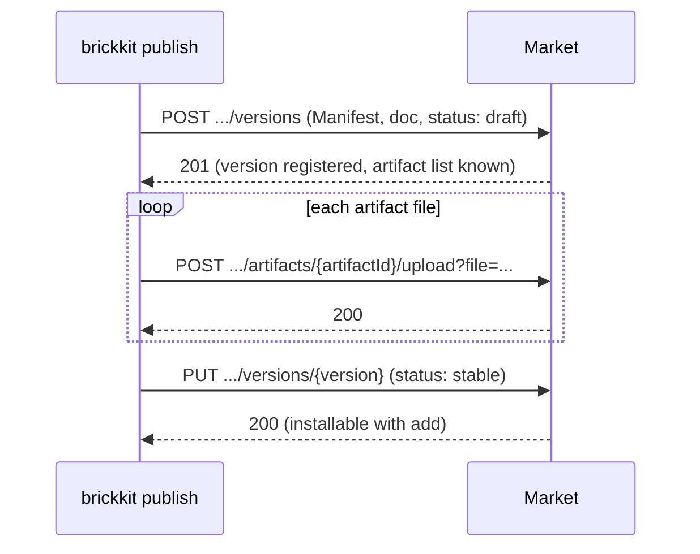

# BrickKit — part 9 of 9 (English)

Contains: docs/en/10-troubleshooting/08-lint-and-schema-issues.md, docs/en/11-reference/README.md, docs/en/11-reference/01-component-yaml-schema.md, docs/en/11-reference/02-brickkit-yaml-schema.md, docs/en/11-reference/03-deploy-yaml-schema.md, docs/en/11-reference/04-config-schema-spec.md, docs/en/11-reference/05-json-schemas.md, docs/en/11-reference/06-market-api.md

File paths below are relative to the repository root, https://raw.githubusercontent.com/brickKit/brickKit/main/ ; links inside pages are relative to this file

This is the last part.

---

> File: docs/en/10-troubleshooting/08-lint-and-schema-issues.md

# lint and schema problems

Three checks, each seeing more than the last: the JSON Schema in your editor looks only at one file's structure;
`brickkit lint` also checks field combinations and whether the three layers agree; `brickkit up --dry-run` also resolves the
whole dependency graph. When their conclusions differ, it's usually because they check different scopes, not because one of
them is wrong.

## `lint` reports an error, yet `up` works

**Symptom**

`brickkit up` runs fine, but `brickkit lint` reports an error, like:

```text
❌ Error: deploy.local.yaml is out of date: it does not match the components in brickkit.yaml
   File: deploy.local.yaml
   No entry for: demo/bus
   Reason: brickkit.yaml changed, but your deploy.local.yaml was not updated. Local mode is off, so commands don't read it now — but the next brickkit local on will
   Suggestions:
   1. Option A (recommended): brickkit local refresh regenerates deploy.local.yaml from deploy.yaml and keeps the old one as deploy.local.yaml.bak
   2. Option B: add or remove the listed entries in deploy.local.yaml by hand
   3. Option C: if you no longer need it, delete deploy.local.yaml (it is never committed)
```

**Cause**

`lint` checks more than this run of `up` uses:

| What `lint` checks and this `up` doesn't necessarily read | Why |
| --- | --- |
| `deploy.local.yaml` — **whether local mode is on or not** | With local mode off, `up` doesn't read it; but you may `local on` at any moment, and then it must match `brickkit.yaml`. The team added a component and your personal file didn't keep up: it's reported here |
| **Every** `component.yaml` in the local sources, whether `add`ed or not | `up` doesn't read components not yet added to the project; `lint` makes them right before they're used |
| Under `--strict`: whether `${VAR}` has a value in the process environment or `.env`, whether the file `file://` points at exists | `up` checks these too, on every run — but only for the components it starts this time, and on the machine it runs on (an undefined `${VAR}` stops it before anything starts). `lint` checks every component in the project, and only when asked, because these values often exist only on CI or the deploy machine |

**Fix**

Fix what the error says. A stale personal file: `brickkit local refresh` (it works with local mode off too; it backs up the
old file and lists your earlier local changes); if you no longer need it, just delete it. To check only one deploy file:
`brickkit lint -f deploy.prod.yaml`.

## `lint` passes, yet `up --dry-run` reports an error

**Symptom**

`lint` is all green, and `up --dry-run` reports `required dependency missing`, a mismatched member version hosted by a
shell, or a component that can't be found.

**Cause**

This is a deliberate division of work. `lint` promises to be offline, read-only and instant, so it **doesn't resolve the
dependency graph**: resolving it means getting every component's `component.yaml`, which for components on Git or a market
means the network. Whether dependencies exist, and whether the member versions a shell hosts this time are right, can only
be judged on the dependency graph.

**Fix**

Run both steps in CI: `lint --strict` stops structural problems, `up --dry-run` stops dependency problems (it needs access
to the install sources, but not to a cluster). See [Offline checks](../../docs/en/02-project-guide/10-lint-and-checks.md#in-ci).

## The editor shows nothing red, yet `lint` reports an error

**Cause**

A JSON Schema describes only **one file's structure**: field names, types, required fields, fixed values. It can't express
these, which `lint` checks:

- Combinations of fields: `localPort` goes together with `mode: local` / `mode: debug`; `mode: debug` can only be written
  in `deploy.local.yaml`.
- Across the three layers: every component version has exactly one entry in the deploy file; `$var:` is defined; keys in
  `config/` are in the component's `configSchema`.
- Config items colliding with names the platform reserves.

**Fix**

Fix what `lint` reports. The editor showing nothing red only says that one file's structure is right.

## The editor shows red, yet `lint` passes

**Symptoms and causes**, the two common ones:

- **A conflict block in `config/` is marked as a duplicate key.** That's expected: BrickKit deliberately uses duplicate keys
  for conflicts left by an upgrade. In this case `lint` reports an error too (an unresolved conflict), though; see
  [Config conflict problems](../../docs/en/10-troubleshooting/03-config-conflict-issues.md).
- **The schema your editor uses doesn't match your CLI's version.** Wired up as the docs describe, it's the schema on the
  `main` branch, which may be newer (more fields) or older (fewer fields) than the CLI you installed. The CLI is what
  counts: if `lint` passes, the CLI accepts it.

**Fix**

Change the schema URL from `main` to the tag of the CLI version you use, or point it at a local copy under `schemas/` in the
repository at the same version as the CLI. How to wire it up: [JSON Schemas](../../docs/en/11-reference/05-json-schemas.md).

## The editor has no completion or validation at all

**Cause**

- No YAML language service is installed (the Red Hat YAML extension in VS Code, JetBrains' built-in one,
  yaml-language-server in Neovim).
- The file name doesn't match the mapping: the settings map `deploy.yaml`, while you opened `deploy.prod.yaml`.
- `config/*.yaml` has no schema to begin with: each component's config items differ, set by its own `configSchema`, and only
  `lint` checks key names against it.

**Fix**

Following method two in [JSON Schemas](../../docs/en/11-reference/05-json-schemas.md), map every deploy file with a glob like
`["deploy.yaml", "deploy.*.yaml"]`.

## The component table in `AGENTS.md` flips between two people

**Symptom**

A row of the component table at the end of the project's `AGENTS.md` (its description, or `+zh` in the Docs cell) is
one thing in one person's commit and back to the other in the next; on one machine `brickkit skills status` says:

```text
   │ AGENTS.md │ block maintained by brickkit (lang=en) is outdated; update refreshes it │
```

**Cause**

The version was already released (tagged, or published to a market). On one machine it is a local source (its source is
in `components/`) and was edited in place — `BRICKKIT.md`, a translation or `metadata.description` changed, the version
didn't; the other machine takes it from the tag or the market. One version number has two contents, and each machine
writes the table from the one it reads. (A bumped version that isn't released yet doesn't do this: a machine without
the source can't fetch that version and keeps the row as it is.)

**Fix**

Put the change in the next version: in the component's directory bump `metadata.version`, test, commit, push, `brickkit
release`; then `brickkit upgrade <id>@<new version>` in the project.

---

> File: docs/en/11-reference/README.md

# Reference

The exact specification: every field's type, whether it's required, its default, the rules the validator really applies.
For looking up one specific question, not for reading from the top.

How it differs from the [Field quick reference](../../docs/en/01-three-layers/09-field-reference.md): the quick reference shows every
field on one page, one sentence each; here every field carries its full rules, and matches the structures in the code one
by one — a struct gaining a field that the docs don't list makes a test fail.

| Page | Covers |
| --- | --- |
| [01 component.yaml](../../docs/en/11-reference/01-component-yaml-schema.md) | Every field of a component's Manifest |
| [02 brickkit.yaml](../../docs/en/11-reference/02-brickkit-yaml-schema.md) | Every field of the project declaration |
| [03 Deploy files](../../docs/en/11-reference/03-deploy-yaml-schema.md) | Every field of `deploy.yaml` / `deploy.local.yaml` / `deploy.<environment>.yaml` |
| [04 The configSchema spec](../../docs/en/11-reference/04-config-schema-spec.md) | How the config spec sheet is written; the platform checks key names, not values |
| [05 JSON Schemas](../../docs/en/11-reference/05-json-schemas.md) | The three JSON Schemas under `schemas/`, and how to wire them into an editor |
| [06 Market API](../../docs/en/11-reference/06-market-api.md) | The component market's HTTP interface (optional infrastructure) |

---

> File: docs/en/11-reference/01-component-yaml-schema.md

# component.yaml field reference

Every field of a component's Manifest: type, whether it's required, its default, the rules the validator really applies.
How to write each part well: [The component.yaml guide](../../docs/en/03-component-guide/02-component-yaml-reference.md).

Only the fields listed here may be written: an unknown field is an error on the spot, with a suggestion of what it might be
a misspelling of. There's no extension-field mechanism.

## Top level

| Field | Type | Required | Rules |
| --- | --- | --- | --- |
| `apiVersion` | string | ✅ | Only `brickkit/v1` |
| `kind` | string | ✅ | Only `Component` |
| `tags` | list of strings | | Tags for searching; the platform doesn't interpret them |

## metadata

| Field | Type | Required | Rules |
| --- | --- | --- | --- |
| `metadata.id` | string | ✅ | `<scope>/<name>`; each part lowercase letters, digits and hyphens, starting and ending with a letter or digit (`^[a-z0-9]([a-z0-9-]*[a-z0-9])?/[a-z0-9]([a-z0-9-]*[a-z0-9])?$`); at most 63 characters (the versioned service name must follow DNS label rules) |
| `metadata.name` | string | ✅ | A name for people |
| `metadata.version` | string | ✅ | An exact version `major.minor.patch` (`^\d+\.\d+\.\d+$`); no `v` prefix, ranges or `latest` |
| `metadata.description` | string | ✅ | A one-sentence description |
| `metadata.vendor` | string | | The publisher |
| `metadata.license` | string | | The licence |
| `metadata.apiDocs` | string | | The API documentation's address |
| `metadata.repository` | string | | The address of the component's repository or page; the component table in a project's `AGENTS.md` links to it |

## artifacts

Contracts and other files released with the component. Each item:

| Field | Type | Required | Rules |
| --- | --- | --- | --- |
| `artifacts[].type` | string | ✅ | A free string the platform doesn't interpret (e.g. `api-contract`) |
| `artifacts[].files` | list of strings | ✅ | At least one; paths relative to the repository root, never absolute, never leaving the repository with `..` |
| `artifacts[].format` | string | | A free string (e.g. `openapi`, `protobuf`) |
| `artifacts[].description` | string | | A description for people |

## dependencies

| Field | Type | Required | Rules |
| --- | --- | --- | --- |
| `dependencies.components[].id` | string | ✅ | `<component ID>@<exact version>`. The whole item can also be just this string (shorthand for a required dependency) |
| `dependencies.components[].optional` | boolean | | `true` makes it optional; required by default |

The two forms:

```yaml
dependencies:
  components:
    - demo/hello@1.1.0
    - id: demo/bus@1.0.0
      optional: true
```

Rules: versions must be exact; a component can't depend on itself; a component ID can appear only once (the address
variable's name carries no version, so two versions would collide on the same variable).

## configSchema

| Field | Type | Required | Rules |
| --- | --- | --- | --- |
| `configSchema.type` | string | | If written, `object` |
| `configSchema.required` | list of strings | | Each must be declared under `properties` |
| `configSchema.properties.<key>.type` | string | ✅ | `string` / `integer` / `number` / `boolean` / `array` / `object` |
| `configSchema.properties.<key>.default` | any | | The default; a scalar is injected exactly as written (`1.10` stays `1.10`), lists and maps are encoded as one line of JSON |
| `configSchema.properties.<key>.description` | string | | Appears at the end of the line in the project's config skeleton |
| `configSchema.properties.<key>.secret` | boolean | | `true` treats the item as a secret (a 0600 env file on Docker, a Secret on K8s) |
| `configSchema.properties.<key>.enum` | list | | Allowed values — **documentation only; the platform doesn't check values** |
| `configSchema.properties.<key>.minimum` | number | | As above |
| `configSchema.properties.<key>.maximum` | number | | As above |
| `configSchema.properties.<key>.pattern` | string | | As above |
| `configSchema.properties.<key>.items.type` | string | | The element type of an `array`; as above |

`<key>` is the environment variable name injected: it must be a valid environment variable name (letters, digits and
underscores, not starting with a digit), injected as it is, with no case conversion. When it collides with a name the
platform reserves (`COMPONENT_ID`, `COMPONENT_VERSION`, `PORT`, `BRICKKIT_SERVED_MEMBERS`,
`BRICKKIT_SERVED_MEMBERS_CONFIG`, `*_ENDPOINT`): `up` / `lint` warn and ignore the item, and a market refuses it. The
platform checks key names only, not values; details in [The configSchema spec](../../docs/en/11-reference/04-config-schema-spec.md).

## deployment

| Field | Type | Required | Rules |
| --- | --- | --- | --- |
| `deployment.type` | string | ✅ | Only `container` |
| `deployment.image` | string | One of the two | A prebuilt image; without a tag, `metadata.version` is added |
| `deployment.build.context` | string | One of the two | The build context, relative to the repository root, `.` by default |
| `deployment.build.dockerfile` | string | | The Dockerfile path, relative to the repository root, `Dockerfile` by default |
| `deployment.port` | integer | ✅ | The main port, 1–65535 |
| `deployment.extraPorts[].name` | string | ✅ | Lowercase letters, digits and hyphens, at most 15 characters (the K8s Service port-name rule); no duplicates. Callers get the port as `<ID>_<NAME>_ENDPOINT`, `-` becoming `_` (`admin-api` on `demo/hello` → `DEMO_HELLO_ADMIN_API_ENDPOINT`) |
| `deployment.extraPorts[].port` | integer | ✅ | 1–65535, not the same as the main port |
| `deployment.resources.requests.cpu` | string | | The suggested CPU request, like `"100m"` |
| `deployment.resources.requests.memory` | string | | The suggested memory request, like `"128Mi"` |
| `deployment.resources.limits.cpu` | string | | The suggested CPU limit (better left out) |
| `deployment.resources.limits.memory` | string | | The suggested memory limit |
| `deployment.labels` | map of strings | | Passed through verbatim: service labels on Docker, annotations on the Deployment and its Pods on K8s; values must be strings |

At least one of `image` and `build`; the paths of `build` must be inside the repository. When `resources` is written,
`requests` or `limits` must hold at least `cpu` or `memory`; these values are the author's suggestions, and the project
overrides them field by field on its deploy-file entry. Only `requests` has a platform default (`100m` / `128Mi`); `limits`
has none.

## migration

| Field | Type | Required | Rules |
| --- | --- | --- | --- |
| `migration.command` | list of strings | ✅ (when `migration` is written) | The migration command, as an array; run with the same image |

## healthCheck

| Field | Type | Required | Rules |
| --- | --- | --- | --- |
| `healthCheck.type` | string | ✅ | `http` / `tcp` / `none` |
| `healthCheck.path` | string | Required for `http` | Starts with `/` |
| `healthCheck.startPeriodSeconds` | integer | | The start-up grace period in seconds, 60 by default, at most 3600; not allowed with `type: none` |

The check interval of 10 seconds, a 3-second timeout and 3 failures in a row meaning unhealthy are fixed by the platform and
can't be configured.

What each type runs: on Docker the check runs inside the container through `/bin/sh` — `http` runs `wget`, falling back to
`curl`, against `http://localhost:<port><path>`, and `tcp` runs `nc -z localhost <port>`, so the image needs a shell and those
tools (an image without a shell, like `scratch` or distroless, passes neither). On Kubernetes they become `httpGet` /
`tcpSocket` probes, sent from outside the container. `none` generates no check: dependents wait only for the container to
start. See
[up / down problems](../../docs/en/10-troubleshooting/01-up-down-issues.md#the-components-logs-look-fine-yet-the-platform-says-its-unhealthy).

## shell

| Field | Type | Required | Rules |
| --- | --- | --- | --- |
| `shell.members` | list of strings | ✅ (when `shell` is written) | The members compiled into the shell, each `<component ID>@<exact version>`; at least one; not itself; one version per component |

Writing `shell` makes the component a shell; its entry in the project's `brickkit.yaml` must carry `kind: shell`. See
[Declaring a shell](../../docs/en/04-shell/03-shell-declaration.md).

## local

How BrickKit starts the component when it runs as `mode: local`. Usually not needed: it's recognised automatically from the
marker files in the source directory.

| Field | Type | Required | Rules |
| --- | --- | --- | --- |
| `local.language` | string | | `go` / `rust` / `dotnet` / `node` / `java` / `python` / `ruby`; names the language when one directory holds marker files for several |
| `local.runCommand` | list of strings | | Gives the start command directly; when the first item contains a path separator, it's relative to the component directory |

---

> File: docs/en/11-reference/02-brickkit-yaml-schema.md

# brickkit.yaml field reference

Which components the project uses, each at which exact version, and where they come from. It's the project's lock file.
How to use it: [brickkit.yaml](../../docs/en/01-three-layers/02-brickkit-yaml.md).

An unknown field is an error on the spot. How things are deployed (`mode`, `expose`…) isn't written here but in the
deploy file.

## Top level

| Field | Type | Required | Rules |
| --- | --- | --- | --- |
| `project` | string | ✅ | Lowercase letters, digits and hyphens, starting and ending with a letter or digit (`^[a-z0-9]([a-z0-9-]*[a-z0-9])?$`); at most 54 characters (a K8s namespace is at most 63, minus the `brickkit-` prefix the CLI adds). It becomes the name of the Docker network, the Compose project and the K8s namespace |

## sources

Install sources: where to look for components. Tried in the order declared; the first source that has the component wins.

| Field | Type | Required | Rules |
| --- | --- | --- | --- |
| `sources[].name` | string | ✅ | The install source's name, unique in this file |
| `sources[].type` | string | ✅ | `git` / `local` / `market` |
| `sources[].baseUrl` | string | Required for `git` | The repository of component `<scope>/<name>` is `<baseUrl>/<scope>-<name>` (a trailing `/` on `baseUrl` is optional; the CLI adds exactly one); mustn't start with `-` |
| `sources[].path` | string | Required for `local` | A directory on this machine, relative to the project root, laid out as `<scope>/<name>/component.yaml` |
| `sources[].url` | string | Required for `market` | The component market's API address |
| `sources[].authToken` | string | | A market token, usually written `${VAR}`; after `brickkit login`, the login credentials take precedence |
| `sources[].enabled` | boolean | | `true` by default; with `false` the source takes no part in lookups |

## components

One entry per component version.

| Field | Type | Required | Rules |
| --- | --- | --- | --- |
| `components[].id` | string | ✅ | The component ID, with the same rules as `metadata.id` in `component.yaml` |
| `components[].version` | string | ✅ | An exact version. Components from local sources also write the real version from their `component.yaml` |
| `components[].kind` | string | | Only `shell`, or left out; written by the CLI when it `add`s a shell, and must agree with the component's `shell` block; the same for every version of one component ID |
| `components[].requiredBy` | list of strings | | Which components this version is kept for (a compatibility version); each must be a component ID in this file, and not itself |
| `components[].source.type` | string | ✅ (when `source` is written) | `git` / `local` |
| `components[].source.repo` | string | Required for `git` | This component's repository address (when it can't be derived, or is in another organisation) |
| `components[].source.path` | string | Required for `local` | `local`: the component directory, relative to the project root; `git`: the component's subdirectory in the repository (a monorepo), never absolute, never leaving the repository |

Rules across versions:

- A component version appears only once.
- When a component ID has several versions, **exactly one** has no `requiredBy` — it's the default version; the rest all
  have `requiredBy`.
- A shell has only one version in a project, so it can't have `requiredBy` either.
- The lines of one component must write `source` the same way (a component has one repository).

## installer

Verification settings for component-market signatures. They apply only to components from a market.

| Field | Type | Required | Rules |
| --- | --- | --- | --- |
| `installer.requireSignature` | boolean | | `true` by default: unsigned market components aren't installed |
| `installer.publicKeys` | map of strings | | Trusted publishers' public keys: a key name (the `publicKeyRef` in the signature) → a public key file path (relative to the project root). **With none configured, signature verification is switched off entirely** |

See [Security and signing](../../docs/en/06-architecture/08-security-and-signing.md).

---

> File: docs/en/11-reference/03-deploy-yaml-schema.md

# Deploy file field reference

`deploy.yaml`, `deploy.local.yaml` and `deploy.<environment>.yaml` share one structure. How to use them:
[deploy.yaml](../../docs/en/01-three-layers/03-deploy-yaml.md) and [deploy.local.yaml](../../docs/en/01-three-layers/04-deploy-local-yaml.md).

An unknown field is an error on the spot. Fields useful only for the other deploy target aren't errors but get a warning
that they have "no effect with target: … and are ignored" — they take effect when the target changes.

## Top level

| Field | Type | Required | Rules |
| --- | --- | --- | --- |
| `target` | string | ✅ | `docker` / `podman` / `k8s` |
| `focus` | string | | Only in `deploy.local.yaml`: a component ID. Only that component and what it needs start, and it runs from its source (as `mode: local`, or as written `mode: debug`); not with `target: k8s`. See [Developing inside the project](../../docs/en/02-project-guide/04-focus-run.md) |
| `vars` | map | | Overrides same-named shared variables from `config/vars.yaml`, affecting only `$var:` lookups; keys must be valid environment variable names |

## k8s

Project-level Kubernetes settings. Written when `target` isn't `k8s`, they're warned about and ignored.

| Field | Type | Required | Rules |
| --- | --- | --- | --- |
| `k8s.context` | string | | Which kubeconfig context to deploy to. When written, `up` (before really deploying), `down` and `status` first confirm that `kubectl` is currently connected to it; a current context that can't be read lets the command through |
| `k8s.namespace` | string | | `brickkit-<project name>` by default; the same rules as the project name |
| `k8s.createNamespace` | boolean | | `true` by default; write `false` when you only have namespace-level permissions |
| `k8s.podSecurity` | string | | Only `restricted`: generates a restricted-level `securityContext` for every container |
| `k8s.imagePullSecrets` | list of strings | | Names of Secrets for pulling images |
| `k8s.ingressClass` | string | | The Ingress class |
| `k8s.ingressAnnotations` | map of strings | | Written verbatim onto every Ingress |
| `k8s.serviceAccount.enabled` | boolean | | With `true`, one ServiceAccount per component, with no token mounted |
| `k8s.networkPolicy.enabled` | boolean | | With `true`, a NetworkPolicy is generated per component from the dependency graph |
| `k8s.networkPolicy.ingressController.namespace` | string | See the rules | The Ingress controller's namespace; required when network policies are on and some component has `expose: true` |
| `k8s.networkPolicy.ingressController.podSelector` | map of strings | | The labels of the Ingress controller's Pods |
| `k8s.networkPolicy.allowFrom[].name` | string | ✅ | Whom this is let through for (written into an annotation, so it's clear later why it was opened) |
| `k8s.networkPolicy.allowFrom[].namespace` | string | ✅ | Which namespace to let through |
| `k8s.networkPolicy.allowFrom[].podSelector` | map of strings | | Only let through Pods in that namespace carrying these labels |
| `k8s.networkPolicy.allowFrom[].ports` | list of integers | | Only let through these ports (1–65535) |
| `k8s.networkPolicy.egress.enabled` | boolean | | With `true`, outbound policies are generated too: dependencies in the dependency graph and DNS are let through automatically, everything else refused |
| `k8s.networkPolicy.egress.allowTo[].name` | string | ✅ | What this outbound target is (e.g. `main-db`) |
| `k8s.networkPolicy.egress.allowTo[].namespace` | string | One of the two | A target inside the cluster: its namespace |
| `k8s.networkPolicy.egress.allowTo[].cidr` | string | One of the two | A target outside the cluster: an address range; only one of this and `namespace` |
| `k8s.networkPolicy.egress.allowTo[].podSelector` | map of strings | | The labels of the target Pods inside the cluster |
| `k8s.networkPolicy.egress.allowTo[].ports` | list of integers | | Only let through these ports |

With outbound policies on, outside services like a database have to be written into `allowTo` yourself: the platform only
knows the components in the dependency graph, not a string of addresses in `config/`.

## components

Exactly one entry per component version, matching `brickkit.yaml` one to one (shell members' entries, nested under the
shell, count the same).

| Field | Type | Required | Rules |
| --- | --- | --- | --- |
| `components[].id` | string | ✅ | A bare ID means the default version; `<component ID>@<version>` means that version (a compatibility version must be written this way) |
| `components[].mode` | string | | `enabled` / `disable` / `local` / `debug`. Left out, it follows the layer above: it runs when any component that depends on it runs (a top-level component runs by default). `debug` can only be written in `deploy.local.yaml`; `local` and `debug` aren't allowed with `target: k8s` |
| `components[].localPort` | integer | | The port the process on this machine listens on, 1–65535; only with `mode: local` / `mode: debug`, or on the entry of the `focus` component (which runs as `mode: local`); mustn't clash with another entry. Left out for `mode: local`, one is picked automatically |
| `components[].expose` | boolean | | Exposed to the outside: a host port mapped on Docker, an Ingress generated on K8s |
| `components[].exposePort` | integer | | The host port mapped on Docker, the component's port by default; only with `expose: true`; mustn't clash; ignored on K8s |
| `components[].hostname` | string | See the rules | The Ingress's domain name; required with `target: k8s` and `expose: true` |
| `components[].tlsSecret` | string | | The Ingress's TLS certificate Secret; only with `expose: true` |
| `components[].replicas` | integer | | The K8s replica count, 1 by default, at least 1; above 1 a PodDisruptionBudget is generated automatically; not together with `mode: local` / `debug`. To turn a component off, use `mode: disable` |
| `components[].serviceAccountName` | string | | On K8s, use an existing ServiceAccount (the platform only references it, never creates it) |
| `components[].resources.requests.cpu` | string | | Overrides the component's suggested quota, field by field |
| `components[].resources.requests.memory` | string | | As above |
| `components[].resources.limits.cpu` | string | | As above |
| `components[].resources.limits.memory` | string | | As above |
| `components[].labels` | map of strings | | Overrides the component's `deployment.labels` key by key, passed through verbatim |
| `components[].skipWaitFor` | list of strings | | Required dependencies not waited for at start-up (component IDs without versions); must be real required dependencies of this component version; not itself, no duplicates. For Docker / Podman containers only; ignored on K8s and for processes on this machine |

Quota precedence: the deploy file's `resources` > the component's `deployment.resources` > the platform default (only
`requests`: `100m` / `128Mi`).

### Shell members: `components[].members`

A shell's entry can nest `members`; each member is a full deploy entry with the same fields as the table above, nested one
level only:

| Field | Type | Required | Rules |
| --- | --- | --- | --- |
| `components[].members[].id` | string | ✅ | A bare ID or `id@version`; not the shell itself; one version per component in one shell |
| `components[].members[].mode` | string | | Like `components[].mode`; with `debug` / `local` the member runs as a process on this machine this time, and the shell doesn't host it |
| `components[].members[].localPort` | integer | | As above |
| `components[].members[].skipWaitFor` | list of strings | | As above |
| `components[].members[].expose` | boolean | | No effect while the shell hosts it; takes effect when the shell doesn't run |
| `components[].members[].exposePort` | integer | | As above |
| `components[].members[].hostname` | string | | As above |
| `components[].members[].tlsSecret` | string | | As above |
| `components[].members[].replicas` | integer | | As above |
| `components[].members[].serviceAccountName` | string | | As above |
| `components[].members[].labels` | map of strings | | As above |
| `components[].members[].resources.requests.cpu` | string | | As above |
| `components[].members[].resources.requests.memory` | string | | As above |
| `components[].members[].resources.limits.cpu` | string | | As above |
| `components[].members[].resources.limits.memory` | string | | As above |

Only a shell's entry (`kind: shell` in `brickkit.yaml`) can write `members`, and the members placed under it must be
components compiled into the shell's `component.yaml`. See [Managing members](../../docs/en/04-shell/04-members-management.md).

## Fields that apply to one target only

| Only on | Fields | On the other target |
| --- | --- | --- |
| k8s | The `k8s` block, `replicas`, `hostname`, `tlsSecret`, `serviceAccountName` | Warned about, ignored |
| docker, podman | `exposePort`, `skipWaitFor` | Warned about, ignored |
| docker, podman | `mode: local`, `mode: debug` | An error on `k8s` (a Pod in the cluster can't reach your machine) |

---

> File: docs/en/11-reference/04-config-schema-spec.md

# The configSchema spec

`configSchema` is a block in a component's `component.yaml` declaring which config items the component recognises. Its
form borrows a subset of JSON Schema (draft-07): one `type: object`, with `properties` listing each item and `required`
listing the required ones. How to split and name the items: [Designing configSchema](../../docs/en/03-component-guide/03-config-schema-design.md).

## Structure

```yaml
configSchema:
  type: object
  properties:
    DB_HOST:
      type: string
      description: PostgreSQL host name
    DB_PORT:
      type: integer
      default: 5432
      minimum: 1
      maximum: 65535
      description: PostgreSQL port
    DB_PASSWORD:
      type: string
      secret: true
      description: Password to connect with
    REGIONS:
      type: array
      items:
        type: string
      default: [eu-west, us-east]
      description: Regions served
  required: [DB_HOST, DB_PASSWORD]
```

| Written | Means |
| --- | --- |
| The keys of `properties` | Config item names, which are the environment variable names injected, as they are: they must be valid environment variable names (letters, digits and underscores, not starting with a digit) |
| `type` | `string` / `integer` / `number` / `boolean` / `array` / `object` |
| `default` | Used when no value is written; scalars are injected as strings, exactly as written (`default: 1.10` is injected as `1.10`, not `1.1`), `array` / `object` as one line of JSON |
| `description` | Appears at the end of the line in the project's config skeleton |
| `secret: true` | The item is a secret: at deployment it takes the secret channel, never written into deployment files in plain text |
| `required` | The required items; each must be declared under `properties` |
| `enum`, `minimum`, `maximum`, `pattern`, `items` | Allowed values — **documentation only** |

The exact rules of each field: [component.yaml field reference](../../docs/en/11-reference/01-component-yaml-schema.md#configschema).

## The platform checks key names, not values

This is the most important rule of `configSchema`.

**Key names** the platform checks:

| Situation | Result |
| --- | --- |
| `config/` writes a key that isn't in `configSchema` | A warning that it "has no effect", with a guess at what you meant |
| The component has no `configSchema`, yet `config/` holds config for it | A warning: none of that config takes effect |
| An item in `required` has no `default` and nothing was filled in under `config/` | `up` refuses to start, naming the missing item |
| A key name collides with a name the platform reserves | `up` / `lint` warn and ignore the item; a market refuses it |

**Values** the platform doesn't check: `"abc"` in a `type: integer` item, a value outside `enum`, a number above `maximum` —
the platform injects them all as usual.

The line is whether there's a safety net at run time. A wrong value fails when the component reads it (it can't be
parsed, it fails validation), so you're sure to notice, and how to handle a wrong value is the component's own decision. A
wrong key name means the variable doesn't exist at all, the component takes its default branch and runs normally —
nothing fails, the config just quietly doesn't take effect. Only the platform can catch errors of that kind, so that's the
only kind it checks.

And once value checking starts, it doesn't stop: types, enums, ranges, regular expressions, nested structures… JSON Schema
can do almost anything, and every extra check is one more decision the platform makes for the component.

So a component validates values itself at start-up:

```go
port, err := strconv.Atoi(os.Getenv("DB_PORT"))
if err != nil || port < 1 || port > 65535 {
	log.Fatalf("DB_PORT must be a port number, got %q", os.Getenv("DB_PORT"))
}
```

## How it relates to JSON Schema

The form is compatible with JSON Schema, but it isn't **executed** as JSON Schema: the CLI reads only the keys of
`properties`, `type`, `default`, `required`, `secret` and `description`; the other keywords are kept as they are, for people
to read. A keyword not listed here written in an item (a misspelled `defualt`, or `format`, `examples`, `oneOf`… out of
JSON Schema habit) is dropped when parsing — it has no effect. The author gets a warning where they can hear it and fix it
(`lint`, local source scans, `publish`); installing someone else's component doesn't fail because of it, since the project
using it can't change someone else's Manifest.

## Editors

`schemas/component.schema.json` describes the structure of the `configSchema` block; wired into an editor, writing
`configSchema` gets completion, and a misspelled keyword (`defualt`) is marked red at once. See
[JSON Schemas](../../docs/en/11-reference/05-json-schemas.md). `lint` also reports misspelled keys in a `configSchema` item:

```text
Warning: some keys declared on configSchema items won't take effect
```

---

> File: docs/en/11-reference/05-json-schemas.md

# JSON Schemas

## The `schemas/` directory

The repository's `schemas/` holds three JSON Schemas (draft-07), describing the structure of the three kinds of file:

| File | Describes |
| --- | --- |
| `schemas/component.schema.json` | A component's `component.yaml` |
| `schemas/brickkit.schema.json` | A project's `brickkit.yaml` |
| `schemas/deploy.schema.json` | Deploy files: `deploy.yaml`, `deploy.local.yaml`, `deploy.<environment>.yaml` |

They're generated from the CLI's Go structs, not written by hand: when a struct changes, they're regenerated and committed
together; `make lint` (its `check-schemas` step, which also runs before every release) stops "the struct changed but
nobody regenerated". So the fields in the schemas match the fields the CLI really accepts, one for one.

## Wiring them into an editor

Once an editor with a YAML language service (the Red Hat YAML extension in VS Code, the JetBrains family,
yaml-language-server in Neovim…) has the schemas: field names get completion, and wrong types, missing required fields and
misspelled field names are marked red at once — the same set of structural problems `brickkit lint` reports, only seen
while you type.

**Method one: a comment at the top of the file.** It applies to one file, the same for whoever opens it:

```yaml
# yaml-language-server: $schema=https://raw.githubusercontent.com/brickKit/brickKit/main/schemas/deploy.schema.json
target: docker
components:
  - id: demo/hello
```

`component.yaml` uses `component.schema.json`, `brickkit.yaml` uses `brickkit.schema.json`.

**Method two: map by file name in the editor's settings.** VS Code's `settings.json`:

```json
{
  "yaml.schemas": {
    "https://raw.githubusercontent.com/brickKit/brickKit/main/schemas/component.schema.json": "component.yaml",
    "https://raw.githubusercontent.com/brickKit/brickKit/main/schemas/brickkit.schema.json": "brickkit.yaml",
    "https://raw.githubusercontent.com/brickKit/brickKit/main/schemas/deploy.schema.json": ["deploy.yaml", "deploy.*.yaml"]
  }
}
```

Put it in the project's `.vscode/settings.json`, and the whole team has it on opening the project. To pin a CLI version,
replace `main` in the URLs with that version's tag, or point at a local copy.

## What they cover, and what they don't

A JSON Schema describes only **one file's structure**: field names, types, required fields, fixed values (`target` can
only be `docker` / `podman` / `k8s`, and so on).

What they don't cover belongs to other checks:

| Rule | Checked by |
| --- | --- |
| Combinations of fields (`localPort` needs `mode`, `exposePort` needs `expose`, `mode: debug` only in `deploy.local.yaml`) | `brickkit lint` |
| Config items colliding with names the platform reserves, typos inside a `configSchema` item | `brickkit lint` |
| Whether the three layers agree (one deploy entry per component version, `$var:` defined, keys in `config/` present in `configSchema`) | `brickkit lint` |
| Whether dependencies resolve, whether the member versions a shell hosts are right | `brickkit up --dry-run` |
| Config values in `config/*.yaml` | No schema: each component's config items differ, set by its own `configSchema`, and `lint` checks key names against it |

Nothing red in the editor doesn't mean `lint` passes; `lint` passing doesn't mean `up --dry-run` passes — each of the three
checks more than the last.

---

> File: docs/en/11-reference/06-market-api.md

# Market API reference

The HTTP interface of BrickKit Market, the component marketplace. Every endpoint listed here is implemented and matches the server's route table one to one. A test in `market-server` fails if this page lists an endpoint that does not exist, or leaves out one that does.

You rarely need to call these endpoints yourself: `brickkit login`, `publish`, `add` and `fetch` wrap them. This page is for anyone writing their own market client, or trying to understand exactly how the market behaves.

## The market is optional

A market is one kind of **install source**. BrickKit does not need one to work: a project that uses only local and git sources can install, deploy and upgrade components.

- **Git source.** A component is released by tagging its repository. When the component sits at the repository root, the tag is the version (`1.2.0`). When it sits in a subdirectory named `<scope>-<name>/`, the tag is `<scope>-<name>/1.2.0`. `brickkit release` checks the working tree, then creates and pushes the tag for you.
- **Local source.** Reads component directories straight from disk; this is what you use while developing.

On top of that, a market gives you a few things git cannot, or can only do awkwardly:

| What the market adds | Why a git source can't |
| --- | --- |
| Search and browsing by tag | Git fetches by repository URL; it has no idea which components exist |
| Private components, granted to users and organizations | Git permissions apply to a whole repository, not to a component |
| Closed-source distribution: an image and an API contract, no source | Installing from a git source reads the repository itself |
| A place for the publisher's signature to travel with the release | A git tag has nowhere to carry a BrickKit signature |
| Delisting after the fact (`blocked`): a bad release stops being installable | Deleting a git tag doesn't stop anyone who already cloned, and nobody is told why |

Without a market, everything else works the same. When you need the features above, run your own (or use the one your team already runs). There is no public market operated by the BrickKit project.

## Conventions

**Base URL.** The address of the market instance you use. Every path starts with `/api/v1`.

**Authentication.** Endpoints that need it take a bearer token:

```
Authorization: Bearer <token>
```

`POST /api/v1/auth/login` issues the token. It is the value `brickkit login` stores in `.brickkit/credentials`. Reading public components needs no token; everything about a private component, and every publish, does.

**Response envelope.** Every response except the doc endpoint (described below) has the same shape:

```json
{"success": true, "data": { "...": "..." }}
```

```json
{"success": false, "error": {"code": "MANIFEST_INVALID", "message": "the Manifest failed validation", "details": { "...": "..." }}}
```

`error.details` carries structured information such as the individual validation problems or conflict details; not every error has it. Messages are always in English. If you branch on errors, branch on `code`: it is stable.

## Error codes

| Code | HTTP status | Meaning |
| --- | --- | --- |
| `INVALID_REQUEST` | 400 | The body is not valid JSON, is larger than 8 MiB (`details.limitBytes`), or a request field (source type, version, visibility, doc, …) is invalid |
| `MANIFEST_INVALID` | 400 | The Manifest in a publish request failed validation; `details.problems` lists each problem |
| `CONFIG_SCHEMA_RESERVED_VARIABLE_CONFLICT` | 400 | A `configSchema` key has the same name as a variable the platform injects |
| `CLOSED_SOURCE_MISSING_API_CONTRACT` | 400 | A closed-source component declares no `api-contract` artifact |
| `UNAUTHORIZED` | 401 | No token, or the token is invalid or expired |
| `FORBIDDEN` | 403 | The token is valid, but this identity isn't allowed to do this |
| `COMPONENT_BLOCKED` | 403 | A market admin has delisted the component or version |
| `NOT_FOUND` | 404 | The component, version, organization or doc doesn't exist |
| `CONFLICT` | 409 | A state conflict, such as adding a user who already belongs to another organization |
| `VERSION_ALREADY_EXISTS` | 409 | The version number has been used. Version numbers can't be republished, and a soft-deleted version keeps its number |
| `INTERNAL` | 500 | Something failed inside the market. The cause goes to the server log only; it is never sent to the client |

## Endpoints

### Operations and audit

| Method | Path | Auth | Description |
| --- | --- | --- | --- |
| GET | `/api/v1/health` | No | Health check: returns `status`, the server version and the current time. A self-hosted deployment's container healthcheck probes this |
| GET | `/api/v1/audit` | Yes | The audit log, newest first. Query parameters: `componentId`, `action`, `limit`. An admin sees every entry; anyone else sees the entries on components they own (other people's downloads included) and their own actions |

### Accounts

| Method | Path | Auth | Description |
| --- | --- | --- | --- |
| POST | `/api/v1/auth/register` | No | Create an account. Body: `username`, `password`, optional `email` |
| POST | `/api/v1/auth/login` | No | Log in. Body: `username`, `password`. The response carries `token` and `expiresAt` |
| POST | `/api/v1/auth/logout` | Yes | Revoke the token this request carries (the account's other tokens are untouched). Calling it again is not an error |

⚠️ An `orgId` in a registration body is ignored. Organization membership is what grants read access to an organization's private components; if people could declare their own organization at sign-up, anyone could read anyone's private components. The only way into an organization is the "add member" endpoint below, called by the organization's owner or a market admin.

### Organizations

| Method | Path | Auth | Description |
| --- | --- | --- | --- |
| GET | `/api/v1/organizations` | Yes | List organizations. A regular user sees only their own; an admin sees all |
| POST | `/api/v1/organizations` | Yes | Create an organization. The creator becomes its owner and a member |
| POST | `/api/v1/organizations/{orgId}/members` | Yes (organization owner or admin) | Add a member |

A user belongs to at most one organization. Adding someone who is already in another organization returns `CONFLICT` rather than silently moving them, which would cut them off from their current organization's private components. Adding the same person twice is not an error.

### Components

| Method | Path | Auth | Description |
| --- | --- | --- | --- |
| GET | `/api/v1/components` | Depends on visibility | Search. Query parameters: `keyword`, `page`, `pageSize`, `tags` (comma-separated, or repeated). Returns only components that aren't delisted and that the caller can see |
| GET | `/api/v1/components/{scope}/{name}` | Depends on visibility | Component details and its list of version numbers |
| PUT | `/api/v1/components/{scope}/{name}/visibility` | Yes (owner) | Set visibility: `public` or `private` |
| GET | `/api/v1/components/{scope}/{name}/access` | Yes (owner) | Which users and organizations a private component is granted to |
| PUT | `/api/v1/components/{scope}/{name}/access` | Yes (owner) | Replace the access policy |

A component ID has two parts, `scope/name`, and the path has both: `/api/v1/components/people/basic`.

A component is created by its first publish, and the publisher becomes its owner. Namespaces are first come, first served, except `brickkit/` and `infra/`, which are reserved for market admins.

### Versions

| Method | Path | Auth | Description |
| --- | --- | --- | --- |
| GET | `/api/v1/components/{scope}/{name}/versions` | Depends on visibility | List versions (without the Manifest body). `draft` versions are visible to the owner only; deleted versions are not listed |
| POST | `/api/v1/components/{scope}/{name}/versions` | Yes (only the owner, for an existing component) | Publish a new version; see [Publishing](#publishing) |
| PUT | `/api/v1/components/{scope}/{name}/versions/{version}` | Yes (owner; delisting is admin-only) | Change the status to `draft`, `stable` or `deprecated`; only an admin can set `blocked`. Moving to `stable` requires every declared artifact file to be uploaded |
| DELETE | `/api/v1/components/{scope}/{name}/versions/{version}` | Yes (owner) | Soft delete: the version behaves as if it doesn't exist, but its number stays taken |
| GET | `/api/v1/components/{scope}/{name}/versions/{version}/manifest` | Depends on visibility | The version's Manifest; this is where `brickkit add` gets it |
| GET | `/api/v1/components/{scope}/{name}/versions/{version}/doc` | Depends on visibility | The version's `BRICKKIT.md`; see [Component docs](#component-docs) |

The `data` of `/manifest` holds `manifest` (the `component.yaml` as JSON), `status`, `sourceType` (`git` for open source, `registry` for closed source), `gitUrl` (the open-source repository, which `add --repo` clones) and `signature` (the signature supplied at publish time; absent when there is none).

Whether a caller gets a version: a `draft` is visible to its owner only, a `blocked` version answers `COMPONENT_BLOCKED`, a deleted one answers `NOT_FOUND`, and a private component answers `FORBIDDEN` to anyone without a grant. `/doc` applies exactly the same rules as `/manifest`.

### Artifacts

| Method | Path | Auth | Description |
| --- | --- | --- | --- |
| GET | `/api/v1/components/{scope}/{name}/versions/{version}/artifacts` | Depends on visibility | The version's registered artifacts, each with `id`, `type`, `format` and `files` |
| POST | `/api/v1/components/{scope}/{name}/versions/{version}/artifacts/{artifactId}/upload` | Yes (owner) | Upload one file of a registered artifact. The `file` query parameter is its path inside the component; the body is the file content. At most 64 MiB per file |
| GET | `/api/v1/components/{scope}/{name}/versions/{version}/artifacts/{artifactId}/download` | Depends on visibility | Download one artifact file; `file` as above |

The artifact **list** (which artifacts exist and which files each has) is registered at publish time from the Manifest's `artifacts`. An upload can only deliver a file that list declares.

## Publishing

The body of `POST /api/v1/components/{scope}/{name}/versions`:

```json
{
  "version": "1.2.0",
  "status": "draft",
  "manifest": { "apiVersion": "brickkit/v1", "kind": "Component", "metadata": { "id": "people/basic", "version": "1.2.0" } },
  "sourceType": "git",
  "gitUrl": "https://github.com/example/people-basic",
  "changelog": "Add a status field to people",
  "visibility": "public",
  "doc": "# people/basic\n\nHow to call it…\n",
  "docTranslations": { "de": "# people/basic\n\nSo wird es aufgerufen…\n" },
  "signature": {
    "algorithm": "cosign",
    "publicKeyRef": "keys/vendor.pub",
    "value": "<base64 signature>",
    "signedBy": "release-bot@example.com"
  }
}
```

| Field | Required | Description |
| --- | --- | --- |
| `version` | Yes | Must equal `manifest.metadata.version` |
| `status` | No | `draft` when omitted |
| `manifest` | Yes | The `component.yaml` as JSON; stored as sent |
| `sourceType` | Yes | `git` (open source; `gitUrl` is then required) or `registry` (closed source) |
| `gitUrl` | For open source | The component's git repository |
| `changelog` | No | What changed in this version |
| `visibility` | No | `public` or `private`. When given, the component is set to it, existing components included; when omitted, a new component is `public` and an existing one keeps its setting |
| `doc` | No | The full text of `BRICKKIT.md` from the component's root: UTF-8, at most 256 KiB |
| `docTranslations` | No | Translations of `BRICKKIT.md` (the component root's `BRICKKIT.<lang>.md`), keyed by lowercase language code (`zh`, `pt-br`): at most 16, each at most 256 KiB, all docs together at most 1 MiB |
| `signature` | No | The publisher's signature over the Manifest. The market checks only its structure (a known algorithm, required fields present, `value` valid base64); it does no cryptographic check, because it holds no public key worth trusting. Verification happens on the installing side, against the public keys the project configures |

### What the market checks

**The Manifest rules are the CLI's rules: the same code.** A `component.yaml` that `brickkit lint` accepts in the component repository passes the market's Manifest checks, and whatever the CLI rejects, the market rejects: misspelled field names (an unknown field is refused, never silently ignored), version ranges such as `^1.0.0`, shell members without an exact version. A request that bypasses the CLI and calls this endpoint directly gets exactly the same checks.

Each problem is reported separately in `details.problems`:

```json
{
  "success": false,
  "error": {
    "code": "MANIFEST_INVALID",
    "message": "the Manifest failed validation",
    "details": {
      "problems": [
        {"field": "dependencies.components[0]", "reason": "..."},
        {"field": "futureField", "reason": "..."}
      ]
    }
  }
}
```

Manifest problems and request-field problems (`version`, `sourceType`, `visibility`, …) come back together, so one round of fixes is enough.

**On top of that, the market checks a few things that only matter for a market release:**

1. **`deployment.image` is required.** Whoever installs from the market has no source code, so they can't build an image. A component that only declares `deployment.build` (built from source) is distributed through a git source.
2. **No config key may take the name of a platform-injected variable.** A `configSchema` key is the name of the environment variable the component receives; if it collides with a name the platform injects itself, the component never sees its own value. The reserved names are `COMPONENT_ID`, `COMPONENT_VERSION`, `BRICKKIT_SERVED_MEMBERS`, `BRICKKIT_SERVED_MEMBERS_CONFIG`, `PORT`, and every name ending in `_ENDPOINT`. When the CLI deploys such a component it only warns and skips that key, since the component may come from a source that never went through a market. The market refuses it at publish time with `CONFIG_SCHEMA_RESERVED_VARIABLE_CONFLICT`; each entry in `details.conflicts` has `configKey`, `conflictPattern`, and a `suggestion` that avoids the pattern.
3. **A closed-source component must ship its API contract.** A `sourceType: registry` component declares at least one artifact with `type: api-contract`: the code may stay private, the interface its callers depend on may not.
4. **`doc` is at most 256 KiB.** It arrives as a JSON string, so it is text by construction; `brickkit publish` checks the size before it creates the version, and refuses a file that isn't UTF-8. This problem is reported together with the Manifest and request-field problems.
5. **`docTranslations` keys are language codes**, there are at most 16, each is at most 256 KiB, and `doc` plus every translation is at most 1 MiB — the limit is on the total so that the request-size limit doesn't have to grow with the number of translations. Problems are reported on the field `docTranslations`.

### Publishing takes three requests

`brickkit publish` wraps them in one command:



A version left at `draft` can't be installed. If a publish fails halfway, run `brickkit publish` again: it recognizes the unfinished `draft` and carries on uploading. If `component.yaml` or `BRICKKIT.md` changed in the meantime, even with the same version number, the CLI refuses to resume and asks for a new version number: what is registered can't be changed, and resuming would pair the old Manifest or doc with the new artifacts.

## Component docs

`GET /api/v1/components/{scope}/{name}/versions/{version}/doc` returns the `BRICKKIT.md` published with that version:

- On success, the body is the file itself with `Content-Type: text/markdown; charset=utf-8`. It is **not** wrapped in the envelope; it is a file.
- A version published without a doc answers `404` with code `NOT_FOUND`, in the usual JSON envelope. Every version published before the market supported docs answers this way.
- Who may read it, and which versions they see, follows exactly the rules of `/manifest`.
- A market that predates this endpoint ignores `doc` in the publish request and answers 404 on `/doc`. `brickkit publish` checks after creating the version and says so when the doc wasn't kept; the version is published anyway, just without its doc.
- `/doc?lang=<code>` returns that translation (`BRICKKIT.<code>.md`) in the same way, or `404` when the version has none in that language. Which languages exist is in the `docLanguages` array of the `/manifest` response (absent when there are none), so a client fetches each one without guessing.

`BRICKKIT.md` is what a component tells its callers: how to call it, how to configure it, what to watch out for. It is written for people and for AI assistants alike. When `brickkit add` or `fetch` gets a Manifest, it gets the doc and every translation too and caches them at `.brickkit/manifests/<scope>/<name>/<version>/BRICKKIT.md` (and `BRICKKIT.<lang>.md`), the same as for local and git sources. A missing doc is not an error; the component installs and runs as usual.

**The doc is not signed.** The signature protects what gets executed: the Manifest decides what is deployed, what is injected and which migration runs, and the image is the code that runs. The doc is explanatory text; changing it changes nothing that runs. The worst a compromised market can do with it is mislead a reader, not alter a deployment.

## Endpoints that deliberately don't exist

| Missing endpoint | Why |
| --- | --- |
| `POST /api/v1/components` (create a component on its own) | The first publish creates the component; a separate create call would have no caller |
| `PUT /api/v1/components/{scope}/{name}` (edit component details) | Name, description and vendor follow the Manifest and update with each new version. Editing them separately would let the market's description drift from the Manifest |
| `DELETE /api/v1/components/{scope}/{name}` (hard delete) | Someone may already have the component in a project. To stop new installs, delist it (`blocked`) |
| `GET /api/v1/components/{scope}/{name}/versions/{version}` (one version's details) | The version list already has everything |
