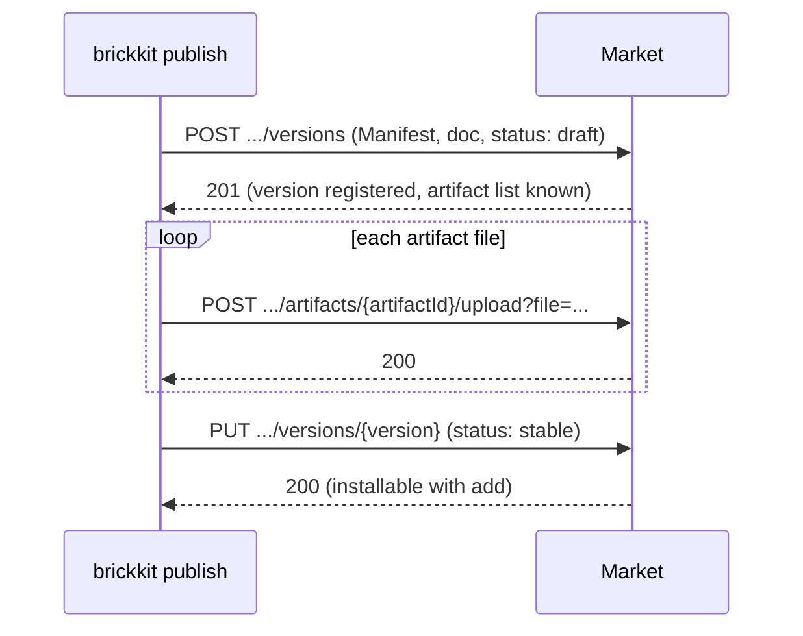

# BrickKit — part 9 of 9 (English)

Contains: docs/en/11-reference/04-config-schema-spec.md, docs/en/11-reference/05-json-schemas.md, docs/en/11-reference/06-market-api.md

File paths below are relative to the repository root, https://raw.githubusercontent.com/brickKit/brickKit/main/ ; links inside pages are relative to this file

This is the last part.

---

> File: docs/en/11-reference/04-config-schema-spec.md

# The configSchema spec

`configSchema` is a block in a component's `component.yaml` declaring which config items the component recognises. Its
form borrows a subset of JSON Schema (draft-07): one `type: object`, with `properties` listing each item and `required`
listing the required ones. How to split and name the items: [Designing configSchema](../../docs/en/03-component-guide/03-config-schema-design.md).

## Structure

```yaml
configSchema:
  type: object
  properties:
    DB_HOST:
      type: string
      description: PostgreSQL host name
    DB_PORT:
      type: integer
      default: 5432
      minimum: 1
      maximum: 65535
      description: PostgreSQL port
    DB_PASSWORD:
      type: string
      secret: true
      description: Password to connect with
    REGIONS:
      type: array
      items:
        type: string
      default: [eu-west, us-east]
      description: Regions served
  required: [DB_HOST, DB_PASSWORD]
```

| Written | Means |
| --- | --- |
| The keys of `properties` | Config item names, which are the environment variable names injected, as they are: they must be valid environment variable names (letters, digits and underscores, not starting with a digit) |
| `type` | `string` / `integer` / `number` / `boolean` / `array` / `object` |
| `default` | Used when no value is written; scalars are injected as strings, exactly as written (`default: 1.10` is injected as `1.10`, not `1.1`), `array` / `object` as one line of JSON |
| `description` | Appears at the end of the line in the project's config skeleton |
| `secret: true` | The item is a secret: at deployment it takes the secret channel, never written into deployment files in plain text |
| `required` | The required items; each must be declared under `properties` |
| `enum`, `minimum`, `maximum`, `pattern`, `items` | Allowed values — **documentation only** |

The exact rules of each field: [component.yaml field reference](../../docs/en/11-reference/01-component-yaml-schema.md#configschema).

## The platform checks key names, not values

This is the most important rule of `configSchema`.

**Key names** the platform checks:

| Situation | Result |
| --- | --- |
| `config/` writes a key that isn't in `configSchema` | A warning that it "has no effect", with a guess at what you meant |
| The component has no `configSchema`, yet `config/` holds config for it | A warning: none of that config takes effect |
| An item in `required` has no `default` and nothing was filled in under `config/` | `up` refuses to start, naming the missing item |
| A key name collides with a name the platform reserves | `up` / `lint` warn and ignore the item; a market refuses it |

**Values** the platform doesn't check: `"abc"` in a `type: integer` item, a value outside `enum`, a number above `maximum` —
the platform injects them all as usual.

The line is whether there's a safety net at run time. A wrong value fails when the component reads it (it can't be
parsed, it fails validation), so you're sure to notice, and how to handle a wrong value is the component's own decision. A
wrong key name means the variable doesn't exist at all, the component takes its default branch and runs normally —
nothing fails, the config just quietly doesn't take effect. Only the platform can catch errors of that kind, so that's the
only kind it checks.

And once value checking starts, it doesn't stop: types, enums, ranges, regular expressions, nested structures… JSON Schema
can do almost anything, and every extra check is one more decision the platform makes for the component.

So a component validates values itself at start-up:

```go
port, err := strconv.Atoi(os.Getenv("DB_PORT"))
if err != nil || port < 1 || port > 65535 {
	log.Fatalf("DB_PORT must be a port number, got %q", os.Getenv("DB_PORT"))
}
```

## How it relates to JSON Schema

The form is compatible with JSON Schema, but it isn't **executed** as JSON Schema: the CLI reads only the keys of
`properties`, `type`, `default`, `required`, `secret` and `description`; the other keywords are kept as they are, for people
to read. A keyword not listed here written in an item (a misspelled `defualt`, or `format`, `examples`, `oneOf`… out of
JSON Schema habit) is dropped when parsing — it has no effect. The author gets a warning where they can hear it and fix it
(`lint`, local source scans, `publish`); installing someone else's component doesn't fail because of it, since the project
using it can't change someone else's Manifest.

## Editors

`schemas/component.schema.json` describes the structure of the `configSchema` block; wired into an editor, writing
`configSchema` gets completion, and a misspelled keyword (`defualt`) is marked red at once. See
[JSON Schemas](../../docs/en/11-reference/05-json-schemas.md). `lint` also reports misspelled keys in a `configSchema` item:

```text
Warning: some keys declared on configSchema items won't take effect
```

---

> File: docs/en/11-reference/05-json-schemas.md

# JSON Schemas

## The `schemas/` directory

The repository's `schemas/` holds three JSON Schemas (draft-07), describing the structure of the three kinds of file:

| File | Describes |
| --- | --- |
| `schemas/component.schema.json` | A component's `component.yaml` |
| `schemas/brickkit.schema.json` | A project's `brickkit.yaml` |
| `schemas/deploy.schema.json` | Deploy files: `deploy.yaml`, `deploy.local.yaml`, `deploy.<environment>.yaml` |

They're generated from the CLI's Go structs, not written by hand: when a struct changes, they're regenerated and committed
together; `make lint` (its `check-schemas` step, which also runs before every release) stops "the struct changed but
nobody regenerated". So the fields in the schemas match the fields the CLI really accepts, one for one.

## Wiring them into an editor

Once an editor with a YAML language service (the Red Hat YAML extension in VS Code, the JetBrains family,
yaml-language-server in Neovim…) has the schemas: field names get completion, and wrong types, missing required fields and
misspelled field names are marked red at once — the same set of structural problems `brickkit lint` reports, only seen
while you type.

**Method one: a comment at the top of the file.** It applies to one file, the same for whoever opens it:

```yaml
# yaml-language-server: $schema=https://raw.githubusercontent.com/brickKit/brickKit/main/schemas/deploy.schema.json
target: docker
components:
  - id: demo/hello
```

`component.yaml` uses `component.schema.json`, `brickkit.yaml` uses `brickkit.schema.json`.

**Method two: map by file name in the editor's settings.** VS Code's `settings.json`:

```json
{
  "yaml.schemas": {
    "https://raw.githubusercontent.com/brickKit/brickKit/main/schemas/component.schema.json": "component.yaml",
    "https://raw.githubusercontent.com/brickKit/brickKit/main/schemas/brickkit.schema.json": "brickkit.yaml",
    "https://raw.githubusercontent.com/brickKit/brickKit/main/schemas/deploy.schema.json": ["deploy.yaml", "deploy.*.yaml"]
  }
}
```

Put it in the project's `.vscode/settings.json`, and the whole team has it on opening the project. To pin a CLI version,
replace `main` in the URLs with that version's tag, or point at a local copy.

## What they cover, and what they don't

A JSON Schema describes only **one file's structure**: field names, types, required fields, fixed values (`target` can
only be `docker` / `podman` / `k8s`, and so on).

What they don't cover belongs to other checks:

| Rule | Checked by |
| --- | --- |
| Combinations of fields (`localPort` needs `mode`, `exposePort` needs `expose`, `mode: debug` only in `deploy.local.yaml`) | `brickkit lint` |
| Config items colliding with names the platform reserves, typos inside a `configSchema` item | `brickkit lint` |
| Whether the three layers agree (one deploy entry per component version, `$var:` defined, keys in `config/` present in `configSchema`) | `brickkit lint` |
| Whether dependencies resolve, whether the member versions a shell hosts are right | `brickkit up --dry-run` |
| Config values in `config/*.yaml` | No schema: each component's config items differ, set by its own `configSchema`, and `lint` checks key names against it |

Nothing red in the editor doesn't mean `lint` passes; `lint` passing doesn't mean `up --dry-run` passes — each of the three
checks more than the last.

---

> File: docs/en/11-reference/06-market-api.md

# Market API reference

The HTTP interface of BrickKit Market, the component marketplace. Every endpoint listed here is implemented and matches the server's route table one to one. A test in `market-server` fails if this page lists an endpoint that does not exist, or leaves out one that does.

You rarely need to call these endpoints yourself: `brickkit login`, `publish`, `add` and `fetch` wrap them. This page is for anyone writing their own market client, or trying to understand exactly how the market behaves.

## The market is optional

A market is one kind of **install source**. BrickKit does not need one to work: a project that uses only local and git sources can install, deploy and upgrade components.

- **Git source.** A component is released by tagging its repository. When the component sits at the repository root, the tag is the version (`1.2.0`). When it sits in a subdirectory named `<scope>-<name>/`, the tag is `<scope>-<name>/1.2.0`. `brickkit release` checks the working tree, then creates and pushes the tag for you.
- **Local source.** Reads component directories straight from disk; this is what you use while developing.

On top of that, a market gives you a few things git cannot, or can only do awkwardly:

| What the market adds | Why a git source can't |
| --- | --- |
| Search and browsing by tag | Git fetches by repository URL; it has no idea which components exist |
| Private components, granted to users and organizations | Git permissions apply to a whole repository, not to a component |
| Closed-source distribution: an image and an API contract, no source | Installing from a git source reads the repository itself |
| A place for the publisher's signature to travel with the release | A git tag has nowhere to carry a BrickKit signature |
| Delisting after the fact (`blocked`): a bad release stops being installable | Deleting a git tag doesn't stop anyone who already cloned, and nobody is told why |

Without a market, everything else works the same. When you need the features above, run your own (or use the one your team already runs). There is no public market operated by the BrickKit project.

## Conventions

**Base URL.** The address of the market instance you use. Every path starts with `/api/v1`.

**Authentication.** Endpoints that need it take a bearer token:

```
Authorization: Bearer <token>
```

`POST /api/v1/auth/login` issues the token. It is the value `brickkit login` stores in `.brickkit/credentials`. Reading public components needs no token; everything about a private component, and every publish, does.

**Response envelope.** Every response except the doc endpoint (described below) has the same shape:

```json
{"success": true, "data": { "...": "..." }}
```

```json
{"success": false, "error": {"code": "MANIFEST_INVALID", "message": "the Manifest failed validation", "details": { "...": "..." }}}
```

`error.details` carries structured information such as the individual validation problems or conflict details; not every error has it. Messages are always in English. If you branch on errors, branch on `code`: it is stable.

## Error codes

| Code | HTTP status | Meaning |
| --- | --- | --- |
| `INVALID_REQUEST` | 400 | The body is not valid JSON, is larger than 8 MiB (`details.limitBytes`), or a request field (source type, version, visibility, doc, …) is invalid |
| `MANIFEST_INVALID` | 400 | The Manifest in a publish request failed validation; `details.problems` lists each problem |
| `CONFIG_SCHEMA_RESERVED_VARIABLE_CONFLICT` | 400 | A `configSchema` key has the same name as a variable the platform injects |
| `CLOSED_SOURCE_MISSING_API_CONTRACT` | 400 | A closed-source component declares no `api-contract` artifact |
| `UNAUTHORIZED` | 401 | No token, or the token is invalid or expired |
| `FORBIDDEN` | 403 | The token is valid, but this identity isn't allowed to do this |
| `COMPONENT_BLOCKED` | 403 | A market admin has delisted the component or version |
| `NOT_FOUND` | 404 | The component, version, organization or doc doesn't exist |
| `CONFLICT` | 409 | A state conflict, such as adding a user who already belongs to another organization |
| `VERSION_ALREADY_EXISTS` | 409 | The version number has been used. Version numbers can't be republished, and a soft-deleted version keeps its number |
| `INTERNAL` | 500 | Something failed inside the market. The cause goes to the server log only; it is never sent to the client |

## Endpoints

### Operations and audit

| Method | Path | Auth | Description |
| --- | --- | --- | --- |
| GET | `/api/v1/health` | No | Health check: returns `status`, the server version and the current time. A self-hosted deployment's container healthcheck probes this |
| GET | `/api/v1/audit` | Yes | The audit log, newest first. Query parameters: `componentId`, `action`, `limit`. An admin sees every entry; anyone else sees the entries on components they own (other people's downloads included) and their own actions |

### Accounts

| Method | Path | Auth | Description |
| --- | --- | --- | --- |
| POST | `/api/v1/auth/register` | No | Create an account. Body: `username`, `password`, optional `email` |
| POST | `/api/v1/auth/login` | No | Log in. Body: `username`, `password`. The response carries `token` and `expiresAt` |
| POST | `/api/v1/auth/logout` | Yes | Revoke the token this request carries (the account's other tokens are untouched). Calling it again is not an error |

⚠️ An `orgId` in a registration body is ignored. Organization membership is what grants read access to an organization's private components; if people could declare their own organization at sign-up, anyone could read anyone's private components. The only way into an organization is the "add member" endpoint below, called by the organization's owner or a market admin.

### Organizations

| Method | Path | Auth | Description |
| --- | --- | --- | --- |
| GET | `/api/v1/organizations` | Yes | List organizations. A regular user sees only their own; an admin sees all |
| POST | `/api/v1/organizations` | Yes | Create an organization. The creator becomes its owner and a member |
| POST | `/api/v1/organizations/{orgId}/members` | Yes (organization owner or admin) | Add a member |

A user belongs to at most one organization. Adding someone who is already in another organization returns `CONFLICT` rather than silently moving them, which would cut them off from their current organization's private components. Adding the same person twice is not an error.

### Components

| Method | Path | Auth | Description |
| --- | --- | --- | --- |
| GET | `/api/v1/components` | Depends on visibility | Search. Query parameters: `keyword`, `page`, `pageSize`, `tags` (comma-separated, or repeated). Returns only components that aren't delisted and that the caller can see |
| GET | `/api/v1/components/{scope}/{name}` | Depends on visibility | Component details and its list of version numbers |
| PUT | `/api/v1/components/{scope}/{name}/visibility` | Yes (owner) | Set visibility: `public` or `private` |
| GET | `/api/v1/components/{scope}/{name}/access` | Yes (owner) | Which users and organizations a private component is granted to |
| PUT | `/api/v1/components/{scope}/{name}/access` | Yes (owner) | Replace the access policy |

A component ID has two parts, `scope/name`, and the path has both: `/api/v1/components/people/basic`.

A component is created by its first publish, and the publisher becomes its owner. Namespaces are first come, first served, except `brickkit/` and `infra/`, which are reserved for market admins.

### Versions

| Method | Path | Auth | Description |
| --- | --- | --- | --- |
| GET | `/api/v1/components/{scope}/{name}/versions` | Depends on visibility | List versions (without the Manifest body). `draft` versions are visible to the owner only; deleted versions are not listed |
| POST | `/api/v1/components/{scope}/{name}/versions` | Yes (only the owner, for an existing component) | Publish a new version; see [Publishing](#publishing) |
| PUT | `/api/v1/components/{scope}/{name}/versions/{version}` | Yes (owner; delisting is admin-only) | Change the status to `draft`, `stable` or `deprecated`; only an admin can set `blocked`. Moving to `stable` requires every declared artifact file to be uploaded |
| DELETE | `/api/v1/components/{scope}/{name}/versions/{version}` | Yes (owner) | Soft delete: the version behaves as if it doesn't exist, but its number stays taken |
| GET | `/api/v1/components/{scope}/{name}/versions/{version}/manifest` | Depends on visibility | The version's Manifest; this is where `brickkit add` gets it |
| GET | `/api/v1/components/{scope}/{name}/versions/{version}/doc` | Depends on visibility | The version's `BRICKKIT.md`; see [Component docs](#component-docs) |

The `data` of `/manifest` holds `manifest` (the `component.yaml` as JSON), `status`, `sourceType` (`git` for open source, `registry` for closed source), `gitUrl` (the open-source repository, which `add --repo` clones) and `signature` (the signature supplied at publish time; absent when there is none).

Whether a caller gets a version: a `draft` is visible to its owner only, a `blocked` version answers `COMPONENT_BLOCKED`, a deleted one answers `NOT_FOUND`, and a private component answers `FORBIDDEN` to anyone without a grant. `/doc` applies exactly the same rules as `/manifest`.

### Artifacts

| Method | Path | Auth | Description |
| --- | --- | --- | --- |
| GET | `/api/v1/components/{scope}/{name}/versions/{version}/artifacts` | Depends on visibility | The version's registered artifacts, each with `id`, `type`, `format` and `files` |
| POST | `/api/v1/components/{scope}/{name}/versions/{version}/artifacts/{artifactId}/upload` | Yes (owner) | Upload one file of a registered artifact. The `file` query parameter is its path inside the component; the body is the file content. At most 64 MiB per file |
| GET | `/api/v1/components/{scope}/{name}/versions/{version}/artifacts/{artifactId}/download` | Depends on visibility | Download one artifact file; `file` as above |

The artifact **list** (which artifacts exist and which files each has) is registered at publish time from the Manifest's `artifacts`. An upload can only deliver a file that list declares.

## Publishing

The body of `POST /api/v1/components/{scope}/{name}/versions`:

```json
{
  "version": "1.2.0",
  "status": "draft",
  "manifest": { "apiVersion": "brickkit/v1", "kind": "Component", "metadata": { "id": "people/basic", "version": "1.2.0" } },
  "sourceType": "git",
  "gitUrl": "https://github.com/example/people-basic",
  "changelog": "Add a status field to people",
  "visibility": "public",
  "doc": "# people/basic\n\nHow to call it…\n",
  "docTranslations": { "de": "# people/basic\n\nSo wird es aufgerufen…\n" },
  "signature": {
    "algorithm": "cosign",
    "publicKeyRef": "keys/vendor.pub",
    "value": "<base64 signature>",
    "signedBy": "release-bot@example.com"
  }
}
```

| Field | Required | Description |
| --- | --- | --- |
| `version` | Yes | Must equal `manifest.metadata.version` |
| `status` | No | `draft` when omitted |
| `manifest` | Yes | The `component.yaml` as JSON; stored as sent |
| `sourceType` | Yes | `git` (open source; `gitUrl` is then required) or `registry` (closed source) |
| `gitUrl` | For open source | The component's git repository |
| `changelog` | No | What changed in this version |
| `visibility` | No | `public` or `private`. When given, the component is set to it, existing components included; when omitted, a new component is `public` and an existing one keeps its setting |
| `doc` | No | The full text of `BRICKKIT.md` from the component's root: UTF-8, at most 256 KiB |
| `docTranslations` | No | Translations of `BRICKKIT.md` (the component root's `BRICKKIT.<lang>.md`), keyed by lowercase language code (`zh`, `pt-br`): at most 16, each at most 256 KiB, all docs together at most 1 MiB |
| `signature` | No | The publisher's signature over the Manifest. The market checks only its structure (a known algorithm, required fields present, `value` valid base64); it does no cryptographic check, because it holds no public key worth trusting. Verification happens on the installing side, against the public keys the project configures |

### What the market checks

**The Manifest rules are the CLI's rules: the same code.** A `component.yaml` that `brickkit lint` accepts in the component repository passes the market's Manifest checks, and whatever the CLI rejects, the market rejects: misspelled field names (an unknown field is refused, never silently ignored), version ranges such as `^1.0.0`, shell members without an exact version. A request that bypasses the CLI and calls this endpoint directly gets exactly the same checks.

Each problem is reported separately in `details.problems`:

```json
{
  "success": false,
  "error": {
    "code": "MANIFEST_INVALID",
    "message": "the Manifest failed validation",
    "details": {
      "problems": [
        {"field": "dependencies.components[0]", "reason": "..."},
        {"field": "futureField", "reason": "..."}
      ]
    }
  }
}
```

Manifest problems and request-field problems (`version`, `sourceType`, `visibility`, …) come back together, so one round of fixes is enough.

**On top of that, the market checks a few things that only matter for a market release:**

1. **`deployment.image` is required.** Whoever installs from the market has no source code, so they can't build an image. A component that only declares `deployment.build` (built from source) is distributed through a git source.
2. **No config key may take the name of a platform-injected variable.** A `configSchema` key is the name of the environment variable the component receives; if it collides with a name the platform injects itself, the component never sees its own value. The reserved names are `COMPONENT_ID`, `COMPONENT_VERSION`, `BRICKKIT_SERVED_MEMBERS`, `BRICKKIT_SERVED_MEMBERS_CONFIG`, `PORT`, and every name ending in `_ENDPOINT`. When the CLI deploys such a component it only warns and skips that key, since the component may come from a source that never went through a market. The market refuses it at publish time with `CONFIG_SCHEMA_RESERVED_VARIABLE_CONFLICT`; each entry in `details.conflicts` has `configKey`, `conflictPattern`, and a `suggestion` that avoids the pattern.
3. **A closed-source component must ship its API contract.** A `sourceType: registry` component declares at least one artifact with `type: api-contract`: the code may stay private, the interface its callers depend on may not.
4. **`doc` is at most 256 KiB.** It arrives as a JSON string, so it is text by construction; `brickkit publish` checks the size before it creates the version, and refuses a file that isn't UTF-8. This problem is reported together with the Manifest and request-field problems.
5. **`docTranslations` keys are language codes**, there are at most 16, each is at most 256 KiB, and `doc` plus every translation is at most 1 MiB — the limit is on the total so that the request-size limit doesn't have to grow with the number of translations. Problems are reported on the field `docTranslations`.

### Publishing takes three requests

`brickkit publish` wraps them in one command:



A version left at `draft` can't be installed. If a publish fails halfway, run `brickkit publish` again: it recognizes the unfinished `draft` and carries on uploading. If `component.yaml` or `BRICKKIT.md` changed in the meantime, even with the same version number, the CLI refuses to resume and asks for a new version number: what is registered can't be changed, and resuming would pair the old Manifest or doc with the new artifacts.

## Component docs

`GET /api/v1/components/{scope}/{name}/versions/{version}/doc` returns the `BRICKKIT.md` published with that version:

- On success, the body is the file itself with `Content-Type: text/markdown; charset=utf-8`. It is **not** wrapped in the envelope; it is a file.
- A version published without a doc answers `404` with code `NOT_FOUND`, in the usual JSON envelope. Every version published before the market supported docs answers this way.
- Who may read it, and which versions they see, follows exactly the rules of `/manifest`.
- A market that predates this endpoint ignores `doc` in the publish request and answers 404 on `/doc`. `brickkit publish` checks after creating the version and says so when the doc wasn't kept; the version is published anyway, just without its doc.
- `/doc?lang=<code>` returns that translation (`BRICKKIT.<code>.md`) in the same way, or `404` when the version has none in that language. Which languages exist is in the `docLanguages` array of the `/manifest` response (absent when there are none), so a client fetches each one without guessing.

`BRICKKIT.md` is what a component tells its callers: how to call it, how to configure it, what to watch out for. It is written for people and for AI assistants alike. When `brickkit add` or `fetch` gets a Manifest, it gets the doc and every translation too and caches them at `.brickkit/manifests/<scope>/<name>/<version>/BRICKKIT.md` (and `BRICKKIT.<lang>.md`), the same as for local and git sources. A missing doc is not an error; the component installs and runs as usual.

**The doc is not signed.** The signature protects what gets executed: the Manifest decides what is deployed, what is injected and which migration runs, and the image is the code that runs. The doc is explanatory text; changing it changes nothing that runs. The worst a compromised market can do with it is mislead a reader, not alter a deployment.

## Endpoints that deliberately don't exist

| Missing endpoint | Why |
| --- | --- |
| `POST /api/v1/components` (create a component on its own) | The first publish creates the component; a separate create call would have no caller |
| `PUT /api/v1/components/{scope}/{name}` (edit component details) | Name, description and vendor follow the Manifest and update with each new version. Editing them separately would let the market's description drift from the Manifest |
| `DELETE /api/v1/components/{scope}/{name}` (hard delete) | Someone may already have the component in a project. To stop new installs, delist it (`blocked`) |
| `GET /api/v1/components/{scope}/{name}/versions/{version}` (one version's details) | The version list already has everything |
