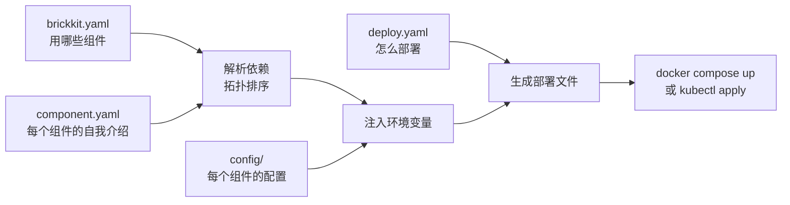
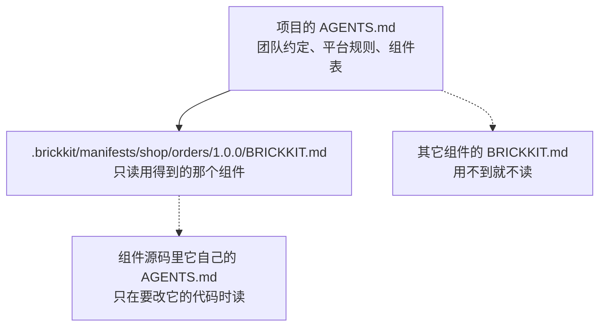
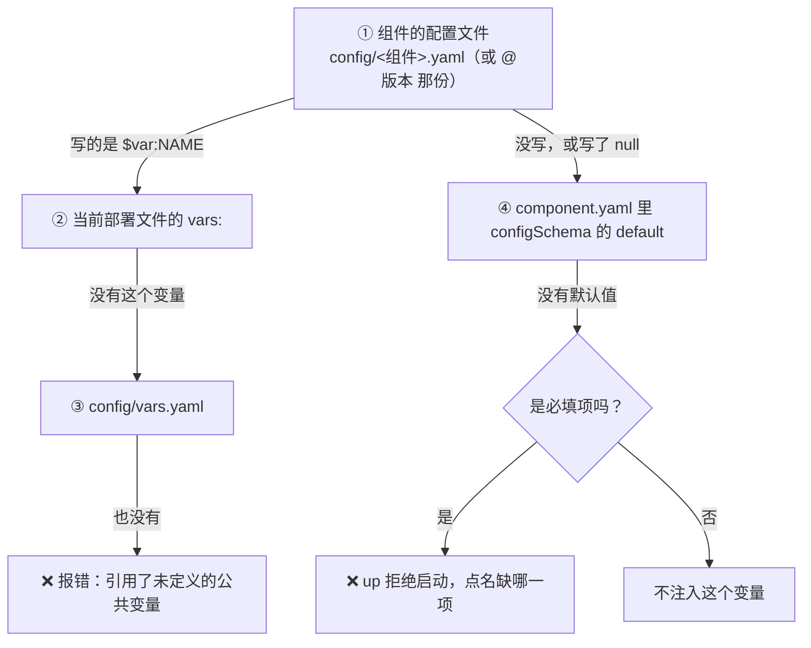

# BrickKit — 核心合集——先读这一份 (中文)

包含: AGENTS.zh.md, docs/zh/00-intro/01-what-is-brickkit.md, docs/zh/00-intro/02-quick-start.md, docs/zh/00-intro/04-core-concepts.md, docs/zh/00-intro/06-fractal-architecture.md, docs/zh/01-three-layers/01-overview.md, docs/zh/01-three-layers/08-resolution-priority.md, docs/zh/01-three-layers/09-field-reference.md

下面 File 与包含里的路径都相对仓库根目录 https://raw.githubusercontent.com/brickKit/brickKit/main/ ；页内链接相对这份合集自己

下一份: 其余全部文档，每页一次，按阅读顺序: https://raw.githubusercontent.com/brickKit/brickKit/main/llms/zh/01.md … 09.md

---

> File: AGENTS.zh.md

# BrickKit（中文版）

> 如果你是 AI 助手，这是你理解整个平台的唯一入口。读完这一份文件，你就知道该去哪里找什么、
> 不该读什么、以及这个平台的设计边界在哪里。
>
> 用户用英文（或其它语言）提问时，改读 [`AGENTS.md`](../../AGENTS.md)——内容对等的独立英文版，不是译本。
>
> 这份文件里的路径都相对仓库根目录；在网页上读，前面加 https://raw.githubusercontent.com/brickKit/brickKit/main/ 。
> 想用最少的抓取读完全部文档，从 [`llms/zh/00-core.md`](00-core.md) 开始，顺着"下一份"往下读。

## §1 平台定位

BrickKit 是一个声明式的组件组装平台：你声明要哪些组件、它们依赖谁，CLI 派生其余的一切——
启动顺序、服务地址、环境变量、部署文件——然后交给 Docker（或 Podman）、Kubernetes 执行，自己退出。

项目由三层文件描述，每层只管一件事：

| 层 | 文件 | 管什么 |
| --- | --- | --- |
| 声明 | `brickkit.yaml` | 有哪些组件、什么精确版本、谁是外壳；它就是锁文件 |
| 部署 | `deploy.yaml`（团队）/ `deploy.local.yaml`（个人，不进 Git） | 怎么跑：目标、端口、模式、外壳成员、K8s 设置 |
| 配置 | `config/<组件>.yaml`、`config/vars.yaml` | 每个组件拿到哪些环境变量 |

没有注册中心、没有配置中心、没有网关、没有常驻进程：CLI 跑完就退出，服务发现就是 Docker / K8s 的 DNS。

## §2 核心设计原则（十条）

1. **大声失败**：配置冲突、必填缺失、重复 key、推送失败，都在操作的那一刻报出来，不留到运行时才暴露。
2. **平台极简**：平台只做机械操作，不猜语义——不猜重命名、不做类型转换、不替组件决定降级。
3. **所见即所得**：没有隐式覆盖，你打开的那份文件就是实际生效的配置。
4. **组件自治**：组件需要什么配置、怎么降级、日志长什么样，由组件自己决定；平台只要 Manifest、健康检查和环境变量。
5. **职责单一**：三层文件各管一件事，同一个事实只写在一个地方。
6. **原子性操作**：`add`、`remove`、`upgrade`、`release` 要么完全成功，要么回到原样，不留半成品。
7. **显式优于隐式**：精确版本、`$var:` 显式引用、显式暴露端口；拒绝"自动猜"。
8. **概念一致性**：一个组件的项目和五十个组件的项目用同一套三层文件，没有"单文件模式"。
9. **构建与部署分离**：构建镜像是你的显式动作（`brickkit build`），`brickkit up` 绝不自动构建。
10. **按需检索优于全量合并**：不提供"把三层合成一份"的视图命令；要知道什么，就去读负责它的那一层。

每一条的论证（是什么、换来什么、代价是什么、拒绝了什么）见
[`docs/zh/06-architecture/05-design-principles.md`](../../docs/zh/06-architecture/05-design-principles.md)。

## §3 三层文件架构

### 3.1 文件检索地图

| 想知道什么 | 读哪个文件 |
| --- | --- |
| 项目有哪些组件、什么版本 | `brickkit.yaml` |
| 组件怎么部署（目标、端口、模式、外壳成员） | 本地模式开着时读 `deploy.local.yaml`，否则读 `deploy.yaml`（`-f` 指定的文件优先） |
| 组件拿到的环境变量（连接串、密钥、开关） | `config/<组件 ID 把 / 换成 ->.yaml`，带版本号的 `config/<…>@<版本>.yaml` 优先 |
| 公共变量 | `config/vars.yaml`（部署文件的 `vars:` 可以覆盖同名项） |
| 组件的依赖、能力声明、`configSchema` | `.brickkit/manifests/<scope>/<name>/<版本>/component.yaml`，本地源组件读源码里的 `component.yaml` |
| 一个事件谁在发布、谁在订阅（经消息系统传的事件不是依赖） | `brickkit deps` 最后的事件清单，来自各组件 `component.yaml` 的 `events`；`brickkit graph` 把它画成带标签的虚线 |
| 依赖组件怎么用、负责什么不负责什么、配置项什么意思 | `.brickkit/manifests/<scope>/<name>/<版本>/BRICKKIT.md`（译本 `BRICKKIT.<语言>.md`）；本地源里正好是这个版本时，读源码目录里那份 |
| 项目里有哪些组件、各干什么 | 项目 `AGENTS.md` 末尾的组件表（`add` / `remove` / `upgrade` 维护） |
| 怎么改一个组件：代码地图、构建与测试、易错点 | 组件自己的 `AGENTS.md` |

### 3.2 关键规则

- `brickkit.yaml` 是锁文件：用到的每个组件版本都写在这里。没声明的强依赖是错误（报错时给出 `add` 的写法），没声明的弱依赖就是不存在。
- `deploy.local.yaml` 是**完整替换**，不是属性覆盖：本地模式开着时，运行部署的命令（`up`、`down`、`status`、`sync`、`build`）只读它、不读 `deploy.yaml`；`lint` 只要 `deploy.local.yaml` 存在就两份都查，不管开关；`graph` 与 `deps` 从不读 `deploy.local.yaml`，输出对谁都一样（`graph -f` 读它指定的那份）。它必须与 `brickkit.yaml` 一一对应，团队加了组件就要 `brickkit local refresh`。
- `mode: debug` 只写在 `deploy.local.yaml`：那是"我正在自己机器上调它"这个个人事实，不进 Git。
- `focus: <id>` 只写在 `deploy.local.yaml`——在组件目录里 `brickkit up` 或 `up --focus <id>` 会写上它，`up --all` 去掉它。写了它，就只启动这个组件（从源码跑）和它需要的组件；`sync` 不看它，`target: k8s` 下用不了。
- 项目命令在任何子目录里都能用：往上找到最近的 `brickkit.yaml`（像 `git` 一样，不停在 `.git`），找到上面的就说一句 `📁 项目：…`；打印的路径都相对你所在的目录。`release`、`publish`、`init`、`skills` 作用于当前目录。
- `$var:NAME` 从 `config/vars.yaml`（或部署文件的 `vars:`）取值；`${NAME}` 从进程环境与 `.env` 取值；`file://路径` 读文件；`$endpoint:<id>[/路径]` 是另一个组件的地址，按 `*_ENDPOINT` 的规则算（可以写在 `vars.yaml` 里；不进启动顺序，可以成环）。没有隐式的环境变量覆盖。
- `brickkit up` 绝不构建镜像：本地该有的镜像没有时，它报错并告诉你跑 `brickkit build`。
- `brickkit init <名字>` 新建目录；不带名字的 `brickkit init` 在当前目录补全缺的文件，`.gitignore` 缺必需条目时大声警告。已有的文件一个字节都不动——唯一的例外是 `AGENTS.md` 末尾由 brickkit 维护的那一段，它会原地改写。缺 `AGENTS.md`（作者自己的 AI 导读，末尾一段由 brickkit 维护）和 `CLAUDE.md`（`@AGENTS.md`）时会写上；没有项目级的 `BRICKKIT.md`。

### 3.3 分形架构（套娃机制）

- **开发态**：组件仓库自己就可以是一个完整的 BrickKit 项目（有自己的三层文件，用来本地联调）。
- **消费态**：使用它的项目只读它的 `component.yaml`（契约）和 `BRICKKIT.md`（文档）。
- **物理不套娃，规范套娃**：子组件的三层文件不会被带进父项目，只有契约和文档会。
- `brickkit add` 时把组件的 `BRICKKIT.md` 和它的译本永久缓存到 `.brickkit/manifests/` 下。
- **组件给每类读者各带一份文档**：给使用它的项目的 `BRICKKIT.md`（六节，不放相对链接），给开发它的 AI 的 `AGENTS.md` + `CLAUDE.md`（代码地图加另外四节），给 GitHub 上的人的 `README.md`；历史只在 Git 里。`brickkit lint` 会以警告的形式检查它们。
- **项目里的组件用焦点运行，独立的组件用工作台。** 焦点运行不需要任何自己的文件；工作台是组件仓库自己的 `brickkit.yaml`，最近的 `brickkit.yaml` 永远说了算。
- **只有一个 `components/`**：组件源码只放在项目的 `components/` 里。嵌在另一个组件目录里的组件，`up`、`lint`、`sync` 都拒绝，也从不替你挪；`add --repo` 总是克隆到项目的 `components/`。git submodule 从不拉取。

### 3.4 AI 的三层路由

1. 读本文件，理解规范和检索路径。
2. 读项目的 `AGENTS.md`：项目约定，以及末尾的组件表——项目里有哪些组件、各干什么。
3. 按需读某个组件的 `BRICKKIT.md`（`.brickkit/manifests/` 下），理解那一个组件；要改它，读它自己的 `AGENTS.md`。
4. 来了新需求：[`docs/zh/08-ai-guide/03-judging-a-requirement.md`](../../docs/zh/08-ai-guide/03-judging-a-requirement.md)——归哪个组件、合不合理、按什么顺序改。

不要一次把所有组件文档读进来：问题只涉及哪个组件，就只读哪个。

## §4 外壳机制速查

- 外壳是一个普通组件，把多个成员组件编进**一个进程**里跑（1:N），用来省内存与 CPU。
- 成员写在部署文件里外壳条目的 `members` 下面（唯一来源）；`brickkit.yaml` 里外壳那一行带 `kind: shell`，由 CLI 维护。
- 外壳的 `component.yaml` 在 `shell.members` 里写明它编进了哪些成员的**精确版本**；项目托管的版本与之不符时报错，并给出三条出路。
- 成员的配置经 `BRICKKIT_SERVED_MEMBERS_CONFIG`（CLI 提前求好值的 JSON）注入外壳；多行密钥（PEM）、引号、`$` 照样能 JSON 编码，不是合法 UTF-8 的值（二进制）大声失败。
- 调用方的 `*_ENDPOINT` 由平台自动指到外壳的地址；外壳作者只负责进程内把请求分给对应成员。
- 成员的迁移照常单独跑，用成员自己的镜像与配置，所以每个成员都必须有自己的镜像（`image` 或 `build`）。
- 外壳本身也是组件：有自己的 `configSchema` 和 `config/` 文件。

## §5 命令集（21 个 + version + lang + docs + completion）

| 命令 | 核心行为 |
| --- | --- |
| `init` | 带名字：新建目录并生成三层骨架；不带名字：在当前目录补全缺的文件 |
| `skills` | 查看、刷新装进项目的 AI 助手技能，以及 `AGENTS.md` 里由 brickkit 维护的那一段（`status` / `update`） |
| `graph` | 依赖拓扑，输出 Mermaid |
| `lint` | 离线、只读地检查三层文件、`component.yaml` 与文档（警告） |
| `new` | 组件骨架（`--shell` 生成外壳） |
| `add` | 拉取组件与依赖，写入三层文件 |
| `remove` | 移除组件，配置移进 `config/.archive/` |
| `fetch` | 只下载组件的产物（契约），不装进项目 |
| `upgrade` | 升级版本，按新旧 `configSchema` 迁移配置，冲突处写重复 key 大声失败；动手前先列出跨过的各版本的发版说明 |
| `up` | 生成部署文件 → 跑迁移 → 起容器（绝不自动构建）；在组件目录里或带 `--focus` 时，只起这个组件和它需要的 |
| `down` | 停止容器（不删 volume） |
| `status` | 运行状态表 |
| `sync` | 整理组件源码工作区：这次用不上的收进 `.archived/`，要用的放回来 |
| `local` | 本地模式：`on` / `off` / `status` / `refresh` |
| `restore` | 把 `mode` 与源码结构还原到最后一次提交 |
| `deps` | 依赖树 |
| `build` | 显式构建需要在本机构建的镜像（`--force`） |
| `release` | 校验 → 组件自己的 `release.checks` → 打 Git tag → 推送，推送失败就删掉 tag；`--skip-checks` 跳过组件的检查（会说出来）；`--notes` / `--notes-file`：可选的发版说明，写进带注释的 tag；`--local` 批量发布 |
| `publish` | 发布到组件市场（可选的基础设施）；先跑 `release.checks`；`--notes` / `--notes-file`、`--skip-checks` 同 `release` |
| `login` | 登录组件市场 |
| `logout` | 退出组件市场（吊销令牌、删本地凭据） |

`version` 打印版本（`brickkit --version` / `-v` 打印的一样）；`lang` 查看或设置 CLI 的界面语言（`lang set zh|en`）；`docs` 离线打印正在跑的这个版本的 BrickKit 文档（`brickkit docs` 列出全部页，`brickkit docs 04-shell` 打印一页）；`completion` 打印某种 shell 的 TAB 补全脚本（`install.sh` 会给 bash、zsh、fish 装好）。

### 参数

- 唯一的全局参数是 `--log-level`（stderr 上 JSON 日志的级别，默认 `warn`）。
- `-f, --file <路径>`：读部署文件的命令（`up`、`down`、`status`、`sync`、`lint`、`graph`）用它指定一份部署文件，同时完全忽略 `deploy.local.yaml` 与本地模式开关。
- `--no-local`：`up`、`down`、`status`、`sync` 本次忽略 `deploy.local.yaml`，不改变本地模式开关；对 `lint` 来说，它让配置检查以 `deploy.yaml` 为准（两份照样都查）。
- `--dry-run`：`up` 只生成部署文件不执行；`upgrade` 只演算不写盘。
- `--focus <id>` / `--all`：`up` 在 `deploy.local.yaml` 里设上或去掉焦点；两者都不能和 `-f`、`--no-local` 一起用。
- 在组件目录里不带参数：`build`、`deps`、`lint` 指的就是这个组件（`lint --all` 查整个项目）。

每条命令的全部参数见 [`docs/zh/07-cli-reference/README.md`](../../docs/zh/07-cli-reference/README.md)。

### 已经删掉的命令与参数

| 删掉的 | 现在怎么做 |
| --- | --- |
| `override` 命令与 `override.yaml` | `deploy.local.yaml` + `brickkit local` |
| `brickkit.yaml` 里的 `resources`、`servedBy`、`deploy:` | 连接信息进 `config/`，外壳成员进部署文件的 `members`，部署设置进 `deploy.yaml` |
| `--config` | 每个环境一份部署文件，`-f` 指定 |
| `up --context` | 在部署文件的 `k8s.context` 里写，不同集群用不同部署文件 |
| `publish --changelog` | `publish --notes` / `--notes-file`（与 `release` 是同一对参数） |

## §6 "不做"清单

| 不做 | 理由 |
| --- | --- |
| 服务注册 / 发现 | Docker / K8s 的 DNS 就是服务发现 |
| 常驻守护进程 | CLI 跑完就退出，状态在文件和底层引擎里 |
| 健康检查轮询 | K8s 探针与 Compose healthcheck 原生就做 |
| API 网关、服务网格 | 组件之间直接按 DNS 调用；外部网关用 `labels` 透传接入 |
| 配置中心 / 热更新 | 改 `config/` 或部署文件，再 `up` |
| 熔断、限流、重试、降级 | 组件自己的业务逻辑 |
| 版本范围（`^1.0.0`） | 精确版本才是契约 |
| 多环境覆盖继承 | 每个环境一份完整的部署文件 |
| 自动构建镜像 | 构建是你的显式动作 |
| 合并视图命令 | 按需检索优于全量合并 |
| 单文件模式 | 概念一致，永远是三层 |
| 隐式配置覆盖 | 所见即所得 |
| Git 鉴权 | 用宿主机自己的 Git 配置，出错原样透传 |
| 替你校验配置值的类型与范围 | `configSchema` 是说明书，只检查键名，不检查值 |

## §7 配置迁移与冲突处理

- 升级就是对比新旧版本的 `configSchema`，按键集合机械地迁移你的配置。
- 你改过、开发者也改了默认值的键，写成重复 key 并加注释，`up` 在你解决之前拒绝启动（大声失败）。
- `remove` 时配置归档进 `config/.archive/`，重新 `add` 时走同一套迁移算法恢复。
- 不猜重命名、不做类型转换、不做语义分析。

## §8 无市场分发

- 组件就是一个 Git 仓库，版本就是 Git tag（monorepo 子目录里的组件用 `<scope>-<name>/<版本>`）。
- 拉取走用户级的 bare repo 缓存（`<用户缓存目录>/brickkit/repos`，多个项目共享），按需增量 fetch。
- 读 Manifest 的顺序：项目的永久缓存 `.brickkit/manifests/` → 本机 bare repo 里直接读 → 增量 fetch → 首次 clone。
- CLI 不处理鉴权，`git` 的报错原样透传。
- `brickkit release`：校验 → 打 tag → 推送，推送失败删掉 tag；`--local` 批量发布本地源里的组件，遇到第一个失败就停。
- 组件可以在 `component.yaml` 里声明 `release.checks`：`release` 与 `publish` 打 tag、上传之前在组件目录下跑的命令（argv，不经 shell）；第一条非零退出就停止发布（`RELEASE_CHECK_FAILED`），`--skip-checks` 跳过并说出来。`add` / `fetch` 从不执行它。
- 发版说明可写可不写，是原样保留的 Markdown：`release --notes` / `--notes-file` 写进带注释的 tag（`publish --notes` 由市场存成版本的 changelog）；`upgrade`（`--dry-run` 也一样）动手之前先列出跨过的每个版本的说明。本地源没有说明。
- 组件市场（`publish` / `login` / `logout`，`sources[].type: market`）是可选的基础设施，与 Git 源并存。

## §9 文档地图

要知道什么 → 读哪一页。逐页、每页一行说明的完整列表在 [`llms.zh.txt`](../../llms.zh.txt)。

| 要知道什么 | 读 |
| --- | --- |
| 一次读懂整个平台 | [`llms/zh/00-core.md`](00-core.md)：这份文件加上几篇核心页 |
| 先跑起来 | [`docs/zh/00-intro/02-quick-start.md`](../../docs/zh/00-intro/02-quick-start.md) |
| 术语与概念 | [`docs/zh/00-intro/04-core-concepts.md`](../../docs/zh/00-intro/04-core-concepts.md) |
| 三份文件、每个字段 | [`docs/zh/01-three-layers/README.md`](../../docs/zh/01-three-layers/README.md)、[`docs/zh/01-three-layers/09-field-reference.md`](../../docs/zh/01-three-layers/09-field-reference.md)、[`docs/zh/11-reference/README.md`](../../docs/zh/11-reference/README.md) |
| 一个配置值从哪来 | [`docs/zh/01-three-layers/08-resolution-priority.md`](../../docs/zh/01-three-layers/08-resolution-priority.md) |
| 运行项目：init、add、local、up、upgrade…… | [`docs/zh/02-project-guide/README.md`](../../docs/zh/02-project-guide/README.md) |
| 在项目里只改一个组件 | [`docs/zh/02-project-guide/04-focus-run.md`](../../docs/zh/02-project-guide/04-focus-run.md) |
| 编写组件 | [`docs/zh/03-component-guide/README.md`](../../docs/zh/03-component-guide/README.md) |
| 组件的文档：每份写什么、译本、lint 查什么 | [`docs/zh/03-component-guide/08-component-doc-spec.md`](../../docs/zh/03-component-guide/08-component-doc-spec.md) |
| 判断新需求、制定改动计划 | [`docs/zh/08-ai-guide/03-judging-a-requirement.md`](../../docs/zh/08-ai-guide/03-judging-a-requirement.md) |
| 外壳 | [`docs/zh/04-shell/README.md`](../../docs/zh/04-shell/README.md) |
| 数据库迁移 | [`docs/zh/05-migration/README.md`](../../docs/zh/05-migration/README.md) |
| 架构、设计原则、环境变量契约、错误码 | [`docs/zh/06-architecture/README.md`](../../docs/zh/06-architecture/README.md)、[`docs/zh/06-architecture/05-design-principles.md`](../../docs/zh/06-architecture/05-design-principles.md)、[`docs/zh/06-architecture/03-env-injection-contract.md`](../../docs/zh/06-architecture/03-env-injection-contract.md)、[`docs/zh/06-architecture/09-error-codes.md`](../../docs/zh/06-architecture/09-error-codes.md) |
| 每条命令、每个参数 | [`docs/zh/07-cli-reference/README.md`](../../docs/zh/07-cli-reference/README.md) |
| AI 怎么配合 BrickKit 工作 | [`docs/zh/08-ai-guide/README.md`](../../docs/zh/08-ai-guide/README.md) |
| 推荐做法 | [`docs/zh/09-patterns/README.md`](../../docs/zh/09-patterns/README.md) |
| 出错了 | [`docs/zh/10-troubleshooting/README.md`](../../docs/zh/10-troubleshooting/README.md) |
| 贡献者的构建、测试与约定 | [`CONTRIBUTING.zh.md`](../../CONTRIBUTING.zh.md) |
| 某个功能的代码在哪 | 见下面 §10 |

## §10 代码地图

一个 Go 模块：`github.com/brickkit/brickkit`。CLI 的入口在 `cmd/brickkit/`；每条命令一个文件，`internal/cli/<命令>.go`。

### 包

| 包 | 管什么 |
| --- | --- |
| `internal/cli/` | 命令树：每条命令一个文件、参数、输出；报错里的路径按使用者所在的目录显示（`shown.go`）；TAB 补全的候选（`complete.go`） |
| `internal/project/` | 把一个项目（brickkit.yaml + 部署文件 + config/）装载成一个 `Project`；往上找项目根（`findroot.go`）；一致性检查；项目 `AGENTS.md` 末尾的组件表（`agents.go`） |
| `internal/project/projecttest/` | 测试辅助：用几行 YAML 搭一个三层项目并装载它 |
| `internal/projfile/` | `brickkit.yaml`：安装源、组件、版本、`kind: shell` |
| `internal/deployfile/` | 部署文件（`deploy.yaml`、`deploy.local.yaml`、`-f`）：字段、校验、`focus`、本地修改的差异 |
| `internal/configdir/` | `config/`：每个组件的环境变量文件、`vars.yaml`、取值、骨架、升级时的配置迁移 |
| `internal/manifest/` | `component.yaml`：解析、校验，以及 `brickkit new` 写出的骨架 |
| `internal/resolver/` | 依赖解析成图；启动顺序 |
| `internal/cascade/` | 这次到底跑哪些组件：`mode`、"跟着上层走"、焦点的可达性、外壳承载 |
| `internal/inject/` | 每个组件的环境变量：依赖地址、配置、资源配额 |
| `internal/shell/` | 外壳分组与成员的 JSON 配置 |
| `internal/compose/` | 给 docker / podman 渲染 `compose.yaml` |
| `internal/k8s/` | 渲染 Kubernetes 清单 |
| `internal/deploy/` | 两种部署目标共用的命名规则与文件头注释 |
| `internal/docspec/` | 组件与项目文档规范本身（写成数据）：文件、小节、各语言的标题、译本的文件名 |
| `internal/doccheck/` | lint 的文档检查：文件、小节、代码地图路径、链接、清单里的事实、占位、译本 |
| `internal/agentsmd/` | `AGENTS.md` 末尾由 CLI 维护的那一段（平台规则、组件表、记下的语言），以及 `AGENTS.md` / `CLAUDE.md` 的骨架 |
| `internal/engine/` | Docker、Podman、kubectl：探测与调用 |
| `internal/procsup/` | 在前台监管 `mode: local` 的本机进程 |
| `internal/runcmd/` | 从组件源码推出在本机怎么启动它 |
| `internal/sessionlock/` | 一个项目同一时刻只有一个前台本地会话 |
| `internal/install/` | `add` / `remove` / `upgrade` 要对三份文件做哪些改动 |
| `internal/source/` | 安装源（local / git / market）、Manifest 与产物缓存、bare 仓库缓存、不联网可知的版本 |
| `internal/source/gittest/` | 测试辅助：真实的 git "远端"——本地 bare 仓库，按版本打 tag，经 `file://` 访问 |
| `internal/gitrepo/` | 对 git 仓库的只读查询（状态、submodule） |
| `internal/workspace/` | `components/` 下的组件源码：归档、激活、删除风险 |
| `internal/release/` | `brickkit release`：检查、组件自己的 `release.checks`（`checks.go`，与 `publish` 共用）、打 tag、推送、回滚 |
| `internal/market/` | 市场客户端：登录与发布 |
| `internal/security/` | 组件签名：签与验 |
| `internal/skills/` | 装进用户项目的 AI 助手技能（`assets/`） |
| `internal/clierr/` | 错误类型、错误码与报错的样子 |
| `internal/i18n/` | 消息目录（`locales/en.yaml`、`locales/zh.yaml`）与语言判定 |
| `internal/msgid/` | 消息的 key（`messages_gen.go` 是生成的） |
| `internal/msgid/msgidgen/` | 从英文目录生成 `messages_gen.go`（只在构建期用：`cmd/gen-msgid`、检查） |
| `internal/logging/` | stderr 上的 JSON 日志行 |
| `internal/suggest/` | "你是不是想写"的候选 |
| `internal/envref/` | `${VAR}` 引用 |
| `internal/yamlfile/` | 三份文件共用的读取 / 解析 / 解码流水线 |
| `internal/yamlcheck/` | YAML 里拼错或多余的字段 |
| `internal/yamlcomment/` | 生成的 YAML、`.env`、`.gitignore` 里的注释块 |
| `internal/schemagen/` | 从 Go 结构体生成 JSON Schema 到 `schemas/` |
| `internal/userconfig/` | 机器级的偏好（CLI 的显示语言） |
| `internal/version/` | 版本与能力常量 |
| `internal/docpages/` | 编进 CLI 的文档（`docs/en`、`docs/zh`，由 `docs/embed.go` 嵌入）：页 ID、`brickkit docs`、报错建议指到的页及其带版本的网页地址 |
| `internal/llmsgen/` | `llms/` 下的文档合集与 `llms*.txt` 里的合集清单 |
| `internal/mdtext/` | 文档合集与 lint 文档检查共用的 Markdown 扫描：代码块围栏、链接、小节、表格单元格 |
| `cmd/brickkit/` | CLI 的 `main` |
| `cmd/gen-msgid/` | 生成 `internal/msgid/messages_gen.go` |
| `cmd/gen-schemas/` | 生成 `schemas/*.json` |
| `cmd/gen-llms/` | 生成 `llms/` |

其他地方：`market-server/`（可选的组件市场，独立的 Go 模块）、`tools/i18n/`（多语言迁移时的一次性脚本）、`scripts/`（lint 检查、安装检查、发布）、`install.sh`、`.githooks/`（提交钩子）、`.github/`（打 tag 触发的发布流程及其冒烟测试）、`deploy/`（市场自己的部署文件）、`proto/`（共用的 proto 引用）、`tutorials/`（暂时是空的）、`archive/`（历史记录，不是现状）。

### 功能 → 代码

| 功能 | 从这里开始 | 接着看 |
| --- | --- | --- |
| `up` | `internal/cli/up.go`（`up_local.go`、`up_k8s.go`、`up_upgrade.go`） | `cascade`、`inject`、`compose`、`k8s`、`engine`、`procsup` |
| `down`、`status` | `internal/cli/down.go`、`internal/cli/status.go`、`internal/cli/lifecycle.go` | `engine`、`sessionlock` |
| `add`、`remove`、`upgrade` | `internal/cli/add.go`、`internal/cli/remove.go`、`internal/cli/upgrade.go`、`internal/cli/install_apply.go` | `install`、`configdir`、`source`（发版说明：`internal/source/notes.go`） |
| `fetch` | `internal/cli/fetch.go`、`internal/cli/artifacts.go` | `source` |
| `build` | `internal/cli/build.go` | `source`、`engine`、`gitrepo` |
| `lint` | `internal/cli/lint.go`、`internal/cli/lint_config.go` | `project`、`yamlcheck`、`doccheck` |
| 组件与项目的文档 | `internal/docspec/docspec.go`（规范本身，写成数据） | `agentsmd`（`AGENTS.md` 的维护段）、`doccheck`（lint）、`manifest/docs_scaffold.go`（`new`） |
| `graph`、`deps` | `internal/cli/graph.go`、`internal/cli/deps.go`、`internal/cli/topology.go` | `resolver`、`cascade` |
| `sync`、`restore` | `internal/cli/sync.go`、`internal/cli/restore.go`、`internal/cli/restore_check.go` | `workspace` |
| `local` | `internal/cli/local.go` | `deployfile` |
| `init`、`new` | `internal/cli/init.go`、`internal/cli/new.go`、`internal/cli/hooks.go` | `project`、`manifest`、`skills` |
| `release`、`publish`、`login`、`logout` | `internal/cli/release.go`、`internal/cli/publish*.go`、`internal/cli/login.go`、`internal/cli/logout.go`、`internal/cli/notes.go`（发版说明的两个参数） | `release`、`market`、`security` |
| `skills`、`lang`、`version` | `internal/cli/skills.go`、`internal/cli/lang.go`、`internal/cli/version.go` | `skills`、`i18n`、`userconfig` |
| `docs`，以及指到某一页的报错建议 | `internal/cli/docs.go` | `docpages`、`docs/embed.go` |
| 往上找项目根 | `internal/project/findroot.go`、`internal/cli/root.go` | |
| 焦点运行 | `internal/cli/focus.go` | `internal/cascade/cascade.go`、`internal/deployfile/focus.go` |
| 只有一个 `components/`（嵌套副本） | `internal/cli/nested.go` | `internal/project/nested.go` |
| TAB 补全 | `internal/cli/complete.go` | `internal/source/cached.go`、`install.sh` |
| "你是不是想写" | `internal/cli/didyoumean.go` | `suggest` |
| 报错长什么样 | `internal/clierr/clierr.go`、`internal/cli/shown.go` | |
| 加一条消息 | `internal/i18n/locales/en.yaml`、`internal/i18n/locales/zh.yaml`，再跑 `make generate-msgid` | `msgid` |
| 文档合集 | `cmd/gen-llms/`、`internal/llmsgen/` | `.githooks/pre-commit`、`make generate-llms` |

### 测试与检查

- 单元测试就在代码旁边（`*_test.go`）；CLI 的测试在进程内运行命令，夹具在 `internal/cli/testdata/`。
- `tests/components/`：真实的组件（Go、Python、nginx），当作夹具用；`tests/checklist/`（验收项：边界、错误、兼容、安全）与 `tests/regression/`（对用户的承诺）：每一行指向证明它的测试，由 `make test-all` 跑；`tests/docfields/`：保证文档与代码一致的守卫；`tests/archguard/`、`tests/errorhints/`、`tests/i18nguard/`：全仓库的守卫（`make check-guards`、`make check-i18n`）；`tests/perf/`：基准测试。
- `make lint`（全部静态检查，外加覆盖率门槛——它会跑一遍单元测试）和 `make test-all`；每个克隆运行一次 `make hooks`。

---

> File: docs/zh/00-intro/01-what-is-brickkit.md

# BrickKit 是什么

## 一句话定位

BrickKit 是一个**声明式的组件组装平台**：你写下要哪些组件、它们依赖谁，其余的——启动顺序、
服务地址、环境变量、部署文件——全部由 BrickKit 派生出来，交给 Docker、Podman 或 Kubernetes 去跑。

"声明式"的意思是：你描述**想要的结果**（"我要 `erp/backend` 1.0.0，它要能连上数据库"），而不是写
**达到结果的步骤**（"先起数据库、再等它健康、再把它的地址填进这个变量、再起后端……"）。步骤由平台算。

## 核心理念

**1. 声明组件，CLI 派生其余一切。** 组件自己的 `component.yaml` 写着它依赖谁、监听哪个端口、
需要哪些配置。你的项目只声明"用哪些组件、什么版本"。CLI 把这两样合起来，算出依赖树、拓扑顺序、
每个组件该拿到的环境变量，生成 `compose.yaml` 或 Kubernetes 清单，调用 `docker compose` 或
`kubectl`，然后退出。

**2. 平台自己不常驻。** 没有注册中心（服务发现就是 Docker / Kubernetes 的 DNS）、没有配置中心
（配置在文件里，改完重新 `up`）、没有网关（组件之间按 DNS 直接调用）、没有守护进程（CLI 跑完就退出）。
这些东西都能换来一些便利，代价是一套要长期运维、会出故障、会成为瓶颈的基础设施——BrickKit 选择不要。

**3. 组件是独立的领域单元，边界是契约。** 每个组件独立开发、独立测试、独立发布自己的版本。
别的组件只依赖它的 Manifest（`component.yaml`）和公开契约（OpenAPI、Protobuf 等），从不依赖它的代码。
所以契约背后的实现可以整体重写、换语言，系统其余部分一行都不用改。

## 三层文件

一个 BrickKit 项目由三层文件描述，每层只管一件事：

```text
my-shop/
├── brickkit.yaml        声明：有哪些组件、什么精确版本（它就是锁文件）
├── deploy.yaml          部署：目标（docker / podman / k8s）、端口、模式、外壳成员
├── config/
│   ├── vars.yaml        多个组件共用的值
│   └── demo-hello.yaml  每个组件拿到的环境变量
└── .brickkit/           CLI 的缓存与生成物（不进 Git）
```

从声明到运行中的容器，流水线是这样的：



为什么分三层而不是一个文件：三件事的变化频率和责任人不同。组件版本由负责组装的人决定、要评审；
部署方式因环境而异，还常有"只在我这台机器上"的临时改动（它们放进不进 Git 的 `deploy.local.yaml`）；
配置里有密钥，要和别的东西分开管。一个文件装三件事，最后谁都改它、谁都读不懂它。
详见 [三层架构总览](../../docs/zh/01-three-layers/01-overview.md)。

## 分形架构

一个组件在**开发时**本身就是一个完整的 BrickKit 项目——它可以有自己的三层文件，用来在本地拉起它的
依赖联调；在**被别的项目使用时**，它只是一个黑盒，别人只读它的 `component.yaml` 和 `BRICKKIT.md`。
"物理不套娃，规范套娃"。详见 [分形架构](../../docs/zh/00-intro/06-fractal-architecture.md)。

## 对 AI 友好

- **组件小到 AI 能一次读完。** 一个组件就是一块业务，几百到几千行代码，不用在巨型单体里找上下文。
- **边界是契约文件，不用猜。** AI 写调用方时读依赖的契约和 `BRICKKIT.md`，不需要读依赖的实现。
- **容易写错的东西由平台派生。** 服务地址、变量名、部署文件都不用 AI 编；装配错误在
  `brickkit up --dry-run` 时就暴露。
- **有明确的读取路线。** 项目根目录的 `AGENTS.md`（AI 编程工具最先读的那份文件）写着项目自己的约定，末尾一张表列出
  有哪些组件、各自的文档在哪，AI 只读用得到的那个组件。

详见 [AI 专属指南](../../docs/zh/08-ai-guide/README.md)。

## 用你已经会的工具对照一下

| BrickKit | 大致相当于 |
| --- | --- |
| BrickKit CLI | `npm` + `helm` + `docker compose` + `git clone`，但面向**能独立运行的业务组件** |
| 组件 | 一个 npm 包 + 它的 Docker 镜像 |
| `component.yaml` | `package.json` |
| `brickkit.yaml` | `package-lock.json`：每个组件锁在一个精确版本上 |
| `deploy.yaml` | `compose.yaml` 里"怎么跑"的那一半 |
| `brickkit add` | `npm install` |
| `brickkit up` | `docker compose up -d` / `kubectl apply` |
| `brickkit release` | 给组件仓库打一个版本 tag 并推送 |

区别在于：npm 装的是代码库，BrickKit 装的是**能独立跑起来的服务**，所以它还要管依赖解析、地址注入、
数据库迁移和启动顺序。更细的比较见 [与现有方案对比](../../docs/zh/00-intro/05-comparison.md)。

下一步：[快速开始](../../docs/zh/00-intro/02-quick-start.md)。

---

> File: docs/zh/00-intro/02-quick-start.md

# 快速开始（5 分钟）

从一个空目录开始，建一个项目，放进一个组件，构建它的镜像，启动，用 `curl` 访问它，改一个配置
看它生效，最后停掉。下面每一条命令、每一段输出都是真跑出来的。

用的组件是仓库自带的测试夹具 `demo/hello`：一个最小的 HTTP 服务，回一句问候语。它不是业务组件，
正因为小，才适合第一次看清平台做了什么。

## 前置条件

- 装好 `brickkit`（见 [README 的安装一节](../../README.zh.md#安装)），`brickkit version` 能打印版本
  （按 TAB 能补全命令和组件 ID——见[命令补全](../../docs/zh/00-intro/03-shell-completion.md)）；
- Docker 20.10+（含 Compose V2）在跑；
- 本机的 8080 端口空着（被占了的话，第四步里加一行 `exposePort` 换个端口，见那一步的说明）；
- 想看中文输出：`brickkit lang set zh`。

另外把 BrickKit 仓库克隆下来——夹具组件在它的 `tests/components/` 里：

```bash
git clone https://github.com/brickKit/brickKit.git
```

## 第一步：创建项目

```bash
brickkit init my-shop
```

```text
✅ 项目已初始化：my-shop
   📄 brickkit.yaml        项目配置
   📄 deploy.yaml          怎么部署（团队文件，要提交）
   📁 config/              组件配置与公共变量
   📁 components/          组件源码（已配为本地安装源 local-dev）
   📁 shell/               外壳（kind: shell），项目自己的代码（本地安装源 local-shells）
   📁 .brickkit/           CLI 工作目录
   📄 AGENTS.md            项目的 AI 导读；末尾的组件表由 brickkit 维护
   📄 CLAUDE.md            @AGENTS.md：Claude Code 通过它读 AGENTS.md
   📁 .claude/skills/      AI 助手技能（5 个）
   💡 组件源码要跟项目一起进 Git 的话：brickkit init --hooks 装上提交前检查

下一步：
  cd my-shop
  brickkit add --local                     把 components/ 下的组件全加进来
  brickkit add <scope>/<name>@<version>    从安装源添加组件（先在 brickkit.yaml 的 sources: 里启用一个）
  brickkit up                              一键启动
```

`init <名字>` 新建一个同名目录，三层文件的骨架都在里面：

```text
my-shop/
├── brickkit.yaml     有哪些组件（现在是空的）
├── deploy.yaml       怎么部署：target: docker
├── config/
│   └── vars.yaml     公共变量（现在是空的）
├── components/       本地安装源：你自己的组件源码放这里
├── shell/            本地安装源：外壳组件
├── AGENTS.md         项目的 AI 导读；末尾的组件表由 CLI 跟着更新
├── CLAUDE.md         只有一行 @AGENTS.md，让 Claude Code 也读 AGENTS.md
├── .claude/skills/   AI 助手技能，一个任务一个目录
├── .brickkit/        CLI 的缓存与生成物（不进 Git）
└── .gitignore
```

`brickkit.yaml` 里已经声明好了两个**本地安装源**：`./components` 与 `./shell`。安装源就是"去哪里找组件"，
本地源是本机的一个目录，其它的还有 Git 仓库和组件市场。

## 第二步：添加组件

把夹具复制进项目的本地源（本地源里的组件按 `<scope>/<name>/component.yaml` 摆放），然后添加它：

```bash
cd my-shop
mkdir -p components/demo
cp -r ../brickKit/tests/components/demo-hello components/demo/hello
brickkit add demo/hello
```

```text
🔎 demo/hello 没写版本，最新的是 1.0.0（安装源 local-dev）
➕ 加入 demo/hello@1.0.0
   ✅ demo/hello@1.0.0
📝 已写：brickkit.yaml, deploy.yaml
📝 配置骨架：config/demo-hello.yaml
📦 产物：1 个文件，在 .brickkit/artifacts/
```

一次 `add` 改了三层文件：

- `brickkit.yaml` 多了一行精确版本——这就是锁：

  ```yaml
  components:
    - id: demo/hello
      version: 1.0.0
  ```

- `deploy.yaml` 多了这个组件的部署条目（现在什么都没写，就是"按默认方式跑"）：

  ```yaml
  components:
    - id: demo/hello
  ```

- `config/demo-hello.yaml` 是按组件的 `configSchema` 生成的配置骨架。可选、有默认值的项写成注释：

  ```yaml
  # === 可选：注释掉的键使用组件默认值，取消注释即可覆盖 ===
  # GREETING: Hello  # string | The greeting the component answers with (默认值)
  ```

组件的 API 契约（这里是一份 `openapi.json`）也被下载到了 `.brickkit/artifacts/`，写调用方时用得上。

## 第三步：构建镜像

先直接启动试试：

```bash
brickkit up
```

```text
🚀 启动项目 my-shop（target: docker）
📋 组件状态计算：
   ✅ demo/hello@1.0.0  启动（顶层）

📋 启动顺序（拓扑排序）：
   1. demo-hello-1-0-0  无依赖

可独立启动：demo-hello-1-0-0（无依赖）
📄 已生成：.brickkit/generated/compose.yaml
❌ 错误：这些镜像要在本机构建，还没有构建
   demo/hello@1.0.0：brickkit-demo/hello:1.0.0
   建议：up 从不自动构建（构建与部署分离）：先运行 brickkit build demo/hello@1.0.0
```

它失败了，而且说得很清楚为什么：本地源里的组件是**正在开发的代码**，镜像必须从它构建；而
`brickkit up` **从不自动构建**。构建是你的显式动作，部署是平台的机械操作——这样 `up` 永远不会
悄悄把一份你没打算发布的代码打进镜像。

```bash
brickkit build
```

```text
🔨 构建 demo/hello@1.0.0 → brickkit-demo/hello:1.0.0
✅ 已构建 demo/hello@1.0.0 → brickkit-demo/hello:1.0.0
```

什么时候需要 `build`：组件来自本地源，或者组件没有写 `deployment.image`（只写了怎么构建）。从 Git 仓库或
市场添加、写了 `image` 的组件，镜像是拉取的，不用构建。没写 `image` 时，镜像名由组件 ID 推出、
tag 就是组件版本（`demo-hello:1.0.0`）；`image` 没写 tag 时，也会接上组件版本。

## 第四步：启动

默认情况下组件**不对宿主机开放端口**——没声明的就不可达。要从本机 `curl` 它，在 `deploy.yaml` 里给它打开：

```yaml
components:
  - id: demo/hello
    expose: true        # 映射到宿主机的 8080
```

8080 被占用的话，再加一行 `exposePort: 18080`，下面的 `curl` 改用 18080。

```bash
brickkit up
```

```text
🚀 启动项目 my-shop（target: docker）
📋 组件状态计算：
   ✅ demo/hello@1.0.0  启动（顶层）

📋 启动顺序（拓扑排序）：
   1. demo-hello-1-0-0  无依赖

可独立启动：demo-hello-1-0-0（无依赖）
📄 已生成：.brickkit/generated/compose.yaml

🐳 正在启动（docker）...
   demo-hello-1-0-0             running（healthy）
✅ 全部组件已启动（1 个）

💡 查看状态：brickkit status
   查看日志：docker compose -p brickkit-my-shop logs -f
```

`demo-hello-1-0-0` 是这个组件的**版本化服务名**：组件 ID 接上精确版本号，其中的 `/` 和 `.` 一律换成 `-`。
别的组件要调用它，拿到的地址就是 `http://demo-hello-1-0-0:8080`——本地 Docker 和 Kubernetes 上一模一样。

## 第五步：验证

```bash
curl http://localhost:8080/api/v1/hello
```

```json
{"component":"demo/hello","greeting":"Hello","message":"Hello, I'm demo/hello@1.0.0","version":"1.0.0"}
```

```bash
brickkit status
```

```text
📊 项目状态：my-shop（target: docker）

✅ 运行中（1 个组件）
 ┌────────────┬───────┬───────────────────┬─────────────────────────────────────────────┐
 │ 组件       │ 版本  │ 状态              │ 端口                                        │
 ├────────────┼───────┼───────────────────┼─────────────────────────────────────────────┤
 │ demo/hello │ 1.0.0 │ 运行中（healthy） │ 0.0.0.0:8080->8080/tcp, [::]:8080->8080/tcp │
 └────────────┴───────┴───────────────────┴─────────────────────────────────────────────┘
```

## 第六步：修改配置看效果

在 `config/demo-hello.yaml` 里取消那行注释、换一个值：

```yaml
GREETING: 你好
```

配置文件里的键就是组件拿到的环境变量名，原样注入。重新 `up`：

```bash
brickkit up
```

```text
🐳 正在启动（docker）...
   demo-hello-1-0-0             running（healthy）
✅ 全部组件已启动（1 个）
```

（前面几段和上一次一样，这里略去。）

```bash
curl http://localhost:8080/api/v1/hello
```

```json
{"component":"demo/hello","greeting":"你好","message":"你好, I'm demo/hello@1.0.0","version":"1.0.0"}
```

没有配置中心、没有热更新：改文件，重新 `up`，容器按新的环境变量重建。

## 第七步：停止

```bash
brickkit down
```

```text
🛑 停止项目 my-shop
✅ 已停止全部组件

💡 数据卷未删除，数据库数据仍然保留
   需要彻底清理时手动执行：docker volume rm <卷名>
   重新启动：brickkit up
```

`down` 从不删数据卷：误删数据的代价太大，真要清理由你手动做。

## 下一步去哪

- 这几个文件分别管什么、还能写什么：[三层架构详解](../../docs/zh/01-three-layers/README.md)
- 加更多组件、本地调试、多环境：[项目管理者指南](../../docs/zh/02-project-guide/README.md)
- 写你自己的组件：[组件开发者指南](../../docs/zh/03-component-guide/README.md)
- 每条命令的全部参数：[CLI 命令参考](../../docs/zh/07-cli-reference/README.md)

---

> File: docs/zh/00-intro/04-core-concepts.md

# 核心概念

只想花几分钟弄懂 BrickKit 的骨架、读文档和报错时不被术语绊住，看这一页就够了。每个词后面都指向
讲透它的那一篇。

## 一页纸速查表

| 术语 | 是什么 |
| --- | --- |
| **组件**（Component） | 最基本的安装和运行单元：一个能单独跑起来的程序，**以容器部署**，前端（nginx 托管静态文件）也不例外。例外有两种：外壳成员跑在外壳的进程里；开发时写了 `mode: local` / `debug` 的组件作为进程跑在你机器上 |
| **Manifest**（`component.yaml`） | 组件的自我介绍：它依赖谁、监听哪个端口、需要哪些配置、怎么判断它活着、镜像从哪来 |
| **项目**（Project） | 用三层文件描述的一组组件，就是你要装配出来的那个系统 |
| **三层文件** | `brickkit.yaml`（有什么）、`deploy.yaml` / `deploy.local.yaml`（怎么跑）、`config/`（拿到什么配置），见 [三层架构总览](../../docs/zh/01-three-layers/01-overview.md) |
| **锁文件** | `brickkit.yaml` 的角色：用到的每个组件都锁在一个精确版本上，没写进去的组件就不存在 |
| **安装源**（Source） | 去哪里找组件：Git 仓库（不用市场时的常规分发方式，版本就是 Git tag）、本机目录（本地源）、组件市场（可选） |
| **本地源**（Local Source） | 本机上的一个目录，里面按 `<scope>/<name>/component.yaml` 放着组件源码；它们的镜像由 `brickkit build` 构建 |
| **强依赖 / 弱依赖** | 强依赖缺了就报错、不启动；弱依赖（`optional: true`）缺了只是**不注入**它的地址变量——不是注入空字符串 |
| **契约**（Contract / Artifacts） | 组件对外公开的 API 描述（OpenAPI、Protobuf 等），在 `component.yaml` 的 `artifacts` 里声明，`add` / `fetch` 时下载 |
| **外壳**（Shell） | 把多个组件编进**一个进程**里跑的组件，用来省内存和 CPU，见 [外壳机制](../../docs/zh/04-shell/README.md) |
| **成员**（Member） | 被外壳承载的组件；它没有自己的容器，但仍然有自己的配置和迁移 |
| **分形架构** | 组件开发时本身是一个项目，被使用时是一个黑盒，见 [分形架构](../../docs/zh/00-intro/06-fractal-architecture.md) |
| **`BRICKKIT.md`** | 组件写给使用者（人和 AI）的文档：它负责什么、部署前要准备什么、配置是什么意思、有哪些契约。它跟着每个版本走（译本叫 `BRICKKIT.<语言>.md`），会缓存进使用它的项目，见 [组件的文档](../../docs/zh/03-component-guide/08-component-doc-spec.md) |
| **`AGENTS.md`** | AI 编程工具最先读的导读（`CLAUDE.md` 里写着 `@AGENTS.md`，Claude Code 也就读到它）。项目的 `AGENTS.md` 写团队约定，末尾是一张项目组件表，由 CLI 跟着更新；组件的 `AGENTS.md` 写给开发这个组件的人，见 [创建项目](../../docs/zh/02-project-guide/01-init-and-project-creation.md#项目的-agentsmd) |
| **本地模式** | `brickkit local on` 之后，运行和检查部署的命令（`up`、`down`、`status`、`sync`、`lint`、`build`）改读个人的 `deploy.local.yaml`，不再读 `deploy.yaml`；`graph`、`deps` 始终读 `deploy.yaml`，见 [本地调试工作流](../../docs/zh/02-project-guide/03-local-debug-workflow.md) |

## 贯穿全局的命名规则

这几条规则一旦知道，文档里、报错里、生成的文件里看到的名字都能自己推出来。

| 名字 | 规则 | 例子 |
| --- | --- | --- |
| 组件 ID | `scope/name`，全小写 | `people/basic` |
| 版本 | 精确的 `主.次.补丁`，不接受 `^1.0.0` 这类范围 | `1.0.0` |
| 版本化服务名 | 组件 ID 与版本里的 `/`、`.` 换成 `-` | `people-basic-1-0-0` |
| 依赖地址变量 | 组件 ID 转成大写，`/`、`-` 换成 `_`，加 `_ENDPOINT`；额外端口按同样的规则把端口名夹在中间 | `PEOPLE_BASIC_ENDPOINT=http://people-basic-1-0-0:8080`、`PEOPLE_BASIC_ADMIN_API_ENDPOINT`（端口 `admin-api`） |
| 配置文件名 | 组件 ID 的 `/` 换成 `-`；只给某个版本用的，加 `@版本` | `config/people-basic.yaml`、`config/people-basic@2.0.0.yaml` |
| 配置项 | `configSchema` 里的键**就是**环境变量名，原样注入 | `DB_HOST` |
| 镜像 tag | `image` 自己没带 tag 时，接上组件的 `metadata.version`（`image` 已经带了 tag 或 digest 就原样使用） | `registry.example.com/people/basic:1.0.0` |
| 发布 tag | 组件在仓库根目录时是版本号；在子目录时带上组件名 | `1.0.0`、`people-basic/1.0.0` |

变量**名**只从组件 ID 推导、从不带版本；变量的**值**才指向具体版本。所以两个版本的同一个组件可以并排跑
（`people-basic-1-0-0` 与 `people-basic-2-0-0` 是两个不冲突的 DNS 名字），而调用方的代码永远只读
`PEOPLE_BASIC_ENDPOINT` 这一个名字。

## 启停规则：跟着上层走

部署文件里每个组件可以写一个 `mode`；不写的时候，它**跟着上层走**：没人依赖的顶层组件默认运行，被依赖的组件
只要还有一个上游在跑，就跟着跑。

| 写法 | 意思 |
| --- | --- |
| 不写 | 跟着上层走 |
| `mode: enabled` | 一定跑，不管上层；它的强依赖被关掉时报错（两个意图冲突） |
| `mode: disable` | 一定不跑；**强**依赖它的组件跟着不跑，弱依赖它的组件照常跑，只是拿不到它的地址 |
| `mode: local` | 一定跑，但不在容器里：BrickKit 自己探测启动命令、在你机器上拉起这个进程并盯着它 |
| `mode: debug` | 一定跑，进程由你自己在 IDE 里启动；**只能写在个人的 `deploy.local.yaml` 里** |

`local` 和 `debug` 只在 Docker / Podman 目标下有意义：集群里的 Pod 连不到你笔记本上的进程。

## 几个关键动词

| 命令 | 做什么 |
| --- | --- |
| `brickkit add` | 拉取组件和它的依赖，写进三层文件，生成配置骨架，下载契约 |
| `brickkit build` | 构建需要在本机构建的镜像 |
| `brickkit up` | 生成部署文件 → 跑数据库迁移 → 起容器（绝不自动构建） |
| `brickkit upgrade` | 换版本，并按新旧 `configSchema` 迁移你的配置 |
| `brickkit local` | 打开 / 关闭个人的本地模式 |
| `brickkit release` | 校验组件 → 打 Git tag → 推送，失败时不留 tag |

全部命令见 [CLI 命令参考](../../docs/zh/07-cli-reference/README.md)。

---

> File: docs/zh/00-intro/06-fractal-architecture.md

# 分形架构（套娃机制）

"分形"指的是同一个形状在不同尺度上重复出现。BrickKit 的规范就是这样：一个项目由组件组成，而一个组件在
开发它的人手里，**本身又是一个完整的项目**。

## 核心概念

- **开发态（项目视角）：** 组件作者在组件仓库里可以放一套自己的三层文件（`brickkit.yaml`、`deploy.yaml`、
  `config/`），用来在本地拉起这个组件的依赖、联调。这时组件仓库就是一个普通的 BrickKit 项目。
- **消费态（组件视角）：** 别的项目 `brickkit add` 这个组件时，只读它的 `component.yaml`（契约）和
  `BRICKKIT.md`（文档）。组件仓库里那套三层文件、它为联调拉来的依赖，对使用者来说**不存在**。
- **物理不套娃，规范套娃：** 使用者的项目里不会嵌进一个组件的项目；嵌套的只是规范——每一层都用同样的三层文件、
  同样的命令、同样的文档结构。

这样做的好处：组件作者联调时用的工具和使用者装配时用的工具是同一套，不用学两遍；而作者本地为联调临时加的东西
（一个 mock、一个调试开关）永远不会泄漏到使用者那里。代价是：组件的依赖关系只能写在 `component.yaml` 的
`dependencies` 里——作者工作台 `brickkit.yaml` 里多装的组件，使用者看不见，也不该看见。

## 开发态：组件仓库里的本地工作台

在组件仓库的根目录运行不带名字的 `brickkit init`（补全式：缺什么补什么，已有的一个字节都不动）。
下面用 `brickkit new` 先生成一个组件，再在它的目录里补全：

```bash
brickkit new shop/orders --path orders
```

```text
✅ 已生成组件骨架：shop/orders
   📄 orders/component.yaml
   📄 orders/BRICKKIT.md
   📄 orders/AGENTS.md
   📄 orders/CLAUDE.md
   📄 orders/README.md

下一步：
  把 component.yaml 和文档里的 TODO 填完（brickkit lint 会列出剩下的每一处）
  cd orders && brickkit init    给它建本地联调工作台（补全式：已有的文件不动）
  brickkit lint                 检查 component.yaml 和文档
```

```bash
cd orders
git init
brickkit init --yes
```

```text
当前目录已有文件，brickkit init 将：
   ✅ 创建  brickkit.yaml
   ✅ 创建  deploy.yaml
   ✅ 创建  config/vars.yaml
   ✅ 创建  config/.gitkeep
   ✅ 创建  .gitignore
✅ 项目已补全：orders
   📁 .claude/skills/      AI 助手技能（5 个）
   🪝 .git/hooks/pre-commit 提交前检查组件结构
   ✅ 收尾校验通过：项目可以装载
```

几点值得注意：

- 组件仓库里的 `init` 不建 `components/` 与 `shell/`，也不声明那两个本地源——那是装配型项目的目录约定，
  组件仓库用不上。
- 组件自己的文档（`BRICKKIT.md`、`AGENTS.md`、`CLAUDE.md`、`README.md`）一个字节都不动；只改写 `AGENTS.md` 末尾那段由 CLI
  维护的区块，这时它除了组件规则，还多了工作台的组件表。工作台只有一份 `AGENTS.md`，不是两份。
- 之后用 `brickkit add` 把这个组件的依赖加进工作台，`brickkit up` 就能在本地拉起完整的依赖树联调。
  这时 `brickkit.yaml` 是作者的**本地工作台**，要不要提交由作者决定。

项目里的本地源放着好几个组件、想给每个都建好工作台时，用 `brickkit add --local --init`：
它先给每个还没有 `brickkit.yaml` 的本地组件补好工作台，再把它们都加进项目。

## 消费态：只读契约和文档

使用者 `add` 这个组件时，CLI 从组件的 Git tag 里只取契约和文档，永久缓存到项目的 `.brickkit/manifests/` 下：

```text
.brickkit/manifests/shop/orders/1.0.0/
├── component.yaml    契约：依赖、端口、配置项、健康检查、镜像
├── BRICKKIT.md       文档：这个组件怎么用
└── BRICKKIT.zh.md    译本，组件带着才有（BRICKKIT.<语言>.md）
```

组件的 `AGENTS.md` 和 `README.md` 留在它自己的仓库里：一份写给开发它的人，一份写给在 GitHub 上逛仓库的人，
使用它的项目用不上。

依赖树只从 `component.yaml` 的 `dependencies` 解析。组件仓库里的 `brickkit.yaml`、`deploy.yaml`、`config/`
一概不看。`.brickkit/` 本身不进 Git：克隆项目之后第一次 `add` 或 `up` 时，CLI 会按需重新取回，就像
`node_modules` 不进 Git 而 `package.json` 进。

## 同一个目录里既有 `component.yaml` 又有 `brickkit.yaml`

这正是组件仓库带着工作台时的样子。CLI 这样认：

| 命令 | 以谁为准 |
| --- | --- |
| `up`、`add`、`status` 等装配命令 | 当作**项目**：操作的是本地工作台 |
| `lint` | 当作项目检查三层文件，同时也检查这份 `component.yaml` |
| `release` | 只认 **`component.yaml`**：版本号、校验都来自它，`brickkit.yaml` 完全不看 |

`release` 只认 `component.yaml` 保证了发布的纯粹：作者联调时临时加进工作台的组件，不会被带进发布的版本。

## 组件的文档：`BRICKKIT.md`、`AGENTS.md`、`README.md`

组件仓库带三份文档，各有各的读者，外加一份 `CLAUDE.md`（只有一行 `@AGENTS.md`）：

| 文件 | 谁读 | 会不会带进使用它的项目 |
| --- | --- | --- |
| `BRICKKIT.md` | 使用这个组件的人和 AI | 会：缓存在 `component.yaml` 旁边，脱离仓库单独被读 |
| `AGENTS.md` | 开发这个组件的 AI（和人） | 不会 |
| `README.md` | 在 GitHub 上逛仓库的人；主要是指向另外两份的路标 | 不会 |

`brickkit new` 生成的 `BRICKKIT.md` 骨架有六节：

```markdown
# shop/orders

## 组件定位

<!-- TODO: 一两句话说解决什么问题，再两张短表：负责、不负责（每条写明归谁） -->

## 部署前准备

<!-- TODO: brickkit up 之前要准备好的东西——数据库及其 schema 和角色、账号、证书——每样由谁准备、怎么确认好了；没有就写"除下面的配置外无需准备。" -->

## 依赖说明

<!-- TODO: 每条依赖写 ID（不写版本）、拿来做什么；可选依赖写缺席时会怎样 -->

## 配置指南

| 变量名 | 说明 |
|---|---|
| <!-- TODO: configSchema 里的一个 key --> | <!-- TODO: 它的业务含义，尤其是默认值说不清的部分 --> |

## 契约索引

<!-- TODO: artifacts 下的每个文件与它描述的主要接口；发布的事件；消费的事件 -->

## 外壳声明

不是外壳。
```

文档本身也是分形的，出现在三个层级：

| 层级 | 文件 | 职责 | 谁写 |
| --- | --- | --- | --- |
| 定义层（平台） | BrickKit 仓库根目录的 `AGENTS.md` / `AGENTS.zh.md` | 规定文档的结构和 AI 的读取路线 | 平台维护 |
| 实例层（项目） | 项目根目录的 `AGENTS.md` | 团队约定、查找路由、易错点；末尾是平台规则摘要和项目组件表，写明各自的文档和契约在哪 | 各节由作者写；组件表由 `init`、`add`、`remove`、`upgrade` 改写 |
| 内容层（组件） | 组件仓库根目录的 `BRICKKIT.md` 与 `AGENTS.md` | `BRICKKIT.md`：定位、部署前准备、依赖、配置含义、契约；`AGENTS.md`：代码地图、构建与测试、设计取舍 | `new` 生成骨架，作者填写 |

写法细则见 [组件的文档](../../docs/zh/03-component-guide/08-component-doc-spec.md)。

## AI 的套娃读取路径



AI 先读项目的 `AGENTS.md`，再按需读某一个组件的文档，要改某个组件的代码时才打开它自己的 `AGENTS.md`：
不翻组件源码，不读组件仓库里的三层文件，一次只装进当前问题需要的那一点上下文。详见 [分形架构下的读取策略](../../docs/zh/08-ai-guide/05-fractal-reading.md)。

---

> File: docs/zh/01-three-layers/01-overview.md

# 三层架构总览

## 目录结构

一个项目的全部文件，每一项在做什么：

```text
my-shop/
├── brickkit.yaml          声明：安装源、组件与精确版本（锁文件，进 Git）
├── deploy.yaml            团队的部署文件：target、组件怎么跑（进 Git）
├── deploy.local.yaml      你个人的部署文件（brickkit local on 生成，不进 Git）
├── deploy.prod.yaml       另一个环境的部署文件（可选，用 -f 指定，进 Git）
├── config/
│   ├── vars.yaml          公共变量：多个组件共用的值（进 Git）
│   ├── erp-backend.yaml   组件 erp/backend 默认版本的配置（进 Git）
│   ├── erp-backend@1.0.0.yaml   只给 1.0.0 这个版本用的配置（多版本共存时）
│   └── .archive/          remove 时归档的配置，重新 add 时恢复（默认不进 Git）
├── components/            本地安装源：组件源码（各自是独立的 Git 仓库，默认不进项目的 Git）
├── shell/                 本地安装源：外壳组件
├── AGENTS.md              项目的 AI 导读；末尾的组件表由 CLI 维护（进 Git）
├── CLAUDE.md              只有一行 @AGENTS.md，让 Claude Code 也读 AGENTS.md（进 Git）
├── .claude/skills/        AI 助手技能 brickkit-*（进 Git）
├── .env                   本机的环境变量值，${VAR} 从这里取（不进 Git）
├── .secrets/              file:// 引用的密钥文件（不进 Git）
└── .brickkit/             CLI 的缓存与生成物（不进 Git）
    ├── manifests/         每个组件版本的 component.yaml、BRICKKIT.md 及其译本（永久缓存）
    ├── artifacts/         下载的契约文件
    ├── generated/         生成的 compose.yaml / K8s 清单 / 0600 的 env 文件
    └── local-mode         本地模式开关的状态
```

## 每类信息归哪个文件

| 你要写的是 | 归属 | 例子 |
| --- | --- | --- |
| 项目用哪些组件、什么版本 | `brickkit.yaml` | `components: [{id: erp/backend, version: 1.2.0}]` |
| 去哪里找组件 | `brickkit.yaml` | `sources: [{name: org, type: git, baseUrl: …}]` |
| 部署到哪（Docker / Podman / K8s） | 部署文件 | `target: k8s` |
| 某个组件跑不跑、怎么跑 | 部署文件 | `mode: disable`、`expose: true`、`replicas: 3` |
| 谁是外壳、它承载哪些成员 | 部署文件（`members`）；`brickkit.yaml` 里只有 CLI 维护的 `kind: shell` 标记 | `members: [{id: erp/api}]` |
| K8s 的命名空间、网络策略 | 部署文件的 `k8s:` 块 | `k8s: {namespace: shop}` |
| 组件拿到的环境变量 | `config/<组件>.yaml` | `DB_HOST: pg.internal` |
| 多个组件共用的值 | `config/vars.yaml` | `PG_HOST: pg.internal` |
| 只在某个环境不同的公共值 | 那个环境的部署文件的 `vars:` | `vars: {PG_HOST: pg.prod}` |

## 判断一个字段归哪里的四个问题

1. 它在说"**这个项目由什么组成**"吗？→ `brickkit.yaml`
2. 它在说"**怎么部署、怎么编排**"吗？→ 部署文件
3. 它是"**组件进程要读的环境变量**"吗？→ `config/<组件>.yaml`
4. 它是"**好几个组件都要用的同一个值**"吗？→ `config/vars.yaml`，各组件用 `$var:` 引用

判断不清的时候，想想谁会改它、多久改一次：组件版本由负责装配的人改、要评审；部署方式因环境而异；
配置里有密钥。三件事放在一个文件里，最后谁都改它、谁都读不懂它——这就是"职责单一"这条原则。

## 该读哪个文件

| 想知道什么 | 读哪个文件 |
| --- | --- |
| 项目里有哪些组件、什么版本 | `brickkit.yaml` |
| 某个组件这次怎么部署 | 本地模式开着时读 `deploy.local.yaml`，否则 `deploy.yaml`；命令用了 `-f` 就是那份 |
| 某个组件拿到哪些环境变量 | `config/<组件>.yaml`，里面 `$var:` 引用的值在 `config/vars.yaml` 或部署文件的 `vars:` |
| 某个组件需要哪些配置、有什么依赖 | 它的 `component.yaml`：`.brickkit/manifests/<scope>/<name>/<版本>/` 下，本地源组件在源码目录里 |
| 某个组件怎么用 | 它的 `BRICKKIT.md`（译本叫 `BRICKKIT.<语言>.md`），位置同上 |
| 团队约定，以及项目里有哪些组件、文档在哪 | 项目根的 `AGENTS.md`：前面是作者写的几节，末尾是组件表 |

**为什么没有"合并视图"命令**（一条命令把三层合成一份给你看）：它会成为第四份需要理解、需要信任的东西，
而且总有一天和真正生效的文件对不上。每个问题只有一个文件负责回答，按需去读那一个——这是"按需检索优于全量合并"。
真正生成出来的结果（`compose.yaml`、K8s 清单）在 `.brickkit/generated/` 里，`brickkit up --dry-run`
只生成不执行，想看最终效果看那里。

## 什么进 Git、什么不进

| 文件 | 进 Git | 原因 |
| --- | --- | --- |
| `brickkit.yaml` | ✅ | 项目由什么组成，是要评审的决定 |
| `deploy.yaml`、`deploy.<环境>.yaml` | ✅ | 团队怎么部署，是共享的决定 |
| `config/`（含 `vars.yaml`） | ✅ | 配置是项目的一部分；密钥不要直接写进去，用 `${VAR}` 或 `file://` |
| `config/.archive/` | ❌ | 已移除组件的旧配置，只为以后重新 `add` 时恢复用，属于本机 |
| `components/` | ❌（默认） | 里面每个组件是独立的 Git 仓库，有自己的历史；要让源码随项目一起提交，`brickkit init --hooks` 装上提交前检查 |
| `AGENTS.md`、`CLAUDE.md` | ✅ | 团队写的项目 AI 导读；末尾的组件表只放每台机器上都一样的事实 |
| `.claude/skills/` | ✅ | AI 助手技能；每份文件最后一行记着是哪个版本的 CLI 写的，同事新克隆下来也分得清有没有被改过 |
| `deploy.local.yaml` | ❌ | 个人的临时部署方式（"我正在调这个组件"），不是团队决定 |
| `.env`、`.secrets/` | ❌ | 本机的密钥与环境变量值、`file://` 引用的密钥文件 |
| `.brickkit/` | ❌ | 缓存与生成物，随时可以由 CLI 重新取回、重新生成 |

`brickkit init` 生成的 `.gitignore` 已经写好了这些条目；在已有目录里补全式 `init` 时，`.gitignore` 缺必需条目
会大声警告——缺了它们，个人文件和密钥会被提交。

---

> File: docs/zh/01-three-layers/08-resolution-priority.md

# 配置解析优先级

一个组件的一个配置项，最终拿到哪个值？规则只有一条链，从上往下，第一个"给了值"的算数：



## 逐级说明

**① 组件的配置文件。** 默认版本用 `config/<组件>.yaml`，因依赖而保留的版本用 `config/<组件>@<版本>.yaml`
（见 [config/ 目录](../../docs/zh/01-three-layers/05-config-directory.md)）。你写下的值就是组件拿到的值。

**② ③ 如果写的是 `$var:NAME`**，去找这个公共变量：先看**当前部署文件**的 `vars:`，再看 `config/vars.yaml`。
都没有就报错。部署文件的 `vars:` **只影响 `$var:` 的查找**：它不会覆盖你在组件配置里直接写下的值。

**④ 没写（或写了 `null` / `~`）**，用组件 `configSchema` 里声明的默认值，按作者写下的原文注入：`default: 1.10`
拿到的是 `1.10`，不是 `1.1`。

**都没有**：可选项就不注入——组件读到的是"没有这个环境变量"，而不是一个空字符串，走它自己的"未配置"分支；
必填项则让 `up` 停下来，点名缺哪几项。

## "当前部署文件"是哪一份

| 情况 | 读哪份 |
| --- | --- |
| 命令带了 `-f deploy.prod.yaml` | 就是它 |
| 本地模式开着（且没加 `--no-local`） | `deploy.local.yaml` |
| 其它 | `deploy.yaml` |

所以同一份 `config/`，配上不同的部署文件，`$var:` 引到的值可以不同——这正是多环境的做法。

## 例子

组件 `demo/hello` 的 `configSchema` 里 `GREETING` 默认是 `Hello`。

| 你写的 | 组件拿到的 |
| --- | --- |
| 什么都不写（骨架里那行保持注释） | `GREETING=Hello`（④ 默认值） |
| `GREETING: 你好` | `GREETING=你好`（①） |
| `GREETING: $var:GREETING_TEXT`，`config/vars.yaml` 里 `GREETING_TEXT: 你好` | `GREETING=你好`（③） |
| 同上，而当前部署文件写了 `vars: {GREETING_TEXT: Bonjour}` | `GREETING=Bonjour`（②） |
| `GREETING: ""` | `GREETING=`（可选项上的空串是一个明确的值，照样注入） |

最后一行值得多说一句：在**可选**项上写空串，意思是"我就要空串"；在**必填**项上留空串（骨架留下的那个 `""`），
意思是"还没填"，算缺失。

## 同一级里重复写了同一个键

同一个文件里一个键出现两次，不是"后面的覆盖前面的"，而是**大声失败**：

```text
❌ 错误：检测到未解决的配置冲突
   文件：config/demo-hello.yaml
   配置项：GREETING
   第 1 行：hi
   第 2 行：hello
   建议：
   1. 保留你要的那一行、删掉另一行，然后重新执行命令
   2. 不要对这个文件用 yq 或编辑器的"格式化文档"：它们会悄悄丢掉其中一个重复键，冲突没解决就消失了
   💡 编辑器可能把这个文件标成非法 YAML——这是正常的：BrickKit 故意写了重复键，让冲突不可能被忽略
```

`upgrade` 在迁移配置时遇到"你改过、组件作者也改了默认值"的键，正是故意写出这样两行，逼你做决定，
见 [升级与配置迁移](../../docs/zh/02-project-guide/07-upgrade-and-migration.md)。

## 不参与这条链的东西

- **进程环境变量**：只在你显式写了 `${VAR}` 的地方参与，不会悄悄覆盖任何值（见 [敏感值](../../docs/zh/01-three-layers/07-sensitive-values.md)）。
  `mode: local` 的进程确实从你终端的环境出发（它要用你的 `PATH` 和工具链），但平台负责的名字——`COMPONENT_ID`、
  `PORT`、各个 `*_ENDPOINT` 地址、组件自己 `configSchema` 里的键等——会先从中去掉，所以它们只会来自平台，见
  [`mode: local` 进程继承什么](../../docs/zh/06-architecture/03-env-injection-contract.md#mode-local-进程继承什么)。
- **平台自己注入的变量**：`COMPONENT_ID`、`COMPONENT_VERSION`、依赖的 `*_ENDPOINT` 等由平台决定；配置项和它们重名时，
  平台的值胜出并给出警告。完整的变量字典见 [环境变量注入契约](../../docs/zh/06-architecture/03-env-injection-contract.md)。
- **`configSchema` 里没有的键**：不注入，并警告"不会生效"。

---

> File: docs/zh/01-three-layers/09-field-reference.md

# 字段速查

三个文件（外加组件的 `component.yaml`）能写的全部字段，一页看完。每个字段的精确类型与校验规则见
[参考手册](../../docs/zh/11-reference/README.md)；编辑器补全用 `schemas/` 下的 JSON Schema，见
[JSON Schema](../../docs/zh/11-reference/05-json-schemas.md)。

## brickkit.yaml

| 字段 | 必填 | 说明 |
| --- | --- | --- |
| `project` | ✅ | 项目名：小写字母、数字、中划线 |
| `sources[].name` | ✅ | 安装源的名字 |
| `sources[].type` | ✅ | `git` / `local` / `market` |
| `sources[].baseUrl` | git 必填 | 组件 `a/b` 的仓库是 `<baseUrl>a-b` |
| `sources[].path` | local 必填 | 本机目录 |
| `sources[].url` | market 必填 | 组件市场的 API 地址 |
| `sources[].authToken` | | 市场令牌（通常写 `${VAR}`，或用 `brickkit login`） |
| `sources[].enabled` | | 缺省 `true` |
| `components[].id` | ✅ | `scope/name` |
| `components[].version` | ✅ | 精确版本 |
| `components[].kind` | | `shell`（CLI 维护） |
| `components[].requiredBy` | | 这个版本因哪些组件依赖而在 |
| `components[].source` | | 单独指定来源：`type`（`git` / `local`）、`repo`、`path` |
| `installer.requireSignature` | | 市场组件要求签名，缺省 `true` |
| `installer.publicKeys` | | 信任的发布者公钥：名字 → 公钥文件路径 |

## deploy.yaml / deploy.local.yaml

| 字段 | 必填 | 说明 |
| --- | --- | --- |
| `target` | ✅ | `docker` / `podman` / `k8s` |
| `focus` | | 只能写在 `deploy.local.yaml` 里：只运行这个组件（从源码跑）和它需要的组件——见[在项目里就地开发](../../docs/zh/02-project-guide/04-focus-run.md) |
| `vars` | | 覆盖 `config/vars.yaml` 的同名公共变量 |
| `network` | | 只对 Docker / Podman：项目自己提供的网络的名字，生成的 compose 只加入它、不创建也不删除 |
| `k8s.context` / `k8s.namespace` / `k8s.createNamespace` | | 部署到哪个集群、哪个命名空间 |
| `k8s.podSecurity` | | `restricted`：按 Pod Security 的 restricted 级别生成 |
| `k8s.imagePullSecrets` | | 拉镜像用的 Secret 名 |
| `k8s.ingressClass` / `k8s.ingressAnnotations` | | Ingress 的 class 与注解 |
| `k8s.appProtocols` | | 把组件声明的端口协议换成这个集群认的 `appProtocol` 写法 |
| `k8s.networkPolicy.*` | | 按依赖图生成 NetworkPolicy：`enabled`、`ingressController`、`allowFrom[]`、`egress` |
| `k8s.serviceAccount.enabled` | | 每个组件一个不挂令牌的 ServiceAccount |
| `components[].id` | ✅ | 裸 ID（默认版本）或 `id@版本` |
| `components[].mode` | | `enabled` / `disable` / `local` / `debug`（`debug` 只能在 `deploy.local.yaml`） |
| `components[].localPort` | | `local` / `debug` 时（或写在 `focus` 组件的条目上）本机进程的端口 |
| `components[].expose` / `exposePort` | | 对外开放；Docker 下的宿主机端口 |
| `components[].hostname` / `tlsSecret` | | K8s Ingress 的域名与证书 |
| `components[].paths` | | K8s 下这个组件在 `hostname` 下接的路径前缀（几个组件共用一个域名时）；不写是整个域名 |
| `components[].replicas` | | K8s 副本数 |
| `components[].resources` | | `requests` / `limits` 的 `cpu`、`memory` |
| `components[].stopGracePeriodSeconds` | | 覆盖组件建议的停机宽限期（秒） |
| `components[].serviceAccountName` | | K8s 下用已有的 ServiceAccount |
| `components[].labels` | | 原样透传的标签 |
| `components[].skipWaitFor` | | 启动时不等的强依赖 |
| `components[].members[]` | | 外壳承载的成员，每个成员是一个完整条目（同上字段，不能再嵌 `members`） |

## config/*.yaml

没有固定字段：键就是组件 `configSchema` 里声明的配置项名，也就是容器里的环境变量名。值可以是字面量、
`$var:NAME`、带 `${VAR}` 的字符串、`file://路径`，或 `{ existingSecret: 名字, key: 键 }`。
`config/vars.yaml` 的键由你定，值不能是 `$var:`。

## component.yaml

| 字段 | 必填 | 说明 |
| --- | --- | --- |
| `apiVersion`、`kind` | ✅ | `brickkit/v1`、`Component` |
| `metadata.id` / `name` / `version` / `description` | ✅ | 组件 ID、名字、精确版本、描述 |
| `metadata.vendor` / `license` / `apiDocs` / `repository` | | 发布者、许可证、API 文档地址、组件仓库或主页（项目组件表的"主页"一列） |
| `tags` | | 检索用的标签 |
| `artifacts[]` | | 契约：`type`、`format`、`description`、`files` |
| `dependencies.components[]` | | 依赖：`id@版本`；弱依赖写 `optional: true` |
| `configSchema` | | 配置说明书：`properties.<键>` 的 `type`、`default`、`description`、`secret`、`mount`、`enum`、`minimum`、`maximum`、`pattern`、`items`；`required` |
| `deployment.type` | ✅ | 固定 `container` |
| `deployment.image` / `deployment.build` | 二选一或都写 | 拉取的镜像，或本机构建的 `context` 与 `dockerfile` |
| `deployment.port` | ✅ | 主端口 |
| `deployment.protocol` | | 主端口上说的协议（`http` / `grpc` / `tcp`）；K8s 上写成 Service 端口的 `appProtocol` |
| `deployment.extraPorts[]` | | 额外端口：`name`、`port`、可选的 `protocol`。每个额外端口给调用方一个 `<ID>_<端口名>_ENDPOINT`，端口名转大写、`-` 换成 `_`（`people/basic` 的端口 `admin-api` → `PEOPLE_BASIC_ADMIN_API_ENDPOINT`） |
| `deployment.resources` | | 建议的配额 |
| `deployment.stopGracePeriodSeconds` | | 收到停止信号后收尾需要的秒数（1–3600）；部署条目可以覆盖 |
| `deployment.labels` | | 透传的标签 |
| `migration.command` | | 数据库迁移命令（数组） |
| `healthCheck.type` | ✅ | `http` / `tcp` / `none` |
| `healthCheck.path` | `http` 时必填 | HTTP 路径，以 `/` 开头 |
| `healthCheck.startPeriodSeconds` | | 启动宽限秒数（缺省 60） |
| `readinessCheck.type` / `path` | | 就绪检查（`http` / `tcp`）：活着但还不能接流量时用；不写就看 `healthCheck` |
| `events.publishes` / `events.subscribes` | | 发布、订阅的事件名（订阅项可以是以 `*` 结尾的前缀）；只用于 `graph` / `deps` / `lint` 的展示与提示 |
| `shell.members` | | 外壳编进的成员，精确版本 `id@版本` |
| `local.language` / `local.runCommand` | | `mode: local` 时指定语言或直接给出启动命令 |
| `release.checks` | | `release` / `publish` 发布之前在组件目录下跑的命令（每条一个数组）；第一条失败就停止发布 |

写法与设计准则见 [component.yaml 字段参考](../../docs/zh/03-component-guide/02-component-yaml-reference.md)。

## 常见的错误写法

| 错误写法 | 为什么不行 | 正确写法 |
| --- | --- | --- |
| `version: ^1.2.0` / `latest` | 只接受精确版本 | `version: 1.2.0` |
| `version: local` | 本地源也写真实版本，否则依赖的精确匹配会落空 | 写 `component.yaml` 里的版本号 |
| `brickkit.yaml` 里写 `expose`、`mode` | 那是部署方式 | 写在部署文件这个组件的条目上 |
| `deploy.yaml` 里写 `mode: debug` | 它是个人事实，不进 Git | 写在 `deploy.local.yaml` |
| 只写 `localPort` 不写 `mode` | `localPort` 只对本机进程有意义 | 配 `mode: local` 或 `mode: debug`（`focus` 组件的条目不用写：它按 `local` 跑） |
| 配置键写成 `dbHost` 而组件读 `DB_HOST` | 键就是环境变量名，原样注入 | 与 `configSchema` 里的键一字不差 |
| `DATABASE_URL: $var:PG_HOST:5432` | `$var:` 必须是整个值 | 把整串值作为一个公共变量写进 `config/vars.yaml`（`PG_URL: jdbc:postgresql://pg.internal:5432/people`），引用 `$var:PG_URL`；或者把各段分开引用。字符串里的 `${PG_HOST}` 读的是进程环境变量和 `.env`，不是 `config/vars.yaml` |
| 密钥写成明文 | `config/` 进 Git | `${VAR}` 或 `file://` |
| 同一个组件版本在部署文件里写了两个条目 | 每个版本恰好一个条目 | 删掉多余的那个 |
| 外壳成员写在顶层、另外列一份成员 ID | 成员关系只有一个来源 | 成员条目嵌在外壳条目的 `members` 下 |
