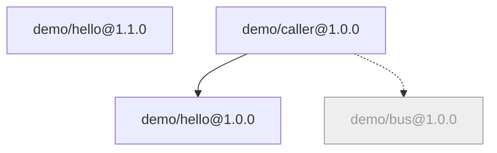

# BrickKit — 第 2 份，共 9 份 (中文)

包含: docs/zh/02-project-guide/01-init-and-project-creation.md, docs/zh/02-project-guide/02-add-and-component-install.md, docs/zh/02-project-guide/03-local-debug-workflow.md, docs/zh/02-project-guide/04-focus-run.md, docs/zh/02-project-guide/05-multi-env-switch.md, docs/zh/02-project-guide/06-up-and-down.md, docs/zh/02-project-guide/07-upgrade-and-migration.md, docs/zh/02-project-guide/08-remove-and-archive.md, docs/zh/02-project-guide/09-status-and-graph.md

下面 File 与包含里的路径都相对仓库根目录 https://raw.githubusercontent.com/brickKit/brickKit/main/ ；页内链接相对这份合集自己

下一份: https://raw.githubusercontent.com/brickKit/brickKit/main/llms/zh/03.md

---

> File: docs/zh/02-project-guide/01-init-and-project-creation.md

# 创建项目

一个 BrickKit 项目就是一个普通目录，里面放着三层文件，外加几个约定好的子目录。`brickkit init` 把它们一次建好。

## `brickkit init <名字>`：新建

```bash
brickkit init my-shop
```

```text
✅ 项目已初始化：my-shop
   📄 brickkit.yaml        项目配置
   📄 deploy.yaml          怎么部署（团队文件，要提交）
   📁 config/              组件配置与公共变量
   📁 components/          组件源码（已配为本地安装源 local-dev）
   📁 shell/               外壳（kind: shell），项目自己的代码（本地安装源 local-shells）
   📁 .brickkit/           CLI 工作目录
   📄 AGENTS.md            项目的 AI 导读；末尾的组件表由 brickkit 维护
   📄 CLAUDE.md            @AGENTS.md：Claude Code 通过它读 AGENTS.md
   📁 .claude/skills/      AI 助手技能（5 个）
   💡 组件源码要跟项目一起进 Git 的话：brickkit init --hooks 装上提交前检查

下一步：
  cd my-shop
  brickkit add --local                     把 components/ 下的组件全加进来
  brickkit add <scope>/<name>@<version>    从安装源添加组件（先在 brickkit.yaml 的 sources: 里启用一个）
  brickkit up                              一键启动
```

项目名只能用小写字母、数字和中划线，以字母或数字开头结尾，最长 54 个字符——Docker 网络（`brickkit-my-shop-net`）和缺省的
Kubernetes 命名空间（`brickkit-my-shop`）都由它命名。

生成的 `brickkit.yaml` 已经声明了两个**本地安装源**，另外两种安装源写成了注释，取消注释、填上地址就能用：

```yaml
# brickkit.yaml —— 这个项目由什么组成：安装源与各组件的精确版本。
# 与代码一样共享、评审：请提交它。
project: my-shop

# 安装源，按声明顺序依次尝试
sources:
  - name: local-dev
    type: local
    path: ./components      # brickkit init 已经建好了这个目录
  - name: local-shells
    type: local
    path: ./shell           # 外壳（kind: shell）是项目自己的代码：brickkit new --shell 写到这里
  # 更多安装源：取消注释并填上地址
  # - name: company-git
  #   type: git
  #   baseUrl: https://git.example.com/components/
  # - name: market
  #   type: market
  #   url: https://market.example.com/api/v1

components: []
```

"安装源"就是"去哪里找组件"：本地源是本机的一个目录，Git 源是一组 Git 仓库（组件 `demo/hello` 的仓库是
`<baseUrl>demo-hello`，版本就是 tag），市场是一个组件市场服务。按声明顺序依次尝试，**第一个有这个组件的源说了算**。

`deploy.yaml` 只有部署目标，`config/vars.yaml` 是空的公共变量文件——加了组件之后它们才会长出内容。

### 生成的 `.gitignore`

```text
# BrickKit CLI 的工作目录：缓存、生成物、登录凭据
.brickkit/

# 个人部署文件及其备份（brickkit local on）
deploy.local.yaml
deploy.local.yaml.bak

# config 里用 file:// 引用的密钥文件，以及 .env 文件
.secrets/
.env

# 已移除组件的配置文件（留着以后重新 add 用）
config/.archive/

# 为开发克隆下来的组件源码（每个组件是独立的 Git 仓库）
components/
```

每一条都有理由：`.brickkit/` 是随时能重建的缓存；`deploy.local.yaml` 是你个人的；`.secrets/` 与 `.env` 放真正的密钥；
`config/.archive/` 是本机的后悔药；`components/` 下的每个组件都是**自己的** Git 仓库（一个组件一个仓库），不该被项目仓库再收一遍。

### 不要 AI 助手技能：`--no-skills`

`init` 默认装入给 AI 助手读的技能文件（`.claude/skills/brickkit-*`，共五个），它们跟着项目提交，让团队里每个人的 AI 助手都懂这个项目。
不需要就加 `--no-skills`；以后想要，执行 `brickkit skills update`。`AGENTS.md` 与 `CLAUDE.md` 不管加不加都会写：它们是项目自己的导读，
不是技能（见 [项目的 `AGENTS.md`](#项目的-agentsmd)）。

## 补全式：在已有目录里执行 `brickkit init`

不带名字执行时，`init` 在**当前目录**缺什么补什么。两个典型场景：

- 一个已有的项目仓库要接入 BrickKit；
- 一个组件仓库想给自己建一个本地联调工作台（见 [组件开发者指南](../../docs/zh/03-component-guide/05-local-dev-fractal.md)）。

规矩是"缺的创建，有的不动"。目录不是空的，就先把计划打印出来，等你确认：

```bash
cd legacy-shop
brickkit init
```

```text
当前目录已有文件，brickkit init 将：
   ✅ 创建  brickkit.yaml
   ✅ 创建  deploy.yaml
   ✅ 创建  config/vars.yaml
   ✅ 创建  config/.gitkeep
   ✅ 创建  shell/.gitkeep
   ✅ 创建  components/
   ✅ 创建  AGENTS.md
   ✅ 创建  CLAUDE.md
   ⚠️  .gitignore 缺少：.brickkit/、deploy.local.yaml、deploy.local.yaml.bak、.secrets/、.env、config/.archive/（不替你改——请自己补上）
继续？[y/N] 
```

几点值得注意：

- **已有的 `.gitignore` 只校验、不修改。** 缺的每一条都大声警告：缺了它们，个人部署文件和密钥会被提交。它不替你改，是因为那份文件是你的，
  里面可能有它看不懂的规则。
- **`--yes` 跳过确认**（计划照样打印出来），给 CI 用。
- **项目名**取 `--name`，否则沿用已有 `brickkit.yaml` 的 `project`，否则取目录名。`--name` 与已有 `brickkit.yaml`
  的 `project` 矛盾时直接拒绝（补全从不改已有文件）；目录名不是合法项目名时，能规整就规整（`My_Shop` → `my-shop`），
  规整不了就停下，让你用 `--name` 指定。
- **最后按 `up` 的方式装载一遍项目**；装载不了，命令就失败——补全出来的必须是能用的项目。

```bash
brickkit init --yes
```

```text
当前目录已有文件，brickkit init 将：
   ✅ 创建  brickkit.yaml
   ✅ 创建  deploy.yaml
   ✅ 创建  config/vars.yaml
   ✅ 创建  config/.gitkeep
   ✅ 创建  shell/.gitkeep
   ✅ 创建  components/
   ✅ 创建  AGENTS.md
   ✅ 创建  CLAUDE.md
   ⚠️  .gitignore 缺少：.brickkit/、deploy.local.yaml、deploy.local.yaml.bak、.secrets/、.env、config/.archive/（不替你改——请自己补上）
✅ 项目已补全：legacy-shop
⚠️ 警告：.gitignore 缺少必需条目——个人部署文件和密钥可能被提交
   文件：.gitignore
   缺少：.brickkit/
   缺少：deploy.local.yaml
   缺少：deploy.local.yaml.bak
   缺少：.secrets/
   缺少：.env
   缺少：config/.archive/
   缺少：components/
   建议：把缺的每一行手动加进 .gitignore（brickkit init 从不修改已有的 .gitignore）
   📁 .claude/skills/      AI 助手技能（5 个）
   🪝 .git/hooks/pre-commit 提交前检查组件结构
   ✅ 收尾校验通过：项目可以装载
```

项目根就是 Git 仓库根时，`init` 顺带装上提交前检查（见 [源码管理](../../docs/zh/02-project-guide/11-sync-and-restore.md#提交前检查)）。

## 克隆一个已有的项目

队友已经建好了项目、推到了 Git 上。你**不需要** `init`：

```bash
git clone https://git.example.com/projects/my-shop.git
cd my-shop
brickkit build
brickkit up
```

`.brickkit/` 不在仓库里，但它只是缓存：第一次运行时，CLI 按 `brickkit.yaml` 从安装源重新取回每个组件的
`component.yaml`（连同它的 `BRICKKIT.md`）。契约文件（OpenAPI 之类）`up` 不会去取；只有写调用方代码时才用得到，
用 `brickkit fetch <id>@<版本>` 把它们下载到 `.brickkit/artifacts/`。`components/` 同样不在仓库里——`up` 只需要组件的 `component.yaml`，不需要源码；
要改哪个组件的代码，再用 `brickkit add <id>@<版本> --repo` 把它克隆下来（见 [添加组件](../../docs/zh/02-project-guide/02-add-and-component-install.md#克隆源码--repo--repo-all)）。
`build` 那一步只在组件需要本机构建镜像时才有事可做，见 [构建与镜像](../../docs/zh/02-project-guide/12-build-and-images.md)。

## 项目结构约定

```text
my-shop/
├── brickkit.yaml         用哪些组件、哪个版本（提交）
├── deploy.yaml           怎么部署（提交）
├── deploy.local.yaml     你个人的部署文件（不提交，brickkit local on 生成）
├── config/               组件的业务配置与公共变量（提交）
│   └── .archive/         已移除组件的配置（不提交）
├── components/           本地安装源：你正在开发、或为了改而克隆下来的组件源码（不提交）
├── shell/                本地安装源：外壳，项目自己的代码（提交）
├── AGENTS.md             项目的 AI 导读，末尾是组件表（提交）
├── CLAUDE.md             @AGENTS.md，让 Claude Code 读 AGENTS.md（提交）
├── .claude/skills/       AI 助手技能（提交）
└── .brickkit/            CLI 的缓存与生成物（不提交）
```

- **`components/`** 放组件源码。每个组件是一个独立的 Git 仓库，按 `<scope>/<name>/` 摆放——本地源就按这个布局扫描。
  想让组件源码跟项目一起进版本库，把 `components/` 从 `.gitignore` 去掉，并用 `brickkit init --hooks` 装上提交前检查
  （见 [提交前检查](../../docs/zh/02-project-guide/11-sync-and-restore.md#提交前检查)）。
- **`shell/`** 放外壳：把几个组件编进一个进程的组件（见 [外壳机制](../../docs/zh/04-shell/README.md)）。外壳是这个项目自己的代码，随项目提交。
- **`config/`** 放每个组件的配置，一个组件一个文件（见 [config/ 目录](../../docs/zh/01-three-layers/05-config-directory.md)）。

## 项目的 `AGENTS.md`

`AGENTS.md` 是 AI 编程工具打开一个仓库时最先读的文件——这是各家工具共用的约定，不是 BrickKit 发明的。Claude Code 读的是
`CLAUDE.md`，所以 `init` 还会写一份只有一行 `@AGENTS.md` 的 `CLAUDE.md`，让 Claude Code 读到同一份文件。两份都是缺了才建；
已经有的文件，`init` 只动 `AGENTS.md` 末尾由 brickkit 维护的那一段，别处一字不改（见 [哪些命令会动它](#哪些命令会动它)；
唯一的例外是旧版本留下、没人改过的 `AGENTS.md`，见 [下文](#旧版本建的项目原来那份-brickkitmd)）。

好处：团队里每个人不管用哪个 AI 工具，都从同一页开始读，而这一页跟着项目进 Git。代价：团队要多维护一份"得保持属实"的文件——
一份还在描述去年那个项目的 `AGENTS.md`，会误导每一个读它的 AI。

### 你来写的几节

这份文件是你的。骨架有四节，每节带一条 `<!-- TODO: … -->` 提示（`brickkit lint` 会列出还剩下的每一条）：

| 小节 | 写什么 |
| --- | --- |
| 项目概述 | 这个项目是什么、分哪些领域、组件怎么分组 |
| 项目约定 | 这里每个组件都要守的规则——技术栈、端口与 schema 登记、命名、评审规则——写在这里，组件里就不用再重复。每条一行；要多写的规则，把全文放进 `docs/` 再链过去 |
| 查找路由 | 一张表：在做什么（会拿去搜的那几个词）→ 先读哪个文件。约定细则、决策记录、运维手册各在哪也写在这里（见[项目的其他文档](#项目的其他文档)）：技能就是到这里查的 |
| 易错点 | 一张表：不许 / 症状 / 原因——这个项目里每个组件都会踩的坑 |

### 末尾那一段

文件末尾有**一段**由 CLI 维护的内容，夹在 `<!-- brickkit:managed:begin lang=<语言代码> -->` 与
`<!-- brickkit:managed:end -->` 之间。标记之间写的东西，下次改写时会被覆盖；标记之外的一个字都不动。这一段里有：

- 平台规则的简短摘要：三层文件各管什么、`add` / `remove` / `upgrade` 会让它们一起改、配置项的键就是 `configSchema`
  里的变量名、技能在哪；
- 一行说明组件的文档在哪——本地源里正好是这个版本时在源码目录里，否则在 `.brickkit/manifests/<id>/<version>/`，
  文件是 `BRICKKIT.md`（译本 `BRICKKIT.<语言>.md`）——以及契约在 `.brickkit/artifacts/<服务名>/`；
- 组件表。`brickkit add --local` 加进两个组件之后：

```text
| 组件 | 版本 | 干什么 | 文档 | 主页 |
|---|---|---|---|---|
| demo/hello | 1.0.0 | The smallest HTTP component for BrickKit's own self-tests; serves a greeting and echoes its environment variables | BRICKKIT.md | — |
| demo/caller | 1.0.0 | The caller component for BrickKit's own self-tests; verifies dependency address injection and optional-dependency degradation | BRICKKIT.md | — |
```

| 列 | 取自 |
| --- | --- |
| 干什么 | 组件的 `metadata.description` |
| 文档 | `BRICKKIT.md`，再加上它带的每一份译本（`BRICKKIT.md +zh`）；没带文档时是 `—` |
| 主页 | 组件可选的 `metadata.repository`；没写时是 `—` |

**这一段只放每台机器上都一样的事实。** 这份文件要提交：要是有一列"在这台机器上是不是本地源码"，它就会随最后一个跑命令的人变来变去，
每个同事 `add` 一次都会多出一处 diff。某个组件的源码在不在本机，AI 自己去 `components/` 下看。

**这一段记着自己的语言**（`lang=`）。语言在第一次写这一段时定下，之后每次改写都用它——不用跑命令那个人的 CLI 语言——
这样 CLI 语言不同的两个同事不会来回改写对方的文件。要换，用 `brickkit skills update --lang en`，技能也跟着换。

### 哪些命令会动它

| 命令 | 对 `AGENTS.md` 与 `CLAUDE.md` 做什么 |
| --- | --- |
| `init` | 缺哪份建哪份。已有的 `AGENTS.md` 里有这一段就改写它；没有就只提醒 |
| `add`、`remove`、`upgrade` | 只改写已有的那一段（组件表），别的不动；从不新建这一段，也不往你的文件里追加 |
| `brickkit skills update` | 明确要求才做的修复：建出缺的文件，给没有这一段的 `AGENTS.md` 追加一段，给没有 `@AGENTS.md` 的 `CLAUDE.md` 追加这一行 |

补全一个已经有自己的 `AGENTS.md` 和 `CLAUDE.md` 的目录时，`init` 两份都不改，只说缺了什么：

```text
⚠️ AGENTS.md 里没有可用的、由 brickkit 维护的一段，组件表不会自动更新
   原因：没有由 brickkit 维护的那一段
   建议：运行 brickkit skills update 把它加上（明确要求才加：别的命令不改你的文件）
⚠️ CLAUDE.md 里没有 @AGENTS.md，Claude Code 不会读 AGENTS.md
   建议：运行 brickkit skills update 把它加上（明确要求才加：别的命令不改你的文件）
```

```bash
brickkit skills update
```

```text
✅ AI 助手技能已更新
   ✅ AGENTS.md：已在末尾追加由 brickkit 维护的一段
   ✅ 已把 @AGENTS.md 追加到 CLAUDE.md
```

### 旧版本建的项目：原来那份 `BRICKKIT.md`

早先的版本把组件表放在项目根的 `BRICKKIT.md` 里，叫"项目地图"。这份文件已经没有了：组件表现在在 `AGENTS.md` 末尾，
`BRICKKIT.md` 只指组件自己的文档。项目根还留着旧地图（凭它的标记认出来）时，`init`、`brickkit skills update` 和 `lint`
都会用警告码 `PROJECT_MAP_OBSOLETE` 报出来：

```text
⚠️ 这里的 BRICKKIT.md 是旧版的项目地图：组件表现在在 AGENTS.md 末尾
   建议：把你自己写的内容挪进 AGENTS.md，再删掉 BRICKKIT.md（brickkit 不会替你删）
```

它不会被自动删掉，因为里面可能有你自己写的东西。旧版本当作技能装进来、之后没人改过的 `AGENTS.md`（靠这台机器上旧的 `.brickkit/skills.lock`
认出来），`init` 与 `brickkit skills update` 会把它换成新的骨架。

## 项目的其他文档

`AGENTS.md` 每个 AI 会话都会加载，所以必须短：每条约定一行、人人都会踩的几个坑、去哪里找什么。写不下的放进项目的 `docs/`。
BrickKit 不规定它的目录——三个组件的项目可能一份都不需要——但大多数项目最后都会有同样的三类文档，放在这些地方就好用：

| 哪类 | 放哪 | 写什么 |
| --- | --- | --- |
| 约定细则 | `docs/conventions/` | `AGENTS.md` 项目约定里每一行背后的完整规则：端口登记表、schema 命名、评审清单 |
| 决策记录 | `docs/decisions/NNNN-<标题>.md` | 一个决策一份，带编号（[见下](#决策怎么编号)）：背景、定了什么、为什么、否掉了什么 |
| 运维手册 | `docs/operations/` | 上线、备份、轮换密钥、生产出故障时怎么办 |

不管用哪种目录，都写进 `AGENTS.md` 的查找路由表，比如"可能和以前的决策冲突的改动 → `docs/decisions/`"。AI 靠这张表找到它们，
`brickkit-plan-change` 技能也是。

### 决策怎么编号

决策的编号就是它的名字。别的文件会引用它——`AGENTS.md` 的易错点末尾写"（0203）"，提交说明写"见 0105"——所以光凭一个编号就要找到唯一一份：

- **全项目唯一，不复用，不改。** 被推翻的决策留在原处，标明被哪一条取代；新决策拿新编号。
- **一个文件夹：往上数**（`0001`、`0002`……）。大多数项目这样就够了。
- **按主题分文件夹：每个文件夹一个号段**——`01-architecture/` 0101–0199、`02-permissions/` 0201–0299，依此类推。编号依旧唯一，
  还顺带说明了主题；搜 `0203` 只会落到一份文件上。号段写进那个文件夹的 `README.md`，人和 AI 新加一条之前都会先看那里。
- 一条决策后来发现更该归到另一个主题，**编号不变**，哪怕不在新文件夹的号段里：指向它的那些引用比号段整齐更值钱。

这和按顺序读的页面前面的编号（`01-…`、`02-…`）不是一回事：那些是阅读顺序，插进一页就会变；决策编号是名字，不会变。

### 一个事实只写一处

项目文档出问题的方式很普通：同一条规则，`AGENTS.md` 的易错点写一遍、约定细则写一遍、决策记录写一遍、项目自带的技能里又写一遍，
措辞各有出入，AI 先读到哪份就信哪份。所以和组件一样，每个事实只有一个归属，别的文件链过去：

| 事实 | 归属 |
| --- | --- |
| 每个组件都要守的规则，完整写法 | `docs/conventions/`；`AGENTS.md` 的项目约定里用一行点名并链过去 |
| 跨组件、人人都会犯的少数几个错 | `AGENTS.md` 的易错点，每条链到它违反的那条规则 |
| 项目为什么这么选、否掉了什么 | `docs/decisions/` 里的一份：写结论和理由，不再抄一遍规则全文 |
| 生产上怎么运行 | `docs/operations/` |
| 某个组件做什么、要什么、管什么 | 那个组件的 `BRICKKIT.md`，项目文档里不重复 |
| 有哪些组件、各是什么版本 | `AGENTS.md` 末尾由 brickkit 维护的组件表 |

### 多种语言，以及 lint 查什么

语言规则和组件的一样（[写多种语言](../../docs/zh/03-component-guide/08-component-doc-spec.md#写多种语言)）：少数几份有译本就放在原文旁边，
整个 `docs/` 双语就每种语言一棵树（`docs/en/`、`docs/zh/`）。`AGENTS.md` 一般只写一份；给人工审查者的 `AGENTS.<语言>.md`
可以有，lint 把它当普通译本查。

`brickkit lint` 按组件的规则查项目文档，全是警告：`AGENTS.md` 的四节和维护段、`CLAUDE.md`、`AGENTS.md`、`README.md` 和 `docs/`
下每个文件里的链接（可以指到项目里任何地方，`components/` 也算，只要目标在）、占位词、译本。写得对不对是评审的事。

---

> File: docs/zh/02-project-guide/02-add-and-component-install.md

# 添加组件

## 基本用法

```bash
brickkit add demo/caller
```

```text
🔎 demo/caller 没写版本，最新的是 1.0.0（安装源 company-git）
➕ 加入 demo/caller@1.0.0
   ✅ demo/hello@1.0.0
   ✅ demo/caller@1.0.0
📝 已写：brickkit.yaml, deploy.yaml
📝 配置骨架：config/demo-hello.yaml, config/demo-caller.yaml
📦 产物：2 个文件，在 .brickkit/artifacts/
⚠️ 警告：弱依赖缺失：demo/bus@1.0.0
   影响组件：demo/caller@1.0.0
   原因：拉取组件失败：demo/bus
   影响：该组件的环境变量 DEMO_BUS_ENDPOINT 不会被注入
   💡 弱依赖降级由组件自行处理；如需启用，请确认该组件已发布并可从安装源获取
```

**版本。** 不写版本时，`add` 取安装源里最新的版本，并把这个**精确版本**写进 `brickkit.yaml`——和 npm 写 lockfile 一样，
解析只发生这一次，以后谁 clone 项目都得到同一个版本。写了版本（`brickkit add demo/caller@1.0.0`）就用那个版本。
`^1.0.0`、`latest` 这类范围写法一律拒绝：版本范围正是"我这里好好的，线上就坏了"的经典来源。

**依赖是递归拉进来的。** `demo/caller` 强依赖 `demo/hello@1.0.0`，于是 `demo/hello` 跟着加进来了。它弱依赖的 `demo/bus`
在安装源里找不到：弱依赖缺失只警告、不阻塞，而且它的地址变量 `DEMO_BUS_ENDPOINT` **根本不会注入**——不是注入一个空字符串。
组件读到"没有这个变量"，走它自己的降级分支。

## 一次 `add` 改了什么

**`brickkit.yaml`**：声明与精确版本。

```yaml
components:
  - id: demo/hello
    version: 1.0.0
  - id: demo/caller
    version: 1.0.0
```

**部署文件**：每个组件版本一个条目。什么都没写，就是"按默认方式跑"。`deploy.local.yaml` 存在时，它也一起加上同样的条目。

```yaml
components:
  - id: demo/hello
  - id: demo/caller
```

**`config/`**：按每个组件的 `configSchema`（组件作者写的配置说明书）生成一份骨架。必填又没有默认值的项写成 `KEY: ""`，
等你填；其余的写成注释，注释着就用组件的默认值。

```yaml
# Component: demo/caller@1.0.0
# 这个组件的环境变量，每个键原样注入。
# 公共变量：$var:NAME（config/vars.yaml）· 环境变量：${NAME} · 本地文件：file://path
# 另一个组件的地址：$endpoint:<scope>/<name>

# === 可选：注释掉的键使用组件默认值，取消注释即可覆盖 ===
# DATABASE_HOST:  # string | PostgreSQL host name
# DATABASE_NAME:  # string | Database name
# DATABASE_PORT: 5432  # integer | PostgreSQL port (默认值)
# DATABASE_USER:  # string | User to connect as
# MIGRATION_SHOULD_FAIL:  # string | Test switch: set to "1" to make the migration exit non-zero, to check that a failed migration holds back the main service
```

有必填项要填时，`add` 会点名是哪个文件、哪几个键：

```text
📝 配置骨架：config/demo-widget.yaml
   ✏️ config/demo-widget.yaml 里的必填项要自己填上：API_URL
```

不填就 `up`，`up` 会拒绝启动并告诉你缺哪一项。

**`.brickkit/manifests/<id>/<version>/`**：组件的 `component.yaml` 和它的文档——`BRICKKIT.md` 连同它带的每一份译本
（`BRICKKIT.zh.md` 之类），永久缓存；本地源、Git 源、市场都一样。

**`.brickkit/artifacts/`**：组件声明的契约文件（OpenAPI、proto 之类），写调用方时用得上。

**`AGENTS.md`**：末尾的组件表（由 CLI 维护的那一段）给每个加进来的组件添一行：版本、干什么、带了哪些文档、主页
（见 [项目的 `AGENTS.md`](../../docs/zh/02-project-guide/01-init-and-project-creation.md#项目的-agentsmd)）。那一段之外的内容不动；没有那一段的 `AGENTS.md`
原样不动。

改完之后项目装载不了（比如新组件与已有的冲突），`add` 把改过的文件全部还原——要么全做，要么一个都不改。

## 公共变量的提示

几个组件往往连同一个数据库。如果 `config/vars.yaml` 里已经有和配置项同名的公共变量，`add` 会问你要不要直接引用它：

```yaml
# config/vars.yaml
DATABASE_HOST: pg.internal
DATABASE_PORT: 5432
```

```text
config/vars.yaml 里已有 DATABASE_HOST，在 config/demo-caller.yaml 里引用它吗？[y/N] y
config/vars.yaml 里已有 DATABASE_PORT，在 config/demo-caller.yaml 里引用它吗？[y/N] 
```

答"是"的那一项写成 `$var:` 引用，没答的保持注释：

```yaml
DATABASE_HOST: $var:DATABASE_HOST  # string | PostgreSQL host name
# DATABASE_PORT: 5432  # integer | PostgreSQL port (默认值)
```

为什么要问、而不是自动引用：配置文件里每个值从哪来，应该一眼能看出来。`$var:` 的规则见
[公共变量与 $var:](../../docs/zh/01-three-layers/06-vars-and-var-ref.md)。

## 外壳

`add` 一个外壳（把几个组件编进一个进程的组件）时，它编进的成员按外壳声明的版本一起加进来，而且在部署文件里**嵌在外壳条目的
`members` 下面**——成员归谁承载，只看这一处。反过来，`add` 一个普通组件时不会替你把它放进哪个外壳：那是部署方式的决定，
由你在部署文件里做。详见 [外壳机制](../../docs/zh/04-shell/README.md)。

## 同一个组件的两个版本

`demo/caller@1.0.0` 要的是 `demo/hello@1.0.0`。如果项目里的 `demo/hello` 已经是 1.1.0，`add` 不会报错，而是把 1.0.0
也留下，标上是谁要它：

```yaml
components:
  - id: demo/hello
    version: 1.1.0
  - id: demo/hello
    version: 1.0.0
    requiredBy: [demo/caller]
```

两个版本同时运行，服务名分别是 `demo-hello-1-1-0` 和 `demo-hello-1-0-0`，互不冲突。没有 `requiredBy` 的那个是**默认版本**。
详见 [多版本共存](../../docs/zh/03-component-guide/09-multi-version-coexistence.md)。

## `--local`：把本地源里的组件一次加进来

```bash
brickkit add --local
```

扫描所有本地安装源（默认是 `components/` 和 `shell/`），每个 `<scope>/<name>/component.yaml` 按它里面写的**真实版本**加进来。
刚用 `brickkit new` 写好的组件、或者手工放进 `components/` 的组件，这样一条命令就进了项目。

`--local --init` 还会先给每个还没有 `brickkit.yaml` 的本地组件在它自己的目录里建好本地联调工作台，
见 [分形的本地开发](../../docs/zh/03-component-guide/05-local-dev-fractal.md)。

## 克隆源码：`--repo`、`--repo-all`

`add` 默认只取组件的 `component.yaml` 和契约文件，**不克隆源码**：大多数时候你只是用它，不改它。要改它的代码时：

```bash
brickkit add demo/hello@1.0.0 --repo
```

```text
✅ demo/hello@1.0.0 已经在项目里，三份文件都不用改
📥 demo/hello@1.0.0 的源码已克隆到 components/demo/hello/（检出 1.0.0）
```

组件已经在项目里时，`--repo` 只做克隆这一件事。克隆下来的目录检出的正是这个版本的 tag；它是一个完整的 Git 仓库，
分支、提交、推送都是你自己的事，CLI 不管 Git 权限。

注意：`components/` 是本地安装源，而且排在 Git 源前面。克隆之后，这个组件就从你的工作区里解析——你改的代码会被 `brickkit build`
打进镜像，`upgrade` 看到的"最新版本"也是工作区里的版本（见 [升级](../../docs/zh/02-project-guide/07-upgrade-and-migration.md#组件来自本地源时)）。

`--repo-all` 把这次加进来的每个开源组件的源码都克隆下来（各自的默认版本）。

在项目里的任何位置运行——哪怕是在另一个组件的目录里——`add` 作用的都是项目，所以克隆总是落在项目自己的 `components/` 里：
组件源码只放一处（见[在项目里就地开发](../../docs/zh/02-project-guide/04-focus-run.md#只有一个-components)）。例外是自带 `brickkit.yaml` 的组件目录
（[工作台](../../docs/zh/02-project-guide/04-focus-run.md#焦点运行还是工作台)）：在那里离得最近的 `brickkit.yaml` 说了算，`add` 作用的是这个工作台，
而 `--repo` 会被拒绝——它会在项目里面再克隆出一份。

**从不拉取 git submodule。** 克隆下来它们是空目录，并且会点名：

```text
📥 demo/lib@1.0.0 的源码已克隆到 components/demo/lib/（检出 1.0.0）
   ℹ️  demo/lib@1.0.0 里有 git submodule，没有拉取：third_party/sdk（确实需要时 git submodule update --init）
```

代码确实需要它们的话，自己在克隆下来的仓库里拉。

## `--yes`：非交互

```bash
brickkit add demo/caller@1.0.0 --yes
```

每个问题都回答"是"，给 CI 用。没有 `--yes`、又没有终端输入时（比如在脚本里），问题一律按"否"处理。

---

> File: docs/zh/02-project-guide/03-local-debug-workflow.md

# 本地调试工作流

你在改 `demo/hello`，想在 IDE 里打断点跑它，而项目里的其它组件照常在容器里跑、并且能调到你这个进程。这一篇从头走一遍。

背景：你的个人部署文件 `deploy.local.yaml` 是什么、为什么是"整份替换而不是合并"，见 [deploy.local.yaml](../../docs/zh/01-three-layers/04-deploy-local-yaml.md)。

项目很大、你只需要这个组件和它依赖的组件时，先用焦点运行：在组件目录里 `brickkit up` 就只跑这些，给焦点写上 `mode: debug`
照样能打断点——见[在项目里就地开发](../../docs/zh/02-project-guide/04-focus-run.md)。

## 完整流程

### 1. 开启本地模式

```bash
brickkit local on
```

```text
✅ 本地模式已开启：命令现在读取 deploy.local.yaml
   deploy.local.yaml 从 deploy.yaml 复制而来——随意修改，它不会被提交
```

之后运行或检查部署的命令（`up`、`down`、`status`、`sync`、`lint`、`build`）都读 `deploy.local.yaml`（`graph` 与 `deps`
仍读 `deploy.yaml`），`up` 每次运行开头会提醒一句：

```text
本地模式已开启：使用 deploy.local.yaml（brickkit local off 切回 deploy.yaml）
```

### 2. 把要调试的组件标成 `mode: debug`

```yaml
# deploy.local.yaml
components:
  - id: demo/hello
    mode: debug
    localPort: 8080
  - id: demo/caller
    expose: true
    exposePort: 18080
```

`mode: debug` 的意思是"这个组件我自己在本机启动"：平台不给它生成容器，但照样把它算作在运行，别的组件照样拿到它的地址。
`localPort` 是你的进程**实际监听**的端口。`demo/hello` 在代码里写死监听 8080，所以这里写 8080；两者对不上，调用方只会得到连接被拒绝。
进程还要监听**所有网卡**（`0.0.0.0`）：容器是经宿主机的网桥地址过来的，只听 `127.0.0.1` 的进程收不到（见 [本地调试问题](../../docs/zh/10-troubleshooting/02-local-debug-issues.md#容器里的组件连不上你的进程)）。

`mode: debug` 只能写在 `deploy.local.yaml` 里——"我正在自己机器上调试它"是你个人的事实，不该出现在团队评审的文件里。

### 3. 启动其余的组件

```bash
brickkit up
```

```text
📋 组件状态计算：
   ✅ demo/hello@1.0.0   启动（mode: debug）
   ✅ demo/caller@1.0.0  启动（顶层）
```

```text
🔧 本地调试（mode: debug）：
   demo/hello@1.0.0
      不生成容器；请在 IDE 里启动它，监听端口 8080，而且要监听所有网卡（0.0.0.0）——只听 127.0.0.1 的进程，容器连不到
      环境变量：.brickkit/generated/local-debug.demo-hello-1-0-0.env
      VS Code：launch.json 里配 "envFile": "${workspaceFolder}/.brickkit/generated/local-debug.demo-hello-1-0-0.env"
```

```text
🐳 正在启动（docker）...
   demo-caller-1-0-0            running（healthy）
✅ 全部组件已启动（1 个）
```

`up` 为 `demo/hello` 生成了一份环境变量文件：它在容器里本该拿到的每个变量，一个不少。

```text
COMPONENT_ID=demo/hello
COMPONENT_VERSION=1.0.0
GREETING=来自本机进程
```

（`GREETING` 的值来自 `config/demo-hello.yaml`——调试时想换值，照常改配置文件、重新 `up`。）

### 4. 在 IDE 里启动它

VS Code 把上面那行 `envFile` 配进 `launch.json`；命令行里这样：

```bash
cd components/demo/hello
set -a && source ../../../.brickkit/generated/local-debug.demo-hello-1-0-0.env && set +a
go run .
```

组件源码从哪来：`brickkit add demo/hello@1.0.0 --repo` 把它克隆进 `components/`（见 [添加组件](../../docs/zh/02-project-guide/02-add-and-component-install.md#克隆源码--repo--repo-all)）。

### 5. 验证容器里的组件连得到你

```bash
curl http://localhost:18080/api/v1/call
```

```json
{"component":"demo/caller","endpoint":"http://demo-hello-1-0-0:8080","upstream":{"component":"demo/hello","greeting":"来自本机进程","message":"来自本机进程, I'm demo/hello@1.0.0","version":"1.0.0"},"version":"1.0.0"}
```

容器里的 `demo/caller` 调的还是 `http://demo-hello-1-0-0:8080`——地址没变，组件代码一行没改。平台在它的容器里把这个服务名解析到宿主机
（Docker 的 `extra_hosts: demo-hello-1-0-0:host-gateway`），并把端口换成你的 `localPort`。

`status` 把它单独列出来：

```text
🔧 本地调试（mode: debug，不由平台启动）
 ┌────────────┬───────┬────────────────────────────────┐
 │ 组件       │ 版本  │ 本地地址                       │
 ├────────────┼───────┼────────────────────────────────┤
 │ demo/hello │ 1.0.0 │ localhost:8080（IDE 调试模式） │
 └────────────┴───────┴────────────────────────────────┘
```

几个要知道的限制：

- **只在 Docker / Podman 下有效。** Kubernetes 集群里的 Pod 到不了你的笔记本；部署目标是 `k8s` 时 `mode: debug` 被拒绝。
- **调试的组件不跑数据库迁移。** 容器里的迁移步骤跟着容器一起没了；组件有迁移时，第一次要自己手动跑一次。
- **配置里写死的字符串不会被改写，只有一个名字例外。** `host.docker.internal` 是"宿主机"在容器里的名字（数据库、消息队列跑在本机时，
  `config/` 里通常这么写）。在本机跑的进程拿到的值里，它换成 `localhost`——指的是同一台机器，只是 Linux 的宿主机自己解析不了前者；
  容器拿到的仍是原文。所以同一份 `config/` 两边都通，不用在 `deploy.local.yaml` 的 `vars:` 里改（`vars:` 同时作用于容器，改了它们就连不上）。
  除此之外，你手写的地址原样到达进程：写的是别的容器的服务名时，在本机要自己给一个能用的值。

## 本机上的端口

在本机跑的进程（`mode: debug`、`mode: local`，或焦点运行里的焦点组件）和它打交道的容器，在宿主机端口上碰头。`up` 一次分好，
你写死的先占：

| 什么 | 宿主机端口 |
| --- | --- |
| `expose: true` 的容器 | 它的 `exposePort` |
| 进程自己 | 它的 `localPort`。没写：组件自己的 `deployment.port`，被占了再从 8081 往上找第一个空的。`mode: local` 的进程通过 `PORT` 拿到这个数 |
| 进程的额外端口 | 按 `deployment.extraPorts` 声明的号 |
| 进程依赖的容器 | 10000 + 容器端口（postgres 的 5432 → 15432、组件的 8080 → 18080），被占了再从 18080 往上找；被外壳承载的依赖发布在外壳的容器上。env 文件里写的就是 `localhost:<那个端口>` |

调用这个进程的容器不走宿主机端口：它们照旧用它的服务名，`extra_hosts` 把服务名解析到宿主机，端口是它的 `localPort`。

`up` 只知道自己分出去的端口。本机别的程序已经占着的端口，要等引擎绑定时才失败，不会提前报。项目要是有一张端口登记表
（每个组件的 `deployment.port` 各不相同），照常登记就行，8080、8081 这些都能用，只注意两件事：

- **进程让出自己端口的那一次。** 进程的 `deployment.port` 在这次 `up` 里已经分给了别人（两个在本机跑的组件声明了同一个端口，
  或者它撞上了某个 `exposePort`），它才从 8081 往上顺延——顺延到的可能正是另一个组件登记的端口。各组件的端口本来就不重复时
  不会发生；要让它固定下来，在 `deploy.local.yaml` 里给它写 `localPort`。
- **「10000 + 容器端口」这一段留给映射。** 容器端口是 8080–8499 的话，18080–18499 会被依赖容器的宿主机映射用到，别把它们登记给组件。

## 团队改了文件之后：严格一致性校验

你开着本地模式，队友加了一个组件并推送。你拉下来之后：

```bash
git pull
brickkit up
```

```text
❌ 错误：deploy.local.yaml 已过期，与 brickkit.yaml 的组件对不上
   文件：deploy.local.yaml
   缺少条目：demo/bus
   原因：你开启了本地模式，而 brickkit.yaml 变了，你的 deploy.local.yaml 没有同步
   建议：
   1. 方案 A（推荐）：brickkit local refresh 按 deploy.yaml 重新生成 deploy.local.yaml，旧文件备份为 deploy.local.yaml.bak
   2. 方案 B：在 deploy.local.yaml 里手动增删下面列出的条目
   3. 方案 C：brickkit local off 切回团队的 deploy.yaml
```

为什么是报错、而不是悄悄把新组件补上：本地文件是整份替换 `deploy.yaml` 的，CLI 不知道新组件在你这里该怎么跑——
按团队的写法？还是你另有打算？猜错了就是在你不知情时跑了一个你没想跑的东西。所以它停下来，把三条出路都列出来。

**团队没加减组件，只是改了 `deploy.yaml` 里的值**（换了端口、开了 `expose`、改了 `vars:`）：这不算过期，`up` 照常跑你的个人文件，
那些改动在你这里不生效——本地文件是整份替换，这是它该有的行为，只是很容易忘。所以 `up` 和 `brickkit local status` 会说一句：

```text
ℹ️ deploy.yaml 在复制成 deploy.local.yaml 之后改过，这些改动在这里还没生效：brickkit local refresh 把它们带进来（并列出你的本地修改，方便照着改回去）
```

它比的是上次复制（`local on` / `refresh`）时存下的那份 `deploy.yaml` 和现在这份的**数据**：只改了注释、或 `add` 重排了条目不算；
`add` / `remove` 会把团队文件和你的个人文件一起改，也不算。想继续用旧的那份就不用理它。

## `brickkit local refresh`

```bash
brickkit local refresh
```

```text
✅ 已从 deploy.yaml 生成最新的 deploy.local.yaml。旧文件已备份至 deploy.local.yaml.bak。
ℹ️ 旧文件中有 2 处本地修改，请把仍然需要的手动合并到新的 deploy.local.yaml 中：
   - [demo/hello] mode: debug（当前未设置）
   - [demo/hello] localPort: 8080（当前未设置）
```

`refresh` 做三件事：

1. 把旧文件原样备份成 `deploy.local.yaml.bak`（上一份备份会被覆盖）；
2. 从 `deploy.yaml` 重新复制出一份完整的新文件——**不合并**，新文件就是团队文件的副本；
3. 拿旧文件和它当初复制自的那一份对比，把你以前的每一处、与团队文件现在不同的本地修改列出来：`mode`、`localPort`、`vars` 的值、换过的 `target`、挪过位置的条目、删掉的字段。

你只需要照着这张清单，把还想要的几行抄回新文件，不用把两份 YAML 从头到尾比一遍。抄回去之后：

```yaml
components:
  - id: demo/hello
    mode: debug
    localPort: 8080
  - id: demo/caller
    expose: true
    exposePort: 18080
  - id: demo/bus
```

为什么不自动合并：合并规则再聪明，也会有它猜错的时候，而猜错的结果就是"文件里写的不是实际跑的"。
整份替换加一张清单，结果永远一眼可见。

## 外壳成员的调试

外壳承载的成员也可以单独调试：在 `deploy.local.yaml` 里给外壳条目 `members` 下的那个成员写 `mode: debug` 和 `localPort`。
这次它在宿主机上由你启动，外壳**不再承载它**（它不出现在外壳收到的成员列表里），其余成员照常由外壳承载，别的组件拿到的它的地址指向你的进程。
外壳怎么工作见 [外壳机制](../../docs/zh/04-shell/README.md)。

## 关闭本地模式

```bash
brickkit local off
```

```text
✅ 本地模式已关闭：命令现在读取 deploy.yaml
   deploy.local.yaml 保留着；brickkit local on 会接着用它
```

文件留着，下次 `local on` 原样接着用。只想让一次运行忽略它，不必关：`brickkit up --no-local`。

---

> File: docs/zh/02-project-guide/04-focus-run.md

# 在项目里就地开发

项目大了以后，你很少孤立地改一个组件。你在改 `demo/caller`，想看它连着它真正要调的 `demo/hello` 跑起来，而另外四十个组件完全可以不启动。
这一篇讲的就是**在项目里**做这件事：站在一个组件的目录里敲 `brickkit up`，项目就只跑这一个组件——从它的源码跑——再加上它需要的那些。

这叫**焦点运行**。你正在改的组件是*焦点*；焦点用不到的组件一律不启动。

## 焦点运行还是工作台

开发一个组件时，有两种方式把它跑起来，回答的是两个不同的问题：

| | 焦点运行（本篇） | 工作台（[分形的本地开发](../../docs/zh/03-component-guide/05-local-dev-fractal.md)） |
| --- | --- | --- |
| 在哪里干活 | 在项目里，`components/<scope>/<name>/` 下 | 在组件自己的仓库里，那里有它自己的 `brickkit.yaml` |
| 跑什么 | 焦点和它需要的组件，**用的是项目里的版本** | 工作台里声明的那些——常常是组件本身加几个替身 |
| 准备工作 | 没有：项目已经知道一切 | 一个属于它自己的小项目，写一次 |
| 适合 | "我这处改动在*这个*系统里行不行？" | 开发一个被很多项目使用的组件，按它自己的节奏 |

组件就在某个项目的 `components/` 里时，先用焦点运行。工作台留给那些在一个项目之外还有自己生命的组件。

## 在组件目录里 `up`

```bash
cd components/demo/caller
brickkit up
```

```text
📁 项目：../../..（my-shop）
✅ 本地模式已开启：命令现在读取 deploy.local.yaml
   deploy.local.yaml 从 deploy.yaml 复制而来——随意修改，它不会被提交
🎯 焦点：demo/caller（已写进 deploy.local.yaml；brickkit up --all 恢复运行全部组件）
本地模式已开启：使用 deploy.local.yaml（brickkit local off 切回 deploy.yaml）
🚀 启动项目 my-shop（target: docker）
📋 组件状态计算：
   ✅ demo/bus@1.0.0     启动（demo/caller 需要）
   ✅ demo/hello@1.0.0   启动（demo/caller 需要）
   ✅ demo/caller@1.0.0  启动（焦点）
```

逐行看：

- **`📁 项目`**——这个目录里没有 `brickkit.yaml`，于是 `brickkit` 像 `git` 一样往上找，在上三层找到了项目。所有项目命令在任何子目录里都能用；
  它打印的路径都相对你所在的目录。
- **本地模式**——焦点是个人设置，所以写在你的个人部署文件里。本地模式原来没开的话，`up` 先把它打开（和 `brickkit local on` 一样）。
- **`🎯 焦点`**——你所在的目录属于 `demo/caller`，它就是焦点。
- **原因**——每个组件都说了自己为什么启动：`（焦点）`，或者 `（demo/caller 需要）`。

焦点**从源码跑**，是你机器上的一个进程（相当于 `mode: local`）；它需要的组件跑在容器里，并且各自在你的机器上开了端口，好让你的进程连得到：

```text
🐳 正在启动（docker）...
   demo-bus-1-0-0               running（healthy）
   demo-hello-1-0-0             running（healthy）
✅ 全部组件已启动（2 个）
```

```text
正在启动 1 个本地组件——按 Ctrl+C 停止
demo-caller-1-0-0  已监听端口 8080
```

这个进程在前台跑；Ctrl+C 停掉它，容器照常运行。要打断点，就在 `deploy.local.yaml` 里给焦点写上 `mode: debug`，再从 IDE 里启动它——
见[本地调试工作流](../../docs/zh/02-project-guide/03-local-debug-workflow.md)。你写的 `mode: debug` 焦点会保留。

## 焦点记在哪里

`deploy.local.yaml` 里的一行：

```yaml
# deploy.local.yaml
target: docker # docker | podman | k8s
focus: demo/caller

components:
  - id: demo/bus
  - id: demo/hello
  - id: demo/caller
```

改掉它之前它一直在：下一次 `up` 还是跑这个焦点，除非你在另一个组件的目录里运行——那会把焦点换过去。团队的 `deploy.yaml` 一个字节都不动。
`up`、`status`、`down`、`lint`、`build` 都会提醒一句（`sync` 不管焦点，见 [下文](#别的命令怎么对待焦点)）：

```text
🎯 焦点：demo/caller
```

## `--focus` 与 `--all`

在项目的任何位置，`--focus` 不用换目录就能设焦点：

```bash
brickkit up --focus demo/hello
```

```text
🎯 焦点：demo/hello（已写进 deploy.local.yaml；brickkit up --all 恢复运行全部组件）
本地模式已开启：使用 deploy.local.yaml（brickkit local off 切回 deploy.yaml）
🚀 启动项目 my-shop（target: docker）
📋 组件状态计算：
   ⬜ demo/bus@1.0.0     不启动（焦点之外）
   ✅ demo/hello@1.0.0   启动（焦点）
   ⬜ demo/caller@1.0.0  不启动（焦点之外）
```

`demo/hello` 什么都不需要，所以只有它自己跑。`--all` 去掉焦点，所有组件重新都跑：

```bash
brickkit up --all
```

```text
📋 组件状态计算：
   ✅ demo/bus@1.0.0     启动（demo/caller 需要）
   ✅ demo/hello@1.0.0   启动（demo/caller 需要）
   ✅ demo/caller@1.0.0  启动（顶层）
```

`--focus` 和 `--all` 只有 `up` 有，也不能和 `-f`、`--no-local` 一起用：那两个的意思是"别读我的个人文件"，而焦点就写在个人文件里。

哪些组件启动，算法和平时一样，只是起点不同：没有焦点时，所有顶层组件启动；有焦点时，只有焦点，加上 `mode` 写明了总要运行的组件
（`enabled`、`local`、`debug`）。它们需要的组件照常跟着启动——强依赖、弱依赖，以及配置里用 `$endpoint:` 引用了地址的组件。外壳也算在内：焦点是外壳时，它带着成员一起跑（`启动（由 … 承载）`）；
焦点需要的组件由某个外壳承载时，那个外壳跟着启动来承载它（`启动（承载 …）`），而不是让成员单独跑。焦点不能是一个 `mode: disable`
的组件——那自相矛盾，`up` 会拒绝，而且不改任何文件。

## 别的命令怎么对待焦点

| 命令 | 有焦点时 |
| --- | --- |
| `status`、`down`、`lint`、`build` | 打出 `🎯 焦点` 那一行。`down` 停的是整个项目，有没有焦点都一样 |
| `lint` | 还会检查焦点有没有源码可以跑 |
| `sync` | **不看焦点**：它保留没有焦点时项目要跑的全部组件的源码，所以换焦点从来不会让目录搬来搬去 |
| `local refresh` | 把焦点列为你的本地修改之一，方便你把它放回新文件 |
| `remove` | 移除焦点组件时，焦点跟着一起去掉，并说一句 |
| `graph`、`deps` | 不受影响——它们读 `deploy.yaml` |
| 不带参数的 `build`、`deps`、`lint` | 用你所在目录的那个组件（`lint --all` 查整个项目） |

焦点设在 `demo/hello` 上时，`sync` 照样三个都留着：

```text
📂 工作区整理：
   ✅ components/demo/bus/                 活跃
   ✅ components/demo/caller/              活跃
   ✅ components/demo/hello/               活跃
✅ 工作区整理完成（3 个活跃，0 个归档，0 个激活）
```

`local refresh` 重新复制 `deploy.yaml`，焦点就在它提醒你带过去的东西里：

```text
✅ 已从 deploy.yaml 生成最新的 deploy.local.yaml。旧文件已备份至 deploy.local.yaml.bak。
ℹ️ 旧文件中有 1 处本地修改，请把仍然需要的手动合并到新的 deploy.local.yaml 中：
   - [deploy] focus: demo/hello（当前未设置）
```

焦点运行要在你的机器上起一个进程、让别的组件连过来，所以只适用于 `target: docker` 和 `podman`。`target: k8s` 时什么都不写，`up` 直接停下：

```text
❌ 错误：deploy.local.yaml 校验失败
   文件：deploy.local.yaml
   focus：焦点运行要在你的机器上起进程，集群够不着；改用 target docker 或 podman
   建议：完整字段说明：brickkit docs 11-reference/03-deploy-yaml-schema（网页版：https://github.com/brickKit/brickKit/blob/v1.1.0/docs/zh/11-reference/03-deploy-yaml-schema.md）
```

## 版本往前走

焦点跑的是它目录里的代码，所以那份代码必须是项目声明的版本。你在 `demo/hello` 的 `component.yaml` 里把版本改成 `1.1.0`、而
`brickkit.yaml` 里还是 `1.0.0` 时，`up` 宁可停下，也不去跑一个项目不认识的版本：

```text
❌ 从本地仓库运行的代码与这次运行的版本对不上
   文件：deploy.local.yaml
   components[1]：demo/hello@1.0.0 从本地仓库 components/demo/hello 运行，仓库里却是 1.1.0
   建议：
   1. 要跑仓库里的版本：brickkit upgrade demo/hello@1.1.0
   2. 要跑项目里的版本：git -C components/demo/hello checkout 1.0.0
```

`brickkit upgrade demo/hello@1.1.0` 把整个项目换到新版本——连同配置迁移（见[升级与配置迁移](../../docs/zh/02-project-guide/07-upgrade-and-migration.md)）——还要求 `1.0.0`
的组件则把那个版本并排留着。项目一次一个显式的 `upgrade` 往前走；不会因为某个目录变了就跟着变。

改完需求、发布之前的测试也是这么走的：在组件的 `component.yaml` 里升版本，`brickkit upgrade` 把项目换到这个版本，然后跑起来——从源码跑用焦点运行
（或 `mode: local`），跑镜像就 `brickkit build <id>` 再 `brickkit up`。测试期间这个还没发布的版本想改几次改几次。`brickkit release` 之前，
这个版本只在你的 `components/` 里：同事拉到写着它的 `brickkit.yaml`，会得到 `COMPONENT_NOT_FOUND`。所以先发布组件，再提交项目的升级。
版本一旦发布，内容就定了——再改，不管是代码还是文档，就是下一个版本。

## 只有一个 `components/`

组件源码只放一处：项目的 `components/`。组件仓库本身是工作台时，它可以有自己的 `components/`——那份东西一旦出现在项目里，同一个组件就可能有两份，
谁也说不清跑的是哪一份。`up`、`lint`、`sync` 都会拒绝：

```text
❌ 错误：组件源码嵌在另一个组件的目录里
   components/demo/caller/components/demo/hello：demo/hello，在 demo/caller 里面；项目的 components/ 里也有 demo/hello
   挪走或删掉之前：它不是一个 Git 仓库——这些文件没有别的副本
   建议：
   1. 项目的 components/ 里已经有 demo/hello（components/demo/hello）：把还要的改动搬过去，再 rm -rf components/demo/caller/components/demo/hello
   2. 组件源码只放一处：项目的 components/。嵌套的那份请自己挪走或删掉——BrickKit 不替你挪
```

BrickKit 从不替你挪动或删除嵌套的那份：里面可能有别处都没有的改动——"挪走或删掉之前"那一行就说了有没有。建议给出了每一份的命令：
项目里已经有这个组件时删掉它（先把还要的改动搬过去），项目里没有时把它挪进项目的 `components/`。同样的道理，`brickkit add --repo`
在一个嵌在别的项目 `components/` 里的工作台中会拒绝运行：它会再克隆出一份。

## Git submodule

BrickKit 从不拉取 git submodule。`add --repo` 克隆时不带它们，并点名跳过了哪些；`build` 在组件源码里有空目录的 submodule 时给出警告。
真的需要时自己 `git submodule update --init`——更好的做法是让组件发布镜像，构建它就什么额外的东西都不需要。

`up` 的全部参数见[命令参考](../../docs/zh/07-cli-reference/README.md#brickkit-up)。

---

> File: docs/zh/02-project-guide/05-multi-env-switch.md

# 多环境切换

开发机上用 Docker 跑，预发布和生产用 Kubernetes，数据库地址各不相同。BrickKit 的做法只有一条：**每个环境一份完整的部署文件**，
用 `-f` 选。

## `-f` / `--file`

```bash
brickkit up -f deploy.prod.yaml
```

`-f` 指定这一次读哪份部署文件（路径相对项目根）。它是强制的：本地模式开着也不读 `deploy.local.yaml`，文件不存在直接报错，
不会退回默认文件。`up`、`down`、`status`、`sync`、`lint`、`graph` 都接受它。

```text
使用 deploy.prod.yaml（--file）
🚀 启动项目 my-shop（target: k8s）
```

本地模式开着时，第一行会多说一句，免得你以为自己的个人设置也生效了：

```text
使用 deploy.prod.yaml（--file）；本次忽略本地模式
```

`brickkit.yaml` 和 `config/` 只有一份，所有环境共用：用哪些组件、哪个版本、业务配置是什么，在每个环境都一样。不同的只有"怎么部署"。

## 一份生产部署文件

```yaml
# deploy.prod.yaml
target: k8s

k8s:
  context: prod-cluster
  namespace: my-shop

vars:
  DB_HOST: pg.prod.internal

components:
  - id: demo/hello
    replicas: 2
  - id: demo/caller
    expose: true
    hostname: shop.example.com
  - id: demo/hello@1.0.0
  - id: demo/bus
```

条目与 `deploy.yaml` 一样必须一个不少地对上 `brickkit.yaml` 的每个组件版本；不同的是这里写的是生产的部署方式：
两个副本、通过 Ingress 用域名对外开放、部署到哪个集群的哪个命名空间。

## `vars:` 让同一份 `config/` 在不同环境取不同的值

`demo/caller` 要连数据库。地址在开发机上是 `localhost`，在生产是 `pg.prod.internal`。配置文件只写一次，用 `$var:` 引用公共变量：

```yaml
# config/demo-caller.yaml
DATABASE_HOST: $var:DB_HOST
```

```yaml
# config/vars.yaml
DB_HOST: localhost
```

生产的部署文件在 `vars:` 里覆盖它（见上面的 `deploy.prod.yaml`）。`$var:` 先查当前部署文件的 `vars:`，再查 `config/vars.yaml`：

```bash
brickkit up -f deploy.prod.yaml --dry-run
```

```text
📄 已生成 12 份清单：.brickkit/generated/k8s/
   命名空间：my-shop
```

生成的 Deployment 里：

```yaml
            - name: DATABASE_HOST
              value: pg.prod.internal
```

不带 `-f` 时（开发机，读 `deploy.yaml`）生成的 `compose.yaml` 里：

```text
      - DATABASE_HOST=localhost
```

生产的数据库口令同理：`config/vars.yaml` 里写 `PG_PASSWORD: ${PG_PASSWORD}`，真值放在部署机器的环境变量里；
K8s 下 CLI 生成清单时求值。值落在哪由组件决定，不由 `${…}` 决定：组件的 `configSchema` 把这个键声明为
`secret: true`（口令就该这样声明）时，值放进生成的 Secret；否则它以明文写进 Deployment
（见 [敏感值](../../docs/zh/01-three-layers/07-sensitive-values.md)）。

`--dry-run` 在 K8s 下只生成清单、不连集群。真正部署时，`up` 先确认 `kubectl` 当前的上下文就是部署文件写的 `k8s.context`，
再动手——部错集群是没法撤回的。

## `-f` 与 `--no-local`

| | `--no-local` | `-f <文件>` |
| --- | --- | --- |
| 读哪份 | `deploy.yaml` | 你指定的那份 |
| 本地模式 | 这一次忽略，开关不变 | 这一次忽略，开关不变 |
| 什么时候用 | 本地模式开着，想临时按团队配置跑一次 | 部署到另一个环境 |

## 推荐做法

- **每个环境一份完整、自包含的文件。** 没有继承，没有"基础文件 + 覆盖层"的合并：打开 `deploy.prod.yaml`，看到的就是生产跑的全部。
  代价是几份文件里有重复的条目；换来的是任何一份都不会因为改了别处而悄悄变样。
- **生产文件的改动走代码评审。** Git diff 就是评审：改了哪个环境、改了什么，一目了然。
- **一个集群一份文件。** 要部到另一个集群，就复制一份、改 `k8s.context`；命令行上没有临时换集群的参数。
- **组件列表的变动先改 `brickkit.yaml`。** `add` / `remove` / `upgrade` 同时维护 `deploy.yaml`（以及存在的 `deploy.local.yaml`），
  其它部署文件由你照着补上——它们会在输出末尾点名还没跟上的文件，`lint -f <文件>` 也会报出来。

---

> File: docs/zh/02-project-guide/06-up-and-down.md

# 启动与停止

## `brickkit up` 做了什么

```bash
brickkit up
```

```text
🚀 启动项目 my-shop（target: docker）
⚠️ 警告：弱依赖缺失：demo/bus@1.0.0
   影响组件：demo/caller@1.0.0
   原因：demo/bus@1.0.0 没有声明在 brickkit.yaml 里
   影响：该组件的环境变量 DEMO_BUS_ENDPOINT 不会被注入
   💡 弱依赖降级由组件自行处理；如需启用，请确认该组件已发布并可从安装源获取
📋 组件状态计算：
   ✅ demo/hello@1.0.0   启动（demo/caller 需要）
   ✅ demo/caller@1.0.0  启动（顶层）

📋 启动顺序（拓扑排序）：
   1. demo-hello-1-0-0   无依赖
   2. demo-caller-1-0-0  ← 依赖 1

可独立启动：demo-hello-1-0-0（无依赖）
最长依赖链（2 层）：demo-hello-1-0-0 → demo-caller-1-0-0

依赖图：
   demo/caller@1.0.0 → demo/hello@1.0.0
                     → demo/bus@1.0.0（弱，未安装）
📄 已生成：.brickkit/generated/compose.yaml

🔧 启动前会执行的数据库迁移（失败则该组件不会启动）：
   demo/caller@1.0.0  /app/caller migrate

🐳 正在启动（docker）...
   demo-hello-1-0-0             running（healthy）
   demo-caller-1-0-0            running（healthy）
✅ 全部组件已启动（2 个）

💡 查看状态：brickkit status
   查看日志：docker compose -p brickkit-my-shop logs -f
```

按顺序：

1. **装载与一致性校验。** 读 `brickkit.yaml`、部署文件、`config/`，以及每个组件的 `component.yaml`。三层对不上（部署文件少了一个组件、
   配置文件里有冲突块、`$var:` 引用了不存在的变量）就停下。
2. **启停判定。** 谁这次启动：顶层组件（没有谁依赖它）没写 `mode` 就启动，下层组件只要上面还有谁在跑、需要它，就跟着启动。
   每一行都写着理由——"顶层"、"demo/caller 需要"、"mode: debug"。
3. **依赖检查与排序。** 强依赖缺了报错；弱依赖缺了警告、不注入它的地址。按依赖关系排出启动顺序。
4. **生成部署文件。** 解析配置、注入环境变量（依赖的地址、组件自己的配置），写出 `.brickkit/generated/compose.yaml`
   （部署目标是 `k8s` 时是一组 Kubernetes 清单）。这份文件是生成物，每次都重写，不要手改。
5. **检查镜像。** 见下一节。
6. **跑数据库迁移。** 组件声明了 `migration.command` 的，先用同一个镜像跑一次迁移；迁移失败，这个组件就不启动。
7. **调用引擎。** `docker compose up`（或 `podman compose`、`kubectl apply`），等每个组件的健康检查通过。

`up` 是幂等的：什么都没改时再执行一次，引擎发现一切都已就位，什么也不动。改了配置再执行，只有受影响的容器会重建。

## 镜像检查：`up` 从不构建

```text
❌ 错误：这些镜像要在本机构建，还没有构建
   demo/hello@1.0.0：demo-hello:1.0.0
   demo/caller@1.0.0：demo-caller:1.0.0
   建议：
   1. up 从不自动构建（构建与部署分离）：先运行 brickkit build
   2. 或者只构建其中一个：brickkit build demo/hello@1.0.0
   3. 或者只构建其中一个：brickkit build demo/caller@1.0.0
```

| 组件 | `up` 怎么检查 |
| --- | --- |
| 来自本地源（正在开发的代码），或者 `component.yaml` 只写了怎么构建、没写 `image` | 镜像必须已经在本机（由 `brickkit build` 构建），不在就报错 |
| 写了 `image` 的 Git / 市场组件 | 镜像在本机，或者能从镜像仓库拉到；拉不到就报错，并提示可以改成本机构建 |

所有问题一次列全，而不是报一个、修一个、再报下一个。为什么不顺手构建，见 [构建与镜像](../../docs/zh/02-project-guide/12-build-and-images.md)。

## `--dry-run`：只生成，不启动

```bash
brickkit up --dry-run
```

走完前四步，写出部署文件，然后停下：

```text
📄 已生成：.brickkit/generated/compose.yaml

🔧 启动前会执行的数据库迁移（失败则该组件不会启动）：
   demo/caller@1.0.0  /app/caller migrate

💡 --dry-run 只生成文件，未启动任何组件
   查看：cat .brickkit/generated/compose.yaml
```

它适合在动手之前审一遍：这次会起哪些组件、每个组件拿到什么环境变量、会动哪些数据库。它也是最完整的离线之外的检查——
依赖解析、外壳与成员的核对都在这里做，而 `lint` 故意不做（见 [离线检查](../../docs/zh/02-project-guide/10-lint-and-checks.md)）。
`--ignore-shells` 配合 `--dry-run`，可以验证每个组件离开外壳还能不能独立启动。

## `brickkit down`

```bash
brickkit down
```

```text
🛑 停止项目 my-shop
✅ 已停止全部组件

💡 数据卷未删除，数据库数据仍然保留
   需要彻底清理时手动执行：docker volume rm <卷名>
   重新启动：brickkit up
```

- **不删数据卷。** 数据库的数据还在；下次 `up` 接着用。要彻底清掉，自己执行 `docker volume rm`——误删数据的代价太大，这一步只能由人来做。
- **只想停几个：** 在部署文件里给它们写 `mode: disable` 再 `up`。它们的容器会被移除，下层只为它们而跑的组件也一起停下，
  而且部署文件里留下了痕迹，下次 `up` 不会又把它们拉起来。
- **`mode: local` 的组件**是运行 `up` 的那个终端在前台看护的进程，只能在那个终端里 `Ctrl+C` 停止；`down` 够不着它，只会提示那个会话的进程号。

## 常见的启动失败

**必填配置没有值。**

```text
❌ 错误：必填的组件配置没有值
   缺少配置：demo/widget@0.1.0 → API_URL
   原因：组件在 configSchema.required 里声明了它，又没有给默认值——这一项平台推导不出来，只能由项目提供
   建议：
   1. 在 config/demo-widget.yaml 里给它一个值：
    API_URL: <值>
   2. 值可以写 ${ENV_VAR}（真值放 .env）、$var:NAME（公共变量，来自 config/vars.yaml）或 file://路径
```

平台宁可在启动前拦住，也不让组件带着一个缺失的地址跑起来、看上去健康、却有一条调用路径永远不通。

**镜像不存在。** 见上面的镜像检查：先 `brickkit build`。

**宿主机端口冲突。** 两个组件对外开放在同一个宿主机端口上，校验部署文件时就报出来：

```text
❌ 错误：deploy.yaml 校验失败
   文件：deploy.yaml
   components[1].exposePort：与 components[0].exposePort 冲突（宿主机端口 18080 已被占用）
   建议：完整字段说明：brickkit docs 11-reference/03-deploy-yaml-schema（网页版：https://github.com/brickKit/brickKit/blob/v1.1.0/docs/zh/11-reference/03-deploy-yaml-schema.md）
```

端口被本机别的程序占着，则是 Docker 启动容器时报错——换一个 `exposePort`。

**组件起不来、健康检查一直不过。** 先看日志：`docker compose -p brickkit-my-shop logs <服务名>`（`-p` 不能少，它指定的是这个项目）。
更多情况见 [故障排除](../../docs/zh/10-troubleshooting/01-up-down-issues.md)。

---

> File: docs/zh/02-project-guide/07-upgrade-and-migration.md

# 升级与配置迁移

组件作者发布了新版本。升级不只是改一个版本号：新版本可能加了配置项、删了配置项、改了默认值，你写在 `config/` 里的值要跟着搬过去。
`brickkit upgrade` 把这几件事一次做完。

## 三种写法

| 写法 | 做什么 |
| --- | --- |
| `brickkit upgrade` | 所有有新版本的组件都升到最新——要么全做，要么一个都不改 |
| `brickkit upgrade demo/hello` | 只升这一个，到最新 |
| `brickkit upgrade demo/hello@2.0.0` | 升（或降）到指定版本 |

不写版本时只往上走：安装源里最新的比项目里的还旧，就算已经最新，绝不悄悄降级。

## 先预览：`--dry-run`

```bash
brickkit upgrade --dry-run
```

```text
📋 upgrade 会做这些：
   ⬆️  demo/hello：1.0.0 → 1.1.0
   ✅ demo/hello@1.0.0（requiredBy: demo/caller）
📝 config/demo-hello.yaml
   ⚠️  冲突 GREETING：你的值 你好，新默认值 Hi
📝 会写：brickkit.yaml, deploy.yaml, deploy.local.yaml

⚠️  这些配置文件会留下冲突块：config/demo-hello.yaml——真正升级时终端里会逐条问你；--yes 或没有终端输入时写成冲突块，up 在解决之前拒绝启动

💡 --dry-run：一个文件都没有改
```

预览是在项目文件的一份副本上真的做一遍，所以会失败的升级在预览里就会失败。这里能读出三件事：

1. `demo/hello` 的默认版本从 1.0.0 移到 1.1.0；
2. `demo/caller@1.0.0` 还依赖 `demo/hello@1.0.0`，所以 1.0.0 **留下来**，标上是谁要它；
3. 你把 `GREETING` 改成了"你好"，而 1.1.0 把它的默认值从 Hello 改成了 Hi——这是一处冲突。

## 改了什么：发版说明

组件作者发布版本时可以写一段**发版说明**——几行 Markdown，讲这个版本改了什么、升级时你得做什么（见
[发布](../../docs/zh/03-component-guide/07-release-workflow.md#发版说明)）。`upgrade` 在改动任何东西之前，不论带不带 `--dry-run`，
都先列出这次跨过的每个版本的说明：你现有版本之后、直到目标版本（含）的每一个。没写说明的版本不列；一个版本都没写，这一段就不出现：

```bash
brickkit upgrade demo/quote --dry-run
```

```text
📋 demo/quote 的发版说明，0.1.0 → 0.3.0：

   ── 0.2.0 ──
      报价单多了 currency 字段。配置不用改。

   ── 0.3.0 ──
      ## 不兼容的改动

      - `QUOTE_TTL` 的单位从分钟改成了秒：把原来的值乘以 60。

      ## 新增

      - `GET /quotes/{id}/history`

📋 upgrade 会做这些：
   ⬆️  demo/quote：0.1.0 → 0.3.0
📝 会写：brickkit.yaml, deploy.yaml

💡 --dry-run：一个文件都没有改
```

真正升级之前先读一遍：像"`QUOTE_TTL` 的单位改成了秒"这种是含义变了，下面的配置迁移看不出来——键名没变，迁移就当它是同一项，
你按分钟写的值会原封不动地搬过去。

说明从哪儿来，取决于提供目标版本的那个安装源：git 源从那个版本带注释的 tag 里读，市场读那个版本的 changelog（只看能装的版本）；
本地源只有一份工作副本、没有版本历史，所以没有说明。说明读不到（git 出错、市场连不上）时，一行 ⚠️ 说明原因，升级照常进行——
说明是给人看的，从不挡住升级。

## 真正升级

```bash
brickkit upgrade
```

```text
demo/hello 的 GREETING：你的值 你好（1.0.0），新默认值 Hi（1.1.0）——[m] 留你的 / [n] 用新的 / 回车两行都留下、之后自己选：
   ⬆️  demo/hello：1.0.0 → 1.1.0
   ✅ demo/hello@1.0.0（requiredBy: demo/caller）
📝 config/demo-hello.yaml
   ⚠️  冲突 GREETING：你的值 你好，新默认值 Hi
📝 已写：brickkit.yaml, deploy.yaml, deploy.local.yaml

⚠️  这些配置文件里留下了冲突块，up 在解决之前会拒绝启动：config/demo-hello.yaml——用纯文本编辑器打开，保留一行、删掉另一行和说明注释
```

每处冲突在终端里逐条问你：`m` 留你的值，`n` 用新默认值，直接回车则两行都留下、之后自己选（上面就是直接回车的结果）。
`--yes` 或没有终端输入时（脚本、CI），一律两行都留下。

升级改了这些文件：

```yaml
# brickkit.yaml
components:
  - id: demo/hello
    version: 1.1.0
  - id: demo/bus
    version: 1.0.0
  - id: demo/caller
    version: 1.0.0
  - id: demo/hello
    version: 1.0.0
    requiredBy: [demo/caller]
```

部署文件多了留下来的那个版本的条目（`deploy.yaml`，以及存在的 `deploy.local.yaml`）：

```yaml
  - id: demo/hello@1.0.0
```

`config/demo-hello.yaml` 属于默认版本（1.1.0），迁移过了；留下的 1.0.0 拿到一份带版本号的配置文件
`config/demo-hello@1.0.0.yaml`，里面是你原来的值，一个字都没动：

```yaml
# Component: demo/hello@1.0.0
# 这个组件的环境变量，每个键原样注入。
# 公共变量：$var:NAME（config/vars.yaml）· 环境变量：${NAME} · 本地文件：file://path
# 另一个组件的地址：$endpoint:<scope>/<name>

# === 可选：注释掉的键使用组件默认值，取消注释即可覆盖 ===
GREETING: 你好
```

没有组件再依赖旧版本时，旧版本不会留下，它的配置移进 `config/.archive/`。

## 配置怎么迁移

对每一个配置项，按下表机械地决定，不猜重命名、不做类型转换：

| 情况 | 结果 |
| --- | --- |
| 你没写（骨架里还是注释） | 写成新版本的骨架行，跟随新的默认值 |
| 你写了，新版本的默认值没变 | 你的原文照抄——`$var:`、`${VAR}`、`file://`、引号、写在它上方的注释，一个字符都不动 |
| 你写了，而你的值正好等于旧默认值 | 能确认你没改过它：跟随新默认值 |
| 你写了、值不等于旧默认值，而新版本改了默认值 | **冲突**：你改过它，作者也改过它，谁对只有你知道 |
| 新版本删掉了这一项 | 不写进新文件，值留在旧版本的文件里（归档到 `config/.archive/`；旧版本留下时，就是改名后的 `config/<组件>@<旧版本>.yaml`），报告里列出来 |
| 新版本新增的项 | 写成骨架行；必填又没有默认值的写成 `KEY: ""`，`up` 会拦住直到你填上 |

你写的注释跟着它说的那一项走：文件开头的仍在开头，写在某一项上方的仍在那一项上方（不论那一项你写了值，还是仍是一条注释掉的骨架行），
写在最后一项之后的仍在末尾。新版本删掉的那一项，它上方的注释随它一起去掉。骨架自己生成的说明和分节标题按新版本重新生成，不会多出一份。
块标量（`|`、`|+`、`>` 这类多行写法）按原文搬过去，解析出来的值与原来一字不差。

旧版本不再保留时，它原来的整份配置文件存进 `config/.archive/<组件>@<旧版本>.yaml`，随时能对照。

## 解决冲突

冲突写成两行重复的键：

```yaml
# ⚠️ 配置冲突：升级到 1.1.0 时这个键的建议值变了。
# 保留一行、删掉另一行和本注释；在那之前 brickkit 拒绝启动。
GREETING: 你好  # brickkit:conflict current 1.0.0
GREETING: Hi  # brickkit:conflict proposed 1.1.0
```

在那之前，`up` 拒绝启动：

```text
❌ 错误：检测到未解决的配置冲突
   文件：config/demo-hello.yaml
   配置项：GREETING
   第 8 行：你好（你之前的值，1.0.0）
   第 9 行：Hi（1.1.0 的建议值）
   建议：
   1. 用纯文本编辑器打开文件，保留你要的那一行，删掉另一行和上方的注释，然后重新执行命令
   2. 不要对这个文件用 yq 或编辑器的"格式化文档"：它们会悄悄丢掉其中一个重复键，冲突没解决就消失了
   💡 编辑器可能把这个文件标成非法 YAML——这是正常的：BrickKit 故意写了重复键，让冲突不可能被忽略
```

为什么用重复键这种"坏的 YAML"：它让冲突**不可能被忽略**。换成一行注释提醒，文件照样能跑，而跑起来的值可能是错的。
用纯文本编辑器留下你要的那一行（行尾的 `# brickkit:conflict …` 标记也可以一起删掉），删掉另一行和两行说明：

```yaml
GREETING: 你好
```

然后照常 `build`（新版本的镜像）、`up`。两个版本同时在跑：

```text
📋 组件状态计算：
   ✅ demo/hello@1.1.0   启动（顶层）
   ✅ demo/bus@1.0.0     启动（demo/caller 需要）
   ✅ demo/hello@1.0.0   启动（demo/caller 需要）
   ✅ demo/caller@1.0.0  启动（顶层）
```

## 组件来自本地源时

`add --repo` 把一个组件的源码克隆进 `components/` 之后，这个组件就由本地源提供——本地源排在前面，第一个有它的源说了算。
这时它的"最新版本"就是**工作区里 `component.yaml` 写的版本**，Git 上更新的 tag 不算：

```text
✅ 所有组件都是最新版本
ℹ️ 这些组件来自本地源，“最新”就是它们工作区里 component.yaml 的版本——远端更新的 tag 不算：
   demo/hello@1.0.0（本地源 local-dev）
   💡 要换版本：在它的源码目录里检出那个版本（git checkout <版本>），再 brickkit upgrade
```

这是有意的：你把源码克隆下来，就是要跑你手里的这份代码。要升级，在源码目录里检出新版本：

```bash
git -C components/demo/hello checkout 1.1.0
brickkit upgrade
```

## 外壳

升级一个外壳时，它编进的成员跟着换成**新外壳声明的那一套版本**——外壳的镜像里编进的就是那些版本，成员不能单独升级。
升级之后成员的兼容性怎么核对、成员版本对不上时的出路，见 [外壳升级](../../docs/zh/04-shell/07-shell-upgrade.md)。

## 升级之后

- 需要本机构建的组件要重新 `brickkit build`（新版本的镜像还不存在，`up` 会点名提醒）。
- 用 `-f` 部署的其它环境的部署文件，`upgrade` 不改——输出末尾会点名它们，自己把新条目补过去。
- 把 `brickkit.yaml`、部署文件、`config/` 的改动一起提交：这三个文件共同描述了这次升级。

---

> File: docs/zh/02-project-guide/08-remove-and-archive.md

# 移除组件与归档

## `brickkit remove` 先检查什么

**有好几个版本时，必须写明删哪一个：**

```text
❌ 错误：demo/hello 有好几个版本（1.1.0, 1.0.0），要写明删哪一个
   建议：例如 brickkit remove demo/hello@1.1.0
```

**还有组件强依赖它时，不删：**

```text
❌ 错误：demo/hello@1.0.0 还被这些组件强依赖：demo/caller@1.0.0
   建议：先移除（或升级）依赖它的组件，再移除它
```

删了它，依赖它的组件就起不来——与其让你在下一次 `up` 时才发现，不如现在就停下。

**只被弱依赖时，照删，并告诉你影响：**

```bash
brickkit remove demo/bus
```

```text
➖ 已移除 demo/bus@1.0.0
ℹ️  demo/caller@1.0.0 弱依赖 demo/bus@1.0.0：它照样运行，只是不再拿到 demo/bus@1.0.0 的地址
🗄️  配置已归档：config/demo-bus.yaml → config/.archive/demo-bus@1.0.0.yaml
📝 已写：brickkit.yaml, deploy.yaml, deploy.local.yaml
```

## 移除做了什么

- `brickkit.yaml` 里的声明删掉；
- 部署文件里它的条目删掉（`deploy.yaml`，以及存在的 `deploy.local.yaml`；其它 `-f` 用的部署文件会在输出里点名，自己同步）；
- 它的配置**不删**，移进 `config/.archive/<组件>@<版本>.yaml`；
- 只因它而保留的兼容版本（`requiredBy` 只剩它的那些）一并移除；
- 删的是外壳时，它承载的成员挪回部署文件的顶层，独立运行。

**它的数据一点不动。** `remove` 只改三层文件：组件的数据库 schema、存储桶、队列，它存下的一切，都原样留在原处——平台并不知道它们在哪
（数据库地址只是 `config/` 里的一串字符）。这些数据留多久、什么时候销毁，由项目决定；组件存了什么，写在它的 `BRICKKIT.md` 里
（见那里的"部署前准备"）。

**默认版本转正。** 删掉默认版本、而这个组件还剩一个版本时，剩下的那个成为新的默认版本，它的配置文件也改回不带版本号的名字。
会剩下好几个版本时，`remove` 定不了谁当默认版本：它停下来，让你先删掉不要的那些，或者用 `brickkit upgrade` 指定一个当默认版本。
只剩一个时：

```bash
brickkit remove demo/hello@1.1.0
```

```text
➖ 已移除 demo/hello@1.1.0
   ⭐ demo/hello@1.0.0 转正成默认版本
🗄️  配置已归档：config/demo-hello.yaml → config/.archive/demo-hello@1.1.0.yaml
📝 已写：brickkit.yaml, deploy.yaml, deploy.local.yaml
```

## 归档与恢复

`config/.archive/` 是本机的后悔药（不进 Git）。以后重新 `add` 同一个组件，配置从归档里恢复，而不是给你一份空骨架：

```bash
brickkit add demo/bus
```

```text
🔎 demo/bus 没写版本，最新的是 1.0.0（安装源 company-git）
➕ 加入 demo/bus@1.0.0
   ✅ demo/bus@1.0.0
📝 已写：brickkit.yaml, deploy.yaml, deploy.local.yaml
♻️  config/demo-bus.yaml 从归档恢复（config/.archive/demo-bus@1.0.0.yaml，按新版本迁移）
📝 config/demo-bus.yaml
   原样保留：GREETING
📦 产物：1 个文件，在 .brickkit/artifacts/
```

恢复走的是和升级同一套[迁移规则](../../docs/zh/02-project-guide/07-upgrade-and-migration.md#配置怎么迁移)，不是直接复制：你加回来的可能是另一个版本，
新版本删掉的项、新增的项、改了默认值的项都按那张表处理。归档里有好几个版本时，取同版本的那一份；没有就取不高于这次版本的最高一份；再没有才取最高的那份。

## 源码目录

组件的**最后一个版本**被移除时，`components/` 下它的源码目录（以及 `components/.archived/` 里归档的那一份）也一起删掉——
不删的话，它就成了一个没人认领、`sync` 也不再管的目录。

但删之前先确认删了还找得回来：

```text
❌ 错误：源码目录删了就找不回来，没有删
   组件：demo/hello
   目录：components/demo/hello/
   原因：有未提交的改动（含未跟踪的文件）
   建议：
   1. 先保存好：提交并推送到远端，或者把目录挪到别处
   2. 确定不要了：brickkit remove demo/hello --force
```

有未提交的改动、有没推送到远端的提交，或者这个目录根本不是 Git 仓库（文件没有别的副本），就停下。登记为 git submodule
的目录永远不删，加 `--force` 也不删：直接删目录会让 `.gitmodules` 和索引对不上账，报错会列出该你自己跑的 git 命令（`git submodule deinit`、`git rm`）。
除此之外，确定不要了，加 `--force`：

```text
➖ 已移除 demo/hello@1.0.0
🗄️  配置已归档：config/demo-hello.yaml → config/.archive/demo-hello@1.0.0.yaml
📝 已写：brickkit.yaml, deploy.yaml, deploy.local.yaml
🗑️  源码目录已删：components/demo/hello/
```

`remove` 是"彻底移除"：声明、部署条目、源码都走；只有配置留在归档里，因为它可能是你花时间调出来的值。

---

> File: docs/zh/02-project-guide/09-status-and-graph.md

# 状态与依赖拓扑

三条只读的命令，分别回答三个问题：现在跑着什么（`status`）、谁依赖谁（`deps`）、整张图长什么样（`graph`）。

## `brickkit status`

CLI 自己不存运行状态——没有后台进程替它记着。`status` 每次都直接问引擎（`docker compose ps`，或 `kubectl get deployments`）：

```text
📊 项目状态：my-shop（target: docker）

✅ 运行中（3 个组件）
 ┌─────────────┬───────┬───────────────────┬───────────────────────────────────────────────┐
 │ 组件        │ 版本  │ 状态              │ 端口                                          │
 ├─────────────┼───────┼───────────────────┼───────────────────────────────────────────────┤
 │ demo/hello  │ 1.0.0 │ 运行中（healthy） │ 8080/tcp                                      │
 │ demo/caller │ 1.0.0 │ 运行中（healthy） │ 0.0.0.0:18080->8080/tcp, [::]:18080->8080/tcp │
 │ demo/hello  │ 1.1.0 │ 运行中（healthy） │ 8080/tcp                                      │
 └─────────────┴───────┴───────────────────┴───────────────────────────────────────────────┘

⬜ 未启动（1 个组件）
 ┌──────────┬───────┬───────────────────────────┐
 │ 组件     │ 版本  │ 原因                      │
 ├──────────┼───────┼───────────────────────────┤
 │ demo/bus │ 1.0.0 │ 显式禁用（mode: disable） │
 └──────────┴───────┴───────────────────────────┘
```

- 同一个组件的两个版本各占一行（这里的 `demo/hello` 1.0.0 与 1.1.0）。
- 这次不启动的组件也列出来，带着原因；原因来自 `deploy.local.yaml` 时会标出来。
- 端口一栏里 `0.0.0.0:18080->8080` 表示对宿主机开放了；只有 `8080/tcp` 的只在容器网络里可达。
- `mode: debug` 的组件单独一张表（见 [本地调试](../../docs/zh/02-project-guide/03-local-debug-workflow.md)）。`mode: local` 的组件是另一个终端里 `up` 看护的进程，
  不在表里；有这样的会话在跑时，会提示是哪个进程。

`down` 之后，本该运行的组件都列在"未在运行"里，并提示去哪看日志（被关掉的 `demo/bus` 仍在"未启动"那张表里）：

```text
❌ 未在运行（3 个组件）
 ┌─────────────┬───────┬────────┐
 │ 组件        │ 版本  │ 状态   │
 ├─────────────┼───────┼────────┤
 │ demo/hello  │ 1.0.0 │ 未创建 │
 │ demo/caller │ 1.0.0 │ 未创建 │
 │ demo/hello  │ 1.1.0 │ 未创建 │
 └─────────────┴───────┴────────┘
   看日志定位：docker compose -p brickkit-my-shop logs <服务名>

📋 没有正在运行的组件（可能已经 brickkit down 过）
   重新启动：brickkit up
```

## `brickkit deps`

`brickkit.yaml` 只锁版本，不写谁依赖谁——依赖关系是每个组件自己在 `component.yaml` 里声明的，项目文件里再抄一遍只会不同步。
`deps` 把它们读出来，打印成树：

```bash
brickkit deps
```

```text
demo/hello@1.1.0

demo/caller@1.0.0
├── demo/hello@1.0.0
└── demo/bus@1.0.0（弱依赖）
```

每个顶层组件（项目里没有谁依赖它）一棵树。一个组件版本在一次输出里只展开一次，再出现时标"（见上）"；项目里没有的弱依赖标
"（弱依赖，未安装）"。

看一个组件：它的每个版本各一棵树，外加谁依赖它：

```bash
brickkit deps demo/hello
```

```text
demo/hello@1.0.0

被依赖：demo/caller@1.0.0

demo/hello@1.1.0

被依赖：无（顶层组件）
```

`brickkit deps demo/hello@1.0.0` 只看那一个版本。

**事件。** 经消息系统传的事件不是依赖，树里没有它们。组件在 `component.yaml` 的
[`events`](../../docs/zh/03-component-guide/02-component-yaml-reference.md#events我发布订阅哪些事件) 里写了发布、订阅哪些事件时，
`deps <id>` 在后面列出对面是谁：

```text
erp/finance@1.0.0

被依赖：无（顶层组件）

发布的事件：
  erp.finance.invoice.issued.v1 → （项目里没有组件订阅）

订阅的事件：
  crm.opportunity.won.v1 ← crm/opportunity@1.0.0
  mdm.customer.* ← （项目里没有组件发布）
```

不带参数的 `deps` 在所有的树之后列出项目里的全部事件，按名字排序——要改一个事件之前，在这里看谁会受影响：

```text
事件（发布方 → 订阅方）：
  crm.opportunity.won.v1：crm/opportunity@1.0.0 → erp/finance@1.0.0, infra/audit@1.0.0
  erp.finance.invoice.issued.v1：erp/finance@1.0.0 → （项目里没有组件订阅）
  mdm.customer.*：（项目里没有组件发布） → erp/finance@1.0.0
```

## `brickkit graph`

同一张依赖图，画成 Mermaid：

```bash
brickkit graph
```

```text
graph TD
    demo_hello_1_1_0["demo/hello@1.1.0"]
    demo_bus_1_0_0["demo/bus@1.0.0"]
    demo_hello_1_0_0["demo/hello@1.0.0"]
    demo_caller_1_0_0["demo/caller@1.0.0"]
    demo_caller_1_0_0 --> demo_hello_1_0_0
    demo_caller_1_0_0 -.-> demo_bus_1_0_0
    classDef disabled fill:#eee,stroke:#999,color:#999;
    class demo_bus_1_0_0 disabled
```

渲染出来是这样：



| 图上 | 意思 |
| --- | --- |
| 实线 | 强依赖 |
| 虚线 | 弱依赖；项目里没有的弱依赖画成"未安装"节点 |
| 带 `$endpoint` 标签的虚线 | 配置用 `$endpoint:` 引用了它的地址（项目填的，不是组件声明的依赖；不进启动顺序） |
| 标着事件名的虚线 | 从发布方指向订阅方：订阅方收它发布的事件（`component.yaml` 的 `events`）。标的是订阅项，最多三个，再多的写个数；它不是依赖，方向跟着事件走 |
| 置灰 | 这次不会启动（这里 `demo/bus` 被 `mode: disable` 关掉了） |
| 分组框 | 被外壳承载的成员画在外壳的框里；`--ignore-shells` 看每个组件独立时的样子 |
| 特殊标注 | `mode: local` 的组件标"托管本地" |

边总是画出来，不管对方这次跑不跑：图展示的是声明的结构，"跑不跑"用节点样式表达。

**存成文件。** stdout 里只有 Mermaid，所以：

```bash
brickkit graph > graph.mmd
```

GitHub 会直接渲染 `.mmd` 文件；放进 Markdown 时围在 `mermaid` 代码块里。依赖解析的警告写到 stderr，不会混进文件。

**它从不读本地模式。** `graph` 读 `deploy.yaml`（或 `-f` 指定的文件），不读 `deploy.local.yaml`——生成的图可以提交、分享，
不会因为是谁生成的而不同。

`deps` 和 `graph` 都要完整的依赖图：还没缓存的组件会从安装源取 `component.yaml`，所以可能联网。
