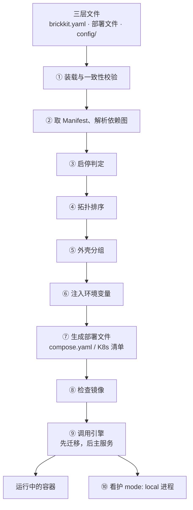

# BrickKit — 第 3 份，共 7 份 (中文)

包含: docs/zh/03-component-guide/07-release-workflow.md, docs/zh/03-component-guide/08-component-doc-spec.md, docs/zh/03-component-guide/09-multi-version-coexistence.md, docs/zh/03-component-guide/10-git-distribution.md, docs/zh/04-shell/README.md, docs/zh/04-shell/01-shell-concept.md, docs/zh/04-shell/02-json-injection.md, docs/zh/04-shell/03-shell-declaration.md, docs/zh/04-shell/04-members-management.md, docs/zh/04-shell/05-shell-development.md, docs/zh/04-shell/06-special-characters.md, docs/zh/04-shell/07-shell-upgrade.md, docs/zh/04-shell/08-shell-config.md, docs/zh/05-migration/README.md, docs/zh/05-migration/01-migration-service.md, docs/zh/05-migration/02-env-passthrough.md, docs/zh/05-migration/03-multi-version-chain.md, docs/zh/05-migration/04-shell-interaction.md, docs/zh/06-architecture/README.md, docs/zh/06-architecture/01-pipeline-overview.md, docs/zh/06-architecture/02-dependency-resolution.md, docs/zh/06-architecture/03-env-injection-contract.md, docs/zh/06-architecture/04-deploy-file-generation.md

下面的路径都相对仓库根目录: https://raw.githubusercontent.com/brickKit/brickKit/main/

下一份: https://raw.githubusercontent.com/brickKit/brickKit/main/llms/zh/04.md

---

> File: docs/zh/03-component-guide/07-release-workflow.md

# 发布

在 Git 源上，**发布一个版本就是往组件自己的仓库推一个 tag**。使用方的 CLI 按 tag 找版本：tag `0.1.0` 就是版本 0.1.0。
`brickkit release` 替你做这件事，并在动手之前把会出错的情况全部挡住。

（发布到组件市场是另一条命令 `brickkit publish`，见 [CLI 命令参考](../../docs/zh/07-cli-reference/README.md#brickkit-publish)。）

## 流程

```bash
cd demo-quote
brickkit release
```

```text
✅ 已发布 demo/quote@0.1.0：tag 0.1.0 已推送
```

它做了这些：

1. **读版本。** 取 `component.yaml` 的 `metadata.version`——版本号只有这一个来源。
2. **校验 `component.yaml`。** 解析得了、字段合法，才谈得上发布。
3. **检查工作区。** 组件目录里不能有未提交的改动。
4. **检查分支。** 当前分支要有上游，而且没有未推送的提交：tag 指向的提交必须已经在远端的历史里。
5. **检查 tag。** 这个 tag 在本地和远端都还不存在。
6. **打 tag、推送。**

前五步是只读的检查，全部通过才会写任何东西。

## 会被挡下的情况

**有未提交的改动：** tag 装的是一次提交，不是你的工作区——你没提交的那点改动不会跟着发布。

```text
❌ 错误：demo/quote@0.1.0 有未提交的改动
   目录：.
   改动：M main.go
   建议：先提交（或丢弃）它们——tag 装的是提交，不是你的工作区
```

**分支还没推送过：** 使用方从远端取 tag；一个只在你本机的提交，别人取到的 tag 会指向一个他拿不到的东西。

```text
❌ 错误：发布 demo/quote@0.1.0 的这个分支没有上游
   分支：main
   建议：推送分支并设好上游：git push -u origin main
```

**这个版本已经发布过：**

```text
❌ 错误：demo/quote@0.1.0 已经发布过（tag 0.1.0 就在当前提交上）
   建议：发布过的版本不再改动：提高 component.yaml 里的 metadata.version，提交、推送后再发布
```

发布出去的版本不再变：已经有人按 0.1.0 装了它，同一个版本号指向两份不同的代码，就再也说不清谁跑的是哪一份。改了东西就提版本号。

## 要么完整做完，要么不留痕迹

打完 tag、推送失败（网络断了、没有推送权限）时，`release` 把本地刚打的 tag 删掉。否则下次重试会被"tag 已存在"挡住，
而那个 tag 其实从没到过远端。

## 发一个新版本

```bash
# 1. 改 component.yaml：version: 0.1.0 → 0.2.0（契约的 info.version 一起改）
# 2. 提交、推送
git commit -am "demo/quote 0.2.0：……"
git push
# 3. 发布
brickkit release
```

版本号怎么提：只改了内部实现、接口没变，提修订号（0.1.0 → 0.1.1）；加了接口或配置项、旧的调用方照样能用，提次版本号；
删了接口、改了已有字段的含义，提主版本号——使用方升级时要自己改代码。

## 批量发布：`--local`

一个项目里自己写了好几个组件（都在本地源 `components/` 下、各是一个仓库）时：

```bash
brickkit release --local
```

先把每一个都检查一遍，全部通过才开始逐个打 tag、推送；已经发布过的（tag 就在当前提交上）跳过；遇到第一个推送失败就停——之前发布的保留，之后的不再尝试。

## 组件在仓库子目录里时

几个组件放在同一个仓库（monorepo）的子目录里时，用 `--path` 指定组件目录。这时 tag 带上命名空间，各组件各打各的：

```bash
brickkit release --path svc/api        # 组件 erp/api，tag 是 erp-api/1.2.0
```

检查工作区时也只看这个组件自己的目录：旁边组件的改动与它无关。

## 工作台与发布无关

组件仓库里的 `brickkit.yaml`、部署文件、`config/`（你的本地联调工作台，见 [分形的本地开发](../../docs/zh/03-component-guide/05-local-dev-fractal.md)）不参与发布：
`release` 只读 `component.yaml`。它们如果有未提交的改动，同样会被第 3 步挡下——提交或丢弃之后再发布。

---

> File: docs/zh/03-component-guide/08-component-doc-spec.md

# 组件文档：BRICKKIT.md

## 为什么每个组件都要有

`component.yaml` 说清了"是什么"：依赖谁、要哪些配置、默认值是多少。它说不清"为什么"和"怎么用"：弱依赖缺了会怎样？
这个配置项该填什么、改了有什么后果？接口从哪里看？

使用你的组件的人——以及越来越多替他写代码的 AI 助手——要的恰恰是后者，而且要在不读源码的前提下拿到。
`BRICKKIT.md` 就是这份东西：放在组件仓库根目录，跟着每个版本一起发布，CLI 把它带进使用方的项目。

## 五个区块

`brickkit new` 生成的骨架已经把它们列好了：

| 区块 | 写什么 |
| --- | --- |
| 组件定位 | 一两句话：它解决什么业务问题，给谁用 |
| 依赖说明 | 它依赖哪些组件，各拿来做什么；弱依赖缺了时它怎么降级 |
| 配置指南 | `configSchema` 里各项的业务含义——尤其是默认值说不清的：怎么选值、改了会怎样 |
| 契约索引 | 契约文件在哪、各描述了什么接口 |
| 外壳声明 | 它是不是外壳；是的话编进了哪些成员 |

写给一个第一次见到这个组件的人：不要重复 `component.yaml` 里已经写明的东西（类型、默认值本身），写它说不出来的。

## 一个完整的例子

```markdown
# demo/quote

## 组件定位

每次返回一句名言，前面带上 `demo/hello` 的问候语。给页面顶部的"今日一句"用。

## 依赖说明

- `demo/hello@1.1.0`（强依赖）：取问候语。它不可达时，接口照常返回名言，问候语换成"（demo/hello 不可达）"。

## 配置指南

| 变量名 | 必填 | 说明 |
|---|---|---|
| `QUOTE_PREFIX` | 否 | 名言前面加的前缀，默认"今日名言："。想去掉前缀就写成空串 `""` |

## 契约索引

- `api/openapi.yaml`：`GET /api/v1/quote`，返回 `{"greeting": "...", "quote": "..."}`

## 外壳声明

不是外壳。
```

注意"配置指南"那一行：写成空串就去掉前缀——这是 `default: "今日名言："` 这个声明本身表达不出来的，恰好是使用者最可能想知道的。

## 它怎么到使用方手里

使用方 `add` 或 `fetch` 你的组件时，CLI 从你的 tag 里取出 `BRICKKIT.md`（组件带着它时），缓存在

```text
.brickkit/manifests/<scope>/<name>/<版本>/BRICKKIT.md
```

并把路径写进使用方项目的地图 `BRICKKIT.md`：

```text
| 组件 ID | 版本 | 文档路径 | 契约路径 |
|---|---|---|---|
| demo/quote | 0.1.0 | `.brickkit/manifests/demo/quote/0.1.0/BRICKKIT.md` | `.brickkit/artifacts/demo-quote-0-1-0/` |
```

使用方把组件的源码克隆进了 `components/`、而工作区正好是这个版本时，文档路径指向工作区里那一份——那是作者正在改的，缓存里的只是快照。

发布到组件市场时（`brickkit publish`），`BRICKKIT.md` 跟着版本一起上传。它应该只写调用方需要的东西：太大或不是文本的文件会在建版本之前被拦下。

## 与项目的 BRICKKIT.md 的关系

两份同名的文件，分工不同：

| | 项目的 `BRICKKIT.md` | 组件的 `BRICKKIT.md` |
| --- | --- | --- |
| 在哪 | 项目根目录 | 组件仓库根目录 |
| 写什么 | 这个项目用了哪些组件、每个组件的文档和契约在哪 | 这一个组件是什么、怎么配置、怎么调用 |
| 谁写 | CLI 维护组件表（`add` / `remove` / `upgrade` 时重写标记之间的部分），其余是你的 | 组件作者 |
| 相当于 | 路由表 | 内容 |

读一个陌生项目，从项目的 `BRICKKIT.md` 开始：它告诉你每个组件的文档在哪；要了解哪个组件，就去读它自己的那一份，而不是翻源码。

---

> File: docs/zh/03-component-guide/09-multi-version-coexistence.md

# 多版本共存

## 服务名带着版本

每个组件版本运行时有一个**版本化服务名**：组件 ID 里的 `/` 和 `.` 换成 `-`，再接上精确版本。

| 组件版本 | 服务名 | 别人拿到的地址 |
| --- | --- | --- |
| `demo/hello@1.0.0` | `demo-hello-1-0-0` | `http://demo-hello-1-0-0:8080` |
| `demo/hello@1.1.0` | `demo-hello-1-1-0` | `http://demo-hello-1-1-0:8080` |

这个地址在 Docker 和 Kubernetes 上一模一样（Docker Compose 的服务名、Kubernetes 的 Service 名都是它）。两个版本是两个名字，
DNS 天然把它们分开：同时运行，互不冲突，不需要任何额外的机制。

地址变量的**名字**不带版本（`DEMO_HELLO_ENDPOINT`），**值**带版本。调用方永远知道自己连的是哪个版本，没有"悄悄升级"这回事。

## 什么时候会出现两个版本

`demo/caller@1.0.0` 声明依赖 `demo/hello@1.0.0`，`demo/quote@0.1.0` 声明依赖 `demo/hello@1.1.0`。两个组件都在同一个项目里时，
两个版本的 `demo/hello` 都会被加进来——依赖的版本不一致**不是错误**：

```yaml
# brickkit.yaml
components:
  - id: demo/hello
    version: 1.1.0
  - id: demo/quote
    version: 0.1.0
  - id: demo/hello
    version: 1.0.0
    requiredBy: [demo/caller]
```

不带 `requiredBy` 的那个是**默认版本**；带 `requiredBy` 的是"因为谁要它而留下"的兼容版本，一眼可知为何存在。`add`、`upgrade` 维护这些标记：
没人再要的兼容版本会被清掉。

生成的部署文件里（节选），每个调用方连的是它自己声明的那个版本：

```text
  demo-caller-1-0-0:
      - DEMO_HELLO_ENDPOINT=http://demo-hello-1-0-0:8080
  demo-hello-1-0-0:
      - COMPONENT_VERSION=1.0.0
  demo-hello-1-1-0:
      - COMPONENT_VERSION=1.1.0
  demo-quote-0-1-0:
      - DEMO_HELLO_ENDPOINT=http://demo-hello-1-1-0:8080
```

## 每个版本一份配置

| 文件 | 属于 |
| --- | --- |
| `config/demo-hello.yaml` | 默认版本（1.1.0） |
| `config/demo-hello@1.0.0.yaml` | 兼容版本 1.0.0 |

不带版本号的文件永远跟着默认版本走；默认版本移动时（`upgrade`），配置按迁移规则搬过去，旧版本如果还被依赖，它原来的配置改名成带版本号的文件留下
（见 [升级与配置迁移](../../docs/zh/02-project-guide/07-upgrade-and-migration.md)）。部署文件里也一样：裸 ID 的条目（`- id: demo/hello`）是默认版本，
其余版本各有自己的 `id@版本` 条目。

## 作为组件作者要知道的

- **一个组件的 `dependencies` 里，同一个组件 ID 只能出现一次。** 地址变量名不带版本，写两个版本会撞在同一个变量上。多版本共存是**项目层面**的能力：
  不同的组件各自依赖不同的版本。
- **两个版本可能共用一个数据库。** 它们各跑各的迁移；数据层兼容不兼容（新版本加的列旧版本认不认、旧版本写的数据新版本读不读得了），是组件作者的责任。
  迁移状态表的主键要带上组件标识，否则两个组件共用一个库时迁移记录会互相覆盖。
- **不兼容的改动要提主版本号。** 使用方靠版本号判断能不能升；你悄悄在修订号里改了接口，调用方就在不知情的情况下坏掉。

## 什么时候需要共存，什么时候不需要

需要：

- **不同的组件依赖不同的版本**，而其中一个还没来得及跟上——共存是一个缓冲，给它升级的时间。
- **灰度升级**：新版本先给一部分调用方用，旧版本继续服务其余的。

不需要：所有调用方都升级完了，旧版本没有任何 `requiredBy`，它自然会被 `upgrade` / `remove` 清掉。共存是一个过渡状态，不是目标——每多一个版本，
就多一份镜像、一份配置、一组要照看的容器。

---

> File: docs/zh/03-component-guide/10-git-distribution.md

# Git 分发

## 思路

不需要任何专门的服务器：**组件放在 Git 仓库里，版本是 Git tag。** 公司里已经有的 GitLab、Gitea、GitHub 组织就是一个组件源。
发布就是推一个 tag（`brickkit release`），安装就是按 tag 取文件。

## 组件地址怎么推导

使用方在 `brickkit.yaml` 里声明一个 Git 安装源：

```yaml
sources:
  - name: company-git
    type: git
    baseUrl: https://git.example.com/components/
```

之后每个组件的仓库地址按规则推出来，不用逐个配置：

| 组件 | 仓库 |
| --- | --- |
| `demo/quote` | `https://git.example.com/components/demo-quote` |
| `erp/backend` | `https://git.example.com/components/erp-backend` |

版本对应 tag：版本 `0.1.0` 就是 tag `0.1.0`（不带 `v`）。"最新版本"是精确版本形式的 tag 里最高的那个；`v1.0.0`、`latest` 这类 tag 不算版本。

**推导不出来时，单独指定。** 仓库在别的组织、名字对不上规则、或者组件在一个 monorepo 的子目录里，就在那个组件的条目上写 `source`：

```yaml
components:
  - id: erp/backend
    version: 2.1.0
    source:
      type: git
      repo: https://git.example.com/platform/erp.git
      path: services/backend      # 组件在仓库里的子目录；这时 tag 是 erp-backend/2.1.0
```

`source.type: local` 则指向本机的一个组件目录（`path` 相对项目根），见 [分形的本地开发](../../docs/zh/03-component-guide/05-local-dev-fractal.md)。

## 缓存：每个仓库只克隆一次

CLI 在**用户级**缓存目录里为每个组件仓库保存一份 bare 仓库（只有 Git 数据、没有工作区），按完整的仓库地址分目录：

```text
~/.cache/brickkit/repos/
└── git.example.com/
    └── components/
        ├── demo-bus.git
        ├── demo-caller.git
        ├── demo-hello.git
        └── demo-quote.git
```

（macOS 上在 `~/Library/Caches/brickkit/repos/`。）放在用户级而不是每个项目的 `.brickkit/` 下，是因为同一个组件仓库会被很多项目、
以及组件自己的工作台共用——放在项目里，同一个仓库就要克隆 N 次。

要一个组件版本的 `component.yaml` 时，CLI 依次尝试：

| 顺序 | 从哪取 | 要不要网络 |
| --- | --- | --- |
| 1 | 项目的 `.brickkit/manifests/` 缓存 | 不要 |
| 2 | 缓存的 bare 仓库里的这个 tag（`git show`） | 不要 |
| 3 | `git fetch --tags`：仓库在、但还没有这个 tag | 增量 |
| 4 | `git clone --bare`：这个仓库从没克隆过 | 完整克隆 |

所以第一次安装要联网，之后同一个版本随时可以离线使用；发了新版本，只取增量。克隆先落到临时目录、完成后再改名，中途被打断不会留下半个仓库。

## 私有仓库与鉴权

**CLI 不管鉴权。** 它调用系统的 `git`，用的就是你的 git 已经配置好的凭据：

| 场景 | 怎么准备 |
| --- | --- |
| SSH 地址（`git@git.example.com:components/…`） | `~/.ssh/` 里有对应的 key，并已添加到托管平台 |
| HTTPS 地址 | 配好 git credential helper（store、cache、osxkeychain、manager……） |
| CI | 环境里注入 token（`GIT_ASKPASS`、`.netrc`，或 CI 平台自带的凭据） |

没有凭据时，CLI 让 `git` 直接失败而不是停下来等你输入密码——在 CI 里，那会让流水线挂住。失败时 git 的原话会原样给你：

```text
❌ 拉取组件失败：example/member
   安装源：company-git（git）
   仓库：https://git.example.com/components/example-member
   Git 错误：fatal: Could not read from remote repository.
   组件：example/member@0.1.0
   建议：
   1. SSH：确认 ~/.ssh/ 下有对应的 key，且已添加到仓库托管平台
   2. HTTPS：确认已配置 git credential helper（store、cache、osxkeychain、manager……）
   3. CI/CD：确认环境里已注入 token（GIT_ASKPASS、.netrc 或 CI 平台的凭据）；仓库地址拼错、仓库不存在也会是这个报错
```

（git 的原话随托管平台与失败原因不同；这里节选了其中一行。）根本没连上远端时（离线、主机名解析不了），建议换成网络方面的。
几种情况怎么区分、各怎么办，见 [Git 鉴权问题](../../docs/zh/10-troubleshooting/04-git-auth-issues.md)。

平台不碰凭据，是因为 git 已经把这件事解决得很好：SSH、各种 credential helper、CI 平台的注入方式，每一种都有成熟的做法。
CLI 另搞一套只会多一个要维护的地方，而且永远追不上所有托管平台。

## 怎么发现有哪些组件

平台没有注册表，也不提供搜索：组件在哪、有哪些，靠约定和文档——比如把组件都放在同一个 Git 组织下，
在组织的首页或者一份内部 wiki 上列出来，每个组件的 `BRICKKIT.md` 说清它是什么。需要一个可搜索的目录时，组件市场（`sources[].type: market`）是另一条路。

---

> File: docs/zh/04-shell/README.md

# 外壳机制

**外壳**是一种特殊的组件：它在构建时把另外几个组件（它的**成员**）的代码编进自己的进程，部署时一个容器替它们全部提供服务。
其它组件照样按成员的地址调用它们，不知道对面是一个容器还是一个外壳。

**什么时候用：** 组件很多、每个都是一个独立进程太费内存（尤其是 JVM：一个空转的 Spring Boot 就要两三百 MB），
或者几个组件之间调用极其频繁、想省掉网络往返。

**什么时候不用：** 成员要各自扩缩容、要各自隔离故障、用不同的语言写——这些都要求它们是独立的进程。
外壳是一种部署方式，不是默认选择：先让组件各自独立跑，确实需要时再合并。

这一模块用一个真实的例子：外壳 `shop/shell` 编进了 `shop/cart`（购物车）和 `shop/stock`（库存），外面还有一个独立运行的 `shop/order`。

| 篇目 | 讲什么 |
| --- | --- |
| [01 外壳的概念](../../docs/zh/04-shell/01-shell-concept.md) | 一个进程加载多个模块；什么时候合适 |
| [02 JSON 配置注入](../../docs/zh/04-shell/02-json-injection.md) | 外壳怎么拿到每个成员的配置与端口 |
| [03 外壳声明](../../docs/zh/04-shell/03-shell-declaration.md) | 三个文件各说什么："编进了什么"与"这次承载什么" |
| [04 成员管理](../../docs/zh/04-shell/04-members-management.md) | 放进、移出外壳；合并造成的启动环与 `skipWaitFor`；哪些成员字段不生效 |
| [05 开发一个外壳](../../docs/zh/04-shell/05-shell-development.md) | 外壳的启动代码、地址怎么指过来、本地联调 |
| [06 特殊字符](../../docs/zh/04-shell/06-special-characters.md) | 多行密钥、引号、`$` 怎么逐字节到达成员 |
| [07 外壳升级](../../docs/zh/04-shell/07-shell-upgrade.md) | 成员版本与外壳版本怎么对齐；对不上时的三条出路 |
| [08 外壳自身配置](../../docs/zh/04-shell/08-shell-config.md) | 外壳自己的配置与成员配置并存 |

---

> File: docs/zh/04-shell/01-shell-concept.md

# 外壳的概念

## 一个进程，多个模块

外壳不是"一个容器里跑几个进程"。它是**一个进程**，里面加载了几个模块，每个模块就是一个成员组件的代码。

```text
独立部署                                   外壳部署
┌──────────────┐ ┌──────────────┐          ┌──────────────────────────────┐
│ shop/cart    │ │ shop/stock   │          │ shop/shell（一个进程）         │
│ 进程 :8081   │ │ 进程 :8082   │    →     │   cart 模块   监听 :8081       │
└──────────────┘ └──────────────┘          │   stock 模块  监听 :8082       │
  两个容器、两份运行时                        └──────────────────────────────┘
                                             一个容器、一份运行时
```

外壳替每个成员在它**自己的端口**上监听。所以调用方看来什么都没变：`shop/order` 照旧调 `SHOP_STOCK_ENDPOINT`，
只是这个地址现在指向外壳（见 [开发一个外壳](../../docs/zh/04-shell/05-shell-development.md#地址怎么指过来)）。

## 一个外壳承载多个成员，一个成员同一时刻只在一个外壳里

部署文件里，成员的条目**嵌在外壳条目下面**：

```yaml
components:
  - id: shop/shell
    members:
      - id: shop/stock
      - id: shop/cart
  - id: shop/order
```

每个组件版本在部署文件里只出现一次，所以一个成员不可能同时属于两个外壳——"它这次跑在哪"只有一个答案。
同一个组件的另一个版本可以在别处独立运行（见 [外壳升级](../../docs/zh/04-shell/07-shell-upgrade.md)）。

## 适合的场景

- **省内存。** 进程的内存底线主要由语言运行时决定：Go 十几 MB，Python / Node 几十 MB，JVM 两三百 MB。二十个 Spring Boot 组件各自一个进程，
  光空转就要四到九 GB；编进三四个外壳，只剩三四份运行时。
- **省网络往返。** 成员之间调用极其频繁时，编进同一个进程，外壳可以让它们直接进程内调用。

先想想别的办法：Go / Rust 写的组件本来就很省，合并不值得；JVM 可以试试 GraalVM 原生镜像；用不上的组件在部署文件里写 `mode: disable`，就不用跑。

## 不适合的场景

- **要独立扩缩容。** 外壳里的成员只能跟着外壳一起扩。
- **要独立隔离故障。** 一个模块把进程拖垮，外壳里的所有成员一起挂。
- **语言不同。** 外壳要把成员代码编进来，成员通常得和外壳是同一种语言、同一个运行时。

## 平台做什么，外壳作者做什么

| 平台 | 外壳作者 |
| --- | --- |
| 算出这次哪些成员由这个外壳承载，把它们的配置、端口编码成一份 JSON 交给外壳 | 读 JSON，初始化对应的模块，在成员的端口上监听 |
| 把指向成员的地址改成指向外壳 | 在进程里把请求交给对的模块 |
| 成员有迁移时，用成员自己的镜像单独跑，跑完才启动外壳 | 不必在外壳里跑成员的迁移 |
| 核对外壳镜像里编进的成员版本，与这次要承载的一致 | 在 `component.yaml` 里如实写出编进了哪些成员的哪个版本 |

平台不理解外壳内部怎么加载模块、怎么路由请求——那是外壳自己的代码，平台只负责把"承载谁、配置是什么、地址指哪"说清楚。

---

> File: docs/zh/04-shell/02-json-injection.md

# JSON 配置注入

成员独立运行时，每个成员在自己的容器里拿到自己的环境变量。编进外壳之后它们共用一个进程、一份环境——两个成员都有 `LOG_LEVEL` 怎么办？
平台的做法是：**成员的配置不摊进外壳的环境，而是打包成一份 JSON**，每个成员一项，互不干扰。

## 两个保留变量

外壳容器上多了两个变量：

| 变量 | 内容 |
| --- | --- |
| `BRICKKIT_SERVED_MEMBERS` | 这次承载的成员的服务名，逗号分隔：`shop-cart-0-1-0,shop-stock-0-1-0` |
| `BRICKKIT_SERVED_MEMBERS_CONFIG` | 每个成员一项的 JSON 数组：配置、端口 |

`shop/shell` 拿到的 `BRICKKIT_SERVED_MEMBERS_CONFIG`（格式化后）：

```json
[
  {
    "componentId": "shop/cart",
    "version": "0.1.0",
    "httpPort": 8081,
    "extraPorts": [],
    "config": {
      "SHOP_STOCK_ENDPOINT": "http://shop-shell-0-1-0:8082"
    }
  },
  {
    "componentId": "shop/stock",
    "version": "0.1.0",
    "httpPort": 8082,
    "extraPorts": [],
    "config": {
      "STOCK_WAREHOUSE": "上海仓"
    }
  }
]
```

## 每一项的字段

| 字段 | 说明 |
| --- | --- |
| `componentId`、`version` | 成员是谁、哪个版本 |
| `httpPort` | 成员自己 `component.yaml` 里的主端口：外壳要替它在这个端口上监听 |
| `extraPorts` | 成员的额外端口：`[{"name": "grpc", "port": 9090}]` |
| `config` | 成员独立运行时会拿到的环境变量：它的配置项，加上它依赖的地址（`*_ENDPOINT`）。`COMPONENT_ID`、`COMPONENT_VERSION` 不在这里，它们就是 `componentId`、`version` |

`config` 里的值是**已经求好的**：`$var:` 已经换成公共变量的值，`${VAR}` 已经展开，`file://` 已经读成文件内容。外壳拿到就能用，
不用再做任何替换（为什么要提前求值，见 [特殊字符](../../docs/zh/04-shell/06-special-characters.md)）。

## 外壳怎么用它

1. 读 `BRICKKIT_SERVED_MEMBERS_CONFIG`，解析成数组。
2. 对每一项，找到编进来的那个模块，用这一项的 `config` 初始化它——不是用外壳自己的环境。
3. 在 `httpPort`（和每个 `extraPorts`）上替它监听。

```go
type member struct {
	ComponentID string            `json:"componentId"`
	Version     string            `json:"version"`
	HTTPPort    int               `json:"httpPort"`
	Config      map[string]string `json:"config"`
}

var members []member
if err := json.Unmarshal([]byte(os.Getenv("BRICKKIT_SERVED_MEMBERS_CONFIG")), &members); err != nil {
	log.Fatalf("BRICKKIT_SERVED_MEMBERS_CONFIG: %v", err)
}
```

模块原本是 `os.Getenv("STOCK_WAREHOUSE")` 读配置的，编进外壳时改成从传给它的这张表里读——最省事的写法是模块一开始就接收一张配置表，
独立运行时由 `main` 从环境变量填这张表，外壳里由外壳从 JSON 填。

## 零个成员

外壳也可能这次一个成员都不承载（成员都被移出去了）。这时 `BRICKKIT_SERVED_MEMBERS` 是**空字符串**，`BRICKKIT_SERVED_MEMBERS_CONFIG` 是 `[]`——
"变量存在、但为空"，外壳应当一个模块都不初始化。千万不要把它当成"没有这个变量"而回退成"把编进来的模块全部启动"：那两种情况意思相反。

## 为什么不会冲突

每个成员的配置装在自己那一项里：`shop/cart` 的 `LOG_LEVEL` 和 `shop/stock` 的 `LOG_LEVEL` 是两个不同对象里的两个键，谁也盖不了谁。
外壳自己的配置则照常是外壳容器的环境变量（见 [外壳自身配置](../../docs/zh/04-shell/08-shell-config.md)），与 JSON 也不冲突。

## 它放在哪

JSON 里装着成员的全部配置，可能包括密钥，所以它按密钥对待：Docker 下写进 `.brickkit/generated/env/<外壳服务名>.env`（文件权限 0600，由 `env_file` 引用），
Kubernetes 下放进生成的 Secret。它不会明文出现在 `compose.yaml` 或 Deployment 里。

---

> File: docs/zh/04-shell/03-shell-declaration.md

# 外壳声明

关于一个外壳，三个文件各说一件事：

| 文件 | 说什么 | 谁写 |
| --- | --- | --- |
| 外壳的 `component.yaml`：`shell.members` | **外壳是什么**：构建时编进了哪些成员、各是哪个精确版本 | 外壳作者 |
| `brickkit.yaml`：`kind: shell` | 这个组件是外壳（一个标记） | CLI 维护 |
| 部署文件：外壳条目下的 `members` | **这次承载什么**：这次运行时哪些成员在外壳里 | 项目 |

平台只核对三者说的是不是同一件事，从不替你推导该怎么跑。

## 外壳是什么：`shell.members`

```yaml
# shell/shop/shell/component.yaml
metadata:
  id: shop/shell
  name: Shop shell
  version: 0.1.0
  description: 把购物车与库存编进一个进程

shell:
  members:
    - shop/cart@0.1.0
    - shop/stock@0.1.0
```

写了 `shell.members`，这个组件就是外壳。每个成员写**精确版本**，与 `dependencies` 同样的写法：外壳的镜像里编进的就是这些版本的代码，
它不能在启动时去加载任意版本——BrickKit 只支持"构建时编进"这一种外壳。

`brickkit build` 构建外壳镜像时，把编进的成员版本记在镜像标签里：

```text
io.brickkit.shell.members = shop/cart@0.1.0,shop/stock@0.1.0
```

`up` 用本机构建的外壳镜像前会核对它，见 [外壳升级](../../docs/zh/04-shell/07-shell-upgrade.md#镜像与声明对不上)。

## 这次承载什么：部署文件的 `members`

```yaml
# deploy.yaml
components:
  - id: shop/shell
    members:
      - id: shop/stock
      - id: shop/cart
  - id: shop/order
```

成员的条目嵌在外壳条目下面，只嵌一层。它们是完整的部署条目，可以写 `mode`、`skipWaitFor` 等字段。条目写裸 ID 时指默认版本，写 `id@版本` 时指那个版本。

**成员关系只有这一个来源。** 外壳的 `component.yaml` 说它**能**承载谁；部署文件说它这次**确实**承载谁。
一个外壳编进了五个模块，这个项目只用其中两个，就只把那两个放在它下面——其余三个外壳这次不初始化。

## `kind: shell`

`brickkit.yaml` 里外壳的条目带一个 `kind: shell`：

```yaml
components:
  - id: shop/shell
    version: 0.1.0
    kind: shell
```

它由 CLI 在 `add` 外壳时写上；`lint`、`up`、`graph` 都核对它与外壳的 `component.yaml` 一致，也核对放在外壳下面的每个成员确实编进了这个外壳。它只是一个标记，让人读 `brickkit.yaml` 时一眼看出哪个是外壳；
谁在外壳里，不由它决定。

## 为什么分成这几处

- **能力不等于使用。** 同一个外壳镜像可以在不同的项目里承载不同的成员组合；把"承载谁"写进外壳的 `component.yaml`，就只能一个组合。
- **"编进了哪个版本"必须由外壳自己说。** 镜像里是什么代码，只有构建它的人知道；项目那边只能决定用不用、怎么用。
- **每件事只在一处写。** 成员关系只在部署文件里，编进的版本只在外壳的 `component.yaml` 里。同一件事写两处，迟早两处不一致。

三处对不上时，生成出来的东西一定是错的——镜像里根本没有成员的代码、编进的是另一个版本，或者外壳以为自己不是外壳。
所以 `up` 在生成之前就大声失败，而不是等容器跑起来才露馅。

---

> File: docs/zh/04-shell/04-members-management.md

# 成员管理

## 加入外壳

`add` 一个外壳时，它编进的成员按外壳声明的版本一起加进项目，而且在部署文件里**直接嵌在外壳条目下面**：

```bash
brickkit add --local
```

```text
➕ 加入 shop/cart@0.1.0, shop/shell@0.1.0, shop/stock@0.1.0
   ✅ shop/stock@0.1.0（在外壳 shop/shell 里）
   ✅ shop/cart@0.1.0（在外壳 shop/shell 里）
   ✅ shop/shell@0.1.0
📝 已写：brickkit.yaml, deploy.yaml
📝 配置骨架：config/shop-stock.yaml
```

```yaml
# deploy.yaml
components:
  - id: shop/shell
    members:
      - id: shop/stock
      - id: shop/cart
```

项目里本来就有、后来才出现能承载它的外壳的组件，`add` **不会**替你把它挪进外壳，也不会问你要不要挪：
放不放进外壳是部署方式的决定——省内存还是要独立扩缩容、这个环境里合不合并——只有你知道，而且可能每个部署文件不一样。
要放，就把它的条目移到外壳条目的 `members` 下面。

## 移出外壳

把成员的条目从 `members` 下面挪到顶层：

```yaml
components:
  - id: shop/shell
    members:
      - id: shop/cart
  - id: shop/stock          # 独立运行
```

下一次 `up`，`shop/stock` 用它自己的镜像在自己的容器里跑，外壳只承载 `shop/cart`，指向 `shop/stock` 的地址改回它自己的服务名。
**它的配置一个字都不用改**：`config/shop-stock.yaml` 写的是它要什么值，与它跑在哪里无关。部署文件的 `members` 只决定"怎么运行"，不改变配置本身。

同样的道理，在某一份部署文件里把成员条目写成 `mode: disable`，外壳这次就不承载它；在 `deploy.local.yaml` 里写成 `mode: debug` 或 `mode: local`，
它这次在你的机器上以本机进程运行，外壳也不承载它（见 [本地调试](../../docs/zh/02-project-guide/03-local-debug-workflow.md#外壳成员的调试)）。

## 外壳不跑时

外壳被 `mode: disable` 关掉、或者这次没有启动时，它下面的成员不会跟着消失——它们**回落成独立组件**，各自按自己的条目部署。

## 删除外壳

```bash
brickkit remove shop/shell
```

外壳的条目删掉，它承载的成员挪回部署文件顶层、独立运行，成员的配置保留。

## 外壳里的成员哪些字段不生效

成员条目是完整的部署条目，但外壳承载它时，描述"它自己的容器怎么部署"的字段**不生效，也不警告**：
`expose`、`exposePort`、`hostname`、`tlsSecret`、`replicas`、`resources`、`serviceAccountName`、`labels`。它这次没有自己的容器，这些字段无处可用。
它们留在条目上是有用的：外壳不跑、成员回落成独立组件时，它们就生效。

同样，成员 `component.yaml` 里的 `healthCheck` 在外壳里不用——健康检查的是外壳这个进程，用外壳自己的 `healthCheck`。
成员的端口要对外开放，在外壳里没有办法单独开；需要单独对外开放的成员，不要放进外壳。

## 合并造成的启动环与 `skipWaitFor`

组件之间没有环，放进外壳之后却可能出现环。`shop/cart`（在外壳里）依赖 `shop/order`（在外面），而 `shop/order` 又依赖 `shop/stock`（在外壳里）：

```text
shop/cart ──→ shop/order ──→ shop/stock
（外壳里）       （外面）       （外壳里）
```

外壳作为一个整体启动：它继承了每个成员的依赖，所以外壳要等 `shop/order`；依赖成员的组件也就依赖外壳，所以 `shop/order` 要等外壳。
Docker Compose 下这是一个永远起不来的等待环，`up` 在生成之前就拦下：

```text
❌ 错误：把成员放进外壳 shop/shell@0.1.0 之后，外壳要等一个组件，而那个组件又在等外壳
   依赖：shop/order@0.1.0 → shop/stock@0.1.0（在外壳 shop/shell@0.1.0 里）
   依赖：shop/cart@0.1.0（在外壳 shop/shell@0.1.0 里） → shop/order@0.1.0
   原因：组件之间并没有互相依赖成环，但外壳容器是作为一个整体启动的：它继承了每个成员的依赖，依赖成员的组件也就依赖外壳。在 Docker Compose 下这成了一个永远起不来的 depends_on 环
   建议：
   1. 把夹在中间的那个组件也放进这个外壳（把它的条目移到外壳下面），或者把其中一个成员移出外壳（把它的条目移到顶层）
   2. 或者在 component.yaml 里把其中一条依赖改成弱依赖（optional: true）：弱依赖不约束启动顺序
   3. 或者接受代价：在部署文件里给 shop/cart@0.1.0 的条目写上 skipWaitFor: [shop/order]。它就不等 shop/order 直接启动，必须自己重试到对方就绪
```

前两条出路改变结构；第三条保留结构、去掉一处等待：

```yaml
components:
  - id: shop/shell
    members:
      - id: shop/stock
      - id: shop/cart
        skipWaitFor: [shop/order]
  - id: shop/order
```

```text
📋 启动顺序（拓扑排序）：
   1. shop-shell-0-1-0  无依赖（承载 shop/stock@0.1.0、shop/cart@0.1.0；不等 shop/order@0.1.0）
   2. shop-order-0-1-0  ← 依赖 1
```

`skipWaitFor` 只去掉**启动时的等待**：外壳不再等 `shop/order` 就启动。连接不受影响——`shop/cart` 照样拿到 `SHOP_ORDER_ENDPOINT`，照样连得到它。

**代价由写它的人承担。** 外壳启动时 `shop/order` 可能还没就绪，所以 `shop/cart` 的代码必须能重试：初始化时连不上就退出的代码，在这里会反复重启。
写之前确认你的成员能做到这一点。

规则：

- 列出的必须是这个组件版本真实的**强依赖**——拼错的名字、弱依赖（本来就不等）、根本不依赖的组件，写了都会报错，免得你以为那条等待已经去掉了。
- 跳过的依赖跟它在同一个外壳里时，调用不出进程、本来就没有等待，写了会被警告。
- Kubernetes 下 Pod 之间本来就没有启动顺序，以本机进程运行的组件没有 `depends_on`：这两种情况下写了只警告、不生效，合并造成的环也不拦。

---

> File: docs/zh/04-shell/05-shell-development.md

# 开发一个外壳

## 从骨架开始

```bash
brickkit new shop/shell --shell
```

```text
✅ 已生成组件骨架：shop/shell
   📄 shell/shop/shell/component.yaml
   📄 shell/shop/shell/BRICKKIT.md
```

外壳写到项目的 `shell/` 下（本地安装源 `local-shells`）：外壳通常是一个项目自己的代码，决定"这个项目把哪些组件合在一起"，随项目提交。
骨架里的 `shell.members` 带一个要换掉的占位成员：

```yaml
shell:
  # TODO：这个外壳编进了哪些成员、各是哪个精确版本（把占位的换掉）
  members:
    - example/member@0.1.0
```

换成真正编进来的成员：

```yaml
shell:
  members:
    - shop/cart@0.1.0
    - shop/stock@0.1.0
```

外壳本身就是一个普通组件：它有自己的 `deployment`、`healthCheck`、镜像、配置。

## 启动代码

外壳启动时做四件事：读 `BRICKKIT_SERVED_MEMBERS_CONFIG`，按每一项找到编进来的模块，用那一项的配置初始化它，在那一项的端口上替它监听。
`shop/shell` 的全部代码：

```go
// shop/shell：把 shop/cart 与 shop/stock 编进一个进程的外壳。
//
// 真实的外壳会 import 成员的代码；为了短，这里把两个模块的处理函数直接写在外壳里。
package main

import (
	"encoding/json"
	"fmt"
	"log"
	"net/http"
	"os"
)

// member 是 BRICKKIT_SERVED_MEMBERS_CONFIG 里的一项。
type member struct {
	ComponentID string            `json:"componentId"`
	Version     string            `json:"version"`
	HTTPPort    int               `json:"httpPort"`
	Config      map[string]string `json:"config"`
}

// modules 是编进这个外壳的模块：组件 ID → 用成员自己的配置建出它的 HTTP 处理器。
var modules = map[string]func(cfg map[string]string) http.Handler{
	"shop/stock": func(cfg map[string]string) http.Handler {
		mux := http.NewServeMux()
		mux.HandleFunc("/api/v1/stock", func(w http.ResponseWriter, _ *http.Request) {
			json.NewEncoder(w).Encode(map[string]any{"sku": "A1", "count": 42, "warehouse": cfg["STOCK_WAREHOUSE"]})
		})
		return mux
	},
	"shop/cart": func(cfg map[string]string) http.Handler {
		mux := http.NewServeMux()
		mux.HandleFunc("/api/v1/cart", func(w http.ResponseWriter, _ *http.Request) {
			var s map[string]any
			if resp, err := http.Get(cfg["SHOP_STOCK_ENDPOINT"] + "/api/v1/stock"); err == nil {
				_ = json.NewDecoder(resp.Body).Decode(&s)
				resp.Body.Close()
			}
			json.NewEncoder(w).Encode(map[string]any{"items": []string{"A1"}, "stock": s})
		})
		return mux
	},
}

func main() {
	var members []member
	if err := json.Unmarshal([]byte(os.Getenv("BRICKKIT_SERVED_MEMBERS_CONFIG")), &members); err != nil {
		log.Fatalf("BRICKKIT_SERVED_MEMBERS_CONFIG: %v", err)
	}
	for _, m := range members {
		build, ok := modules[m.ComponentID]
		if !ok {
			log.Fatalf("this shell has no module %s", m.ComponentID) // 编进的成员里没有它：大声失败
		}
		addr := fmt.Sprintf(":%d", m.HTTPPort) // 替成员在它自己的端口上监听
		go func(h http.Handler) { log.Fatal(http.ListenAndServe(addr, h)) }(build(m.Config))
		log.Printf("serving %s@%s on %s", m.ComponentID, m.Version, addr)
	}
	http.HandleFunc("/healthz", func(w http.ResponseWriter, _ *http.Request) { w.Write([]byte("ok")) })
	log.Fatal(http.ListenAndServe(":8080", nil))
}
```

构建、启动之后，外壳的日志：

```text
shop-shell-0-1-0-1            | 2026/09/29 12:02:06 serving shop/cart@0.1.0 on :8081
shop-shell-0-1-0-1            | 2026/09/29 12:02:06 serving shop/stock@0.1.0 on :8082
```

几件要照着做的事：

- **每个模块用自己那一项的 `config`**，不要读外壳进程的环境变量——那里没有成员的配置。
- **JSON 里出现了一个外壳没编进的成员，立刻失败。** 那意味着声明与镜像对不上；悄悄跳过它，调用方拿到的地址就指向一个不存在的服务。
- **健康检查只查外壳进程本身。** 一个模块初始化失败，应该让整个外壳启动失败，而不是带着一个死掉的模块报健康。

## 地址怎么指过来

调用方不知道对面是外壳。平台在两处替它把地址接上：

**别人拿到的地址指向外壳。** 外壳外面的 `shop/order` 依赖 `shop/stock`，它拿到的是：

```text
      - SHOP_STOCK_ENDPOINT=http://shop-shell-0-1-0:8082
```

外壳里的成员之间也一样：`shop/cart` 在 JSON 里拿到的 `SHOP_STOCK_ENDPOINT` 同样是 `http://shop-shell-0-1-0:8082`。端口是成员自己的端口——
外壳正是在那里替它监听。

**成员的服务名也解析到外壳。** Docker 下外壳容器挂上了每个成员的服务名作为网络别名：

```yaml
    networks:
      brickkit-net:
        aliases:
          - shop-cart-0-1-0
          - shop-stock-0-1-0
```

**进程内怎么分发，是外壳自己的事。** 请求到了外壳的某个端口之后交给哪个模块、要不要按路径或主机名再分——平台不介入。
平台只保证请求能到达外壳的正确端口；外壳里是一个模块一个端口，还是一个端口按路径分发，都由外壳作者决定。

**端口不能冲突。** 外壳自己的端口和每个成员的端口最终都在同一个容器（或 Pod）里监听，平台在生成之前核对：

```text
❌ 错误：外壳 shop/shell@0.2.0 上有两个组件都要用端口 8082
   占用方：组件 shop/cart@0.1.0
   占用方：组件 shop/stock@0.2.0
   建议：这几个组件最终都跑在同一个外壳容器/Pod 里，端口必须互不相同
```

## 成员的迁移不在外壳里跑

成员声明了 `migration.command` 时，平台用**成员自己的镜像**、成员自己的配置单独跑它的迁移，跑成功之后才启动外壳：

```yaml
  shop-shell-0-1-0:
    depends_on:
      shop-stock-0-1-0-migration:
        condition: service_completed_successfully
```

所以外壳不必知道怎么迁移每个成员；而每个成员**都必须有自己的镜像**（`deployment.image` 或 `deployment.build`），哪怕它平时总在外壳里跑。
详见 [与外壳的交互](../../docs/zh/05-migration/04-shell-interaction.md)。

## 本地联调

外壳也是一个组件，可以用同样的方式开发：在外壳目录里 `brickkit init` 建一个工作台，或者在项目里把外壳条目写成 `mode: debug` / `mode: local`，
让它以本机进程运行（见 [分形的本地开发](../../docs/zh/03-component-guide/05-local-dev-fractal.md)）。

外壳以本机进程运行时，它加载的是成员**本地仓库里的代码**（`components/` 下克隆的那份）。所以 `up` 核对一条链：外壳这次承载的成员版本
等于外壳 `component.yaml` 声明编进的版本；成员有本地仓库时，仓库 `component.yaml` 里的版本也必须就是它，而且它得是这个成员的默认版本。
对不上就报错，并提示 `brickkit upgrade <成员>@<仓库版本>` 或者把仓库切到对应的 tag——而不是让你调试一份和声明不符的代码。

---

> File: docs/zh/04-shell/06-special-characters.md

# 特殊字符

## 问题在哪

成员的配置要装进一个 JSON 字符串，再作为一个环境变量交给外壳。配置值里什么都可能有：多行的 PEM 私钥、引号、反斜杠、`$`。
如果平台只是把 `${VAR}` 原样写进 JSON、留给 Docker Compose 启动时去替换，那么 Compose 做的是**不懂 JSON 的纯文本替换**：
一个带引号或换行的值替换进去，JSON 就坏了，外壳启动时解析失败——而且要到运行时才露面。

## 平台怎么做

**提前求值。** 生成部署文件时，CLI 就把每个成员配置的值求出来：

| 写法 | 生成时 |
| --- | --- |
| 字面量 | 原样 |
| `$var:NAME` | 换成公共变量的值 |
| `${VAR}` | 从进程环境、其次项目根目录的 `.env` 取值展开；取不到就大声失败 |
| `file://路径` | 读成文件的内容 |
| `{ existingSecret, key }` | 拒绝：值只在集群里，CLI 读不到，而 JSON 需要值 |

**再做 JSON 编码。** 求好的值按 JSON 规则编码：引号、反斜杠、换行都被转义。

**再按落地的地方转义一次。** Docker 下 JSON 写进 0600 的 env 文件，`$` 写成 `$$`，这样 Compose 不会再对它做任何替换；
Kubernetes 下它进生成的 Secret。

## 一个例子

`shop/stock` 的仓库名放在一个文件里，内容有引号、`$` 和两行：

```text
上海仓 "一号库"
价格 $5
```

```yaml
# config/shop-stock@0.1.0.yaml
STOCK_WAREHOUSE: file://.secrets/warehouse.txt
```

外壳的 env 文件里：

```text
BRICKKIT_SERVED_MEMBERS_CONFIG="[{\"componentId\":\"shop/cart\",\"version\":\"0.1.0\",\"httpPort\":8081,\"extraPorts\":[],\"config\":{\"SHOP_ORDER_ENDPOINT\":\"http://shop-order-0-1-0:8083\",\"SHOP_STOCK_ENDPOINT\":\"http://shop-shell-0-1-0:8082\"}},{\"componentId\":\"shop/stock\",\"version\":\"0.1.0\",\"httpPort\":8082,\"extraPorts\":[],\"config\":{\"STOCK_WAREHOUSE\":\"上海仓 \\\"一号库\\\"\\n价格 $$5\\n\"}}]"
```

外壳里的 `shop/stock` 模块拿到的值，逐字节就是文件的内容：

```json
{"count":42,"sku":"A1","warehouse":"上海仓 \"一号库\"\n价格 $5\n"}
```

## 装不进 JSON 的值：大声失败

JSON 只能装文本。值不是合法的 UTF-8（比如一个二进制文件）时，编码会把非法字节悄悄换成替换字符——成员拿到一份被改过的值。平台在生成时就拦下：

```text
❌ 错误：外壳成员 shop/stock@0.1.0 的配置项 STOCK_WAREHOUSE 不是合法的 UTF-8 文本
   原因：JSON 只能装文本；二进制字节会被悄悄替换掉
   建议：二进制内容请先 base64 编码，由组件自己解码
```

`lint` 也做同样的检查（引用的文件、变量取不到时，`--strict` 下报出来），所以这类问题在 CI 里就能发现，不必等到部署。

提前求值也有一个后果：外壳成员配置里的 `${VAR}` 在 Docker 下也是在 **CLI 运行时**取值的，而不是 `docker compose` 启动时——运行 `brickkit up` 的那个环境里要有这些变量。

---

> File: docs/zh/04-shell/07-shell-upgrade.md

# 外壳升级

## 外壳的版本决定成员的版本

外壳的镜像里编进的是成员的某个具体版本的代码。所以"外壳这次承载的是成员的哪个版本"不是一个可以随意选的事：它必须就是外壳 `component.yaml` 里 `shell.members` 写的那个版本。

平台只**核对**，从不替你推导：部署文件与 `brickkit.yaml` 说这次承载什么版本，外壳的 `component.yaml` 说它编进了什么版本，两者对不上就报错。

## 升级外壳：换成新外壳编进的那一套

`shop/shell@0.2.0` 编进了 `shop/stock@0.2.0`：

```yaml
metadata:
  id: shop/shell
  name: Shop shell
  version: 0.2.0
  description: 把购物车与库存编进一个进程

shell:
  members:
    - shop/cart@0.1.0
    - shop/stock@0.2.0
```

```bash
brickkit upgrade shop/shell
```

```text
   ⬆️  shop/shell：0.1.0 → 0.2.0
   🔗 shop/stock@0.1.0 的 requiredBy 现在是：shop/cart, shop/order
   🔓 shop/stock@0.1.0 不在新外壳里：挪到顶层、独立运行
📝 已写：brickkit.yaml, deploy.yaml, deploy.local.yaml
```

升级外壳就是换成新外壳编进的那一套成员版本。`shop/stock@0.1.0` 还有别的组件依赖（`shop/cart`、`shop/order`），所以它留下来、挪到顶层独立运行；
没人再要的旧版本则被移除。部署文件跟着改：

```yaml
components:
  - id: shop/shell
    members:
      - id: shop/cart
        skipWaitFor: [shop/order]
      - id: shop/stock
  - id: shop/stock@0.1.0
  - id: shop/order
```

成员条目上你写过的字段（`mode`、`skipWaitFor`……）保留。构建新外壳的镜像、`up`：

```text
📋 启动顺序（拓扑排序）：
   1. shop-stock-0-1-0  无依赖
   2. shop-order-0-1-0  ← 依赖 1
   3. shop-shell-0-2-0  ← 依赖 1（承载 shop/stock@0.2.0、shop/cart@0.1.0；不等 shop/order@0.1.0）
```

一个外壳在 `brickkit.yaml` 里只能有一个版本：同一个外壳的两个版本同时承载成员，谁承载谁就说不清了。

## 只升级成员时

只升级成员（`brickkit upgrade shop/stock`）不会动外壳：外壳镜像里还是旧版本的代码。于是旧版本以 `requiredBy` 留下（外壳也在"要它"的名单里），
外壳下的成员条目钉到旧版本，新的默认版本在顶层独立运行：

```text
   ⬆️  shop/stock：0.1.0 → 0.2.0
   ✅ shop/stock@0.1.0（requiredBy: shop/cart, shop/order, shop/shell）
```

```yaml
components:
  - id: shop/shell
    members:
      - id: shop/stock@0.1.0
      - id: shop/cart
  - id: shop/order
  - id: shop/stock
```

两个版本共用一个数据库时，数据层兼容与否要由成员自己保证（见 [多版本共存](../../docs/zh/03-component-guide/09-multi-version-coexistence.md)）。
**升级之后要自己检查成员之间的兼容性**：外壳里的成员彼此进程内调用，平台不知道 `shop/cart@0.1.0` 能不能和一个新版本的库存模块一起工作。

## 版本对不上时的三条出路

手工改部署文件时，可能让外壳去承载一个它没编进的版本。比如把上面两个 `shop/stock` 条目对调：

```text
❌ 错误：这次外壳承载的成员版本，与外壳 component.yaml 里编进的版本对不上
   文件：deploy.yaml
   components[0].members[0]：外壳 shop/shell@0.1.0 编进的是 shop/stock@0.1.0，这次承载的却是 shop/stock@0.2.0
   建议：
   1. 升级 shop/shell：换一个 component.yaml 的 shell.members 里写着 shop/stock@0.2.0 的外壳版本
   2. 把 shop/stock 的条目从 shop/shell 的 members 挪到部署文件的顶层，让它独立运行
   3. 两个版本都留：brickkit.yaml 里已经有外壳编进的版本，把两个部署条目对调——shop/shell 下面的成员条目改成 `- id: shop/stock@0.1.0`，components[2] 那个条目改成 `- id: shop/stock`；shop/stock@0.2.0 独立运行
```

| 出路 | 适合 |
| --- | --- |
| 升级外壳 | 已经有编进了新版本的外壳版本 |
| 成员移出外壳 | 暂时不合并这个成员也可以 |
| 两个版本都留 | 外壳里继续跑旧版本，新版本独立跑，等外壳跟上 |

第三条的改法写得很具体，照着改完 `up` 就能过。

## 镜像与声明对不上

改了外壳 `component.yaml` 的 `shell.members`、却没重新构建外壳镜像时，本机的镜像里还是旧的成员代码。`brickkit build` 构建外壳镜像时在镜像标签里记下了编进的成员版本，
`up` 用本机构建的外壳镜像之前核对它：

```text
❌ 错误：外壳 shop/shell@0.1.0 的本机镜像编进的成员版本，与它的 component.yaml 不一致
   镜像：shop-shell:0.1.0
   镜像里的成员：shop/cart@0.1.0,shop/stock@0.1.0
   component.yaml 声明的成员：shop/cart@0.1.0,shop/stock@0.2.0
   建议：重新构建外壳镜像：brickkit build shop/shell@0.1.0 --force
```

更好的做法是：外壳编进的成员变了，就提外壳的版本号。已发布的外壳版本，`component.yaml`、tag、镜像三者天然一致。
没有这个标签的外壳镜像（手工构建、第三方镜像）无法核对，`up` 只警告一句。

---

> File: docs/zh/04-shell/08-shell-config.md

# 外壳自身配置

## 外壳也是一个组件

外壳有它自己的配置：日志级别、它自己的连接池、它自己对外的端口。它像任何组件一样在 `component.yaml` 里声明 `configSchema`，
使用方在 `config/<外壳>.yaml` 里填值：

```yaml
# shell/shop/shell/component.yaml
configSchema:
  type: object
  properties:
    SHELL_LOG_LEVEL:
      type: string
      default: info
      description: 外壳自己的日志级别
```

## 两种配置，两条通道

| | 给谁 | 怎么到达 |
| --- | --- | --- |
| 外壳自己的配置 | 外壳进程 | 普通环境变量，和任何组件一样 |
| 成员的配置 | 外壳里的各个模块 | 打包在 `BRICKKIT_SERVED_MEMBERS_CONFIG` 里（见 [JSON 配置注入](../../docs/zh/04-shell/02-json-injection.md)） |

生成的外壳容器上两者并存：

```yaml
    env_file:
      - path: .brickkit/generated/env/shop-shell-0-2-0.env
    environment:
      - BRICKKIT_SERVED_MEMBERS=shop-cart-0-1-0,shop-stock-0-2-0
      - COMPONENT_ID=shop/shell
      - COMPONENT_VERSION=0.2.0
      - SHELL_LOG_LEVEL=info
```

`SHELL_LOG_LEVEL` 是外壳自己的；成员的配置在 env 文件里的那份 JSON 中，不会与它冲突。
外壳的 `COMPONENT_ID` / `COMPONENT_VERSION` 是外壳自己的——成员的 ID 与版本在 JSON 每一项的 `componentId` / `version` 里。

外壳的 `configSchema` 同样不能用平台保留的名字，其中包括 `BRICKKIT_SERVED_MEMBERS` 与 `BRICKKIT_SERVED_MEMBERS_CONFIG`。

## 外壳内部的通信

成员之间在外壳里怎么调用——走各自的端口、走进程内的函数调用、还是一条内部的消息总线——平台不介入。
平台给的地址（`SHOP_STOCK_ENDPOINT=http://shop-shell-0-1-0:8082`）一定能用：外壳确实在那个端口上替 `shop/stock` 监听。
外壳作者想省掉这一跳网络，可以在外壳里认出"这个地址指向我自己的某个模块"，改成进程内调用——那是外壳自己的优化，平台不理解也不需要理解。

---

> File: docs/zh/05-migration/README.md

# 数据库迁移

组件的表结构由组件自己负责：它声明一条迁移命令，平台在启动它之前用同一个镜像、同一份配置跑一次这条命令，跑成功了才启动它。

平台只管**什么时候跑、按什么顺序跑、失败了拦住谁**；迁移做什么、连哪个库、怎么拼连接串，全是组件自己的事。
平台不部署数据库，也不认识数据库——库的地址、用户、口令都是组件的普通配置项（`configSchema` 里声明、`config/` 里填值），
和任何别的配置一样注入。库本身由使用方准备好（创建一次），表由组件的迁移创建。

| 篇目 | 讲什么 |
| --- | --- |
| [01 迁移容器](../../docs/zh/05-migration/01-migration-service.md) | 一次性的迁移容器、主服务怎么等它、失败了会怎样 |
| [02 环境变量透传](../../docs/zh/05-migration/02-env-passthrough.md) | 迁移拿到的配置与主服务一模一样；连接串由组件自己拼 |
| [03 多版本的迁移顺序](../../docs/zh/05-migration/03-multi-version-chain.md) | 同一个组件的两个版本共用一个库时，迁移按版本串行 |
| [04 与外壳的交互](../../docs/zh/05-migration/04-shell-interaction.md) | 外壳成员的迁移单独跑，用成员自己的镜像 |

---

> File: docs/zh/05-migration/01-migration-service.md

# 迁移容器

## 声明

```yaml
# component.yaml
migration:
  command: ["/app/stock", "migrate"]
```

命令写成数组，就是容器里要执行的那条命令。它用的是组件**自己的镜像**：迁移脚本和组件代码在同一个仓库、同一个镜像里，
永远是同一个版本——代码要的表结构，正是这个版本的迁移建出来的。

入口程序要按参数区分"跑迁移"与"启动服务"，而且**不认识的参数必须立刻失败**：

```go
if len(os.Args) > 1 {
	if os.Args[1] != "migrate" {
		log.Fatalf("unknown argument %q", os.Args[1]) // 不认识的参数立刻失败
	}
	fmt.Println("shop/stock: migrations applied")
	return
}
```

否则一个拼错的参数会让迁移容器变成第二个一直在跑的服务：它永远不结束，主服务永远等不到它，而日志看起来一切正常。

## 平台生成了什么

Docker 下，每个声明了迁移的组件多一个一次性的 service：

```yaml
  shop-stock-0-2-0-migration:
    command:
      - migrate
    entrypoint:
      - /app/stock
    environment:
      - COMPONENT_ID=shop/stock
      - COMPONENT_VERSION=0.2.0
      - STOCK_WAREHOUSE=上海仓
    image: shop-stock:0.2.0
    networks:
      - brickkit-net
    restart: "no"
```

主服务**等它成功结束**，而不是等它"起来了"：

```yaml
  shop-stock-0-2-0:
    depends_on:
      shop-stock-0-2-0-migration:
        condition: service_completed_successfully
```

Kubernetes 下它是一个 Job：`up` 先删掉上一次留下的同名 Job，再创建、等它完成，然后才部署主服务。Job 不重试（`backoffLimit: 0`），
而且只跑一次——不论主服务有几个副本（用 Pod 的 InitContainer 的话，三个副本会并发跑三次同一个迁移）。

`up` 会提前告诉你这次会动哪些库：

```text
🔧 启动前会执行的数据库迁移（失败则该组件不会启动）：
   shop/stock@0.1.0  /app/stock migrate
```

## 迁移失败

迁移以非零退出时，主服务不启动：

```text
❌ 错误：数据库迁移失败
   组件：shop/stock@0.2.0
   看日志：docker compose -p brickkit-shop logs shop-stock-0-2-0-migration
   建议：
   1. 迁移失败时主服务不会启动：它要等迁移成功结束
   2. 修好之后重新 brickkit up：迁移容器会再跑一次
```

```text
shop-stock-0-2-0-migration-1  | shop/stock: migration 002 failed: column "warehouse" already exists
```

修好之后再 `up` 就行：迁移容器每次 `up` 都会跑。所以**迁移必须是幂等的**——已经做过的变更再跑一遍什么都不做。
常见的做法是一张迁移记录表，记下已经执行过哪些步骤。几个组件共用一个库时，这张表的主键要带上组件标识，否则它们的记录会互相覆盖。

## 不跑迁移容器的情况

组件以本机进程运行时（`mode: debug`、`mode: local`）没有容器，迁移容器也一并跳过，`up` 会提醒你：

```text
⚠️ 提示：mode: debug 组件的数据库迁移不会自动执行
   组件：shop/stock@0.2.0
   原因：mode: debug 的组件不生成容器，它的迁移容器也一并跳过
   建议：
   1. 在本机手动执行该组件的迁移命令：/app/stock migrate
   2. 环境变量用 local-debug.shop-stock-0-2-0.env 里的那一份
```

这时迁移要你自己跑一次：用 `local-debug.<服务名>.env` 里的环境变量，在本机执行组件的迁移命令。

---

> File: docs/zh/05-migration/02-env-passthrough.md

# 环境变量透传

## 平台不拼连接串

迁移要连数据库。平台不知道你用的是 PostgreSQL 还是 MySQL、连接串长什么样、要不要 SSL——它也不需要知道。
**迁移容器拿到的环境变量与主服务一模一样**：同一份配置、同一份依赖地址、同一个密钥文件。组件从环境变量里取出主机、端口、库名、用户、口令，自己拼连接串。

## 一个完整的例子

组件声明它要哪些配置：

```yaml
# component.yaml
configSchema:
  type: object
  properties:
    DB_HOST:
      type: string
      description: PostgreSQL 主机名
    DB_PORT:
      type: integer
      default: 5432
      description: PostgreSQL 端口
    DB_NAME:
      type: string
      description: 库名
    DB_USER:
      type: string
      description: 连接用户
    DB_PASSWORD:
      type: string
      secret: true
      description: 连接口令
  required: [DB_HOST, DB_NAME, DB_USER, DB_PASSWORD]

migration:
  command: ["/app/orders", "migrate"]
```

使用方填值——几个组件共用一个库时，地址写成公共变量：

```yaml
# config/vars.yaml
PG_HOST: pg.internal
PG_PASSWORD: ${PG_PASSWORD}
```

```yaml
# config/shop-orders.yaml
DB_HOST: $var:PG_HOST
DB_NAME: orders
DB_USER: orders
DB_PASSWORD: $var:PG_PASSWORD
```

迁移容器和主服务拿到的是同一组环境变量：

```yaml
  shop-orders-0-1-0-migration:
    command:
      - migrate
    entrypoint:
      - /app/orders
    env_file:
      - path: .brickkit/generated/env/shop-orders-0-1-0.env
    environment:
      - COMPONENT_ID=shop/orders
      - COMPONENT_VERSION=0.1.0
      - DB_HOST=pg.internal
      - DB_NAME=orders
      - DB_PORT=5432
      - DB_USER=orders
```

`DB_PASSWORD` 是密钥：Docker 下两者引用同一个 0600 的 env 文件（里面是 `DB_PASSWORD="${PG_PASSWORD}"`，由 `docker compose`
启动时从环境里填上），Kubernetes 下两者引用同一个生成的 Secret。组件代码里：

```go
dsn := fmt.Sprintf("postgres://%s:%s@%s:%s/%s",
	os.Getenv("DB_USER"), url.QueryEscape(os.Getenv("DB_PASSWORD")),
	os.Getenv("DB_HOST"), os.Getenv("DB_PORT"), os.Getenv("DB_NAME"))
```

## 为什么这样分工

- **连接串的格式是组件的事。** 同一个 PostgreSQL，Go 的驱动、JDBC、SQLAlchemy 要的写法各不相同；平台替你拼，只能拼成其中一种。
- **一份配置两处用。** 迁移和主服务读的是同一组变量，不会出现"迁移连的是 A 库、服务连的是 B 库"。
- **库由使用方准备。** 平台不创建数据库：`DB_NAME` 指向的库要先存在（运维创建一次），表由迁移创建。

依赖地址也一样透传：迁移需要调用别的组件时（比如迁移前先向某个服务注册），它同样拿到 `*_ENDPOINT`。

---

> File: docs/zh/05-migration/03-multi-version-chain.md

# 多版本的迁移顺序

## 问题

同一个组件的两个版本同时运行时（见 [多版本共存](../../docs/zh/03-component-guide/09-multi-version-coexistence.md)），它们通常连同一个库。
两个版本的迁移如果同时跑，就在同一批表上并发改结构——轻则一方报错，重则把 schema 改坏。

## 按版本串起来

平台把同一个组件的各个版本的迁移按**版本号**串成一条链：低版本的迁移先跑完，高版本的才开始。`shop/stock` 的 0.1.0 与 0.2.0 都声明了迁移时，生成的是：

```yaml
  shop-stock-0-2-0-migration:
    command:
      - migrate
    depends_on:
      shop-stock-0-1-0-migration:
        condition: service_completed_successfully
    entrypoint:
      - /app/stock
    image: shop-stock:0.2.0
```

两个迁移容器的日志，按先后：

```text
shop-stock-0-1-0-migration-1  | shop/stock: migrations applied
shop-stock-0-2-0-migration-1  | shop/stock: migrations applied
```

规则：

- 按版本号比，不是按名字比（`1.10.0` 排在 `1.9.0` 之后）。
- 没有声明迁移的版本跳过，链照样接上。
- **不同组件的迁移不串**：它们各自的链并行跑——两个组件就算共用一个库，也是各管各的表。

低版本先跑的道理：旧版本的迁移建立它需要的结构，新版本的迁移在此之上继续。反过来，旧版本的迁移可能对着一个已经被新版本改过的结构失败。

## 数据兼容是组件作者的事

平台只保证两个版本的迁移不会同时改结构。两个版本同时读写同一批表时是否兼容——新版本加的列旧版本认不认、旧版本写进去的数据新版本读不读得了——
平台无从知道，只能由组件作者设计：通常意味着迁移只做"加法"（加列、加表），不删不改旧版本还在用的结构，等旧版本退役后再清理。

---

> File: docs/zh/05-migration/04-shell-interaction.md

# 与外壳的交互

外壳成员的代码跑在外壳进程里，但它的**迁移不在外壳里跑**。平台照常为成员生成它自己的迁移容器：

- 用**成员自己的镜像**：每个成员即使平时总在外壳里，也必须有自己的镜像（`deployment.image` 或 `deployment.build`）。
- 用**成员自己的配置**：与它独立运行时一模一样的那组环境变量。
- **外壳等它成功结束才启动**：成员的代码一加载，表结构就得已经就位。

`shop/stock` 在外壳 `shop/shell` 里，生成的是：

```yaml
  shop-shell-0-1-0:
    depends_on:
      shop-stock-0-1-0-migration:
        condition: service_completed_successfully
```

```yaml
  shop-stock-0-1-0-migration:
    command:
      - migrate
    entrypoint:
      - /app/stock
    image: shop-stock:0.1.0
```

外壳的日志之前，是成员迁移的日志：

```text
shop-stock-0-1-0-migration-1  | shop/stock: migrations applied
shop-shell-0-1-0-1            | 2026/09/29 12:02:06 serving shop/cart@0.1.0 on :8081
shop-shell-0-1-0-1            | 2026/09/29 12:02:06 serving shop/stock@0.1.0 on :8082
```

这样分的好处：

- **外壳不必懂每个成员怎么迁移。** 成员的迁移命令、迁移用的环境，都是成员自己的。
- **一个成员迁移失败，外壳不启动，报错点名那个成员。** 而不是外壳起来之后某个模块对着一张不存在的表报错。
- **成员移出外壳时什么都不用改。** 它的迁移本来就是单独跑的。

同一个成员的另一个版本在外壳外面独立运行时，两个版本的迁移照样按版本号串成一条链（见 [多版本的迁移顺序](../../docs/zh/05-migration/03-multi-version-chain.md)）。

外壳以本机进程运行时（`mode: debug` / `mode: local`），它没有容器可以等；成员的迁移容器由 `up` 在启动其余容器之后单独跑一次。

---

> File: docs/zh/06-architecture/README.md

# 架构与深度机制

**写给谁**：想弄懂 BrickKit 内部怎么运转的人——排查一个想不通的行为、评估一个设计提议、或者给 BrickKit 本身写代码。
只是用它，读 [项目管理者指南](../../docs/zh/02-project-guide/README.md) 和 [组件开发者指南](../../docs/zh/03-component-guide/README.md) 就够了。

**建议的读法**：先读 [01 架构总览](../../docs/zh/06-architecture/01-pipeline-overview.md)，知道一次 `up` 经过哪几站；再按需跳到对应的一站。
想知道"为什么是这样、为什么不那样"，读 [05 设计原则与取舍](../../docs/zh/06-architecture/05-design-principles.md)。

| 篇目 | 讲什么 |
| --- | --- |
| [01 架构总览](../../docs/zh/06-architecture/01-pipeline-overview.md) | 从三层声明到运行中的容器：流水线的每一站 |
| [02 依赖解析](../../docs/zh/06-architecture/02-dependency-resolution.md) | 拓扑排序、菱形依赖、循环依赖、多版本 |
| [03 环境变量注入契约](../../docs/zh/06-architecture/03-env-injection-contract.md) | 平台会注入的每一个变量、命名规则、求值时机 |
| [04 部署文件生成](../../docs/zh/06-architecture/04-deploy-file-generation.md) | 生成的 `compose.yaml` 与 Kubernetes 清单长什么样 |
| [05 设计原则与取舍](../../docs/zh/06-architecture/05-design-principles.md) | 贯穿一切的想法、十五个工程想法、十条原则 |
| [06 Git 仓库缓存](../../docs/zh/06-architecture/06-bare-repo-mechanism.md) | bare 仓库、读取优先级、离线能力 |
| [07 缓存设计](../../docs/zh/06-architecture/07-cache-design.md) | `.brickkit/` 里有什么、什么可以删 |
| [08 安全与签名](../../docs/zh/06-architecture/08-security-and-signing.md) | 签名与验签、公钥放哪、网络策略与它的限制 |
| [09 错误码参考](../../docs/zh/06-architecture/09-error-codes.md) | 每个错误码、它背后的具体情形、该不该重试 |

---

> File: docs/zh/06-architecture/01-pipeline-overview.md

# 架构总览

## 四个部分

| 部分 | 形态 | 常驻吗 | 做什么 |
| --- | --- | --- | --- |
| BrickKit CLI | 一个本地的可执行文件 | ❌ 跑完就退出 | 读声明、解析、生成、调用引擎、发布 |
| 组件 | Docker 容器 / Kubernetes Pod | ✅ | 业务本身；彼此按 DNS 名字直接调用 |
| 底层引擎 | Docker / Podman / Kubernetes | ✅ | 真正运行容器、做健康检查、重启、负载均衡 |
| 安装源 | Git 仓库、本地目录、组件市场（可选） | 看情况 | 存放组件的 `component.yaml`、契约和代码 |

"该是什么样"写在三层文件里；"实际是什么样"在底层引擎里。两次运行之间，CLI 不记任何东西——没有后台进程、没有监听端口、没有需要运维的服务。

## 一次 `brickkit up` 的流水线



## 各站在做什么

**① 装载与一致性校验。** 读 `brickkit.yaml`、这次用的部署文件（`deploy.yaml`；本地模式下 `deploy.local.yaml`；或 `-f` 指定的那份）和 `config/`。
三层要对得上：每个组件版本在部署文件里恰好一个条目，外壳成员写在外壳下面，`$var:` 都有定义，没有未解决的配置冲突。
对不上就停下——后面每一站都以这三份文件为输入，输入错了，后面算出来的一切都是错的。

**② 取 Manifest、解析依赖图。** 按 `brickkit.yaml` 的组件与版本，从缓存或安装源取每个组件的 `component.yaml`，按其中的 `dependencies` 连成一张图。
强依赖缺了，这里就报错；弱依赖缺了，记一条警告。见 [依赖解析](../../docs/zh/06-architecture/02-dependency-resolution.md)。

**③ 启停判定。** 决定这次谁跑：顶层组件（没有谁依赖它）默认跑，下层组件只要上面有需要它的在跑就跑；部署文件里显式写的 `mode` 优先。
每个组件都带一句理由（"顶层"、"demo/caller 需要"、"mode: debug"）。

**④ 拓扑排序。** 在这次要跑的组件里排出启动顺序：依赖先于依赖方。

**⑤ 外壳分组。** 算出这次每个外壳承载哪些成员，核对它们的版本与外壳编进的版本一致，把成员的配置打包成 JSON。见 [外壳机制](../../docs/zh/04-shell/README.md)。

**⑥ 注入环境变量。** 为每个组件算出它拿到的全部环境变量：`COMPONENT_ID`、`COMPONENT_VERSION`、每个依赖的 `*_ENDPOINT`、`config/` 解析出的配置值。
必填项没有值，这里拦下。见 [环境变量注入契约](../../docs/zh/06-architecture/03-env-injection-contract.md)。

**⑦ 生成部署文件。** 按部署文件的 `target` 生成 `.brickkit/generated/compose.yaml`（`docker`、`podman`）或一组 Kubernetes 清单（`k8s`）。
每次都重新生成，组件自己从不携带部署文件。`--dry-run` 到这里就停。见 [部署文件生成](../../docs/zh/06-architecture/04-deploy-file-generation.md)。

**⑧ 检查镜像。** 需要本机构建的镜像必须已经存在（`up` 从不构建）；拉取的镜像要取得到。所有缺的一次列全。

**⑨ 调用引擎。** `docker compose up`（或 `podman compose`、`kubectl apply`）。声明了迁移的组件先跑迁移，迁移成功结束后才启动主服务；
然后等每个组件的健康检查通过。部署目标是 `k8s` 时，动手之前先确认 `kubectl` 连着的是部署文件指定的集群。

**⑩ 看护本机进程。** 有 `mode: local` 的组件时，`up` 留在前台，启动并看护这些本机进程，直到 `Ctrl+C`。

## 同一条流水线，不同的出口

| 命令 | 走到哪一站 |
| --- | --- |
| `brickkit lint` | ①，外加对盘上已有 Manifest 的组件做配置与外壳声明检查；不联网，不建依赖图 |
| `brickkit deps`、`brickkit graph` | ①②③，打印依赖图 |
| `brickkit up --dry-run` | ①—⑦，生成部署文件后停下 |
| `brickkit up` | 全程 |
| `brickkit sync` | ①②③，按启停判定的结果整理源码目录 |

它们用的是同一份代码：同一个项目、同一份部署文件，`graph` 画出来的、`sync` 归档的、`up` 启动的，一定是同一个判定结果。
（本地模式开着时，`sync` 与 `up` 读 `deploy.local.yaml`，`graph` 始终读 `deploy.yaml`；要画本地的判定，用 `graph --file deploy.local.yaml`。）

## 平台刻意不做的事

- **不常驻。** 没有控制平面、没有守护进程：状态在三层文件和底层引擎里。
- **不做服务发现、不轮询健康。** DNS 和引擎自带的健康检查已经做了。
- **不做网关、网格、熔断限流、配置中心。** 这些因业务而异，属于组件自己，或者由外部工具经 `labels` 透传接入。
- **不猜。** 版本范围、未知字段、没写的端口暴露，一律不替你决定。

每一条背后的理由见 [设计原则与取舍](../../docs/zh/06-architecture/05-design-principles.md)。

---

> File: docs/zh/06-architecture/02-dependency-resolution.md

# 依赖解析

`brickkit.yaml` 只写"用哪些组件、哪个版本"，不写谁依赖谁——依赖是每个组件自己在 `component.yaml` 里声明的。
CLI 每次运行时把它们读出来，连成一张图：节点是组件版本，边是依赖。启停判定、启动顺序、地址注入、网络策略，都从这张图算出来。

## 强依赖与弱依赖

```yaml
dependencies:
  components:
    - shop/catalog@1.0.0          # 强依赖
    - id: shop/bus@1.0.0          # 弱依赖
      optional: true
```

| | 缺失时 | 启动顺序 | 地址变量 |
| --- | --- | --- | --- |
| 强依赖 | 报错，不启动 | 它先于依赖方启动（依赖方等它健康） | 一定注入 |
| 弱依赖 | 警告，照常启动 | 不约束启动顺序 | 它在跑时注入；不在跑时**根本不存在** |

两种依赖在启停判定里一视同仁：上面有谁需要它（不论强弱），它就跟着跑。区别只在缺失时的后果、以及要不要等它。

## 拓扑排序

启动顺序是依赖图的拓扑排序：每个组件排在它的所有强依赖之后。一个菱形的例子——`shop/portal` 依赖 `shop/order` 和 `shop/stock`，两者又都依赖 `shop/catalog`：

```text
📋 组件状态计算：
   ✅ shop/catalog@1.0.0  启动（shop/order 需要）
   ✅ shop/order@1.0.0    启动（shop/portal 需要）
   ✅ shop/stock@1.0.0    启动（shop/portal 需要）
   ✅ shop/portal@1.0.0   启动（顶层）

📋 启动顺序（拓扑排序）：
   1. shop-catalog-1-0-0  无依赖
   2. shop-order-1-0-0    ← 依赖 1
   3. shop-stock-1-0-0    ← 依赖 1
   4. shop-portal-1-0-0   ← 依赖 2, 3

可独立启动：shop-catalog-1-0-0（无依赖）
最长依赖链（3 层）：shop-catalog-1-0-0 → shop-order-1-0-0 → shop-portal-1-0-0
   不在这条链上的组件与它并行启动
```

## 菱形依赖

`shop/catalog` 被两条路径依赖，但它只有**一个**节点、只启动一次：两个依赖方写的是同一个精确版本，就是同一个组件版本。

```text
shop/portal@1.0.0
├── shop/order@1.0.0
│   └── shop/catalog@1.0.0
└── shop/stock@1.0.0
    └── shop/catalog@1.0.0（见上）
```

两条路径要的是**不同**的版本时，那就是两个节点——见下面的多版本。

## 循环依赖

几个组件互相**强依赖**成环时，谁都要等对方先起来，启动顺序无解，在解析阶段就报错：

```text
❌ 错误：检测到循环依赖
   循环路径：shop/order@1.0.0 → shop/stock@1.0.0 → shop/order@1.0.0
   原因：这几个组件互相强依赖，谁都要等对方先起来，启动顺序无解
   建议：
   1. 检查 Manifest 中的依赖声明（dependencies.components）
   2. 其中一方改成弱依赖（optional: true）即可——弱依赖不约束启动顺序，环上有一条弱边就不再是死结
```

环上只要有一条弱边，就不是死结：弱边不约束启动顺序，排序时把它去掉就排得出来。`shop/order` 强依赖 `shop/stock`，`shop/stock` 弱依赖 `shop/order`：

```text
📋 启动顺序（拓扑排序）：
   1. shop-stock-1-0-0  无依赖
   2. shop-order-1-0-0  ← 依赖 1

依赖图：
   shop/order@1.0.0 → shop/stock@1.0.0
   shop/stock@1.0.0 → shop/order@1.0.0（弱）
```

两个组件都跑：启停判定算的是"谁**不**跑"的最小不动点，环不需要任何特殊处理——没有谁把它们关掉，它们就都跑。

合并进外壳之后才出现的等待环，是另一回事，见 [成员管理](../../docs/zh/04-shell/04-members-management.md#合并造成的启动环与-skipwaitfor)。

## 多版本

依赖写的是精确版本，所以两个组件可以依赖同一个组件的两个版本：它们是图上的两个节点，服务名不同（`demo-hello-1-0-0`、`demo-hello-1-1-0`），同时运行。
`add` 遇到这种情况时把第二个版本也加进 `brickkit.yaml`，标上 `requiredBy`（见 [多版本共存](../../docs/zh/03-component-guide/09-multi-version-coexistence.md)）。

反过来，同一个组件的 `dependencies` 里一个组件 ID 只能出现一次：地址变量名不带版本，写两个版本会撞在同一个变量上。

## 最长链决定启动时间

组件多不等于串行步骤多。没有依赖关系的组件并行启动；真正决定一次 `up` 要等多久的，是图上**最长的那条强依赖链**——链上每一个都要等前一个健康。
`up` 把它打出来：

```text
最长依赖链（3 层）：shop-catalog-1-0-0 → shop-order-1-0-0 → shop-portal-1-0-0
   不在这条链上的组件与它并行启动
```

想让启动更快，看这条链：把链上某条不必等的强依赖改成弱依赖（组件要能在对方没起来时自己重试），链就短了。

## Manifest 从哪来

解析要每个组件版本的 `component.yaml`。来自本地源的，每次从目录里读；来自 Git 或市场的，先查项目的永久缓存，没有才去安装源取（见 [Git 仓库缓存](../../docs/zh/06-architecture/06-bare-repo-mechanism.md)）。
所以 `deps`、`graph`、`up --dry-run` 第一次运行可能要联网，之后同样的版本都走缓存。`lint` 不建这张图，所以从不联网。

---

> File: docs/zh/06-architecture/03-env-injection-contract.md

# 环境变量注入契约

组件从平台拿到的一切都是环境变量。这一篇列出平台可能注入的每一个变量、它的名字怎么来、值什么时候求出来。
组件代码里唯一需要知道的平台约定，就在这一页上。

## 平台可能注入的全部变量

| 变量 | 给谁 | 值 |
| --- | --- | --- |
| `COMPONENT_ID` | 每个组件 | 组件 ID，如 `demo/hello` |
| `COMPONENT_VERSION` | 每个组件 | 精确版本，如 `1.0.0` |
| `<依赖>_ENDPOINT` | 每个这次在跑的依赖，一个 | 依赖主端口的地址，如 `http://demo-hello-1-0-0:8080` |
| `<依赖>_<端口名>_ENDPOINT` | 依赖声明的每个额外端口 | 如 `PEOPLE_BASIC_GRPC_ENDPOINT=http://people-basic-1-0-0:9090` |
| 组件自己的配置 | 每个组件 | 键就是 `configSchema` 里的键，值由 `config/` 解析而来 |
| `BRICKKIT_SERVED_MEMBERS` | 外壳 | 这次承载的成员服务名，逗号分隔 |
| `BRICKKIT_SERVED_MEMBERS_CONFIG` | 外壳 | 每个成员的配置与端口，JSON 数组（见 [JSON 配置注入](../../docs/zh/04-shell/02-json-injection.md)） |
| `PORT` | `mode: local` 的组件 | 平台为这个本机进程选定的端口 |

除此之外，平台不注入任何东西。

## 依赖地址

**名字**由组件 ID 推出：`/` 和 `-` 换成 `_`，全大写，末尾加 `_ENDPOINT`。名字**不带版本**。

**值**带版本：`http://<版本化服务名>:<端口>`。服务名是组件 ID 的 `/` 和 `.` 换成 `-`，全小写，接上精确版本——版本里的点也换成 `-`（`demo/hello@1.0.0` → `demo-hello-1-0-0`）。
这个字符串在 Docker 和 Kubernetes 上一模一样。

| 依赖 | 变量 | 值 |
| --- | --- | --- |
| `demo/hello@1.0.0` | `DEMO_HELLO_ENDPOINT` | `http://demo-hello-1-0-0:8080` |
| `people/basic@2.1.0`（额外端口 `grpc: 9090`） | `PEOPLE_BASIC_GRPC_ENDPOINT` | `http://people-basic-2-1-0:9090` |

名字与组件 ID 双向可推：看到 `PEOPLE_BASIC_ENDPOINT` 就知道它指向 `people/basic`。所以同一个组件的 `dependencies` 里一个 ID 只能出现一次。

几种特殊情况下，地址仍然是这个格式，只是指向别处：

| 依赖这次 | 调用方拿到的地址指向 |
| --- | --- |
| 被外壳承载 | 外壳：`http://<外壳服务名>:<成员自己的端口>`（外壳在那个端口上替成员监听） |
| 以本机进程运行（`mode: debug` / `mode: local`） | 端口换成它的本机端口；容器里的服务名解析到宿主机 |

**弱依赖没在跑时，变量根本不存在**——不是空字符串。组件读它必须能处理"没有这个变量"：

```python
bus = os.environ.get("DEMO_BUS_ENDPOINT")   # 没在跑时为 None
if bus is None:
    ...  # 降级
```

空字符串会造成一类极难查的 bug：`f"{ENDPOINT}/healthz"` 变成 `/healthz`，请求打到组件**自己**身上，拿到 200，你以为依赖是好的。

## 组件自己的配置

`configSchema` 的键就是环境变量名，原样注入。值怎么来，只有一条链（详见 [配置解析优先级](../../docs/zh/01-three-layers/08-resolution-priority.md)）：

1. `config/<组件>.yaml`（兼容版本用 `config/<组件>@<版本>.yaml`）里写的值；
2. 写的是 `$var:NAME` 时，先查当前部署文件的 `vars:`，再查 `config/vars.yaml`，都没有就报错；
3. 没写，用 `configSchema` 的 `default`；
4. 都没有：可选项不注入；必填项让 `up` 拒绝启动。

值的类型：标量转成字符串（`1.10` 注入 `"1.10"`，不会变成 `1.1`）；列表和映射编码成一行 JSON。

### 不做隐式覆盖

进程环境里恰好有一个同名变量，不会覆盖 `config/` 里写的值。环境变量只在你**显式**写了 `${VAR}` 的地方参与。

## 保留的名字

平台自己要注入的名字，组件的配置项不能用：

| 规则 | 名字 |
| --- | --- |
| 完全相同 | `COMPONENT_ID`、`COMPONENT_VERSION`、`PORT`、`BRICKKIT_SERVED_MEMBERS`、`BRICKKIT_SERVED_MEMBERS_CONFIG` |
| 后缀 | `*_ENDPOINT` |

撞上了怎么办，取决于在哪一步发现：

| 什么时候 | 怎么处理 |
| --- | --- |
| `up` / `lint` | 警告，这一项被忽略，平台注入的值优先 |
| 发布到组件市场 | 拒收 |

```text
⚠️ 配置冲突：组件 demo/widget 的配置项已被忽略
   组件：demo/widget
   配置项：UPSTREAM_ENDPOINT
   冲突的保留模式：*_ENDPOINT
   处理：该配置项已被忽略，平台注入的值优先
   来源：components/demo/widget/component.yaml
   建议：
   1. 修改 configSchema 中的配置项名称，避开平台保留变量
   2. 例如改为 UPSTREAM_BASE_URL
```

`lint` 把 `configSchema` 里声明的每一项都查一遍；`up` 只在这一项真的会被注入时才碰到它。

## 值在什么时候求出来

配置值里可能有三种引用：`$var:NAME`（公共变量）、`${VAR}`（进程环境或 `.env`）、`file://路径`（文件内容）。
`$var:` 总是在 CLI 装载项目时就换成公共变量的值。另外两种，何时求值取决于值落到哪里：

| 值落到哪里 | `${VAR}` | `file://` |
| --- | --- | --- |
| Docker / Podman 的普通值 | 原样写进 `compose.yaml`，`docker compose` 启动时展开；CLI 生成时核对它有定义，没有就停下 | CLI 读出内容，按密钥写进 0600 的 env 文件 |
| Docker / Podman 的密钥（`secret: true`） | 原样写进 0600 的 env 文件，`docker compose` 启动时展开；同样先核对有定义 | 同上 |
| Kubernetes | CLI 生成清单时展开（`kubectl` 不做替换）；取不到就停下 | CLI 读出内容 |
| 外壳的 `BRICKKIT_SERVED_MEMBERS_CONFIG` | CLI 生成时展开并做 JSON 编码；取不到就停下 | CLI 读出内容并做 JSON 编码 |
| `mode: local` 进程的环境 | CLI 启动进程前展开；取不到就拒绝启动 | CLI 读出内容 |
| `mode: debug` 的 `local-debug.*.env` | CLI 生成时展开；取不到就留着占位符，并在输出里点名 | CLI 读出内容 |

外壳的 JSON 必须提前求值：`docker compose` 的替换是不懂 JSON 的纯文本替换，一个带引号或换行的值替换进去，JSON 就坏了
（见 [特殊字符](../../docs/zh/04-shell/06-special-characters.md)）。Kubernetes 必须提前求值：`kubectl` 根本不做替换。

密钥在哪一种情况下都不会明文出现在 `compose.yaml` 或 Deployment 里：Docker 下它在 0600 的 env 文件里，Kubernetes 下它在生成的 Secret 里，
Deployment 用 `secretKeyRef` 引用（见 [敏感值](../../docs/zh/01-three-layers/07-sensitive-values.md)）。

## 迁移容器与本机进程拿到的是同一份

组件的迁移容器拿到的环境与主服务一模一样（同一份内联变量、同一个 env 文件）。`mode: debug` 的组件没有容器，
平台把它本该拿到的变量写进 `.brickkit/generated/local-debug.<服务名>.env`，供你在 IDE 里加载；依赖地址在这份文件里是本机可达的 `http://localhost:<端口>`。

---

> File: docs/zh/06-architecture/04-deploy-file-generation.md

# 部署文件生成

组件仓库里从不带部署文件。每次 `up`（和 `up --dry-run`），CLI 按部署文件的 `target`，从三层文件与各组件的 `component.yaml` 重新生成：

| `target` | 生成 | 位置 |
| --- | --- | --- |
| `docker`、`podman` | 一份 `compose.yaml` | `.brickkit/generated/compose.yaml` |
| `k8s` | 一组 Kubernetes 清单 | `.brickkit/generated/k8s/` |

它们是生成物：不要手改，下次 `up` 会覆盖。要改什么，改三层文件。

下面两份都来自同一个项目：`demo/caller` 强依赖 `demo/hello`、弱依赖 `demo/bus`，自己声明了数据库迁移，对外开放。

## Docker Compose

```yaml
# deploy.yaml
target: docker

components:
  - id: demo/hello
  - id: demo/bus
  - id: demo/caller
    expose: true
    exposePort: 18080
```

生成的 `compose.yaml`（节选 `demo/caller`、它的迁移、`demo/hello`）：

```yaml
  demo-caller-1-0-0:
    depends_on:
      demo-caller-1-0-0-migration:
        condition: service_completed_successfully
      demo-hello-1-0-0:
        condition: service_healthy
    deploy:
      resources:
        reservations:
          cpus: "0.05"
          memory: 32M
    environment:
      - COMPONENT_ID=demo/caller
      - COMPONENT_VERSION=1.0.0
      - DATABASE_PORT=5432
      - DEMO_BUS_ENDPOINT=http://demo-bus-1-0-0:8080
      - DEMO_HELLO_ENDPOINT=http://demo-hello-1-0-0:8080
    healthcheck:
      interval: 10s
      retries: 3
      start_period: 60s
      test:
        - CMD-SHELL
        - wget -q --spider http://localhost:8080/healthz || curl -fsS http://localhost:8080/healthz || exit 1
      timeout: 3s
    image: demo-caller:1.0.0
    networks:
      - brickkit-net
    ports:
      - 18080:8080
    restart: unless-stopped
  demo-caller-1-0-0-migration:
    command:
      - migrate
    entrypoint:
      - /app/caller
    environment:
      - COMPONENT_ID=demo/caller
      - COMPONENT_VERSION=1.0.0
      - DATABASE_PORT=5432
      - DEMO_BUS_ENDPOINT=http://demo-bus-1-0-0:8080
      - DEMO_HELLO_ENDPOINT=http://demo-hello-1-0-0:8080
    image: demo-caller:1.0.0
    networks:
      - brickkit-net
    restart: "no"
  demo-hello-1-0-0:
    environment:
      - COMPONENT_ID=demo/hello
      - COMPONENT_VERSION=1.0.0
      - GREETING=Hello
    healthcheck:
      interval: 10s
      retries: 3
      start_period: 60s
      test:
        - CMD-SHELL
        - wget -q --spider http://localhost:8080/healthz || curl -fsS http://localhost:8080/healthz || exit 1
      timeout: 3s
    image: demo-hello:1.0.0
    networks:
      - brickkit-net
    restart: unless-stopped
```

逐项看：

- **服务名就是版本化服务名**：`demo-caller-1-0-0`。同一个组件的另一个版本是另一个服务，并排运行。
- **`depends_on`**：强依赖等它**健康**（`service_healthy`），自己的迁移等它**成功结束**（`service_completed_successfully`）。弱依赖 `demo/bus` 不在里面——
  它可能根本不启动，写进去会把整个项目卡住。
- **环境变量**：平台变量、依赖地址、配置值（`DATABASE_PORT` 是 `configSchema` 的默认值，`GREETING` 同理）。密钥不在这里，在 `env_file` 引用的 0600 文件里。
- **迁移容器**：同一个镜像、同一份环境、`restart: "no"`，入口换成迁移命令。
- **健康检查**：节奏由平台固定（10 秒一次、3 秒超时、连续 3 次失败），`start_period` 来自 `startPeriodSeconds`（缺省 60）。
  `wget` 与 `curl` 都试，所以镜像里有其中一个就行。
- **端口**：只有 `expose: true` 的组件映射宿主机端口；其余只在项目网络里可达。
- **资源**：`requests` 写成 `reservations`；没人写 `limits` 时不生成上限。
- **网络**：一个项目一个网络，名字是 `brickkit-<项目名>-net`；Compose 项目名是 `brickkit-<项目名>`。

外壳在 Compose 里的样子（网络别名、`BRICKKIT_SERVED_MEMBERS`、成员迁移）见 [开发一个外壳](../../docs/zh/04-shell/05-shell-development.md#地址怎么指过来)。

## Kubernetes

```yaml
# deploy.k8s.yaml
target: k8s
components:
  - id: demo/hello
    replicas: 2
  - id: demo/bus
  - id: demo/caller
    expose: true
    hostname: shop.example.com
```

```text
📄 已生成 10 份清单：.brickkit/generated/k8s/
   命名空间：brickkit-my-shop
```

```text
k8s/
├── namespace.yaml
├── deployments/      demo-bus-1-0-0.yaml  demo-caller-1-0-0.yaml  demo-hello-1-0-0.yaml
├── services/         demo-bus-1-0-0.yaml  demo-caller-1-0-0.yaml  demo-hello-1-0-0.yaml
├── ingress/          demo-caller-1-0-0.yaml
├── migrations/       demo-caller-1-0-0-migration.yaml
└── poddisruptionbudgets/  demo-hello-1-0-0.yaml
```

**Deployment**（`demo/hello`，节选容器部分）：

```yaml
      containers:
        - env:
            - name: COMPONENT_ID
              value: demo/hello
            - name: COMPONENT_VERSION
              value: 1.0.0
            - name: GREETING
              value: Hello
          image: demo-hello:1.0.0
          livenessProbe:
            failureThreshold: 3
            httpGet:
              path: /healthz
              port: 8080
            initialDelaySeconds: 10
            periodSeconds: 10
            timeoutSeconds: 3
          name: demo-hello
          ports:
            - containerPort: 8080
              name: http
          readinessProbe:
            failureThreshold: 3
            httpGet:
              path: /healthz
              port: 8080
            initialDelaySeconds: 5
            periodSeconds: 5
            timeoutSeconds: 3
          resources:
            requests:
              cpu: 50m
              memory: 32Mi
          startupProbe:
            failureThreshold: 12
            httpGet:
              path: /healthz
              port: 8080
            periodSeconds: 5
            timeoutSeconds: 3
```

**三段探针**：`startupProbe` 给冷启动留出宽限期（12 次 × 5 秒 = 60 秒，来自 `startPeriodSeconds`），它通过之前另外两个探针不开始；
`readinessProbe` 决定流量来不来；`livenessProbe` 决定要不要重启。三者打的都是组件的健康检查路径——它只该检查本进程还活着。

**Service**：名字就是版本化服务名，所以 `http://demo-hello-1-0-0:8080` 在 Kubernetes 上与 Docker 上是同一个字符串。

```yaml
kind: Service
metadata:
  name: demo-hello-1-0-0
spec:
  ports:
    - name: http
      port: 8080
      targetPort: 8080
  selector:
    app: demo-hello-1-0-0
  type: ClusterIP
```

**Ingress**：只有 `expose: true` 的组件才有，`hostname` 必填。

```yaml
kind: Ingress
spec:
  rules:
    - host: shop.example.com
      http:
        paths:
          - backend:
              service:
                name: demo-caller-1-0-0
                port:
                  number: 8080
            path: /
            pathType: Prefix
```

**迁移 Job**：`backoffLimit: 0`，失败不重试；`up` 先删掉上一次的同名 Job，再创建、等它完成，然后才 `apply` 主服务。

```yaml
kind: Job
spec:
  backoffLimit: 0
  template:
    spec:
      containers:
        - command:
            - /app/caller
            - migrate
          image: demo-caller:1.0.0
          name: demo-caller-migration
      restartPolicy: Never
```

**PodDisruptionBudget**：`replicas` 大于 1 时自动生成（`maxUnavailable: 1`），节点维护时不会一次把副本全部赶走。

另外几样按部署文件的设置生成：

| 设置 | 生成 |
| --- | --- |
| `secret: true` 的配置、`file://` 的内容 | 一个 Secret（文件权限 0600），Deployment 用 `secretKeyRef` 引用（见 [敏感值](../../docs/zh/01-three-layers/07-sensitive-values.md)） |
| `k8s.networkPolicy.enabled: true` | 每个组件一条 NetworkPolicy，按依赖图放行（见 [安全与签名](../../docs/zh/06-architecture/08-security-and-signing.md)） |
| `k8s.serviceAccount.enabled: true` | 每个组件一个 ServiceAccount，不挂载令牌 |
| `k8s.podSecurity: restricted` | 每个容器的 `securityContext` |

## 两边唯一相同的东西

Docker 的 Compose 文件和 Kubernetes 的清单几乎没有一行相同——但**组件看到的东西完全相同**：同样的环境变量名、同样的值、同样格式的依赖地址
`http://<版本化服务名>:<端口>`。所以换部署目标只是换一份部署文件，组件代码一行不改。
