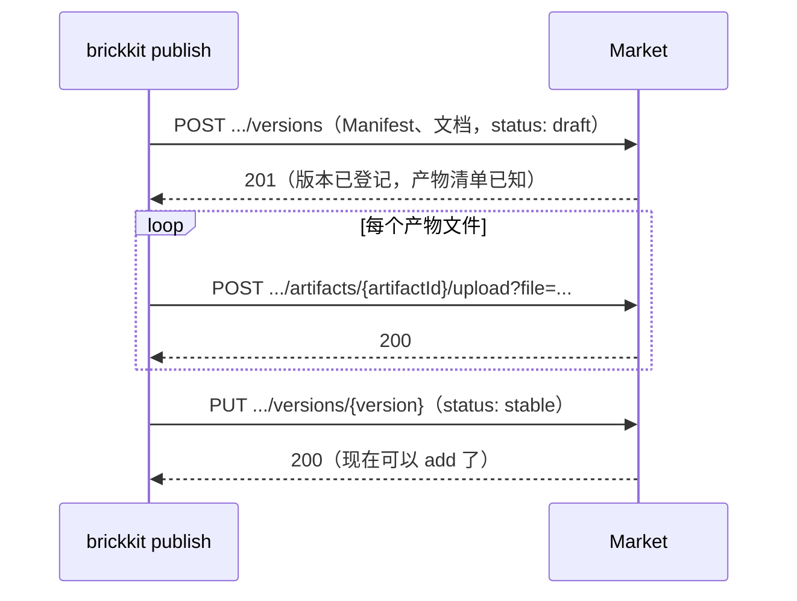

# BrickKit — 第 7 份，共 7 份 (中文)

包含: docs/zh/10-troubleshooting/05-build-issues.md, docs/zh/10-troubleshooting/06-shell-issues.md, docs/zh/10-troubleshooting/07-migration-issues.md, docs/zh/10-troubleshooting/08-lint-and-schema-issues.md, docs/zh/11-reference/README.md, docs/zh/11-reference/01-component-yaml-schema.md, docs/zh/11-reference/02-brickkit-yaml-schema.md, docs/zh/11-reference/03-deploy-yaml-schema.md, docs/zh/11-reference/04-config-schema-spec.md, docs/zh/11-reference/05-json-schemas.md, docs/zh/11-reference/06-market-api.md

下面 File 与包含里的路径都相对仓库根目录 https://raw.githubusercontent.com/brickKit/brickKit/main/ ；页内链接相对这份合集自己

这是最后一份。

---

> File: docs/zh/10-troubleshooting/05-build-issues.md

# 构建问题

`brickkit build` 构建需要在本机构建的镜像；`brickkit up` 从不构建。背景见 [构建与镜像](../../docs/zh/02-project-guide/12-build-and-images.md)。

## 改了代码，跑起来还是旧的

**症状**

改了本地源里一个组件的代码，`brickkit build` 之后 `up`，行为没变。`build` 的输出是：

```text
⏭️  demo/hello@1.1.0：镜像 demo-hello:1.1.0 已存在，跳过（--force 重新构建）
```

**原因**

镜像的 tag 就是组件的版本号。版本号没变，tag 就没变，`build` 认为镜像已经是最新的，跳过了。

**解决**

开发中改了代码、没改版本号时，加 `--force`：

```bash
brickkit build demo/hello@1.1.0 --force
```

然后 `brickkit up`——`up` 看到镜像变了，会重建这个容器。要发布的改动，提版本号（`metadata.version`）再构建，就不需要 `--force`。

## `up` 说镜像还没构建

**症状**

```text
❌ 错误：这些镜像要在本机构建，还没有构建
   demo/hello@1.0.0：demo-hello:1.0.0
   demo/caller@1.0.0：demo-caller:1.0.0
   建议：
   1. up 从不自动构建（构建与部署分离）：先运行 brickkit build
   2. 或者只构建其中一个：brickkit build demo/hello@1.0.0
   3. 或者只构建其中一个：brickkit build demo/caller@1.0.0
```

**原因**

这些组件来自本地源，或者 `component.yaml` 只写了 `deployment.build`、没写 `image`——镜像要在本机构建，而本机还没有。
常见于刚克隆项目、刚 `upgrade` 到新版本、刚用 `add --repo` 把一个组件的源码克隆进 `components/`（之后它由本地源提供，镜像从你的工作区构建，不再拉取作者发布的那个）。

**解决**

`brickkit build`（全部）或按提示只构建其中一个。`up` 不顺手构建，是为了不把你工作区里改到一半的代码悄悄打进镜像跑起来。

## 镜像拉不到

**症状**

`up` 报 `错误：镜像拉取未授权` 或 `错误：镜像不存在`。

**原因**

组件写了 `deployment.image`，镜像在一个你没登录、没权限的仓库里，或者地址写错了、这个 tag 根本没推上去。

**解决**

- 没登录：`docker login <仓库>`。
- 镜像确实不存在：找组件作者确认镜像地址与 tag；组件同时写了 `build` 时，也可以把它的源码克隆进本地源（`add --repo`）改成本机构建。

## Dockerfile 有错

**症状**

`brickkit build` 失败，报错里带着 `docker build` 自己最后的输出。下面是 `COPY` 了一个不存在的文件（节选"输出"的末尾）：

```text
🔨 构建 shop/order@0.1.0 → shop-order:0.1.0
❌ 错误：docker 执行失败
   命令：docker build -t shop-order:0.1.0 -f components/shop/order/Dockerfile --label io.brickkit.build=local --label io.brickkit.component=shop/order --label io.brickkit.version=0.1.0 components/shop/order
   输出：#6 DONE 0.0s
      ……
      Dockerfile:3
      --------------------
      1 |     FROM golang:1.22-alpine AS build
      2 |     WORKDIR /src
      3 | >>> COPY missing.go go.mod *.go ./
      4 |     RUN CGO_ENABLED=0 go build -o /out/order .
      5 |
      --------------------
      ERROR: failed to build: failed to solve: failed to compute cache key: failed to calculate checksum of ref nw5giryoc7te33iudojbosk8l::j0da4oshnnvnwz567z08ob8g4: "/missing.go": not found
   组件：shop/order@0.1.0
```

`>>>` 指着出错的那一行。"命令"一行就是 BrickKit 实际执行的 `docker build`，可以原样复制出来单独跑。

**原因**

构建由 `docker build` 完成，BrickKit 只是按 `component.yaml` 的 `deployment.build` 给它传构建上下文和 Dockerfile 路径。两者都相对**组件仓库根**：
`context` 默认 `.`，`dockerfile` 默认 `Dockerfile`。常见的错：`dockerfile` 写成了相对 `context` 的路径；`COPY` 引用了构建上下文之外的文件。

**解决**

按 `docker build` 的原话修 Dockerfile。想单独复现，在组件仓库根目录执行一次同样的 `docker build`，不经过 BrickKit。

## submodule 目录是空的

**现象**

`build` 在构建之前给出警告，接着构建因为缺文件失败——或者构建成功了，组件却行为异常：

```text
⚠️ 警告：demo/lib@1.0.0 的源码里有 git submodule，这里它们是空目录
   目录：third_party/sdk
   建议：BrickKit 从不拉取 submodule；构建要是需要它们，这个组件应当发布现成的镜像（deployment.image），或者让构建不依赖它们
```

**原因**

BrickKit 从不拉取 git submodule——仓库缓存里不拉，从 tag 导出源码来构建时不拉，`add --repo` 也不拉（见
[bare 仓库机制](../../docs/zh/06-architecture/06-bare-repo-mechanism.md#从不拉取-git-submodule)）。目录在，是空的。

**解决**

- 长久的办法在组件那一侧：发布镜像（`deployment.image`），谁都不用从源码构建它。
- 如果你是从 `components/` 下克隆的仓库构建，自己在里面 `git submodule update --init`；那份工作区正好是这个版本时，`build` 用的就是它。
- 或者让构建不依赖它们。

## 镜像太大

**症状**

镜像几百 MB 甚至上 GB，构建、推送、拉取都慢。

**原因与解决**

与 BrickKit 无关，是 Dockerfile 的写法。常用的几条：

- **多阶段构建**：编译在一个带完整工具链的阶段，最终镜像只拷贝产物。Go 组件的最终镜像可以只有十几 MB。
- **选小的基础镜像**：`alpine`、`*-slim`。
- **`.dockerignore`** 排除 `.git`、`node_modules`、测试数据。

只有一条要留意：组件的健康检查是 `type: http` 时，健康检查命令在容器**里面**执行，镜像里要有 `wget` 或 `curl`。
换成不带任何工具的基础镜像（`scratch`、distroless）之后，容器会一直被判为不健康，而组件自己的日志看起来一切正常。
这种镜像要么保留一个 `wget`（比如基于 `busybox` 或 `alpine`），要么把健康检查改成 `type: tcp`。见 [up / down 常见问题](../../docs/zh/10-troubleshooting/01-up-down-issues.md#组件日志正常平台却说它不健康)。

---

> File: docs/zh/10-troubleshooting/06-shell-issues.md

# 外壳问题

外壳是把几个组件（成员）编进同一个进程的组件。背景见 [外壳机制](../../docs/zh/04-shell/README.md)。

## 外壳启动时解析 `BRICKKIT_SERVED_MEMBERS_CONFIG` 失败

**症状**

外壳容器反复重启，日志里是 JSON 解析错误，比如 `BRICKKIT_SERVED_MEMBERS_CONFIG: invalid character …`。

**原因**

平台生成的这份 JSON 总是合法的：成员配置的值在生成时就求出来、按 JSON 规则编码，Docker 下再把 `$` 写成 `$$`，Compose 不会再动它
（见 [特殊字符](../../docs/zh/04-shell/06-special-characters.md)）。所以解析失败几乎都是 JSON **不是平台生成的**那一份：

- 外壳以手动启动的进程运行，JSON 是你自己拼的，里面的引号、换行、`$` 没转义好。
- 有人手改了 `.brickkit/generated/` 下的文件，或者把 JSON 值复制进了 shell 命令行，被 shell 自己展开了一次。
- 外壳代码读的不是这个变量，或者读到的是另一个同名变量。

**解决**

用平台生成的那份：`brickkit up --dry-run`，外壳的 JSON 在 `.brickkit/generated/env/<外壳服务名>.env` 里（K8s 下在生成的 Secret 里）。
手动启动外壳时，用 `set -a && source <那个 env 文件> && set +a` 加载，不要把 JSON 贴进命令行。

## 成员的配置值装不进 JSON

**症状**

```text
❌ 错误：外壳成员 shop/stock@0.1.0 的配置项 STOCK_WAREHOUSE 不是合法的 UTF-8 文本
   原因：JSON 只能装文本；二进制字节会被悄悄替换掉
   建议：二进制内容请先 base64 编码，由组件自己解码
```

**原因**

成员的配置要装进一个 JSON 字符串，而 JSON 只能装文本。一个 `file://` 指向了二进制文件（证书的 DER 格式、一个压缩包），编码时非法字节会被悄悄换掉，
成员拿到的值就被改过了。平台在生成时就拦下，而不是让它带着坏值跑。

**解决**

把二进制内容先 base64 编码存成文本文件，在成员代码里解码。证书用 PEM（文本）格式就不需要这一步。

## 成员读不到自己的配置

**症状**

外壳里的某个模块表现得像没有配置：用了默认值，或者报"缺少某某配置"。同一个组件独立运行时一切正常。

**原因**

独立运行时，成员的配置是它容器里的环境变量；在外壳里，所有成员共用外壳一个进程，成员的配置**不在进程环境里**，而是在
`BRICKKIT_SERVED_MEMBERS_CONFIG` 里属于它的那一项的 `config` 下。模块代码如果直接读 `os.Getenv("STOCK_WAREHOUSE")`，在外壳里就读不到。

**解决**

外壳初始化每个模块时，把那一项的 `config` 交给它，模块从这份 map 里读配置，而不是读进程环境（见 [开发一个外壳](../../docs/zh/04-shell/05-shell-development.md)）。
一个组件要同时能独立运行、又能被编进外壳，最省事的写法是：配置读取抽成一个函数，独立运行时传进程环境，在外壳里传那一项的 `config`。

成员的**必填**配置没有值时，`up` 在生成前就会拦下（`错误：必填的组件配置没有值`），和独立运行时一样——那个情况不属于这一节。

## 调用外壳里的成员：连接被拒绝或 404

**症状**

别的组件调用外壳里的某个成员，网络是通的（DNS 能解析、外壳容器在跑），但请求被拒绝（connection refused），或者返回 404。

**原因**

平台只负责让请求**到达外壳的正确端口**：调用方拿到的地址是 `http://<外壳服务名>:<成员的端口>`，成员自己的服务名也解析到外壳容器。
请求到了外壳之后交给哪个模块，是外壳代码的事。常见的几种错：

- 外壳没有在这个成员的 `httpPort` 上监听（connection refused）。比如外壳只开了自己的端口，想按路径把请求分给各模块，却没在成员端口上监听。
- 外壳在成员端口上监听了，但交给了错的模块，或者模块的路由前缀和调用方用的不一样（404）。
- 外壳遇到一个它没编进的成员时悄悄跳过了，调用方拿到的地址背后什么都没有。

**解决**

检查外壳的启动代码：对 `BRICKKIT_SERVED_MEMBERS_CONFIG` 里的每一项，在那一项的 `httpPort`（以及 `extraPorts`）上监听，交给对应的模块；
遇到一个没编进的成员 ID，立刻失败退出，而不是跳过。参考实现见 [开发一个外壳](../../docs/zh/04-shell/05-shell-development.md)。
在外壳容器里直接请求一次（`docker compose -p brickkit-<项目> exec <外壳服务名> wget -qO- http://localhost:<成员端口>/<路径>`），
能分清问题在"请求没到外壳"还是"外壳里没接住"。

## 外壳承载的成员版本与它编进的版本对不上

**症状**

```text
❌ 错误：这次外壳承载的成员版本，与外壳 component.yaml 里编进的版本对不上
   文件：deploy.yaml
   components[0].members[0]：外壳 shop/shell@0.1.0 编进的是 shop/stock@0.1.0，这次承载的却是 shop/stock@0.2.0
```

**原因**

外壳的镜像里编进的是成员的某个具体版本的代码，由外壳 `component.yaml` 的 `shell.members` 声明。部署文件让它承载另一个版本，
外壳里跑的就不是你以为的那份代码。通常是手改部署文件、或只升级了成员没升级外壳造成的。

**解决**

报错下面给了三条出路：升级外壳到编进了新版本的那个版本；把成员挪出外壳独立运行；或者外壳里继续承载旧版本、新版本独立运行。
每条怎么改，见 [外壳升级](../../docs/zh/04-shell/07-shell-upgrade.md#版本对不上时的三条出路)。

## 外壳镜像是旧的

**症状**

```text
❌ 错误：外壳 shop/shell@0.1.0 的本机镜像编进的成员版本，与它的 component.yaml 不一致
   镜像：shop-shell:0.1.0
   镜像里的成员：shop/cart@0.1.0,shop/stock@0.1.0
   component.yaml 声明的成员：shop/cart@0.1.0,shop/stock@0.2.0
   建议：重新构建外壳镜像：brickkit build shop/shell@0.1.0 --force
```

**原因**

改了外壳的 `shell.members`，却没有重新构建镜像。镜像 tag 只跟外壳的版本号走，版本号没变，`build` 默认认为镜像已是最新。

**解决**

`brickkit build <外壳>@<版本> --force`。更好的做法：外壳编进的成员变了，就提外壳的版本号——已发布的版本，`component.yaml`、tag、镜像三者天然一致。

## 放进外壳之后起不来：启动等待环

**症状**

```text
❌ 错误：把成员放进外壳 shop/shell@0.1.0 之后，外壳要等一个组件，而那个组件又在等外壳
```

**原因**

组件之间没有环，但外壳作为一个整体启动：它继承了每个成员的依赖，依赖成员的组件也就依赖外壳。于是外壳要等一个外面的组件，那个组件又要等外壳。

**解决**

报错给出三条出路：把夹在中间的组件也放进外壳，或把一个成员移出来；把其中一条依赖改成弱依赖；或者用 `skipWaitFor` 去掉一处等待、由成员自己重试。
见 [成员管理](../../docs/zh/04-shell/04-members-management.md#合并造成的启动环与-skipwaitfor)。

---

> File: docs/zh/10-troubleshooting/07-migration-issues.md

# 迁移问题

组件声明了 `migration.command` 时，平台在主服务启动之前用组件自己的镜像跑一次迁移：Docker 下是一个一次性容器，Kubernetes 下是一个 Job。
迁移失败，主服务不启动。背景见 [迁移容器](../../docs/zh/05-migration/01-migration-service.md)。

## 迁移失败

**症状**

```text
❌ 错误：数据库迁移失败
   组件：demo/caller@1.0.0
   看日志：docker compose -p brickkit-my-shop logs demo-caller-1-0-0-migration
   建议：
   1. 迁移失败时主服务不会启动：它要等迁移成功结束
   2. 修好之后重新 brickkit up：迁移容器会再跑一次
```

**原因**

迁移命令以非零退出码结束。原因在迁移自己的日志里：连不上数据库、SQL 写错了、库不存在、用户没有建表权限。

**解决**

1. 执行报错里"看日志"那一行，读迁移自己说了什么。
2. 修好（代码、配置、数据库权限），重新 `brickkit up`。迁移容器每次 `up` 都会再跑一次。

所以**迁移必须是幂等的**：已经做过的变更再跑一遍什么都不做。常见做法是一张迁移记录表，记下已经执行过哪些步骤。

## 迁移一直不结束

**症状**

- Docker：`up` 一直不返回，迁移容器在 `running`，主服务停在 `Created`。
- Kubernetes：`up` 等了十分钟之后报 `错误：数据库迁移失败`，下面列着 `kubectl describe job/…` 与 `kubectl logs job/…` 两条命令。

**原因**

- **入口程序把迁移参数当成了"启动服务"。** 迁移容器与主服务是同一个镜像，只是参数不同；入口遇到不认识的参数时没有报错退出、而是启动了服务，
  迁移容器就永远不结束。它的日志甚至会说"服务已就绪"。见 [up / down 常见问题](../../docs/zh/10-troubleshooting/01-up-down-issues.md#up-卡住不动迁移容器一直在跑)。
- **迁移在等一把锁。** 另一个进程（上一次没退出干净的迁移、一个手工开着的数据库会话）持有表锁或迁移工具自己的锁。
- **迁移本身就是很慢。** 给一张大表加索引、回填数据。Docker 下 `up` 会一直等；Kubernetes 下 `up` 最多等十分钟，超过就当失败。
- **Kubernetes 下 Pod 根本没被创建。** Job 提交成功了，但准入控制（PodSecurity、ResourceQuota、LimitRange）拒绝了它的 Pod，这时日志是空的。
  报错里特意写了：先看事件、再看日志。

**解决**

- 先看迁移的日志，确认它是在干活、在等锁，还是其实启动成了服务。
- 在等锁：找出持有锁的会话，结束它。
- 太慢：把耗时的数据变更从启动路径上挪走——结构变更留在迁移里，大批量回填改成组件启动后在后台做，或者作为一次单独的运维操作。
- Kubernetes 下日志为空：`kubectl describe job/<名字> -n <命名空间>`，看事件里是谁拒绝了 Pod。

## 调试的组件报"表不存在"

**症状**

用 `mode: debug` 或 `mode: local` 在本机跑的组件，一启动就报表不存在。`up` 的输出里有：

```text
⚠️ 提示：mode: local 组件的数据库迁移不会自动执行
```

**原因与解决**

以本机进程运行的组件没有容器，迁移容器也一并跳过。自己跑一次：加载 `local-debug.<服务名>.env` 里的变量，在本机执行组件的迁移命令。
见 [本地调试问题](../../docs/zh/10-troubleshooting/02-local-debug-issues.md#本机进程报-relation-does-not-exist)。

## 同一个组件的两个版本，迁移顺序不对

**症状**

同一个组件的两个版本同时在项目里（一个是默认版本，一个是因为别的组件还依赖而留下的兼容版本），其中一个版本的迁移失败，
报的是表结构不符：列已经存在、列不存在、约束冲突。

**原因**

两个版本通常连同一个库。平台把它们的迁移**按版本号串成一条链**：低版本的先跑完，高版本的才开始，绝不同时改结构
（见 [多版本的迁移顺序](../../docs/zh/05-migration/03-multi-version-chain.md)）。但顺序只管"这一次谁先跑"，管不了库里已经是什么样：

- 新版本的迁移在之前某次 `up` 里已经跑过，这次低版本的迁移又跑一遍——它面对的是被新版本改过的结构。
- 两个版本的迁移都以为某张表归自己管，互相改对方的列。

**解决**

这是组件作者的事，平台无从判断两个版本的结构兼不兼容：

- 迁移只做"加法"：加列、加表，不删、不改旧版本还在用的结构；等旧版本退役后再清理。
- 每一步迁移都幂等：执行前检查是否已经做过，而不是假设库是空的或者停在上一个版本。
- 迁移记录表按"步骤"记，而不是按"版本号"记：低版本再跑一遍时，它的每一步都已在表里，什么都不做。

## 几个组件共用一个库，迁移互相覆盖

**症状**

两个组件连同一个库。一个组件的迁移跑完之后，另一个组件的迁移"以为自己已经跑过"而跳过了，或者反过来重跑了已经做过的步骤。

**原因**

两个组件用了同一张迁移记录表（很多迁移工具的默认表名是一样的），而表的主键只有步骤号，没有组件标识——两边的记录互相覆盖。
平台不串不同组件的迁移：它们各自的链并行跑，各管各的表。

**解决**

迁移记录表的主键带上组件标识，或者每个组件用自己名字的记录表、自己的 schema。更彻底的做法是每个组件一个库（库名是组件的一个配置项），
这也是组件之间互不越界的最直接的保证。

## 连接串拼错了

**症状**

迁移（或者组件本身）连不上数据库，报的是地址或认证方面的错误，而数据库本身好好的。

**原因与解决**，常见的几种：

**`$var:` 只能是整个值。** 想把公共变量拼进一个字符串：

```yaml
# config/demo-caller.yaml
DATABASE_HOST: $var:PG_HOST:5432
```

```text
❌ 错误：demo-caller.yaml 校验失败
   文件：config/demo-caller.yaml
   DATABASE_HOST："$var:PG_HOST:5432" 不是合法的 $var: 引用；写成 $var:NAME，NAME 由字母、数字、下划线组成
```

`$var:` 必须是整个值，不能嵌进字符串。

**`${…}` 引用的是环境变量，不是公共变量。** 写成 `postgres://app@${PG_HOST}:5432/shop`，而 `PG_HOST` 只定义在 `config/vars.yaml` 里——
`${PG_HOST}` 查的是进程环境与 `.env`，找不到，生成时就停下：

```text
❌ 错误：config/ 或部署文件里引用的环境变量没有定义
   缺少的变量：PG_HOST
```

**最稳的做法：不让使用方拼连接串。** 组件在 `configSchema` 里把主机、端口、库名、用户、口令分成几项，自己在代码里组装：

```yaml
# config/demo-caller.yaml
DB_HOST: $var:PG_HOST
DB_PORT: $var:PG_PORT
DB_NAME: shop
DB_USER: app
DB_PASSWORD: ${PG_PASSWORD}
```

这样每一项都能单独引用公共变量或环境变量，口令也能单独标成密钥。还有一个好处：口令里有 `@`、`:`、`/` 这类字符时，拼进 URL 会把 URL 拆坏，
需要 URL 编码；分开传给数据库驱动则不需要。怎么设计配置项见 [configSchema 设计准则](../../docs/zh/03-component-guide/03-config-schema-design.md)。

**迁移与主服务拿到的是同一组环境变量。** 主服务连得上、迁移连不上，多半是迁移代码读的变量名与主服务不同，而不是平台给了不同的值——
对照 `.brickkit/generated/compose.yaml` 里迁移服务的 `environment` 与主服务的，两者是一样的。

---

> File: docs/zh/10-troubleshooting/08-lint-and-schema-issues.md

# lint 与 Schema 问题

三道检查一层比一层查得多：编辑器里的 JSON Schema 只看单个文件的结构；`brickkit lint` 再查字段组合与三层文件之间对不对得上；
`brickkit up --dry-run` 再解析完整的依赖图。三者结论不一致时，多半是因为它们查的范围不同，而不是哪一个错了。

## `lint` 报错，`up` 却正常

**症状**

`brickkit up` 跑得好好的，`brickkit lint` 却报错，比如：

```text
❌ 错误：deploy.local.yaml 已过期，与 brickkit.yaml 的组件对不上
   文件：deploy.local.yaml
   缺少条目：demo/bus
   原因：brickkit.yaml 变了，你的 deploy.local.yaml 没有同步。本地模式现在关着，命令不读它；但下次 brickkit local on 就会读到它
   建议：
   1. 方案 A（推荐）：brickkit local refresh 按 deploy.yaml 重新生成 deploy.local.yaml，旧文件备份为 deploy.local.yaml.bak
   2. 方案 B：在 deploy.local.yaml 里手动增删下面列出的条目
   3. 方案 C：不再需要它，就删掉 deploy.local.yaml（它不会被提交）
```

**原因**

`lint` 查的东西比这一次 `up` 用到的多：

| `lint` 查、这次 `up` 不一定读的 | 为什么 |
| --- | --- |
| `deploy.local.yaml`——**不管本地模式开没开** | 本地模式关着时 `up` 不读它；但你随时可能 `local on`，到那时它必须与 `brickkit.yaml` 一致。团队加了组件、你的个人文件没跟上，就会在这里报出来 |
| 本地源里**每一份** `component.yaml`，不管有没有 `add` 过 | 还没加进项目的组件，`up` 不会读；`lint` 让它在被使用之前就是对的 |
| `--strict` 下：`${VAR}` 在进程环境与 `.env` 里有没有值、`file://` 指向的文件在不在 | Docker 下 `${VAR}` 由 `docker compose` 在启动时才展开，`up` 本身不检查它 |

**解决**

按报错改。个人文件过期：`brickkit local refresh`（本地模式关着时也能用；旧文件备份，列出你以前的本地修改）；不再需要它，删掉即可。
只想检查某一份部署文件：`brickkit lint -f deploy.prod.yaml`。

## `lint` 通过，`up --dry-run` 却报错

**症状**

`lint` 全绿，`up --dry-run` 报 `强依赖缺失`、外壳承载的版本对不上，或者组件找不到。

**原因**

这是有意的分工。`lint` 承诺离线、只读、立即返回，所以它**不解析依赖图**：要解析，就得拿到每个组件的 `component.yaml`，
对 Git 或市场上的组件来说就是联网。依赖在不在、外壳这次承载的成员版本对不对，都要在依赖图上才能判断。

**解决**

在 CI 里两步都跑：`lint --strict` 挡结构问题，`up --dry-run` 挡依赖问题（它要能访问安装源，但不需要能访问集群）。见 [离线检查](../../docs/zh/02-project-guide/10-lint-and-checks.md#放进-ci)。

## 编辑器没标红，`lint` 却报错

**原因**

JSON Schema 只描述**单个文件的结构**：字段名、类型、必填、固定取值。下面这些它表达不了，由 `lint` 查：

- 字段之间的组合：`localPort` 要和 `mode: local` / `mode: debug` 一起写；`mode: debug` 只能写在 `deploy.local.yaml`。
- 三层文件之间：每个组件版本在部署文件里恰好一个条目；`$var:` 有定义；`config/` 里的键在组件的 `configSchema` 里。
- 配置项撞上平台保留的名字。

**解决**

按 `lint` 的报错改。编辑器不红只说明单个文件的结构是对的。

## 编辑器标红，`lint` 却通过

**症状与原因**，常见的两种：

- **`config/` 里的冲突块被标成重复键。** 这是正常的：BrickKit 故意用重复键表示升级留下的冲突。不过这种情况下 `lint` 也会报错（冲突未解决），
  见 [配置冲突问题](../../docs/zh/10-troubleshooting/03-config-conflict-issues.md)。
- **编辑器用的 schema 与你的 CLI 版本不一致。** 按文档接的是 `main` 分支上的 schema，它可能比你装的 CLI 新（多了字段）或旧（少了字段）。
  以 CLI 为准：`lint` 通过就是 CLI 接受的。

**解决**

把 schema 的 URL 从 `main` 换成你所用 CLI 版本的 tag，或者指向仓库里 `schemas/` 下与 CLI 同版本的本地副本。接法见 [JSON Schema](../../docs/zh/11-reference/05-json-schemas.md)。

## 编辑器完全没有补全和校验

**原因**

- 没装 YAML 语言服务（VS Code 的 Red Hat YAML 扩展、JetBrains 自带、Neovim 的 yaml-language-server）。
- 文件名没对上映射：设置里映射的是 `deploy.yaml`，而你打开的是 `deploy.prod.yaml`。
- `config/*.yaml` 本来就没有 schema：每个组件的配置项不同，由它自己的 `configSchema` 决定，只有 `lint` 按它检查键名。

**解决**

按 [JSON Schema](../../docs/zh/11-reference/05-json-schemas.md) 的方法二，用 `["deploy.yaml", "deploy.*.yaml"]` 这样的通配把所有部署文件都映射上。

---

> File: docs/zh/11-reference/README.md

# 参考手册

精确的规格：每个字段的类型、是否必填、缺省值、校验器真正套用的规则。适合查一个具体问题，不适合从头读。

和 [字段速查](../../docs/zh/01-three-layers/09-field-reference.md) 的区别：速查一页看完全部字段、每个一句话；这里每个字段都写全规则，而且与代码里的结构逐条对应——
结构体多一个字段、文档漏写一行，测试就会失败。

| 篇目 | 讲什么 |
| --- | --- |
| [01 component.yaml](../../docs/zh/11-reference/01-component-yaml-schema.md) | 组件 Manifest 的每个字段 |
| [02 brickkit.yaml](../../docs/zh/11-reference/02-brickkit-yaml-schema.md) | 项目声明的每个字段 |
| [03 部署文件](../../docs/zh/11-reference/03-deploy-yaml-schema.md) | `deploy.yaml` / `deploy.local.yaml` / `deploy.<环境>.yaml` 的每个字段 |
| [04 configSchema 规格](../../docs/zh/11-reference/04-config-schema-spec.md) | 配置说明书的写法；平台检查键名、不检查值 |
| [05 JSON Schema](../../docs/zh/11-reference/05-json-schemas.md) | `schemas/` 下的三份 JSON Schema，怎么接进编辑器 |
| [06 Market API](../../docs/zh/11-reference/06-market-api.md) | 组件市场的 HTTP 接口（可选的基础设施） |

---

> File: docs/zh/11-reference/01-component-yaml-schema.md

# component.yaml 字段参考

组件的 Manifest 的每一个字段：类型、是否必填、缺省值、校验器真正套用的规则。怎么写好每一块，见 [component.yaml 字段指南](../../docs/zh/03-component-guide/02-component-yaml-reference.md)。

文件里只能写这里列出的字段：写了不认识的字段，当场报错并提示是不是拼错了。没有扩展字段的机制。

## 顶层

| 字段 | 类型 | 必填 | 规则 |
| --- | --- | --- | --- |
| `apiVersion` | 字符串 | ✅ | 只能是 `brickkit/v1` |
| `kind` | 字符串 | ✅ | 只能是 `Component` |
| `tags` | 字符串列表 | | 检索用的标签，平台不解释 |

## metadata

| 字段 | 类型 | 必填 | 规则 |
| --- | --- | --- | --- |
| `metadata.id` | 字符串 | ✅ | `<scope>/<name>`；每段是小写字母、数字、中划线，以字母或数字开头结尾（`^[a-z0-9]([a-z0-9-]*[a-z0-9])?/[a-z0-9]([a-z0-9-]*[a-z0-9])?$`）；最长 63 个字符（版本化服务名要符合 DNS 标签规则） |
| `metadata.name` | 字符串 | ✅ | 给人看的名字 |
| `metadata.version` | 字符串 | ✅ | 精确版本 `主.次.修订`（`^\d+\.\d+\.\d+$`），不接受 `v` 前缀、范围与 `latest` |
| `metadata.description` | 字符串 | ✅ | 一句话描述 |
| `metadata.vendor` | 字符串 | | 发布者 |
| `metadata.license` | 字符串 | | 许可证 |
| `metadata.apiDocs` | 字符串 | | API 文档地址 |

## artifacts

契约与其它随组件发布的文件。每一项：

| 字段 | 类型 | 必填 | 规则 |
| --- | --- | --- | --- |
| `artifacts[].type` | 字符串 | ✅ | 自由字符串，平台不解释（如 `api-contract`） |
| `artifacts[].files` | 字符串列表 | ✅ | 至少一个；相对仓库根的路径，不能是绝对路径、不能用 `..` 走出仓库 |
| `artifacts[].format` | 字符串 | | 自由字符串（如 `openapi`、`protobuf`） |
| `artifacts[].description` | 字符串 | | 给人看的说明 |

## dependencies

| 字段 | 类型 | 必填 | 规则 |
| --- | --- | --- | --- |
| `dependencies.components[].id` | 字符串 | ✅ | `<组件ID>@<精确版本>`。也可以整项直接写成这个字符串（强依赖的简写） |
| `dependencies.components[].optional` | 布尔 | | `true` 为弱依赖；缺省为强依赖 |

两种写法：

```yaml
dependencies:
  components:
    - demo/hello@1.1.0
    - id: demo/bus@1.0.0
      optional: true
```

规则：版本必须是精确版本；不能依赖自己；同一个组件 ID 只能出现一次（地址变量名不带版本，两个版本会撞在同一个变量上）。

## configSchema

| 字段 | 类型 | 必填 | 规则 |
| --- | --- | --- | --- |
| `configSchema.type` | 字符串 | | 写的话是 `object` |
| `configSchema.required` | 字符串列表 | | 每一项必须在 `properties` 里声明过 |
| `configSchema.properties.<key>.type` | 字符串 | ✅ | `string` / `integer` / `number` / `boolean` / `array` / `object` |
| `configSchema.properties.<key>.default` | 任意 | | 缺省值；列表与映射注入时编码成一行 JSON |
| `configSchema.properties.<key>.description` | 字符串 | | 出现在使用方配置骨架的行尾 |
| `configSchema.properties.<key>.secret` | 布尔 | | `true` 时这一项按密钥处理（Docker 进 0600 的 env 文件，K8s 进 Secret） |
| `configSchema.properties.<key>.enum` | 列表 | | 允许的取值——**只是说明，平台不检查值** |
| `configSchema.properties.<key>.minimum` | 数字 | | 同上 |
| `configSchema.properties.<key>.maximum` | 数字 | | 同上 |
| `configSchema.properties.<key>.pattern` | 字符串 | | 同上 |
| `configSchema.properties.<key>.items.type` | 字符串 | | `array` 类型的元素类型；同上 |

`<key>` 就是注入的环境变量名：必须是合法的环境变量名（字母、数字、下划线，不以数字开头），原样注入，不做大小写转换。
撞上平台保留的名字（`COMPONENT_ID`、`COMPONENT_VERSION`、`PORT`、`BRICKKIT_SERVED_MEMBERS`、`BRICKKIT_SERVED_MEMBERS_CONFIG`、`*_ENDPOINT`）时：
`up` / `lint` 警告并忽略这一项，市场拒收。平台只检查键名、不检查值，详见 [configSchema 规格](../../docs/zh/11-reference/04-config-schema-spec.md)。

## deployment

| 字段 | 类型 | 必填 | 规则 |
| --- | --- | --- | --- |
| `deployment.type` | 字符串 | ✅ | 只能是 `container` |
| `deployment.image` | 字符串 | 二选一 | 预构建镜像；不带 tag 时补上 `metadata.version` |
| `deployment.build.context` | 字符串 | 二选一 | 构建上下文，相对仓库根，缺省 `.` |
| `deployment.build.dockerfile` | 字符串 | | Dockerfile 路径，相对仓库根，缺省 `Dockerfile` |
| `deployment.port` | 整数 | ✅ | 主端口，1–65535 |
| `deployment.extraPorts[].name` | 字符串 | ✅ | 小写字母、数字、中划线，最长 15 个字符（K8s Service 端口名规则）；不能重复 |
| `deployment.extraPorts[].port` | 整数 | ✅ | 1–65535，不能与主端口相同 |
| `deployment.resources.requests.cpu` | 字符串 | | 建议的 CPU 请求，如 `"100m"` |
| `deployment.resources.requests.memory` | 字符串 | | 建议的内存请求，如 `"128Mi"` |
| `deployment.resources.limits.cpu` | 字符串 | | 建议的 CPU 上限（建议不写） |
| `deployment.resources.limits.memory` | 字符串 | | 建议的内存上限 |
| `deployment.labels` | 字符串映射 | | 原样透传：Docker 写成 service labels，K8s 写成 Pod annotations；值必须是字符串 |

`image` 与 `build` 至少写一个；`build` 的路径必须在仓库里。`resources` 写了的话，`requests` 或 `limits` 里至少要有 `cpu` 或 `memory` 之一；
这里的值是作者的建议，使用方在部署文件的条目上逐字段覆盖。只有 `requests` 有平台缺省值（`100m` / `128Mi`），`limits` 没有缺省值。

## migration

| 字段 | 类型 | 必填 | 规则 |
| --- | --- | --- | --- |
| `migration.command` | 字符串列表 | ✅（写了 `migration` 时） | 迁移命令，数组形式；用同一个镜像执行 |

## healthCheck

| 字段 | 类型 | 必填 | 规则 |
| --- | --- | --- | --- |
| `healthCheck.type` | 字符串 | ✅ | `http` / `tcp` / `none` |
| `healthCheck.path` | 字符串 | `http` 时必填 | 以 `/` 开头 |
| `healthCheck.startPeriodSeconds` | 整数 | | 启动宽限期，单位秒，缺省 60，最大 3600；`type: none` 时不能写 |

检查间隔 10 秒、超时 3 秒、连续 3 次失败算不健康，由平台固定，不可配置。

## shell

| 字段 | 类型 | 必填 | 规则 |
| --- | --- | --- | --- |
| `shell.members` | 字符串列表 | ✅（写了 `shell` 时） | 外壳编进的成员，每项 `<组件ID>@<精确版本>`；至少一项；不能是自己；同一个组件只能列一个版本 |

写了 `shell`，这个组件就是外壳；项目的 `brickkit.yaml` 里它的条目必须带 `kind: shell`。见 [外壳声明](../../docs/zh/04-shell/03-shell-declaration.md)。

## local

组件以 `mode: local` 运行时，BrickKit 怎么启动它。多数情况下不用写：从源码目录里的标记文件自动认出。

| 字段 | 类型 | 必填 | 规则 |
| --- | --- | --- | --- |
| `local.language` | 字符串 | | `go` / `rust` / `dotnet` / `node` / `java` / `python` / `ruby`；同一目录里有好几种语言的标记文件时用它指明 |
| `local.runCommand` | 字符串列表 | | 直接给出启动命令；第一项含路径分隔符时相对组件目录 |

---

> File: docs/zh/11-reference/02-brickkit-yaml-schema.md

# brickkit.yaml 字段参考

项目用哪些组件、各是哪个精确版本、从哪里取。它是项目的锁文件。怎么用，见 [brickkit.yaml](../../docs/zh/01-three-layers/02-brickkit-yaml.md)。

写了不认识的字段当场报错。部署方式（`mode`、`expose`……）不写在这里，写在部署文件里。

## 顶层

| 字段 | 类型 | 必填 | 规则 |
| --- | --- | --- | --- |
| `project` | 字符串 | ✅ | 小写字母、数字、中划线，以字母或数字开头结尾（`^[a-z0-9]([a-z0-9-]*[a-z0-9])?$`）；最长 54 个字符（K8s 命名空间最长 63，减去 CLI 加的 `brickkit-` 前缀）。它成为 Docker 网络、Compose 项目与 K8s 命名空间的名字 |

## sources

安装源：去哪里找组件。按声明顺序依次尝试，第一个有这个组件的源说了算。

| 字段 | 类型 | 必填 | 规则 |
| --- | --- | --- | --- |
| `sources[].name` | 字符串 | ✅ | 安装源的名字，在这份文件里唯一 |
| `sources[].type` | 字符串 | ✅ | `git` / `local` / `market` |
| `sources[].baseUrl` | 字符串 | `git` 必填 | 组件 `<scope>/<name>` 的仓库是 `<baseUrl>/<scope>-<name>`（`baseUrl` 末尾的 `/` 可写可不写，CLI 只补一个）；不能以 `-` 开头 |
| `sources[].path` | 字符串 | `local` 必填 | 本机目录，相对项目根；里面按 `<scope>/<name>/component.yaml` 摆放 |
| `sources[].url` | 字符串 | `market` 必填 | 组件市场的 API 地址 |
| `sources[].authToken` | 字符串 | | 市场令牌，通常写 `${VAR}`；已 `brickkit login` 时优先用登录凭据 |
| `sources[].enabled` | 布尔 | | 缺省 `true`；`false` 时这个源不参与查找 |

## components

每个组件版本一个条目。

| 字段 | 类型 | 必填 | 规则 |
| --- | --- | --- | --- |
| `components[].id` | 字符串 | ✅ | 组件 ID，规则同 `component.yaml` 的 `metadata.id` |
| `components[].version` | 字符串 | ✅ | 精确版本。本地源的组件也写 `component.yaml` 里的真实版本 |
| `components[].kind` | 字符串 | | 只能是 `shell` 或不写；由 CLI 在 `add` 外壳时写上，必须与组件的 `shell` 块一致；同一个组件 ID 的所有版本一致 |
| `components[].requiredBy` | 字符串列表 | | 这个版本因哪些组件依赖而留下（兼容版本）；每一项必须是这份文件里的组件 ID，不能是自己 |
| `components[].source.type` | 字符串 | ✅（写了 `source` 时） | `git` / `local` |
| `components[].source.repo` | 字符串 | `git` 必填 | 这个组件的仓库地址（推导不出来、或在别的组织时） |
| `components[].source.path` | 字符串 | `local` 必填 | `local`：组件目录，相对项目根；`git`：组件在仓库里的子目录（monorepo），不能是绝对路径、不能走出仓库 |

版本之间的规则：

- 同一个组件版本只能出现一次。
- 同一个组件 ID 有几个版本时，**恰好一个**不写 `requiredBy`——它是默认版本；其余都写 `requiredBy`。
- 外壳在一个项目里只能有一个版本，也就不能写 `requiredBy`。
- 同一个组件的几行，`source` 必须写得一样（一个组件只有一个仓库）。

## installer

组件市场签名的校验设置。只对来自市场的组件生效。

| 字段 | 类型 | 必填 | 规则 |
| --- | --- | --- | --- |
| `installer.requireSignature` | 布尔 | | 缺省 `true`：没有签名的市场组件不安装 |
| `installer.publicKeys` | 字符串映射 | | 信任的发布者公钥：公钥名（签名里的 `publicKeyRef`）→ 公钥文件路径（相对项目根）。**一把都没配时签名校验完全关闭** |

见 [安全与签名](../../docs/zh/06-architecture/08-security-and-signing.md)。

---

> File: docs/zh/11-reference/03-deploy-yaml-schema.md

# 部署文件字段参考

`deploy.yaml`、`deploy.local.yaml`、`deploy.<环境>.yaml` 是同一种结构。怎么用，见 [deploy.yaml](../../docs/zh/01-three-layers/03-deploy-yaml.md) 与 [deploy.local.yaml](../../docs/zh/01-three-layers/04-deploy-local-yaml.md)。

写了不认识的字段当场报错。只对另一种部署目标有用的字段不报错，会警告"在 target: … 下不起作用，已忽略"——换目标时它们生效。

## 顶层

| 字段 | 类型 | 必填 | 规则 |
| --- | --- | --- | --- |
| `target` | 字符串 | ✅ | `docker` / `podman` / `k8s` |
| `focus` | 字符串 | | 只能写在 `deploy.local.yaml` 里：一个组件 ID。只有这个组件和它需要的组件启动，它从源码跑（按 `mode: local`，写了 `mode: debug` 就按 debug）；`target: k8s` 下不能用。见[在项目里就地开发](../../docs/zh/02-project-guide/04-focus-run.md) |
| `vars` | 映射 | | 覆盖 `config/vars.yaml` 里的同名公共变量，只影响 `$var:` 的查找；键必须是合法的环境变量名 |

## k8s

项目级的 Kubernetes 设置。`target` 不是 `k8s` 时写了会被警告、忽略。

| 字段 | 类型 | 必填 | 规则 |
| --- | --- | --- | --- |
| `k8s.context` | 字符串 | | 部署到哪个 kubeconfig 上下文。写了之后，真正部署前 `up` 确认 `kubectl` 当前连着的就是它 |
| `k8s.namespace` | 字符串 | | 缺省 `brickkit-<项目名>`；规则同项目名 |
| `k8s.createNamespace` | 布尔 | | 缺省 `true`；只有命名空间级权限时写 `false` |
| `k8s.podSecurity` | 字符串 | | 只能是 `restricted`：给每个容器生成 restricted 级别的 `securityContext` |
| `k8s.imagePullSecrets` | 字符串列表 | | 拉镜像用的 Secret 名 |
| `k8s.ingressClass` | 字符串 | | Ingress 的 class |
| `k8s.ingressAnnotations` | 字符串映射 | | 原样写到每个 Ingress 上 |
| `k8s.serviceAccount.enabled` | 布尔 | | `true` 时每个组件一个 ServiceAccount，不挂载令牌 |
| `k8s.networkPolicy.enabled` | 布尔 | | `true` 时按依赖图为每个组件生成 NetworkPolicy |
| `k8s.networkPolicy.ingressController.namespace` | 字符串 | 见规则 | Ingress 控制器所在的命名空间；开了网络策略、又有 `expose: true` 的组件时必填 |
| `k8s.networkPolicy.ingressController.podSelector` | 字符串映射 | | Ingress 控制器 Pod 的标签 |
| `k8s.networkPolicy.allowFrom[].name` | 字符串 | ✅ | 这条放行给谁（写进注解，日后看得懂为什么开） |
| `k8s.networkPolicy.allowFrom[].namespace` | 字符串 | ✅ | 放行来自哪个命名空间 |
| `k8s.networkPolicy.allowFrom[].podSelector` | 字符串映射 | | 只放行那个命名空间里带这些标签的 Pod |
| `k8s.networkPolicy.allowFrom[].ports` | 整数列表 | | 只放行这些端口（1–65535） |
| `k8s.networkPolicy.egress.enabled` | 布尔 | | `true` 时也生成出站策略：依赖图里的依赖与 DNS 自动放行，其余一律拒绝 |
| `k8s.networkPolicy.egress.allowTo[].name` | 字符串 | ✅ | 这个出站目标是什么（如 `main-db`） |
| `k8s.networkPolicy.egress.allowTo[].namespace` | 字符串 | 二选一 | 集群内的目标：所在命名空间 |
| `k8s.networkPolicy.egress.allowTo[].cidr` | 字符串 | 二选一 | 集群外的目标：地址段；与 `namespace` 只能写一个 |
| `k8s.networkPolicy.egress.allowTo[].podSelector` | 字符串映射 | | 集群内目标 Pod 的标签 |
| `k8s.networkPolicy.egress.allowTo[].ports` | 整数列表 | | 只放行这些端口 |

开出站策略时，数据库这类外部服务要自己写进 `allowTo`：平台只知道依赖图里的组件，不认识 `config/` 里的一串地址。

## components

每个组件版本恰好一个条目，与 `brickkit.yaml` 一一对应（外壳成员的条目嵌在外壳下面，同样算）。

| 字段 | 类型 | 必填 | 规则 |
| --- | --- | --- | --- |
| `components[].id` | 字符串 | ✅ | 裸 ID 指默认版本；`<组件ID>@<版本>` 指那个版本（兼容版本必须这样写） |
| `components[].mode` | 字符串 | | `enabled` / `disable` / `local` / `debug`。不写就跟着上层走。`debug` 只能写在 `deploy.local.yaml`；`local`、`debug` 在 `target: k8s` 下不允许 |
| `components[].localPort` | 整数 | | 本机进程监听的端口，1–65535；只在 `mode: local` / `mode: debug` 下能写；不能与别的条目冲突。`mode: local` 不写时自动选一个 |
| `components[].expose` | 布尔 | | 对外开放：Docker 映射宿主机端口，K8s 生成 Ingress |
| `components[].exposePort` | 整数 | | Docker 下映射到的宿主机端口，缺省等于组件端口；只在 `expose: true` 时能写；不能冲突；K8s 下忽略 |
| `components[].hostname` | 字符串 | 见规则 | Ingress 的域名；`target: k8s` 且 `expose: true` 时必填 |
| `components[].tlsSecret` | 字符串 | | Ingress 的 TLS 证书 Secret；只在 `expose: true` 时能写 |
| `components[].replicas` | 整数 | | K8s 副本数，缺省 1，必须 ≥ 1；大于 1 时自动生成 PodDisruptionBudget；不能与 `mode: local` / `debug` 同时写。要关掉组件用 `mode: disable` |
| `components[].serviceAccountName` | 字符串 | | K8s 下用一个已有的 ServiceAccount（平台只引用，不创建） |
| `components[].resources.requests.cpu` | 字符串 | | 覆盖组件建议的配额，逐字段 |
| `components[].resources.requests.memory` | 字符串 | | 同上 |
| `components[].resources.limits.cpu` | 字符串 | | 同上 |
| `components[].resources.limits.memory` | 字符串 | | 同上 |
| `components[].labels` | 字符串映射 | | 逐键覆盖组件 `deployment.labels`，原样透传 |
| `components[].skipWaitFor` | 字符串列表 | | 启动时不等这些强依赖（写不带版本的组件 ID）；必须是这个组件版本真实的强依赖；不能是自己、不能重复。Docker / Podman 容器专用，K8s 与本机进程下忽略 |

配额的优先级：部署文件的 `resources` > 组件 `deployment.resources` > 平台缺省（只有 `requests`：`100m` / `128Mi`）。

### 外壳的成员：`components[].members`

外壳条目下面可以嵌 `members`，每个成员是一个完整的部署条目，字段与上表相同，只嵌一层：

| 字段 | 类型 | 必填 | 规则 |
| --- | --- | --- | --- |
| `components[].members[].id` | 字符串 | ✅ | 裸 ID 或 `id@版本`；不能是外壳自己；一个外壳里一个组件只能有一个版本 |
| `components[].members[].mode` | 字符串 | | 同 `components[].mode`；`debug` / `local` 时这个成员这次以本机进程运行，外壳不承载它 |
| `components[].members[].localPort` | 整数 | | 同上 |
| `components[].members[].skipWaitFor` | 字符串列表 | | 同上 |
| `components[].members[].expose` | 布尔 | | 外壳承载时不生效，外壳不跑时生效 |
| `components[].members[].exposePort` | 整数 | | 同上 |
| `components[].members[].hostname` | 字符串 | | 同上 |
| `components[].members[].tlsSecret` | 字符串 | | 同上 |
| `components[].members[].replicas` | 整数 | | 同上 |
| `components[].members[].serviceAccountName` | 字符串 | | 同上 |
| `components[].members[].labels` | 字符串映射 | | 同上 |
| `components[].members[].resources.requests.cpu` | 字符串 | | 同上 |
| `components[].members[].resources.requests.memory` | 字符串 | | 同上 |
| `components[].members[].resources.limits.cpu` | 字符串 | | 同上 |
| `components[].members[].resources.limits.memory` | 字符串 | | 同上 |

只有外壳（`brickkit.yaml` 里 `kind: shell`）的条目能写 `members`，放在下面的成员必须是外壳 `component.yaml` 里编进了的组件。见 [成员管理](../../docs/zh/04-shell/04-members-management.md)。

## 只对某种目标生效的字段

| 只在 | 字段 | 在另一种目标下 |
| --- | --- | --- |
| k8s | `k8s` 块、`replicas`、`hostname`、`tlsSecret`、`serviceAccountName` | 警告、忽略 |
| docker、podman | `exposePort`、`skipWaitFor` | 警告、忽略 |
| docker、podman | `mode: local`、`mode: debug` | `k8s` 下报错（集群里的 Pod 到不了你的机器） |

---

> File: docs/zh/11-reference/04-config-schema-spec.md

# configSchema 规格

`configSchema` 是组件 `component.yaml` 里的一块，声明这个组件认哪些配置项。它的写法借用 JSON Schema（draft-07）的一个子集：一个 `type: object`，
`properties` 列出每一项，`required` 列出必填项。设计上怎么拆、怎么命名，见 [configSchema 设计准则](../../docs/zh/03-component-guide/03-config-schema-design.md)。

## 结构

```yaml
configSchema:
  type: object
  properties:
    DB_HOST:
      type: string
      description: PostgreSQL 主机名
    DB_PORT:
      type: integer
      default: 5432
      minimum: 1
      maximum: 65535
      description: PostgreSQL 端口
    DB_PASSWORD:
      type: string
      secret: true
      description: 连接口令
    REGIONS:
      type: array
      items:
        type: string
      default: [cn-east, cn-north]
      description: 服务的区域
  required: [DB_HOST, DB_PASSWORD]
```

| 写法 | 含义 |
| --- | --- |
| `properties` 的键 | 配置项名，也就是注入的环境变量名，原样注入：必须是合法的环境变量名（字母、数字、下划线，不以数字开头） |
| `type` | `string` / `integer` / `number` / `boolean` / `array` / `object` |
| `default` | 没写值时用它；标量注入成字符串，`array` / `object` 注入成一行 JSON |
| `description` | 出现在使用方配置骨架的行尾 |
| `secret: true` | 这一项是密钥：部署时走密钥通道，从不明文写进部署文件 |
| `required` | 必填项；每一项必须在 `properties` 里声明过 |
| `enum`、`minimum`、`maximum`、`pattern`、`items` | 允许的取值——**只是说明** |

每一项字段的精确规则见 [component.yaml 字段参考](../../docs/zh/11-reference/01-component-yaml-schema.md#configschema)。

## 平台只检查键名，不检查值

这是 `configSchema` 最重要的一条规则。

**键名**，平台查：

| 情况 | 结果 |
| --- | --- |
| `config/` 里写了一个 `configSchema` 里没有的键 | 警告"不会生效"，并猜你想写哪个 |
| 组件没有 `configSchema`，`config/` 里却写了配置 | 警告：整份配置都不会生效 |
| `required` 里的项没有 `default`、`config/` 里也没填 | `up` 拒绝启动，点名缺哪一项 |
| 键名撞上平台保留的名字 | `up` / `lint` 警告并忽略这一项；市场拒收 |

**值**，平台不查：`type: integer` 的项填了 `"abc"`、`enum` 之外的值、超出 `maximum` 的数，平台都照常注入。

分界线在于有没有运行时的安全网。值写错了，组件读它的时候就会失败（解析不了、校验不过），你一定会发现，而且怎么处理错值是组件自己的决定。
键名写错了，变量根本不存在，组件走它的缺省分支照常运行——没有任何东西会失败，配置只是悄悄没生效。这类错误只有平台能发现，所以平台只查这一类。

而一旦开始校验值就停不下来：类型、枚举、范围、正则、嵌套结构……JSON Schema 的能力几乎无穷，每多查一样，平台就多替组件做一个决定。

所以组件要自己在启动时校验值：

```go
port, err := strconv.Atoi(os.Getenv("DB_PORT"))
if err != nil || port < 1 || port > 65535 {
	log.Fatalf("DB_PORT must be a port number, got %q", os.Getenv("DB_PORT"))
}
```

## 与 JSON Schema 的关系

写法与 JSON Schema 兼容，但它不是被当作 JSON Schema 去**执行**的：CLI 读的只有 `properties` 的键、`type`、`default`、`required`、`secret`、`description`；
其余关键字原样保存、给人读。某一项里写了这里没列出的关键字（拼错的 `defualt`，或照 JSON Schema 习惯写的 `format`、`examples`、`oneOf`……），
解析时会被丢掉——它们不会生效。作者在自己听得到、改得动的地方会收到警告（`lint`、本地源扫描、`publish`）；安装别人的组件时不因此失败，
因为使用方改不了别人的 Manifest。

## 编辑器

`schemas/component.schema.json` 描述了 `configSchema` 这一块的结构，接进编辑器之后，写 `configSchema` 时有补全、写错关键字（`defualt`）立刻标红。
见 [JSON Schema](../../docs/zh/11-reference/05-json-schemas.md)。`lint` 也会报出 `configSchema` 某一项里拼错的键：

```text
警告：configSchema 里有配置项声明的键不会生效
```

---

> File: docs/zh/11-reference/05-json-schemas.md

# JSON Schema

## `schemas/` 目录

仓库的 `schemas/` 下有三份 JSON Schema（draft-07），描述三种文件的结构：

| 文件 | 描述 |
| --- | --- |
| `schemas/component.schema.json` | 组件的 `component.yaml` |
| `schemas/brickkit.schema.json` | 项目的 `brickkit.yaml` |
| `schemas/deploy.schema.json` | 部署文件：`deploy.yaml`、`deploy.local.yaml`、`deploy.<环境>.yaml` |

它们是从 CLI 的 Go 结构体生成的，不是手写的：结构体改了，重新生成、一起提交；CI 里有检查拦住"改了结构体却忘了重新生成"。
所以 schema 里的字段与 CLI 真正接受的字段逐一对应。

## 接进编辑器

装了 YAML 语言服务的编辑器（VS Code 的 Red Hat YAML 扩展、JetBrains 系列、Neovim 的 yaml-language-server……）接上 schema 之后：
字段名有补全，类型不对、必填字段没写、拼错的字段名立刻标红——与 `brickkit lint` 报的是同一批结构问题，只是在你打字的时候就看到。

**方法一：文件顶部加一行注释。** 对单个文件生效，谁打开都一样：

```yaml
# yaml-language-server: $schema=https://raw.githubusercontent.com/brickKit/brickKit/main/schemas/deploy.schema.json
target: docker
components:
  - id: demo/hello
```

`component.yaml` 用 `component.schema.json`，`brickkit.yaml` 用 `brickkit.schema.json`。

**方法二：编辑器设置里按文件名映射。** VS Code 的 `settings.json`：

```json
{
  "yaml.schemas": {
    "https://raw.githubusercontent.com/brickKit/brickKit/main/schemas/component.schema.json": "component.yaml",
    "https://raw.githubusercontent.com/brickKit/brickKit/main/schemas/brickkit.schema.json": "brickkit.yaml",
    "https://raw.githubusercontent.com/brickKit/brickKit/main/schemas/deploy.schema.json": ["deploy.yaml", "deploy.*.yaml"]
  }
}
```

放进项目的 `.vscode/settings.json`，整个团队打开项目就都有。想固定在某个 CLI 版本上，把 URL 里的 `main` 换成那个版本的 tag，或者指向本地的一份副本。

## 覆盖什么，不覆盖什么

JSON Schema 只描述**单个文件的结构**：字段名、类型、必填、固定的取值（`target` 只能是 `docker` / `podman` / `k8s` 这类）。

不覆盖的，归别的检查：

| 规则 | 谁查 |
| --- | --- |
| 字段之间的组合（`localPort` 要配 `mode`、`exposePort` 要配 `expose`、`mode: debug` 只能在 `deploy.local.yaml`） | `brickkit lint` |
| 配置项撞上平台保留的名字、`configSchema` 某一项里的笔误 | `brickkit lint` |
| 三层文件之间对不对得上（每个组件版本一个部署条目、`$var:` 有定义、`config/` 的键在 `configSchema` 里） | `brickkit lint` |
| 依赖能不能解析、外壳承载的成员版本对不对 | `brickkit up --dry-run` |
| `config/*.yaml` 里的配置值 | 没有 schema：每个组件的配置项不同，由它自己的 `configSchema` 决定，`lint` 按它检查键名 |

编辑器里不红，不等于 `lint` 能过；`lint` 能过，也不等于 `up --dry-run` 能过——三者一层比一层查得多。

---

> File: docs/zh/11-reference/06-market-api.md

# Market API 参考

BrickKit Market（组件市场）的 HTTP 接口。这里列的是**已经实现的端点**，与服务端的路由注册表逐条对应——`market-server` 里有测试守着：这张表多写一个不存在的端点、或者漏写一个存在的端点，测试都会失败。

平常用不着直接调这些接口：`brickkit login`、`publish`、`add`、`fetch` 已经把它们包好了。这篇写给要自己写市场客户端、或者想弄清市场某个行为细节的人。

## 市场是可选的

市场是一种**安装源**，不是 BrickKit 运行所必需的东西。一个项目只用本地源和 git 源，就能装组件、部署、升级：

- **git 源**：组件仓库打上版本 tag 就算发布了。组件在仓库根目录时 tag 就是版本号（`1.2.0`）；组件在仓库的子目录 `<scope>-<name>/` 里时，tag 是 `<scope>-<name>/1.2.0`。`brickkit release` 替你检查工作区并打 tag、推送。
- **本地源**：直接读磁盘上的组件目录，开发时用。

市场在这之上多给了几样 git 做不到、或做起来很别扭的东西：

| 市场提供的 | 为什么 git 源给不了 |
| --- | --- |
| 搜索、按标签浏览 | git 只能按仓库地址取，不知道"有哪些组件" |
| 私有组件与按用户、组织授权 | git 的权限是整个仓库级别的，与组件无关 |
| 闭源分发：只交镜像和接口契约，不交源码 | git 源装组件要读仓库本身 |
| 发布者签名的存放与转交 | git tag 上没有地方挂 BrickKit 的签名 |
| 事后下架（`blocked`）：已发布的坏版本不能再被安装 | 删掉 git tag 挡不住已经克隆过的人，也没人会收到说明 |

没有市场时一切照常；需要上面这些时再自己部署一套（或者用团队已经在跑的那套）。BrickKit 没有官方运营的公共市场。

## 基础约定

**地址：** 你所用市场实例的地址，所有路径都以 `/api/v1` 开头。

**认证：** 需要认证的接口在请求头里带令牌：

```
Authorization: Bearer <令牌>
```

令牌由 `POST /api/v1/auth/login` 给出，也就是 `brickkit login` 存进 `.brickkit/credentials` 的那个值。public 组件的查询不需要认证；private 组件的一切操作、以及发布，都需要。

**响应信封：** 除了下面单独说明的文档端点，所有响应都是同一个形状：

```json
{"success": true, "data": { "...": "..." }}
```

```json
{"success": false, "error": {"code": "MANIFEST_INVALID", "message": "the Manifest failed validation", "details": { "...": "..." }}}
```

`error.details` 是结构化的补充信息（逐条的校验问题、冲突详情等），不是每个错误都有。市场的文字说明一律是英文；要按错误分流就看 `code`，它是稳定的。

## 错误码

| 错误码 | HTTP 状态 | 含义 |
| --- | --- | --- |
| `INVALID_REQUEST` | 400 | 请求体不是合法 JSON、超过 8 MiB（`details.limitBytes`），或者请求字段（来源、版本号、可见性、文档……）不合法 |
| `MANIFEST_INVALID` | 400 | 发布时提交的 Manifest 没通过校验；`details.problems` 逐条列出 |
| `CONFIG_SCHEMA_RESERVED_VARIABLE_CONFLICT` | 400 | `configSchema` 里的配置项与平台保留的环境变量同名 |
| `CLOSED_SOURCE_MISSING_API_CONTRACT` | 400 | 闭源组件没有声明 `api-contract` 产物 |
| `UNAUTHORIZED` | 401 | 没带令牌，或者令牌无效、过期 |
| `FORBIDDEN` | 403 | 令牌有效，但这个身份没有权限做这件事 |
| `COMPONENT_BLOCKED` | 403 | 组件或版本已被市场管理员下架 |
| `NOT_FOUND` | 404 | 组件、版本、组织或文档不存在 |
| `CONFLICT` | 409 | 状态冲突（比如把已在别的组织里的用户拉进来） |
| `VERSION_ALREADY_EXISTS` | 409 | 这个版本号已经用过；版本号不能重复发布，软删除的版本也继续占着号 |
| `INTERNAL` | 500 | 市场内部错误；具体原因只写进服务端日志，不对外透露 |

## 端点

### 运维与审计

| 方法 | 路径 | 认证 | 说明 |
| --- | --- | --- | --- |
| GET | `/api/v1/health` | 否 | 健康检查，返回 `status`、服务端版本号与当前时间。自托管时容器的 healthcheck 探的就是它 |
| GET | `/api/v1/audit` | 是 | 审计日志，按时间倒序。查询参数：`componentId`、`action`、`limit`。管理员看全部；其他人只看自己名下组件上的条目（包括别人的下载），以及自己做过的操作 |

### 账号

| 方法 | 路径 | 认证 | 说明 |
| --- | --- | --- | --- |
| POST | `/api/v1/auth/register` | 否 | 注册。请求体：`username`、`password`、`email`（可选） |
| POST | `/api/v1/auth/login` | 否 | 登录。请求体：`username`、`password`；响应里有 `token` 与 `expiresAt` |
| POST | `/api/v1/auth/logout` | 是 | 作废本次请求带的这个令牌（不影响同一账号的其他令牌）。重复调用不报错 |

⚠️ 注册请求里即使带了 `orgId` 也会被忽略。组织成员身份就是读取组织私有组件的凭据，能自报组织就等于谁都能读别人的私有组件。加入组织只有一条路：由组织所有者或市场管理员调下面的"添加成员"。

### 组织

| 方法 | 路径 | 认证 | 说明 |
| --- | --- | --- | --- |
| GET | `/api/v1/organizations` | 是 | 组织列表。普通用户只看得到自己所在的那个，管理员看得到全部 |
| POST | `/api/v1/organizations` | 是 | 创建组织，创建者成为所有者并自动入组 |
| POST | `/api/v1/organizations/{orgId}/members` | 是（组织所有者或管理员） | 添加成员 |

一个用户最多属于一个组织。把已在别的组织里的人加进来会返回 `CONFLICT`，而不是悄悄把他挪走——那样他原来组织的私有组件会突然读不到。重复添加同一个人不报错。

### 组件

| 方法 | 路径 | 认证 | 说明 |
| --- | --- | --- | --- |
| GET | `/api/v1/components` | 视可见性 | 搜索。查询参数：`keyword`、`page`、`pageSize`、`tags`（逗号分隔，也可以重复传）。只返回没被下架、且调用者看得到的组件 |
| GET | `/api/v1/components/{scope}/{name}` | 视可见性 | 组件详情与它的版本号列表 |
| PUT | `/api/v1/components/{scope}/{name}/visibility` | 是（所有者） | 设置可见性：`public` 或 `private` |
| GET | `/api/v1/components/{scope}/{name}/access` | 是（所有者） | 查看 private 组件授权给了哪些用户、组织 |
| PUT | `/api/v1/components/{scope}/{name}/access` | 是（所有者） | 替换访问策略 |

组件 ID 是两段式的 `scope/name`，路径里就是两段：`/api/v1/components/people/basic`。

组件在第一次发布时创建，发布者成为所有者；命名空间先到先得，只有 `brickkit/` 与 `infra/` 两个保留给市场管理员。

### 版本

| 方法 | 路径 | 认证 | 说明 |
| --- | --- | --- | --- |
| GET | `/api/v1/components/{scope}/{name}/versions` | 视可见性 | 版本列表（不含 Manifest 正文）。`draft` 只有所有者看得到，已删除的版本不列出 |
| POST | `/api/v1/components/{scope}/{name}/versions` | 是（已有组件只有所有者能发） | 发布新版本，见下面"发布" |
| PUT | `/api/v1/components/{scope}/{name}/versions/{version}` | 是（所有者；下架仅管理员） | 改版本状态：`draft`、`stable`、`deprecated`；`blocked`（下架）只有管理员能设。转 `stable` 前清单里的产物文件必须都已上传 |
| DELETE | `/api/v1/components/{scope}/{name}/versions/{version}` | 是（所有者） | 软删除：对外视同不存在，版本号继续占用 |
| GET | `/api/v1/components/{scope}/{name}/versions/{version}/manifest` | 视可见性 | 这个版本的 Manifest，`brickkit add` 就从这里取 |
| GET | `/api/v1/components/{scope}/{name}/versions/{version}/doc` | 视可见性 | 这个版本的 `BRICKKIT.md`，见下面"组件文档" |

`/manifest` 的 `data` 里有：`manifest`（`component.yaml` 转成的 JSON）、`status`、`sourceType`（`git` 开源 / `registry` 闭源）、`gitUrl`（开源组件的仓库地址，`add --repo` 靠它克隆源码）、`signature`（发布时附带的签名，没签名时没有这个字段）。

能不能取到某个版本：`draft` 只对所有者可见，`blocked` 返回 `COMPONENT_BLOCKED`，已删除的返回 `NOT_FOUND`，private 组件对没有授权的调用者返回 `FORBIDDEN`。`/doc` 的判断与 `/manifest` 一模一样。

### 产物

| 方法 | 路径 | 认证 | 说明 |
| --- | --- | --- | --- |
| GET | `/api/v1/components/{scope}/{name}/versions/{version}/artifacts` | 视可见性 | 这个版本登记的产物清单：每项有 `id`、`type`、`format`、`files` |
| POST | `/api/v1/components/{scope}/{name}/versions/{version}/artifacts/{artifactId}/upload` | 是（所有者） | 上传清单里某个产物的一个文件，查询参数 `file` 是它在组件里的相对路径，请求体是文件内容。单个文件最大 64 MiB |
| GET | `/api/v1/components/{scope}/{name}/versions/{version}/artifacts/{artifactId}/download` | 视可见性 | 下载一个产物文件，查询参数 `file` 同上 |

产物**清单**（有哪些产物、每个包含哪些文件）是发布时随 Manifest 的 `artifacts` 一起登记的；上传只能传清单里声明过的文件。

## 发布

`POST /api/v1/components/{scope}/{name}/versions` 的请求体：

```json
{
  "version": "1.2.0",
  "status": "draft",
  "manifest": { "apiVersion": "brickkit/v1", "kind": "Component", "metadata": { "id": "people/basic", "version": "1.2.0" } },
  "sourceType": "git",
  "gitUrl": "https://github.com/example/people-basic",
  "changelog": "新增人员状态字段",
  "visibility": "public",
  "doc": "# people/basic\n\n怎么调用……\n",
  "signature": {
    "algorithm": "cosign",
    "publicKeyRef": "keys/vendor.pub",
    "value": "<base64 签名值>",
    "signedBy": "release-bot@example.com"
  }
}
```

| 字段 | 必填 | 说明 |
| --- | --- | --- |
| `version` | 是 | 必须与 `manifest.metadata.version` 一致 |
| `status` | 否 | 不写时是 `draft` |
| `manifest` | 是 | `component.yaml` 转成的 JSON，原样存下 |
| `sourceType` | 是 | `git`（开源，必须同时给 `gitUrl`）或 `registry`（闭源） |
| `gitUrl` | 开源时 | 组件的 git 仓库地址 |
| `changelog` | 否 | 这个版本改了什么 |
| `visibility` | 否 | `public` 或 `private`。写了就把组件设成这个可见性（已有的组件也会跟着改）；不写时新组件是 `public`，已有组件保持原样 |
| `doc` | 否 | 组件仓库根目录 `BRICKKIT.md` 的全文，UTF-8，最大 256 KiB |
| `signature` | 否 | 发布者对 Manifest 的签名。市场只检查结构（算法认不认识、必填项在不在、`value` 是不是合法 base64），不做密码学验证：市场手里没有任何可信的公钥，真正的验签发生在安装方，用项目自己配置的公钥 |

### 发布时市场检查什么

**Manifest 的规则与 CLI 是同一份代码。** `brickkit lint` 在组件仓库里通过的 `component.yaml`，Manifest 规则这一关在市场上也一定通过；CLI 拒收的，市场同样拒收——包括写错的字段名（未知字段一律拒绝，不会悄悄忽略）、版本范围写法（`^1.0.0`）、外壳成员没写精确版本。绕过 CLI 直接调这个接口，也是同样的检查。

每个问题单独一条，放在 `details.problems` 里：

```json
{
  "success": false,
  "error": {
    "code": "MANIFEST_INVALID",
    "message": "the Manifest failed validation",
    "details": {
      "problems": [
        {"field": "dependencies.components[0]", "reason": "..."},
        {"field": "futureField", "reason": "..."}
      ]
    }
  }
}
```

Manifest 的问题与请求字段的问题（`version`、`sourceType`、`visibility`……）一次一起报，改一轮就能改完。

**在这之上，市场还多查几条"发布到市场"才有的规则：**

1. **必须有 `deployment.image`。** 从市场装组件的人手上没有源码，没法自己构建镜像。只写了 `deployment.build`（只能从源码构建）的组件用 git 源分发。
2. **配置项不能与平台保留的环境变量同名。** `configSchema` 的键就是注入给组件的环境变量名；撞上平台自己要注入的名字，组件永远拿不到自己的值。保留的名字是 `COMPONENT_ID`、`COMPONENT_VERSION`、`BRICKKIT_SERVED_MEMBERS`、`BRICKKIT_SERVED_MEMBERS_CONFIG`、`PORT`，以及所有以 `_ENDPOINT` 结尾的名字。CLI 部署时遇到这种组件只是警告并跳过那一项（组件可能来自不经过市场的安装源）；市场在发布时直接拒收，返回 `CONFIG_SCHEMA_RESERVED_VARIABLE_CONFLICT`，`details.conflicts` 里每项有 `configKey`、`conflictPattern` 和一个避得开的新名字 `suggestion`。
3. **闭源组件必须带接口契约。** `sourceType: registry` 的组件至少要声明一个 `type: api-contract` 的产物：代码可以不公开，调用它的接口不能不公开。
4. **`doc` 不超过 256 KiB。** 它是 JSON 字符串，本身就是文本；`brickkit publish` 在建版本之前先查一遍大小，并拒绝不是 UTF-8 的文件。这一条与 Manifest、请求字段的问题一起报。

### 发布分三步

`brickkit publish` 把三次请求包成一条命令：



停在 `draft` 的版本不能被安装。中途失败时重跑 `brickkit publish`，它会认出同一个没发完的 `draft` 接着上传；但如果这期间 `component.yaml` 或 `BRICKKIT.md` 改过（哪怕版本号没变），CLI 拒绝续传并要你换一个版本号——已登记的那份改不了，续下去只会把旧的 Manifest 或文档配上新的产物。

## 组件文档

`GET /api/v1/components/{scope}/{name}/versions/{version}/doc` 返回这个版本发布时带上的 `BRICKKIT.md`：

- 成功时是文件原文，`Content-Type: text/markdown; charset=utf-8`，**不包**响应信封——它就是一个文件。
- 这个版本没带文档时返回 `404`、错误码 `NOT_FOUND`（照常是 JSON 信封）。市场支持文档之前发布的版本都是这样。
- 谁能看、看得到哪些版本，与 `/manifest` 完全一样。
- 早于这个端点的市场会忽略发布请求里的 `doc`，对 `/doc` 一律回 404。`brickkit publish` 建完版本会核实一次，文档没被存下就明确提示；版本照常发布，只是不带文档。

`BRICKKIT.md` 是组件写给调用方的说明：怎么调、怎么配、有什么要注意的——给人读，也给 AI 助手读。`brickkit add` 与 `fetch` 取 Manifest 时会一并取文档，缓存到 `.brickkit/manifests/<scope>/<name>/<version>/BRICKKIT.md`，和本地源、git 源一样。没有文档不算错，组件照样装、照样跑。

**文档不在签名范围内。** 签名保护的是会被执行的东西：Manifest 决定部署什么、注入什么、跑什么迁移，镜像是实际运行的代码。文档只是说明文字，改了它改不了任何运行中的东西；最坏的情况是一个被攻破的市场给出误导人的说明，而不是一次被篡改的部署。

## 故意没有的端点

| 没有的端点 | 为什么 |
| --- | --- |
| `POST /api/v1/components`（单独创建组件） | 第一次发布时市场自动建组件，单独的创建接口没有调用方 |
| `PUT /api/v1/components/{scope}/{name}`（改组件信息） | 名称、描述、厂商跟着 Manifest 走，发新版本时一起更新；能单独改，市场上的描述就会和 Manifest 对不上 |
| `DELETE /api/v1/components/{scope}/{name}`（物理删除） | 已发布的东西可能已经被别人装进项目；要让它不能再被安装，用下架（`blocked`） |
| `GET /api/v1/components/{scope}/{name}/versions/{version}`（单个版本详情） | 版本列表里已经有全部信息 |
