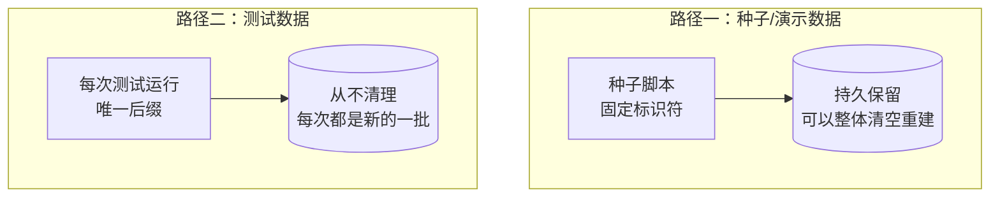
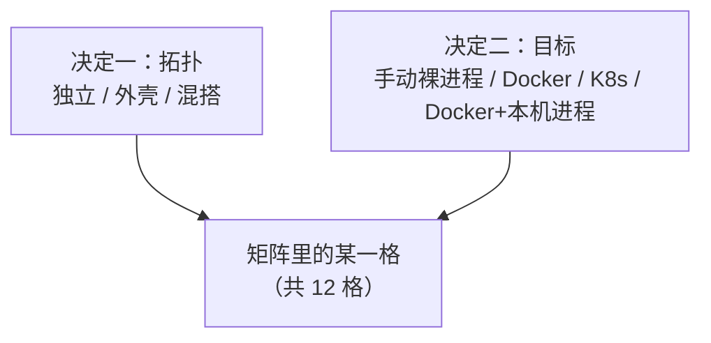

# BrickKit — 第 7 份，共 9 份 (中文)

包含: docs/zh/08-ai-guide/02-ai-dev-workflow.md, docs/zh/08-ai-guide/03-judging-a-requirement.md, docs/zh/08-ai-guide/04-component-doc-spec.md, docs/zh/08-ai-guide/05-fractal-reading.md, docs/zh/08-ai-guide/06-reading-brickkit.md, docs/zh/09-patterns/README.md, docs/zh/09-patterns/01-component-design.md, docs/zh/09-patterns/02-testing-strategy.md, docs/zh/09-patterns/03-seed-data.md, docs/zh/09-patterns/04-service-calling.md, docs/zh/09-patterns/05-deployment-selection.md, docs/zh/10-troubleshooting/README.md

下面 File 与包含里的路径都相对仓库根目录 https://raw.githubusercontent.com/brickKit/brickKit/main/ ；页内链接相对这份合集自己

下一份: https://raw.githubusercontent.com/brickKit/brickKit/main/llms/zh/08.md

---

> File: docs/zh/08-ai-guide/02-ai-dev-workflow.md

# AI 辅助开发工作流

任务一开始是一个需求而不是一个组件时——"用户应该能……"——先弄清它归哪个组件、合不合理、按什么顺序改，见
[判断需求、制定计划](../../docs/zh/08-ai-guide/03-judging-a-requirement.md)。下面的步骤从你已经知道要写或要改哪个组件开始。

## 写一个新组件

1. **读上下文。** 项目根的 `AGENTS.md`（团队约定，末尾是组件表）与 `brickkit.yaml`：项目里已经有什么、新组件要守哪些规矩、放在哪。
2. **读依赖。** 新组件要调用的每个组件：它的 `BRICKKIT.md`、`configSchema`、契约。只读直接依赖。
3. **生成骨架。** `brickkit new <scope>/<name>`（独立仓库用 `--path`，要契约占位用 `--contract openapi|proto`）。
4. **先写 `component.yaml`。** `dependencies`（精确版本）、`configSchema`（键就是环境变量名，密钥标 `secret: true`，平台推导不出的写成必填）、
   `deployment`、`healthCheck`、需要的话 `migration`。然后 `brickkit lint`。
5. **写契约。** 先把接口写进契约文件——调用方可以同时开工，你也有了验收标准。
6. **写代码。** 依赖地址从 `*_ENDPOINT` 读；弱依赖的变量可能不存在，用 `.get()` 读并写明降级；健康检查只查本进程；入口对不认识的参数立刻报错退出。
7. **写 Dockerfile。** 镜像里要有 `wget` 或 `curl`（HTTP 健康检查用），不以 root 运行。
8. **写组件的文档。** 给使用者的 `BRICKKIT.md`——六节，写 `component.yaml` 说不出来的东西；给下一个开发者的 `AGENTS.md`——代码地图、
   怎么构建和测试、设计取舍；再加上 `README.md` 的第一行。`brickkit lint` 会列出还剩的每一处占位。见
   [组件的文档](../../docs/zh/03-component-guide/08-component-doc-spec.md) 与 [组件文档（AI 视角）](../../docs/zh/08-ai-guide/04-component-doc-spec.md)。
9. **跑起来。** `brickkit add --local`、`brickkit build`、`brickkit up`；或者在组件仓库里建工作台联调（见 [分形的本地开发](../../docs/zh/03-component-guide/05-local-dev-fractal.md)）。
10. **测试。** 先写测试、看它变红，再让实现变绿（见 [测试策略](../../docs/zh/09-patterns/02-testing-strategy.md)）。

## 改一个已有组件

1. **读它的 `BRICKKIT.md`、`AGENTS.md` 与 `component.yaml`。** 尤其 `configSchema`、`dependencies`，以及 `AGENTS.md` 里的代码地图和易错点。
2. **判断是不是破坏性改动。** 删接口、改字段含义、改配置项的名字或含义、改默认值——都会影响使用方。
3. **改代码、改契约、改文档。** 放在同一个提交里：使用方看得到的东西变了改 `BRICKKIT.md`，代码地图或某个取舍变了改 `AGENTS.md`。
   别让文档落后于实现——文档和 `component.yaml` 对不上了（`DOC_OUT_OF_STEP`）、指向的代码挪走了（`DOC_PATH_MISSING`），`brickkit lint` 都会说。
4. **提版本号。** 改 `metadata.version`（它是版本号唯一的来源）：只改实现提修订号，加东西提次版本号，破坏性改动提主版本号。
5. **发布。** 提交、推送、`brickkit release`。
6. **在项目里升级。** `brickkit upgrade <组件>`；有配置冲突时由人决定保留哪个值。

**改默认值要慎重**：使用方没写过的键会自动跟随新默认值——这正是你想要的；写过的键会变成一处冲突，要他逐条决定。

## 在大项目里干活

项目有几十个组件、而任务只涉及其中一个时，别把它们全启动。

1. **用焦点运行。** 在组件目录里 `brickkit up`（或在项目任何位置 `brickkit up --focus <id>`），就只从源码运行这个组件和它需要的；
   每个组件旁边打印的原因说明了它为什么启动或不启动。`brickkit up --all` 回到整个项目。见[在项目里就地开发](../../docs/zh/02-project-guide/04-focus-run.md)。
2. **在你所在的位置运行命令。** 每个项目命令都会往上找项目；不带参数的 `build`、`deps`、`lint` 指的就是"这个组件"。
3. **显式地让版本往前走。** 你在 `components/` 下某个组件里调高了 `metadata.version`，`up` 会停下来，直到项目跟上：运行它建议的
   `brickkit upgrade <id>@<版本>`，并读一遍它报告的配置迁移。不会因为某个目录变了就跟着变。
4. **只保留一个 `components/`。** 永远不要把组件克隆或复制进另一个组件的目录；`up`、`lint`、`sync` 会拒绝嵌套的副本，BrickKit
   也从不替你挪——删之前先问人：那里可能是他改动的唯一一份。

## 不需要做的事

- **不需要读整个代码库。** 组件边界写在文件里，读当前组件和它的直接依赖就够。
- **不需要猜服务地址。** 它是 `http://<版本化服务名>:<端口>`，由平台注入。
- **不需要猜变量名。** 依赖地址按组件 ID 推；配置项的名字就是 `configSchema` 的键。
- **不需要写部署脚本。** 部署文件由 CLI 生成；你只改三层文件。
- **不需要记命令参数。** 用 `brickkit <命令> --help`。

## 该交给人的事

- 组件边界怎么划（这是领域判断）。
- 升级时配置冲突保留哪个值。
- 引入新的第三方组件、往 `installer.publicKeys` 加信任的公钥。
- 是否开启网络策略、ServiceAccount 隔离、`podSecurity: restricted`。
- 生产部署文件的改动。

---

> File: docs/zh/08-ai-guide/03-judging-a-requirement.md

# 判断需求、制定计划

来了一个需求——"客户要有信用额度""订单要加审批"。在写任何代码之前，有三个问题在项目的文件里就有答案：它归哪个组件、合不合理、
按什么顺序改。这一篇讲 AI 怎么照着写下来的东西回答它们，而不是凭猜。每个项目里都装着的 `brickkit-plan-change` 技能，讲的是同样的步骤。

## 先弄懂项目

按这个顺序读，够了就停：

1. **项目的 `AGENTS.md`**（已经在上下文里——Claude Code 每次会话都会通过 `CLAUDE.md` 读它）：项目约定、易错点，末尾是组件表，
   写着每个组件干什么。
2. **问题碰到的每个组件的 `BRICKKIT.md`**：负责什么、不负责什么，部署前要准备什么，依赖、配置和契约。它在
   `.brickkit/manifests/<id>/<version>/` 下；本地源里正好是这个版本时，在组件的源码目录里。
3. **要改某个组件，读它自己的 `AGENTS.md`**：代码地图告诉你从哪个文件开始；易错点和"改代码前自查"告诉你别弄坏什么。
4. **结构**：`brickkit deps <id>` 和 `brickkit graph` 看谁依赖谁；契约文件在 `.brickkit/artifacts/` 下。

不要把所有组件的文档都读进来：只读任务碰到的那几个。每份文件写什么，见[组件的文档](../../docs/zh/03-component-guide/08-component-doc-spec.md)。

## 找到负责的组件

组件表的"干什么"一列先把候选缩小，每个候选的 `BRICKKIT.md` 来定：它的 `组件定位` 一节写着这个组件**负责**什么、**不负责**什么——
每条"不负责"都写明了归谁。顺着这条指引走；它写在那里，就是为了不让人去猜。

## 对照写下来的东西检查

| 检查 | 写在哪 | 什么时候不通过 |
| --- | --- | --- |
| 负责组件的边界 | 它的 `BRICKKIT.md`，`组件定位` | 需求要它负责"不负责"里的事 |
| 项目约定 | 项目 `AGENTS.md` 的 `项目约定`，以及它链到的细则 | 需求违反了其中一条 |
| 已记录的决策 | 项目 `AGENTS.md` 说决策放在哪（它的查找路由表；没写就是 `docs/decisions/`）；组件的 `设计取舍` 与 `docs/` | 需求推翻了其中一个 |
| 依赖方向 | `brickkit deps`、`brickkit graph` | 新依赖会成环，或者与设计允许的方向相反 |
| 契约兼容性 | `artifacts` 下列出的契约文件 | 删除或改变了调用方在用的东西的含义——这是主版本，所有调用方都要跟着改 |

检查不通过，不等于这个需求不能做。它是一个该交给人的决定：改边界、改约定、推翻决策，是对系统的取舍，不是写代码时的细节。

## 结论只有四种

| 结论 | 意思 | 下一步 |
| --- | --- | --- |
| 一个组件就能承接 | 负责的组件就是它，没有冲突 | 计划并修改这个组件 |
| 要先改被依赖方 | 负责的组件需要某个依赖还没提供的东西 | 先改被依赖方的契约，再改调用方 |
| 需要新组件 | 没有组件负责它，也不该硬塞给谁 | `brickkit new <scope>/<name>` |
| 有冲突 | 上面某项检查没通过 | 停下来交给人，引出说明它的那个文件和小节 |

## 计划与动手

- **顺序：** 被依赖的先改，调用方后改——在 `brickkit deps <id>` 打印的树里，从叶子往根改；`brickkit up --dry-run` 打印的
  `📋 启动顺序（拓扑排序）：` 就是这个顺序（只列这次要启动的组件）。
- **每个组件一次提交：** 契约、代码、它的 `BRICKKIT.md` / `AGENTS.md` 一起改。文档落后于代码，下一个 AI 就会照着错的说明写代码。
- **版本：** 改 `metadata.version`——只改实现升补丁版本，新增升次版本，破坏性改动升主版本——然后发版，在项目里
  `brickkit upgrade <id>@<version>`。
- **在项目里用焦点运行测：** 在组件目录里 `brickkit up`，从源码跑它和它需要的东西（见[在项目里就地开发](../../docs/zh/02-project-guide/04-focus-run.md)）。

## 怎样才算做完

- 组件 `AGENTS.md` 里写的测试都通过。
- `brickkit lint` 对改过的东西没有文档警告。尤其是 `DOC_OUT_OF_STEP`：新加的依赖、必填键或契约文件，文档里还没提。

## 交给人决定的

- 改边界：让一个组件承担它写在"不负责"里的事。
- 违反约定，或者推翻已记录的决策。
- 破坏性的契约变更，以及调用方跟进的顺序。
- 要不要新建一个组件，以及它的边界。

---

> File: docs/zh/08-ai-guide/04-component-doc-spec.md

# 组件文档（AI 视角）

组件带两份为 AI 写的文档：`BRICKKIT.md` 写给**使用**这个组件的人，`AGENTS.md` 写给**开发**它的人。每份写什么、守哪些规矩，见
[组件的文档](../../docs/zh/03-component-guide/08-component-doc-spec.md)；这一篇讲 AI 怎么读它们、怎么写它们。

## 怎么读

### 在哪

**`BRICKKIT.md`。** 项目 `AGENTS.md` 末尾的组件表写着每个组件带了哪些文档（"文档"一列：`BRICKKIT.md`；带译本时是 `BRICKKIT.md +zh`；
没带是 `—`），表上面那一行给出它们在哪的规则：

- 本地源里放着这个组件、正好是这个版本的源码时，是那个源码目录里的 `BRICKKIT.md`；
- 否则是 `.brickkit/manifests/<scope>/<name>/<版本>/BRICKKIT.md`，由 `add` 或 `fetch` 缓存下来。

译本 `BRICKKIT.<语言>.md` 就在它旁边。不带后缀的那份是原文：译本说得不一样时，以原文为准。"主页"一列（`metadata.repository`）是组件的仓库，
给在网页上读的场合用——那里没有 `.brickkit/`。

**`AGENTS.md`。** 只在组件自己的仓库里：源码克隆在 `components/` 下时（本地源，或 `brickkit add --repo`）就在那里。它从不进项目的缓存——
使用这个组件的项目用不上它。

### `BRICKKIT.md` 的六节各给你什么

| 小节 | 拿来做什么 |
| --- | --- |
| 组件定位 | 判断这个组件是不是你要找的。"负责"与"不负责"两张表——每条都写明归谁——告诉你一个需求该落在哪 |
| 部署前准备 | `brickkit up` 之前必须先有的东西（数据库及其 schema 和角色、账号、证书）和由谁准备；告诉用户"好了"之前先查这些 |
| 依赖说明 | 每个依赖拿来做什么，缺了弱依赖时它怎么表现 |
| 配置指南 | 写 `config/<scope>-<name>.yaml` 时每一项该填什么——尤其默认值说不清的 |
| 契约索引 | 照着写调用代码的接口文件，以及它发布、消费的事件 |
| 外壳声明 | 它是不是外壳、编进了哪些成员 |

`BRICKKIT.md` 与 `component.yaml` 不一致时，以 `component.yaml` 为准（CLI 只认它）；把不一致告诉用户。

### 开发者的 `AGENTS.md`

要**改**这个组件时读它，只是调用它时不用读：

| 小节 | 拿来做什么 |
| --- | --- |
| 代码地图 | 每样东西在哪；每个功能从哪开始读、接着读什么——从它出发，别去扫目录树 |
| 构建与测试 | 确切的命令，以及成功是什么样子；就跑这些，别自己编 |
| 设计取舍 | 为什么是现在这样、否掉过什么；没读懂为什么之前，别推翻一个取舍 |
| 易错点 | 不许 / 症状 / 原因，只关于这个组件 |
| 改代码前自查 | 动手前过一遍的短清单 |

末尾那一段写着每个 BrickKit 组件都要守的组件规则。一个项目里每个组件都要守的规则写在那个项目的 `AGENTS.md` 里，这里不重复。

## 没有 `BRICKKIT.md` 时

项目组件表里"文档"一列是"—"，说明组件没带文档。退而求其次：

1. `component.yaml`：`metadata.description` 一句话定位；`dependencies`；`configSchema` 的 `description`、`default`、`required`。
2. 契约文件（`artifacts`）：接口。
3. 仍然不够时，告诉用户这个组件缺文档，而不是去读它的源码猜——猜出来的东西不是承诺。

## 怎么写

信息来源按可靠程度：

1. `component.yaml`：定位、依赖、配置项、是不是外壳——这些是事实，直接转述。
2. 契约文件：接口和事件的列表。
3. 组件代码：弱依赖缺失时代码里实际怎么做；某个配置项在代码里实际怎么用；写 `AGENTS.md` 时，东西实际在哪、实际怎么构建。
4. 用户：业务上"为什么"的部分——这个组件解决什么问题、刻意不做什么、某个配置怎么选、某个设计为什么这样选。

写的时候：

- **不重复 `component.yaml` 已经写明的东西**（类型、默认值本身），写它说不出来的：取值怎么选、改了会怎样、缺了依赖会怎样。
- **和代码放在同一个提交里改。** 使用方看得到的东西变了改 `BRICKKIT.md`，代码地图或某个取舍变了改 `AGENTS.md`。改了行为不改文档，
  下一个读它的 AI 就会照着错的说明写代码。
- **`BRICKKIT.md` 写给第一次见到这个组件、手边没有仓库的人。** 它在别的项目缓存里是单独被读的，所以不写相对链接：文件名用行内代码写
  （`api/openapi.yaml`），仓库外的东西用绝对地址。不要写内部实现细节——它们不是承诺。
- **译本跟着原文走。** 它是旁边的一份文件（`BRICKKIT.zh.md`），或者另一棵 `docs/<语言>/` 树里的同一页，小节和原文一样，和原文在同一个提交里改。
  读和写都对着原文；同一页的两个语言版本都读，等于把同样的事实往上下文里装两次。`AGENTS.md` 一般不翻译。
- **最后跑一遍 `brickkit lint`。** 它查小节、代码地图里的路径、链接、文档是不是还在说 `component.yaml` 说的事、剩下的占位、译本——
  都报成警告，每条写明文件和行号。

---

> File: docs/zh/08-ai-guide/05-fractal-reading.md

# 分形读取

BrickKit 是分形的：项目由组件组成，而一个正在开发的组件本身又是一个小项目。每一层都有一份写给读者的入口文件，而且每一层只讲它自己那一层的事。
AI 从上往下读，每一层读完就知道下一层该读哪一份——不需要一次把所有东西装进上下文。

## 三个入口

| 层 | 入口 | 读完知道什么 |
| --- | --- | --- |
| 项目 | 项目的 `AGENTS.md`（与 `.claude/skills/`） | 团队约定与易错点；末尾是平台规则摘要和组件表——有哪些组件、各干什么、文档与契约在哪 |
| 组件（要用它） | 组件的 `BRICKKIT.md` | 它负责什么、不负责什么、部署前要准备什么、怎么配、怎么调 |
| 组件（要改它） | 组件源码目录里它自己的 `AGENTS.md` | 代码在哪、怎么构建和测试、为什么这样设计 |

每一层都指向下一层：项目的 `AGENTS.md` 末尾是组件表和"每个组件的 `BRICKKIT.md` 在哪"的规则；调用方读组件的 `BRICKKIT.md` 就够了，
只有要改它的代码时才轮到它的 `AGENTS.md`。

组件本身开发时也是一个项目（它自己的工作台），所以同样的几层在组件仓库里重复一次——但**使用一个组件时，只读它对外发布的东西**
（`BRICKKIT.md`、`component.yaml`、契约），不读它仓库里的工作台文件。

## 读取顺序

1. 项目的 `AGENTS.md`：一次会话读一次就够。
2. 与当前任务有关的组件的 `BRICKKIT.md`：通常只有一两个。
3. 需要时，那个组件的 `component.yaml` 与契约。
4. 任务要改某个组件的代码时，那个组件自己的 `AGENTS.md`。
5. 需要时，三层文件里相关的那一层（部署文件或 `config/`）。

**什么时候停**：能回答当前任务的问题了就停。修一个组件的配置，读到它的 `configSchema` 和 `config/` 里那份文件就够了，不必再读它依赖的组件。

## 上下文窗口

- **不全量读取。** 项目里组件多了，把所有组件的文档都读一遍既浪费、也会把无关的细节带进判断。
- **按需读取。** 路由表（[文件路由表](../../docs/zh/08-ai-guide/01-ai-routing-table.md)）告诉你每个问题读哪个文件。
- **让 CLI 回答派生问题。** 谁依赖谁（`brickkit deps`）、这次谁跑（`brickkit up --dry-run`）、某个组件拿到什么变量（生成的部署文件）——
  这些都是从三层文件算出来的，自己去读三层文件推导，又慢又容易错。
- **不要找"合并视图"。** 平台刻意不提供把三层合成一份的命令：每个问题去读负责它的那一层，信息密度最高。

---

> File: docs/zh/08-ai-guide/06-reading-brickkit.md

# 读 BrickKit 本身

这个模块的其他几篇，讲的是 AI 在**使用 BrickKit 的项目里**怎么干活。这一篇讲的是 AI 读 **BrickKit 本身**：被要求讲解或评估这个平台、
回答一个关于它的问题，或者在这个仓库的克隆里开发它。

## 三条路线

| 任务 | 读什么 | 要抓几次 |
| --- | --- | --- |
| 了解、评估 BrickKit，或者读完全部 | [`llms/zh/00-core.md`](00-core.md)，再顺着每份的"下一份"往下读 | 核心一次；读全部则每份一次（有几份看 `llms.zh.txt` 里的清单） |
| 回答一个问题 | [`llms.zh.txt`](../../llms.zh.txt)：找到说明对得上的那一页，只抓那一页 | 两次 |
| 在本地克隆里开发 | [`AGENTS.zh.md`](../../AGENTS.zh.md)：文档地图（§9）与代码地图（§10） | 已经在上下文里——Claude Code 每次会话都会通过 `CLAUDE.md` 读它 |

在网页上，所有路径都相对仓库根目录：前面加 `https://raw.githubusercontent.com/brickKit/brickKit/main/`。英文文档树有同样的三条路线：
`llms/en/00-core.md`、`llms.txt`、`AGENTS.md`。

## 文档合集

文档一页一页地抓，又慢又容易读到一半就停，所以文档还以**合集**的形式提供：几份文件，合起来每页恰好一次。

- **`00-core.md`** 是 `AGENTS.zh.md` 加上讲清楚 BrickKit 是什么、怎么跑起来、核心概念、分形结构、三层文件的那几页。只读它就足以讨论这个平台。
- **`01.md` … `NN.md`** 按阅读顺序装着其余每一页。每份一直往里装，直到再装下一页就会超过 **100 KB** 为止，所以一次抓取就能读完一份；
  一页永远不会被拆到两份里。
- 每份开头写着它是第几份、包含哪些页、下一份的地址。里面每一页前面都标着 `> File: docs/zh/…`，读完合集之后，
  以后要回查哪一页，就知道该单独抓哪个文件。
- 合集里的链接仍然指向原来的文件，所以还看得出每条链接通向哪里。

## 在克隆里定位代码

`AGENTS.zh.md` 的 §10 是代码地图：`internal/` 与 `cmd/` 下每个包管什么；每条命令、每个跨模块的功能从哪个文件开始；测试和检查放在哪。
有测试守着它：漏了某个包、或者里面写的路径已经不存在，测试就失败，所以可以信它。构建、测试和各种约定见
[`CONTRIBUTING.zh.md`](../../CONTRIBUTING.zh.md)。

## 合集怎么保持最新

合集是生成出来的：`make generate-llms` 重新生成 `llms/` 和 `llms.zh.txt` 里的合集清单。仓库的提交钩子（每个克隆运行一次 `make hooks`
启用）在提交动到文档时自动跑它；合集过期时 `make lint` 会失败——所以网页端 AI 读到的，就是文档现在写的。

---

> File: docs/zh/09-patterns/README.md

# 推荐实践

前面的模块讲"怎么用"：命令做什么、文件怎么写。这个模块讲"怎么用好"——组件边界怎么划、怎么测、数据怎么造、调用怎么写才稳、项目该跑成什么形态。

这些都是**推荐做法，不是平台规则**。平台对组件内部怎么设计、怎么测试一概不管；下面的内容大多来自真实部署的复盘，
每篇都写明了哪些有实战背书、哪些只是推荐的顺序。用不用、怎么调整，由你判断。

适合已经用 BrickKit 跑起过项目、开始考虑"怎么做对"的开发者。

| 文档 | 回答什么 |
| --- | --- |
| [组件设计准则](../../docs/zh/09-patterns/01-component-design.md) | 组件多大合适；该做成组件还是配置开关；DDD 概念怎么对上；要避免的失败模式 |
| [测试策略](../../docs/zh/09-patterns/02-testing-strategy.md) | 后端四层、前端四层；组件自己的测试与跨组件集成测试；先立规格再写实现 |
| [种子数据设计](../../docs/zh/09-patterns/03-seed-data.md) | 演示数据与测试数据两条路径；为什么要物理隔离；种子机制绝不能进生产 |
| [可靠调用依赖](../../docs/zh/09-patterns/04-service-calling.md) | 依赖容器被换掉时，Go / Python / Node 的客户端各自会怎样；该怎么设超时和重试 |
| [部署形态选择](../../docs/zh/09-patterns/05-deployment-selection.md) | 独立 / 外壳 / 混搭 × Docker / K8s / 本机进程，一共 12 种组合各适合什么 |

---

> File: docs/zh/09-patterns/01-component-design.md

# 组件设计准则

这一篇是**推荐做法**，不是平台规则。组件内部的领域模型怎么设计，平台完全不管——那是造组件的人的事。
下面这套方法来自一次真实的生产部署：设计之前先研究，研究时留意一个特定的信号，再决定边界画在哪。

## 组件多大合适

**一个组件讲一个领域概念。** "人员基本信息"、"部门树"、"密码登录"、"角色授权"各是一个组件；
"人事系统"不是——它是一组组件。

**规模参考。** 项目自带的 10 个测试组件（`tests/components/`）代码量从两百多行到三千六百行左右。
这个量级有两个好处：

- 一个人或一个 AI 一次能读完、读懂整个组件，不需要在几十万行的代码库里连蒙带猜。
- 组件的边界写在 `component.yaml` 与契约里，读组件的人只需要读这两样加它的直接依赖。

这不是一条硬规定：一个组件长到五千行、而它确实只讲一件事，就不必为了数字去拆。
反过来，一个三百行的组件同时管着"订单"和"库存"，就该拆。行数是症状，领域概念才是判断依据。

## 从参考实现出发，不要从一张白纸开始

业务逻辑的设计，几乎总该先看看成熟软件怎么解决同一个问题。一个经过多年真实部署打磨出来的领域模型，
已经吸收了从零设计几乎必然漏掉的边界情况——这些漏掉的情况，通常在客户上线三个月之后才冒出来，而不是在设计评审时。

**顺序很重要，顺序反过来比不做研究还糟：**


| 步骤 | 做什么 | 为什么是这个顺序 |
| --- | --- | --- |
| 1. 先设计自己的版本 | 打开任何参考实现之前，先按自己项目的真实约束画一版草图 | 带着自己的方案去看，才看得出差异在哪；空着脑子去读，只会读出一份抄袭品 |
| 2. 只为想不通的部分去查 | 领域模型怎么切、状态机有哪些状态、哪些转换合法、哪些字段必填、边界情况怎么处理 | 这一步是研究，不是抄作业——你已经知道自己在找什么 |
| 3. 回来想清楚，再动笔 | 把学到的东西对照自己项目的真实约束重新消化 | 参考项目的技术栈和边界几乎不可能跟你一样；要借的是它的推理，不是代码 |

**闭源产品也值得参考**，哪怕读不到源码。你仍然可以观察它在真实世界里怎么被用：哪些功能客户天天用，哪些从来没人点，
哪些流程被抱怨了很多年。判断"某个能力值不值得拆成一个独立组件"时，这类信息往往比源码更有用——
而这个判断比任何实现细节都重要，因为它来得更早，也更难在事后纠正。

**关于许可证**：理解一个实现的推理，再独立地（哪怕换一种语言）重新实现，不构成衍生作品。要避免的是打开对方源文件逐行照抄。
按上面三步走，自然远离这条线。真要直接用代码，只限宽松许可证（Apache-2.0 / MIT / BSD），并保留原始版权声明。

**把参考过什么记下来**，写进组件的设计笔记，在实现之前写好。当时写很便宜；日后有人问"这个字段为什么长这样"时再去重建，就很贵：

```markdown
## 参考过的实现

| 项目 | 版本/commit | 参考的模块 | 借鉴了什么 | 许可证（已核实） | 用法 |
|---|---|---|---|---|---|
| Odoo | 17.0 | `addons/product/models/product_uom.py` | 计量单位换算系数的表设计与取整策略 | LGPL-3 | 借鉴推理 |
| 某闭源产品 | — | — | 多单位换算在日常使用中的真实模式 | 闭源 | 借鉴使用模式 |

**明确没有参考过的**（写清楚，免得后来的人以为是漏看了）：

**刻意避免的做法**（点名参考中发现的反模式，以及这个组件为什么不重蹈覆辙）：
```

"用法"一列只有三种取值：**借鉴推理**（读懂为什么这么设计，然后自己独立实现——绝大多数行都该是它）、
**借鉴使用模式**（闭源产品，或只看了文档与交互）、**照抄代码**（只允许 Apache-2.0 / MIT / BSD，保留版权声明，写清具体是哪个文件哪一段）。

## 参考实现里常见的弱点

读同一领域的几个成熟实现，常会发现它们共享同一批结构性弱点，多半是从同一种早期架构继承下来的。
读的时候认出它们，就是一次刻意不重蹈覆辙的机会：

| 常见弱点 | 怎么规避 |
| --- | --- |
| 所有模块共用一个进程、一个数据库，跨模块联表是家常便饭，模块边界成了随时可以跨过去的"软"边界 | 独立的组件、独立的 schema，边界靠访问权限而不是约定来守——这正是组件模型本来就给你的那条边界 |
| 定制靠运行时打补丁、往基础实现里挂钩子，每次升级都可能打断每一处定制 | 独立版本管理的 fork 加一份锁定的契约，升级变成一次显式的合并 |
| 一切靠元数据驱动（动态字段、通用"单据类型"），没有静态类型能在运行前抓到错误 | 一份真正的契约，加上在语言支持的地方用静态类型 |
| 报表直接查实时事务表，一条重查询拖垮交易路径 | 报表走汇总表或一个专门的组件，不碰实时事务路径 |
| 表无节制地增长，系统迟早被自己的历史数据压垮 | 从第一天起就给会持续增长的表设计分区和归档策略 |

## 该做成组件，还是配置开关：识别"槽位家族"

对比参考实现时，会反复遇到一种情况：**同一个特性在几个成熟系统里有真正不同的实现，而且每一种都合理，只是适合不同的客户。**

这不是"要不要做成可配置"的问题。它在提示你：这个特性需要的是**一组可互换的组件**，而不是在一个组件里藏一个开关。
判断全看那个限定条件：

- 对比之后发现其中一个**明显更好** → 那就是你唯一该实现的版本，不需要一组。
- 几种实现**各自站得住脚，服务真正不同的客户** → 值得做成一组互相独立、可以互换的组件。

| 特性 | 参考实现里的真实分歧 | 结论 |
| --- | --- | --- |
| 成本核算方法 | 移动加权平均 / 先进先出 / 标准成本 / 批次实际成本，各适合不同行业 | 做成一组 |
| 仓库拣货策略 | 先到期先出 / 先进先出 / 就近拣货 / 波次拣货 | 做成一组 |
| 审批路由 | 严格层级 / 按金额分级 / 矩阵式 / 规则引擎 | 做成一组——但它是业务逻辑，放进面向业务的组件，别指望平台机制来表达 |
| 单据编号方案 | 顺序号 / 按年月分段 / 按机构和类型分段 | **不是**一组——一个配置项就够 |
| 主数据记录上有哪些字段 | 各家只是"多几个字段、少几个字段" | **不是**一组——这是定制的事，不是架构的事 |

### 一组可互换的组件，在 BrickKit 上长什么样

1. **每个成员是一个独立组件**：自己的仓库、自己的 `component.yaml`、自己的版本历史。
   `pricing/costing-fifo` 和 `pricing/costing-standard` 是两个组件，不是一个组件的两种模式。
2. **每个成员对外的契约完全相同。** 照着一个成员写的调用代码，不改就能对着另一个成员工作——这才是"可互换"。
3. **不能有谁对某个具体成员声明依赖。** 一个组件的 `dependencies.components` 写的是精确的组件 ID 加精确版本，
   发布时就固化在它的 `component.yaml` 里，使用它的项目事后改不了指向；平台也不提供依赖别名
   （变量名由组件 ID 推出，看到 `PRICING_COSTING_FIFO_ENDPOINT` 就知道它指向谁，别名会让这条反推失效）。
   所以要调用这个槽位的组件，**不要**把 `pricing/costing-fifo` 写成依赖，而是在 `configSchema` 里声明一个地址配置项
   （例如必填、无默认值的 `COSTING_URL`），由拼装系统的项目在 `config/` 里填上它实际装的那个成员的地址。
   已经有谁对某个成员声明了依赖，那个成员就不再可替换了。
4. **写实现之前先把这一组定下来**：名字、共享契约、每个成员服务哪种客户、新项目默认装哪一个。

**不要在一个组件里写 `if costingMethod == "fifo"` 来敷衍一个真实的槽位信号。** 那等于把几类客户真正不同的需求塞进同一份代码，
从此每个客户的需求都牵制其他所有人的发版。**例外**：分歧小到两三个条件分支、看不到第三第四种变体的苗头——
为此专门拆出一整个组件，本身是另一种过度设计。

## 避免的失败模式

**上帝组件。** 一个组件什么都管：用户、权限、订单、报表。症状是 `configSchema` 有几十项、互相无关；
改一个功能要重新发整个组件；任何一处出问题整个组件重启。拆的方向见下一节的三个问题。

**过度依赖。** 一个组件直接依赖七八个组件。它的每个依赖都得先起来它才能起来，任何一个依赖改契约它都要跟着改。
两种常见原因：

- 它其实是一个**连接组件**（编排好几个独立组件完成一个流程）却被当成普通业务组件在写——那就把编排明确成它的职责，
  其他组件不要反过来依赖它。
- 它在替依赖做它们该做的事（比如自己去拼另一个组件的数据）——该把那部分能力还给对应的组件。

**过度拆分。** 两个组件之间有一条"任何时刻都必须同时成立"的规则，却被拆开了——跨组件没有事务，这条规则迟早被打破。

## 如果你的团队习惯用 DDD 的语言

不要求你用 DDD。这里只是一份对照：团队本来就用限界上下文、聚合这些词的话，它们在 BrickKit 里对应什么。
这一节没有真实部署的复盘背书，是把平台已有的机制翻译成 DDD 的说法，外加几条推荐判据。

| DDD 里的概念 | 在 BrickKit 里对应什么 | 为什么 |
| --- | --- | --- |
| 限界上下文 | 至少一个组件；一个组件不该横跨两个上下文 | 组件自己决定模型、自己管 schema |
| 聚合（一致性边界） | 必须放进**同一个组件** | 组件之间只有直接的请求/响应调用，平台不在调用路径上，没有跨组件事务可依赖 |
| 统一语言 | 组件 ID 与 `configSchema` 的键名 | 组件 ID 会原样变成调用方代码里的变量名（`people/basic` → `PEOPLE_BASIC_ENDPOINT`），取名用领域的词，不用实现的词 |
| 已发布语言 / 开放主机服务 | `artifacts` 里的契约文件 | 见 [契约与产物](../../docs/zh/03-component-guide/06-artifacts-and-contracts.md) |
| 客户—供应商 | 调用方在 `dependencies` 里钉死供应方的精确版本 | 没有隐式升级；升级是调用方自己的一次显式改动 |

**一处很容易搞反的用词。** DDD 里的"上游"是被依赖的供应方，"下游"是消费方。BrickKit 说"跟着上层走"时，
"上层"是**依赖别人的一方**——顶层是没有任何组件依赖它的那些。也就是说，BrickKit 的"上层"对应 DDD 的下游，"下层"对应 DDD 的上游。

**拆不拆，问三个问题**（推荐判据，不是平台规则）：

1. 这两块数据之间，有没有一条**任何时刻都必须同时成立**的规则（比如"余额永远不能为负"同时约束账户和流水）？有 → 放进同一个组件。
2. 它们要不要**各自独立发版、归不同的人或不同的客户**？要 → 拆开。一个组件就是一个发布单位、一个版本单位、一个权限单位。
3. 拆开之后，调用方只靠契约能不能写出调用代码，而不用知道对方内部有哪些表？不能 → 边界划错了，回到第 1 条。

这三个问题回答"两块东西该不该在同一个组件里"；上一节的槽位家族回答"一个特性该不该做成一组可互换的组件"。两者不冲突。

---

> File: docs/zh/09-patterns/02-testing-strategy.md

# 测试策略

这一篇是**推荐做法**。平台不管组件内部怎么测试：语言、框架、测试工具都由组件自己定，
平台只要求 `component.yaml`、健康检查、环境变量这三件事。
下面的分层方法来自一次真实生产部署（14 个组件、含前端，覆盖一条完整业务闭环）的复盘。
前端组件在平台眼里和其他组件一样——一个带端口、带健康检查的容器——所以这套方法两边都覆盖：先讲后端四层，再讲前端四层。

## 后端：四层测试


| 层 | 检验什么 | 具体内容 |
| --- | --- | --- |
| L1 契约测试 | 接口对外的形状 | 契约没有破坏性变更；每个接口在跨进程调用下真能调通——走真实协议、真实序列化，不是本地函数调用能过就算数 |
| L2 业务规则测试 | 这个功能该有的性质 | 不变量（余额不能为负）、合法的状态迁移、幂等性、边界情况 |
| L3 单元测试 | 这一版实现的分支 | 当前代码实际走的每条分支、每个条件、每条异常路径 |
| L4 集成测试 | 真实的端到端链路 | 接真实数据库、真实消息队列，从请求进来到落库或发消息，全程跑一遍 |

另有两个**贯穿每一层**的维度——不是第五层，而是写每一层时都要顺带覆盖：

| 维度 | 覆盖什么 |
| --- | --- |
| 权限与数据范围 | 不同身份、不同归属范围下能看到的数据边界。每一层都要带上，不是单独测一次就完事 |
| 跨组件调用 | 调用其他组件时走的是真实依赖而不是替身，见下文"组件测试与集成测试" |

### 区分 L2 与 L3

L2 和 L3 最容易混：两者都像在测"功能对不对"。一条判据就够：

> 把这个功能的实现整个删掉，换一种语言重写，这条测试还该成立吗？该成立 → L2；不该 → L3。

"同一个幂等键的两次请求只留下一条记录"——换 Go、换 Python 都必须成立，是 L2。
"金额字段被解析成 `Decimal` 而不是 `float`"——只对当前实现有意义，是 L3。

### 两个真实踩过的陷阱

**陷阱一：幂等性只测"重放一次"。**

| 不要 | 症状 | 该怎么做 |
| --- | --- | --- |
| 只测串行重放：发一次，再发一次，断言结果一致 | "先 `SELECT` 查有没有、没有再 `INSERT`"的实现，两个并发请求同时落进"还没查到"的窗口时各插一次，留下两条记录。串行重放永远撞不进这个窗口，测试稳定全绿 | 换成原子写入（如 `INSERT ... ON CONFLICT DO NOTHING`）；测试必须包含"多个带同一幂等键的请求同时到达，只有一个真正执行" |

**陷阱二：权限只测两端。**

| 不要 | 症状 | 该怎么做 |
| --- | --- | --- |
| 只测"有权限的人能看到该看的"和"零权限的人什么都看不到" | 权限分支写错、直接返回整张表：零权限用户在更早的地方就被拦了，有权限用户看到的行本身也没错（只是顺带看到了别人的）——两条测试都稳定通过 | 构造两条归属不同范围的数据（不同的 owner、部门、仓库），用其中一个身份查，断言结果里**完全不包含**另一个身份的数据，而不是只断言"非空"或"为空" |

## 组件测试与集成测试

### 组件自己的测试：独立运行

L1–L3 在组件自己的仓库里跑，不起其他组件，不需要 BrickKit。依赖组件的地址来自环境变量，测试里自己设就行；
弱依赖的变量可能根本不存在，把"变量不存在"也当成一个要测的输入——组件在这种情况下的降级行为是它自己的业务逻辑。

**替身（mock）可以用，但要知道它证明不了什么**：mock 只能证明"调用发生了"（参数对不对、调了几次），
永远证明不了"调用之后的结果对不对"。

### 集成测试：真实容器、跨组件调用

L4 用 BrickKit 把真实依赖拉起来。判断一个跨组件测试写得对不对，看三条：

1. **通过依赖组件的真实接口现场产出数据**，而不是绕过接口直接读写它的存储。
2. **依赖组件的契约里没有产出这份数据的能力，先把能力补进它的契约**——不绕开契约，不拿 SQL 直接写它的库。
3. **结果对不对，只有真实拉起依赖才能验证**——这正是 mock 做不到的那一半。

在组件自己的仓库里，用工作台把依赖拉起来（见 [分形的本地开发](../../docs/zh/03-component-guide/05-local-dev-fractal.md)）：
依赖跑在容器里，被测组件用 `mode: debug` 在本机跑，测试直接打它。

## 先立规格，再写实现（让 AI 写组件时尤其要紧）

这一节是**推荐的工作顺序**，没有上面那样的实战复盘背书。

**为什么顺序重要。** 先写实现、再补测试，测试就变成对已写代码的复述——它验证"代码做了它做的事"，而不是"代码该做什么"。
想让测试真有约束力，得先有一份不依赖实现的规格。组件恰好有三份，都在 `component.yaml` 里，不读一行实现就能拿到：

| 规格 | 在哪 | 约束什么 |
| --- | --- | --- |
| 配置说明书 | `configSchema` | 组件读哪些环境变量、默认值、哪些必填 |
| 依赖声明 | `dependencies` | 组件会收到哪些 `*_ENDPOINT`（弱依赖没在跑时**不会**注入，见 [环境变量注入契约](../../docs/zh/06-architecture/03-env-injection-contract.md)） |
| 接口契约 | `artifacts` 里的契约文件 | 组件对外承诺了什么（见 [契约与产物](../../docs/zh/03-component-guide/06-artifacts-and-contracts.md)） |

推荐顺序：

| 步 | 做什么 | 怎么知道这一步对了 | 要起容器吗 |
| --- | --- | --- | --- |
| 1 | 把 `component.yaml` 写完整：`dependencies`、`configSchema`（键、默认值、`required`）、契约文件 | `brickkit lint`，再在工作台里 `brickkit up --dry-run`（见下） | 否 |
| 2 | 照契约写 L1 | 此时必须全红，而且红得有理由（接口还没实现）。第一次就绿，说明它什么都没测到 | 否 |
| 3 | 把 L2 的每条业务规则先写成一句话，再翻成测试 | 同样必须先红 | 否 |
| 4 | 写实现，直到 L1、L2 全绿 | 测试就是验收 | 否 |
| 5 | 补 L3：这一版实现的分支 | 分支都走到 | 否 |
| 6 | 跑 L4：`brickkit up` 起真实依赖，走一遍真实链路 | 端到端跑通 | 是 |

**第 1 步的检查是 BrickKit 给的。** `brickkit up --dry-run` 不启动任何东西，但注入阶段的检查照常跑，
`component.yaml` 与 `config/` 对不上的地方在这里就暴露。下面是把 `demo/hello` 的配置键 `GREETING` 写成 `GREETTING` 时的真实输出（节选）：

```
⚠️ demo/hello@1.0.0：GREETTING 不在组件的 configSchema 里，不会生效
   文件：config/demo-hello.yaml
   已声明的配置项：GREETING
   建议：是不是想写 GREETING？
```

同一步还会拦下：配置项名撞上平台保留变量（警告）；`required` 里的键既没默认值、项目也没填（**阻断**，`--dry-run` 同样以退出码 1 停下）。

**第 3 步的写法。** 先写成"给定……当……则……"一句话，再翻成测试。陷阱一那条幂等规则写出来是：

> 给定一个还没处理过的幂等键；当两个带同一幂等键的请求同时到达；则只有一个真正执行，另一个拿到同一份结果。

这句话本身就是给 AI 最精确的提示，而且直接指向串行重放测不到的那个并发窗口。

## 前端：自己的四层

同一套思路——规格与实现分开、共享的东西优先于专属的、真实环境优于模拟——只是工具和边界不同：


| 层 | 检验什么 | 具体内容 |
| --- | --- | --- |
| FE-1 单元/逻辑 | 逻辑算得对不对 | 纯函数、组合式函数、状态管理；网络请求全部 mock，不管渲染 |
| FE-2 组件测试 | 共享 UI 部件本身 | 被多个页面复用的表格、表单模板、通用卡片——改坏一个等于改坏所有引用它的页面，优先级天然高于某个页面专属的部件 |
| FE-3 端到端 | 完整业务流程 | 真浏览器 + 真后端（整套拼装跑起来）。按"验证的业务流程"命名，不按"点了哪个按钮" |
| FE-4 视觉回归 | 页面之间间距、密度、用法是否一致 | 在 FE-3 走到关键页面时顺手截图对比，不单独再起一遍浏览器。基线随有意的界面改动一起更新 |

**FE-3/FE-4 什么时候写**：页面交互基本稳定之后再批量补。页面还在大改时，每次改动都要连带改选择器和断言，性价比很低。
骨架和目录约定可以提前定好。

**让 AI 跑 FE-3 或 FE-4 之前，先征得用户同意。** 贵的不是工具，而是"AI 真实驱动浏览器、靠截图或读 DOM 来调试选择器"这件事。
动手前说清这次测哪条流程、覆盖哪些页面，等用户确认。成本主要在写和调试阶段；已经稳定的套件跑一遍、出文本报告，和单元测试差不多。
降低首次编写成本：优先用无障碍树快照（结构化文本）确认元素，而不是每次截整页图；失败先看文本堆栈，查不出再截图；关键路径尽量由人录制。

**一个真实踩过的陷阱：没接住"后端拒绝了"。**

| 不要 | 症状 | 该怎么做 |
| --- | --- | --- |
| 数据加载写成 `try { await load() } finally { ... }`，不带 `catch`——因为 FE-1 里 mock 的后端永远成功 | 真实后端合法地拒绝（403、校验错误、连接中断）时，这次 reject 成了没人接住的异常：控制台一条框架警告，页面停在空白或加载态，用户看不到任何提示 | 每个加载/刷新函数都有明确的 `catch`，展示看得见的错误状态。这也是 FE-3 必须打真实后端的原因：mock 测不出"真实拒绝有没有被处理" |

**前端类型与后端契约漂移：靠机制杜绝，不靠多写测试。** 手写的前端类型注释里写着"对应后端契约"，却没有任何机制保证。
从后端契约（OpenAPI 文件、GraphQL schema）直接生成前端类型和请求函数，类型检查在编译阶段就拦下所有漂移，之后每加一个接口零额外成本。

---

种子数据与测试数据怎么规划，见 [种子数据设计](../../docs/zh/09-patterns/03-seed-data.md)。

---

> File: docs/zh/09-patterns/03-seed-data.md

# 种子数据设计

这一篇是**推荐做法**，是 [测试策略](../../docs/zh/09-patterns/02-testing-strategy.md) 的后续：那一篇讲怎么分层测，这一篇讲那些测试——以及一个人手动探索整套系统时——
真正跑在什么数据上。组件怎么管理自己的数据，平台不管；下面的方法来自同一次真实生产部署（14 个组件，一条完整业务链路）。

先说两个词：

- **种子数据**（也叫演示数据）：给人本地探索系统、做演示用的一批假数据，由脚本造出来，持久保留。
- **测试数据**：自动化测试在每次运行时现场造的数据，只服务那一条测试的断言。

## 两条路径



| | 种子/演示数据 | 测试数据 |
| --- | --- | --- |
| 用途 | 人本地探索、演示 | 各层自动化测试 |
| 怎么产生 | 固定标识符，幂等——重跑脚本不重建已存在的东西 | 测试每次运行时现场造，用时间戳或随机数做唯一后缀 |
| 生命周期 | 持久，可以整体清空 | 从不清理——行数堆积没关系，下一次运行有自己的新后缀 |
| 能不能共用 | 组件之间可以互相查找、复用（见下文） | 绝对不行——任何测试都不该依赖"这一行是别的测试留下的" |

**为什么"从不清理"反而更好。** 测试结束时清理，意味着测试中途失败就留下半截数据，下一次运行可能撞上它；
并发跑的两批测试还会互相删掉对方的数据。每次都用新后缀、从不清理，这两种问题一起消失——代价只是库里多几行没人看的数据。

## 物理隔离：永不共用存储

清空种子数据不该让任何测试变红；一次测试运行也不该弄脏一个人正在手动探索的数据。
两条路径混在一起，"这东西为什么突然坏了"就没有单一的排查方向——可能是有人清空了种子数据，也可能是别的测试并发跑了——两种原因的查法完全不同。

所以要**物理隔离**，而不只是逻辑上约定：测试连的是另一个数据库实例（至少是另一个库），不是同一个库里分两个命名空间。
一条集成测试往一行基线数据（默认仓库、默认成本中心）上写，而这一行恰好是演示时会读到的——只要共用物理存储，这个风险就一直在。

**在 BrickKit 里怎么做**：数据库地址本来就是组件的配置项，值由 `$var:` 引用公共变量。给测试单独一份部署文件，在它的 `vars:` 里指向测试库：

```yaml
# config/vars.yaml —— 平常（探索、演示）用的库
PG_HOST: pg.dev.internal
PG_PASSWORD: ${PG_PASSWORD}
```

```yaml
# config/people-basic.yaml
DB_HOST: $var:PG_HOST
DB_PASSWORD: $var:PG_PASSWORD
DB_NAME: people
```

```yaml
# deploy.test.yaml —— 跑集成测试时用：brickkit up -f deploy.test.yaml
target: docker
vars:
  PG_HOST: pg.test.internal
components:
  - id: people/basic
  # ……其余组件的条目照 deploy.yaml 抄过来：每份部署文件都要列全 brickkit.yaml 里的组件
```

`-f deploy.test.yaml` 那一次，所有 `$var:PG_HOST` 都得到测试库；平常仍是开发库。组件代码不需要知道自己连的是哪一个。

**别为了快换成内存数据库。** 你的数据库用到了内嵌替代品复现不了的特性（分区表、`SET LOCAL ROLE` 这类会话级设置）时，
换成一次性的替代品恰好牺牲了集成测试要证明的那件事——真实基础设施确实按预期工作。
"重建数据慢、测试互相污染"真正的解法是让**数据本身**一次性，也就是上面的"唯一后缀、从不清理"，而不是换一个数据库。

## 同一条覆盖底线，两种落地方式

两条路径共用一条底线：**任何组件都不该只有"一切正常"这一种数据。** 状态机的每条分支、每条失败路径、每个数据范围维度，
都要有真能触发它的数据。但达到底线的方式不同：

- **种子数据追求又多又全。** 它还要服务"一个人能不能完整体验这套系统"，数量和多样性本身就是目标。
- **测试数据追求少而准。** 每个测试只造恰好够验证自己那条断言的数据。唯一例外是针对核心不变量的属性测试（余额永不为负、
  状态机不跳到非法状态）：它需要数量，是为了让随机输入更可能撞上边界，和"体验完整"是两码事。

它们不是同一份数据的丰富版和精简版——目的不同，本来就该长得不一样。

## 种子数据怎样才算"够了"

这要刻意设计，不是单纯堆数量：

- **数据范围要真的有多个值。** 按部门、按 owner、按仓库的权限边界，只有数据里真存在多个值时，人才能点开验证。
  种子数据全挂在一个全能管理员名下，范围机制即使实现得对，在体验里也等于不存在。
- **数量要能撑出分页。** 列表做了游标分页，5 行数据永远只有一页——分页这份契约在体验里从来没存在过。
- **时间要分散**，不能全是刚创建的，"最近 N 天"、趋势图、按时间分区的逻辑才有东西可验。
- **负面和边界数据要真实存在**：一条禁用记录、一笔零余额、一张逾期未结的账、一次被拒绝的申请。只存在于脑子里的失败路径没法点开。
- **数据要能被查到。** 数据一多，就需要一个地方查"这个固定标识符代表什么"——否则新组件想复用无处可查，还可能撞上已被占用的标识符。
  一份统一维护的清单（组件、数据、数量、归属方）比每个组件各记一份划算。

## 组件之间数据重复没关系

这些数据全是假的，不存在污染真数据的顾虑。两个组件各自造了概念上类似的东西（各造了一个"示例客户"），不值得花协调成本去重。
一个组件需要和另一个类似的数据时，直接复用现成的，比商量"该归谁维护"便宜得多。

## 归属：每个组件自己造，先造依赖的

把种子数据集中到项目层，一旦有人只把某个组件连同它的依赖单独跑起来（这是很常见的用法），集中脚本就失效了——它只在所有组件一起跑时才管用。所以：

- **每个组件拥有、维护自己的种子数据。**
- **造自己那部分之前，先把每个声明过的依赖的种子数据造好**——强依赖和弱依赖一视同仁：开发和演示环境里，声明过的依赖通常本来都在跑；
  强弱之分服务的是真实部署时"这个可选模块要不要装"，不是种子数据的顺序。某个依赖在当前环境确实连不上，就跳过它、继续造自己的——
  依赖缺失让种子流程降级，而不是直接失败。
- **用组件自己的幂等机制交接，不另发明协议。** 下游需要依赖种子数据里的某个 id，就按双方约定的固定标识符去查那个依赖，拿到对应的行。

## 固定标识符被引用后就是一份契约

别的组件一旦查过某个固定的种子标识符，它就不能再删掉或改指别的含义——只能新增。像对待已发布契约里的字段一样对待它：
新增可以，破坏性改动需要和真正的契约变更同样的协调。

## 只增不减的表只能整体重置

一张表天生只增不减（流水账、已锁定的会计期间、审计日志），就不该有按行删除的种子清理——序列不会因为删了几行就回退，
硬删等于悄悄违反这张表自己的设计。正确的工具是完整的迁移重置（倒回全部迁移再重跑）；副作用是迁移自己灌的基线数据也会回来，
因为它属于重建的 schema，不是种子脚本的职责。

**经验法则**：只增不减的表只有整体重置；可以安全按行删除的表两种都行，日常优先用更轻的按行清理。

## 不能破的底线：种子机制绝不能进生产

任何造种子数据的机制，都绝不能有能力在真实客户的部署里种下一个真实凭据。一个测试账号或共享密码一旦混进"每次部署都会跑"的东西里
（比如打进镜像的数据库初始化脚本），就等于在每一次安装里都埋了一道后门。没有例外：

- **每次部署都真正需要的基线数据**（默认仓库、基础会计科目、标准计量单位）走迁移，不走种子脚本——它不是测试数据，是产品的一部分。
  组件的 `migration.command` 在主服务启动前、每次部署都跑，正是这类数据需要的"到处都跑、不可选"（见 [迁移服务](../../docs/zh/05-migration/01-migration-service.md)）。
- **真实部署里"第一个管理员怎么进来"是配置驱动的引导问题，不是种子数据。** 把第一个真实操作者的身份写进一个配置项，
  组件启动时读到它、幂等地给它授予管理员角色——没人手写 SQL，没有账号硬编码在任何地方。
  这和本地开发需要的"拥有全部权限的测试角色"是两个问题，两套机制不要互相替代。

## 测试数据还需要什么

- **事件或消息测试要有自己私有的 subject 或 topic**——和同一台机器上别的东西共用，真实消费者会和测试抢消息。
- **验证幂等消费（按唯一键去重）的测试，每次运行用不同的标识符**——用固定字符串，第二次运行在去重逻辑看来就是一次合法重放，
  会被悄悄吞掉，根本没走到被测代码。
- **测试数据不需要种子数据那些维度**——分页量、时间分散、可发现性。为和这条测试无关的目标多造数据，纯属浪费。

---

> File: docs/zh/09-patterns/04-service-calling.md

# 可靠调用依赖

依赖的地址是稳定的：`http://<版本化服务名>:<端口>`，比如 `http://demo-hello-1-0-0:8080`，由 Docker 或 Kubernetes 自己的 DNS 解析，
平台不运行任何注册中心。这条承诺讲的是**名字本身**。它没回答另一个问题：你的进程已经通过这个名字建立了连接，
名字背后的容器被换掉了（一次重新部署、一次崩溃重启、一次滚动更新），你的 HTTP 客户端接下来会怎样？

这一篇用一次真实实验回答它：Go、Python、Node.js 三种语言各自默认的 HTTP 客户端，能不能扛住依赖容器在一条已建立的连接背后被换掉。

## 实验怎么做的

一个 `docker compose` 项目：一个后端（`traefik/whoami`，只回显自己容器的 hostname——正好用来分辨响应来自旧容器还是新容器），
每种语言一个客户端，每 500ms 对 `http://backend/` 发一次请求，用的都是这门语言默认的长连接客户端：
Go 的 `net/http.Client`、Python 的 `requests.Session()`、Node.js 的 `http.Agent({keepAlive: true})`。

大约 25 次请求都打到第一个容器之后，把后端强制重建——删掉、起一个全新的容器，落在一个真正不同的 IP 上（用 `docker network inspect` 核实过）——
客户端照常轮询，完全不知道背后发生了什么。这正是真实部署里一次重新部署的样子：调用方永远收不到"对方要被换掉了"的信号。

## DNS 缓存与连接复用：三种语言各自发生了什么

**Go：失败一次，立刻失败，下一次就恢复。** 恰好落在切换那一刻的请求立即失败，没有卡住：

```
[ 25] t=21:31:55.147 status=200 took=632.03µs body="Hostname: 8bda437b989b"
[ 26] t=21:31:55.648 ERROR: Get "http://backend/": dial tcp: lookup backend on 127.0.0.11:53: server misbehaving
[ 27] t=21:31:56.150 status=200 took=1.173938ms body="Hostname: ce0eda814117"
```

`127.0.0.11` 是 Docker 内置的 DNS 服务器——这是一次真实的 DNS 解析失败，立刻以 `error` 冒出来。500ms 后的下一次请求已经打到新容器。
两次独立运行结果一致。Go 默认的 `Transport` 发现连接池里的连接死了，下次重新拨号、重新查 DNS——不需要关掉长连接，也不需要自己写重试。

**Python（`requests.Session`）：不报错，但悄悄卡了 2.5 秒。** 这是实验里唯一真正危险的结果。其他请求都是个位数毫秒，
落在那条失效连接上的那一次花了 **2.506 秒**，照样返回 `200`，没有任何异常：

```
[ 25] t=21:31:55 status=200 took=0.003s body='Hostname: 8bda437b989b'
[ 26] t=21:31:58 status=200 took=2.506s body='Hostname: ce0eda814117'
[ 27] t=21:31:58 status=200 took=0.001s body='Hostname: ce0eda814117'
```

没有报错、没有警告，唯一的痕迹是 `took=` 计时，而默认没有任何东西会去看它。`requests` 底层的连接池试图复用那个死掉的 socket，
写进了一个对端已经彻底消失的连接（没有 FIN，也没有 RST——那个容器的网络命名空间直接没了）。停在约 2.5 秒，是因为实验代码写了 `timeout=2`；
不写的话，Linux 自己的 TCP 重传会拖得远比这久。**不带 `timeout=` 的 `requests` 调用，没有任何上限。**

**Node.js（`http.Agent({keepAlive: true})`）：那一次请求会一直挂着，直到你自己设的超时。** 日志顺序是乱的，因为请求是异步的：

```
[ 26] t=21:31:56 status=200 took=3ms body="Hostname: ce0eda814117"
[ 27] t=21:31:56 status=200 took=2ms body="Hostname: ce0eda814117"
[ 28] t=21:31:57 status=200 took=3ms body="Hostname: ce0eda814117"
[ 25] t=21:31:57 ERROR: timeout
[ 29] t=21:31:57 status=200 took=1ms body="Hostname: ce0eda814117"
```

26–29 是切换之后发出的，全部立即打到新容器。25 挂在那条正在死去的连接上，自己从没恢复；它最终报错，只因为实验代码显式设了 2 秒超时并调用了 `req.destroy()`。
**不设超时，这次请求会无限期挂着**——Node 的 `http` 模块对单次请求没有默认超时。

## 这对你写代码意味着什么

**三种客户端都扛住了依赖被换掉——没有谁永远卡死在旧地址上。** 地址稳定的承诺站得住：不需要 DNS 缓存技巧、不需要关连接池、
不需要任何 BrickKit 专属的客户端代码。版本化服务名在下一次尝试时就重新正确解析了。

**但"最终会恢复"和"调用方完全没感觉"是两回事，三种语言里只有 Go 的默认行为两样都白送。** 具体建议：

- **每种语言、每一次对依赖的调用，都显式设请求级超时。** 这是实验真正验证过的一条：Python 的 `timeout=2`、Node 的 `timeout: 2000`，
  把开放式的卡死变成有上限的几秒。Go 的 `http.Client{Timeout: ...}` 也应该设，哪怕这次的失败方式恰好不需要它。
- **把对依赖的一次失败或变慢，当成普通的、可重试的事件**，而不是致命错误。一次带短退避的重试，就能吸收掉上面每种语言都出现的那一次抖动。
  重试是你自己代码的责任：什么样的重试合理，因调用而异，是业务判断；平台不插手熔断、重试、退避，因为统一的默认值对大多数调用都是错的。
- **"慢但成功"是真实的生产风险，不只是 Python 的怪癖。** 那 2.5 秒零报错、零日志。你的调用方超时比你短时，它看到的是一次失败，
  而你自己的日志里找不到任何解释。**你对依赖设的超时，要比你的调用方愿意等你的时间更短。**

## 在 Kubernetes 下：ClusterIP 抹掉了哪一种失败

实验跑在 Docker 下：容器被换掉时，Docker 内置 DNS 真的把 `backend` 解析到新 IP——这正是 Go 那次 DNS 报错、以及其他语言连接卡顿的直接原因。

在 Kubernetes 下机制不同，而且恰好抹掉了其中一种失败：`Service` 的 `ClusterIP` 在 Service 的整个生命周期里不变，
真正转发流量的是 `kube-proxy` 的规则（iptables 或 IPVS），它工作在 DNS 之下，把流量导向当前健康的 Pod。
客户端解析到的是 ClusterIP，不是某个 Pod 的 IP，它不会过期——所以 **Go 那一次 DNS 失败在 K8s 下不会出现**。

**没抹掉的是**：旧 Pod 的进程一退出，**那条 TCP 连接本身**照样死掉。Python 和 Node.js 那种连接池卡顿不是 Docker 独有的，
同样的建议（显式超时、失败可重试）在 K8s 下原封不动适用。

## 调用外壳里的成员

依赖的组件被编进了一个外壳时，你拿到的 `*_ENDPOINT` 写的是外壳的服务名加成员自己的端口：`http://<外壳的服务名>:<成员的端口>`
（见 [环境变量注入契约](../../docs/zh/06-architecture/03-env-injection-contract.md#依赖地址)）。成员自己的版本化服务名也解析到外壳：Docker 下是外壳容器的网络别名，
在 K8s 下是一个选中外壳 Pod 的 Service。调用方代码本来就读变量，写法完全不变，上面的结论也完全适用。区别只在于：外壳重启时，它承载的所有成员一起不可用，调用方看到的是同一次抖动。
外壳内部怎么把请求分给各个成员，见 [外壳开发指南](../../docs/zh/04-shell/05-shell-development.md)。

## 延伸阅读

- [环境变量注入契约](../../docs/zh/06-architecture/03-env-injection-contract.md)：依赖的地址怎么变成你环境里的 `*_ENDPOINT`
- [设计原则](../../docs/zh/06-architecture/05-design-principles.md)：为什么没有注册中心、为什么重试和熔断留给组件自己

---

> File: docs/zh/09-patterns/05-deployment-selection.md

# 部署形态选择

这一篇只回答一个问题：**一个有 N 个组件的项目，到底该跑成什么样。** 它不教你怎么造外壳（见 [外壳开发指南](../../docs/zh/04-shell/05-shell-development.md)），
也不讲把一个组件放进外壳的具体步骤（见 [成员管理](../../docs/zh/04-shell/04-members-management.md)）。还没决定项目整体长什么样时，先读这一篇。

## 两个决定，外加一个开关

**决定一：拓扑——组件最终收拢成几个容器？**

- **全部独立**：每个组件各自一个容器（或 Pod）。什么都不多写就是这个形态。
- **全部进外壳**：能合并的组件尽量编进少数几个外壳，一个外壳一个容器。
- **混搭**：一部分进外壳，一部分独立。这通常是常态，不是妥协：有些组件**结构上**就进不了外壳——一个由 nginx 提供服务的纯前端没有可以编进去的后端进程；
  一个无状态的网关常常故意保持独立，好按自己的负载单独扩缩容。

外壳自己是一个普通组件（`brickkit.yaml` 里标着 `kind: shell`），它能承载哪些成员写在它的 `component.yaml` 的 `shell.members` 里；
**这一次承载哪些**写在部署文件里——成员条目嵌在外壳条目的 `members` 下面。所以拓扑是**按部署文件**决定的：
开发机的 `deploy.yaml` 可以全部独立，生产的 `deploy.prod.yaml` 可以把几个成员收进外壳，`config/` 一个字都不用改。

**决定二：部署目标——`docker`（或 `podman`）还是 `k8s`**，写在部署文件的 `target` 里。这几乎完全是基础设施问题，不是性能问题：
你有没有 Kubernetes 集群、需不需要跨机器调度和自愈？没有的话，`docker` 在单机上用 `docker compose` 驱动一切，运维最简单，
适合本地开发、演示、小规模或单机的生产。有的话，`k8s` 生成 Deployment / Service / Ingress。拓扑的决定原样适用，换目标只是换一份部署文件。

**开关：`mode: debug` / `mode: local`——把一两个组件拉到你的机器上以本机进程运行，其余照常在容器里跑。**

- `mode: debug`：进程由你在 IDE 里启动，平台只负责让别人找到它。只能写在个人的 `deploy.local.yaml` 里。
- `mode: local`：平台自己识别启动命令、启动并看管这个进程。

两者都**只在 Docker / Podman 下存在**，部署目标是 `k8s` 时被拒绝——集群里的 Pod 到不了你的笔记本。
它们能和任何一种拓扑组合：本机进程可以依赖独立组件、外壳，或者外壳里的某个成员；外壳里的成员自己也可以被单独拉出来调试。

两个决定是真正独立的两根轴，所以是一张矩阵，而不是几个预设名字：



## 平台之外的一种方式：手动跑起来

没有任何东西阻止你把每个组件当成普通进程启动（`go run`、`uvicorn`，或者你的语言对应的命令），完全不经过 `brickkit up`。

**先说清边界：这不是平台管理的形态，平台甚至不知道它存在。** 依赖解析、环境变量注入、健康检查、迁移顺序、服务发现统统不会发生，因为你没调用它。
每个进程听哪个端口、真实部署会注入的每一个变量、启动顺序，全部要你自己还原。这是"CLI 跑完就退出、没有常驻服务"的直接结果：平台只在命令运行的那一刻存在。

它仍然完全正当、非常常见——通常是最快的开发循环（不用构建镜像，断点直接挂上去）。

**一个值得知道的技巧：让 CLI 替你算出环境变量。** 在 `deploy.local.yaml` 里临时把要手动跑的组件标成 `mode: debug`，跑一次 `brickkit up --dry-run`，
读生成的 `.brickkit/generated/local-debug.<版本化服务名>.env`——那正是一次真实部署会喂给它的完整变量。比如 `shop/order` 依赖外壳里的成员 `shop/stock`：

```text
COMPONENT_ID=shop/order
COMPONENT_VERSION=0.1.0
SHOP_STOCK_ENDPOINT=http://localhost:18082
```

抄下需要的部分，再把那一行删掉（或 `brickkit local off`）。`deploy.local.yaml` 本来就不提交，不会影响任何人。
这个技巧覆盖不到一件事：你在 `config/` 里手写的、假设了容器网络的地址（比如 `http://host.docker.internal:8000`）——平台不解析配置值的内容，
不会替你改写成 `localhost`，这一点和 `mode: debug` 本身一样。

## 矩阵

|  | 手动裸进程 | Docker | K8s | Docker + 本机进程 |
| --- | --- | --- | --- | --- |
| **全部独立** | [1. 外壳出现之前的开发起点](#1-全部独立--手动裸进程) | [2. 单机装得下时的标准形态](#2-全部独立--docker) | [3. 资源最充裕的一端](#3-全部独立--k8s) | [4. 调一个组件，其余保持真实](#4-全部独立--docker--本机进程) |
| **全部进外壳** | [5. 单独测外壳自己的编排](#5-全部进外壳--手动裸进程) | [6. 单机装不下时压内存](#6-全部进外壳--docker) | [7. 资源最紧的一端](#7-全部进外壳--k8s) | [8. 调一个组件，外壳保持真实](#8-全部进外壳--docker--本机进程) |
| **混搭** | [9. 用上外壳之后的日常开发](#9-混搭--手动裸进程) | [10. 大多数真实项目的归宿](#10-混搭--docker) | [11. 资源适中的中间点](#11-混搭--k8s) | [12. 最贴近真实开发的组合](#12-混搭--docker--本机进程) |

没有第 13 格"K8s + 本机进程"：部署文件里 `mode: debug` / `mode: local` 碰上 `target: k8s`，装载阶段就被拒绝，报错指出是哪个条目（`components[N].mode`）。

### 1. 全部独立 × 手动裸进程

**是什么**：用到的每个组件都是你手动启动的普通进程，没有容器，也不经过 `brickkit up`。

**什么时候用**：单组件开发最常见的起点，尤其项目里还没有外壳时。想要最快的"改代码—看效果"循环。

**好处**：没有构建镜像这一步；进程和它连的地址之间没有容器层，出问题只有两个变量要查；不需要装 Docker。

**代价**：注入、健康检查、服务发现、迁移顺序都要自己还原；组件一多，手动拼十几份环境变量是真实的体力活，也容易错。上面那个 `--dry-run` 技巧能省掉大半。

### 2. 全部独立 × Docker

**是什么**：每个组件一个 Compose 服务，`brickkit up` 端到端驱动：地址注入、健康检查、按依赖顺序启动、迁移。

**什么时候用**：组件数量单机装得下时的默认形态。"装得下"是个真实的数字：每个进程的内存底线几乎完全由语言运行时决定——
Go / Rust 8–20MB，Python / Node 40–90MB，JVM 200–450MB（这是各语言运行时的一般量级，你的组件以实测为准）。20 个空闲的 Go 组件加起来不到半个 G；20 个空闲的 Spring Boot 组件，一件事都没做就已经 4–9G。
留在这一格，直到这笔账在你要部署的机器上真的算不过来。

**好处**：每个组件能单独启停，出事只影响它自己；一个组件对应一个容器、一份日志、一个健康状态，排查最简单。

**代价**：每个组件各付一份运行时内存底线——这正是外壳存在的原因；单机形态，没有跨机器调度与自愈。

**值得知道**：觉得"装不下"之前先量（`docker stats`），别照着表拍数字——50 个组件的项目本地可能只跑几个，因为大部分这次 `mode: disable` 了，或者没有谁需要它们。

### 3. 全部独立 × K8s

**是什么**：每个组件一个 Deployment + Service，地址由集群原生的 Service DNS 解析。

**什么时候用**：集群资源宽裕，不需要用合并去换更低的内存底线。每个组件保留自己的 `replicas`、自己的 `resources`。

**好处**：真正独立的水平扩缩容；跨机器调度与故障恢复按组件生效。

**代价**：运维复杂度最高——需要真正的集群管理能力；执行 `up` 的机器上要装 `kubectl`；组件多就意味着 Deployment / Service 对象多。

**值得知道**：K8s 下 `expose: true` 必须配 `hostname`（Ingress 按域名路由），Docker 专属的 `exposePort` 不起作用；漏配 `hostname`，`up --dry-run` 就会拦下。
`config/` 里假设了单机 Docker 网络的地址，换到 K8s 要自己改——用部署文件的 `vars:` 按环境给不同的值最省事。

### 4. 全部独立 × Docker + 本机进程

**是什么**：除了你标成 `mode: debug` 或 `mode: local` 的组件，其余都是真实容器。平台让其他容器把这个组件的版本化服务名解析到你的机器（`extra_hosts` 指向 `host-gateway`）；
调用方拿到的服务名不变——`extra_hosts` 只改变它解析到哪里；端口换成你的 `localPort`，缺省就是组件声明的端口，所以地址常常一个字都不变。

**什么时候用**：既要"其余部分是真实的"，又要"改这一个组件不想重新构建镜像"。它只是开发期的叠加手段，不决定生产拓扑。

**好处**：组件代码零改动；可以同时拉出好几个组件，各用各的 `localPort`；本机进程依赖的一切拿到的仍是平台算好的真实地址。

**代价**：连不上时要先问"这个名字解析到了我的机器还是某个容器"，而不是泛泛地查网络；`config/` 里手写的容器网络地址不会被改写。

**值得知道**：`mode: debug` 的组件有一份 `local-debug.<服务名>.env` 供 IDE 加载，多行值、含特殊字符的值都已按 shell 规则转义。
它**不跑数据库迁移**——迁移步骤跟着它的容器一起没了，组件有迁移时第一次要自己手动跑（见 [本地调试工作流](../../docs/zh/02-project-guide/03-local-debug-workflow.md)）。

### 5. 全部进外壳 × 手动裸进程

**是什么**：外壳自己的程序直接在你机器上启动，不经过任何编排。你测的是外壳自己的多模块编排逻辑。
平台不在场，`BRICKKIT_SERVED_MEMBERS` / `BRICKKIT_SERVED_MEMBERS_CONFIG` 要你自己拼（或为测试写死）。

**什么时候用**：几乎只有造外壳、测外壳的人需要：脱离容器层验证外壳的启动顺序、健康检查、模块之间的故障隔离，再交给真实部署。

**好处**：外壳开发最快的循环；能把"外壳编排的 bug"和"容器层的问题"彻底分开。

**代价**：平台的保证在这里都不存在——只能证明外壳在你自己拼的数据下表现正确。两个变量的精确形状见 [JSON 注入](../../docs/zh/04-shell/02-json-injection.md)。

**值得知道**：外壳里的模块注册表要按**完整的组件 ID 加版本**做键，才能在真实部署里同时承载一个组件的两个版本——这个坑只有真的喂两个版本进去才会暴露，值得在这一格故意练一遍。

### 6. 全部进外壳 × Docker

**是什么**：尽量多的组件编进少数几个外壳；每个外壳一个 Compose 服务，成员不生成自己的服务容器。
调用方拿到的成员 `*_ENDPOINT` 指向外壳：`http://<外壳的服务名>:<成员自己的端口>`。成员自己的版本化服务名也保留着，是外壳容器的网络别名；
调用方代码本来就读变量，不用改。

**什么时候用**：第 2 格那笔内存账真的算不过来时——不要提前用。动手之前先试更便宜的办法：给贵的组件换更轻的运行时
（JVM 组件编成 GraalVM 原生镜像，内存底线从几百 MB 掉到几十 MB，部署形态不变）；确认拉高数字的组件是不是这次本来就可以 `mode: disable`。

**好处**：一个外壳只背一份运行时底线、一份连接池，而不是 N 份；容器少，启动快，要盯的日志和重启对象也少。

**代价**：共用一个外壳的成员共享故障域（一处崩溃可能拖垮其他模块，除非外壳造得足够小心），也共享扩缩容单位（没法单独给某个成员加副本）。

**值得知道**：
- 成员的迁移**仍由平台跑**：用成员自己的镜像、自己的配置，外壳等它成功才启动（见 [与外壳的交互](../../docs/zh/05-migration/04-shell-interaction.md)）。所以每个成员都必须有自己的镜像。
- 本机构建的外壳镜像，`brickkit build` 会在标签里记下编进了哪些成员版本，`up` 拿它对照外壳 `component.yaml` 的 `shell.members`：
  对不上就停下（`IMAGE_STALE`），而不是让一个少编了成员的外壳悄悄跑起来。没有这个标签的镜像（手工构建的）只警告（`IMAGE_UNVERIFIED`）；
  拉取的镜像不查——发布出去的版本，镜像与 `component.yaml` 天然一致。
- 成员条目上描述"自己容器怎么部署"的字段（`expose`、`replicas`、`resources` 等）在外壳里不生效；它们留着是为了成员回落成独立组件时生效。
- 放进外壳之后可能出现启动等待环，`up` 会拦下并给出三条出路（见 [成员管理](../../docs/zh/04-shell/04-members-management.md#合并造成的启动环与-skipwaitfor)）。

### 7. 全部进外壳 × K8s

**是什么**：同样的合并，对接集群：每个外壳一个 Deployment；每个成员一个 Service，`selector` 选中外壳的 Pod、端口用成员自己声明的端口；成员不生成自己的 Deployment。

**什么时候用**：集群资源真的紧张，把总开销压到最低比单独扩缩容某个成员更重要。

**好处**：同时拿到"合并省内存"和"K8s 自愈、跨机器调度"两边的好处。开了网络策略时，成员的调用方和依赖方会自动算进外壳的规则。

**代价**：第 6 格的每条代价原样成立；第 3 格的每条 K8s 代价也原样成立——合并不会降低 K8s 本身的要求。

**值得知道**：K8s 下 Pod 之间没有启动顺序，所以合并造成的等待环在这里不拦，`skipWaitFor` 写了也只警告、不生效；成员的迁移照样是它自己的 Job。

### 8. 全部进外壳 × Docker + 本机进程

**是什么**：第 4 格的叠加，只是"其余部分"是外壳。两个方向都通：

- 本机进程依赖某个成员：它拿到的地址是真实的 `http://localhost:<端口>`——映射开在**外壳**的 Compose 服务上（成员没有自己的服务），端口是成员自己声明的、外壳本来就必须监听的那个。
- 某个成员本身被拉出来：在 `deploy.local.yaml` 里给外壳条目 `members` 下的那个成员写 `mode: debug` 和 `localPort`，外壳这次就不承载它，它在你的机器上运行。

**什么时候用**：你正在改的那个组件，要对着真实的、已经合并的其余部分说话，又不想重新构建任何镜像。

**好处**：不需要知道某个成员具体在哪个外壳里；其余部分保持完整真实。

**代价**：第 4 格的每条局限原样适用。把成员拉出来调试之后，外壳这次少承载一个模块——外壳对 `BRICKKIT_SERVED_MEMBERS` 里少了一项的处理要正确。

### 9. 混搭 × 手动裸进程

**是什么**：这次用到的组件，按各自真实的形态手动启动——独立组件照第 1 格，外壳照第 5 格。

**什么时候用**：项目的生产拓扑已经用上外壳之后的日常开发。只起你要改的那几个，本地结果依然反映真实的地址解析和跨进程调用。

**好处**：规模过了"全部独立"之后仍保留最快的循环；按真实形态还原，能在本地就撞上形态相关的 bug（比如外壳注册表键错了）。

**代价**：手工准备最重的一格；没有任何东西检查你手工搭的"谁在哪"是不是和部署文件对得上。

### 10. 混搭 × Docker

**是什么**：一部分独立容器，一部分在外壳里，`brickkit up` 一次驱动整套。谁在哪，完全由部署文件里条目的位置决定（顶层，还是某个外壳的 `members` 下）。

**什么时候用**：一个成熟项目通常的归宿，而且通常是**结构性**的，不是资源折中——前端、网关这类组件本来就不该进外壳。拿不准一次本地化交付该选哪一格时，这通常是答案。

**好处**：需要独立的地方独立，其余地方省内存；两种条目并排写在同一份部署文件里，不需要特殊处理。

**代价**：排查时要同时带着两套心智模型；合并那一半的代价和独立那一半的代价各自原样成立，混搭不会把它们平均掉。

**值得知道**：同一个组件的老版本独立运行、新版本在外壳里，可以零协调共存（见文末）。

### 11. 混搭 × K8s

**是什么**：第 10 格的混合拓扑对接集群：独立组件各自 Deployment + Service，成员的 Service 指向外壳 Pod。

**什么时候用**：资源不紧也不宽裕：大部分组件留在外壳里压住总开销，把真正需要独立副本数或资源配额的几个挑出来单独部署。
和第 10 格不同，这里的混搭常常是**资源调优**决定——一个结构上完全可以合并的组件，因为要单独扩缩容而被主动拆出来。

**好处**：资源分配最灵活；地址解析、网络策略原生支持混搭，不需要额外配置。

**代价**：同时背上完整的 K8s 运维代价和完整的合并代价；出问题时要查的地方最多：K8s 本身、外壳内部编排、普通容器。

### 12. 混搭 × Docker + 本机进程

**是什么**：真实的混合拓扑跑在 Docker 里，再拉一个组件到你的机器上。最贴近真实开发的组合，因为"其余部分"就是项目的真实生产形状。

**什么时候用**：你正在改的组件，要对照项目真正会用的那套拓扑。

**好处**：不碰生产，却最接近"对着生产调试"；两个方向的地址解析都通（见第 4、8 格）。

**代价**：要同时理解外壳合并、本机进程的地址解析、普通容器的行为——没有更简单的心智模型可以退回去。

## 贯穿 12 格的一条结论：多版本共存不用额外操心

哪一格都不改变同一组件多个版本共存的行为。版本化服务名让共存与拓扑、与部署目标都无关：老调用方和新调用方、独立运行的版本和外壳里的版本，
都能在同一次部署里共存。平台不检查新老版本之间能不能正确协作——守住契约兼容是组件作者的责任（见 [多版本共存](../../docs/zh/03-component-guide/09-multi-version-coexistence.md)）。

## 对比两个环境

每个环境一份完整的部署文件，所以对比两个环境用不着专门的命令，两次普通的 `diff` 就够：

1. `diff -u deploy.yaml deploy.prod.yaml` 看**你写了什么不同**。
2. 两次 `up --dry-run` 的输出做 `diff`，看**这些不同带来的后果**——哪些组件因此不启动、为什么。

下面是真实输出：`demo/caller` 强依赖 `demo/hello`、弱依赖 `demo/bus`；生产文件换成了 `k8s`，并关掉了 `demo/hello`：

```text
$ diff -u deploy.yaml deploy.prod.yaml
--- deploy.yaml
+++ deploy.prod.yaml
@@ -1,10 +1,8 @@
-# deploy.yaml —— 这个项目怎么部署：部署目标，以及哪些组件运行、怎么运行。
-# 团队文件：请提交它。个人的那份是 deploy.local.yaml（brickkit local on）。
-target: docker # docker | podman | k8s
-
+target: k8s
 components:
   - id: demo/hello
+    mode: disable
   - id: demo/bus
   - id: demo/caller
     expose: true
-    exposePort: 18080
+    hostname: shop.example.com
```

```text
$ diff <(brickkit up --dry-run 2>&1 | grep -v '^{') \
       <(brickkit up --dry-run -f deploy.prod.yaml 2>&1 | grep -v '^{')
1c1,2
< 🚀 启动项目 my-shop（target: docker）
---
> 使用 deploy.prod.yaml（--file）
> 🚀 启动项目 my-shop（target: k8s）
3,5c4,6
<    ✅ demo/hello@1.0.0   启动（demo/caller 需要）
<    ✅ demo/bus@1.0.0     启动（demo/caller 需要）
<    ✅ demo/caller@1.0.0  启动（顶层）
---
>    ⬜ demo/hello@1.0.0   显式禁用（mode: disable）
>    ⬜ demo/bus@1.0.0     不启动（上层都不启动）
>    ⬜ demo/caller@1.0.0  不启动（强依赖 demo/hello 不启动）
```

（第二段 `diff` 后面还有启动顺序与生成文件的差异，这里截掉了。）

第二段直接给出后果：不只 `demo/hello` 不启动，`demo/caller` 也跟着不启动（它强依赖 `demo/hello`），`demo/bus` 没有上层需要它，也不启动。
只看第一段的 `mode: disable` 那一行，推不出这些。

- `grep -v '^{'` 滤掉 CLI 写在 stderr 上的 JSON 日志行，否则它们混进人读的输出，`diff` 出一堆噪音。
- 这里比的是**启动决策**，不是生成的部署文件本身：一边是 `compose.yaml`，一边是一组 Kubernetes 清单，本来就没法逐行比。

---

> File: docs/zh/10-troubleshooting/README.md

# 故障排除

出了问题，按场景找到对应的一篇，再按症状找到那一节。每一节都是同一个格式：

- **症状**：你看到了什么——一段报错、一个没生效的配置、一个连不上的地址。
- **原因**：为什么会这样。
- **解决**：怎么改。

| 场景 | 文档 |
| --- | --- |
| `brickkit up` / `down` 失败，组件起不来 | [up / down 常见问题](../../docs/zh/10-troubleshooting/01-up-down-issues.md) |
| 在 IDE 里调试组件、本机进程 | [本地调试问题](../../docs/zh/10-troubleshooting/02-local-debug-issues.md) |
| `config/` 里的冲突块、`$var:` 找不到、配置没生效 | [配置冲突问题](../../docs/zh/10-troubleshooting/03-config-conflict-issues.md) |
| 从 Git 仓库取组件失败 | [Git 鉴权问题](../../docs/zh/10-troubleshooting/04-git-auth-issues.md) |
| `brickkit build`、镜像 | [构建问题](../../docs/zh/10-troubleshooting/05-build-issues.md) |
| 外壳与成员 | [外壳问题](../../docs/zh/10-troubleshooting/06-shell-issues.md) |
| 数据库迁移 | [迁移问题](../../docs/zh/10-troubleshooting/07-migration-issues.md) |
| `brickkit lint`、编辑器里的 JSON Schema、`AGENTS.md` 的组件表 | [lint 与 Schema 问题](../../docs/zh/10-troubleshooting/08-lint-and-schema-issues.md) |

**报错里有错误码时**，先查 [错误码参考](../../docs/zh/06-architecture/09-error-codes.md)：它按错误码列出了 CLI 会打出的每一个错误标题，
直接拿标题在那一页里搜就能找到原因与解决办法。这个模块补的是错误码覆盖不到的那部分——没有报错、但结果不对的情况，以及报错背后更长的来龙去脉。
